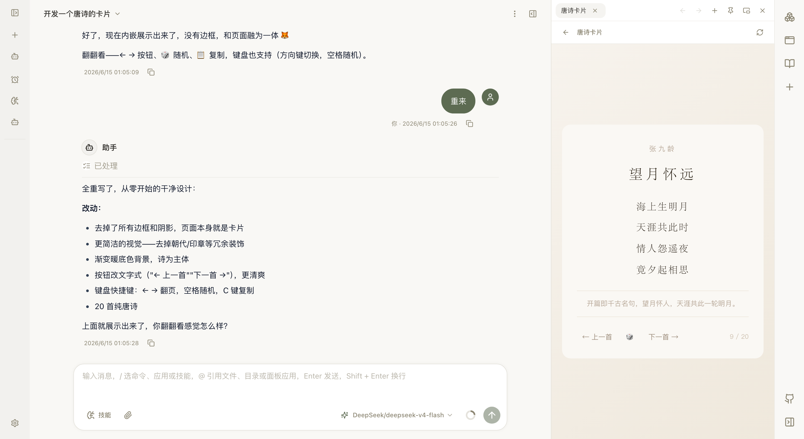

<p align="right">
  <a href="./README.zh-CN.md">简体中文</a>
</p>

<div align="center">


# NextClaw

**Your long-term personal AI partner.**

Tell NextClaw what you want done. It brings the conversation, files, tools, and generated results into one workspace—and keeps working until there is something useful to deliver.

</div>

[](https://nextclaw.io/en/)

<div align="center">

**From one request to a usable result, without losing the work in between.**

[Download & Install](https://nextclaw.io/en/download/) · [Explore Use Cases](https://nextclaw.io/en/use-cases/) · [Read the Docs](https://docs.nextclaw.io/en/)

[](https://www.npmjs.com/package/nextclaw)
[](https://github.com/Peiiii/nextclaw/releases)
[](LICENSE)

Open source · Local-first · macOS, Windows, Linux, Docker, and cloud VMs

</div>

## Why NextClaw

<table>
  <tr>
    <td width="33%" valign="top">
      <strong>Start with the goal</strong><br /><br />
      Ask for a report, analysis, file operation, small app, or recurring task. NextClaw organizes the tools and steps behind it.
    </td>
    <td width="33%" valign="top">
      <strong>Keep context and results together</strong><br /><br />
      Conversations, local files, web research, generated documents, and follow-up work stay in the same task.
    </td>
    <td width="33%" valign="top">
      <strong>Choose how the work runs</strong><br /><br />
      Use Native, Codex, Claude Code, OpenCode, or Hermes, then run locally, on a NAS, or on a server you control.
    </td>
  </tr>
</table>

NextClaw also treats the `nextclaw` CLI as a first-class way to work. Many core operations can be used from a terminal, script, CI job, or another Agent, with machine-readable output where supported.

New installations are ready for the first task without entering an API key. The built-in free trial uses a public gateway; limits and models may change, and sensitive or confidential data should not be sent through it.

## What You Can Finish

- **Research and compare** — collect pages, notes, and references, then turn them into a brief, source list, or comparison table.
- **Analyze and visualize data** — gather data from websites, CSV files, or spreadsheets, clean it, draw charts, and write the conclusion.
- **Draft useful documents** — shape source material and rough notes into reports, articles, proposals, release notes, or weekly updates.
- **Process local files** — inspect, rename, extract, classify, and summarize documents without losing the task context.
- **Build small tools for yourself** — turn a repeated job into a script, local app, dashboard, or reusable workflow.
- **Keep recurring work moving** — receive requests from chat apps, run scheduled briefs or checks, and send results back to the right channel.

[Explore more use cases](https://nextclaw.io/en/use-cases/)

## Product Tour

### Turn source material into a result you can inspect

Start with source material, let the Agent organize and visualize it, then inspect the result beside the conversation. Source files and project documents remain available in the same workspace.

[](images/screenshots/nextclaw-workspace-preview-en.png)

### Let AI deliver important results to you

When scheduled work, a background Agent, or a long-running monitor finishes, NextClaw can deliver the report to your inbox. Read it later, manage it with the rest of your results, or continue the conversation with the full context.

[](images/screenshots/nextclaw-island-inbox-workspace-cn.png)

### Choose the Agent Runtime for each task

Keep an Agent's identity, workspace, memory, and skills, then run the task with Native, Codex, Claude Code, OpenCode, or Hermes. Choose the runtime when starting a task and keep the rest of the workspace unchanged.

[](images/screenshots/nextclaw-agent-runtime-picker-en.png)

### Inspect real files beside the conversation

Open code, Markdown, HTML, Word, Excel, and PowerPoint without losing the task that produced them.

[](images/screenshots/nextclaw-office-file-preview-en.png)

### Keep the small apps you build

Build a page with an Agent, run it beside the conversation, and keep it as a Panel App you can open and improve later.

[](images/screenshots/nextclaw-panel-app-running-en.png)

### More of the workspace

<table>
  <tr>
    <td width="50%" valign="top">
      <strong>Dedicated Agents</strong><br />
      Give different kinds of work their own role, memory, skills, runtime, and workspace.<br /><br />
      <a href="images/screenshots/nextclaw-agents-page-en.png"></a>
    </td>
    <td width="50%" valign="top">
      <strong>Image generation</strong><br />
      Generate an image, keep the local file, and continue using it in the same task.<br /><br />
      <a href="images/screenshots/nextclaw-image-generation-result-en.png"></a>
    </td>
  </tr>
  <tr>
    <td width="50%" valign="top">
      <strong>Messaging channels</strong><br />
      Connect Weixin, Feishu/Lark, QQ, and other channels to the Agents running on your machine.<br /><br />
      <a href="images/screenshots/nextclaw-channels-page-en.png"></a>
    </td>
    <td width="50%" valign="top">
      <strong>Scheduled work</strong><br />
      Run recurring briefs, checks, and other tasks on a schedule you control.<br /><br />
      <a href="images/screenshots/nextclaw-cron-job-page-en.png"></a>
    </td>
  </tr>
  <tr>
    <td width="50%" valign="top">
      <strong>Skills and references</strong><br />
      Install skills while keeping their documentation open in the right-side Doc Browser.<br /><br />
      <a href="images/screenshots/nextclaw-skills-doc-browser-en.png"></a>
    </td>
    <td width="50%" valign="top">
      <strong>Model providers</strong><br />
      Use built-in providers or add your own OpenAI-compatible endpoint and models.<br /><br />
      <a href="images/screenshots/nextclaw-providers-page-en.png"></a>
    </td>
  </tr>
</table>

## Install NextClaw

### Desktop App

The desktop app is the easiest way to start on macOS, Windows, or Linux.

[Download the latest stable desktop release](https://nextclaw.io/en/download/)

### npm

Install Node.js LTS first, then run:

```bash
npm install -g nextclaw
nextclaw start
```

Open [http://127.0.0.1:55667](http://127.0.0.1:55667) and start with the built-in free-trial model. Connect your own provider when you need it.

If `npm` is unavailable, install or reinstall Node.js LTS and reopen the terminal. On a remote host, port `55667` serves plain HTTP. Use it directly only for a quick check; terminate HTTPS with Nginx or Caddy for regular access.

```bash
nextclaw stop
```

### Docker

For a long-running server or cloud VM deployment:

```bash
curl -fsSL https://nextclaw.io/install-docker.sh | bash
```

See the [Docker deployment guide](https://docs.nextclaw.io/en/guide/tutorials/docker-one-click) for reverse proxy, domain, and remote access setup. You can compare every supported path on the [download and install page](https://nextclaw.io/en/download/).

For the current tested server baseline, idle measurements, and factors that increase memory during active work, see [Runtime Resource Usage](https://docs.nextclaw.io/en/guide/resource-usage).

## Models, Channels, and Tools

- **Models** — built-in free-trial access, plus OpenRouter, OpenAI, Anthropic, Gemini, DeepSeek, MiniMax, Moonshot, DashScope, Zhipu, AiHubMix, vLLM, and custom OpenAI-compatible endpoints.
- **Messaging channels** — Weixin, Feishu/Lark, QQ, DingTalk, WeCom, Telegram, Discord, Slack, WhatsApp, and email.
- **Capabilities** — skills, MCP servers, CLI tools, browser control, local files, Panel Apps, and scheduled tasks.
- **Local control** — configuration, conversations, and credentials stay in the environment you control. Connected providers and channels receive the data you send through them.

[See all integrations](https://nextclaw.io/en/integrations/)

## Develop From Source

From the repository root:

```bash
pnpm install
pnpm dev start
```

The development stack prints its local URLs in the terminal and uses `~/.nextclaw` by default. Set `NEXTCLAW_HOME=/path/to/home` to use an isolated data directory.

To run only one side:

```bash
pnpm dev:backend
pnpm dev:frontend
```

See the [developer command reference](docs/workflows/developer-commands.md) for local source-runtime checks, the manual runtime-update harness, platform stacks, Docker, and validation commands.

To refresh the repository and website screenshot set:

```bash
pnpm run screenshots:refresh
```

## Documentation

- [Getting Started](https://docs.nextclaw.io/en/guide/getting-started)
- [Configuration](https://docs.nextclaw.io/en/guide/configuration)
- [Model Selection](https://docs.nextclaw.io/en/guide/model-selection)
- [Commands](https://docs.nextclaw.io/en/guide/commands)
- [Feishu Setup](https://docs.nextclaw.io/en/guide/tutorials/feishu)
- [Vision](https://docs.nextclaw.io/en/guide/vision)
- [Roadmap](https://docs.nextclaw.io/en/guide/roadmap)
- [Product Updates](https://nextclaw.io/en/releases/)

Repository planning: [Roadmap](docs/ROADMAP.md) · [TODO](docs/TODO.md)

## Community

- [GitHub Issues](https://github.com/Peiiii/nextclaw/issues)
- WeChat group: scan the QR code below.


## Contributing

Contributions are welcome. Open an issue to discuss a bug or proposal, or submit a pull request with a focused change and its relevant verification.

## Acknowledgements

NextClaw was inspired by these projects:

- [OpenClaw](https://github.com/openclaw/openclaw) — inspired NextClaw's early exploration of a full-stack AI assistant.
- [NanoBot](https://github.com/nicepkg/gpt-runner) — demonstrated how a small agent framework can remain useful and extensible.

## License

[MIT](LICENSE)

---

<div align="center">

[](https://github.com/Peiiii/nextclaw/stargazers)

</div>
