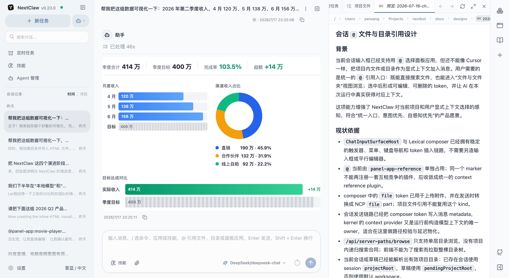
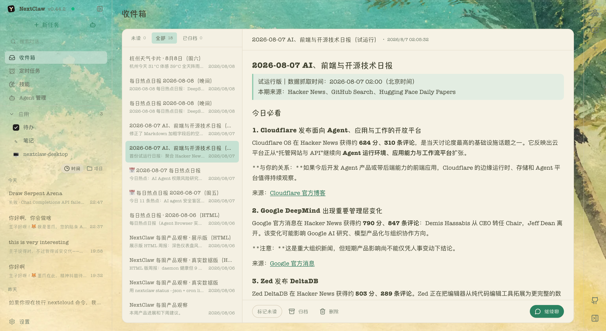
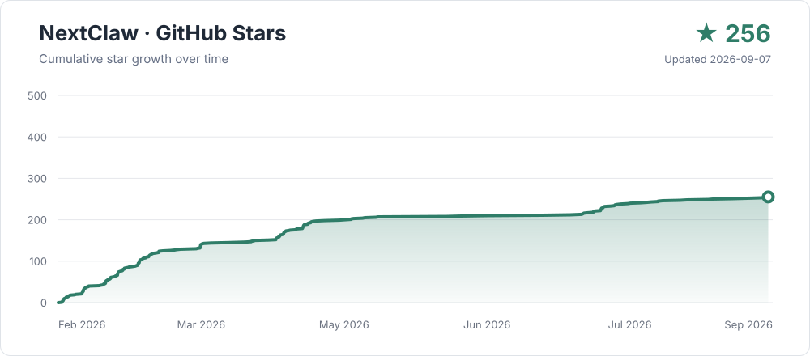

<p align="right">
  <a href="./README.md">English</a>
</p>

<div align="center">


# NextClaw

**你的长期个人智能搭档。**

说出你要完成的事。NextClaw 会把会话、文件、工具和生成结果放进同一个工作台，一路推进到真正可以交付的结果。

</div>

[](https://nextclaw.io/)

<div align="center">

**从一句话到可用结果，中间做过的事都不会散落。**

[下载与安装](https://nextclaw.io/zh/download/) · [查看使用场景](https://nextclaw.io/zh/use-cases/) · [阅读文档](https://docs.nextclaw.io/zh/)

[](https://www.npmjs.com/package/nextclaw)
[](https://github.com/Peiiii/nextclaw/releases)
[](LICENSE)

开源 · 本地优先 · 支持 macOS、Windows、Linux、Docker 和云服务器

</div>

## 为什么选择 NextClaw

<table>
  <tr>
    <td width="33%" valign="top">
      <strong>直接说目标</strong><br /><br />
      无论是报告、数据分析、文件处理、小应用还是定时任务，NextClaw 都会组织背后的工具和步骤。
    </td>
    <td width="33%" valign="top">
      <strong>过程和结果都留在一起</strong><br /><br />
      会话、本地文件、网页资料、生成的文档和后续修改都在同一个任务里，不用反复切换和重来。
    </td>
    <td width="33%" valign="top">
      <strong>自己选择怎么运行</strong><br /><br />
      可使用 Native、Codex、Claude Code、OpenCode 或 Hermes，并运行在自己的电脑、NAS 或服务器上。
    </td>
  </tr>
</table>

NextClaw 也把 `nextclaw` 命令行作为一等使用入口。许多核心操作可以从终端、脚本、CI 或其他 Agent 调用，并在适用时提供机器可读的输出。

全新安装无需填写 API Key，开箱即可开始第一个任务。内置免费试用由公共网关提供，限额和模型可能变化，请勿发送敏感或机密信息。

## 可以直接交给它的事

- **调研和对比** — 收集网页、笔记和参考资料，整理成简报、来源列表或对比表。
- **数据分析和可视化** — 从网页、CSV 或表格里整理数据，清洗、统计、画图，再写出结论。
- **写文章和报告** — 把资料、旧文档和零散想法组织成周报、文章、提案、发布说明或可继续修改的初稿。
- **处理本地文件** — 查看、重命名、抽取、归类和总结文档，处理过程和结果仍留在当前任务里。
- **给自己做小工具** — 把重复工作做成脚本、本地应用、仪表盘或可复用的工作流。
- **让日常任务持续运行** — 从聊天工具接收请求，定时生成简报或巡检结果，再发回指定渠道。

[查看更多使用场景](https://nextclaw.io/zh/use-cases/)

## 产品导览

### 从原始材料做到可以检查的结果

从一组原始材料开始，让 Agent 整理和可视化数据，再在会话旁检查结果。源文件和项目文档仍留在同一个工作区里，后续可以继续修改。

[](images/screenshots/nextclaw-workspace-preview-cn.png)

### AI 主动把重要结果送到你面前

定时任务、后台 Agent 或长期监测完成后，NextClaw 可以把报告送进收件箱。你可以稍后阅读、集中管理，也可以带着完整内容直接继续聊。

[](images/screenshots/nextclaw-island-inbox-workspace-cn.png)

### 每次任务都可以选择 Agent Runtime

Agent 保留自己的身份、主目录、记忆和技能，再由 Native、Codex、Claude Code、OpenCode 或 Hermes 执行当前任务。开始任务时选择 Runtime，其余工作区和任务上下文保持不变。

[](images/screenshots/nextclaw-agent-runtime-picker-cn.png)

### 真实文件可以直接放在会话旁边

代码、Markdown、HTML、Word、Excel 和 PowerPoint 都可以在右侧打开，核对数据或修改文档时不用离开当前任务。

[](images/screenshots/nextclaw-office-file-preview-cn.png)

### 做出来的小应用可以留下来继续用

和 Agent 边聊边做页面，完成后可以直接运行，也可以保存为 Panel App，以后随时打开和继续修改。

[](images/screenshots/nextclaw-panel-app-running-cn.png)

### 工作台里的更多界面

<table>
  <tr>
    <td width="50%" valign="top">
      <strong>独立 Agent</strong><br />
      为不同工作设置独立的角色、记忆、技能、Runtime 和主目录。<br /><br />
      <a href="images/screenshots/nextclaw-agents-page-cn.png"></a>
    </td>
    <td width="50%" valign="top">
      <strong>图片生成</strong><br />
      生成图片后直接得到本地文件，再在同一个任务里继续整理和使用。<br /><br />
      <a href="images/screenshots/nextclaw-image-generation-result-cn.png"></a>
    </td>
  </tr>
  <tr>
    <td width="50%" valign="top">
      <strong>消息渠道</strong><br />
      把微信、飞书/Lark、QQ 等入口接到运行在自己设备上的 Agent。<br /><br />
      <a href="images/screenshots/nextclaw-channels-page-cn.png"></a>
    </td>
    <td width="50%" valign="top">
      <strong>定时任务</strong><br />
      让简报、巡检和其他重复工作按设定时间自动运行。<br /><br />
      <a href="images/screenshots/nextclaw-cron-job-page-cn.png"></a>
    </td>
  </tr>
  <tr>
    <td width="50%" valign="top">
      <strong>技能与参考资料</strong><br />
      在工作台里安装技能，相关文档可以一直放在右侧 Doc Browser。<br /><br />
      <a href="images/screenshots/nextclaw-skills-doc-browser-cn.png"></a>
    </td>
    <td width="50%" valign="top">
      <strong>模型提供商</strong><br />
      使用内置提供商，或者添加自己的 OpenAI 兼容接口和模型。<br /><br />
      <a href="images/screenshots/nextclaw-providers-page-cn.png"></a>
    </td>
  </tr>
</table>

## 安装 NextClaw

### 桌面版

普通用户建议直接下载桌面版，支持 macOS、Windows 和 Linux。

[下载最新稳定版](https://nextclaw.io/zh/download/)

### npm

先安装 Node.js LTS，然后执行：

```bash
npm install -g nextclaw
nextclaw start
```

打开 [http://127.0.0.1:55667](http://127.0.0.1:55667)，直接使用内置免费试用模型开始任务；需要时再配置自己的模型提供商。

如果系统找不到 `npm`，请安装或重新安装 Node.js LTS，再重开终端。远程主机的 `55667` 端口提供纯 HTTP 服务，只适合临时验证；日常访问请用 Nginx 或 Caddy 终止 HTTPS。

```bash
nextclaw stop
```

### Docker

需要在服务器或云主机上长期运行时，可以使用：

```bash
curl -fsSL https://nextclaw.io/install-docker.sh | bash
```

反向代理、域名和远程访问设置请查看 [Docker 部署文档](https://docs.nextclaw.io/zh/guide/tutorials/docker-one-click)。所有支持的方式都可以在[下载与安装页](https://nextclaw.io/zh/download/)中对比。

当前已验证的服务器配置、空闲内存数据，以及活跃任务可能增加的资源占用见[运行资源与内存基准](https://docs.nextclaw.io/zh/guide/resource-usage)。

## 模型、渠道与工具

- **模型** — 开箱即用的内置免费试用，以及 OpenRouter、OpenAI、Anthropic、Gemini、DeepSeek、MiniMax、Moonshot、通义千问、智谱、AiHubMix、vLLM 和自定义 OpenAI 兼容接口。
- **聊天渠道** — 微信、飞书/Lark、QQ、钉钉、企业微信、Telegram、Discord、Slack、WhatsApp 和邮箱。
- **可扩展能力** — 技能、MCP、CLI 工具、浏览器操作、本地文件、面板应用和定时任务。
- **本地可控** — 配置、会话和密钥保存在你控制的环境中。接入的模型和渠道会收到你通过它们发送的数据。

[查看完整集成能力](https://nextclaw.io/zh/integrations/)

## 从源码运行

在仓库根目录执行：

```bash
pnpm install
pnpm dev start
```

开发环境会在终端打印本地地址，默认使用 `~/.nextclaw`。如需使用隔离的数据目录，可设置 `NEXTCLAW_HOME=/path/to/home`。

只启动其中一端：

```bash
pnpm dev:backend
pnpm dev:frontend
```

本地源码运行态检查、运行时更新人工验证、Platform、Docker 与质量检查命令见[开发命令参考](docs/workflows/developer-commands.md)。

刷新 GitHub 与官网使用的产品截图：

```bash
pnpm run screenshots:refresh
```

## 文档

- [快速开始](https://docs.nextclaw.io/zh/guide/getting-started)
- [配置说明](https://docs.nextclaw.io/zh/guide/configuration)
- [模型选择](https://docs.nextclaw.io/zh/guide/model-selection)
- [命令参考](https://docs.nextclaw.io/zh/guide/commands)
- [飞书接入](https://docs.nextclaw.io/zh/guide/tutorials/feishu)
- [产品愿景](https://docs.nextclaw.io/zh/guide/vision)
- [路线图](https://docs.nextclaw.io/zh/guide/roadmap)
- [版本更新](https://nextclaw.io/zh/releases/)

仓库内规划：[Roadmap](docs/ROADMAP.md) · [TODO](docs/TODO.md)

## 社群

- **微信群** — 扫描下方二维码。
- **问题反馈** — [GitHub Issues](https://github.com/Peiiii/nextclaw/issues)


## 参与贡献

欢迎参与贡献。你可以先通过 Issue 讨论问题或提案，也可以提交范围清晰、包含相关验证的 Pull Request。

## 致谢

NextClaw 的早期探索受到这些项目启发：

- [OpenClaw](https://github.com/openclaw/openclaw) — 启发了 NextClaw 对全栈 AI 助手的早期探索。
- [NanoBot](https://github.com/nicepkg/gpt-runner) — 展示了小型 Agent 框架也可以保持实用和可扩展。

## 许可证

[MIT](LICENSE)

---

<div align="center">

[](https://github.com/Peiiii/nextclaw/stargazers)

</div>
