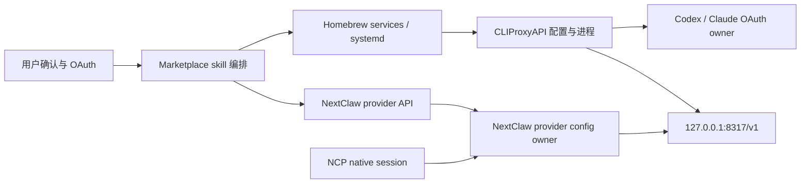

# 本地 AI 订阅代理 Marketplace Skill 设计

## 目标与成功标准

把用户本人本机上的 Codex 或 Claude Code 订阅，通过一个 localhost-only 的 OpenAI 兼容端点提供给其他本地客户端；在代理真实回复和持久服务验收通过后，再询问是否接入 NextClaw。当前持久服务合同覆盖 macOS Homebrew 与 Linux systemd；Codex + macOS 仍是已有真实端到端基线，Linux systemd 先以确定性脚本与隔离测试建立支持合同，发布前补真实 Linux 验收。

完成必须同时满足：

1. CLIProxyAPI 仅监听 `127.0.0.1`，管理 API 和控制面板关闭，本地 API key 不出现在命令行与报告中。
2. Codex OAuth 由 CLIProxyAPI 自己持有，NextClaw 不接触 OAuth token。
3. `/v1/models` 返回真实模型，`/v1/responses` 返回固定 marker。
4. 用户明确同意后，NextClaw 自定义 provider 候选配置先通过真实 connection test，再启用。
5. 新建 provider 的 test 或保存失败时自动删除回滚；已有 provider 在 test 成功前不发生写入。
6. `native + <provider-id>/<model>` 的 NCP 对话复用用户选定的 provider id 并返回固定 marker。
7. Marketplace 远端包可以安装，并包含全部运行脚本。
8. CLIProxyAPI 必须由 Homebrew services 或独立 systemd unit 托管，处于开机/登录自启与 active 状态；Linux cgroup 不得属于 `nextclaw.service`。
9. 托管服务重启后必须重新通过模型发现和真实 Responses marker；未通过时不得创建或更新 NextClaw provider。

代理直连 smoke 固定使用 `/v1/responses`，用于证明通用 OpenAI Responses 端点成立；NextClaw provider 固定使用 `wireApi=chat`。真实 NCP 验收发现 `native` 注入的工具定义经 Responses wire 到 CLIProxyAPI 时会出现工具 schema 不兼容，而 Chat Completions wire 能完整通过工具上下文与最终回复，因此两层有意使用不同 wire，不做隐式 fallback。

## 产品与工程原则

这项能力增强 NextClaw 的统一入口与生态扩展能力，但不把第三方代理实现塞进内核。

- `single-domain-owner`：CLIProxyAPI 拥有 OAuth、模型路由和 OpenAI 协议；Homebrew/systemd 拥有进程拉起、重启与开机自启；NextClaw 现有 provider owner 拥有 provider 持久化和模型路由；skill 只拥有接入编排与跨 owner 验收。
- `single-source-of-truth`：provider id 在接入时只选择一次，配置、模型 route、NCP smoke 与完成报告都消费同一个值；不得在下游验收脚本重新写死实例名。
- `cqs-pure-read`：版本、配置安全、模型发现属于只读检查；写代理配置、写 provider、真实模型 smoke 使用显式命令。
- `boundary-only-defense`：版本、URL、文件权限、HTTP payload 和回滚只在外部边界校验；内部流程使用规范合同。
- `predictable-behavior-first`：不做隐式 fallback，不猜模型，不复用未知 provider，不把 health 或模型列表当成功。
- `simple-structure-first`：仓库新增一个独立 skill root，采用 L1 结构；只使用 `SKILL.md`、`marketplace.json`、`agents/`、`scripts/` 与仓库级 `tests/skills/`，不引入新 package、`features/` 或 `shared/`。

## Owner 与数据流

标准顺序是：`只读检查 -> 安全配置 -> OAuth -> 持久服务安装/启动 -> readiness -> Responses 真实回复 -> 托管重启 -> readiness + Responses 再验 -> 用户确认 -> provider 持久性门禁 -> 候选 test -> 保存启用 -> NCP 真实回复`。

## 文件与职责

- `skills/proxy-local-ai-subscriptions/SKILL.md`：面向 agent 的完整安装、确认、安全和验收流程。
- `scripts/cliproxy.mjs`：代理配置、readiness/托管重启命令编排与 OpenAI Responses smoke。
- `scripts/cliproxy-service.mjs`：Linux systemd unit 安装以及 Homebrew/systemd 生命周期检查与重启的唯一 owner。
- `scripts/nextclaw-provider.mjs`：先复用 `cliproxy.mjs check` 与 `restart-smoke` 做持久服务门禁，再执行 provider 事务式写入。
- `scripts/nextclaw-smoke.mjs`：自包含 NCP SSE 真实对话验收。
- `scripts/local-subscription-proxy.utils.mjs`：同包脚本真实复用的参数、localhost URL、安全文件写入、配置校验、密钥文件和 HTTP 边界工具。
- `tests/skills/*`：配置保护、密钥脱敏、provider 回滚与 NCP SSE 协议测试；不会随 Marketplace 包安装。

## 安全合同

- 固定 `host: 127.0.0.1`，不接受 host 参数。
- `remote-management.secret-key` 为空，`disable-control-panel: true`。
- auth 目录 `0700`，配置与 key 文件 `0600`。
- key 使用 `randomBytes(32)` 生成，只经 mode `0600` 文件传递。
- 已有非模板、非本 skill 管理的配置默认拒绝覆盖；显式 `--force` 时先备份。
- 标准工作流显式选择 provider id：Codex 推荐 `codex-sub`，Claude Code 推荐 `claude-sub`，用户可以指定其他 kebab-case 名称；脚本保留 `local-subscriptions` 作为直接调用的兼容默认值。
- 同名 provider 指向其他端点时默认拒绝替换。
- NextClaw provider 默认 `wireApi=chat`；不使用已在真实 NCP 工具上下文中失败的 Responses wire。
- 不默认修改 NextClaw 全局默认模型。

## 失败语义与回滚

- 配置写入使用同目录临时文件 + rename；覆盖前保留时间戳备份。
- readiness 任一安全断言失败都停止，不继续 OAuth/model smoke。
- `check` 未证明托管服务 active + enabled 时失败；Linux unit 未处于独立 cgroup 时失败。
- `restart-smoke` 重启后未恢复模型列表或 marker 时失败；`nohup`、shell `&`、单次端口可达都不构成完成状态。
- provider 脚本在发出任何 NextClaw provider 请求前强制执行持久服务 readiness；失败时保持 provider 配置完全不变。
- 新 provider 先以 `enabled=false` 创建；test 或最终 update 失败即 DELETE 回滚。
- 已有 provider 使用 test API 验证候选 patch；通过前不执行 PUT。
- provider 配置成功但 NCP smoke 失败时保留已验证 provider，报告 NCP 链路失败，不伪装成 OAuth 失败。
- Marketplace 默认安装对每个远端文件复用镜像候选链；国内镜像单文件超时时回退官方源，并发完整下载到同目录 staging 后才替换目标目录。安装或更新失败时保留原目录，不留下被误判为已安装的半套文件。

## 非目标

- 不实现代理协议、OAuth 客户端或账号池。
- 不支持公网/LAN/Docker 跨主机暴露、共享、转售或配额规避。
- 不把 Codex/Claude 做成 NextClaw 内核 provider 特判。
- 不替代 `codex-narp-runtime` / `claude-code-narp-runtime`；它们仍负责原生 agent session，本文能力是通用模型 gateway。
- Windows 和 Claude Code 路径仍未做端到端真实验收。
- 本设计不实现长期外部监控或 SLA；它保证进程托管、重启恢复和接入时的可观察门禁，OAuth 凭据被上游撤销时仍需用户重新授权。

## 验证矩阵

| 层级 | 判定条件 |
|---|---|
| 静态 | Marketplace validator、Skill quick validator、ESLint/治理检查通过 |
| 脚本 | 幂等写入、拒绝未知覆盖、备份、key 脱敏、模型发现、HTTP 错误可观察 |
| 持久服务 | systemd unit 幂等安装、active/enabled、独立 cgroup、拒绝临时进程、托管重启后 readiness + marker |
| provider | 新建成功、失败回滚、已有配置 test-before-write、冲突保护 |
| 代理真实链路 | CLIProxyAPI v7.2.90 + Codex OAuth + `/v1/models` + `/v1/responses` marker |
| NextClaw 真实链路 | 隔离源码实例 + provider test + `native` NCP SSE marker |
| Marketplace | 远端元数据一致、默认源临时目录安装、镜像 blob 超时回退、失败原子回滚、已安装包脚本可执行 |

## 上游审计锚点

- 上游：`router-for-me/CLIProxyAPI`
- 许可证：MIT
- 本次已审计/验收版本：`v7.2.90`
- 关键合同：`--codex-login`、`--claude-login`、`--config`、`host`、`port`、`auth-dir`、`api-keys`、`remote-management`、`/v1/models`、`/v1/responses`
- 升级策略：只自动接受 `7.2.x`；跨 minor/major 必须重新执行配置生成、OAuth、Responses 与 NextClaw NCP 验收。
