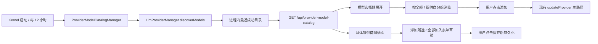

# Provider 模型目录自动刷新与选择器发现设计

## 目标

NextClaw 在运行后自动读取已启用提供商的最新模型目录，并每 12 小时刷新一次。目录更新不得擅自修改用户配置；聊天模型选择器只有展开后才显示低优先级提示，具体提供商详情页则自动提示对应候选。用户可明确“添加”，但添加不会切换当前会话模型。

## 核心边界

- 远端模型目录是厂商事实，归 Kernel 的 `ProviderModelCatalogManager` 缓存和调度。
- 已配置模型是用户选择，仍只通过现有 provider 配置写入路径更新。
- 协议请求继续复用 `LlmProviderManager.discoverModels`，不复制 OpenAI、Anthropic 或 OpenCode 抓取逻辑。
- 自动刷新只读取目录；不会自动新增、删除、重排或切换模型。
- 获取目录与调用可用性验证是两个独立合同：目录发现不发送推理请求，不把厂商声明的模型列表外推成账号、限额或实时服务健康保证。
- 后台快照只接收 Core 已识别为文本输出聊天 LLM 的模型；图像、视频、语音、Embedding、Rerank 与 Moderation 模型不进入配置候选或聊天提醒。
- 推理协议兼容不等于目录协议兼容；只有显式声明并完成审计的目录能力才进入自动刷新和前端发现链路。内建 Provider 未声明或声明 `modelDiscovery: false` 时均跳过刷新，并继续保留手工模型配置。
- 单个提供商失败不影响其他提供商；保留该提供商最近一次成功目录，同时记录失败信息和时间。

## 主链路

## 交互

- 选择器收起时不显示角标、红点、数量或提示。
- 展开后，仅当远端目录中存在尚未配置的模型时，在“管理模型和提供商”上方显示提示行。
- 点击“查看”后在当前面板内列出新模型；默认“全部”，也可按提供商筛选。在“全部”视图中仍按提供商分段。
- 每项使用明确的“添加”按钮。添加成功后保持面板打开、刷新 provider 配置，但不切换当前会话模型；失败则保留面板并展示既有保存错误。
- 模型名称使用可截断的弹性列，操作按钮占用独立固定列；长 ID 在窄面板中不得与按钮重叠。
- 搜索栏固定在顶部，“已配置模型 + 新模型发现”共用中部滚动区，“管理模型和提供商”固定在底部；任何候选数量和窗口高度下，底部入口都不得被裁切或覆盖。
- 没有新模型时提示行完全不出现。
- 进入已保存的具体提供商详情页时，前端立即读取一次本地目录快照；若 Kernel 仍在首次刷新，则短轮询到刷新结束。
- 提供商页显示候选数量，支持勾选若干模型后添加所选，也支持全部添加。后台快照与显式获取复用同一候选面板；显式获取只替换候选来源，不自动同步。添加只修改表单草稿，保存仍是唯一持久化入口；当前表单包含未保存连接参数时，继续用“获取模型列表”按当前草稿读取目录。
- 显式获取后的数量只表示尚未配置的差集，不把上游总量伪装成可添加数量。存在候选时面板自动展开、滚动并聚焦；差集为空时明确显示“当前列表已全部包含”，不再要求用户寻找不存在的选择入口。

## 大目录降噪

- 完整目录与更新提醒是两个概念。提供商页负责浏览完整目录；聊天选择器只负责提醒用户上次已见基线之后新增的模型。
- 单个提供商首次出现超过 50 个未配置目录模型时，将这批 ID 记录为本机 UI 已见基线，不把数百个既有目录项伪装成“新模型”提醒。之后只有基线之外的新 ID 才进入聊天选择器提示。
- 小目录仍直接提示可添加差集；用户可以点击“本批不再提醒”将当前候选记为已见。该操作只写入本机 UI 偏好，不添加模型、不修改 Provider 配置。
- 提供商页的候选超过 50 个时隐藏“全部添加”，展示目录搜索，只渲染前 50 个匹配项并显示匹配总数。用户通过搜索和复选框添加所选，避免配置污染和数百节点的无意义渲染。
- 当前不做“推荐模型”排序，因为不同用户的价格、地区、上下文、工具调用和数据政策偏好不同，且通用模型目录通常没有足够稳定的推荐元数据。模型推荐应作为独立能力设计，不混入目录同步。

## 生命周期与取舍

- 启动时立即刷新一次，之后每 12 小时刷新；定时器 `unref`，并由 Kernel `dispose` 清理。
- 本轮使用进程内缓存，不新增磁盘格式或迁移。重启后会立即重新获取，避免把易变化的厂商目录混入用户配置。
- API 只读缓存，不因页面打开或轮询而直接请求外部厂商；前端打开选择器时只重新读取本地快照。
- 暂不做模型评分、自动推荐、下线模型删除或全局通知。

## 验证标准

- Manager 单测证明：启动立即刷新、12 小时周期、并发收敛、不支持目录的提供商被跳过、单厂商失败隔离、保留最近成功数据、配置不被修改、dispose 清理定时器。
- Server 组装路由证明 GET 为纯读且返回精确合同。
- UI 单测证明收起无提示、展开才出现、按全部 / 提供商分组、长名称不侵入按钮、共享滚动区不裁切底部管理入口、添加后不主动关闭，并正确计算远端目录与本地配置的差集；大目录首次建立基线、之后只提示新增 ID，且支持本批不再提醒。
- 提供商页单测证明首次检查提示、对应 provider 差集、获取不自动添加、添加所选 / 小目录全部加入草稿，以及大目录隐藏全部添加、支持搜索并限制首屏渲染，添加后仍需保存。
- 隔离临时 HOME 启动当前源码，验证 OpenCode 无密钥自动出现目录；真实浏览器验证选择器分组和窄面板布局、添加后当前模型不变，以及提供商详情页自动提示和草稿操作。
