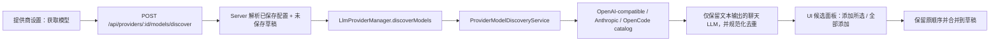

# Provider 模型目录获取与选择设计

## 目标与验收

用户在提供商设置页读取当前公开的模型目录后，可以勾选若干模型添加，也可以全部添加；已配置模型支持进入批量删除模式后选择部分或全选清理。获取本身不得修改表单或配置；添加和删除都只进入未保存草稿，不得覆盖既有顺序或绕过用户保存。

完成验收需要覆盖：OpenAI-compatible 目录、Anthropic 目录、OpenCode 零成本目录、自定义 API Base、未保存 API Key / Header、鉴权失败、重复模型合并，以及真实浏览器操作。

## Owner 与主链路

- `ProviderModelDiscoveryService`：Core LLM provider 域中的远程 IO owner，负责协议选择、请求头、超时、响应校验和 OpenCode 大目录短时缓存。
- `LlmProviderManager`：Kernel 对外暴露意图级 `discoverModels`，从现有 Provider Registry 取得声明式规格；不让 Server 或 UI 硬编码厂商差异。
- `ProviderConnectivityService`：Server 侧草稿配置 owner，统一解析已保存配置、当前未保存字段和匿名凭据，为连接测试与模型发现提供同一实例配置边界。
- UI：提交当前连接参数，统一展示后台快照或本次获取的候选；用户添加所选或全部添加后，按原顺序合并到草稿，保存仍由用户明确点击。

## 声明式协议合同

`ProviderSpec.modelDiscovery` 同时承担能力开关与协议选择：

- `openai-compatible`：在当前 API Base 下请求 `GET models`，可携带 Bearer API Key 与自定义 Header。
- `anthropic`：请求 `GET v1/models`，使用 `x-api-key` 和 `anthropic-version`。
- `models-dev`：读取指定目录中的 provider 条目；OpenCode 使用该策略，按官方元数据排除 `deprecated` 与存在输入费用的模型。该动作仍只是获取目录，不发起推理请求，也不把目录声明等同于实时可调用性验证。
- `false` 或内建 Provider 未声明策略：该提供商没有经过确认的目录接口；Kernel 不请求、后台不刷新，前端不展示获取与自动候选入口，但保留手工添加模型。

内建 Provider 采用显式白名单：只有逐项核对过官方目录合同的 Provider 才能声明发现策略。自定义 Provider 没有可审计的内建规格，作为高级兼容入口默认尝试 OpenAI-compatible 目录，失败时明确报错并保留手工添加。推理端点兼容 OpenAI 不代表模型目录端点也兼容，能力必须按具体操作取证，不能从品牌、SDK 或另一个成功端点外推。HTTP 非成功、无 API Base、响应合同不合法或目录为空都显式失败，不回退静态默认模型，避免把过期数据伪装成动态发现成功。

模型发现属于聊天 LLM 域，不等同于枚举厂商账户下的全部 AI 模型。Core 优先排除图像、视频、语音、Embedding、Rerank、Moderation、安全分类与 Guard 等稳定专用模型族，再读取 `modalities.output`、`architecture.output_modalities` 等目录元数据，只接受纯文本输出；元数据缺失时继续按模型类型与稳定 ID 族保守过滤。图像输入但只输出文本的视觉理解 LLM 仍可保留。该规则由 Core 单一 owner 执行，提供商页、后台快照和聊天选择器不各自复制过滤。

当前内建能力审计结果：

- 已启用：NextClaw、OpenAI、Anthropic、OpenRouter、DeepSeek、MiniMax API、Kimi、AiHubMix、Groq、OpenCode Zen、vLLM。
- 未启用：Gemini、DashScope、DashScope Coding Plan、Kimi Coding、Zhipu AI、Xiaomi MiMo、MiniMax Portal、Qwen Portal。

这里的“未启用”只表示 NextClaw 尚未取得与当前 Base URL、认证方式完全匹配的模型目录证据，不代表这些 Provider 不能推理或永远不支持目录。后续只有补齐官方合同与回归测试后才能打开入口。

能力审计以目标操作的第一方资料为准，当前主要依据包括：[OpenAI Models API](https://platform.openai.com/docs/api-reference/models/object?lang=curl)、[Anthropic List Models](https://platform.claude.com/docs/en/api/models/list)、[OpenRouter Models API](https://openrouter.ai/docs/guides/overview/models)、[DeepSeek List Models](https://api-docs.deepseek.com/api/list-models)、[Kimi List Models](https://platform.kimi.ai/docs/api/list-models)、[Groq Models](https://console.groq.com/docs/models)、[MiniMax List Models（中国区）](https://platform.minimaxi.com/docs/api-reference/models/openai/list-models)、[AiHubMix Models API](https://docs.aihubmix.com/cn/api/Models-API)、[vLLM OpenAI-compatible server](https://docs.vllm.ai/en/latest/serving/openai_compatible_server/)，以及 OpenCode 实际使用的 [`models.dev` 目录代码](https://github.com/anomalyco/opencode/blob/dev/packages/core/src/models-dev.ts)。阿里云 [DashScope OpenAI 兼容说明](https://help.aliyun.com/zh/model-studio/compatibility-of-openai-with-dashscope) 与 [Coding Plan 文档](https://help.aliyun.com/en/model-studio/coding-plan) 没有被外推成当前认证合同下的动态目录能力。

## 数据、状态与安全边界

- API Key 只在 Server / Kernel 请求头中使用，不回传前端、不写入日志。
- 请求使用固定超时，响应体有大小上限；OpenCode 目录按 URL 在 service 实例内缓存五分钟，减少重复下载约 3.6 MB 的公开目录。
- 返回值只有 `provider`、`models`、`source` 和 `fetchedAt`；成功提示只确认获取完成，候选面板始终按“远端目录 − 当前草稿模型”计算可添加差集。
- 目录响应在进入缓存与前端前先过滤为聊天 LLM；非文本生成模型不会成为可添加候选或新增提醒。目录元数据缺失且模型身份无法可靠判断时，用户仍可通过手工模型 ID 管理，不把不确定模型自动推荐到聊天入口。
- 获取结果只是候选，不修改草稿；添加所选或全部添加后才修改本地表单。用户点击保存后才进入既有 `updateProvider` 单一路径。
- 显式获取后若存在差集，候选面板自动展开、滚动到视口并获得焦点；若差集为空，则就地显示“当前列表已全部包含”，不展示空选择器或添加按钮。
- 已配置模型默认保持简洁列表，只在用户点击“批量删除”后显示复选框；支持全选、取消全选、删除所选与取消。删除完成后退出选择模式，只修改表单草稿，仍由既有保存操作统一持久化。

## 非目标与取舍

- 本轮不增加价格比较、模型评分、自动推荐排序或自动删除下线模型。
- 不在前端增加 provider 名称分支；厂商差异只属于 provider spec 与 Core service。
- 不用静态默认列表作为网络错误 fallback；默认列表仍只承担初始配置和人工恢复。
- 不为了少量协议差异引入 adapter/factory 树；一个有缓存和远程 IO 生命周期的 service 足以表达当前稳定变化点。

## 验证矩阵

- Core 单测：三类协议、认证 Header、去重排序、免费筛选、文本输出模态与非聊天模型族过滤、缓存、超时/HTTP/非法响应。
- Server assembled route：真实 router/controller/store 层，验证未保存草稿传递、响应形状、404 与错误合同。
- UI 单测：加载/禁用状态、获取不自动添加、候选去重、添加所选 / 全部添加、已配置模型全选/取消全选/删除所选、成功/失败反馈，以及不支持目录的提供商不展示获取入口。
- 类型与治理：Core、Runtime、Kernel、Server、Client SDK、UI 的 TypeScript；相关 lint、全仓治理与可维护性检查。
- 功能冒烟：独立临时 HOME 启动当前源码，调用真实公开目录；确认获取后配置和表单都不变化，勾选部分候选后只有所选模型进入未保存草稿且保存按钮变为可用。
