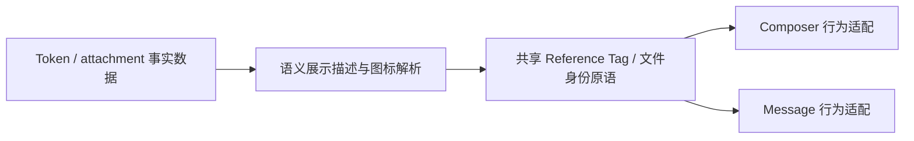

# 聊天结构化内容统一展示系统设计

## 背景与目标

聊天输入框已经能承载 Skill、Panel App、项目、工作区文件、目录、文本片段和附件，但同一对象在输入框与发送后的用户消息中使用了不同的视觉语言：输入框普遍是紧凑 Tag，消息中的普通引用却退化为下划线链接，文本片段另有一套 Tag，附件又拥有独立图标映射。这使同一对象在发送前后像是两个不同概念，也让 Skill、未知扩展引用和文件类型出现图标语义漂移。

本设计的可观察目标是：

- 同一个结构化对象在输入框与用户消息中保持相同的身份视觉、信息顺序和预览内容；
- 图标由对象语义唯一决定，不再由所在 renderer 临时选择；
- 输入框只额外提供编辑能力，消息只额外提供打开或回源能力，行为差异不改变对象身份；
- 文件、目录、片段、Skill、Panel App、项目和未来扩展引用共享一套可复用展示骨架；
- 附件保留消息中的媒体/文件展开能力，但紧凑态与展开卡片共享文件类型语义。

这项收敛直接服务 NextClaw 的“统一入口、统一体验”目标：用户在表达上下文、发送上下文和回看上下文时，不需要重新识别同一个对象。

## 现状证据

当前 producer、owner 和 consumer 分布如下：

- composer token 由 Lexical `ChatComposerTokenNode` 持有稳定数据与编辑生命周期；
- inline token metadata 是已发送引用的事实来源，消息 Markdown renderer 负责恢复展示；
- composer 使用紧凑 Tag，而消息 renderer 对普通引用使用下划线链接、只对 `workspace_excerpt` 使用独立 Tag；
- composer、message badge、input surface 和附件卡片分别维护图标表，Skill 曾使用 `Puzzle`，未知引用也使用 `Puzzle`；
- 文件引用已有路径或文件名，但紧凑引用只显示通用 `FileText`，没有利用扩展名语义；
- 被中断的局部重构已经引入 `chat-reference-tag.tsx`，但旧片段组件导入和 composer remove contract 尚未完成迁移，不能作为交付基线。

## 统一模型

结构化内容分为三个家族：

1. **Reference**：Skill、Panel App、项目、工作区文件、目录、文本片段和未来上下文引用。它们在编辑器与消息中使用同一种紧凑 Reference Tag。
2. **Attachment**：普通文件、图片、音频和视频。输入框使用紧凑附件 Tag；消息中可按媒介展开，但文件名、类型图标与元信息语言保持一致。
3. **Execution Artifact**：工具调用、工具结果、文件操作、推理和 inline display。它们表达执行过程，不是用户输入的同一对象，本轮不强行套用 Reference Tag。

核心不变量：

> 对象语义决定身份视觉；所在场景只决定可执行行为。

因此同一对象以下内容必须一致：

- 语义图标；
- 基础色调、圆角、边框、字号和高度；
- 主标题、辅助指标、摘要的先后顺序；
- 截断策略和预览内容。

允许按场景变化的只有：

- composer：可选择、复制、剪切、粘贴、撤销和移除；
- message：可打开、回源、定位或展示只读 tooltip；
- attachment message：可展开媒体或文件详情。

## Owner 与主链路

采用三层单向模型，不新增 service、manager 或运行时 registry：

- **语义展示 owner**：`agent-chat-ui` 内的结构化内容展示组件。它根据 `kind + label/path` 选择图标和稳定视觉，不读取业务 store、路由或 i18n。
- **composer adapter**：Lexical node 保持唯一编辑 owner，只负责选择态、移除和 editor focus；不再自行解释图标或复制一套 JSX。
- **message adapter**：inline token badge 只负责 button/span 语义、点击回源和 tooltip；不再自行解释图标或维护另一套样式。
- **attachment adapter**：继续使用现有文件分类 owner，紧凑态按文件名推导语义图标，消息卡片按文件名与 MIME 分类；不引入第二种附件分类协议。

不采用一个包含大量 `mode === composer/message` 条件的巨型组件，因为这会把编辑器生命周期、消息导航和纯展示职责重新耦合。共享的是稳定视觉原语，场景行为保留在最近 owner。

## 语义图标规范

| 对象 | 主图标 | 依据 |
| --- | --- | --- |
| Skill | `Sparkles` | 表达可调用的智能能力，不再使用代表插件拼装的 `Puzzle` |
| Panel App | `AppWindow` | 表达可打开的应用表面 |
| Project | `FolderKanban` | 表达项目级组织容器 |
| Workspace Directory | `Folder` | 表达目录 |
| Workspace File | 按扩展名解析 | JSON、代码、图片、音频、视频、表格、压缩包、文档分别使用对应文件图标 |
| Workspace Excerpt | `TextQuote` | 表达从来源文件摘取的文本片段；预览头仍显示来源文件身份 |
| Attachment | 按文件类型解析或图片缩略图 | 表达真实媒介类型；缩略图失败后回退到语义图标 |
| 未注册引用 | `Link2` | 只承诺“这是一个引用”，不误导为 Skill 或插件 |

图标规则：

- 同一 kind 在 composer、message 和选择菜单中不得改变图标；
- 对象图标与操作图标分离，`X`、打开、复制等动作不能替代对象身份；
- 有可见文字时对象图标使用 `aria-hidden`；icon-only 操作必须有可访问名称与 tooltip；
- 色彩只表达家族、交互状态或文件类别，不为单个 renderer 临时装饰。

## Reference Tag 视觉与交互合同

- 单行、高度 24px、自适应内容宽度并受容器最大宽度约束；文件名优先保留，辅助指标和摘要按剩余空间截断。
- 默认态使用低强调背景与细边框；Tag 整体 hover 只提供轻微表面反馈，不伪装成主按钮。
- 文本片段常态展示：摘录图标、文件名、行号或字符数、片段指纹。完整内容只在预览浮层中展示。
- composer 的关闭按钮绝对定位在 Tag 内右侧，不参与宽度计算。Tag hover/focus 时按钮显现透明圆框并让尾部内容渐隐；只有指针直接 hover 按钮时才出现背景反馈。
- message 的可打开引用使用 button 语义，不能打开时使用 span；两者基础视觉一致，不可打开态不伪装成链接。
- tooltip/popover 使用 collision padding 和视口宽高约束；不能向可见区域外溢出。
- focus-visible、选择态和禁用态必须独立可辨识，且不得通过 remount 重置 Lexical selection 或浏览器选区。

## 数据、生命周期与失败边界

- 结构化事实仍由现有 composer node、inline token metadata 和 attachment part 持有；展示层不复制或持久化第二份状态。
- React 展示组件保持模块级稳定；Lexical node 的 key、父级 DOM 和 DecoratorNode 身份不因 hover、消息流式更新或回调变化而改变。
- 文件图标只根据规范 `kind` 与当前已知文件名/路径解析，不读取文件内容，不发请求。
- 未知 kind 使用中性引用视觉；缺少路径时文件图标可根据 label 推导，仍无法识别时回退通用文件图标。
- 缩略图加载失败只回退语义图标，不改变 token 身份和布局尺寸。
- 不为旧 renderer 保留平行样式；迁移完成后删除旧片段视觉组件及其导入。

## 目录与依赖边界

- 统一 Reference 视觉留在 `packages/nextclaw-agent-chat-ui/src/components/chat/ui/`，因为 composer 与 message 都在该 package 消费。
- 业务 package `nextclaw-ui` 继续负责 token 创建、导航和 i18n，不反向把 store 或路由注入纯展示组件。
- 跨 workspace 不 deep import。若未来项目文件树也要消费同一图标 resolver，应先把纯图标合同提升到双方都能通过公共入口依赖的 shared UI owner，而不是让 `agent-chat-ui` 依赖业务应用内部组件。

## 迁移范围

本轮一次性完成：

- Reference 家族在 composer/message 的样式、信息结构和语义图标统一；
- 文本片段预览和关闭交互迁移到统一原语；
- Skill 与未知扩展引用移除 `Puzzle` 误导；
- workspace file 按常见扩展名显示语义文件图标；
- composer 附件使用文件类型图标或图片缩略图，消息附件保留展开卡片；
- input surface 的 Skill/Panel App 等已知入口同步采用同一语义选择；
- 删除旧 `workspace-excerpt-token` 平行实现和 renderer-local 图标表。

明确非目标：

- 不重做工具卡、推理、文件操作和 inline display 的信息架构；
- 不改变 inline token metadata、发送协议或 kernel 上下文语义；
- 不把附件消息强制压缩为 Tag，也不取消图片、音频、视频预览；
- 不引入可远程配置的图标 registry 或主题编辑器。

## 验收与最小验证

- paired render 测试：同一 Skill、项目、文件、目录、片段在 composer 与 message 中拥有相同 `data-reference-kind`、基础类、语义图标和标题信息；场景 action 不同。
- 图标矩阵测试：覆盖 Skill、Panel App、项目、目录、JSON/代码/图片文件、片段和未知引用回退。
- composer 测试：所有 Tag 都有 hover 后可见且不占宽的移除按钮，点击后删除原子节点；图片缩略图失败可回退。
- message 测试：可打开引用使用 button，不可打开引用使用 span；片段预览仍展示路径、位置、字符数和完整文本。
- 生命周期测试：组件类型与 Lexical node key 稳定，不因交互状态替换 editor subtree。
- 收尾执行相关 package TypeScript、定向测试、targeted lint、`git diff --check` 与 maintainability guard；真实浏览器只验证统一 Tag 的正常、hover、窄容器和消息回源主路径，不重复跑与本改动无关的全量套件。
