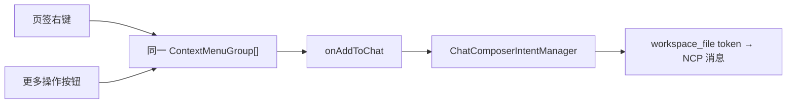

# 工作台文件统一操作菜单设计

## 背景与目标

项目文件树已经支持右键“添加到聊天”，但打开文件页签仍使用另一套 Popover 菜单，导致相同文件操作的入口、视觉和键盘行为不一致。本次目标是让目录文件与已打开文件共享菜单 primitive，并让页签“更多操作”和右键打开同一份操作菜单。

验收标准：

- 任意项目内文件打开为工作台页签后，可从“更多操作”或右键页签执行“添加到聊天”。
- 两种入口展示相同的操作分组、顺序、禁用态和样式，不维护两套菜单 JSX。
- “添加到聊天”继续通过现有 composer intent 插入结构化 `workspace_file` 引用，并保持输入框当前正文和光标语义。
- 已发送消息中的 `workspace_file` 引用可再次点击打开对应文件；默认 workspace 会话没有 project root 时使用 working directory 解析。
- 只有能够解析为当前项目相对路径的文件才展示“添加到聊天”；外部文件或非文件页面不伪造引用。

## Owner 与主链路

- `ContextMenu` 是业务无关菜单 surface owner：负责右键、显式按钮触发、定位、焦点恢复和键盘导航。
- `CompactTabStrip` 只负责把页签容器和“更多操作”按钮连接到同一个 `ContextMenuGroup[]`，删除原有独立 Popover 菜单实现。
- workspace view model 负责判断打开文件是否属于当前项目，并暴露 `onAddToChat` 能力。
- workspace panel 负责把该能力连接到现有 `chatComposerIntentManager.requestFileReference`；后续 token、发送、持久化和 Agent 上下文继续复用既有唯一链路。
- 消息 token consumer 负责把持久化相对路径还原为文件打开 action；解析根统一采用 `projectRoot ?? workingDir`，与工作台已有目录语义一致。

## 交互与数据规则

- 右键是效率入口，“更多操作”是可发现、可键盘访问的正式入口；两者缺一不可。
- 打开菜单不切换页签；执行“添加到聊天”后不把焦点抢回页签，输入框继续持有焦点。
- 菜单分为文件操作与页签生命周期操作两组，“关闭文件”单独分组。
- 相对路径解析由 session-project path utility 统一负责，兼容相对路径、项目内绝对路径和 Windows 分隔符；项目外绝对路径返回不可引用。
- 不新增缓存、store 或第二套文件引用协议。

## 目录与可维护性

- 复用并扩展 `shared/components/ui/context-menu`，不新建第二个 action-menu 组件。
- `CompactTabStripTab` 直接接收 `ContextMenuGroup[]`，删除旧 `menuActions` 映射层。
- 本次规范写入 `frontend-interaction-quality` skill：同一操作集合的显式入口与右键入口必须共享菜单模型和 primitive。
- 不新增静态治理脚本；“两个入口是否为同一语义集合”依赖业务语义，强行用文件名或 JSX 模式检查会产生高误报，由共享组件合同与定向测试约束更可靠。

## 非目标

- 不劫持文件预览正文、iframe、网页或编辑器内部的原生右键语义；文件页签是稳定的文件身份入口。
- 不给 overview、项目文件首页、子会话等非文件页面添加“添加到聊天”。
- 不扩展删除、重命名等会修改文件系统的操作。

## 验证

- 共享菜单组件测试：显式按钮与右键均打开同一菜单，键盘与焦点恢复正确。
- 页签组件测试：两种入口不触发页签选择，执行同一 action。
- workspace view-model/path 测试：项目内相对/绝对路径可引用，项目外路径不可引用。
- workspace panel 组装测试：点击“添加到聊天”准确调用 composer intent，包含目标 session、相对路径和文件标签。
- 消息组装测试：真实渲染持久化文件 token，用户点击后在仅有 working directory 的默认 workspace 会话中打开准确文件。
- TypeScript、定向 ESLint、治理检查、可维护性检查，以及真实页面热更新冒烟。
