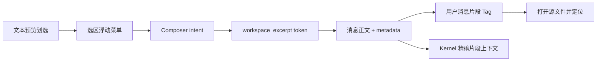

# 工作台文本片段引用设计

> 片段的协议、快照和工作台交互仍以本文为准；其 Tag 基础视觉、语义图标以及 composer/message 一致性已升级到 [聊天结构化内容统一展示系统设计](./2026-08-08-chat-structured-content-visual-system.design.md)。

## 背景与目标

工作台已经支持把项目文件添加到聊天，但用户无法只引用当前正在阅读的一段内容。复制粘贴会丢失文件身份和位置，引用整份文件又会引入无关上下文。本次能力定义为“文本片段引用”：划选只是创建入口，真正进入聊天的是带来源、位置和原文快照的结构化引用。

可观察目标：

- Markdown 渲染、Markdown 源码、普通文本、代码、JSON、YAML、配置和日志等文本预览均可划选后“添加到聊天”。
- 输入框在当前光标处插入紧凑片段 Tag，保留已有正文，插入后焦点位于 Tag 之后。
- 编辑态与发送后的用户消息使用同一种紧凑引用语言；完整片段按需预览，AI 获得用户当时选中的完整原文，而不是整份文件。
- 点击已发送片段可重新打开源文件，并在可用时定位到起始行。

## 核心判断

1. 新增独立的 `workspace_excerpt`，不复用 `workspace_file`。文件引用由 kernel 延迟读取整份文件；片段引用必须使用选中时快照，二者语义不同。
2. 片段快照是事实，路径和行号是回溯信息。文件后续变化不能悄悄改变已经发送给 AI 的内容。
3. 行号只在源文本中能可靠找到选区时记录。Markdown 渲染文字无法映射时仍可引用，但不伪造位置。
4. 浮动菜单只保留主操作“添加到聊天”；右键、更多菜单与未来快捷动作应复用同一个创建意图，不另建发送链路。
5. 第一阶段面向宿主可以稳定读取选区的文本预览。PDF、Office、HTML iframe 需要各自的文本层和坐标适配，不以扩展名假装已经支持。

## 合同与 Owner

`workspace_excerpt` metadata 包含：

- `key`：单条片段引用的稳定身份；
- `path`：项目相对路径；
- `label`：文件显示名；
- `excerpt`：选中时的完整原文快照；
- `startLine` / `endLine`：可选的一基行号；
- `rawText`：消息正文中的不可见语义锚点。

Owner 分工：

- workspace selection surface：读取浏览器选区、限制大小、推导可用行号和浮层定位。
- chat composer intent manager：把片段创建请求投递给目标会话输入框。
- composer：在保存的 caret 插入原子 token，并把结构化数据写入消息 metadata。
- kernel context provider：读取 `workspace_excerpt`，按总预算注入精确快照；不再次读取整份文件。
- message renderer：恢复片段卡片，并把点击路由到既有 workspace 文件打开 owner。

## 展示模型

片段引用使用“紧凑标识 + 按需详情”的两层模型：

- 第一层是与文件、目录等原子引用同高的单行 Tag，展示摘录图标、文件名、可用的行号范围和一行片段指纹。片段指纹使用归一化空白后的短文本，并受最大字符数与 CSS 截断共同约束；同一文件的不同片段必须在常态下可区分。
- 第二层是详情浮层，展示项目相对路径、位置和完整片段快照。编辑态由 hover 触发；已发送态支持 hover 与键盘 focus。浮层宽度由内容决定，同时受可读下限、桌面上限和视口宽度约束；长内容换行并在高度上限后内部滚动，不扩大编辑器高度。
- 编辑态和已发送态共享内容层级、图标和浮层；已发送态额外具备点击回源能力。编辑态的移除入口覆盖在 Tag 内部，不参与布局：默认不可见，Tag hover / focus 时只显现透明圆框，只有按钮自身 hover 时才填充操作反馈背景；内容尾部同时渐隐，Tag 宽度和正文位置不得变化。按钮点击仍调用 Lexical 原子节点删除能力。
- 片段指纹只承担辨识，不替代详情：它保持单行、低强调并优先截断；文件名和位置优先保留。完整换行、精确空白和超出部分只在详情浮层与发送给 AI 的快照中存在。

比较过的备选：

1. 大片段卡片：来源和正文始终可见，但抢占输入空间，用户添加多个片段后几乎无法继续写消息，不采用。
2. 只有文件名 / 行号的普通 Tag：最紧凑，但 Markdown 渲染选区可能没有可靠行号，同一文件的多个片段会失去身份，不采用。
3. 推荐方案：文件身份 + 一行片段指纹的紧凑 Tag，再按需展示完整预览，在输入效率、片段辨识和内容可核对之间取得平衡。

## 交互规则

- 非空、非纯空白选区才显示菜单；选区超过 8,000 字符时明确显示“选择内容过长”，不静默截断。
- 菜单以选区在当前视口内的整体可见范围为锚点，水平居中并优先置于上方，空间不足时翻转到下方，再按真实菜单尺寸限制在视口内；菜单文本禁止纵向断字。拖选期间菜单保持隐藏，文档级 `pointerup` 后在下一动画帧读取最终选区，`selectionchange` 同时覆盖键盘划选和首次事件竞态。鼠标按下菜单时保留浏览器选区，`Escape`、滚动或新选区取消时关闭。
- 插入使用输入框最后有效 caret；没有 caret 时追加到末尾；不自动发送。
- 输入 Tag 展示文件名、可用位置和片段指纹，hover 后展示路径与完整片段；消息 Tag 保持同一信息层级，支持 hover / focus 预览，并可点击回源。
- 同一文件同一内容的重复片段使用内容身份去重；不同片段可以同时存在。
- 点击消息卡片时使用当前会话 `projectRoot ?? workingDir` 还原路径，并把 `startLine` 交给既有文件预览定位能力。

## 编辑与剪贴板合同

- 普通文字和所有结构化 Tag 组成同一个 Lexical 文档，复制、剪切、粘贴、撤销和光标移动不建立第二套编辑器状态。
- 混合选区复制时同时写入两种格式：`text/plain` 面向外部应用，片段引用展开为“文件 / 位置 + 完整快照”；版本化私有 MIME 面向 NextClaw，保留 token 类型、身份与 metadata。
- 粘贴优先读取合法的私有 MIME，并在当前选区原位插入新的节点身份；私有数据缺失、版本不匹配或字段非法时不猜测，直接交回 Lexical 的普通文本粘贴链路。
- 剪切只有在普通文本与结构化格式都成功写入剪贴板后才删除选区；写入异常时拦住浏览器后续删除并保留原文。
- 私有剪贴板数据限制总大小、节点数和字段长度，避免把剪贴板变成无边界输入通道。

## 边界与非目标

- 本轮支持工作台宿主直接渲染的文本；不劫持 iframe、Office、PDF 或浏览器原生选择层。
- 不加入“解释这段”“找问题”等自动 prompt；它们以后可组合“添加片段 + 插入提示词”，但不能另建上下文协议。
- 不做文件版本 diff 或自动重定位。已发送内容始终以快照为准，点击定位只是便利能力。
- 不把过长片段静默压缩，也不把视觉图表、图片中的文字冒充为文本选区。

## 验收与验证

- 选区映射测试覆盖首行、跨行、无法映射和超长选区。
- composer 测试覆盖保存 caret 插入、结构化 metadata、发送正文边界和消息恢复。
- 剪贴板测试覆盖混合复制、结构化粘贴、外部纯文本、成功剪切、写入失败不删除和非法私有数据回退。
- kernel 测试断言只注入片段快照，不读取或扩展成整份文件。
- 消息点击测试断言相对路径与起始行准确传给 workspace owner。
- TypeScript、定向 ESLint、相关定向测试和 maintainability guard 通过；真实页面验证划选、插入、发送和回跳主路径。
