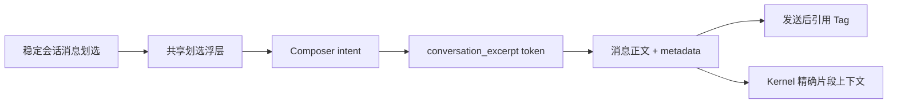

# 会话文本片段引用设计

## 背景与目标

工作台文件已经支持划选文本并添加到聊天，但稳定的历史会话消息还不能作为结构化引用复用。直接复制粘贴既丢失消息来源，也无法在输入框和发送后保持一致展示。本轮新增“会话文本片段引用”，让用户可以从 AI 回复或自己的历史消息中选取一段原文，作为可编辑、可复制、可发送且能被 AI 精确感知的上下文。

可观察目标：

- 稳定的 AI / 用户历史消息支持划选后“添加到聊天”；正在流式生成的消息不提供该入口。
- 输入框插入独立、紧凑的引用 Tag，只展示来源身份与短内容指纹；完整快照按需预览。
- Tag 可随混合编辑内容复制、剪切、粘贴、撤销和移除，发送后保持相同视觉语言。
- AI 获得用户选中时的精确快照，不依赖消息后续渲染或重新解析。
- 会话消息与工作台文本预览复用同一个划选浮层和时序规则。

## 核心判断

1. 使用独立的 `conversation_excerpt`，不复用 `workspace_excerpt`。前者的来源是会话消息和角色，后者的来源是项目文件与可选行号，两者只共享展示语言和编辑能力。
2. 每段选区都是一个独立引用，不聚合成“若干个已选片段”。常态 Tag 仅保留来源身份和短内容指纹，避免信息堆叠。
3. 片段内容以选中时快照为事实；`messageId` 与角色用于标识来源，不在首版承担回跳定位。
4. 划选浮层只在选择完成后出现。鼠标按住拖动期间隐藏且不追随指针；`pointerup` 后在下一动画帧读取最终选区并定位，不增加可感知的毫秒延迟。键盘划选同样只合并到下一帧。
5. 所有入口最终进入既有 composer intent、inline token metadata 和 kernel context provider 主链路，不建立旁路 prompt 或隐藏状态。

## 协议与 Owner

`conversation_excerpt` metadata 包含：

- `key`：片段引用身份；
- `messageId`：来源消息身份；
- `role`：`assistant` 或 `user`；
- `label`：本地化的来源身份标签；
- `excerpt`：选中时的完整原文快照；
- `rawText`：消息正文中的语义锚点。

Owner 分工：

- shared selection action：读取选区、管理拖选时序、限制大小、碰撞定位和主操作浮层；工作台预览与会话列表共同复用。
- message list：标记稳定且可划选的消息边界，并提供消息身份、角色与来源标签。
- chat composer intent manager：把片段创建请求投递到目标会话输入框。
- composer：在当前 caret 插入原子 token，负责结构化剪贴板和发送 metadata。
- message renderer：从 metadata 恢复相同的紧凑引用展示。
- kernel context provider：按预算注入精确片段快照，并明确其为引用数据而非高优先级指令。

## 展示与交互

- Tag 常态展示语义图标、来源身份和单行内容指纹，不展示时间、行数、字符数或消息 ID。
- hover / focus 预览完整快照；composer 中保留既有悬浮移除按钮，按钮不挤压布局。
- 非空选区才显示入口；超过 8,000 字符时明确禁用并提示过长，不静默截断。
- 浮层以最终选区在当前视口内的整体可见范围为锚点，水平居中且优先放在上方；上方空间不足时翻转到下方，并限制在可见视口内。
- `pointerdown` 进入拖选态并隐藏旧浮层；拖选期间的 `selectionchange` 不触发定位；`pointerup` 后下一帧一次性显示。滚动、缩放、取消选区或 `Escape` 关闭浮层。
- 不改变浏览器原生选区与复制行为；点击“添加到聊天”成功后才清除选区。

## 边界与非目标

- 首版仅支持最终态 AI / 用户文本消息；流式消息、工具过程、附件画布和不可稳定选择的嵌入内容不开放入口。
- 不提供“解释这段”“重写这段”等复合 action；未来应组合同一个引用意图，而不是新增协议。
- 不在首版实现来源消息回跳，也不把选区重新映射为易漂移的 DOM 坐标。
- 不把多个片段折叠成聚合 Tag；用户应能独立识别、排序和删除每个引用。

## 验收与验证

- 鼠标拖选期间浮层不可见，松手后的下一动画帧可见；首次进入页面的第一次划选同样有效。
- 浮层在窄视口和边缘选区下不越界；文件预览和会话消息行为一致。
- composer intent、token metadata、复制粘贴、发送恢复和 kernel 上下文均保留完整快照与来源信息。
- 流式消息不会创建引用；稳定的 AI / 用户消息可以创建引用。
- 相关定向测试、四个受影响 package 的 TypeScript 检查、定向 lint 和 maintainability guard 通过。
