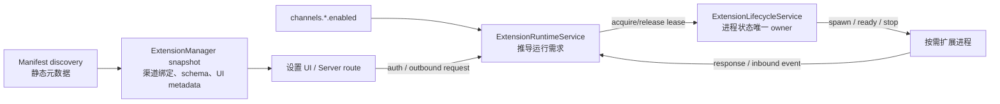

# NextClaw 扩展运行时按需激活设计

## 背景与问题

NextClaw 0.29.0 在用户未接入、未启用任何渠道时，Linux 空闲工作集仍稳定在约 865～885 MiB，启动峰值约 1,014 MiB。逐进程 PSS 和 Node diagnostic report 表明，这不是 kernel 单体过重，也没有证据指向单一泄漏点，而是扩展生命周期把“已发现、可展示的扩展”直接等同于“必须常驻的扩展”：

```text
发现全部 manifest
  -> 生成渠道贡献和设置 UI 元数据
  -> ExtensionRuntimeService.start()
  -> ExtensionLifecycleService.startAll(manifests)
  -> 每个 manifest spawn 一个 Node 进程
  -> 子进程静态加载平台 SDK 并创建 channel runtime
  -> 最后才根据 channels.<id>.enabled 决定是否启动业务连接
```

同口径 Linux ARM64、2 CPU、2 GiB 隔离测试结果如下：

| 场景 | 进程结构 | 稳定工作集 | 峰值 |
| --- | --- | ---: | ---: |
| 默认空配置 | 主进程 + 10 个扩展进程 | 约 885 MiB | 约 1,030 MiB |
| 关闭全部扩展发现 | 仅主进程 | 约 155 MiB | 约 183 MiB |
| 核心 + 微信扩展 | 主进程 + 1 个扩展进程 | 约 177 MiB | 约 210 MiB |
| 核心 + Discord 扩展 | 主进程 + 1 个扩展进程 | 约 248 MiB | 约 294 MiB |

默认场景中，主进程 PSS 约 159 MiB，10 个扩展子进程 PSS 合计约 698 MiB，扩展进程占容器稳定工作集约 79%。因此本设计的目标不是微调 V8 参数，而是修正扩展激活合同：用户只为正在使用或正在操作的扩展支付运行时内存。

## 当前证据与违反点

### 当前 producer、owner 与 consumer

- `ExtensionManifestDiscoveryService` 发现内置、已安装、workspace 和开发扩展 manifest；manifest 已包含渠道名称、配置 schema、UI hints、鉴权和出站能力声明。
- `ExtensionManager` 持有 manifest 投影形成的 `ExtensionSnapshot`，向 channel registry、设置 UI 和 server 鉴权路由提供静态贡献。
- `ExtensionRuntimeService` 持有 endpoint、扩展 token、pending request 和请求/响应桥，是扩展请求与运行需求的事实拥有者。
- `ExtensionLifecycleService` 持有 `extensionId -> ChildProcess`，但当前只有 `startAll/stopAll`，没有单扩展状态、ready、租约和空闲退出语义。
- `NextClawExtension` 和 extension SDK 在子进程内建立 transport、event stream、capability handler 和 channel controller。
- 设置页和 `channel-auth.utils.ts` 通过静态 `ExtensionChannelBinding` 发起 auth；消息出站也通过相同 binding 发起 extension request。

### 第一处错误

`ExtensionRuntimeService.start()` 把全部 manifest 交给 `ExtensionLifecycleService.startAll()`。这把两个不同事实合并了：

- discovered：扩展已安装，能力和设置可以展示；
- demanded：扩展此刻必须拥有执行进程。

违反的核心原则是 `single-complete-owner`：当前没有对象完整拥有“为什么运行、何时 ready、何时停止、崩溃后是否恢复”的生命周期。`startAll()` 只拥有 spawn 动作，业务启用判断却延迟到子进程内完成。

### 第二处错误

`ExtensionChannelController.applyConfig()` 当前先调用 `adapter.configure(config)`，随后才判断 `enabled=false`；`BusChannelAdapter.configure()` 又会先创建具体 channel runtime。各扩展 `main.ts` 还会在读取配置前静态导入 Discord、Email、Slack 等平台实现。

所以即使没有建立平台连接，禁用扩展仍然支付了：

- 独立 Node/V8 isolate；
- extension SDK transport 和事件总线；
- 平台 SDK 模块与其 JS heap；
- channel adapter/runtime 构造成本；
- WebSocket、父进程 watcher 和线程栈。

## 目标与设计合同

### 用户可观察目标

- 没有启用渠道时，不存在渠道扩展子进程。
- 设置页仍能展示所有已安装渠道的名称、配置和鉴权入口。
- 启用渠道后自动启动对应扩展，无需重启 NextClaw。
- 禁用渠道后，在安全排空和短宽限期结束后释放对应扩展进程。
- 未启用渠道进行扫码、登录或连接时，扩展可临时运行，鉴权会话不会在轮询之间丢失。
- 扩展启动失败、崩溃、超时和停止过程均有明确状态与可诊断错误，不以静默超时作为正常控制流。

### 核心不变量

1. manifest discovery 永远是纯读取，不启动进程，不连接平台。
2. 一个 extension ID 只有一个 lifecycle record 和最多一个活动子进程。
3. 一个扩展只有存在至少一个有效运行租约时才允许处于 `starting/running`。
4. `channels.<channelId>.enabled === true` 是渠道持续运行的唯一配置语义；缺失或 `false` 均为禁用，与 UI、CLI 和 `ChannelManager` 保持一致。
5. 一个 manifest 贡献多个渠道时，只要任一渠道启用，该扩展持有一个持续租约和一个进程。
6. extension request 必须在对应进程完成 ready 握手后发送；启动失败时请求立即失败，不等待通用 60 秒超时。
7. 鉴权会话租约覆盖 `start -> 多次 poll -> authorized/expired/error` 全生命周期，终态或 `expiresAt` 到期后释放。
8. 服务 shutdown 强制停止全部扩展并拒绝全部 pending request，不等待空闲宽限期。
9. 进程退出必须清理 ready、请求和租约关联；只有仍有持续需求时才允许受控重启。
10. 未启用扩展不得仅为展示设置 UI 而启动。

## 推荐架构

### 控制面与执行面分离



控制面沿用 manifest 静态贡献，不依赖扩展进程。执行面只在有真实需求时创建进程。不会新增第二套 registry、auth binding 或 channel 配置投影。

### Owner 分工

#### `ExtensionManager`

继续拥有静态 `ExtensionSnapshot`，不拥有进程状态。`load/reloadForConfigChange` 在更新 snapshot 后，把最新 manifest 与 config 交给 runtime 做需求协调；读取方法保持纯读。

#### `ExtensionRuntimeService`

拥有运行需求的业务语义：

- 保存已发现的 `extensionId -> manifest` 和 endpoint；
- 从 config 与 channel binding 推导持续启用需求；
- 在 auth/outbound 请求前申请合适租约；
- 维护 auth `sessionId -> lease`，依据 auth 结果释放；
- 继续拥有 extension token、pending request 与响应关联；
- 把物理进程操作委托给现有 `ExtensionLifecycleService`。

它不直接保存 `ChildProcess`，也不自行实现重启定时器。

#### `ExtensionLifecycleService`

扩展现有 owner，使其完整拥有每个扩展的进程状态和租约集合：

```ts
type ExtensionProcessState =
  | "stopped"
  | "starting"
  | "running"
  | "stopping"
  | "failed";

type ExtensionLeaseReason =
  | { kind: "enabled-channel"; channelId: string }
  | { kind: "auth-session"; sessionId: string; expiresAt: string }
  | { kind: "auth-handoff"; channelId: string; expiresAt: string }
  | { kind: "request"; requestId: string };
```

每条 lifecycle record 至少包含 manifest、state、process、ready promise、leases、stop grace timer 和有限重启状态。公共意图接口应收敛为：

```ts
acquire(manifest, reason): Promise<ExtensionLease>
markReady(extensionId, pid): void
release(lease): void
reconcile(manifests, persistentDemand): Promise<void>
stopAll(): Promise<void>
status(): ExtensionRuntimeStatus[]
```

`ExtensionLease.release()` 必须幂等。调用方不得读取 `processes` 后自行判断是否 spawn/stop。

### 运行需求模型

#### 持续启用租约

`ExtensionRuntimeService` 根据 manifest channel binding 和最新 config 构建：

```text
extensionId -> Set<enabled channelId>
```

配置变化后与当前持续租约做差量 reconcile：

- `false/缺失 -> true`：申请 `enabled-channel` 租约，启动并等待 ready；
- `true -> false/缺失`：释放对应租约；
- 同一扩展还有其它启用渠道或临时租约：继续运行；
- 最后一个租约释放：进入空闲宽限期，随后停止。

推荐宽限期为 30 秒，只用于吸收配置连改和紧邻请求；shutdown、卸载和安全撤销不使用宽限期。

#### 鉴权会话租约

`channel.auth.login` 是单个长请求，请求租约覆盖到调用结束。

`channel.auth.start` 返回 `sessionId/expiresAt` 后，将初始 request 租约转换为 auth session 租约；后续 poll 复用同一租约。以下情况释放：

- `authorized`、`expired` 或 `error`；
- poll 返回 `null`；
- 到达 `expiresAt`；
- 扩展进程崩溃或服务停止。

`pending/scanned` 保持租约。UI 暂停轮询不会让进程无限常驻，因为 `expiresAt` 是权威上限。

鉴权成功时，auth session 租约先转换为短期 `auth-handoff` 租约，再向 server 返回结果。server 保存包含 `enabled: true` 的 channel config，配置 reload 建立持续启用租约后显式确认 handoff 完成；只有此时才释放 handoff。若保存或 reload 失败，handoff 在有界截止时间后释放并记录错误，不能依赖 30 秒进程宽限期碰巧覆盖异步 config watcher。

#### 出站请求

出站发送要求渠道配置已经 `enabled === true`。正常情况下持续启用租约已经保证进程存在；请求仍申请短 request 租约，以避免与并发禁用操作产生“释放后发送”的竞态。禁用渠道的出站请求明确失败，不通过临时启动绕过产品配置。

### Ready 握手

当前 `spawn()` 返回只代表 OS 已创建进程，不代表扩展 WebSocket 已连接或 capability handler 已注册。直接发 `extension.request` 可能丢失事件并最终表现为 60 秒超时。

新增一条 generation-scoped 内部 runtime ready 握手：

1. lifecycle 为每次 spawn 生成不可预测的 generation nonce 和该 generation 专属 token，通过环境变量传给子进程；
2. 子进程创建 capability handler 和 config listener，并用 extension ID、generation、token 建立 event stream；
3. server 验证 credential 与当前 lifecycle generation 一致；client registry 接纳新 generation 时关闭同 extension ID 的旧 socket；
4. extension transport 等待 WebSocket `open`，随后通过受 token 保护的 ingress 上报 `extension.runtime.ready`，携带 extension ID、generation 和 PID；
5. kernel 校验 token、目标 ID、当前 generation 和 PID，完成该 generation 的 ready promise；
6. 等待中的请求携带目标 generation 后再发送事件；event-stream principal 只允许接收同一 generation 的 request；
7. 所有 extension ingress/response 同样校验当前 generation，旧进程即使延迟发包也会被拒绝。

只保护 ready 消息不够：当前 event stream 按 extension ID 授权，未加 generation 会让尚未断开的旧 socket 同时收到新请求。generation 必须同时进入 credential、principal、request target 和 ingress 授权。启动超时建议 15 秒；超时终止该 generation 并向调用方返回明确的 `Extension failed to become ready`。

### 子进程配置与 SDK 加载顺序

extension SDK 的配置应用顺序改为：

```text
读取 config
  -> enabled !== true：只保留 auth/capability transport，不 configure、不创建 channel runtime
  -> enabled === true：动态加载平台 runtime，configure，start
```

每个扩展 `main.ts` 不再静态导入重型平台 channel 实现，改为在实际 channel 激活时动态导入。鉴权 capability 可以独立动态加载；auth-only 进程不应顺带构造消息 channel。

这层优化不是按需进程的替代品。第一阶段先消除禁用扩展进程，第二阶段再降低临时鉴权与活跃扩展本身的 heap。

## 生命周期与场景矩阵

| 场景 | 期望行为 | 租约/状态 |
| --- | --- | --- |
| 新安装、全部渠道禁用 | 只展示设置，不启动进程 | 无租约，`stopped` |
| 服务启动时渠道已启用 | 对应扩展各启动一次并等待 ready | 持续租约，`starting -> running` |
| 运行中启用渠道 | 不重启宿主，按需启动扩展 | 新增持续租约 |
| 运行中禁用最后一个渠道 | 排空请求，30 秒后退出 | 最后租约释放，`running -> stopping -> stopped` |
| 禁用状态开始扫码 | 临时启动，保持到鉴权终态/过期 | auth session 租约 |
| 扫码成功并启用 | auth 租约平滑转为持续租约，不重启进程 | `running` 不变 |
| 鉴权已成功但配置 reload 延迟 | handoff 租约维持进程，直到持续租约建立或有界失败 | `running` 不变 |
| 用户关闭或刷新鉴权页面 | 不立即杀进程；到 `expiresAt` 自动释放 | auth session 租约有界存活 |
| 多个并发请求命中 stopped | 共用同一个 starting/ready promise | 一个进程、多个 request 租约 |
| 启动失败 | 所有等待请求收到同一明确错误 | `starting -> failed` |
| 活跃扩展崩溃 | 拒绝进程内 pending request；有持续租约则有限退避重启 | `running -> failed -> starting` |
| auth-only 扩展崩溃 | auth session 失效，UI 明确要求重新开始，不伪恢复内存态 | `failed -> stopped` |
| manifest 被卸载 | 禁止新请求，取消临时会话并立即停止 | 强制释放并 `stopped` |
| 服务 shutdown | 拒绝 pending request，强制停止全部扩展 | 任意状态 `-> stopped` |

## 失败、恢复与重启策略

- 持续启用扩展异常退出时，最多进行有限指数退避重启，例如 1 秒、5 秒、30 秒；成功稳定运行后清零计数。达到上限保持 `failed`，由配置变更、显式重试或宿主下一次启动恢复，禁止无限快速拉起。
- 临时 auth session 的核心状态位于子进程内，崩溃后不可证明可恢复；直接结束会话并返回“扩展已退出，请重新开始授权”，不伪造续接。
- request timeout、进程 exit、stop 和 response 必须竞争安全地只结算一次 pending request，并始终释放 request lease。
- 新 generation 启动时旋转 token，并关闭同 extension ID 的旧 event-stream socket；request 和 ingress 仍以 generation 做第二层授权，不能把 socket close 当成唯一正确性保证。
- 零租约触发 stop 后若立刻出现新需求，取消 grace timer；若已经进入 `stopping`，等待退出后再启动新 generation，不让两个 generation 并存。
- config reload 或 manifest reload 失败时保留上一个已验证 snapshot 和对应运行需求，不使用半加载 manifest 驱动 stop/start。
- 日志至少包含 extension ID、generation、旧状态、新状态、lease reason、PID、启动耗时和退出原因；token 和渠道密钥不得进入日志。

## 目录与依赖边界

本设计优先扩展现有 owner，不新增平行 lifecycle manager：

- `packages/nextclaw-kernel/src/services/extension-runtime.service.ts`：需求推导、auth session/request lease 编排和请求桥。
- `packages/nextclaw-kernel/src/features/extension-runtime/services/extension-lifecycle.service.ts`：物理进程状态、lease、ready、grace stop 和 restart。
- `packages/nextclaw-kernel/src/features/extension-runtime/types/extension-runtime.types.ts`：运行状态和租约合同。
- `packages/nextclaw-extension-sdk/src/services/extension-transport.service.ts`：等待 WebSocket ready、上报 ready ingress。
- `packages/nextclaw-extension-sdk/src/services/extension-channel-controller.service.ts`：先判断严格启用语义，再构造/启动 channel runtime。
- `packages/extensions/*/src/main.ts`：按渠道拆分轻入口和动态平台实现加载。

跨 workspace 的 ready ingress key 和 payload 走 `@nextclaw/shared` 公共入口；kernel、service、server 和 extension SDK 不通过 alias 深入导入其它 package 私有文件。

## 删除与禁止新增的路径

实现完成后删除或替换：

- 删除 `ExtensionLifecycleService.startAll()`；标准入口变为 reconcile/acquire。
- 删除 `ExtensionChannelController` 中“configure 后再判断 enabled”的顺序。
- 删除 `defaultChannelEnabled()` 对缺失 `enabled` 的隐式启用语义。
- 删除渠道入口对重型 channel runtime 的启动期静态导入。
- 不新增第二套 extension registry、channel config owner 或 auth router。
- 不为每个渠道复制一套 lease manager。
- 不把所有渠道合并回 kernel 主进程；继续保留活跃扩展的故障与依赖隔离。
- 不把 `NEXTCLAW_DISABLE_BUILTIN_EXTENSIONS` 当成正式节省内存方案；它继续只表达“不要发现内置扩展”的开发/打包覆盖。

## 兼容与迁移

- 不改变配置文件结构，不需要持久化 migration。
- 内置渠道 schema 已把 `enabled` 默认设为 `false`；已有 `enabled: true` 用户启动行为保持不变。
- 第三方扩展如果过去依赖“缺失 enabled 等价于启用”的隐式行为，新版本将不再自动运行。加载诊断应明确提示设置 `channels.<id>.enabled=true`，但不保留隐式兼容分支。
- manifest、config schema、UI metadata、auth/outbound binding 的公共形状保持不变；调用方无需知道进程是否已经存在。
- 新增 ready ingress 属于 NextClaw 内部运行协议，kernel 与 extension SDK 必须同版本交付。当前扩展通过 workspace/package 版本一起发布，不引入双协议并行。
- 回滚依赖上一版本发布物，不增加长期 feature flag 或第二条 eager-start 路径。

## 实施阶段

### 阶段一：消除禁用扩展常驻

1. 为 lifecycle 增加单扩展 record、幂等 acquire/release、grace stop 和 status。
2. runtime 根据 `enabled === true` 建立持续租约，替换 `startAll()`。
3. config reload 后差量 reconcile；服务 shutdown 强制 stopAll。
4. controller 在 configure/create runtime 前判断 enabled。

阶段一完成即应把空配置稳定工作集从约 885 MiB 降至接近纯核心的约 155 MiB。

### 阶段二：闭合按需请求与鉴权

1. 增加 generation-safe ready 握手。
2. request 在 ready 后发送并用 request lease 覆盖并发禁用窗口。
3. 增加 auth session lease、终态释放和过期清理。
4. 闭合启动失败、崩溃、pending request 与重启策略。

### 阶段三：降低活跃扩展成本与增强诊断

1. 渠道重型 SDK 改为激活时动态 import。
2. auth-only 进程不创建消息 channel runtime。
3. 在 diagnostics/doctor 中展示 extension state、PID、lease reason、启动耗时、退出原因和可用时的 RSS/PSS。
4. 固化 Linux 空配置、单渠道和开关渠道内存基准。

阶段不可倒置：只做 SDK lazy import 无法消除十套 Node/V8；只做 enabled spawn 而没有 auth lease/ready，则会引入扫码状态丢失和首次请求超时。

三个阶段是开发检查点，不是可独立发布的里程碑。阶段一不能在阶段二完成前单独合入可发布分支；最终交付必须同时闭合按需 spawn、ready/generation、auth session/handoff、配置 reconcile 和失败恢复。

## 验证与验收标准

### 行为验证

- lifecycle 单测覆盖 acquire 幂等、并发 acquire 共用一次 spawn、release、grace stop、stop 中重新 acquire、generation 隔离和 stopAll。
- runtime 单测覆盖空配置零进程、一个/多个 enabled channel、同 extension 多 channel、config enable/disable 差量 reconcile。
- request 测试覆盖 ready 前不发事件、ready 后发送、启动失败快速失败、response/timeout/exit 只结算一次。
- auth 测试覆盖 start 后跨多次 poll 保持进程、终态释放、expiresAt 清理、授权成功平滑转持续租约、auth-only 崩溃明确失败。
- extension SDK 测试覆盖禁用时不 configure/create/start、启用时严格按序执行、配置从 false 切 true 和 true 切 false。
- server/event-stream 测试覆盖 ready ingress token、extension ID、PID/generation 校验和越权拒绝。
- generation 隔离测试必须故意保留旧 WebSocket，再启动同 extension ID 的新 generation；新 request 只能到达新进程，旧 generation 的 ready、response 和 ingress 全部被拒绝。
- auth handoff 测试必须故意延迟 config watcher/reload；从 `authorized` 到持续启用租约建立之间进程不得退出或重启，reload 失败时 handoff 有界释放并暴露错误。

### 真实链路验证

- 新配置启动 60 秒内始终没有扩展子进程。
- 运行中启用微信，只新增一个微信扩展进程并成功收发。
- 运行中禁用微信，既有请求完成，宽限期后进程退出。
- 禁用状态发起微信/飞书扫码，轮询跨多个间隔仍保持同一会话；取消/过期后进程退出。
- 并发发起多次 auth/outbound 不产生重复扩展进程。
- 人为终止持续启用扩展，观察有限退避恢复；人为终止 auth-only 扩展，UI 收到不可恢复错误。
- 并发 20 个请求命中 stopped 扩展只产生一个 spawn；在 starting/stopping 窗口切换 enabled 不产生双 generation 或孤儿进程。

### 原功能兼容性门槛

内存目标不能覆盖功能回归。除新增生命周期行为外，最终验收还必须证明原有主路径保持可用：

- 配置文件结构、渠道 schema、设置页静态 metadata、`channels list/status` 和 UI 配置 API 的公共形状不变。
- 已有 `enabled: true` 渠道在服务启动和运行中配置切换后都能正常进入 `running`；禁用后不需要重启宿主即可退出。
- 微信和飞书原有鉴权 `start -> 多次 poll -> authorized/pending/expired` 合同不变；授权成功后配置落盘、持续租约接管，进程 PID/generation 不发生无意义重启。
- 至少一个真实渠道完成“平台入站 -> NCP 会话 -> agent/model -> 平台出站回复”冒烟；必须同时检查服务日志没有渠道发送错误，不能只检查模型生成了文本。
- 十个内置渠道扩展必须全部通过 TypeScript 和生产构建；存在测试脚本的渠道全部运行原有测试，不以只测微信来代表其它扩展。
- extension SDK、kernel、server、service 的本次改动定向测试必须全绿；再运行相邻 package 的完整回归。完整回归中的既有或并发任务失败必须给出文件、错误和归属证据，任何本任务相关失败都不得豁免。
- 空载健康接口、配置读取、渠道列表、runtime status 和动态启停 API 必须在最终生产镜像内真实调用，不以源码单测替代打包后行为。

### 内存验收

标准基准固定为 Linux、2 CPU、2 GiB、空 workspace、无活跃 agent/model 请求，记录 60 秒稳定工作集、峰值、进程树和 PSS：

- 空配置：扩展子进程数为 0，稳定工作集目标不高于 220 MiB，峰值不高于 300 MiB。
- 单微信：扩展子进程数为 1，稳定工作集目标不高于 260 MiB。
- 单 Discord：扩展子进程数为 1，稳定工作集目标不高于 330 MiB。
- 禁用最后一个渠道后 60 秒内，扩展进程数回到 0，工作集回到空配置基线 + 30 MiB 以内。
- 不以 macOS Activity Monitor 的 RSS 求和作为唯一依据；Linux 优先使用 cgroup working set、`smaps_rollup` PSS 和进程树共同判定。

最终发布前再在主流 AMD64 VPS 上复测相同矩阵；Docker ARM64 数据用于架构验收和回归比较，不直接承诺所有 VPS 的绝对数字。

### 验收判定

- 上述行为、真实链路和内存项全部是 P0；任一失败都不得宣称完成。
- 每个内存场景连续运行三次，三次均达标，不用单次最好值。
- 自动化通过后仍需运行真实微信/飞书鉴权和至少一个渠道收发冒烟；外部平台凭证不可用时必须明确列为真实阻塞，不能用 mock 冒烟冒充。
- 实现阶段可分批开发，但最终验收只针对完整单一路径；不得保留 eager `startAll()` 作为 fallback 来换取测试通过。
- 验收报告必须包含版本/commit、CPU 架构、内存限制、采样时点、cgroup working set/peak、PSS、进程树、三轮原始结果和未覆盖边界。

## 2026-08-09 实施验收记录

### 构建与环境

- 基线 commit：`5b7b947f1723eb46aeaf5bab29c653ce440e1eda`，在干净 HEAD 上只叠加本设计的 47 个源码文件构建；没有把同工作区其它 UI/会话改动带入镜像。
- 最终 ARM64 镜像：`sha256:3c3d557eaf23940dd5fd21384b7a58c59e6e0cd93529588fbc4de9e661ca62a1`，Debian 12 / LinuxKit 6.10.14 / ARM64，Node 22。
- 同一源码另完成 AMD64 生产镜像构建：`sha256:085d9c6540ca2e83bf8048ea06f78db73329faa559c02ab8407f7d1e44baf93a`；在 `linux/amd64` 模式下验证 `uname -m=x86_64`、Node `process.arch=x64`、健康接口、runtime 状态接口和十渠道清单，均通过。该结果只作为架构与功能兼容证据，不把 QEMU 模拟值计入 VPS 内存指标。
- 每轮限制：2 vCPU（`cpu.max=200000 100000`）、2 GiB（`memory.max=2147483648`）、全新 tmpfs `/data`、空 workspace、无主动 agent 请求；健康后稳定 60 秒采样。
- working set 采用 `memory.current - inactive_file`，peak 采用 `memory.peak`，PSS 汇总 `/proc/*/smaps_rollup`。采样本身通过短生命周期 `docker exec` shell 执行，因此 process count 与 PSS 包含一个瞬时采样进程；扩展子进程数按 cwd 独立判定。

### 三轮内存结果

| 场景 | 扩展子进程 | working set 三轮（MiB） | 平均 | peak 三轮（MiB） | 平均 | PSS 三轮（MiB） | 平均 | 判定 |
| --- | ---: | --- | ---: | --- | ---: | --- | ---: | --- |
| 空配置 | 0 / 0 / 0 | 172.67 / 161.41 / 160.74 | 164.94 | 222.84 / 187.91 / 187.25 | 199.33 | 208.16 / 209.87 / 209.58 | 209.20 | 通过 |
| 单微信 | 1 / 1 / 1 | 201.96 / 187.05 / 189.84 | 192.95 | 231.29 / 217.78 / 218.52 | 222.53 | 249.67 / 234.89 / 237.26 | 240.61 | 通过 |
| 单 Discord | 1 / 1 / 1 | 247.95 / 245.84 / 239.62 | 244.47 | 310.70 / 288.37 / 278.61 | 292.56 | 292.72 / 292.44 / 286.10 | 290.42 | 通过 |

与 0.29.0 同口径空载约 865～885 MiB 相比，最终空载平均 working set 降至 164.94 MiB，减少约 80.9%～81.4%，并把扩展子进程从 10 个降到 0。禁用最后一个微信渠道后，租约立即清空，约 30 秒后子进程按预期收到 `SIGTERM`；60 秒时子进程为 0、working set 为 160.48 MiB、PSS 为 208.80 MiB，处于空载基线 + 30 MiB 内。

### 生命周期与兼容性结果

- 生产镜像完整构建通过；shared、extension SDK、kernel、server、service 与十个渠道扩展共 15 个 package 的 TypeScript 通过，47 个本任务源码文件 ESLint 为 0 warning，定向 governance 和 maintainability guard 均为 0 blocker。
- 本任务定向自动化通过：extension SDK 20、kernel 15、server 15、service 4、微信 31、飞书 14、QQ 9，共 108 项；十个渠道全部通过生产 build，所有定义了测试脚本的渠道测试全绿。
- UI 配置 API 把 Discord 从 disabled 切为 enabled 后约 1 秒进入 `running`，仅生成一个子进程；切回 disabled 后租约清空并在 30 秒宽限期后以 expected `SIGTERM` 停止，不需要重启宿主。
- 人为 `SIGKILL` 持续启用的 Discord 后，runtime 记录 `expected=false`，约 1 秒后 PID 从 61 变为 185、generation 完整旋转并恢复 `running`。
- 空载实例调用真实微信鉴权接口后才启动微信进程；真实微信服务返回二维码，连续 poll 复用同一 PID/generation。真人扫码后返回 `authorized`，配置自动写为 `weixin.enabled=true`，持续租约接管且 PID 152、generation 保持不变。
- 真人微信发送“你好”后，隔离实例落盘真实 `weixin:direct` 入站会话，agent/model run 正常完成并生成平台回复；服务和容器日志未出现 `weixin send failed` 或 `Error sending to weixin`，原有扫码、入站、会话、模型和出站主链路通过。
- 飞书真实鉴权 start 获得平台二维码，连续 poll 保持同一 PID/generation 和 auth-session 租约；真人扫码后返回 `authorized`，配置自动写为 `feishu.enabled=true`，持续租约接管且 PID 301、generation 保持不变。
- 真人从飞书发送“你好”后，隔离实例在 `feishu:direct` 会话收到真实入站消息；agent/model run 于约 7.4 秒完成并生成平台回复，journal 明确记录 `outcome=completed`、`message.completed` 与 `run.finished`，服务日志未出现 Feishu/Lark 收发错误。原有飞书扫码、授权、配置落盘、入站、会话、模型和出站主链路通过。

相邻完整回归中没有发现本任务相关失败。已知非本任务问题仍需单独处理：kernel 完整回归 303/304，剩余一项是既有 panel-app VM sandbox 缺少 `URLSearchParams`；service 的 175 项 assertion 全部通过，但测试进程因既有 cron test `afterAll` 超时和空响应 JSON parse 未处理错误退出。它们不作为本设计功能通过的替代证据，也没有在本次范围内被修改。

### 尚未闭合的发布边界

- 本轮内存数字来自受限 Linux ARM64 容器，足以证明进程生命周期、相对降幅和当前架构门槛，但不能当作所有 VPS 的绝对承诺。
- AMD64 生产构建和架构功能冒烟已经通过，但 Docker/QEMU 内存会混入模拟器开销；最终面向用户发布前仍必须在真实 2 vCPU / 2 GiB AMD64 VPS 上按同一矩阵连续三轮复测。
- 微信、飞书真实鉴权与收发、ARM64 Linux 内存和 AMD64 架构功能均已通过。唯一尚未执行的是主流 AMD64 VPS 绝对内存矩阵；按本文 P0 规则，当前结论是“实现与功能兼容验收通过，ARM64 Linux 内存验收通过，发布级 AMD64 VPS 绝对内存验收待外部主机闭合”，不能把 ARM64 数字直接承诺为所有 VPS 的绝对值。

## 非目标

- 不在本次把 Node 扩展运行时替换为 Bun、Deno 或原生进程。
- 不在本次把多个活跃渠道合并进共享 worker；按需隔离已经解决主要问题，共享 worker 会重新引入故障域和依赖冲突。
- 不改变渠道协议、消息路由、NCP 会话语义或用户配置字段。
- 不实现跨宿主重启恢复扫码会话；当前会话状态位于扩展内存，崩溃后明确重新授权。
- 不用 aggressive GC、低 heap limit 或定期强杀进程掩盖生命周期错误。
- 不把“空闲内存低”扩大成 agent、浏览器、MCP 或模型推理的整体性能治理。

## 待评审决策

本设计给出的推荐默认值如下，review 时只需要确认或修改这些产品/运行合同：

1. 渠道持续启用是否统一采用严格的 `enabled === true`。
2. 零租约空闲宽限期是否采用 30 秒。
3. extension ready 超时是否采用 15 秒。
4. 持续启用扩展是否采用三次有限退避重启（1 秒、5 秒、30 秒）。
5. 第三方扩展缺失 `enabled` 时是否只提示迁移、不保留隐式启动兼容。

除上述参数外，控制面/执行面分离、现有 lifecycle owner 扩展、鉴权 session lease、ready generation 和删除 eager `startAll()` 是本方案的主体，不建议拆成互相独立的可选修补项。
