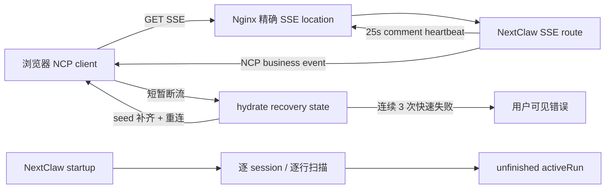

# SSE 恢复降噪与会话日志内存治理设计

## 文档状态

- 日期：2026-08-11
- 状态：实现完成，线上代理止血已验证；源码根治待后续版本发布并部署
- 适用范围：NextClaw Web Chat、NCP SSE transport、会话 hydration、NCP agent journal 启动恢复
- 关联愿景：可靠的统一入口、自感知连续性、开箱即用

## 背景

轻量 VPS 上的 NextClaw 前端可以正常使用，但会周期性展示 `Network Error`。用户可继续操作，说明它不是持续不可用，而是可恢复的 transport 抖动被错误提升成了用户可见故障。同时，systemd 显示服务内存长期高于预期，历史上还发生过两次 Node heap OOM。

这两个现象最终被证明属于同一条放大链路：

```text
空闲 SSE 超过 60 秒
  -> Nginx upstream read timeout
  -> 浏览器 stream Promise 结束
  -> hydrateError 立即进入会话错误区域
  -> 500 ms 后重连并重新 loadSeed
  -> 每分钟重新读取会话消息
  -> 大 journal / projection 恢复产生额外分配与文件页缓存
```

这不符合 NextClaw 作为长期个人操作层的可靠性目标：可自动恢复的连接抖动不应反复打断用户，而后台恢复也不应因为历史数据增长而失去内存上界。

## 现场证据

### SSE 与前端噪声

- Nginx error log 连续出现 `/api/ncp/agent/stream` upstream timeout，间隔约 61–63 秒。
- access log 中 SSE 响应状态仍是 `200`、响应体为 `0`，因为响应头已发出后才发生 upstream timeout。
- 每次断流约一秒后，浏览器都会请求 `/api/ncp/sessions/:sessionId/messages?limit=80`，单次响应约 53 KB。
- `use-hydrated-ncp-agent.ts` 在 stream 结束后立即写入 `hydrateError`，并把 `needsSeed` 设回 `true`；会话区域随后把该错误直接展示为失败消息。

### 内存与 OOM

- 现场主 NextClaw Node 进程 RSS 约 243 MiB，子 `server.mjs` 约 57 MiB，进程树常态合计约 300 MiB，原有常态内存优化仍然成立。
- systemd cgroup 一次采样约 659 MiB，其中匿名 RSS 约 179 MiB、文件页缓存约 480 MiB、swap 约 24 MiB。较高的 cgroup 数字不能直接等同于 Node 活跃堆。
- cgroup 历史峰值约 1.18 GiB。
- 两次 OOM 的 V8 栈都落在 `String::SlowFlatten` / `Runtime_StringSplit`，与 journal 的 `readFile(..., "utf-8")` 后 `split("\n")` 完全吻合。
- 启动恢复原先通过 `Promise.all` 并发读取每个 session journal；每个文件都会整文件解码、切分并构造完整事件数组，但恢复 unfinished run 实际只需要 `run.started`、`run.finished`、`run.error` 和 `message.abort`。

## 目标

1. 空闲 SSE 在常见反向代理后持续可用，不再被默认 60 秒超时切断。
2. 短暂且可恢复的断流不立即展示为会话失败；持续不可用仍必须可见。
3. 重连继续补齐可能错过的事件，不牺牲会话一致性。
4. unfinished-run 启动恢复具备明确的内存上界，不再随 journal 总大小线性放大峰值堆。
5. 通过同一真实公网入口和真实大 journal 验证，而不只依赖单测或配置检查。

## 非目标

- 本次不重写完整 NCP journal 存储格式。
- 本次不删除历史 journal，也不以清理用户数据来换取低内存。
- 本次不把所有网络错误静默吞掉。
- 本次不取消断流后的 seed 补齐，因为断流窗口内可能丢失事件。
- 本次不声称所有 projection 重建路径都已经有界；投影缺失或损坏时的全量 session 重放仍是后续治理项。

## 设计原则

### Transport 保活归 transport owner

SSE 路由负责发送协议合法的 comment heartbeat，反向代理负责允许长连接并关闭缓冲。业务事件层不制造伪事件来保活，也不要求页面产生无意义请求。

### 恢复状态与用户错误分离

“正在恢复”是内部 transport 状态，不等同于“用户操作失败”。初次 hydration 失败会阻塞页面，必须立即展示；已有健康会话的短暂断流可以自动恢复，只有连续快速失败后才升级为用户可见错误。

### 读路径必须纯读且有界

启动恢复是自动触发的 read path。它不能因为 session 数量或历史日志增长而并发加载所有内容，更不能为了判断一个小型生命周期状态而构造完整会话。

## 方案

### 1. 反向代理即时止血

为 `/api/ncp/agent/stream` 增加精确 Nginx location：

```nginx
location = /api/ncp/agent/stream {
    proxy_http_version 1.1;
    proxy_set_header Host $host;
    proxy_set_header X-Real-IP $remote_addr;
    proxy_set_header X-Forwarded-For $proxy_add_x_forwarded_for;
    proxy_set_header X-Forwarded-Proto $scheme;
    proxy_set_header Connection "";
    proxy_buffering off;
    proxy_cache off;
    proxy_read_timeout 1h;
    proxy_send_timeout 1h;
    proxy_pass http://127.0.0.1:18791;
}
```

变更流程必须是：备份现有配置、`nginx -t`、`systemctl reload nginx`。不需要重启 NextClaw，也不影响普通 HTTP/WebSocket location。

`1h` 是部署层保护，不是最终保活机制。源码 heartbeat 发布后，即使代理使用更短但合理的超时，也会持续收到数据。

### 2. SSE 路由心跳

Owner：`packages/nextclaw-server/src/app/utils/ncp-session-event-stream.utils.ts`

- 每 25 秒写出标准 SSE comment frame：`: keepalive\n\n`。
- heartbeat 不进入 NCP event bus，不改变业务事件协议，不触发前端会话状态更新。
- stream abort、cancel 或 close 时清理 timer 和 event subscription。
- 25 秒明显小于常见 60 秒代理超时，同时不会形成高频业务流量。

### 3. 前端恢复错误分级

Owner：`packages/ncp-packages/nextclaw-ncp-react/src/hooks/use-hydrated-ncp-agent.ts`

恢复合同：

```text
初次 seed 失败
  -> 立即展示 hydrateError

已有会话的 stream 断开
  -> needsSeed = true
  -> 500 ms 后补齐 seed 并重连
  -> 单次短暂失败不展示错误

连接建立后不足 10 秒就失败
  -> 计为一次快速恢复失败
  -> 连续 3 次后展示 hydrateError

连接已稳定至少 10 秒后断开
  -> 清零快速失败计数
  -> 视为可恢复断流，不展示会话失败
```

这里没有隐藏永久故障：持续无法连接时，约 1 秒内完成三次快速失败并展示错误；恢复成功后错误会清除。重连仍然执行 seed 补齐，因此没有用“安静”交换一致性。

### 4. unfinished-run 有界恢复

Owner：

- `packages/nextclaw-kernel/src/stores/ncp-agent-unfinished-run.store.ts`
- `packages/nextclaw-kernel/src/utils/ncp-agent-unfinished-run.utils.ts`

旧路径：

```text
列出全部 session
  -> Promise.all 并发 readFile
  -> 每个文件生成完整 UTF-8 string
  -> split 为全部行
  -> JSON.parse 为全部事件
  -> 构造完整 events 数组
  -> 扫描 run 生命周期
```

新路径：

```text
列出全部 session
  -> 逐 session 处理
  -> createReadStream + readline
  -> 每次只保留当前行
  -> 仅把 event 交给 run 生命周期 reducer
  -> 只保留一个 activeRun 小对象
```

生命周期 reducer 保持单一 owner，既供完整事件数组调用，也供 streaming scanner 逐事件调用，避免两套 run 判定逻辑漂移。

内存复杂度从“所有并发文件内容与事件对象之和”收敛为“Node 基线 + 单行大小 + 一个 activeRun 状态”。时间复杂度仍是 O(日志总行数)，但不会再以整文件字符串、行数组和完整事件数组放大峰值内存。

## 端到端状态流



## 真实验证

### 公网 SSE

- 修复前：同一浏览器会话在 01:30、01:31、01:32、01:34 周期性断流，每次随后补拉约 53 KB messages。
- 01:33:12 reload Nginx；01:34:01 是旧 worker 上既有连接的最后一次 timeout。
- 01:34:02 后的新连接持续到至少 01:45:23，跨越原超时边界约 11 分钟。
- 观察窗口内新增 SSE timeout、重连和 messages 补拉均为 0。
- `NRestarts` 保持为 2，NextClaw 服务没有因验证而重启。

### 真实大 journal 内存基准

在 VPS 上冻结一份真实 93,416,916 字节、59,403 行的 journal 副本，两个算法都成功解析完全相同的 59,403 行：

| 算法 | 最大 RSS | 耗时 |
| --- | ---: | ---: |
| 整文件 `readFile + split` | 296,244 KiB | 0.75 s |
| `createReadStream + readline` | 86,672 KiB | 0.82 s |

峰值 RSS 下降约 70.7%，代价是该样本增加约 0.07 秒扫描时间。对只在启动恢复执行的路径，这是合理取舍。

### 自动验证

- hydration/reconnect 定向测试：6/6 通过。
- SSE route 组装边界测试：3/3 通过，覆盖 25 秒 heartbeat comment frame。
- journal store 定向测试：17/17 通过，覆盖 unfinished-run 生命周期。
- `@nextclaw/ncp-react`、`@nextclaw/kernel`、`@nextclaw/server`、`@nextclaw/ui` TypeScript 检查通过。
- 触达文件 targeted ESLint 通过。
- diff-only maintainability guard 无阻塞项；已有 server app 目录预算例外未恶化。

## 部署顺序

1. 先保留已生效的 Nginx SSE 精确 location，作为旧版本服务的部署保护。
2. 发布包含 SSE heartbeat、恢复降噪和 streaming unfinished-run scan 的 NextClaw 版本。
3. 在隔离实例或维护窗口冷启动新版本，验证真实 journal 启动恢复；此项不能用热更新替代。
4. 从公网入口打开真实会话，跨过至少两个 60 秒边界，并完成一次下游发送动作。
5. 观察 Nginx timeout、messages 补拉频率、Node RSS、cgroup cache、服务重启数和 OOM 日志。

## 回滚

- Nginx：恢复 reload 前的时间戳备份，执行 `nginx -t` 后 reload。
- SSE heartbeat：回滚 server route 变更不会改变 NCP 业务事件合同，但必须保留 Nginx 长超时，避免重新出现 60 秒断流。
- 前端恢复分级：可独立回滚为立即展示错误，不影响 seed 一致性。
- journal scanner：可回滚到旧实现，但只应作为短期事故手段；大日志环境会重新暴露 OOM 风险。

## 剩余风险与后续工作

1. `NcpAgentSessionJournalStore.loadSession` 在 projection 缺失或损坏时仍会整文件读取、切分并完整重放。需要单独设计 streaming projection rebuild 或 checkpoint/compaction，不能把本次 unfinished-run 修复外推成“所有 journal 路径均已解决”。
2. journal 仍可能被细粒度 `message.tool-call-args-delta` 快速放大。后续应验证最终事件是否足以恢复完整 tool args，再决定合并持久化增量或增加安全 compaction；不能直接丢事件。
3. 当前 Nginx 修复属于单实例运维配置。Docker、安装脚本和文档是否应该提供标准 SSE proxy 模板，需要在发布阶段按部署合同统一处理。
4. 前端目前只区分是否展示错误，尚未提供低噪声的“正在恢复连接”状态。只有用户确实需要感知时再设计，不应重新制造 toast 噪声。

## 完成标准

- 线上代理止血已满足：真实公网连接跨过原 60 秒边界，无周期性 timeout、重连和补拉。
- 源码实现已满足：heartbeat、恢复错误分级和有界 unfinished-run scanner 均有定向测试、类型与 lint 证据。
- 内存算法已满足：同一真实冻结 journal 输入下，完整性一致且峰值 RSS 显著下降。
- 完整产品闭环尚差一步：源码版本发布并在冷启动实例部署验证后，才能把状态更新为“已发布并完成生产验证”。
