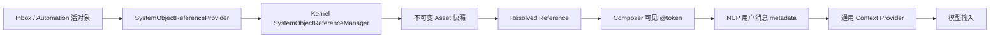

# 统一系统对象引用设计

## 背景

收件箱报告的“继续聊”最初通过 Session metadata 记录 `inbox_delivery_id`，再由运行时 Context Provider 隐式注入报告全文。该方案存在三个根本问题：

1. 用户看不到知识来源，同样的可见输入可能产生不同结果。
2. Chat Session 反向感知 Inbox 业务字段，形成跨域耦合，并曾导致创建会话与读取 Inbox 上下文互相等待。
3. 定时任务、邮件、报告等系统对象若分别建设专属引用链路，会持续复制搜索、序列化、快照和运行时注入机制。

产品需要的不是“继续聊特例”，而是统一、可见、可复现的 `@系统对象` 能力。统一协议不等于平铺展示；系统对象还需要一套能浏览、分组、搜索和扩展的资源目录。

## 愿景对齐

该能力服务 NextClaw 的统一入口、自感知连续性和用户数据统一管理：用户在同一个输入框中显式引用 NextClaw 管理的对象，Chat 通过 NCP 的通用消息与上下文机制使用它们，不要求用户理解对象所属模块或运行时注入细节。

## 核心判断

### 系统对象

系统对象是由 NextClaw 管理、具有稳定身份和生命周期、能够导出文本快照的领域实体。报告和定时任务都属于系统对象；普通工作区文件仍由现有文件引用协议管理，Panel App 的执行入口也不等同于知识对象。

对象业务 owner 继续拥有活对象：

- Inbox 管理报告内容、未读、归档和删除。
- Automation 管理定时任务配置、启停和执行状态。
- Chat 不读取这些 manager，也不保存它们的专属字段。

### 引用

引用是用户消息中可见、可移除的 `@对象` token。底层保存通用 URI，而不是 `inbox_delivery_id`、`cron_job_id` 等字段：

```text
nextclaw://objects/inbox-delivery/<encoded-id>
nextclaw://objects/cron-job/<encoded-id>
```

### 快照

活对象不能直接成为历史消息的事实源。选择引用时通过显式解析 action 导出只读快照，写入 Asset Store，并以内容 SHA-256 作为版本。消息保存：

- 对象 URI；
- 对象类型和显示名称；
- 内容哈希版本；
- 快照 `assetUri`、MIME、文件名和大小。

后续对象更新、归档或删除不会改变已发送消息的语义。

## 功能复盘

初版实现把 Inbox 和 Cron provider 的结果全局排序后，统一放进“系统对象”区。它解决了传输协议，却遗漏了资源发现设计：

- 默认打开 `@` 就平铺大量报告，定时任务被淹没；
- 用户只能从行尾副标题猜类型，没有清晰的资源组入口；
- 全局搜索结果仍混排，无法判断搜索范围和返回路径；
- Composer 根据 `objectType` 硬编码名称与图标，每增加一种对象都要改前端；
- 全局 limit 被高数量 provider 抢占，不同类型没有结果公平性。

这不是“补分割线”能解决的问题，必须把系统对象从扁平集合改成 provider-owned 资源目录。

## 功能地图

| 场景 | 用户可见行为 | 查询范围 | 选择结果 | 返回/失败 |
| --- | --- | --- | --- | --- |
| 根目录、空查询 | “文件”“文件夹”“项目”是独立入口，并展示各系统对象资源组，不展示对象洪流 | 只取目录描述和各组总数 | 选择入口只导航，不生成 token | 仍可关闭 `@` 菜单 |
| 根目录、有查询 | 文件、文件夹、项目、Panel App 与系统对象都参与；各类结果分别成段 | 全局搜索，系统对象每组独立限流 | 选择引用对象；导航项不生成 token | 单组无结果不显示；单域失败不阻断其它域 |
| 文件、空查询 | 文件可选择，文件夹只用于继续浏览 | 当前目录 | 选择文件生成 file token | 可逐级返回根目录 |
| 文件夹、空查询 | 只显示子文件夹，并置顶“引用当前文件夹” | 当前目录 | 当前文件夹生成 directory token；子文件夹负责进入 | 项目根目录用 `.` 作为稳定相对路径 |
| 文件/文件夹、有查询 | 只显示当前入口对应的类型 | 当前项目全局搜索 | 搜索结果可直接生成对应 token | 返回后恢复统一入口 |
| 资源组、空查询 | 返回入口 + 该组最近对象 | 仅当前 `objectType` | 选择对象解析快照并插入 token | 返回统一引用根目录 |
| 资源组、有查询 | 返回入口 + 该组匹配对象 | 仅当前 `objectType` | 同上 | 空结果仍保留返回入口 |
| 加载/错误 | 已有导航项继续可用；错误只出现在对应范围 | 不隐式切换范围 | 不创建资产 | 用户可返回或重试输入 |
| 新 provider 注册 | 自动出现一个新资源组，并参与分组搜索 | 由 provider descriptor 定义 | 沿用同一解析协议 | Composer 不增加类型分支 |

键盘语义与鼠标一致：资源组和返回项是 `navigate`，对象是 `action`；导航不能产生 Composer token，对象 action 成功后必须替换当前 `@query`，失败时保留用户输入。

### 文件与文件夹边界

文件和文件夹虽然共用 workspace 安全协议，但不是同一种选择任务，不能继续使用“文件与文件夹”混合入口：

- 文件入口中，目录行的回车语义始终是“进入”，文件行始终是“引用”。
- 文件夹入口中，子文件夹行的回车语义是“进入”；到达目标位置后通过置顶的“引用当前文件夹”完成选择。
- 文件夹搜索结果不承担继续浏览，回车直接引用；文件搜索结果只返回文件。
- 根目录全局搜索分别使用“文件”和“文件夹”section，不能靠图标让用户猜类型。

不采用同一行同时提供“引用文件夹”和“进入文件夹”的双动作：当前键盘菜单只有一个稳定主动作，引入行尾次动作会让鼠标、回车和方向键语义分叉。两步式“进入目标目录 → 引用当前文件夹”动作更多一次，但可预测且完全支持键盘。

## 方案对比

### 上下文传输

| 方案 | 可见性 | 解耦 | 可复现 | 结论 |
| --- | --- | --- | --- | --- |
| Session 专属字段 + 隐式 Context | 用户不可见 | Chat 依赖业务字段 | 读取活对象，不稳定 | 删除 |
| 自动发送一条 service 消息 | 部分可见 | 仍需特例编排 | 可做快照 | 不采用，用户未主动发送 |
| 仅保存活对象 URI，运行时回查 | token 可见 | 较好 | 对象变化后不可复现 | 不采用 |
| 可见 token + 选择时不可变快照 | 完全可见 | 通用协议 | 内容哈希固定版本 | 采用 |

### 资源发现

| 方案 | 默认浏览 | 全局搜索 | 新类型扩展 | 结论 |
| --- | --- | --- | --- | --- |
| 平铺对象，仅增加类型标题 | 对象仍淹没入口 | 可分段但 limit 仍竞争 | UI 硬编码类型 | 不采用，只修视觉 |
| UI 维护资源组注册表 | 可做两层导航 | 可分组 | provider 与 UI 双注册 | 不采用，产生第二 owner |
| provider 注册组描述，Kernel 返回分组结果 | 两层目录清晰 | 每组独立排序限流 | 新类型单点注册 | 采用 |
| 任意深度通用资源树 | 能覆盖未来层级 | 复杂 | 抽象和状态成本过高 | 暂不采用；当前只有稳定的一层类型分组 |

## 统一协议

### 发现协议

`GET /api/system-object-references` 是纯读接口。Kernel 的 `SystemObjectReferenceManager` 聚合已注册 provider，执行分组搜索、组内排序和组内限流，返回资源组与轻量对象描述，不导出正文、不创建资产。

每个 provider 必须提供：

```ts
type SystemObjectReferenceProvider = {
  group: {
    objectType: string;
    label: SystemObjectReferenceDisplayText;
    description: SystemObjectReferenceDisplayText;
    icon: "inbox" | "calendar-clock" | "file";
    order: number;
  };
  list(): Promise<SystemObjectReferenceItem[]>;
  resolve(objectId: string): Promise<SystemObjectReferenceSnapshotSource | null>;
};
```

组描述和对象协议由同一个 provider 注册，`objectType` 是唯一组 ID。注册后，对象自动进入统一 `@` 目录和搜索，不需要修改 Composer、NCP 或 Context Provider；UI 只按稳定 icon 枚举和本地语言解析描述，不认识 Inbox/Cron 常量。

查询合同：

```text
GET /api/system-object-references
GET /api/system-object-references?query=<keyword>&limit=<per-group-limit>
GET /api/system-object-references?objectType=<type>&query=<optional>&limit=<limit>
```

- 无 `objectType`、无 `query`：返回所有已注册组、各组 `total`，`items` 为空，用于根目录导航。
- 无 `objectType`、有 `query`：返回有匹配的组及其组内结果；`limit` 对每组生效，避免高数量类型饿死其它类型。
- 有 `objectType`：只返回目标组；空 query 是组内浏览，有 query 是组内搜索。
- 未知 `objectType`：400，不静默回退全局查询。

响应保持组边界：

```ts
type SystemObjectReferenceListView = {
  groups: Array<SystemObjectReferenceGroupDescriptor & {
    items: SystemObjectReferenceItem[];
    total: number;
  }>;
  total: number;
};
```

### 解析协议

`POST /api/system-object-references/resolve` 是显式有副作用 action：

1. 解析并校验通用 URI。
2. 路由到唯一 provider。
3. provider 从当前活对象导出文本快照。
4. Kernel 校验 MIME 和大小，将快照写入 Asset Store。
5. 返回带内容哈希版本的 resolved reference。

查询与解析分离，避免输入 `@`、页面轮询或 refetch 意外创建资产。

### Composer 协议

Composer 使用唯一 token kind：`system_object`。token 的可见 label 来自解析结果，纯文本协议为：

```text
@object:<encoded-nextclaw-uri>
```

发送时，resolved reference 进入现有 `ui_inline_tokens` metadata。聊天记录使用相同 metadata 还原 token；编辑消息时保留完整快照信息。

### 运行时协议

唯一的 `SystemObjectReferenceContextProvider`：

1. 只读取当前用户消息中可见 token 对应的 metadata。
2. 只读取 metadata 指向的不可变 Asset Store 快照。
3. 校验资产存在、文本 MIME 和记录一致性。
4. 生成 `Explicit System Object References` 上下文块。

它不访问 Inbox、Automation 或任何对象 manager，也不根据 Session metadata 猜测来源。

## 首批 Provider

### Inbox Delivery

- 搜索字段：标题、对象 ID、摘要。
- 快照：标题、摘要、创建时间、来源信息和原始 Markdown/HTML 内容。
- “继续聊”：先解析当前报告为通用引用，再标记已读，打开 `/chat/draft`，输入框预填可移除 token 并聚焦。
- 不提前创建 Session；用户发送第一条消息时按现有 Chat 机制物化 Session。

### Cron Job

- 搜索字段：任务名、任务 ID、payload message。
- 快照：启用状态、schedule、payload、下次/上次运行、最近结果、创建与更新时间。
- 用户在任意聊天输入 `@` 即可选择定时任务；没有 Cron 专属 Composer 代码。

## 状态与 owner



- 活对象事实：各领域 manager。
- provider 注册、资源组目录、分组搜索、解析和快照：Kernel manager。
- HTTP transport：Server controller。
- 根目录/全局搜索/组内浏览状态及 token 交互：Chat Composer；它不保存具体对象类型注册表。
- 快照内容进入模型：通用 Context Provider。

## 数据迁移

Inbox store 从 v1 升级到 v2：读取 v1 时显式识别版本，丢弃仅用于旧链路的 `conversationSessionId`，返回 v2 内存模型；下一次写入落为 v2。该兼容只服务真实持久用户数据，不保留旧 API 或旧运行时行为。

同时删除：

- `INBOX_DELIVERY_SESSION_METADATA_KEY`；
- `InboxDelivery.conversationSessionId`；
- Inbox `/continue` API 和 SDK 方法；
- `InboxDeliveryContextProvider`；
- Session 创建与 Inbox 反向读取链路。

## 错误语义

- URI 非法或 provider 未注册：400，明确协议错误。
- 对象已删除：404，不生成空 token。
- 快照超限或非文本：400，provider 合同错误。
- 快照资产发送后缺失：Context Provider 返回带 URI 和版本的“快照不可用”显式上下文，不回退读取活对象。
- 搜索失败不阻塞文件、项目等其它 `@` 引用分类；UI 显示对应错误提示。

## 验收标准

1. Inbox 两个“继续聊”入口都进入草稿，不创建空 Session，并显示可移除的报告 token。
2. `@` 根目录只展示系统对象资源组；进入“收件箱报告”或“定时任务”后只浏览该组，且能返回根目录。
3. 根目录关键词搜索能同时搜索报告和定时任务，但结果按 provider 资源组分别成段、每组独立限流，并保留现有文件、项目和 Panel App 引用。
4. 新增测试 provider 后无需修改 Composer 类型分支，即可出现资源组、参与搜索并显示 provider 的名称、说明与图标。
5. `@` 根目录提供独立“文件”和“文件夹”入口；文件模式只能选文件，文件夹模式能浏览并通过“引用当前文件夹”选择项目根目录或任意子目录。
6. 全局搜索和组内搜索都严格区分文件与文件夹 section 和结果类型。
7. 用户消息文本中存在可见 `@object:` 协议，metadata 保存 resolved reference。
8. 模型输入包含对应快照正文；删除或修改活对象后，已发送引用仍读取原快照。
9. Session 和 Chat 不含 Inbox/Cron 专属字段。
10. 旧 v1 Inbox store 可读取并迁移，旧隐藏链路被彻底删除。
11. shared、kernel、server、client SDK、agent-chat-ui、UI 的定向测试、TypeScript 和 lint 通过；真实实例验证目录、分组搜索与解析，分层交互测试验证继续聊、发送 metadata 和模型上下文链路。

## 非目标

- 本次不把工作区文件强行迁移为系统对象；它已有受项目根目录约束的专用安全协议。
- 本次不让 Panel App、Skill 等所有产品实体默认暴露给模型。只有实现文本快照 provider 并完成权限审查的对象才能注册。
- 本次不增加对象写操作；引用只提供只读知识快照。
