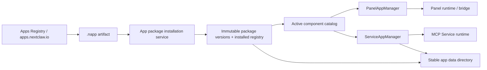
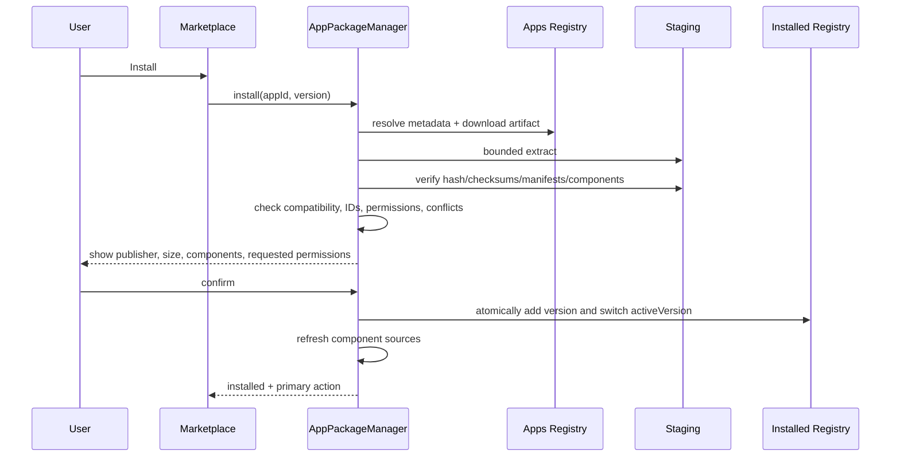

# Mini App 组合包与应用市场方案设计

## 文档状态

- 日期：2026-08-12
- 状态：已实现并完成交付前复审
- 当前冻结：包模型、运行时边界、安装生命周期、首阶段安全边界、市场与首次使用链路
- 暂不冻结：最终用户名称、市场视觉形态、长期是否继续扩展 WASM NApp

## 一、结论先行

Mini App 不应该再新建一套包格式、安装目录和市场。仓库里已经存在完整度较高的 NextClaw Apps 基础设施：`.napp` 容器、Apps Registry、`apps.nextclaw.io`、版本化安装目录、独立数据目录、安装/更新/卸载命令和发布审核流程。

本方案选择在这套基础设施上扩展一种新的组合型应用清单：

- 一个 Mini App 是一个可安装、可更新、可卸载的 `.napp` 应用包。
- 一个包可以包含零到多个 Panel App、零到多个 Service App，但总组件数至少为一个。
- 因而自然支持三种形态：Panel-only、Service-only、Panel + Service 组合包。
- 顶层 `manifest.json` 只描述包身份、版本、兼容性和组件关系。
- `panel-app.json` 与 `service-app.json` 继续分别作为各自运行时的唯一事实源。
- 安装后的组件不复制进 workspace 的 `panels/` 或 `service-apps/`，而是从版本化包目录直接投影给现有运行时。
- 内置应用也使用同一种包格式与安装链路，只是来源和信任等级是 `builtin / official`。
- 包负责安装与管理，Panel 负责打开与固定；多 Panel 包必须指定一个主 Panel。
- 内置应用默认只是“可立即启用”，不会在用户未操作时激活 Service 或预授予权限。
- 第一阶段 Service-only 只作为技术与基础能力形态存在，不作为普通用户可独立打开的应用推广。
- 首个产品闭环以“用户创建第一条待办并能再次回来使用”为终点，而不是以“安装成功”为终点。

第一批个人信息功能建议组成一个官方试验包：

```text
nextclaw.personal-organizer
  Panel: Todo
  Panel: Notes
  Panel: Favorites
  Panel: Calendar
  Service: personal information service
```

组合包建立统一的分发、数据和生命周期边界，但不把四个界面永久绑定成一套深度耦合功能。原方案允许 Todo → Notes → Favorites → Calendar 逐步交付；实现阶段根据用户明确扩展的范围，一次完成四个独立 Panel 与共享 Service，后续仍可依据真实反馈分别演进。

## 二、这份方案要解决的问题

我们当前面对的不是“能不能压缩几个目录”，而是下面五个必须同时成立的问题：

1. 同一个产品能力可能只有界面、只有服务，或者两者都有，市场应该以什么为安装单位？
2. 安装、更新或卸载一个组合应用时，如何保证 Panel 与 Service 不出现半新半旧？
3. 如何让包跨机器、跨版本可移植，又不携带 `node_modules`、源码工具链和重复 SDK？
4. 如何复用已经存在的 Apps Registry 和 `.napp`，避免出现第二套“Mini App 市场”？
5. Service App 本质上可以启动本地进程，在缺少系统沙箱的现状下，市场开放到什么程度才是诚实且安全的？

## 三、与产品愿景的关系

这套能力服务的不是“再做一个应用商店”，而是个人操作层的生态扩展：

- 用户在 NextClaw 内发现、安装和使用能力，强化统一入口。
- Panel 提供用户可见的轻量交互，Service 提供可被授权入口调用的能力；第一阶段真实调用入口只有 Panel，AI 与其它入口需要后续能力投影。
- 个人上下文数据与应用代码分离，应用升级不会带走用户的 Todo、笔记、收藏或日历连接配置。
- 内置能力和第三方能力走同一合同，避免核心产品不断硬编码孤立功能。
- AI 后续可以基于已安装组件目录理解“当前有哪些界面和服务可用”，但本方案不把尚未成立的 Agent → Service 调用写成第一阶段已有能力。

### 3.1 第一阶段产品假设

这次试验不是要证明“应用市场存在”，而是验证下面四个更具体的假设：

1. 用户愿意从 NextClaw 内进入 Todo 这类高频个人信息功能，而不是只把 NextClaw 当作临时聊天工具。
2. Panel App + Service App 能在不深度改造主产品的情况下，形成足够自然的轻量应用体验。
3. 应用代码与个人数据分离后，更新、卸载和重装不会破坏用户对长期数据的信任。
4. 一个官方组合包可以同时承载多个独立入口与共享 Service，而不会让用户理解技术组件关系。

第一阶段不能验证“普通聊天中的 AI 已经掌握用户全部上下文”，因为 Agent 直接调用 Service 尚未进入当前运行合同。它验证的是个人上下文应用的承载、入口、数据和使用习惯。若要验证 AI 搭档价值，需要在后续阶段单独补齐 Agent capability projection。

### 3.2 用户角色

| 角色 | 核心目标 | 第一阶段入口 |
| --- | --- | --- |
| 普通使用者 | 启用 Todo、完成首次记录、以后快速回来继续使用 | Apps 推荐位、Apps Launcher、固定入口 |
| 市场使用者 | 发现可信应用，理解风险，安装、更新或卸载 | NextClaw Marketplace |
| 应用开发者 | 组合 Panel/Service，本地验证并发布新版本 | `napp` CLI + Apps Web/Console |
| 应用审核者 | 判断包结构、权限、Service 风险和发布者可信度 | Platform Admin |

普通使用者不需要理解 `.napp`、MCP、Panel、Service、artifact 或 registry。技术组件只在开发者工具、故障诊断和高级管理中出现。

### 3.3 第一阶段产品边界

- 面向普通用户主推 Panel-only 与官方 Panel + Service 组合包。
- Service-only 在格式和安装层继续受支持，但第一阶段不作为“可打开的普通应用”进入消费市场推荐。
- 普通聊天 Agent 直接读取或修改 Todo、笔记、日历和收藏不属于本轮；Mini App 内部可以继续使用已存在的轻量 agent capability。
- 第一阶段以 Todo 为首个完整用户链路，其它三个 Panel 只在 Todo 证据成立后逐步加入。

## 四、当前代码事实

本方案基于现有链路，而不是从概念倒推实现。

| 现有能力 | 当前事实 | 本方案判断 |
| --- | --- | --- |
| Panel App | `PanelAppManager` 只扫描 workspace `panels/`，folder app 由 `panel-app.json` 定义；支持 bridge、client 注入、agent capability 与 Service action 授权 | 保留 Panel runtime；扩展其“组件来源”，不复制或重写运行时 |
| Service App | `ServiceAppManager` 只扫描 workspace `service-apps/`；`McpServiceAppRuntimeService` 负责 stdio MCP 进程 | 保留 Service runtime；让 source resolver 同时认识已安装包组件 |
| 本地 app 检查 | `nextclaw app check` 当前明确拒绝同一目录同时存在 `panel-app.json` 与 `service-app.json` | 该规则继续适用于单个组件目录；组合关系上移到顶层包清单 |
| NApp 容器 | `@nextclaw/app-runtime` 已有 `manifest.json`、`.napp`、checksum、pack/install/update/uninstall | 直接复用并扩展，不新增 `.miniapp` 或另一套 installer |
| 本地安装 | 已使用 `~/.nextclaw/apps/packages/<app-id>/<version>/` 与 `~/.nextclaw/apps/data/<app-id>/` | 目录合同保持不变，并补齐原子激活与回滚 |
| Apps Registry | 已有 Apps API、R2 bundle、D1 版本记录、发布者身份、审核和独立 Web App Store | 扩展 schema 与服务端校验，不另建市场后端 |
| 主产品 Marketplace | 当前只把 `skill` 和 `mcp` 作为一等类型 | 后续增加 `app` 类型，复用 Apps Registry 作为远端事实源 |

一个关键事实是：现有 NApp `manifest.json` schema v1 描述的是“一个 WASM main + 一个 UI”的独立应用。它不能直接表达多个 Panel/Service 组件。因此需要扩展清单 schema，但不需要更换 `.napp` 容器、Registry 或本地目录。

## 五、术语与边界

### 5.1 用户侧暂用名称

本文暂时使用 “Mini App”。最终可以叫“应用”“小应用”“Mini App”或其它名称，不在探索期过早冻结。

### 5.2 技术侧稳定名称

- App Package：市场发布、安装、更新、卸载的原子单位。
- Panel Component：由 `panel-app.json` 定义的界面组件。
- Service Component：由 `service-app.json` 定义的服务组件。
- `.napp`：统一分发容器，底层仍然是 zip。
- App Registry：远端版本与 artifact 事实源。
- Installed App Registry：本机已安装版本、当前激活版本与来源事实源。

“包”和“组件”必须分开。包负责生命周期，组件负责运行时语义。

### 5.3 产品入口与信息架构

第一阶段只保留三个用户可理解的入口：

| 产品入口 | 主要任务 | 展示单位 |
| --- | --- | --- |
| Marketplace | 发现、了解、安装 | App Package |
| Apps Launcher | 打开、固定、再次进入 | Panel App |
| Apps 管理详情 | 更新、授权、禁用、回滚、卸载、查看数据与 Service 状态 | App Package，展开后显示组件 |

用户不需要先进入包详情再逐层寻找 Panel。Marketplace 安装成功后直接提供“打开主界面”；Apps Launcher 直接展示可以打开的 Panel；只有管理动作才回到包层。

公开的 `apps.nextclaw.io` 与主产品 Marketplace 是同一远端目录的两个浏览入口，不是两个市场。公开站点适合分享和开发者传播；主产品负责本地安装和管理。

### 5.4 包级管理与组件级启动

- 安装、版本、更新、回滚、禁用、卸载和数据保留都属于包。
- 打开、固定、最近使用和界面偏好都属于 Panel 组件。
- 一个组合包中的多个 Panel 在 Launcher 中分别出现，用户可以把 Todo、Notes、Favorites、Calendar 当作四个独立入口使用。
- Marketplace 的包级“打开”按钮只打开该包的主 Panel。
- Service-only 包没有“打开”按钮，只能“启用”“配置”或“管理”；第一阶段不进入普通用户推荐列表。

## 六、候选方案比较

### 方案 A：合并 Panel App 与 Service App 的 manifest

做法：用一个新 manifest 同时定义界面入口、MCP command、actions 和权限。

问题：

- Panel 和 Service 的安全模型、生命周期和运行方式不同。
- 只含 Panel 或只含 Service 时会出现大量无意义空字段。
- 会使现有两个稳定运行时失去各自唯一事实源。
- CLI、本地开发和 runtime 都需要重新实现。

结论：不采用。

### 方案 B：安装时把组件复制到 workspace 目录

做法：把包内 Panel 复制到 `panels/`，Service 复制到 `service-apps/`。

优点：现有 manager 几乎无需修改。

问题：

- 包归属丢失，无法可靠回答某个组件由哪个应用安装。
- Panel 与 Service 更新不是原子的，失败后可能处于不同版本。
- 卸载很难区分用户修改与安装产物。
- 多 workspace 会产生重复副本，数据和授权语义混乱。

结论：不采用。

### 方案 C：新建一套 Mini App 包和市场

做法：新增包后缀、安装目录、registry 和 Marketplace item type 的独立后端。

问题：仓库里已经有 Apps Registry 和 `.napp` 完整闭环，这会制造两个同义生态、两份安装状态和两套发布工具。

结论：不采用。

### 方案 D：扩展现有 `.napp` 为多运行时组合包

做法：保留现有容器和生命周期，引入 `manifest.json` schema v2 表达 Panel/Service 组件；安装后从不可变版本目录直接投影给现有 manager。

优点：

- 最少新增概念。
- 复用现有远端市场和本地安装能力。
- 包级更新、回滚和卸载可以保持原子性。
- Panel/Service 运行时继续独立演进。
- 内置包和市场包可以走同一路径。

结论：采用。

## 七、目标架构



### 7.1 Owner 划分

| Owner | 负责 | 不负责 |
| --- | --- | --- |
| `@nextclaw/app-runtime` 的 package infrastructure | manifest 解析、`.napp` 打包/安全解包、远端下载、checksum、版本目录和 installed registry 事务 | Panel bridge、MCP action、主产品 UI |
| kernel `AppPackageManager` | 产品级 list/install/update/rollback/disable/uninstall 编排；激活版本；组件冲突检查；通知运行时重载 | 解释 Panel HTML 或启动 MCP 工具 |
| `PanelAppManager` | Panel 发现、内容与资产、bridge、Panel 权限和打开状态 | 包下载、版本管理、删除包文件 |
| `ServiceAppManager` | Service 发现、action、grant、invoke、进程生命周期 | 包下载、市场版本选择 |
| Apps Registry | 远端 catalog、发布身份、审核、版本元数据、artifact 与 hash | 本机激活状态和用户数据 |

`AppPackageManager` 不再维护一份独立组件注册表。当前激活组件始终由 Installed App Registry 派生，避免出现“registry 已切版本，但组件表没切”的双状态。

## 八、包格式

### 8.1 组合包目录示例

```text
personal-organizer/
  manifest.json
  marketplace.json
  README.md
  assets/
    icon.svg
  panels/
    nextclaw-personal-organizer-todos.panel/
      panel-app.json
      index.html
      assets/
    nextclaw-personal-organizer-notes.panel/
      panel-app.json
      index.html
      assets/
    nextclaw-personal-organizer-favorites.panel/
      panel-app.json
      index.html
      assets/
    nextclaw-personal-organizer-calendar.panel/
      panel-app.json
      index.html
      assets/
  services/
    nextclaw-personal-organizer-data/
      service-app.json
      server.mjs
```

打包后继续由工具生成：

```text
.napp/
  bundle.json
  checksums.json
```

### 8.2 `manifest.json` schema v2

```json
{
  "schemaVersion": 2,
  "id": "nextclaw.personal-organizer",
  "name": "Personal Organizer",
  "version": "0.1.1",
  "description": "Lightweight personal information mini apps.",
  "icon": "assets/icon.svg",
  "engines": {
    "nextclaw": ">=0.32.0"
  },
  "presentation": {
    "primaryPanel": "nextclaw-personal-organizer-todos"
  },
  "components": [
    {
      "kind": "panel",
      "path": "panels/nextclaw-personal-organizer-todos.panel"
    },
    {
      "kind": "panel",
      "path": "panels/nextclaw-personal-organizer-notes.panel"
    },
    {
      "kind": "service",
      "path": "services/nextclaw-personal-organizer-data"
    }
  ]
}
```

设计约束：

- `components` 至少一个元素。
- 第一版只支持 `panel` 与 `service` 两种 component kind。
- `path` 必须是包内相对路径，不能重叠、越界或指向链接。
- 顶层清单不重复组件的 title、entry、actions、capabilities、command。
- 这些运行时事实分别从 `panel-app.json` 和 `service-app.json` 读取。
- 包级权限摘要由打包/发布工具从组件 manifest 派生，不允许开发者手写另一份不一致摘要。

### 8.3 启动语义

- 包只有一个 Panel 时，该 Panel 自动成为主 Panel，`presentation.primaryPanel` 可以省略。
- 包包含多个 Panel 时，必须声明 `presentation.primaryPanel`，并引用其中一个真实 Panel component id。
- 包不含 Panel 时不得声明 `primaryPanel`，安装成功后进入管理详情而不是尝试打开界面。
- 所有 Panel component 默认作为独立入口出现在 Apps Launcher；第一版不增加隐藏 Panel、嵌套导航或复杂 launcher mode。
- 主 Panel 只解决 Marketplace 安装成功、包详情“打开”和深链接 fallback，不改变其它 Panel 的独立地位。

`primaryPanel` 是包与组件之间的展示关系，不是对 `panel-app.json` 运行时事实的复制。

### 8.4 与 schema v1 的关系

- schema v1 继续表示现有“WASM main + UI”独立 NApp，现有 `napp run` 保持可用。
- schema v2 表示 Panel/Service 组合包，由 NextClaw 主产品负责投影和运行。
- `.napp/bundle.json` 的容器版本可以保持 v1，因为容器结构没有变化；应用清单版本独立演进。
- 第一阶段不允许在同一包里同时混放 schema v1 WASM main 和 schema v2 components。
- 这份方案不提前决定 WASM NApp 的长期产品地位，只保证已有能力不被无故破坏。

### 8.5 组件身份与冲突

现有 Panel/Service action 合同依赖稳定组件 ID，因此安装时不动态改写 ID。

市场包的组件 ID 必须以规范化包 ID 为前缀：

```text
package id: nextclaw.personal-organizer
prefix:     nextclaw-personal-organizer-
panel id:   nextclaw-personal-organizer-todos
service id: nextclaw-personal-organizer-data
```

这样可以降低全局冲突，也不会改变现有 `<service-id>.<action-name>` action ID 语义。

安装和每次激活都必须检查：

- 包内组件 ID 不重复。
- 与其它激活包组件不冲突。
- 与 workspace 本地开发组件不冲突。
- 冲突时安装产物可以保留，但不得激活；系统必须展示明确冲突来源，不能静默覆盖。

第一版不自动安装跨包依赖。如果一个 Panel 必须依赖专用 Service，应放在同一个组合包里。Panel 仍可声明其它已安装 Service 的 action，但市场与 installer 不承诺自动补齐该依赖。

### 8.6 Marketplace 元数据与运行合同分离

`manifest.json` 只承载安装和运行必须稳定的事实；`marketplace.json` 承载可独立演进的目录展示信息：

- summary、description、tags 和多语言内容。
- screenshots、source repo、homepage 和 support URL。
- license。
- 涉及外部数据传输时的 privacy policy URL。
- 发布者展示信息，但真实 publisher identity 仍由平台登录态决定。

每次发布版本还必须提交 release notes，供更新页解释新增、修复、移除组件和数据兼容性。权限摘要、组件列表、包大小和 compatibility 由服务端从 artifact 派生，不允许 marketplace metadata 自报。

第一阶段官方 builtin 可以使用仓库内固定元数据；第三方公开发布时，缺少 license、support 或必要的 privacy disclosure 应阻止进入 published 状态。

## 九、本地目录、数据与运行环境

### 9.1 目录合同

继续复用现有目录：

```text
~/.nextclaw/apps/
  packages/
    nextclaw.personal-organizer/
      0.1.1/
      0.2.0/
  data/
    nextclaw.personal-organizer/
  registry.json
  config.json
```

规则：

- `packages/<id>/<version>` 是安装后不可变的代码目录。
- `data/<id>` 是跨版本稳定的用户数据目录。
- Service 不得把用户数据写回自身版本目录。
- 普通卸载默认保留数据；只有二次确认的“删除应用及其数据”才清理 data 目录。
- 回滚只切换 active version，不回滚或复制用户数据。

### 9.2 Service 数据目录

对于已安装包中的 Service，宿主在启动进程时增加稳定环境事实：

```text
NEXTCLAW_APP_ID
NEXTCLAW_APP_VERSION
NEXTCLAW_APP_DATA_DIR
NEXTCLAW_APP_PACKAGE_DIR
```

其中只有 `NEXTCLAW_APP_DATA_DIR` 可用于持久化用户数据；package dir 只读。变量由现有 runtime child env owner 统一注入，不允许各 Service 自己猜测 `HOME` 或 workspace。

第一版不运行任意 install/update migration script。Service 必须保证其数据格式至少兼容当前版本与前一可回滚版本；若未来需要不可逆数据迁移，应单独设计带备份和 rollback contract 的迁移机制。

### 9.3 Panel 持久化

- Panel-only 包可以使用界面自身的轻量状态能力，但不应把重要个人资产只放在易失浏览器缓存里。
- 需要持久、可导出或跨界面共享的数据时，应通过同包 Service 写入 app data 目录。
- Notes 的 Markdown 文件仍是用户资产事实源；包数据目录只存索引、设置或连接状态，不替代 Markdown 文件。

## 十、组件发现与运行

### 10.1 统一 source descriptor

Panel 和 Service manager 读取的应是统一来源描述，而不是假设所有组件都在 workspace：

```ts
type AppComponentSource = {
  kind: "panel" | "service";
  componentId: string;
  sourceKind: "workspace" | "installed-package";
  sourcePath: string;
  packageId?: string;
  packageVersion?: string;
};
```

该描述是读取结果，不是第二份持久化状态。workspace 来源由现有目录扫描产生；installed-package 来源由 active installed registry 派生。

### 10.2 Panel App 适配

- `PanelAppSourceService` 已具备从绝对 `sourcePath` 读取 folder source 的能力，可以复用。
- `PanelAppManager.listPanelApps` 需要同时合并 workspace sources 与 active package panel sources。
- 内容、asset、bridge session 必须通过 source descriptor 解析，不能再只用 workspace `panelsPath + id`。
- `PanelAppEntry` 增加 `sourceKind/packageId/packageVersion`，包组件不显示“删除文件”，而显示“管理应用”。
- Panel 的 agent/client/action grant 继续由 Panel runtime 按组件 ID 管理，安装包不能绕过现有授权边界。

### 10.3 Service App 适配

- `ServiceAppManager.requireServiceApp` 从 source catalog 解析实际目录，不再无条件 `join(workspaceServiceAppsPath, appId)`。
- `McpServiceAppRuntimeService` 继续作为唯一 stdio MCP runtime，不新建 package 专属 runner。
- Service 仍按首次发现 action 或首次调用懒启动，不因包安装自动启动常驻进程。
- 更新、回滚、禁用或卸载前，`AppPackageManager` 要求 Service manager 关闭该包的运行实例，再切换 active version。

#### Service-only 第一阶段的真实地位

现有 `ServiceActionCaller` 只有 `panel-app`，所以 Service-only 暂时不是普通用户可独立完成任务的应用形态。

第一阶段规则：

- 包格式、CLI、本地安装与管理页支持 Service-only，方便官方基础能力和开发者验证。
- 消费市场默认不推荐 community Service-only 包，也不显示“打开”。
- 官方或 verified Service-only 包只能以“为其它应用提供能力”的方式出现，并明确列出调用方和用途。
- 在 Agent → Service capability projection、caller identity 和授权模型完成前，不宣称 AI 可以直接调用这些 Service。

未来若开放 Agent 调用，必须扩展 caller union、声明 Agent 可见 actions、会话/用户授权范围、调用审计和撤销能力，不能复用一个伪造的 Panel caller 绕过边界。

### 10.4 授权原则

市场详情和安装确认页展示“请求权限摘要”，但安装本身不等于授予全部运行权限。

- Panel agent capability 仍按现有 grant 流程授权。
- Panel client 注入仍按现有 grant 流程授权。
- Panel 调用 Service action 仍按 caller + action 授权。
- 卸载包时清理这些组件对应的 grants；默认不清理用户数据。

这样可以避免 package manager 变成第三套权限 owner。

### 10.5 用户看到的权限链路

权限体验分成两个含义不同的阶段：

#### 安装确认：确认代码与总体风险

安装前展示发布者、信任等级、是否包含本地 Service、组件列表、数据目录、外部连接和派生权限摘要。用户确认的是“允许这份代码安装到本机”，不是无条件授予所有运行操作。

#### 首次使用：授予实际能力

- 同包、同一 Panel 正常工作所需的 `read/write` Service actions，按用户目标合并成一次说明清楚的授权，例如“允许 Todo 读取、创建、修改和完成待办”。
- `external/dangerous` action 继续在真正执行时单独确认，不进入低风险分组授权。
- 授权一旦完成，在 grant 未撤销、action 风险未扩大且组件身份未变化时不重复弹窗。
- 新版本新增 action、扩大风险或改变外部访问范围时，旧 grant 不自动覆盖新增权限。

拒绝授权后的产品状态必须明确：

- 必需权限被拒绝：Panel 显示“需要授权才能使用”，提供“查看权限”和“返回 Apps”，不能白屏或反复自动弹窗。
- 可选权限被拒绝：对应功能降级，其它功能继续可用。
- 用户可以从 Apps 管理详情重新授权或撤销已有授权。

安装确认和 runtime grant 仍由各自 owner 持久化；“分组授权”只是一次交互中调用现有批量 grant 能力，不新增权限事实源。

## 十一、打包与体积控制

### 11.1 第一版分发规则

schema v2 组合包只允许 `distributionMode: bundle`：发布的是可直接运行的构建产物，安装时不执行 `npm install`、`npm run build` 或任意安装脚本。

必须排除：

- `node_modules/`
- Panel/Service 源码目录（除非该文件本身就是运行产物）
- tests、fixtures、coverage
- source maps
- `.git/`、编辑器配置和本地缓存
- 开发依赖、构建工具和临时文件

Panel 包只保留静态构建产物，并继续使用宿主注入的 NextClaw client，不能重复打包 SDK。

Service 的首个可移植 profile 建议冻结为：

- 宿主提供的 Node runtime。
- 单文件或少量 bundled ESM 产物。
- 零外部 runtime npm 依赖。
- manifest 中使用相对入口，禁止依赖开发机绝对路径。

原生二进制、多平台变体和大型模型资源留到后续单独设计。

### 11.2 初始体积预算

这些数值是试运行预算，可以在积累真实包数据后调整：

| 指标 | 建议值 | 行为 |
| --- | ---: | --- |
| `.napp` 压缩后推荐值 | 5 MB | 超过时本地与发布页 warning |
| `.napp` 压缩后硬上限 | 25 MB | 第一版拒绝发布 |
| 解压后总大小 | 100 MB | 拒绝安装/发布 |
| 文件总数 | 2,000 | 拒绝安装/发布 |
| 单文件大小 | 25 MB | 拒绝安装/发布 |

不把视频、模型或大数据集直接塞进基础包。未来如确有需要，使用声明式 optional resource，在首次需要时按 hash 下载到 app data/cache；不允许资源下载器变成隐蔽安装脚本。

### 11.3 远端存储

- artifact 存 R2，catalog/version/审核状态存 D1。
- artifact key 改为 content-addressed，例如 `apps/artifacts/sha256/<hash>.napp`。
- 相同 hash 不重复上传；第一版不做复杂的跨包逐文件去重。
- 已发布的 `<app-id>@<version>` 必须不可变：相同 hash 可幂等重试，不同 hash 必须拒绝并要求升版本。
- 大于直接 API 安全阈值的 artifact 使用 upload session / 预签名上传，避免 base64 JSON 带来的约 33% 膨胀；现有 publish API 可为 schema v1 保留兼容。

## 十二、安装、更新、回滚与卸载

### 12.0 用户可见状态模型

技术状态必须收敛成用户能理解并能采取下一步的产品状态。包生命周期与组件可用性要分层，不能用一个状态覆盖多 Panel 包的所有界面。

包级状态：

```text
available
  → installing
  → active
  → update-available
  → updating
  → active | rolled-back | failed

active
  → disabled
  → active

active | disabled | failed
  → uninstalling
  → removed-data-kept | removed-data-deleted
```

组件级状态：

```text
Panel: ready | needs-permission | failed
Service: idle | starting | running | failed | stopped
```

例如 Todo 已完成授权而 Notes 尚未授权时，整个包仍是 `active`，Todo Panel 是 `ready`，Notes Panel 是 `needs-permission`。不能因为一个组件缺权限就把整个组合包标成不可用。

另有两种需要人工处理的阻塞状态：

- `incompatible`：当前 NextClaw 或平台不满足 engines contract，只能查看原因或升级宿主。
- `conflicted`：组件 ID 与本地或其它包冲突，只能查看冲突来源、禁用冲突方或取消安装，不能静默覆盖。

每个状态必须有唯一主操作：

| 状态 | 主操作 | 次操作 |
| --- | --- | --- |
| `available` | 启用/安装 | 查看详情 |
| `installing` | 查看进度 | 取消下载（尚未激活时） |
| package `active` + primary Panel `needs-permission` | 完成授权 | 稍后处理/管理 |
| package `active` + primary Panel `ready` | 打开主 Panel | 固定、管理 |
| `update-available` | 查看并更新 | 暂不更新 |
| `disabled` | 启用 | 卸载 |
| `rolled-back` | 继续使用旧版本 | 查看失败诊断 |
| `failed` | 重试/修复 | 回滚、禁用、卸载 |
| `incompatible` | 查看要求 | 升级 NextClaw |
| `conflicted` | 解决冲突 | 取消安装 |

### 12.1 安装事务



安装必须满足：

1. 下载先写 staging，不直接覆盖正式目录。
2. 校验 artifact SHA-256、容器 checksums、顶层 manifest 和每个组件 manifest。
3. 校验 NextClaw 版本兼容性、路径、组件 ID、action 引用与冲突。
4. 只有全部成功后才原子移动到版本目录并切换 `activeVersion`。
5. 任一步失败，旧版本和旧组件目录仍保持可用。
6. installed registry 使用临时文件 + fsync/rename 类原子写法，不能直接覆盖 JSON 后留下半文件。
7. 安装成功后若存在主 Panel，返回“打开”作为主操作；无 Panel 时进入 Apps 管理详情。

### 12.2 更新

- 新版本始终安装到新的不可变目录。
- 对比旧/新组件、权限和风险；新增权限必须再次明确确认。
- 更新页明确列出新增、移除和更名的 Panel/Service；被移除 Panel 的固定入口在更新前给出提示。
- 停止受影响的旧 Service runtime。
- 原子切换 active version 后刷新组件目录。
- 如果新版本启动检查失败，自动切回旧 active version，并保留失败诊断。
- 不自动删除旧版本；默认保留最近一个可回滚版本，空间清理另行执行。

组件深链接规则：

- 包级链接始终打开当前版本主 Panel；没有 Panel 时进入管理详情。
- 仍然存在的 component id 保持原深链接和固定状态。
- 已移除 component id 不静默跳到其它 Panel，而是显示“该界面已在新版本中移除”，并提供打开主 Panel 或查看更新说明。

### 12.3 回滚

- 回滚只允许切换到本机已校验的已安装版本。
- 切换前关闭当前 Service，切换后对组件做最小健康检查。
- 数据目录不回滚，因此 Service 必须遵守前述数据兼容合同。

### 12.4 禁用与卸载

禁用：

- 保留包、版本、授权和数据。
- 从 active component catalog 移除组件并关闭 Service。

卸载：

- 关闭该包的所有 Service。
- 从 catalog 移除 Panel/Service。
- 撤销组件对应的 runtime grants。
- 删除包版本与 installed registry 记录。
- 默认保留 app data。
- 只有用户单独确认时删除 app data。

Panel/Service 页面上的包组件不能被当作普通 workspace 文件单独删除；它们的生命周期入口统一回到包级管理。

### 12.5 普通用户主链路

#### 链路 A：启用内置 Todo

```text
用户在 Apps 推荐位看见 Todo
→ 查看一句话用途与官方来源
→ 点击“启用”
→ 查看“包含本地 Service”和总体权限摘要
→ 完成本地 seed artifact 安装
→ 点击“打开 Todo”
→ 首次使用时一次授权待办管理能力
→ 创建第一条待办
→ 系统提供“固定到 Apps”
→ 以后从固定入口或最近使用再次进入
```

“创建第一条待办”是首个 `first value`，不是“安装成功”。如果用户安装后没有完成这一动作，产品链路仍然没有闭环。

#### 链路 B：从 Marketplace 安装应用

```text
搜索、精选推荐或 AI 推荐入口
→ 应用详情：用途、发布者、组件、大小、风险、权限
→ 点击安装
→ 下载与校验进度
→ 安装成功
→ 有主 Panel：直接打开
→ 无 Panel：进入管理详情并说明它为哪些能力提供服务
→ 首次调用时完成 runtime 授权
```

用户从公开 `apps.nextclaw.io` 发起安装时，网页通过深链接唤起本地 NextClaw；如果本机不可用，则展示安装 NextClaw 和复制 app id 两个后备操作。

#### 链路 C：日常反复使用

```text
用户从 Apps Launcher、固定入口或最近使用打开 Todo
→ Panel 读取稳定 data dir 中的数据
→ 用户新增、修改或完成待办
→ Service 写入成功
→ Panel 给出即时可见反馈
→ 关闭后下次仍能恢复同一数据
```

第一阶段普通聊天不直接操作这些数据。Panel 内的轻量 AI 辅助必须服从“用户确认后写入”，不能让用户误以为聊天 Agent 已经自动共享全部上下文。

#### 链路 D：更新失败与自动回滚

```text
用户看到更新可用
→ 查看功能变化和新增权限
→ 确认更新
→ 下载、校验、切换版本
→ 健康检查成功：继续使用
→ 健康检查失败：自动切回旧版本
→ 提示“已恢复旧版本”，提供诊断与稍后重试
```

更新失败不能只显示技术错误，也不能让应用从 Launcher 消失。

#### 链路 E：卸载、保留数据与重装

```text
用户进入 Apps 管理详情
→ 点击卸载
→ 默认选中“保留个人数据”
→ 应用与组件入口消失，数据保留
→ 以后重新安装同一 app id
→ 系统识别保留数据并提示“发现已有数据”
→ 打开后恢复原有待办
```

“删除应用及其数据”必须是单独的高风险操作，明确列出数据目录和不可恢复后果。

### 12.6 异常与恢复链路

| 异常 | 用户看到什么 | 可执行下一步 |
| --- | --- | --- |
| 下载失败 | 网络或 Registry 暂不可用，未改变当前版本 | 重试、稍后安装 |
| checksum/安全校验失败 | 包未安装，内容不可信 | 返回详情、报告应用 |
| 组件冲突 | 冲突组件与来源 | 禁用冲突包、取消安装 |
| 权限被拒绝 | 哪项功能受限 | 重新授权、继续使用可用部分 |
| Service 启动失败 | 应用服务未就绪 | 重试、查看诊断、回滚 |
| 更新失败 | 已恢复旧版本 | 继续使用、稍后重试 |
| 应用被市场下架 | 已安装版本状态与原因 | 继续离线使用、禁用或卸载；恶意撤回按安全策略处理 |
| 外部数据源断开 | 日历/目录连接失效 | 重新连接、选择新位置 |

## 十三、内置应用策略

Todo、Notes、Favorites、Calendar 不应硬编码成一套特殊 runtime。

推荐做法：

- 构建官方签名或官方可信的 `.napp` starter artifact。
- Desktop/NextClaw 发行包可以携带 seed artifact；`AppPackageManager` 从只读产品资源派生 builtin catalog，首次启动只把它展示为 `available builtin`，不写入 Installed Registry、不自动激活组件、不启动 Service，也不预授予权限。
- Apps 推荐位展示 Todo 的用途和“启用”按钮；只有用户主动启用时才调用标准 installer。
- 用户启用后，Installed Registry 才记录 `sourceKind: builtin` 和 `trustLevel: official`。
- 后续更新可以来自官方 Apps Registry，不要求跟随主程序一起发版。
- 用户可以禁用或卸载这些试验应用；需要时可从市场重新安装。

第一阶段的包合同不要求四个 Panel 同时存在，因此其它官方应用仍可从单 Panel 起步。本次 personal-organizer 试验包按用户明确范围直接交付 Todo、Notes、Favorites、Calendar 四个 Panel 与 shared Service，并保持每个 Panel 的独立入口和轻量边界。

内置只表示“随产品可立即获得且来源可信”，不表示“自动获得权限”或“不可卸载”。这样可以减少默认界面污染，也能真实测量用户是否愿意主动启用。

## 十四、Marketplace 产品形态

### 14.1 一个市场，两种入口

- `apps.nextclaw.io` 继续是公开浏览、分享和开发者发布入口。
- NextClaw 主产品 Marketplace 增加 Apps 类型，负责发现、安装和管理。
- 两者读取同一个 Apps Registry；不复制 catalog 数据到另一套数据库。

NextClaw Marketplace 负责本地状态，所以同一张卡片根据安装状态展示不同主操作：

```text
未安装：安装
安装中：进度
已安装且有 Panel：打开
已安装但需授权：完成授权
Service-only：管理
有更新：查看更新
不兼容/冲突/失败：查看并解决
```

### 14.2 详情页必须展示

- 应用名称、版本、发布者和信任等级。
- Panel/Service 组件数量及名称。
- 压缩大小与解压大小。
- 请求的 agent capability、client、Service actions、文档/网络/存储权限摘要。
- 是否包含本地 Service 代码，以及由此带来的风险提示。
- 更新时相对当前版本新增、删除或扩大了哪些权限。
- 是否有可打开界面；若为 Service-only，说明由哪些应用或系统入口使用。
- 当前版本 release notes、license、支持入口；涉及外部数据传输时展示 privacy policy。

### 14.3 已安装视图

主层级展示包：版本、来源、状态、更新、回滚、禁用、卸载、数据位置。

展开后展示组件：

- Panel 组件可以打开。
- Service 组件可以看 action、状态、授权和重启。
- workspace 本地 Panel/Service 仍保留为开发者来源，但应明确标注 `Local`，不与市场安装包混为一谈。

应用管理详情还需要提供用户数据区：

- 数据目录位置和占用空间。
- 在文件管理器中打开数据目录。
- 卸载后是否存在保留数据。
- 删除保留数据的独立高风险操作。
- 当前文档目录授权、外部连接和 Service Action grants 的查看与撤销入口。

Notes 的 Markdown 目录选择、Calendar 的账号连接等具体配置继续由对应应用负责，但授权与连接状态必须能从 Apps 管理详情找到入口，不能只能在首次弹窗中操作。

### 14.4 第一阶段交互底线

- “安装、启用、打开、管理、更新、回滚、卸载”使用不同且稳定的动词，不把所有动作都写成“使用”。
- 下载、安装、更新和回滚必须展示持续状态；同一操作进行中禁止重复触发。
- 破坏性动作使用明确按钮和结果说明，不依赖只有鼠标才能发现的菜单。
- Marketplace、Apps Launcher、权限弹窗和管理详情都支持键盘到达、可见焦点、正确 dialog focus trap 与 Escape 退出。
- Panel 在当前侧栏尺寸下必须可完成核心任务；如果某项功能需要更大空间，明确提供全屏/扩展入口，而不是依赖横向滚动。
- 所有用户可见文案进入 i18n，应用元数据至少提供可回退的默认语言；风险和权限说明不能只显示开发者术语。
- 安装成功、权限拒绝、更新回滚和数据删除等关键结果不能只靠短暂 toast，必须在对应卡片或详情页保留可追溯状态。

## 十五、安全边界

### 15.1 当前必须承认的风险

现有 Service App 可以启动本地 stdio 进程，当前没有能强制限制文件系统和外网访问的 OS 级沙箱。因此“manifest 声明了风险”不等于“宿主已经技术强制隔离了风险”。

第一阶段开放策略：

- 官方试验包：允许 Panel + Service。
- 经过人工复核的 verified 发布者：可灰度允许 Service 包。
- 普通 community 发布者：第一阶段只开放 Panel-only 包。
- community Service 包要等进程沙箱、文件授权和 outbound network enforcement 至少有一个可信实现后再开放。

签名不能把恶意代码变安全；签名只证明“是谁发布、内容是否被篡改”。

### 15.2 Bundle 安全加固

现有同步解压逻辑需要在市场安装前补齐以下硬边界：

- 解压前读取 central directory，限制压缩大小、解压大小、文件数和压缩比，不能先 `unzipSync` 再判断。
- 拒绝 absolute path、`.`/`..` segment、NUL、反斜线混淆和 normalized duplicate path。
- 拒绝 symlink、hardlink、device 等非普通文件。
- `checksums.json` 必须精确覆盖除自身外的所有普通文件；既不能漏文件，也不能声明不存在文件。
- 校验 manifest 声明的路径都在包内且位于允许目录。
- staging 与最终目录使用同一文件系统，确保 rename 原子性。
- 服务端发布审核必须重新解包和校验 artifact，不能信任客户端随请求提交的 manifest/permissions 摘要。

### 15.3 发布与供应链

- 发布身份来自 NextClaw 平台登录态，不信任 `marketplace.json.publisher` 自报身份。
- Registry 记录 publisher、审核状态、artifact hash 和发布时间。
- 同版本不可变，撤回通过 catalog/takedown 状态完成，不覆盖历史 artifact。
- 安装前和更新前都校验远端 metadata hash 与 artifact hash。
- 第一阶段以平台身份 + immutable release + SHA-256 建立基础可信链；发布者公钥签名作为后续增强，不伪装成已经具备。

## 十六、CLI 与 API 调整

### 16.1 CLI

现有 `napp` 继续作为 App Package 工具：

```text
napp inspect <app-dir>
napp pack <app-dir>
napp validate-publish <app-dir>
napp publish <app-dir>
napp install <app-id|bundle.napp|app-dir>
napp update <app-id>
napp rollback <app-id> [--version <version>]
napp uninstall <app-id> [--purge-data]
```

`inspect/pack/publish` 根据 `manifest.schemaVersion` 路由到 v1 standalone 或 v2 components validator。现有 `nextclaw app check` 继续服务单个 Panel/Service 开发目录，并新增由 v2 package validator 调用的可复用检查入口。

### 16.2 本地产品 API

建议由 kernel `AppPackageManager` 暴露统一产品能力，server 只做 HTTP adapter：

```text
GET    /api/apps
GET    /api/apps/:appId
POST   /api/apps/install
POST   /api/apps/:appId/update
POST   /api/apps/:appId/rollback
POST   /api/apps/:appId/enable
POST   /api/apps/:appId/disable
DELETE /api/apps/:appId
```

Marketplace controller 调这些 API，不直接在 service/server 层复制安装逻辑。

### 16.3 开发者与发布者链路

完整链路不是只有 `napp publish`：

```text
创建或组合 Panel/Service 目录
→ napp inspect：验证 package 与组件合同
→ napp dev：临时注册组件并预览真实 Panel/Service 链路
→ napp install <dir>：模拟真实安装、权限、数据目录和卸载
→ napp validate-publish：体积、安全、兼容性与权限报告
→ napp publish：提交不可变版本
→ pending review
→ published | rejected with actionable reasons
→ 发布者升版本修正
→ 用户安装和更新
→ 必要时下架版本，但不覆盖历史 artifact
```

开发者预览必须复用真实 Panel/Service runtime，只把 component source 指向开发目录；不能为了 dev 再实现一套 bridge 或 MCP runner。

审核拒绝至少返回结构化原因：包安全、组件合同、权限与描述不一致、Service 风险、体积、兼容性或内容政策。发布者修复后发布新版本；同版本不同 hash 不能覆盖。

第一阶段不要求在线 IDE、图形化打包器或复杂创作者后台，CLI + 现有 Console 足以验证供应链。

## 十七、分阶段交付

### Phase 0：合同与安全底座

- `manifest.json` schema v2 类型、解析和校验。
- `.napp` bounded extract、精确 checksum coverage、不可变版本。
- v2 bundle-only pack/inspect。
- Installed Registry 原子写与 active version 切换。

### Phase 1：本地组合包闭环

- kernel `AppPackageManager`。
- Panel/Service source catalog 适配。
- pack → local install → list → open Panel → invoke Service → update → rollback → uninstall 全链路。
- stable app data env。
- 主 Panel contract、产品状态模型和最小 Apps 管理详情。
- 安装风险确认、首次使用分组授权和拒绝后的恢复入口。

### Phase 2：官方个人信息试验包

- 完成 Todo、Notes、Favorites、Calendar 四个独立 Panel + shared Service。
- 作为 `available builtin` seed 展示，用户主动启用时走标准 installer。
- 在现有 Apps 入口中展示来源和包级管理。
- 跑通启用 → 打开 → 授权 → 分别创建四类数据 → 再次进入。
- 本轮以本地持久化和真实浏览器操作证明完整使用循环；不采集个人内容的产品事件继续作为上线后观察项。

### Phase 3：Marketplace 接入

- Apps Registry 支持 schema v2、服务端解包校验和不可变版本。
- 主产品 Marketplace 增加 Apps 类型。
- 官方与 verified 组合包安装/更新。
- community Panel-only 发布。
- 安装成功后的打开/管理跳转、更新权限 diff、失败恢复和公开站点深链接。

### Phase 4：更开放的生态

- Service OS sandbox / network enforcement。
- community Service 包。
- optional resources、多平台 artifact、增量下载和发布者签名。

## 十八、验证与质量门槛

### 18.1 Contract matrix

至少覆盖：

- Panel-only 合法包。
- Service-only 合法包。
- Panel + Service 合法包。
- 多 Panel + 单 Service 合法包。
- 空 components、重复 path、重叠 path、错误 kind、manifest 越界。
- 组件 ID 不符合包前缀、包内冲突、包间冲突、workspace 冲突。

### 18.2 安装事务与故障注入

在下载、解压、checksum、component validation、正式目录写入、registry 切换、Service 启停的每个节点注入失败，证明：

- 旧 active version 不受影响。
- 不出现部分组件激活。
- staging 能被安全清理。
- registry 不会出现半写 JSON。

### 18.3 安全样本

- zip slip、absolute path、反斜线路径、duplicate normalized path。
- zip bomb、高压缩比、超文件数、超单文件。
- 未被 checksum 覆盖的额外文件。
- symlink 指向包外。
- manifest 宣称 A、artifact 实际包含 B。
- 同版本不同 hash 重发。

### 18.4 真实端到端验收

使用官方 personal-organizer 试验包完成：

```text
开发目录
→ inspect
→ pack
→ 本地安装
→ Todo Panel 打开
→ Panel 调用 Service action
→ 数据写入稳定 data dir
→ 更新到新版本
→ 回滚
→ 卸载但保留数据
→ 重装后恢复数据
```

之后再完成一次 Registry publish → Marketplace install 的远端真实链路。

### 18.5 体积与可移植性验收

- 在 macOS、Windows、Linux 的受支持桌面环境至少做一次安装与运行验证。
- 自动报告压缩大小、解压大小、文件数、最大文件和各组件占比。
- 验证包内没有 `node_modules`、绝对路径或开发机特有路径。
- 验证 host-injected client 不被重复打包。

### 18.6 产品链路验收

第一批试验必须能观察完整漏斗，而不是只记录安装数：

| 阶段 | 关键事件 | 要回答的问题 |
| --- | --- | --- |
| 发现 | `app_impression`、`app_detail_opened` | 用户是否理解它的用途并愿意进一步了解？ |
| 启用 | `app_enable_started/completed/failed` | 安装、风险说明和等待时间是否造成流失？ |
| 授权 | `permission_prompted/granted/denied` | 授权是否阻碍高频操作？ |
| 首个价值 | `todo_first_item_created` | 用户是否真正完成第一条待办，而不只是打开空界面？ |
| 复用 | `panel_opened`、`app_pinned` | 用户是否会再次进入，入口是否容易找到？ |
| 可靠性 | `service_action_succeeded/failed`、`app_update/rollback` | Service 和更新链路是否足够可靠？ |
| 退出 | `app_disabled/uninstalled`、`data_kept/deleted` | 用户为何离开，是否仍信任数据边界？ |

事件只记录 app/component id、版本、状态、耗时和错误分类，不上传待办标题、笔记内容、收藏 URL、日历内容或本地路径。

探索期不在架构文档中武断写死转化率阈值，但每个试验版本启动前必须确定观察窗口、样本范围和决策问题。复盘至少形成以下判断之一：

- 继续 Panel Mini App 形态。
- 调整入口、权限或面板尺寸后再试。
- 值得进入全屏或主导航。
- 需要普通聊天 Agent 能力投影后才能继续验证。
- 用户需求不足，停止扩展该功能。

### 18.7 产品体验验收脚本

除自动测试外，需要按真实用户语言完成一次人工或自动化 UI 验收：

1. 新用户首次打开 Apps，能看懂 Todo 是什么，不需要理解 Panel/Service。
2. 点击启用后，能看见下载、校验和安装进度；失败时知道下一步。
3. 安装成功后，一次点击进入 Todo，而不是再次寻找组件。
4. 权限说明能表达用户目标，拒绝后不会陷入弹窗循环。
5. 创建第一条待办并重启 NextClaw 后，数据仍然存在。
6. 从固定入口再次打开 Todo，进入路径不超过一次选择。
7. 更新失败后仍能打开旧版本，并能看见“已自动恢复”。
8. 卸载默认保留数据；重装后能识别并恢复。
9. Service-only 包不出现误导性的“打开”按钮。
10. Marketplace、Apps Launcher 与 Apps 管理详情之间可以互相到达，但职责不混乱。

## 十九、明确不做

第一版不做：

- 复杂评分、评论、排行和推荐系统。
- 跨包依赖自动求解。
- 安装时执行任意脚本。
- 自动不可逆数据迁移。
- 原生二进制多平台矩阵。
- 大模型、视频或大数据集随基础包分发。
- 为组合包重写 Panel runtime 或 Service runtime。
- 在安全隔离尚未成立时开放任意 community Service 代码。
- 把 Service-only 包当作第一阶段普通用户可独立打开的应用。
- 让普通聊天 Agent 在第一阶段直接读取或修改个人信息 Service。

## 二十、仍需通过试验回答的问题

1. 用户最终更理解“Mini App”“应用”还是其它名称？
2. 四个个人信息功能是一个组合包更自然，还是在使用中逐渐分成多个包？第一阶段先用一个官方包验证，不把结果写死。
3. 同包低风险 actions 的分组颗粒度应该按 Panel、按用户目标还是按数据域？第一版先按 Panel 的必需能力分组，通过拒绝率和反馈调整。
4. 5 MB 推荐值和 25 MB 上限是否合适？由前几批真实包的构成数据校准。
5. WASM standalone NApp 后续是否也进入主产品内嵌 Apps 视图？本方案只保留兼容，不提前决定。
6. 当 Agent capability projection 成立后，Service-only 应以“应用”“能力”还是其它形式进入市场？在真实调用链出现前不冻结名称。

## 二十一、第一步实现建议

不要先改 Marketplace UI。最小且能证明架构正确的一步是：

1. 给 `@nextclaw/app-runtime` 增加 schema v2 解析与一个 Panel + Service 的本地 `.napp` fixture。
2. 同时冻结 `primaryPanel`、产品状态和权限分组的最小 contract，避免底层完成后才发现没有用户入口。
3. 完成安全解包与原子 installed registry。
4. 让 kernel 从 active package 目录列出一个 Panel 和一个 Service。
5. 跑通启用 → 打开主 Panel → 分组授权 → 创建第一条待办 → 更新 → 回滚 → 卸载保留数据 → 重装恢复。

这条链路成立后，再完成 builtin seed 和 Marketplace 全量界面。Marketplace 可以先做最小安装入口验证，但不应在安装与首次价值链路尚未成立时投入复杂视觉、推荐或运营能力。

## 二十二、实现后复审

### 22.1 已闭合的用户链路

实现与真实浏览器验收覆盖了以下主链路：

```text
打开 Apps
→ 浏览或搜索市场
→ 查看个人空间用途、组件与权限
→ 一键安装并启用
→ 直接打开主 Panel 或四个独立入口
→ 按首次操作授权共享 Service action
→ 创建、读取和删除待办 / 笔记 / 收藏 / 日历事项
→ 在管理区禁用、更新、回滚或卸载
→ 默认保留数据，重装后恢复
```

Panel-only、Service-only 与 Panel + Service 三种形态使用同一包合同；Service-only 不显示误导性的“打开”操作。内置包与远端市场包也使用同一个 `AppPackageManager` 生命周期，不存在第二套隐形安装状态。

### 22.2 实现对设计的收敛

- 产品 API 最终使用 `/api/app-packages`，避免与既有 Apps/Panel 语义混淆；server 仍只是 kernel owner 的 HTTP adapter。
- 官方包版本为 `nextclaw.personal-organizer@0.1.1`，要求 NextClaw `>=0.32.0`，公共 Registry 保留 `0.1.0` 历史 artifact。
- 包代码安装到不可变版本目录，数据写入稳定 app data 目录；更新、回滚、卸载和重装均不复制或隐式删除个人数据。
- Marketplace、已安装管理和 Panel 入口收敛在现有 Apps 页面；公开 `apps.nextclaw.io` 继续复用同一 Registry。
- 四个应用保持约定边界：待办独立管理；笔记是 Markdown 文件；日历是轻量本地/订阅视图；收藏是轻量列表。

### 22.3 完整性与风险复审

| 维度 | 复审结论 | 证据边界 |
| --- | --- | --- |
| 用户价值 | 完整 | 用户能从发现走到四类真实数据的创建与再次使用，不止停在安装成功 |
| 生命周期 | 完整 | 检查、打包、安装、启停、更新、回滚、卸载与保留数据均有自动化或真实链路证据 |
| 状态 owner | 完整 | 包状态归 `AppPackageManager`，Panel/Service 运行事实仍归各自 manager，没有双注册表 |
| 可移植性 | 完整 | artifact 不携带 `node_modules`，组件复用 host runtime，远端与本地安装使用同一 `.napp` |
| 完整性与事务 | 完整 | 精确 checksums、解包预算、不可变版本、原子 registry 和失败清理已实现 |
| Service 安全 | 第一阶段完整 | official/builtin Service 可用；任意 community Service 仍被明确挡在沙箱能力之后 |
| 跨平台运行 | 阶段性 | 合同与 Node runtime 跨平台，当前真实浏览器与进程验收以 macOS 为主；Windows/Linux 实机矩阵留给后续发布验证 |
| 产品观测 | 待上线后补齐 | 本轮不上传个人内容；漏斗事件和真实留存结论需要上线样本，不能由开发环境替代 |

### 22.4 非阻塞后续项

下面项目不阻塞 0.32.0，因为它们属于生态扩展或上线后学习，而不是首个用户闭环缺口：

- community Service 的 OS sandbox 与强制 outbound network policy。
- Agent 对已授权 Service 的通用 capability projection。
- 基于真实使用数据决定四个入口是否继续组合、拆包或进入更深的主导航。
- 增量 artifact、多平台原生二进制和发布者公钥签名。

复审结论：本方案在 0.32.0 范围内已从“包格式设计”闭合为可发现、可安装、可使用、可管理和可恢复的产品链路；剩余问题均有清晰阶段边界，没有被包装成当前已具备能力。
