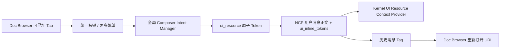

# Chat UI 资源引用设计

## 背景与用户任务

右侧 Doc Browser 已经把文档、Apps 列表、Panel App 和普通内容页组织成 Tab，但这些 Tab 只能浏览和关闭，不能像工作台文件一样进入聊天上下文。用户任务是：在任意有实际资源的右侧 Tab 上通过右键或“更多”选择“添加到聊天”，立即在当前聊天输入框看到可移除引用；发送后，用户、模型和历史消息仍能识别同一个资源。

这项能力服务 NextClaw 的统一入口和上下文连续性：用户不需要记住应用 ID、内部 URL 或资源协议，当前正在看的资源就是可显式交给 AI 的上下文对象。

## 当前证据与约束

- Doc Browser 与工作台已经复用 `CompactTabStrip` 和统一 `ContextMenu`；右键与“更多”可以走同一菜单，不需要新建菜单组件。
- `DocBrowserTab` 已持有 `kind`、`title`、`resourceUri`、`currentUrl` 和可选 `contentParams`，足以形成选择时的资源快照。
- Composer 已有原子 token、结构化剪贴板、发送 metadata、历史消息恢复和 Kernel Context Provider 主链路。
- 现有 `@panel-app:` 只表达 Panel App 身份，没有把结构化引用写入 `ui_inline_tokens`，也没有进入模型上下文，不能作为本功能的完整协议。
- iframe 内部的实时 DOM、滚动位置和应用私有状态没有统一可信快照协议，不能把“添加 Tab”描述成页面内容抓取。

## 功能地图

| 场景 | 用户可见行为 | 状态 / 数据 owner | 失败或返回路径 | 验证证据 |
| --- | --- | --- | --- | --- |
| 文档、Apps、Panel App、普通 URL Tab | 右键或“更多”出现“添加到聊天” | Doc Browser Tab 菜单投影 | 无稳定地址时不展示 | 菜单交互测试 |
| 空白首页、`about:blank` | 不展示无意义动作 | 资源资格判断 | 保留关闭等原动作 | 资格判断测试 |
| 当前位于聊天页 | 引用插入当前会话或新会话输入框，并聚焦 | 全局 Composer Intent Manager，按 session key 路由 | 输入框尚未挂载时保留 pending intent | manager / 输入框测试 |
| 当前不在聊天页 | 打开 `/chat/draft`，引用进入新聊天草稿 | AppLayout 导航 + 全局 intent | 不写入不可见的旧会话 | 路由集成测试 |
| 编辑与发送 | 原子 Tag 可移除、复制、剪切、粘贴；正文含 `@resource:`，metadata 含结构化快照 | Composer | 非法 metadata 被拒绝，不降级伪造上下文 | token / metadata 测试 |
| 模型消费 | 获得显式 UI 资源引用块，包含地址、类型、标题、当前 URL 和有界参数 | Kernel Context Provider | 参数超预算时明确省略，不截断成非法 JSON | provider 测试 |
| 历史消息 | 保持同一视觉语言，点击重新打开规范资源 URI | 消息 renderer + Doc Browser manager | 资源失效时仍保留可见引用，不伪造内容 | 消息动作测试 |

## 方案比较

### 方案 A：每类 Tab 使用各自 token

文档、Panel App、Apps 页面和 URL 分别建设协议。语义精确，但菜单、序列化、回显和 Context Provider 会持续复制；新增 Tab 类型需要修改多个消费者。不采用。

### 方案 B：复用 `system_object`

系统对象是 NextClaw 管理、可导出不可变文本快照的领域实体；Tab 是可导航 UI 资源。混用会破坏快照不变量，也会把 Panel App 执行入口伪装成知识对象。不采用。

### 方案 C：统一 `ui_resource` 引用

所有可寻址 Tab 形成同一种选择时资源快照，菜单、Composer、metadata、历史消息和 Kernel 使用一条主链路；资源类型保留在引用内部，未来可按类型增加可信 materializer，而无需迁移用户消息协议。采用。

牺牲是本期只注入资源身份与选择时参数，不抓取 iframe 实时内容；这是比不可靠 DOM 抓取更诚实、可复现的边界。若未来建立受权限控制的页面快照/应用状态导出合同，再在 `ui_resource` materializer 层扩展，不新增平行 token。

## 统一协议

token kind 为 `ui_resource`，纯文本锚点为：

```text
@resource:<encoded-resource-uri>
```

结构化引用为：

```ts
type ChatUiResourceReference = {
  uri: string;
  resourceKind: string;
  title: string;
  currentUrl: string;
  contentParams?: UiContentParams;
};
```

- `uri` 是持久、可重新打开的规范地址，也是 token key。
- `resourceKind` 决定语义图标与后续 materializer 路由，不决定独立发送协议。
- `currentUrl` 是选择时实际导航位置；与 `uri` 不同时两者都保留。
- `contentParams` 是打开资源时的不可变初始参数，不代表 iframe 当前私有状态。
- metadata 继续使用 `ui_inline_tokens` schema v2；新增 union 分支，不破坏旧消息。

Kernel 输出 `Explicit UI Resource References`，明确这些是用户可见选择的资源身份，不是已经读取的页面正文，也不是高优先级指令。参数按单项和总量预算完整输出或明确省略，不产生半截 JSON。

## Owner 与主链路



- Tab 导航事实：`DocBrowserManager`。
- 哪些 Tab 可引用、如何投影为资源快照：right-panel resource feature。
- 跨页面、按 session 路由的插入意图：AppPresenter 持有的唯一 `ChatComposerIntentManager`；ChatPresenter 不再创建第二实例。
- 原子编辑、剪贴板和发送 metadata：Composer。
- 模型上下文：单一 `UiResourceReferenceContextProvider`。
- shared Doc Browser 只接受通用 `getTabMenuGroups` 投影，不依赖 chat feature。

## 生命周期与不变量

1. 选择引用后，Tab 后续导航不修改已插入 token；发送的是选择时快照。
2. 引用必须同时可见于正文和 metadata；只有 UI Tag、没有 metadata 的半链路视为失败。
3. 非聊天页操作总是进入新草稿，不暗中污染上次会话。
4. 同一 URI 在单次 Composer 中遵循既有 token 去重规则；重复添加不制造视觉重复。
5. 历史消息点击用 `uri` 重新解析当前可用资源；不承诺恢复实时 DOM、滚动位置或 Panel App 私有运行状态。
6. 空白页和不可寻址页不提供动作；不生成空 token 或 `about:blank` 上下文。

## 兼容、删除与禁止的平行路径

- 保留已有手动 `@panel-app:` 输入与 Panel App slash action，避免无关迁移；它们仍是执行入口，不自动升级为资源上下文。
- 新的 Tab 操作只生成 `ui_resource`，不再为 Panel App Tab 建第二条专属发送链路。
- ChatPresenter 改为复用 AppPresenter 的 Composer Intent Manager，删除页面级第二 owner。
- 不新增 Doc Browser 专属菜单组件、事件总线或隐藏 prompt 拼接。

## 验收标准

1. 文档、Apps、Panel App 和普通 URL Tab 的右键与“更多”打开同一菜单并可添加到聊天；空白页不显示该动作。
2. 当前聊天和新会话界面都能直接插入引用；非聊天页操作进入新草稿且不闪失引用。
3. 输入框 Tag 可按现有统一引用规范删除、复制、剪切、粘贴，发送正文存在 `@resource:`。
4. `ui_inline_tokens` 保留完整合法引用；历史消息恢复同类 Tag，点击能打开对应规范 URI。
5. Kernel 只从当前用户消息 metadata 注入显式 UI 资源上下文；无 token、非法引用或旧消息不注入。
6. 参数预算超限时整项省略并说明，不输出破损 JSON。
7. shared、kernel、agent-chat-ui、UI 的定向测试、受影响 TypeScript、targeted lint 和 diff-only maintainability guard 通过。

## 非目标

- 不抓取或序列化 iframe 实时 DOM、滚动位置、表单值和 Panel App 私有内存状态。
- 不自动读取任意外部 URL 内容，不绕过权限、CORS 或用户授权。
- 不把空白页、工作台概览、会话列表等没有稳定资源地址的所有视觉 Tab 强行变成引用。
- 不在本轮重构已有 `@panel-app:` 的输入面板与 slash command 语义。
