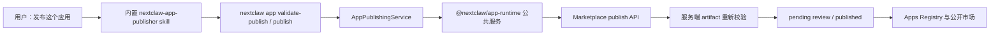

# NextClaw 原生 Mini App 发布方案设计

## 文档状态

- 日期：2026-08-13
- 验证日期：2026-08-14
- 状态：实现完成，本地验证通过（未提交、未部署）
- 范围：Panel App、Service App 与 schema v2 Mini App 的本地校验、平台提交审核和 AI 发布入口
- 不包含：生产部署、审核后台改版、社区 Service App 自动放行、版本级审核模型重构

## 一、结论先行

Mini App 发布应成为 NextClaw 自身的产品能力，用户与 AI 的唯一公开入口是 `nextclaw app`。`@nextclaw/app-runtime` 继续承载 manifest、bundle、artifact 校验和 Marketplace client 等底层包基础设施，`.napp` 继续作为内部制品格式，但 `napp` 不再是 Panel App、Service App 或 schema v2 Mini App 的用户工作流入口。

本次新增两条原生命令：

```text
nextclaw app validate-publish <app-dir> [--meta <path>] [--json]
nextclaw app publish <app-dir> [--meta <path>] [--allow-warnings] [--json]
```

同时新增内置 `nextclaw-app-publisher` skill。用户只需表达“发布这个应用”，AI 负责识别已有 Panel/Service、创建或更新标准 schema v2 包目录、执行本地校验、读取 NextClaw 登录态、提交审核并解释结果。

个人提交成功的语义是“已提交审核”，不是“已上架”。只有平台返回 `published` 时才展示公开详情；`pending` 只返回审核状态与发布者控制台入口。NextClaw 原生命令的人类与 JSON 输出都不暴露底层安装命令、registry、token 或 `.napp` 路径。

## 二、用户任务与成功标准

### 2.1 用户任务

NextClaw 用户从当前会话中说“把这个 Panel App / Service App / 小应用发布到应用市场”，AI 在不要求用户理解 `.napp`、registry、token 或独立 runtime 的前提下完成提交，并明确告诉用户当前是待审核、已发布还是被阻止。

### 2.2 成功标准

一次完整的首发链路必须满足：

1. AI 能识别 Panel-only、Service-only 或 Panel + Service。
2. AI 将组件组织为 schema v2 Mini App 包，组件运行事实仍分别来自 `panel-app.json` 与 `service-app.json`。
3. `nextclaw app validate-publish` 对包结构、组件、体积、checksum 和 Marketplace 元数据给出确定结果。
4. `nextclaw app publish` 只使用 NextClaw 当前平台登录态，不要求用户管理 token。
5. 未登录、缺少 username、scope 不匹配、存在 warning 或 artifact 不可信时，在上传前给出可执行错误。
6. 个人提交返回 `pending`，公共目录仍不可见；管理员审核通过后才进入市场。
7. Marketplace 服务端在持久化前重新解包并核对 artifact，不信任客户端随请求提交的 manifest。

## 三、当前事实与问题

### 3.1 已有能力

- `nextclaw app check/dev/call/restart` 已直接服务 Panel App 与 Service App 的真实开发和运行链路。
- kernel `AppPackageManager` 已拥有 schema v2 包的安装、启用、更新、回滚与卸载生命周期。
- `@nextclaw/app-runtime` 已拥有 schema v2 manifest、bundle、发布校验、登录态读取和 Marketplace 提交能力。
- Marketplace 已将个人提交写为 `pending`，公共目录只读取 `published + public + listed + schema v2`。
- 平台用户控制台已有个人应用列表、状态、审核备注和隐藏/展示/删除能力。

### 3.2 当前违反点

1. 发布入口从 `nextclaw app` 突然切到 `napp`，把同一个产品概念拆成两套用户心智。
2. 现有 Marketplace skill 默认 `--mode source`，与 schema v2 强制 `bundle` 的合同冲突。
3. 个人 `pending` 提交仍可能被 CLI 输出为 `Published`，状态反馈不真实。
4. Marketplace 只校验上传字节 hash 与请求 payload，没有重新核对 bundle 内 manifest、metadata 和 checksums。
5. `napp doctor` 只检查工具存在，不能证明当前版本具备最新 Mini App 发布能力；原生命令应随 NextClaw 版本一起交付，不再额外做双 CLI readiness。

## 四、候选方案

| 方案 | 用户可理解性 | Owner 与耦合 | 失败恢复 | 实现成本 | 结论 |
| --- | --- | --- | --- | --- | --- |
| A. 继续以 `napp` 为发布入口 | 差；用户需要理解第二个产品和 CLI | App 产品语义泄漏给独立 runtime | 登录、版本和产品状态分裂 | 最低 | 拒绝 |
| B. `nextclaw app publish` 仅 shell/进程转发到 `napp` | 表面统一，错误与 help 仍泄漏 `napp` | 新增无语义 wrapper，形成双 CLI owner | 版本不一致仍存在 | 较低 | 拒绝 |
| C. `nextclaw app` 原生编排，复用 `@nextclaw/app-runtime` 公共服务 | 最好；用户只理解 NextClaw App | CLI 拥有用户意图，包库拥有制品不变量，Marketplace 拥有审核 | 错误能按产品语义返回 | 中等 | 采用 |
| D. 把全部 bundle/registry 代码搬进 kernel | 入口统一 | kernel 吸收发布基础设施并复制已有 owner | 可控但重复最大 | 高 | 拒绝 |

方案 C 的代价是 `nextclaw` 增加对 `@nextclaw/app-runtime` 的直接公共依赖，并需要迁移 skill 与测试；收益是保留单一包基础设施 owner，同时消除用户入口分裂。只有未来完全删除独立 NApp runtime 时，才考虑把底层库重新命名或拆为更中性的 package。

## 五、功能地图

| 场景 | 用户看到什么 | 可执行动作 | 状态 / 事实 owner | 失败或返回路径 | 验证证据 |
| --- | --- | --- | --- | --- | --- |
| 发起发布 | AI 确认识别出的 Panel/Service 和目标包 | 继续组织包 | `nextclaw-app-publisher` skill | 找不到组件时说明缺失目录 | skill loader 与内容测试 |
| 本地校验 | 应用 id、版本、组件数、包体和 warning | 修复后重试 | `AppPublishingService` + app-runtime validators | schema v1、缺文件、路径或 checksum 错误直接失败 | CLI service 定向测试、真实包 smoke |
| 未登录 | “应用本身已通过，只差登录” | `nextclaw login` 后重试 | NextClaw 平台登录态 | 不展示 raw token 路径 | publish service 测试 |
| warning | 明确 warning 与风险 | 修复，或用户确认后 `--allow-warnings` | 本地 validation result | 默认不上传 | warning gate 测试 |
| 个人提交 | “已提交审核”，状态 `pending` | 打开发布者控制台 | Marketplace publish status | 公共详情和安装命令暂不展示 | pending 输出测试 |
| 官方提交 | “已发布”，状态 `published` | 打开详情或安装 | Marketplace admin auth | 非 admin 不能使用官方 scope | published 输出测试 |
| 审核拒绝 | 控制台显示原因 | 修复并重新提交 | Marketplace review owner | 未公开版本允许替换，同版本公开制品不可变 | 既有 owner API + 本地合同测试 |
| 重新进入 | AI 可再次校验/提交；控制台查看状态 | 重试或修复 | 本地包 + Marketplace owner console | 不在 skill 中维护影子状态 | 无新增持久化 owner |

## 六、主链路与职责边界



### 6.1 Owner 划分

| Owner | 负责 | 不负责 |
| --- | --- | --- |
| `nextclaw-app-publisher` skill | 用户意图、组件识别、包目录组织、风险解释、登录引导、成功标准 | bundle 算法、登录 token 存储、审核状态持久化 |
| `nextclaw app` controller | CLI 参数与稳定的人类/JSON 输出 | manifest、bundle、审核规则 |
| `AppPublishingService` | schema v2 门禁、validate → warning gate → publish 编排 | 自己实现 zip、hash、HTTP |
| `@nextclaw/app-runtime` | manifest、bundle、artifact、metadata、平台登录态读取、Marketplace client | 用户工作流和 CLI 产品文案 |
| Marketplace | 发布身份、scope、不可变版本、pending/review/catalog 状态 | 本地包源文件和本机运行状态 |
| kernel `AppPackageManager` | 已安装包生命周期 | 开发者发布和远端审核 |

命中的架构原则：`information-expert`、`single-complete-owner`、`minimal-responsibility-surface`、`tell-dont-ask`、`no-compatibility-by-default`。`nextclaw` 直接调用 app-runtime 的公共服务，不启动 `napp` 子进程，也不复制 bundle 或 Marketplace client。

## 七、CLI 合同

### 7.1 `validate-publish`

```text
nextclaw app validate-publish <app-dir> [--meta <path>] [--json]
```

- 只接受 `manifest.schemaVersion === 2`。
- 分发模式固定为 `bundle`，不暴露 `--mode`。
- 不需要登录，不产生远端写入。
- 返回 app id、版本、组件数、包体大小、文件列表和 warnings。
- schema v1 明确提示：这是 legacy standalone NApp，不属于 Panel/Service Mini App 原生发布链路。

### 7.2 `publish`

```text
nextclaw app publish <app-dir> [--meta <path>] [--allow-warnings] [--json]
```

- 内部必须先执行同一 `validate-publish` 主链路，不能依赖调用者记得先校验。
- 有 warning 且没有 `--allow-warnings` 时退出，不上传。
- 不提供 `--token`、`--api-base`、`--mode`；只使用 NextClaw 当前平台登录态和官方 Marketplace。
- `pending` 输出“已提交审核”，不输出可安装命令或尚不存在的公开详情。
- `published` 才输出公开详情。
- JSON 输出同时包含 validation 与经过 NextClaw 产品化裁剪的 publish result，供 AI 稳定读取；不返回底层 install spec 或临时 artifact 路径。
- bundle 只生成在本次命令的系统临时目录；无论校验、提交或异常退出，NextClaw 都负责清理，不在应用源码目录留下 `.napp`。

### 7.3 错误语义

| 条件 | 输出原则 |
| --- | --- |
| 未登录 | 应用校验已通过；只缺平台登录；运行 `nextclaw login` |
| 缺 username | 引导平台账号页设置用户名 |
| scope 不匹配 | 个人 app id 必须是 `<username>.<app-name>` |
| warning 未确认 | 明确列出 warning；修复或显式确认后重试 |
| artifact 不可信 | 拒绝持久化，报告首个具体不变量 |
| pending | 已提交审核，不声称已上架 |

## 八、Skill 合同

新增内置 `nextclaw-app-publisher`，触发词包括“发布应用、上架应用市场、提交审核、分享 Panel/Service App”。已发布个人应用的版本更新不在首版承诺内；用户提出更新时，skill 必须先说明当前版本级审核边界，不能调用首次发布链路让线上旧版消失。

Skill 承担：

1. 确认用户明确授权远端提交；仅询问、讨论或预览时只运行本地校验。
2. 读取已有 `nextclaw-app-creator`、`panel-app-creator`、`service-app-creator` 产物，不重新发明组件字段。
3. 选择稳定的包源码目录，创建 schema v2 `manifest.json`、`marketplace.json`、README、图标和组件目录。
4. 对组件先运行 `nextclaw app check`；Service 再运行 `dev/call` 抽测；对组合包运行原生 `validate-publish`。
5. 提交时调用 `nextclaw app publish --json`，按 `pending/published` 返回真实状态。
6. 对含 Service 的社区包明确说明本地进程风险与人工审核要求，不暗示 manifest 能形成 OS 沙箱。

Skill 不承担：

- 不调用 `napp`。
- 不暴露或索要 raw token。
- 不自行 POST Marketplace API。
- 不维护审核状态缓存。
- 不在组件复制时静默改写稳定 id、action id 或权限声明；发现不符合包前缀时由 AI在源码层显式修正并重新验收。

包源码目录规则：已有项目内 package source 时原地维护；只有 workspace 中的松散 Panel/Service 时，默认创建 `<agents.defaults.workspace>/app-packages/<scope>.<app-name>/`。禁止把开发源码写进 `~/.nextclaw/apps/`，后者只属于安装后版本与数据的 runtime owner。组件进入 package source 时可以保留 workspace 原件并创建带包前缀的发布副本，但所有 id、Service action 引用和权限变化必须显式修改、重新检查并在提交前向用户说明，不能在打包器里隐式重写。

现有 `skills/nextclaw-app-runtime` 收紧为 legacy standalone NApp 边界，并明确 Panel/Service Mini App 使用 NextClaw 内置 publisher，避免两条发布主链路继续竞争。

## 九、Artifact 安全合同

Marketplace 在写 R2/D1 前调用 app-runtime 提供的纯 artifact validator。该 validator 同时供本地解包与 Worker 使用，避免客户端和服务端两份 zip 不变量漂移。

必须验证：

- 压缩大小、解压总大小、单文件大小、文件数和压缩比预算。
- central directory 结构完整，拒绝 encrypted、Zip64、非 store/deflate 压缩方法和非普通文件类型。
- 拒绝 absolute path、盘符、NUL、`.` / `..`、反斜线混淆和 normalized duplicate path。
- `.napp/bundle.json` 身份、分发模式和固定入口路径正确。
- `.napp/checksums.json` 精确覆盖除自身外的所有 artifact 文件，且 SHA-256 全部匹配。
- artifact 内 `manifest.json` 与请求 payload 的 id、name、version、distributionMode 和 payload 支持的 manifest 字段一致；artifact 可保留 `nameI18n` 等不参与运行的扩展展示字段。
- schema v2 每个 component path 都存在对应 `panel-app.json` 或 `service-app.json`；声明 icon 时文件存在。

只有全部通过才允许写入 R2 和 D1。

## 十、状态与失败恢复

| 阶段 | 普通 | 重试 | 中断 / 失败 | 重进 |
| --- | --- | --- | --- | --- |
| 包组织 | 本地目录是事实源 | 修文件后重跑 | 不产生远端状态 | 继续读取同一目录 |
| 本地校验 | 纯读源文件，仅在临时目录产物化 | 幂等 | 临时包清理 | 无状态恢复 |
| 提交 | Marketplace 以 app id/version/hash 判定 | 同 hash 幂等 | 网络失败不声称提交成功 | 重新提交并读取服务端结果 |
| pending | Marketplace item 是事实源 | 修复后按现有审核合同重提 | 不进入公共目录 | 发布者控制台查看 |
| published | Registry 是公共消费事实源 | 同版本不同 hash 拒绝 | 下架不覆盖 artifact | 公共详情与安装继续读取 Registry |

在 version-level review 建立前，Marketplace 对普通个人用户更新 `published` item 的请求明确拒绝；官方 admin 更新不受此限制。该门禁必须位于服务端 owner，不能只依赖 skill 或 CLI 提醒，从而保证旧公开版本持续在线。

本次不新增本地 publish store、queue 或 status cache。AI 的自然语言反馈不是审核状态事实源。

## 十一、兼容、迁移与删除点

- 保留 `napp` 供历史 schema v1 standalone WASI NApp 使用；它不再出现在 Mini App skill 主路径。
- schema v2 不提供 `nextclaw app` → `napp` 子进程 fallback。
- `nextclaw-app-runtime` Marketplace skill 收紧触发范围，不再声称负责 Panel/Service Mini App。
- 不复制 `AppPublishService`、`AppPublishValidationService` 或 bundle validator 到 `nextclaw`。
- 未来若 schema v1 完成迁移，可单独评估删除独立 `napp` CLI；本次不做无证据的破坏性迁移。

## 十二、明确非目标

- 不在本次新增图形化“发布”按钮或创作者后台。
- 不新增交互式 `compose` wizard；AI 直接维护标准包目录。
- 不自动批准普通 community Service App。
- 不声称 Service App 已具备 OS 级文件系统或网络沙箱。
- 不重构现有 item-level 审核为 version-level 审核；本次验收聚焦首次个人提交，以及 pending/rejected 状态下的修正重提。已发布个人应用的新版提交由服务端明确拒绝并保留旧版在线，version-level review 继续作为独立后续设计。
- 不提交、发布 NPM、部署 Worker 或更新远端 Marketplace skill。

## 十三、实现范围

1. `@nextclaw/app-runtime`
   - 增加可跨 Node/Worker 使用的 artifact validator，并由本地 bundle 解包复用。
   - 导出 artifact validation 子路径。
   - 补齐 `AppPublishResult.item.publishStatus/ownerScope/appName` 类型。
   - 修正 legacy publish controller 对 `pending` 的输出。
2. `nextclaw`
   - 增加 app-runtime 直接依赖。
   - 新增 `AppPublishingService`、两个 command controller 和命令注册。
3. Marketplace Worker
   - 在 R2/D1 写入前调用同一 artifact validator。
   - 在 version-level review 完成前拒绝个人用户更新已发布 item，避免旧版本被重新置为 pending。
4. `@nextclaw/core`
   - 新增内置 `nextclaw-app-publisher`，更新 app creator 路由、技能目录和 loader 测试。
5. 文档与变更
   - 同步两份 `USAGE.md` 命令表。
   - 收紧 legacy marketplace skill 边界。
   - 添加 changeset，不执行发布。

## 十四、最小充分验证

### 14.1 自动化

- app-runtime：artifact 正常包、篡改 checksum、payload manifest 不一致、非法路径/非普通文件、预算超限；bundle 既有测试全过；tsc、lint、build。
- nextclaw：schema v2 校验通过、schema v1 拒绝、warning gate、pending/published 编排；tsc、targeted lint、build。
- core：builtin skill 可发现并包含 `nextclaw app validate-publish/publish`，不包含 `napp publish`；tsc 与定向测试。
- Marketplace Worker：artifact validator 接入编译通过；个人首次提交/修正重提允许、已发布个人应用更新拒绝；发布相关定向测试与 tsc、lint、build。

### 14.2 真实本地链路

使用官方 Personal Space schema v2 包执行：

```text
nextclaw app validate-publish <personal-space-package> --json
```

确认识别 4 Panel + 1 Service、固定 bundle 模式、无 warning。发布命令只使用 mock/local Marketplace endpoint 做提交合同验证，不触碰生产。

### 14.3 安全反证

构造被篡改或 payload 与 artifact manifest 不一致的上传，证明 Worker 在任何 R2/D1 写入前拒绝。

### 14.4 收尾门禁

- 所有 TypeScript 触达 package 运行匹配范围 `tsc`。
- targeted lint。
- `git diff --check`。
- 一次 `post-edit-maintainability-guard`。

## 十五、方案 review 清单

- [x] 用户唯一入口是 `nextclaw app`，skill 主路径不再调用 `napp`。
- [x] 包格式与发布协议仍只有 app-runtime 一个 owner，没有复制到 CLI 或 kernel。
- [x] Marketplace 审核状态仍只有服务端一个 owner，skill 不维护影子状态。
- [x] 个人 `pending` 与官方 `published` 的用户反馈不同。
- [x] 服务端不再信任客户端自报 artifact manifest。
- [x] Service App 风险没有被登录、审核或签名伪装成沙箱。
- [x] 设计明确了首版不解决已发布个人应用的版本级审核，避免静默下架旧版。
- [x] 包源码与已安装 runtime 目录分离，发布不会覆盖 workspace 原组件或 `~/.nextclaw/apps` 状态。
- [x] 没有新增无语义 wrapper、子进程 fallback 或第二套 Registry client。
