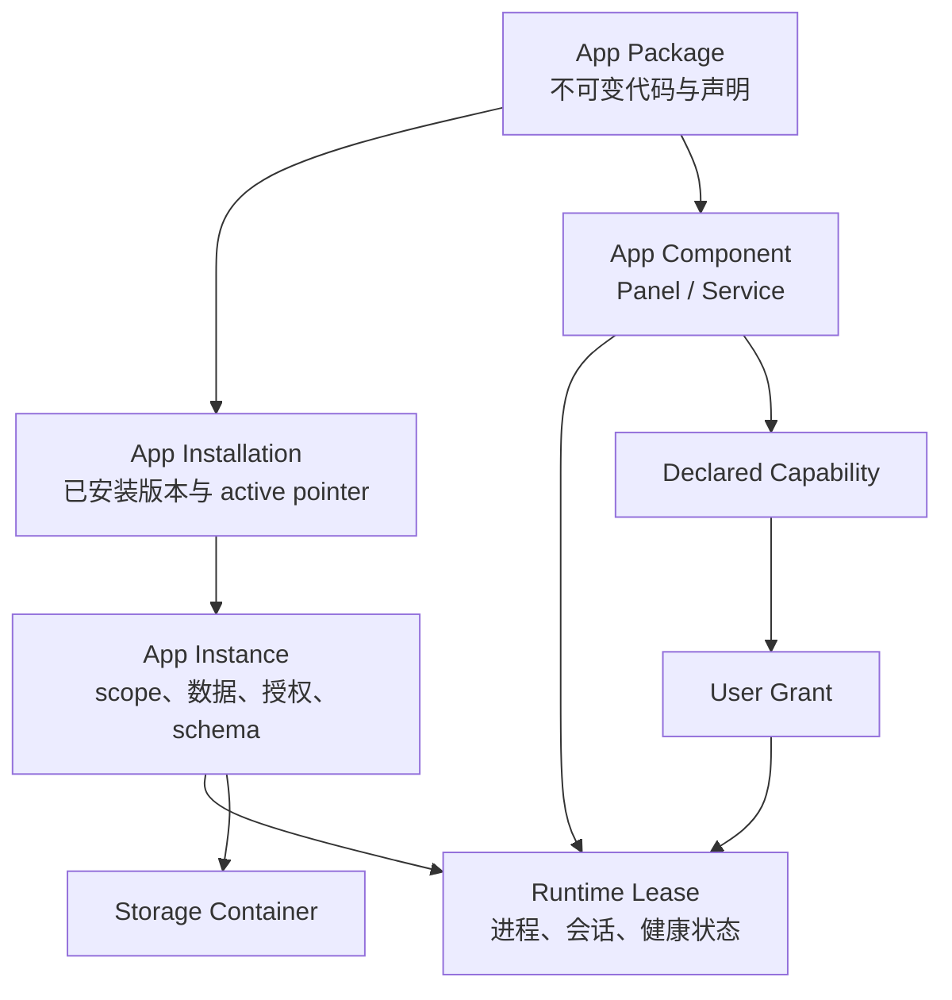
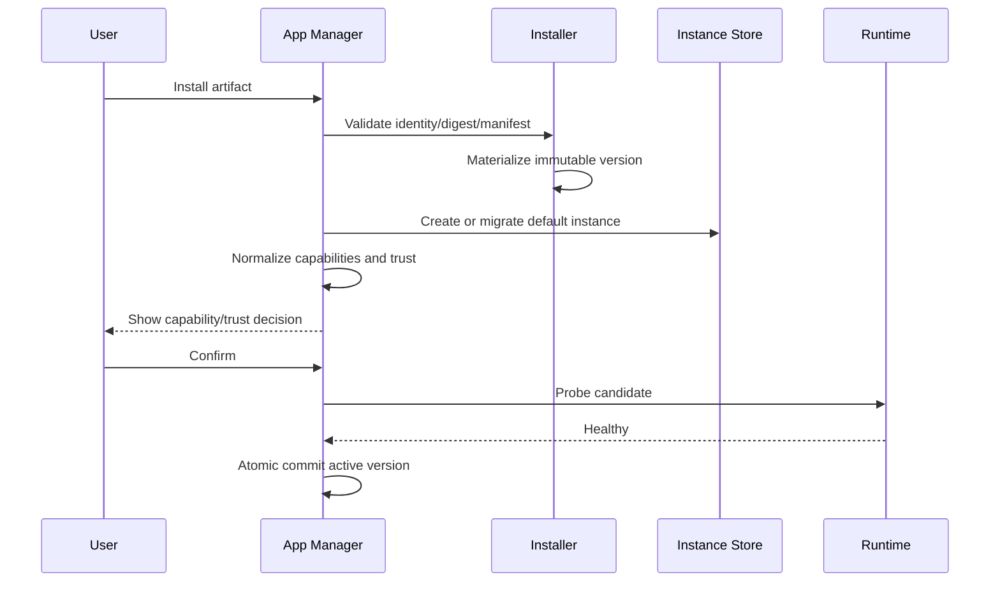

# NextClaw App Platform 产品化设计

- 日期：2026-08-14
- 状态：已冻结，进入实现
- 风险等级：L4
- 适用范围：Mini App、Panel App、Service App、`.napp`、Marketplace、安装/更新/回滚/卸载/发布链路
- 产品 owner：`@nextclaw/kernel` 的 App Platform
- 基础设施 owner：`@nextclaw/app-runtime`

> App 数据保留、残留数据再发现/再删除、Workspace Service 数据处置和开发态重置的完整合同，见 [App 数据生命周期管理设计](./2026-08-14-app-data-lifecycle-management.design.md)。

## 1. 结论

当前问题不是“少了一个数据目录规范”，而是 App Package、安装记录、运行实例、组件、权限和数据生命周期被压成了同一个 `appId`。这导致路径虽然存在，隔离、升级、回滚、审核和用户管理却没有形成同一份可验证合同。

本设计把现有 Mini App、Panel App、Service App 收敛为一个 App Platform：

1. App Package 是不可变的分发物，不拥有可变数据。
2. App Installation 管理本机已安装版本和 active pointer。
3. App Instance 是数据、授权和运行时生命周期的最小单元。
4. Panel、Service 是 App 的组件，不再是三套并列产品。
5. 所有持久化进入结构化 Storage Container；密钥只进入宿主 Secret Store。
6. 所有外部能力先声明为 Capability，再由用户授权为 Grant。
7. 更新必须经过兼容性、权限差异、数据版本和健康检查，成功后一次性切换。
8. 第三方 Panel 可按普通审核公开；原生 Service 必须按 full-user 高权限执行面进入人工审核，审核通过后可以公开。受限 WASI Service 是目标态，必须等 schema、执行器和网络 broker 都真实闭环后才能声明。原生进程不是自动上架或无风险能力，但也不能用永久禁止公开代替审核与用户授权。

本次 v0.35.0 不宣称已经获得跨平台 OS 级原生进程沙箱。产品级设计的关键是把可信边界说清并真正执行：无法隔离的能力必须分级、阻断或由用户显式信任，不能显示成“无额外权限”。

## 2. 产品目标与非目标

### 2.1 目标

- 用户把 App 当成一个完整产品安装、打开、更新、回滚和卸载，不必理解 Panel/Service 的内部拆分。
- App 更新不覆盖用户数据，失败不把运行状态留在半升级状态。
- 开发态、workspace loose source、正式包获得同一套路径和环境变量语义。
- Marketplace 在发布、审核、安装和启用四个位置展示同一份能力风险。
- 内核可以回答：装了什么、哪个版本生效、有哪些实例、数据在哪里、占用多少、授予了什么、哪些进程在运行、上次升级是否成功。
- 后续能在不推翻模型的前提下增加多 workspace 实例、备份恢复、配额、OS 沙箱和 WASI Component runtime。

### 2.2 非目标

- 本期不允许第三方原生 Service 伪装成强沙箱应用。
- 本期不执行包内任意 install/update shell hook。
- 本期不把用户主动创建的文档塞进私有容器；用户资产通过显式选择、导出或文档授权管理。
- 本期不一次性把所有 JSON 控制面迁入 SQLite。先冻结唯一 owner 和可迁移 schema，待并发写入需求真实出现后再替换存储引擎。

## 3. 现状证据

| 链路 | 已有基础 | 产品级缺口 |
| --- | --- | --- |
| 包安装 | `.napp` 校验、受限解压、版本目录、checksum、active version | 包目录仍可写；“不可变”只是不覆盖同名版本 |
| 数据 | `~/.nextclaw/apps/data/<app-id>` | 一包一目录；无 instance/component/config/state/cache/log/tmp/secrets 语义 |
| Service | 注入 `NEXTCLAW_APP_DATA_DIR` | 环境变量是约定，不是隔离；原生子进程继承用户权限 |
| Panel | opaque-origin iframe，禁用 Web Storage | 数据只能绕到 Service，但平台没有提供统一实例/存储合同 |
| WASI | schema v1 standalone 支持 `/data` preopen | schema v2 Service 尚无 WASI component 合同；不能靠 profile 标签获得隔离 |
| 开发态 | Service dev 会创建临时 data dir | 正式 workspace Service 没有稳定 data dir，开发结束还会删除数据 |
| 权限 | 文档 grant、Panel/Service action grant | grant 分散在多个 workspace JSON，只绑定组件 id，不绑定发布者/版本/能力指纹/实例 |
| 更新 | 切 active pointer、失败时恢复 pointer、停止旧 runtime | 在切换后才做部分检查；无数据 schema、checkpoint、健康检查和 capability diff |
| 回滚 | active pointer 回退 | 代码回退不保证数据可读，可能回到旧代码+新数据 |
| 操作日志 | operations.json、重启后标记 interrupted | 不能恢复或继续；同 app 去重只在单进程内生效 |
| Marketplace | 所有者身份、包 hash、人工审核、版本不可替换 | schema v2 权限为空；审核不理解原生 Service 权限；“无额外访问”可能误导 |
| 管理 UI | Apps/Panel Apps/Service Apps 三页、启停更新卸载 | 技术组件被当成三种产品；没有数据大小、路径、缓存、日志、授权、运行状态和诊断 |
| schema | v1 WASM、v2 Panel/Service | 两条产品链路；v1 能 CLI run，v2 才进入主产品组件投影 |

真实本机样本也证明版本目录权限为 owner-writable；因此当前 `packageDirectory` 不能作为安全意义上的只读代码卷。

## 4. 参考系统与可迁移原则

### 4.1 Android

Android 把 app-specific persistent files、cache、shared/user-owned documents 分开；内部 app-specific 数据默认私有，卸载时由系统处理，cache 可回收。NextClaw 采用它的“数据类别决定生命周期”原则，而不是照搬移动端目录。

- [App-specific storage](https://developer.android.com/training/data-storage/app-specific)
- [Storage overview](https://developer.android.com/training/data-storage/)

### 4.2 VS Code ExtensionContext

VS Code 明确区分 global storage、workspace storage、state、log、secret。NextClaw 采用“实例 scope + 专用 secret store”的模型，使 workspace 级和全局级应用状态可以共存。

- [Common capabilities](https://code.visualstudio.com/api/extension-capabilities/common-capabilities)
- [ExtensionContext API](https://code.visualstudio.com/api/references/vscode-api)

### 4.3 XDG Base Directory

XDG 把 data、config、state、cache、runtime 分开，避免所有可变文件堆进一个 home 子目录。NextClaw 将同样的语义缩进每个 App Instance 容器。

- [XDG Base Directory Specification](https://specifications.freedesktop.org/basedir/)

### 4.4 Apple App Sandbox

Apple 的核心原则是应用进入容器，越界文件与网络能力通过 entitlement 显式开放。NextClaw 采用“容器 + capability + grant”的产品合同；原生进程在 OS adapter 完成前只能标为高信任执行面。

- [App Sandbox and helpers](https://developer.apple.com/library/archive/documentation/Security/Conceptual/SecureCodingGuide/DesigningSecureHelpers/DesigningSecureHelpers.html)
- [App Review Guidelines](https://developer.apple.com/app-store/review/guidelines/)

## 5. 候选方案

### 5.1 方案 A：只补目录规范

在现有 `data/<app-id>` 下增加 cache/logs，并补几条文档。

优点：改动小。

否决原因：仍然没有 Installation/Instance 分层；权限、开发态、发布审核和回滚继续割裂；无法解释多 workspace 或同一 App 多实例。

### 5.2 方案 B：每个组件独立目录，继续多份 JSON

按 Panel/Service component id 建目录，保留当前 registry/grants/operations 的多个 owner。

优点：短期隔离强于方案 A。

否决原因：组件不是用户产品边界。一个 App 内需要共享数据时会重新发明跨组件路径；grant 和 lifecycle 仍不能围绕用户安装的 App 统一解释。

### 5.3 方案 C：Package / Installation / Instance / Component 四层模型

以 App Instance 为数据与授权边界，组件只获得实例中的声明式 namespace；内核提供统一 App Manager，安装基础设施仍由 app-runtime 承担。

优点：能够同时覆盖数据、权限、升级、审核、管理 UI 和未来多实例；与成熟系统的 scope/container/capability 模型一致。

代价：需要兼容迁移和多模块改造。

结论：选择方案 C。

### 5.4 方案 D：立即把所有 Service 改成 WASI

优点：边界最清楚。

否决原因：现有官方 App 和开发者生态仍依赖 Node/MCP 进程；一次性切断会让平台从“不安全地可用”变成“安全但不可用”。WASI 是目标 profile，但在 schema v2 Service 执行器落地前不得被接受为可运行声明；native-process 通过信任分级收缩，不做虚假兼容。

## 6. 统一领域模型



### 6.1 App Package

- 唯一身份：publisher + app id + version + artifact digest。
- 包内只有代码、静态资源、组件 manifest 和声明式 migration artifact。
- 安装后不得由正常 App API 修改。
- 文件权限只提供事故防护，不作为原生进程安全边界；启动/更新时以 digest 验证完整性。

### 6.2 App Installation

- 一台 NextClaw host 对一个 app id 至多一条 installation。
- 拥有 installed versions、active version、enabled、source、publisher identity。
- 不直接拥有业务数据。

### 6.3 App Instance

- 默认实例：`global/default`。
- 后续可增加：`workspace/<workspace-id>` 与 `named/<instance-id>`。
- 拥有 storage container、data schema、capability grants、runtime leases。
- 禁用 installation 会停止全部实例；禁用实例只影响该实例。

### 6.4 App Component

- Panel 是 UI contribution；它不直接拿宿主文件路径。
- Service 是 capability provider；它只拿到实例、namespace 和已授权能力。
- 默认每个 Service 有独立 namespace。跨组件共享必须由 App manifest 声明共享 namespace，并声明唯一 writer owner。

### 6.5 Capability 与 Grant

Capability 是包声明的需求，Grant 是用户针对某个实例的决定。Grant key 必须至少包含：

`publisherId + appId + componentId + instanceId + capabilityId + capabilityFingerprint`

版本更新新增或扩大 capability 时必须重新确认；纯文案或不扩大范围的等价声明不重复打扰用户。

## 7. 存储合同

### 7.1 目录布局

```text
~/.nextclaw/apps/
  packages/<app-id>/<version>/
  instances/<app-id>/<instance-id>/
    data/
    config/
    state/
    cache/
    tmp/
    logs/
    metadata.json
  registry.json
  operations.json
```

目录语义：

| 目录 | 生命周期 | 备份 | App 可写 | 宿主可清理 |
| --- | --- | --- | --- | --- |
| data | 持久业务数据 | 是 | 是 | 仅用户确认 |
| config | 用户/实例配置 | 是 | 是 | 仅重置 |
| state | 可恢复但不可随意丢失的运行状态 | 可选 | 是 | 诊断后 |
| cache | 可重新生成 | 否 | 是 | 是 |
| tmp | 单次 lease 临时文件 | 否 | 是 | lease 结束 |
| logs | 诊断日志 | 否 | 追加/宿主管理 | 按保留策略 |

Secrets 不进入上述目录；Service 通过宿主 broker 按 capability id 读取，不获得 secret store 的真实路径。

### 7.2 环境变量

所有 Service profile 使用同一组只读上下文：

```text
NEXTCLAW_APP_ID
NEXTCLAW_APP_VERSION
NEXTCLAW_APP_INSTANCE_ID
NEXTCLAW_APP_COMPONENT_ID
NEXTCLAW_APP_PACKAGE_DIR
NEXTCLAW_APP_DATA_DIR
NEXTCLAW_APP_CONFIG_DIR
NEXTCLAW_APP_STATE_DIR
NEXTCLAW_APP_CACHE_DIR
NEXTCLAW_APP_TMP_DIR
NEXTCLAW_APP_LOG_DIR
```

`NEXTCLAW_APP_DATA_DIR` 保留为兼容主路径，但新代码不得把 cache/log/tmp 混入 data。

### 7.3 旧数据迁移

旧目录 `data/<app-id>` 在首次 materialize 默认实例时迁移到 `instances/<app-id>/default/data`：

1. 获取 app instance 独占锁。
2. 若新目录不存在，先同盘 rename；跨盘时 copy + fsync + digest/size 核对后再切换。
3. registry 只在新目录可读写验证成功后更新。
4. 失败保留旧目录和旧 registry，不进入半迁移状态。
5. 已迁移实例保留 metadata 中的 sourceLayout，便于诊断，不长期维护双写。

## 8. Manifest 与运行时 profile

schema v2 保持 Package/Component 结构，本期以向后兼容字段扩展，避免无意义制造第三条 schema 链路：

```json
{
  "schemaVersion": 2,
  "runtime": {
    "profile": "panel-only | wasi | native-process"
  },
  "storage": {
    "scope": "global",
    "schemaVersion": 1,
    "namespaces": [
      { "id": "main", "owner": "app.service", "sharedWith": ["app.panel"] }
    ]
  },
  "capabilities": {
    "network": [{ "domain": "api.example.com", "methods": ["GET"] }],
    "documents": [],
    "secrets": []
  }
}
```

`trust/isolation` 由平台根据 runtime profile 和真实执行器推导，发布者不能自行声明自己“已沙箱化”。

当前可执行合同进一步收紧：schema v2 Service component 只有 `service-app.json command/args` 这一条宿主进程链路，因此只允许 `native-process`；`wasi` 保留为目标枚举，但发布校验和服务端 ingest 必须拒绝，直到真实 WASI Service component schema 与执行器同时落地。

兼容规则：

- 旧 schema v2 Panel-only 包推导为 `panel-only/sandboxed`。
- 旧 schema v2 含 Service 包推导为 `native-process/full-user`，安装和启用时必须明确展示。
- 旧 schema v1 保留 CLI 兼容读取，但 Marketplace 不再允许新上架；迁移工具可转换为 v2。
- manifest 中的 `permissions` 逐步收敛为 capabilities 的兼容输入，产品层只生成一份 normalized capability set。

### 8.1 信任分级

| profile | 文件边界 | 网络边界 | Marketplace 默认策略 |
| --- | --- | --- | --- |
| panel-only | 无宿主路径 | 仅 App Client/broker | 社区可发布 |
| wasi | preopen namespace | host-mediated allowlist | 目标态；当前 schema v2 拒绝 |
| native-process | 当前等同用户权限 | 当前等同用户权限 | 社区高权限人工审核后可公开；安装后默认停用并需显式启用 |

`native-process` 的 package chmod 和路径注入是完整性/可用性措施，不在 UI 中称为 sandbox。

## 9. 安装、更新、回滚与卸载

### 9.1 安装事务



安装失败时删除未引用的 staging version；已有数据和 active version 不变。

### 9.2 更新事务

更新顺序固定为：

1. 下载并校验候选包，不改变 active version。
2. 比较 engine、publisher identity、digest、component identity、capability fingerprint。
3. 检查 data schema compatibility；需要迁移时创建 checkpoint。
4. 停止目标实例的旧 lease。
5. 在候选上下文执行受限 migration/probe。
6. 启动候选并执行健康检查。
7. 原子提交 active version + data schema + grants。
8. 失败则恢复 checkpoint 与旧 lease。

没有健康检查的 Service 只证明进程/MCP initialize 成功；不能宣称业务健康。

### 9.3 数据迁移

- 禁止任意 shell migration hook。
- migration 必须在 manifest 中声明 from/to、artifact path、digest、读写 namespace 和预算。
- runner 只开放目标 instance namespace，不开放 package 外的宿主路径。
- N 与 N-1 双向兼容时可直接代码回滚；否则回滚必须恢复 checkpoint。
- 无可证明回滚路径时，在更新前阻断并解释原因。

### 9.4 卸载

- 默认卸载代码并保留 instance data。
- “删除数据”必须列出 data/config/state/cache/logs 的实际大小和不可恢复提示。
- cache/logs 可独立清理。
- 保留数据的 App 重装后复用默认实例，但 publisher identity 不同则禁止自动接管。

## 10. 控制面与 owner

### 10.1 Kernel App Manager

`AppPackageManager` 演进为产品语义 owner，统一提供：

- list/get App product view
- install/update/rollback/uninstall
- instance materialize/migrate/reset
- enable/disable/start/stop/restart
- capability diff/grant/revoke
- storage usage/open/export/clear cache
- runtime health/diagnostics

PanelAppManager 和 ServiceAppManager 只管理组件运行，不拥有安装、数据或授权生命周期。

### 10.2 app-runtime

保留：artifact validation、archive、registry persistence、download、filesystem transaction、operation persistence。它不决定“是否允许社区原生 Service”这类产品策略。

### 10.3 控制面存储

本期继续使用 versioned JSON，但收敛写入 owner、atomic write 与 cross-process lock 接口。结构冻结为 installations、instances、normalized capabilities、grants、operations 的可迁移记录。

具体实现使用 host-owned lock file 将 registry mutation、同 App install/update/rollback/uninstall 与 instance materialize 串行化；死进程锁可恢复，持久化路径按 appId/version 重新推导并拒绝越出 App Home 的记录。保留数据重装时，App Instance metadata 绑定 publisher id，避免不同发布者接管同一 appId 的旧数据。

当出现多进程并发写入、查询/索引或操作恢复需求时迁入 SQLite；领域接口不变。仓库当前没有本地 SQLite runtime 依赖，L4 任务中同时引入 native DB 依赖会扩大桌面打包和跨平台风险，因此不作为本期必要条件。

## 11. Marketplace 与发布政策

### 11.1 发布前静态检查

- 包身份、路径、digest、版本不可替换。
- 解析每个 component manifest，而不只检查文件存在。
- 生成 normalized capability set 与 capability fingerprint。
- 检测 native-process、网络通配、宿主文件访问、secret 使用、migration。
- publisher 不得自行提交与 bundle 不一致的 permissions 摘要。

### 11.2 列表与审核

- 社区 `panel-only` 可按普通审核设为 listed 或 unlisted。
- 社区含任意 Service component 的包必须按 `native-process/full-user` 提交并进入高权限人工审核；管理员核对源码、权限、网络目标、artifact digest 和发布者身份后，可选择“通过并公开”或“通过但不公开”。
- schema v2 `wasi` Service 在真实执行合同落地前由本地校验和 Marketplace ingest 双端拒绝，不能用声明绕过 native-process 策略。
- 官方与社区 native-process 包的详情页都必须照实显示“以当前用户权限运行”。
- 审核页显示 component、runtime profile、storage schema、capability diff、migration 与 artifact digest。

### 11.3 安装体验

安装确认页回答四件事：

1. 谁发布的，身份是否验证。
2. 它会运行什么代码，处于哪种隔离级别。
3. 它要访问什么数据、网络和密钥。
4. 更新会不会迁移数据，是否可以回滚。

任何情况下都不得把含 native Service 的包显示为“无额外访问”。

## 12. 产品界面

一级只保留“Apps”。Panel 与 Service 出现在 App 详情的“组件”区域；开发者模式可保留独立诊断入口。

App 详情至少包括：

- 当前版本、来源、发布者、完整性状态、更新状态。
- 默认实例、scope、数据 schema、总大小。
- data/config/state/cache/logs 分项大小与打开目录。
- 运行中的组件、pid/session、健康状态、上次错误。
- capability 与 grant，新增权限单独标记。
- 更新、回滚、重启、清缓存、导出诊断、卸载/删除数据。

本期 UI 优先完成风险真实性与实例/存储可见性；三页彻底信息架构重排可以在同一领域 API 稳定后继续，不阻塞底层安全合同发布。

## 13. 本次发布范围（v0.35.0）

### 13.1 必须完成

- 新增 App Instance storage layout 与旧 data 目录事务迁移。
- 所有 package/workspace/dev Service 获得一致的结构化 storage context。
- Service runtime view 和环境变量携带 instance/component identity。
- 版本目录安装后做只读事故防护，并在启用/更新前校验 artifact integrity。
- schema v2 生成 normalized runtime/storage/capability 摘要；旧 Service 明确归类 full-user。
- Marketplace publish 不能再提交空的 schema v2 Service 权限摘要；社区 native Service 必须经过高权限人工审核才能公开上架。
- 更新在 active pointer 切换前完成兼容性与 runtime probe；失败不污染 active state。
- Apps 管理界面能看到 isolation level、数据位置/大小和关键风险。
- 补齐迁移、dev/prod parity、权限摘要、更新失败回退和发布策略测试。

### 13.2 可延后但接口必须预留

- 真正的 macOS/Windows/Linux native sandbox adapter。
- 完整 WASI Component 网络 broker。
- 多 workspace/named instance UI。
- Secret Store provider 与备份恢复 UI。
- JSON 到 SQLite 的物理迁移。
- 可恢复 operations journal。

这些不属于“以后再想”的空白：本设计已经冻结 owner、数据模型和接口位置，本期只是不虚假实现未被真实运行链路证明的能力。

## 14. 验收标准

### 14.1 数据与实例

- 旧 App 数据升级后仍可读取，目录只迁移一次，失败时旧布局保持可用。
- 两个 App、两个 component namespace 不能因路径拼接访问彼此容器。
- cache 清理不删除 data/config/state。
- 卸载保留数据后重装同 publisher App 可恢复；不同 publisher 不可接管。

### 14.2 生命周期

- 候选版本 engine/capability/data schema/runtime probe 任一步失败，active version 和旧 runtime 保持或恢复。
- 回滚在数据不兼容时被阻断或恢复 checkpoint，不出现旧代码读取新 schema 的静默状态。
- restart 后 runtime status 与磁盘 installation/instance 能重建。

### 14.3 权限与发布

- 含 Service 的 schema v2 在客户端、Worker 和 UI 得到同一 normalized risk summary。
- 社区 native Service 不能自动进入 public listed catalog，但完成人工审核后可以进入。
- native-process 安装和启用页明确显示 full-user，不出现“无额外权限”。
- capability 扩大时旧 grant 不自动覆盖新 fingerprint。

### 14.4 工程质量

- 触达 package 的 `tsc` 全部通过。
- app-runtime、kernel、server、client-sdk、UI、marketplace Worker 的定向测试通过。
- 至少有一条真实 `.napp` 从 pack → validate → install → run → update failure rollback → uninstall preserve data 的端到端验证。
- diff-only maintainability 检查无未处理高风险 finding。

## 15. 迁移与发布顺序

1. 先发布向后兼容的 app-runtime/kernel/server/client 合同。
2. 再部署 Marketplace Worker 的静态检查与 listing policy。
3. 再发布 Desktop/NPM 产品版本，使新 UI 与新策略同时可用。
4. 对现有官方 personal-organizer 执行真实升级与数据保留冒烟。
5. 观察一个版本周期后，停止 schema v1 新发布，并提供转换命令。

若 Worker 已阻断新能力而客户端尚未发布，现有 App 仍可安装；若客户端先发布而 Worker 未部署，客户端仍必须以本地 artifact 分析结果显示真实风险。安全真实性不能只依赖服务端。

## 16. 决策记录

- 选择 App Instance 作为数据/授权/运行边界，不选择 component 或 app id 裸目录。
- 选择 schema v2 兼容扩展，不制造 v3 分叉。
- 选择“能力无法隔离就分级与阻断”，不把 env/path/chmod 描述成 sandbox。
- 选择先稳定领域接口与 JSON 原子存储，不在同一 L4 变更中引入本地 SQLite native 依赖。
- 选择同一 App 产品入口，Panel/Service 降为组件和开发诊断概念。
- 选择更新前 probe + 原子提交，淘汰“先切 active、失败再尽力恢复”的主链路。
