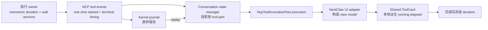

# 命令执行计时体验设计

## 结论

NextClaw 应支持 Codex 风格的命令执行计时，但不应只在终端结果 JSON 上临时补一段文案，也不应创建每秒向协议、journal 或 store 写入的 timer 链路。

推荐主链是：

1. 命令实际进入执行边界时，由 runtime/adapter 发出一次性的 `message.tool-execution-started`，以 producer 时间建立 `execution.startedAt`。
2. 命令完成、失败或取消时，由执行 owner 写入终态时间；能用单调时钟测得真实耗时时，同时写入权威 `durationMs`。
3. conversation state manager 把事件事实投影到 `NcpToolInvocationPart.execution`，journal 与历史消息自然保留该事实。
4. UI 运行中只用本地时钟派生显示值，每秒重绘文本，不修改消息/store，也不发送 heartbeat。
5. 终态优先显示 producer 报告的 `durationMs`；没有时才使用 `endedAt - startedAt`，绝不拿相邻消息时间估算。

首期只在 terminal/command tool card 上展示耗时。协议字段保持通用，后续其它长耗时工具可以复用，但本轮不把所有工具一并改造成计时面板。

## 用户任务与成功定义

用户在 NextClaw 会话里触发命令执行后，可以在同一条命令活动行持续看到已经运行多久；命令结束后，计时冻结并与成功、失败或取消状态一起保留。刷新或重新进入会话后，已完成命令仍显示相同耗时，正在运行的命令在有标准起始时间时继续显示近似实时耗时。

成功不是“组件里出现一个数字”，而是以下闭环同时成立：

- 用户能区分“还在运行”与“已经结束，并运行了多久”；
- completed duration 来自执行 owner，不由 UI 猜测；
- running duration 不产生每秒协议事件、journal 写入或消息状态更新；
- 成功、失败、取消、刷新、旧数据与并行命令的表现一致；
- 外层 `已处理 X` 继续表达整轮 assistant run，总耗时不与单条命令耗时混写。

## Codex 官方实现研究

研究基于 2026-08-14 可见的 OpenAI Codex `main` 官方源码与 app-server 合同。

### 1. Codex 把“运行中时间”和“完成耗时”视为两个层次

[TUI `ExecCall` 模型](https://github.com/openai/codex/blob/main/codex-rs/tui/src/exec_cell/model.rs)同时保存：

- `start_time: Option<Instant>`：只服务当前进程内的运行态；
- `duration: Option<Duration>`：命令结束后保存完成耗时；
- `complete_call` 写入 duration 后清空 start time；
- 异常结束时也会把当前 elapsed 冻结为 duration。

这说明 Codex 没有把动态计时文本当成业务状态持续持久化，而是保存稳定边界，渲染时派生运行态。

### 2. Codex 的完成耗时来自执行链，而不是消息时间差

[TUI exec renderer](https://github.com/openai/codex/blob/main/codex-rs/tui/src/exec_cell/render.rs)在完成结果行显示 `✓/✗ • duration`；[core exec](https://github.com/openai/codex/blob/main/codex-rs/core/src/exec.rs)在执行边界用 `Instant::now()` 与 `elapsed()` 计算实际 duration。

[app-server 合同](https://github.com/openai/codex/blob/main/codex-rs/app-server/README.md#items)进一步把最终 `commandExecution` 定义为包含 `status`、`exitCode` 与可选 `durationMs` 的权威结果，并明确最终 command item 可供 rich UI 汇总命令是否成功、运行多久。

### 3. 动态 elapsed 只驱动视图刷新

[TUI status indicator](https://github.com/openai/codex/blob/main/codex-rs/tui/src/status_indicator_widget.rs)用 `elapsed_running + last_resume_at` 计算当前 elapsed，render 时格式化，并由帧调度器请求下一帧；暂停时只冻结累计值。它没有每秒制造领域事件。

### 4. 可借鉴与不照搬的部分

应借鉴：

- producer 测量完成耗时；
- 运行态由 start anchor + 当前时钟派生；
- 完成后冻结，不继续依赖计时器；
- 计时紧贴命令状态，不另建监控卡片；
- call id 是开始、输出与结束事件的稳定关联键。

不直接照搬：

- Codex TUI 的 `Instant` 只存在于单进程内，NextClaw 还要覆盖 browser、remote service、journal replay 与重新进入会话；
- NextClaw 不能只依赖组件 mount 时刻，否则刷新后归零；
- NextClaw 已有 NCP 事件与消息投影主链，不应在 UI 再建平行的 command registry。

## NextClaw 现状证据

### 已有能力

- `NcpEndpointEvent.occurredAt` 已由事件 producer 写入，run 级别也已有 `startedAt/endedAt`。
- `NcpMessage.lifecycle` 已支持整轮 assistant 结束后显示 `已处理 3m 51s`。
- 内置 `ExecTool` 的结构化结果已经返回 `durationMs`、`exitCode`、timeout 与 killed 等事实。
- Codex app-server 官方 command item 已提供 `durationMs`，NextClaw Codex adapter 能收到完整 item。
- terminal card 已识别带 `durationMs` 的对象属于结构化 terminal result，但当前只提取 output、exit code 与 working directory。
- journal 保存完整 NCP event，消息分页会 replay 尚未投影的 journal tail，能够恢复 producer 的 `occurredAt`。

### 当前断点

```text
command execution owner
  ├─ 内置 exec result.durationMs                         已有
  ├─ Codex commandExecution.durationMs                   已有
  └─ NCP event.occurredAt                                已有
         ↓
runtime / adapter
  ├─ 内置 result 仍把 durationMs 留在 opaque content      未标准化
  └─ Codex adapter 构造 result 时直接丢弃 durationMs       断点 1
         ↓
NCP tool event
  └─ tool-call-end 只表示参数结束，不表示调度后真实开跑     断点 2
         ↓
conversation state manager
  ├─ tool handler 只接 payload，不接 event.occurredAt      断点 3
  └─ NcpToolInvocationPart 没有 execution timing           断点 4
         ↓
UI adapter / shared tool card
  ├─ ChatToolPartViewModel 没有 timing                     断点 5
  └─ terminal meta 不展示 durationMs                       断点 6
```

关键代码位置：

- 协议：`packages/ncp-packages/nextclaw-ncp/src/types/events.types.ts`、`message.ts`
- 状态投影：`packages/ncp-packages/nextclaw-ncp-toolkit/src/agent/agent-conversation-state.manager.ts`、`agent-conversation-tool-call.manager.ts`
- 默认 runtime：`packages/ncp-packages/nextclaw-ncp-agent-runtime/src/runtime/agent-runtime.service.ts`
- runtime-next：`packages/ncp-packages/nextclaw-ncp-agent-runtime-next/src/runtime/runtime-tool-call-executor.service.ts`
- Codex adapter：`packages/extensions/nextclaw-ncp-runtime-codex-sdk/src/services/codex-app-server-ncp-agent-runtime.service.ts`、`utils/codex-app-server-item-mapper.utils.ts`
- 产品适配：`packages/nextclaw-ui/src/features/chat/features/message/utils/chat-message-tool-card.utils.ts`
- 共享 UI：`packages/nextclaw-agent-chat-ui/src/components/chat/view-models/chat-ui.types.ts`、`components/chat/ui/chat-message-list/tool-card/`

阶段性边界：当前调查确认了 NCP 主链、第一方 runtime、Codex adapter、journal replay 与 Web UI；没有逐一证明所有第三方 runtime 都能报告精确 duration，因此外部 runtime 的字段继续保持可选。

## 候选方案

| 方案 | 用户体验 | owner 与恢复 | 复杂度 | 结论 |
| --- | --- | --- | --- | --- |
| A. UI 直接解析 terminal result 的 `durationMs` | 只能完成后显示；运行中没有计时 | runtime-specific JSON 成为隐式合同；Codex adapter 仍需补字段；刷新完成态可工作 | 最小 | 否决；不保留为隐藏兼容链 |
| B. 一次 execution-started 事件 + 标准终态 timing + UI 派生 elapsed | 运行中、成功、失败、取消与刷新都可覆盖 | producer 拥有时间事实，state manager 只投影，UI 只格式化 | 中等，一次协议贯通 | **推荐** |
| C. 新增 timer manager，每秒发 event/写 store/journal | 运行中看似实时 | 每秒产生非领域状态，放大渲染、网络和持久化成本；恢复仍要处理漏 tick | 高 | 否决 |
| D. 只在整轮 assistant run 上显示 live timer | 能知道整轮等了多久 | 复用 run owner，但不能回答是哪条命令耗时 | 低 | 可独立演进，不替代本需求 |

方案 B 的代价是增加一个有明确领域语义的开始事件、扩展一个可选协议对象，并同时修改 producer、projection 与 UI；收益是建立唯一、可回放、可扩展的事实主链。相比方案 A，它不是为了“支持所有工具”而过度设计，而是消除当前已经跨 runtime 存在的时间事实丢失，同时避免把排队时间冒充执行时间。

## 推荐数据模型

### 1. 标准 execution timing

在 `@nextclaw/ncp` 定义：

```ts
export type NcpToolExecutionTiming = {
  /** 执行 owner 认为工具开始实际运行的 wall-clock anchor。 */
  startedAt?: string;
  /** 工具进入 completed / failed / cancelled 的 wall-clock anchor。 */
  endedAt?: string;
  /** producer 用单调时钟测得的实际执行耗时；终态展示优先使用。 */
  durationMs?: number;
};
```

并扩展：

```ts
export type NcpToolInvocationPart = {
  // existing fields...
  execution?: NcpToolExecutionTiming;
};

export type NcpToolExecutionStartedPayload = {
  sessionId: string;
  messageId?: string;
  toolCallId: string;
} & NcpCorrelationPayload;

export type NcpToolExecutionContext = {
  // existing fields...
  /** 工具越过校验/拦截、即将进入真实副作用边界时调用；runtime 保证 once-only。 */
  reportExecutionStarted?: () => void;
};

export type NcpToolCallResultPayload = {
  // existing fields...
  /** 兼容默认 true；updateToolCallResult 产生的中间快照显式为 false。 */
  final?: boolean;
  execution?: NcpToolExecutionTiming;
};

// NcpEventType.MessageToolExecutionStarted = "message.tool-execution-started"
```

`execution`、`final` 与 context callback 均保持可选，兼容旧 journal、旧消息、旧工具和第三方 runtime；`final` 缺失按 `true` 处理，维持既有 result 语义。第一方 `updateToolCallResult` 发送的中间快照必须显式写 `final: false`，否则现有 projection 会过早把工具标成完成。新事件只表达一次性的“已进入真实执行边界”，不是每秒 tick；旧 consumer 遇到未知事件按现有 default 分支忽略，不影响原有工具结果。

### 2. 三个时间字段不是三个 owner

- `startedAt/endedAt` 是跨进程、跨刷新可恢复的 wall-clock 生命周期锚点。
- `durationMs` 是执行 owner 通过单调时钟得到的 active duration，避免系统时钟跳变，也可以排除协议传输耗时。
- completed UI 的唯一优先级是：标准 `execution.durationMs` → 标准且有效的 `endedAt - startedAt` → 不显示。
- running UI 只使用 execution-started 投影出的有效 `startedAt` 与当前本地时钟派生；完成后不再读取当前时钟。

因此这不是同一事实的无序双写：duration 是权威执行测量，timestamps 是可恢复边界。若它们有小幅差异，完成态以 duration 为准。

### 3. 新增一个状态转换事件，不新增 heartbeat

`message.tool-call-end` 不能作为准确的执行起点。它只表示模型已经给完参数；runtime-next 随后还可能进入 exclusive/parallel 调度队列，外部 runtime 还可能等待授权。直接使用它会系统性高估命令耗时。

因此增加唯一的新状态转换事件：

- `message.tool-execution-started`：第一方工具报告已越过拦截并即将进入真实副作用边界、或 adapter 收到可信 upstream execution-started 信号时只发一次；其 `occurredAt` 是 running UI 的恢复锚点。
- `message.tool-call-result`：终态 result 携带标准 `execution`；其 `occurredAt` 可作为缺失 `endedAt` 时的终态边界。
- `message.abort`、`message.failed`、`run.error` 等 terminal failure：冻结已经收到 execution-started、但尚未收到 terminal timing 的 tool part。

排队、参数生成、授权等待不得计入 execution。若外部 runtime 只能观测到不精确的 item start，宁可不显示 live elapsed，只在完成后显示 upstream `durationMs`；不得用 `tool-call-end` 降级伪造“真实执行中”。

## Owner 与端到端主链



Owner 划分：

- runtime / adapter：拥有 started event、结束与 duration 测量；第一方工具通过 context callback 报告真实副作用边界，runtime 将它转换为标准事件；能拿到 upstream duration 时必须保留。
- NCP：只定义通用 timing 合同，不理解 terminal、Codex 或具体工具名。
- conversation state manager：拥有 event → message snapshot 投影；只消费事件已有时间，不调用 `new Date()` 补协议事实。
- journal：原样记录和 replay，不计算 duration、不回填时间。
- `@nextclaw/ui`：把标准 NCP timing 转成产品 view model，并在 terminal presentation 边界归一化已知终态；不解析 raw duration。
- `@nextclaw/agent-chat-ui`：拥有紧凑计时展示、格式化与局部 tick；不拥有业务状态。

命中的架构原则：`information-expert`、`single-complete-owner`、`equivalence-by-construction`、`simple-structure-first`。无需新增 timer service、registry、Zustand store 或 context provider。

## Producer 设计

### 第一方 agent runtime

- runtime 为每个 tool call 注入 once-only `reportExecutionStarted()`；工具在越过参数校验、安全拦截与授权、即将进入真实 I/O/进程副作用前同步调用它。
- callback 被调用时，runtime 在同一同步边界记录 wall-clock `startedAt` 与单调时钟起点，并把一次 `message.tool-execution-started` 有序 enqueue 到公开 NCP event stream；工具随后立即执行，不等待 UI、journal 或 consumer apply，避免把事件传输延迟算进 duration。排队、参数校验失败、危险命令拦截与未找到工具都不发布。
- final result event 只在确实 started 后写 `startedAt`、`endedAt` 与非负 `durationMs`；duration 用 callback 到 tool promise settle 的单调时钟差。
- 中间 progress/result snapshot 写 `final: false`，且不写 `endedAt/durationMs`，避免把进度误判成终态。
- 并行工具各自按 `toolCallId` 计时，不能共用 run 级起点。

runtime-next 的 `RuntimeToolCallExecutor` 已经是 exclusive/parallel 调度 owner，但它仍不知道工具内部安全拦截是否放行。它负责把 once-only callback 和 timing scope 绑定到当前 `toolCallId`；具体 started event 从 `executeCollectedToolCall` 完成参数校验后、工具调用 callback 时进入现有 runtime event queue，不能从 `acceptEvent(MessageToolCallEnd)` 或刚进入 `runToolCall` 时发布。

首期 `ExecTool` 在 guard 通过后、调用 process runner 前调用 callback。legacy runtime 必须让该 callback 产生的 started event 经由公开 `AsyncGenerator<NcpEndpointEvent>` yield 给 kernel/journal，不能只调用其私有 `stateManager.dispatch`；若需要，可把现有 progress result 的内部发布方式收敛为同一条 runtime event sink，但不新增第二个 timing manager。

未实现 callback 的旧工具继续执行，但没有 live timer，也不由 runtime 猜真实起点。内置 terminal 是首期必须接入者；其它工具等未来需要展示 duration 时再按其真实副作用边界接入。

### Codex adapter family

- 对当前无授权等待的 command execution，`item/started` 映射为一次 `message.tool-execution-started`，并建立 `toolCallId → startedAt` 的轻量运行态记录；不能继续只有 `Set<string>` 而丢失起始事实。
- `item/completed` 读取官方 `commandExecution.durationMs`、status 与 exit code。
- NCP final tool result 同时保留 upstream `durationMs` 到标准 `execution`，并继续在 terminal result content 中保留 command/output/exit code 等展示数据。
- SDK mapper 的 `item.updated` 只发 `final: false` progress result；`item.completed` 才发 terminal result。app-server service 与 SDK mapper 必须使用同一 finality/timing 合同，不能一个修复、另一个继续提前完成。
- 非 command item 没有 upstream duration 时不伪造。
- item 完成、run 结束或 adapter dispose 后清理临时 map，避免跨 turn 泄漏。
- 一旦未来允许 approval/wait，必须重新证明 upstream `item/started` 位于批准后的真实执行边界；证明前禁止把等待授权时间计入 live timer，完成态仍可使用官方 `durationMs`。

### 第三方 runtime

- 支持 started event + 标准 terminal timing 即显示完整体验；
- 只提供完成耗时的 runtime 必须把它放进标准 `payload.execution.durationMs`；opaque result 里的同名字段不构成 NCP timing 合同；
- 什么都不提供时保持现有状态文案，不用消息 timestamp 猜测。

## Projection 与 replay 设计

`DefaultNcpAgentConversationStateManager.applyEvent` 不能再把 timing 相关 event envelope 立即降成裸 payload 后丢掉 `occurredAt`。它应为 execution-started、tool result、abort 与 run error 把 payload 和 producer timing 一起交给对应 owner。

投影规则：

1. `tool-call-start/args/end`：只建立调用、参数与 ready/call 状态，不启动 execution timer。
2. `tool-execution-started`：按 `toolCallId` 写入有效 `event.occurredAt`；重复 started event 采用最早的有效值，不覆盖已经 terminal 的 execution。
3. terminal `tool-call-result`（`final !== false`）：深合并 `payload.execution`；缺少 `endedAt` 时可使用有效 `event.occurredAt`，但不得生成 `durationMs`。
4. intermediate `tool-call-result`（`final === false`）：只更新结果快照，不把 part 改成 `state: result`，也不冻结 execution；不能靠“是否有 timing”猜 result 是进度还是终态。
5. abort/message failed/run error/endpoint terminal error：对已 started 且仍未 terminal 的 part 写入 producer terminal time，并按现有模型把 in-flight part 置为 `cancelled` 后冻结；失败语义继续由外层 message/run error 承载，不为本需求扩展新的 tool state。从未 started 的 part 不生成 duration。
6. `run.finished` 正常情况下不应留下 started 但无 final result 的 part；若异常日志出现这种 orphan，使用 run `endedAt` 冻结并标成 cancelled，避免历史卡永久显示“执行中”，同时由 invariant test 报出 producer 违约。
7. 重复、乱序或 replayed event：按 `toolCallId` 幂等更新；较完整的 producer execution 字段不能被较弱 fallback 覆盖，terminal timing 不倒退为 running。

`upsertToolInvocationPart` 当前是浅合并；新增 execution 后必须对该对象显式深合并，否则 args/result 更新会抹掉 start anchor。`cloneConversationMessage` / normalizer 也必须为 tool part 与嵌套 `execution` 建立新对象，不能只复制 `parts` 数组后继续共享可变子对象。

journal entry schema 不需要升版：新增事件和可选字段仍使用现有 event JSON envelope。消息分页当前会从最近 projection boundary replay 未投影的 journal tail，因此正在运行的 started event 与随后 result 都可在刷新时恢复；实现测试必须固定这一行为，不能假设只有稳定 message projection 文件参与 hydrate。旧 journal 没有 timing 时保持无计时。

replay 还有一个现存的字段截断点必须同步修正：`mergeReplayCompletedToolResults` 当前只补 `content/contentItems`。它必须只缓存 `final !== false` 的 result，并把标准 `execution` 深合并回 completed message；即使 completed snapshot 里的 part 已经是 `state: result`，也不能因此跳过较完整的 timing。否则 live UI 正确、刷新后仍会丢耗时。

## Transport 与旁路 consumer

- kernel journal、NCP runtime event stream、conversation state manager 是首期必通主链；execution-started 必须像其它 NCP event 一样原样透传，不能在 service/client 边界重建时间。
- Web UI 之外的 `NcpReplySession`、session activity preview、context-window refresh 可以显式忽略该事件：它没有文本、预览或 token 语义，忽略不等于丢失主链。
- NARP/ACP 当前只有宽泛的 `pending/in_progress/completed`，其中 `in_progress` 还会在参数更新阶段出现，不能安全映射为真实 execution start。首期不改 NARP 协议桥，也不得从 `in_progress` 猜 startedAt；通过该桥的 runtime 只在能传回可信 completed duration 时显示完成耗时。
- 未来若 NARP/ACP 增加明确 execution-started 或 timing metadata，再做一对一映射；不能为了表面一致而把排队、参数流或授权等待混进计时。

## UI 信息架构与交互

### 展示位置

耗时属于单条命令的次级状态，放在现有 `ToolCardHeader` 流式信息簇中，紧邻状态图标，不新增 badge、footer 或独立卡片。

```text
运行中：  [terminal] 执行中     · pnpm test   ◌  7s
成功：    [terminal] 已执行     · pnpm test   ✓  4.27s
失败：    [terminal] 执行失败   · pnpm test   !  4.27s
取消：    [terminal] 已取消执行 · pnpm test   −  4.27s
```

状态文案直接沿用现有 `chatToolTerminal*` i18n owner，不新增 `Wall time` 或“耗时”前缀。`ms/s/m/h` 沿用现有过程耗时的紧凑工程单位，在中英文界面保持一致；duration 是独立格式化片段，不与 command summary 拼成不可解析字符串。

### View model

```ts
export type ChatToolExecutionTimingViewModel = {
  startedAt?: string;
  endedAt?: string;
  durationMs?: number;
};

export type ChatToolPartViewModel = {
  // existing fields...
  execution?: ChatToolExecutionTimingViewModel;
};
```

product adapter 只把标准 NCP timing 转成 view model，不从 opaque terminal JSON 猜 duration；shared UI 不读取 raw NCP part，也不理解 Codex 字段。`TerminalExecutionView` 计算可见 duration label，再通过 `ToolCardHeader` 的可选 trailing meta slot 放在状态图标之后、chevron 之前；generic/file/search 卡本轮不传该 slot。

### 终态状态与 timing 解耦

当前 NCP session adapter 把 `part.state: result` 一律转成通用 `RESULT`，而 terminal 的 `ok: false`、非零 `exitCode/exit_code` 或 Codex `status: failed` 可能仍被产品层显示为成功。既然本设计把 duration 紧贴状态图标，这个现存断点必须在 terminal presentation adapter 一并闭合，否则会出现“失败命令 + 成功图标 + 耗时”的矛盾体验。

状态优先级限定为：显式 cancelled → 显式 error/failed/blocked → `ok === false` 或非零 exit code → completed/success。解析范围只覆盖 `ExecToolResult` 与 Codex `commandExecution` 已有的结构化 terminal contract，不推广为 generic tool JSON 猜测。duration 永远不参与 outcome 判断：`0ms` 不代表 blocked，长耗时也不代表失败。

### 格式化

运行中为稳定、低噪声的整秒：

- `0s`、`7s`、`1m 07s`、`1h 02m 07s`

完成态保留短命令的诊断价值：

- `< 1s`：`480ms`
- `< 60s`：最多两位小数并去掉无意义尾零，例如 `4.27s`、`12s`
- `< 1h`：`2m 07s`
- `>= 1h`：`1h 02m 07s`

只有标准 execution 中有限、非负的 `durationMs` 才有效；timestamp 必须能解析，且 `endedAt >= startedAt`。不设置拍脑袋的“过长”阈值。running 第一次挂载时用 wall clock 计算非负 baseline，之后用 `performance.now()` 的单调增量推进，避免本地系统时钟跳变让数字倒退；远端 start 晚于本地 now 时 baseline 暂时 clamp 为 `0s`，终态仍以 producer duration 修正。被安全策略拦截、用户拒绝且从未收到 execution-started 的命令只显示对应状态；opaque result 中的同名字段（包括 `0`）一律不参与 timing。

### tick 与性能

- 只给当前可见、`statusTone === running`、存在有效 `startedAt` 且标准 execution 尚无 `endedAt/durationMs` 的 terminal card 启动局部 `setTimeout`；`final: false` 必须保证 intermediate snapshot 仍投影为 running，不能让组件自行猜 finality。
- 根据当前 monotonic elapsed 的余数对齐下一秒边界刷新，终态、unmount 或 startedAt 变化时清理。
- 每次 tick 只更新显示用 `now`，不写 NCP message、query cache 或 Zustand。
- 页面不可见时暂停重绘，恢复可见时立即用 monotonic delta 重算；隐藏期间的真实经过时间仍计入，但不补发漏 tick。
- 并行上限当前为 8 个，局部 timer 成本可控；无需全局 timer provider。

### React 生命周期边界

- formatter、duration hook 与可选 meta 组件都在模块级声明；streaming props 不能参与创建 JSX 组件类型。
- 同一 tool card 的业务身份是稳定 `toolCallId`；本实现触达 individual card map 时应以它作为 key，不继续依赖数组 index，也绝不把 timing 值或状态放进 key。`partial-call → call → result/cancelled` 只更新 props，不因状态切换替换 terminal subtree 类型。
- timer 从 producer `startedAt` 派生，不保存“组件挂载时刻”。即使现有 tool activity grouping 在单卡变多卡时改变父级导致 remount，elapsed 也不会从 0 重新开始；本功能不借 timer 修补或扩大现有分组生命周期问题。
- tick 只替换 duration 文本，不主动 focus、不写 selection，也不影响已展开 terminal surface 的 DOM 状态。

### 可访问性与紧凑布局

- duration 使用 `tabular-nums` 与 `shrink-0`，命令摘要先截断，耗时与状态不消失。
- 每秒变化不使用 `aria-live`，避免读屏器持续播报；状态结束沿用现有状态语义。
- reduced motion 可以关闭 spinner 动画，但计时文本仍准确更新。
- 整个 header 继续是折叠按钮；duration 只是文本，不新增嵌套交互或点击目标。
- tool activity group 收起时不把各命令 duration 聚合进组摘要；展开后在各自命令行显示。
- assistant 外层过程收起时继续只显示整轮 `已处理 X`；展开后才看到单命令耗时，保持现有信息层级。

## 状态矩阵

| 场景 | timing 事实 | 用户可见行为 | 恢复/失败边界 |
| --- | --- | --- | --- |
| 参数仍在流式生成 | 无 execution start | 显示 preparing/running 现状，不显示 `0s` | 不把模型生成参数时间算进命令执行 |
| 命令实际运行中 | `startedAt` | 状态后显示整秒 elapsed，持续更新 | 客户端 clock skew 时 clamp 到 0；终态以 duration 修正 |
| 成功 | `durationMs`，可带 start/end | 绿色/成功状态与冻结耗时 | refresh 后从 message/journal 恢复相同值 |
| 非零退出/工具失败 | terminal timing | 错误状态与冻结耗时并存 | 不因失败丢掉已运行时间 |
| 用户取消/turn interrupt | start + terminal anchor | 取消状态与冻结耗时 | 没有 start 时只显示取消，不估算 |
| 安全拦截/授权拒绝，未 spawn | 无有效 start | 显示 blocked/declined，不显示 duration | `durationMs: 0` 不能单独证明执行发生过 |
| 页面刷新后仍运行 | journal tail replayed started event | 继续显示近似 elapsed | 旧数据无 start 时只显示 spinner/status |
| 历史完成消息 | 标准 timing | 显示完成耗时 | 旧数据无标准 timing 时保持当前 UI，不做隐式回填 |
| 并行命令 | 每个 call 独立 timing | 每行独立计时 | 只按稳定 `toolCallId` 关联 |
| 重复/乱序事件 | 可能只有局部 timing | 保留最完整事实，不倒退已完成状态 | orphan result 可显示 source duration，但不伪造 start |
| 远端 producer 与浏览器时钟偏差 | wall anchor 可能偏移 | live 值只作进行中反馈 | completed 以 producer `durationMs` 为准 |

## 兼容、迁移与删除点

### 兼容策略

- 所有新协议字段可选。
- 历史数据不做离线回填，也不从 opaque result、message timestamp、journal entry timestamp 或相邻 event 时间差伪造 duration。
- 旧 `ExecToolResult.durationMs` 没有已发布的 UI 展示合同，且 raw result 兼容会把 runtime-specific JSON 固化成第二协议，因此不保留 fallback；实现后新事件必须走标准字段。
- 外部 runtime 不升级时体验不回退，只是没有计时。

### 迁移顺序

1. NCP 增加一次性 execution-started 事件、标准 execution timing 类型、可选 `reportExecutionStarted` context callback，以及兼容默认 terminal 的 `final` 标志。
2. toolkit 投影 event timing，并保证嵌套 execution 幂等深合并和 snapshot 隔离。
3. runtime-next、legacy runtime、`ExecTool` 与 Codex adapter 接通真实 started 边界和完整终态 timing。
4. product adapter 只归一化标准 timing，并保持 terminal outcome 与 timing 分离。
5. shared tool card 增加纯 formatter 与运行态 tick。
6. 补 replay、取消、失败、并行与 UI 测试。

### 明确删除/禁止的平行路径

- 不新增 `command-timer.store.ts`、`tool-duration.manager.ts` 或 React context timer registry。
- 不在 component mount 时私自把 `Date.now()` 保存成领域 startedAt。
- 不让 terminal、file、search 各自复制 duration 解析器。
- 不在 server 每秒推送 elapsed，也不把 tick 写进 journal。
- Codex adapter 不能继续读取完整 command item 后丢弃 `durationMs`。

## 验证标准

### 协议与 projection

- `@nextclaw/ncp` 类型测试/tsc 证明新字段向后兼容。
- toolkit 单测覆盖 call-end 不启动 → execution-started → `final: false` intermediate result 保持 running → final result、failure、abort、重复 event、乱序 replay、深合并不丢 start，以及 clone 后嵌套 timing 不共享引用。
- journal/message projection 测试证明完成 timing 稳定，运行中 started event 与 terminal result 都能从未投影 tail 恢复。

### producer

- runtime-next 与 legacy runtime 用可控 clock 证明排队、参数校验和 guard 拦截期间不启动，`reportExecutionStarted` 时只 enqueue 一次 started event，每个 toolCall 独立测量，final result 才带 terminal timing；started 必须先于 output/result 被 consumer 观察到。
- Codex adapter fixture 证明 `commandExecution.durationMs` 原样进入标准 execution，`0`、缺失和非法值分别按合同处理。
- 并行命令不会串用 startedAt 或 duration。

### UI

- formatter 覆盖 `0ms/999ms/1s/59.999s/60s/1h`、负数、NaN、反向时间和优先级；running hook 测试 wall clock 前拨/后拨时 elapsed 仍单调，终态切换后以 producer duration 修正。
- fake timer 组件测试证明 running 每秒更新，completed/failed/cancelled 后冻结，unmount 后无残留 timer。
- product/shared UI 不解析 opaque result 的 `durationMs/duration_ms`；缺少标准 timing 时确定性地不展示。
- terminal adapter 状态测试覆盖 `ok:false`、blocked、非零 exit code、Codex failed/cancelled 与显式 invocation error；duration 的有无不得改变 outcome。
- DOM 测试证明 duration 没有 `aria-live`，header 仍只有一个折叠交互目标；同一 `toolCallId` 从 running rerender 到 final 时 header/terminal surface 节点身份保持稳定，计时文本冻结而不是 remount 归零。
- 真实浏览器检查桌面窄宽、移动端、深浅色、外层过程收起/展开、工具组展开、成功/失败/取消与两个并行命令。
- 所有触达 TypeScript 包运行匹配范围 `tsc`；定向测试通过后再按实现风险进入 maintainability review。

## 非目标

- 本轮不新增整轮 assistant 的 live status timer；现有完成态 `已处理 X` 保持不变。
- 不改 command timeout、kill、stdin、PTY 或 sandbox 行为。
- 不把耗时变成性能分析、计费、SLA 或遥测系统。
- 不修复相邻但独立的 `message.tool-call-output-delta` 消费链；计时设计不得阻塞未来 live output。
- 不把 duration 聚合进 tool activity group 摘要，也不重做工具卡信息架构。
- 不承诺第三方 runtime 在未提供 timing 时拥有精确数据。

## 三轮自审记录

### 第 1 轮：事实、协议与 replay

- 发现 `tool-call-end` 只是参数完成且可能仍在 runtime-next 队列中，撤销“直接作为 startedAt fallback”的初稿，改为一次性 execution-started 事件。
- 补出 `final: false`，避免 progress result 被现有 projection 提前标成 terminal。
- 补出 nested execution 深合并、message clone 隔离、journal tail hydrate 与 completed snapshot replay merge，保证 live 正确后刷新不丢。

### 第 2 轮：交互、状态与 React 生命周期

- 用仓库真实 i18n 文案替换概念文案，冻结 duration 在状态图标后、chevron 前的紧凑位置。
- 把 terminal outcome 与 timing 分离，补齐 `ok:false`、非零 exit code、blocked 与 Codex failed 的状态归一化；duration 不参与成败判断。
- running 计时从 wall-clock baseline 切到 `performance.now()` 单调推进，并明确 stable type/key、remount 不归零、无 `aria-live` tick。

### 第 3 轮：真实执行边界与跨链路可达性

- 发现 runtime scheduler 仍不知道工具内部 guard 是否放行，改为工具在真实副作用前调用 once-only `reportExecutionStarted()`，runtime 只负责有序发布和测量。
- 要求 legacy runtime 的 started event 进入公开 NCP stream，而不是只更新私有 state manager；补出 started → output/result 的顺序 invariant。
- 明确 NARP/ACP `in_progress` 不具备精确开始语义，首期不做伪映射。
- 删除 opaque result duration fallback：旧数据无标准 timing 就不展示，避免把 runtime-specific JSON 固化成第二协议。

三轮结束后没有未解决的 blocker 或高风险语义冲突。仍保留的限制都已显式化：旧 journal 不回填、NARP/ACP 首期没有 live elapsed、远端运行态可能受 wall-clock offset 影响但终态由 producer monotonic duration 修正。

## 最终设计门

进入实现前必须同时满足：

1. execution-started 事件与 `NcpToolExecutionTiming` 字段语义、优先级不再变化。
2. producer、projection、journal 与 UI owner 唯一，禁止 consumer 猜测。
3. running、成功、失败、取消、刷新、旧数据与并行状态都有明确结果。
4. 首期只展示 terminal command duration，不顺手扩成全工具监控。
5. 不创建 heartbeat、timer store 或第二条 command registry。

达到以上条件后，本设计可升级为实现计划；实际交付完成后再按迭代记录规则判断是否进入 `docs/logs`。
