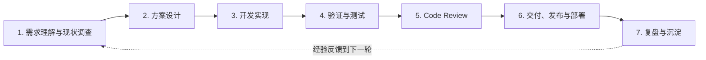
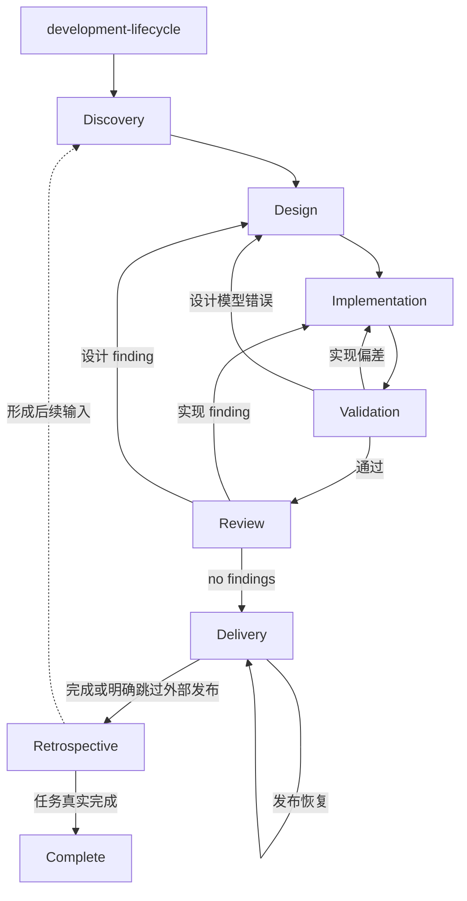

# 开发 Skill 生命周期重构设计

## 文档状态

- 状态：已实施；2026-08-25 补充设计文档与大型计划决策门
- 日期：2026-08-14
- 目标：把项目核心开发 skill 从多个平级入口重构为“一个生命周期 owner + 七个阶段 owner + 按需专项能力”的标准体系。
- 前置设计：[Skill 渐进式加载治理设计](./2026-08-08-skill-progressive-loading-governance.design.md)

## 背景

现有 skill 治理已经完成第一轮重要收敛：项目入口由 56 个减少到 33 个，高频规则从默认全家桶改为渐进加载，静态依赖图保持无循环，阶段方法、条件细节和确定性检查也开始分别进入 `SKILL.md`、`references/` 与 `scripts/`。

这解决了上下文膨胀和循环依赖问题，但核心开发体系的一级信息架构仍然不够标准：

- `nextclaw-delivery-workflow` 是总流程 owner，但名称容易与最后的交付阶段混淆；
- 调查、设计、验证、review 和 maintainability guard 以不同命名风格平铺；
- 开发实现、交付发布、复盘沉淀没有与其它阶段对称的明确 owner；
- `code-review` 与 `post-edit-maintainability-guard` 共同承担 review 阶段职责，边界需要由使用者自行理解；
- NPM、Desktop、NCP、Kernel 等 NextClaw 专项合同与通用开发方法尚未在命名层明确区分；
- 使用者必须先理解几十个 skill 的名称和触发条件，才能还原项目实际遵循的开发流程。

本次设计不否定已有渐进加载架构，而是在其之上增加清晰、通用、可维护的生命周期层。

## 核心判断

核心开发 skill 应当首先表达一条标准开发生命周期，而不是表达历史形成的工具和检查集合。

目标模型为：

```text
一个全流程 owner
  -> 七个阶段 owner
    -> 当前阶段需要的 reference / script / 专项 skill
```

全流程 owner 只负责编排；每个阶段 owner 对本阶段的进入条件、决策、产物、证据和退出条件负责；专项能力只解决当前阶段中的一个领域问题，不重新编排完整开发流程。

## 设计目标

1. 建立一个统一的开发生命周期 owner。
2. 为七个标准开发阶段各建立一个明确 owner。
3. 生命周期和阶段 owner 使用统一、通用、可迁移的命名。
4. 只有与 NextClaw 产品、NCP、Kernel、仓库命令或发布合同深度耦合的 skill 使用 `nextclaw-` 前缀。
5. 将现有平级 skill 按职责归入阶段 owner、条件 reference、确定性 script、专项子流程或横向工作模式。
6. 保持渐进加载、单一 owner、单向依赖和低 token 成本。
7. 让 validation、review、delivery 和 retrospective 各自拥有清楚且不重叠的完成语义。

## 非目标

- 不在本轮设计中改变产品源码、运行时、UI、协议或发布产物。
- 不为了目录整齐而把所有现有 skill 强行合并。
- 不把所有阶段变成每次都执行完整仪式的重型流程。
- 不允许通用命名掩盖实际存在的 NextClaw 深度耦合。
- 不以 skill 数量下降作为单独成功指标。

## 标准生命周期

核心生命周期固定为七个阶段：



这七个阶段是标准认知框架，不意味着每次任务都必须产生七份文档或执行七套重型检查。阶段 owner 根据任务类型和风险决定轻量完成、正式执行或明确跳过。

## 统一命名

### 核心生命周期

核心入口统一使用 `development-<stage>`：

| 角色 | Skill 名称 | 中文职责 |
|---|---|---|
| 全流程 owner | `development-lifecycle` | 生命周期编排、阶段推进、返工和完成判断 |
| 阶段 1 | `development-discovery` | 需求理解与现状调查 |
| 阶段 2 | `development-design` | 方案设计 |
| 阶段 3 | `development-implementation` | 开发实现 |
| 阶段 4 | `development-validation` | 验证与测试 |
| 阶段 5 | `development-review` | Code Review |
| 阶段 6 | `development-delivery` | 交付、发布与部署 |
| 阶段 7 | `development-retrospective` | 复盘与沉淀 |

选择 `development-delivery` 而不是 `development-release`，是因为每个已完成任务都需要交付结果和披露边界，但只有获得授权且确实存在外部发布面时才执行 commit、push、release 或 deploy。NPM、Desktop 等真实发布流程由 Delivery 阶段内的 NextClaw 专项 owner 承担。

### 命名原则

1. 生命周期核心统一以 `development-` 开头，最后一段只表达生命周期位置。
2. 核心阶段名称不使用 `workflow`、`guard`、`governance`、`automation` 等实现机制词。
3. 通用方法不添加 `nextclaw-` 前缀，即使 skill 当前只存放在 NextClaw 仓库。
4. 离开本项目就失去明确语义的能力必须使用 `nextclaw-` 前缀。
5. 项目专项名称使用 `nextclaw-<domain>-<task>`，不再使用 `nextclaw-development-*` 重复生命周期层级。
6. 横向工作模式按其真实意图命名，不强制使用 `development-` 或 `nextclaw-`。
7. 旧名称只在迁移记录和历史文档中保留，不继续出现在活动规则入口。

### NextClaw 深耦合判断

满足任一条件即视为深耦合：

- 依赖 NextClaw 的产品语义、Kernel/service/manager owner 或 NCP 协议；
- 依赖本仓库特定 package、目录、命令、manifest 或治理脚本；
- 依赖 NextClaw NPM/runtime/Desktop 的发布与恢复合同；
- 服务于 NextClaw 独有的用户任务，而不是通用开发阶段。

例如：

```text
nextclaw-kernel-architecture
nextclaw-ncp-runtime-validation
nextclaw-npm-release
nextclaw-desktop-release
nextclaw-marketplace-skill-integration
```

## 总流程 Owner

`development-lifecycle` 是核心开发任务的唯一默认流程 owner。它是一个轻量状态机，只负责：

- 建立任务级可观察目标和全局风险等级；
- 识别当前阶段和下一阶段；
- 调用当前阶段的唯一 owner；
- 接收阶段结果并决定继续、跳过、返工或阻塞；
- 管理用户授权、外部状态变化和不可逆操作边界；
- 判断任务是否已经完成，而不是仅判断代码是否已经写完；
- 在任务终止前进入复盘阶段，完成轻量反思或正式沉淀分流。

总流程 owner 不拥有以下细节：

- 不内嵌完整调查方法；
- 不重复方案设计原则；
- 不维护具体实现工艺全集；
- 不决定具体测试命令；
- 不承担 findings-first review；
- 不复制 NPM、Desktop 或部署合同；
- 不直接决定经验应写入哪一种长期载体。

阶段 owner 不直接调用下一个阶段 owner，也不反向引用 `development-lifecycle`。阶段只向调用者返回结果，阶段切换始终由总流程 owner 决定，以保持依赖图单向无环。

## 阶段统一合同

七个阶段 owner 使用相同的结构表达职责：

1. **进入条件**：什么情况下进入本阶段。
2. **标准输入**：本阶段依赖哪些已确认事实和上游产物。
3. **核心决策**：本阶段唯一拥有的判断是什么。
4. **内部路由**：当前分支需要哪个 reference、script 或专项 skill。
5. **标准输出**：返回什么结论、产物和证据。
6. **退出条件**：何时完成、跳过、返工或阻塞。
7. **禁止越权**：哪些相邻阶段职责不属于本阶段。

阶段结果使用统一语义：

```yaml
status: completed | skipped | rework | blocked
summary: 本阶段结论
artifacts: 本阶段产生或更新的产物
evidence: 支持结论的最小可信证据
open_risks: 尚未关闭或未验证的边界
rework_target: discovery | design | implementation | validation | review | delivery | null
```

这是一份语义合同，不要求所有回复机械输出 YAML。阶段 owner 可以用自然语言表达，但必须覆盖同等信息。

## 七个阶段 Owner

### 1. `development-discovery`

目标是回答“真正要解决什么问题，当前系统实际是什么状态”。

职责：

- 理解用户目标、约束、成功条件和非目标；
- 识别最近 owner、影响面和 L0-L4 风险；
- 调查当前 producer、owner/state、boundary、consumer；
- 区分已确认事实、合理假设和未知项；
- 判断实现路径是否显然，是否存在真实设计空间；
- 为设计或直接实现提供最小可信证据。

现有 `code-investigation-workflow` 的主合同并入本阶段；链路切片、根因分层等方法保留为条件 references。简单需求不执行完整代码调查，但必须形成明确目标和成功条件。

标准输出包括需求结论、现状证据、风险、范围、未知项以及推荐进入设计还是直接实现。

### 2. `development-design`

目标是回答“准备采用哪条主链路，以及为什么”。

职责：

- 比较存在真实取舍的候选方案；
- 冻结用户工作流、状态 owner、生命周期和不变量；
- 冻结目录、依赖、协议和失败恢复边界；
- 指明需要删除、合并和禁止新增的平行路径；
- 明确兼容、迁移、fallback 的必要性和退出条件；
- 定义非目标和最小验证标准。

现有 `nextclaw-solution-design` 演进为本阶段 owner。通用功能设计和架构原则保留为 references；NextClaw Kernel owner 等深耦合合同以 `nextclaw-` 命名的 reference 或专项 skill 保留。

路径显然的任务可以轻量完成并明确“不需要独立设计文档”，但不能未经判断直接跳过设计门。

`feature` 与 `bugfix` 都必须显式判断是否进入 Design，不能只按任务类型机械路由。局部、低风险、单一路径且验证直接的功能或修复可以记录依据后跳过；存在真实方案分叉、跨边界合同、状态或生命周期变化、兼容/迁移/fallback，或风险达到 L3-L4 时进入 Design。进入 Design 后还要单独判断产物层级：形成设计结论不等于必须创建稳定设计文档，是否写入 `docs/designs` 由影响面、跨会话复用和合同稳定性决定。

Design 在完成前还必须显式判断是否需要执行 plan。Plan 不是第八个 lifecycle phase，而是大型任务的跨批执行合同；只有实现需要多个有依赖的批次、跨多个 owner、跨会话或可交接执行、部分完成后需要恢复，或单批无法形成可信验证闭环时，才写入 `docs/plans/YYYY-MM-DD-<topic>.plan.md`。单批可闭环任务明确记录不需要 plan，不为流程完整制造清单。

Plan 必须链接上位设计并为每个执行部分冻结：范围与 owner、依赖和顺序、完成与验证标准，以及开始该部分前采用父设计、补充内联设计判断，还是必须新增/更新更细的设计文档。细节尚不确定时写清触发条件并在该部分开始前重新经过 Design，不能在总计划里假装提前完成未知设计。设计回答“采用什么结构与合同”，计划回答“按什么顺序交付”，两者不得复制成平行事实源。

### 3. `development-implementation`

目标是回答“如何按照已确认目标和设计，以最小、清晰、单一的路径落地”。

职责：

- 优先删除、复用或收敛旧路径；
- 保持事实、状态和生命周期 owner 一致；
- 避免无语义 wrapper、adapter、factory、proxy 和第二入口；
- 在新增、移动、重命名文件前完成目录和命名 preflight；
- 将 fallback、兼容和恢复逻辑放在真实边界；
- 在迭代中只运行能指导下一步的最快定向检查；
- 保持实现与已冻结设计一致。

现有 `nextclaw-delivery-workflow` 中的实现前检查和 `implementation-craft` reference 迁入本阶段。前端状态、交互、样式、React 生命周期、runtime 集成等专项 skill 仍按真实触达面选择，不复制进阶段入口。

本阶段不宣称功能验证通过，也不自行执行最终 review 或发布。

### 4. `development-validation`

目标是回答“产物是否按照预期合同真实工作”。

职责：

- 按 L0-L4 风险选择最小充分验证；
- 对 TypeScript、导入导出和运行链路执行匹配范围的 `tsc`；
- 选择 targeted lint、定向测试、assembled boundary test 或真实冒烟；
- 沿修前失败入口和观察指标复验异常修复；
- 校准本地源码、Extension、NCP chat 和真实运行实例；
- 明确已验证范围、未验证技术路径和主观确认项。

现有 `nextclaw-validation-workflow` 演进为本阶段 owner。通用验证策略进入主合同；NextClaw/NCP/runtime 专项合同保留项目耦合名称或明确的条件 references。

Validation 只证明行为和合同，不决定代码是否足够清晰、是否存在不必要复杂度，也不替代 Review。

### 5. `development-review`

目标是回答“这份已经实现并验证的改动是否可以被接受”。

职责：

- 进行 correctness、regression、contract、state、async 和 data-flow 审查；
- 检查 owner、重复路径、无收益抽象和行为漂移；
- 运行一次 diff-only maintainability 自动检查；
- 在告警、结构大改、高风险或用户明确要求时追加主观复核；
- 按 findings-first 输出问题并推动 findings 关闭；
- 只有 findings 清零后才给出通过结论。

现有 `code-review` 演进为本阶段 owner；`post-edit-maintainability-guard` 不再占用平级入口，其 scripts 和条件主观复核 reference 迁入本阶段。

普通局部改动可以执行轻量 review；L3/L4、跨模块或用户明确要求的 review 使用完整 findings-first 合同。Review 导致代码变化后，原验证证据失效，生命周期必须回到 Implementation，并重新进入 Validation 和 Review。

### 6. `development-delivery`

目标是回答“如何把已接受的结果安全交付给用户或目标环境”。

职责：

- 汇总结果、主要证据、未验证边界和残余风险；
- 判断 changeset、release notes、迭代记录和生成产物是否适用；
- 在用户明确授权后执行 commit、push、PR、release 或 deploy；
- 根据交付面路由 NPM/runtime、Desktop 或其它专项发布 owner；
- 闭合 artifact、manifest、update channel、部署后冒烟和分支回流；
- 对部分发布和外部失败进入明确恢复流程。

外部写入和不可逆操作仍受用户授权约束。没有发布授权的普通开发任务，也会经过轻量 Delivery：完成结果交接和边界披露，但明确跳过 commit、push、release 与 deploy。

NextClaw 深耦合子流程建议使用：

```text
nextclaw-release-notes
nextclaw-npm-release
nextclaw-desktop-release
```

这些子流程可以被 Delivery 阶段路由，也可以在用户明确要求对应完整发布时直接触发；它们不得重新编排 Discovery、Design、Implementation、Validation 或 Review。

### 7. `development-retrospective`

目标是回答“这次工作是否产生了值得让以后做得更好的经验”。

职责：

- 检查目标理解、owner 判断、方案和交付结果是否一致；
- 识别返工、误判、无效调查、重复验证和错误路由；
- 判断问题是否重复、可复用或高影响；
- 判断经验应该进入测试、script、reference、skill、AGENTS、项目知识或迭代记录；
- 没有复用价值时明确不落盘；
- 需要持久化时路由到正确的单一 owner。

现有 `learning-from-failures` 的正式复盘合同并入本阶段。`project-knowledge-governance`、`nextclaw-iteration-log-governance` 和 `nextclaw-agent-instructions-governance` 仍可保留独立入口，因为它们也承接用户直接提出的知识、记录和规则治理任务；在生命周期中，它们是 Retrospective 的条件下游。

Retrospective 不把每次任务总结都升级成长期规则，也不在已交付任务末尾偷偷扩大实现范围。若发现当前任务仍未完成，应返回对应返工阶段；若只是形成后续改进，则记录为新的任务输入。

## 阶段推进与返工



阶段返工规则：

- Discovery 证据不足：停留在 Discovery，不用假设计补洞。
- 实现暴露模型缺口：回到 Design；只是编码偏差则留在 Implementation。
- Validation 失败：按失败 owner 回到 Design 或 Implementation。
- Review 发现问题：不得直接 Delivery；修改后必须重新 Validation 和 Review。
- Delivery 外部失败：优先在 Delivery 的专项恢复分支处理；产物合同错误才回上游。
- Retrospective 发现当前任务未完成：回到对应阶段；仅形成长期建议时创建后续输入。

## 内部资源模型

每个阶段 owner 内部只保留三类资源：

```text
development-<stage>/
├── SKILL.md
├── references/
│   └── 只在一个条件分支需要的长合同
└── scripts/
    └── 高信号、低误报、可确定执行的检查
```

专项子 skill 在逻辑上属于某个阶段，但物理上仍保持 `.agents/skills/<name>/SKILL.md` 的平铺发现结构，避免引入嵌套发现协议。阶段 owner 通过单向引用路由到它。

资源归类标准：

| 类型 | 落点 |
|---|---|
| 阶段每次命中都必须知道的决策 | 阶段 `SKILL.md` |
| 只在一个子场景成立的长合同 | 阶段 `references/` |
| 确定性、低误报检查 | 阶段 `scripts/` |
| 有独立用户意图、复杂状态和完整闭环 | 专项 skill |
| 项目背景、设计、计划和历史 | `docs/` |

专项 skill 不得回链生命周期或阶段 owner；同一个判断分支最多选择一个直接下游。

## 现有核心入口迁移

| 现有入口 | 目标归属 | 处理方式 |
|---|---|---|
| `nextclaw-delivery-workflow` | `development-lifecycle` + `development-implementation` | 总编排更名；实现合同拆入 Implementation |
| `code-investigation-workflow` | `development-discovery` | 合并阶段 owner；保留条件调查 references |
| `nextclaw-solution-design` | `development-design` | 更名并拆开通用设计与 NextClaw 专项合同 |
| 无独立入口 | `development-implementation` | 新建阶段 owner，承接现有实现合同 |
| `nextclaw-validation-workflow` | `development-validation` | 更名并区分通用验证与项目专项验证 |
| `code-review` | `development-review` | 演进为统一 Review 阶段 owner |
| `post-edit-maintainability-guard` | `development-review/scripts` 与 `references` | 删除平级入口，保留自动检查和条件主观复核 |
| 无统一入口 | `development-delivery` | 新建阶段 owner，路由现有交付和发布专项流程 |
| `learning-from-failures` | `development-retrospective` | 合并正式复盘合同，删除重复入口 |

## 其余 Skill 分类

### 保留为通用专项能力

这些能力不是生命周期阶段，但在真实触达面成立时整体合同适用，可由一个或多个阶段按当前决策路由：

- `frontend-interaction-quality`
- `frontend-style-encapsulation`
- `mvp-view-logic-decoupling`
- `react-rendering-lifecycle-safety`
- `predictable-behavior-first`
- `user-facing-content-boundary`
- `replicating-reference-skins`

是否保留 `frontend-code-optimization` 的独立入口，由迁移审计判断其“用户明确要求系统性前端治理”的完整场景是否仍与 Implementation/Review 有足够独立性。

### 保留为横向工作模式或独立任务流程

这些能力改变任务如何持续推进，或承接独立外部任务，不属于七个阶段本身：

- `goal-mode`
- `iteration-work-notes`
- `autonomous-maintainability-campaign`
- `delivering-delegated-linear-issues`
- `project-knowledge-governance`
- `x-twitter-bird`

### 保留为 NextClaw 专项能力

以下现有入口依赖本项目特定架构、运行时、生态或规则系统，应保留或调整为 `nextclaw-<domain>-<task>`：

- `nextclaw-agent-instructions-governance`
- `nextclaw-dead-code-governance`
- `nextclaw-iteration-log-governance`
- `nextclaw-marketplace-skill-integration`
- NPM/runtime 发布流程
- Desktop 发布流程
- HTTP agent runtime 与 NARP stdio runtime 集成流程
- NextClaw 产品博客、产品视觉素材等明确依赖本产品事实的内容流程

这些入口是否更名，在实施计划中逐项执行耦合测试，不在本设计中仅凭当前文件名机械改名。

## Frontmatter 标准

八个核心入口的 description 使用统一结构：

```yaml
name: development-<stage>
description: >
  通用开发生命周期的「<阶段名称>」阶段 owner。
  当<进入条件>时使用；负责<核心产出>；
  不负责<相邻阶段职责>。
```

总流程入口使用：

```yaml
name: development-lifecycle
description: >
  通用开发生命周期的唯一默认流程 owner。
  用于编排 Discovery、Design、Implementation、Validation、Review、
  Delivery 与 Retrospective；只管理阶段推进、返工和完成判断，
  不复制各阶段内部合同。
```

description 必须满足：

- 只描述一个稳定意图；
- 明确进入条件、核心产出和相邻阶段排除项；
- 不使用“最佳实践”“深入”“全面”等泛化触发词；
- 不在 description 中枚举所有可能的专项下游；
- 保持现有 description 长度预算。

## 与既有渐进加载设计的关系

本设计继承以下既有结论：

- `AGENTS.md` 只保留每轮必需的高层约束；
- `SKILL.md`、references、scripts、docs 分层不变；
- 一个分支最多一个直接下游；
- workflow 和专项能力保持单向依赖、静态图无循环；
- 不在任务开始时预读未来阶段；
- 入口体积、description、依赖图和退役名称继续接受确定性治理检查；
- 不把旧入口原样搬进 reference 来规避预算。

本设计替代前置设计中的以下活动架构结论：

- “`nextclaw-delivery-workflow` 是唯一标准流程 owner”替换为 `development-lifecycle`；
- “调查、方案、验证、guard、code review 是平级复杂阶段 owner”替换为七个对称阶段 owner；
- maintainability guard 从平级阶段入口降为 Review 内部自动检查；
- 新增明确的 Implementation、Delivery 和 Retrospective 阶段 owner；
- 核心阶段移除不必要的 `nextclaw-` 前缀，项目耦合能力单独保留。

前置设计记录的历史迁移结果和治理指标继续有效，不回写或删除。

## 实施批次建议

### 批次 1：建立骨架

- 新建八个统一命名的核心入口；
- 先迁移最小阶段合同，不立即搬运所有专项细节；
- 更新 `AGENTS.md` 的默认开发路由；
- 更新 `/close-task`、`/validate` 等直接命令 owner；
- 建立统一阶段结果和返工语义。

### 批次 2：迁移核心阶段材料

- Discovery 吸收代码调查入口；
- Design 吸收方案设计入口；
- Implementation 吸收原 delivery 的实现合同；
- Validation 吸收现有验证入口；
- Review 合并 code review 与 maintainability guard；
- Retrospective 吸收 learning-from-failures。

### 批次 3：收敛 Delivery

- 建立通用交付阶段；
- 将 changeset、release notes、iteration log 的适用性判断放回清晰 owner；
- 保留并标准化 NextClaw NPM/runtime、Desktop 专项发布流程；
- 更新 `/commit`、`/release-*` 命令路由。

### 批次 4：专项 Skill 命名与归属审计

- 对剩余 skill 执行通用性/NextClaw 耦合测试；
- 统一明显不一致的 `workflow`、`guard`、`automation` 和动名词命名；
- 只在职责真实合并后删除旧入口；
- 将没有独立用户意图的方法降为 reference 或 script。

### 批次 5：治理检查与退役

- 更新 skill progressive-loading 检查的活动名称和退役名称；
- 检查 frontmatter、相对链接、description 预算和依赖无环；
- 检查 lifecycle 只向阶段路由、阶段不互相调用；
- 检查每个核心阶段只有一个 owner；
- 删除已完成迁移的旧入口；
- 运行治理 ratchet，并记录入口数量和体积变化。

每个批次都必须保持仓库处于可用状态，不允许先删除旧 owner、再等待后续批次补齐新入口。

## 验收标准

### 结构

- 存在且仅存在一个 `development-lifecycle` 默认开发流程 owner。
- 七个标准阶段分别只有一个 `development-*` owner。
- 核心入口名称与 description 风格统一。
- 阶段 owner 不直接调用其它阶段 owner，也不回链生命周期。
- 静态 skill 依赖图无循环。

### 触发与职责

- 普通开发请求先进入 Lifecycle，而不是同时命中多个阶段。
- 用户可直接要求调查、设计、验证、review 或发布，并进入对应阶段或专项完整流程。
- Validation 与 Review 的结论不再混淆。
- Delivery 未经授权不执行 commit、push、release 或 deploy。
- Retrospective 默认轻量执行，只有重复、可复用或高影响问题才持久化。

### 命名与耦合

- 通用生命周期 skill 不使用 `nextclaw-` 前缀。
- NextClaw 深耦合能力保留明确项目前缀。
- 活动规则面不再引用已退役核心名称。
- 通用名称的正文中不存在未隔离的 NextClaw 专项永久合同。

### 渐进加载与维护成本

- 普通任务不会在开始时加载七个阶段全文。
- 当前阶段一次只加载一个 owner 和当前分支需要的一个直接下游。
- 新体系不突破现有 `AGENTS.md`、单入口、入口总量和 description 预算。
- 原有确定性合同和高风险发布合同没有在改名过程中丢失。

## 主要风险与控制

### 风险一：只改名，不改变 owner 重叠

控制：迁移必须同时检查职责、输入、输出和退出条件；不能保留同一判断的两份活动合同。

### 风险二：七阶段变成默认全家桶

控制：Lifecycle 只加载当前阶段；每个阶段允许轻量完成或明确跳过，不预读未来阶段。

### 风险三：通用名称掩盖项目耦合

控制：实施时逐项执行 NextClaw 耦合测试；项目合同进入带前缀的 reference 或专项 skill。

### 风险四：专项 skill 被强行塞入单一阶段

控制：领域能力可以被多个阶段按当前决策路由，但不得拥有阶段切换权；横向工作模式保持生命周期之外。

### 风险五：迁移期间入口断裂

控制：按批次建立新 owner、迁移引用、通过检查后再退役旧入口；每批保持有效入口唯一且可达。

### 风险六：复盘阶段制造规则和文档噪声

控制：默认允许“不落盘”；只有重复、可复用或高影响经验才进入持久化 owner。

## 已冻结实施决策

1. 阶段 6 使用 `development-delivery`，release/deploy 是获得用户授权后才进入的专项分支。
2. Release notes 有提交、版本笔记和配图等独立用户意图，保留并更名为 `nextclaw-release-notes`。
3. `nextclaw-iteration-log-governance` 同时服务 Delivery 与 Retrospective，继续作为共享专项 skill。
4. Runtime integration 统一为 `nextclaw-http-agent-runtime-integration` 与 `nextclaw-narp-stdio-runtime-integration`。
5. 本轮一次性完成核心 1+7 owner、活动路由、项目专项命名和治理门禁；其它通用专项 skill 不机械改名。

## 实施结果

2026-08-14 已按本设计完成落地：

- 建立 `development-lifecycle` 与七个标准阶段 owner；普通开发只从 lifecycle 进入，明确阶段请求可直接进入对应 owner。
- Discovery、Design、Implementation、Validation、Review、Delivery、Retrospective 的进入、输出、返工和禁止越权合同已统一。
- `code-review` 与 `post-edit-maintainability-guard` 合并为 `development-review`；自动 guard 的 scripts/reference 保留，旧平级入口退役。
- Release notes、NPM、Desktop、HTTP runtime、NARP runtime、产品博客和产品视觉素材按耦合程度完成 `nextclaw-` 专项命名。
- `AGENTS.md`、`commands/commands.md`、package script 和所有活动 skill 引用已切换到新名称；历史设计和迭代记录不回写。
- `check:skill-progressive-loading` 新增核心 owner 完整性、Lifecycle 七阶段覆盖、阶段禁止互相路由、目录名与 frontmatter 一致、精确退役名称匹配检查。
- 最终活动入口 34 个，`SKILL.md` 合计 128659 字节，description 合计 3936 字符，`AGENTS.md` 9178 字节，静态依赖边 32 条且无循环，全部保持在既有预算内。
- 治理测试、Review guard 测试、ESLint、完整新代码治理组合、backlog ratchet、文档命名和迁移后的 Shell 入口均通过；未触达产品 TypeScript，不运行无关 tsc 或产品冒烟。

## 实施结论

采用“一个通用生命周期 owner + 七个通用阶段 owner + NextClaw 专项能力”的目标架构。

核心名称冻结为：

```text
development-lifecycle
development-discovery
development-design
development-implementation
development-validation
development-review
development-delivery
development-retrospective
```

先完成核心骨架和 owner 迁移，再审计其余专项 skill。这样能够把用户理解的标准开发流程变成项目规则系统的一级结构，同时保留已经验证有效的渐进加载、单一 owner、低 token 和高风险专项合同。
