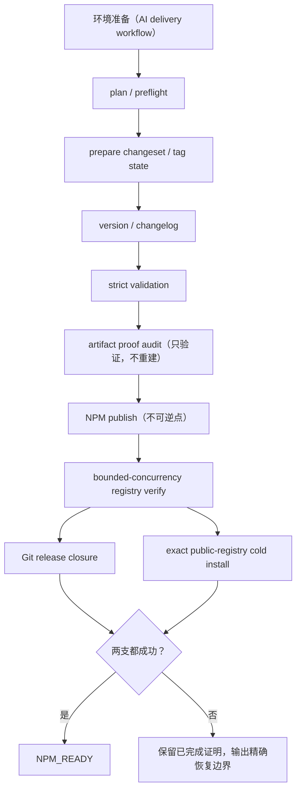

# NextClaw 快速 NPM 发布流水线优化设计

## 文档状态

- 日期：2026-08-14
- 状态：已被[一分钟 NPM 发布设计](./2026-08-14-one-minute-npm-prepared-publish.design.md)取代
- 目标入口：`pnpm release:npm:stable`，并让可复用的 package publish 优化自然惠及 beta / product stable
- 上游语义：[NextClaw 发布命令语义与快速完成点设计](./2026-08-14-nextclaw-release-command-semantics.design.md)
- 既有生命周期：[Stable NPM 一键发布自动化设计](./2026-08-09-stable-npm-release-automation.design.md)
- 本文 owner：NPM package 阶段的性能预算、可观察性、产物复用和 publish 后并行闭环
- 非授权声明：本文不授权真实 publish、push、tag、GitHub Release、runtime 或 desktop 发布

本文不重新定义 `/发布NPM`、`/发布NextClaw正式版` 或 `NPM_READY`。命令范围和完成语义继续以上游设计为唯一 owner；本文只冻结“在不降低发布正确性的前提下，如何更早且更透明地达到既有完成点”。

## 一、结论

采用“**单一串行不可逆主链路 + publish 后两个独立闭环并行 + 全阶段真实计时**”方案：

1. publish 前继续串行完成版本冻结、严格验证和 artifact 审计，不以减少门禁换速度。
2. 严格验证已经构建并留下有效 checkpoint 时，publish preflight 只验证 artifact，不再次机械构建 `@nextclaw/ui` 和 `nextclaw`。
3. NPM publish 后，按有限并发查询本批精确 `pkg@version`；不得因为 registry 暂时不可见而重复 publish。
4. 本批版本全部在 registry 可见后，并行执行 Git release 闭环与精确公网冷安装；两支都成功才输出 `NPM_READY`。
5. 顶层 owner 输出阶段开始、完成、真实耗时、缓存/复用状态和下一阶段；底层长日志不再是用户判断进度的唯一来源。

第一批优化不引入跨发布批次的构建 artifact 缓存，不调整 Changesets 的 publish 顺序，不把冷安装替换成 `npm pack`，也不让 runtime、desktop 或发布材料重新阻塞 NPM。

## 二、问题与当前证据

### 2.1 当前真实计划

2026-08-14 在当前 committed `master` 上运行 NPM stable dry-run，得到：

| 指标 | 当前值 |
| --- | ---: |
| dry-run 自身耗时 | 4.39 秒 |
| 目标版本 | `nextclaw 0.33.2 -> 0.34.0` |
| 版本变化包 | 24 |
| 实际 NPM 上传包 | 6 |
| 验证闭包 | 36 |
| 验证支持包 | 30 |

最近一次真实 stable 批次上传 10 个包，从第一个版本写入 registry 到最后一个版本写入 registry 的时间跨度为 54.6 秒。这说明“发布到 NPM 的网络阶段”本身约一分钟，但用户等待的整条链路还包含严格验证、重复 artifact 准备、registry 轮询、Git 闭环和公网冷安装。

目前尚未用优化后的 `6 publish / 36 validation / 30 support` 链路执行一次真实发布。因此本文把现有 checkpoint、最近 registry 时间和代码路径作为设计证据，不把估算包装成新实现的实测结果。第一轮实现必须先生成可比较的阶段基线。

### 2.2 当前阶段与主要成本

| 当前阶段 | 当前行为 | 估算耗时 | 判断 |
| --- | --- | ---: | --- |
| 环境准备 | 隔离 WIP、同步分支、准备依赖和 NPM 凭据 | 30–120 秒 | 位于确定性发布脚本之外，但必须单独计时 |
| plan / preflight | Changesets 计划、分支、registry、auth、公钥 | 5–15 秒 | 必要，成本低 |
| prepare / version | tag 同步、自动 changeset、README、版本和 changelog | 10–30 秒 | 必要，可在计时后判断轻量重复 |
| strict validation | 30 个支持包 build；6 个发布包 build + tsc + lint | 60–120 秒 | 最大本地成本，不删除正确性门禁 |
| publish preflight | 再次检查 checkpoint，并显式重建 UI 和 nextclaw 后 prepack | 15–40 秒 | 存在已经证明的重复构建 |
| publish / verify | Changesets publish，加逐包 registry 轮询 | 40–90 秒 | 网络占主导；registry 查询当前串行 |
| Git closure | release commit、tag 重定向、push | 5–20 秒 | registry 验证后与冷安装独立 |
| published install | 精确版本全局临时安装并验证 payload | 20–90 秒 | `NPM_READY` 必要门禁，不删除 |

干净且已经同步的工作区，当前链路预计约 3–6 分钟；需要隔离并准备依赖时通常约 4–7 分钟。网络异常时允许更慢，但必须明确显示正在等待哪个外部系统。

### 2.3 当前结构性问题

1. `release-stable.mjs` 只有阶段顺序，没有统一的顶层 duration owner。`release:check` 能显示单包单步骤耗时，但无法回答整条命令在哪一阶段、该阶段已运行多久、后面还剩什么。
2. `release:check:strict` 已按依赖顺序构建发布闭包，之后的 `release:prepare:publish-artifacts` 又显式执行 UI build 和 nextclaw build。
3. `verify-release-published.mjs` 对缺失包逐个调用同步 `npm view`。一次轮询的延迟随 package 数线性增长。
4. registry 验证成功后，Git closure 与精确公网冷安装仍串行执行。
5. 当前 NPM 精确安装使用 `runtime` 阶段标签包裹，日志语义不够准确；本次先修正可观察标签，不扩大公共 recovery 参数迁移范围。
6. 当前主工作区可能包含并行 WIP。环境隔离成本如果没有独立显示，会继续被误认为 NPM publish 本身很慢。

## 三、设计目标与性能预算

### 3.1 正确性目标

- `NPM_READY` 的既有条件不变：精确版本 registry 可见、`latest` 正确、Git release 事实闭合、精确公网冷安装及关键 payload 验证通过。
- publish 前继续保留发布范围、auth、依赖闭包、build、tsc、lint、artifact、workspace manifest 和 lifecycle hook 审计。
- publish 后任何失败都不得自动重复 publish；恢复只执行尚未完成或证明已经失效的阶段。
- 复用只能建立在当前批次、当前源码 fingerprint、当前命令和当前 artifact 证明之上。

### 3.2 体验目标

- 顶层每个阶段都有 `start / done / failed` 事件和真实 duration。
- 超过 60 秒的阶段必须有底层任务进展或顶层 heartbeat，不能让用户只能猜测。
- 版本变化包、实际上传包、验证闭包和支持包继续分开显示。
- 外部等待必须显示对象：NPM auth、registry visibility、Git push 或 public install。
- 在 registry publish 已成功但尚未 `NPM_READY` 时，明确显示“registry 已发布，仍在闭合 Git / 冷安装”，不笼统显示“发布中”。

### 3.3 第一版性能目标

性能目标按阶段预算而不是硬编码 ETA：

| 指标 | 第一版目标 |
| --- | --- |
| 已证明的重复 UI / nextclaw build | 从 validated publish 路径删除 |
| registry 精确版本查询 | 有限并发，默认并发 4 |
| publish 后 Git 与冷安装 | 在 registry 全批次可见后并行 |
| 本地重复工作 | 相同验证门禁下至少减少 20–60 秒；以实现前后同批次 replay 为准 |
| 干净工作区常规 `NPM_READY` | 目标区间 2.5–4.5 分钟；不是不同网络和机器的硬 SLA |
| publish 后失败恢复 | 不重复 version、strict validation 或 publish |

如果第一轮真实数据证明严格验证仍占绝对多数，再单独优化调度关键路径；不能在没有 duration 证据前提高并发或缩小验证闭包。

## 四、候选方案

### 方案 A：只增加日志和计时

优点：风险最低，能立即解释耗时。

缺点：不减少任何真实等待，重复构建、串行 registry 查询和串行 post-publish closure 仍然存在。

结论：必须做，但不能单独作为本次优化结果。

### 方案 B：缩小验证范围或跳过冷安装

优点：表面速度最快。

缺点：NPM publish 不可覆盖；同版本错误 tarball 无法修补。跳过闭包构建、artifact 审计或公网安装，会把“发布成功但用户装不了”的风险推迟到不可逆点之后。

结论：拒绝。

### 方案 C：checkpoint 证明复用 + 有限网络并发 + post-publish DAG

优点：只删除重复工作和无依赖串行等待；保持既有 artifact 与安装门禁；失败点和恢复点更清晰。

缺点：需要补足 artifact proof、顶层阶段状态和并行日志隔离，不能只改一条 package script。

结论：推荐并冻结。

### 方案 D：迁移到远端 CI 完整发布

优点：本地会话看起来更快，可获得统一机器环境。

缺点：只是把等待移到 CI，还引入 secret、workflow 排队、远端恢复和本地 WIP 回流问题；不能直接解决重复构建和不可观察等待。

结论：不进入本次范围。未来如果需要无人值守发布，再单独设计 remote owner。

## 五、统一阶段模型

### 5.1 Owner

- `scripts/release/release-stable.mjs`：stable 顶层阶段、计时、并行 join、失败归因和最终状态的唯一 owner。
- `scripts/release/check-release-batch.mjs`：当前批次 validation closure、source fingerprint、build / tsc / lint checkpoint 的唯一 owner。
- `scripts/release/verify-package-release-artifacts.mjs`：UI、CLI、launcher、公钥和 embedded UI artifact 完整性的唯一 verifier。
- `scripts/release/ensure-pnpm-publish.mjs`：validated publish 是否允许忽略 lifecycle rebuild 的唯一审计 owner。
- `scripts/release/verify-release-published.mjs`：本批精确版本 registry visibility 的唯一 owner。
- `packages/nextclaw/scripts/verify-published-npm-runtime-update.mjs`：公开 registry 安装和 package payload 验证的唯一 owner。

不新增 `ReleaseManager`、`ReleaseService` 或第二个 stable orchestrator。阶段计时先用 `release-stable.mjs` 内的局部 runner；只有 beta 和 stable 后续出现真实共享时才抽出无状态工具。

### 5.2 新主链路



### 5.3 阶段不变量

| 阶段完成事实 | 不变量 |
| --- | --- |
| `strict-validation` | 当前批次所有要求步骤的 command、source fingerprint、version 和状态都匹配 |
| `artifact-audit` | 关键路径存在且 artifact manifest 与 strict build 后记录一致 |
| `publish` | publish 命令已返回；仍不能单独宣称 registry 可用 |
| `registry-verify` | 本批所有精确 `pkg@version` 可见，stable 时 `nextclaw@latest` 指向目标版本 |
| `git-closure` | release commit、package tags 和目标 branch 已推送到约定远端 |
| `published-install` | 同 registry、同 exact version、同 dist integrity 的临时安装与 payload 检查通过 |
| `NPM_READY` | `registry-verify + git-closure + published-install` 三个事实同时成立 |

## 六、阶段计时与反馈合同

### 6.1 顶层事件

顶层 runner 为每个阶段输出紧凑事件：

```text
[release:npm] stage 4/8 strict-validation start packages=6 support=30
[release:npm] stage 4/8 strict-validation progress elapsed=60.0s active=3 completed=27/42
[release:npm] stage 4/8 strict-validation done duration=83.4s cacheHits=0
```

失败时输出：

```text
[release:npm] stage 7a/8 git-closure failed duration=8.2s
[release:npm] registry=published publishedInstall=passed npmReady=no
[release:npm] recovery=<exact command>
```

事件必须使用真实 `performance.now()` 差值；不从 Git commit 时间、NPM timestamp 或相邻日志推导阶段 duration。

### 6.2 Checkpoint 扩展

继续使用当前 batch checkpoint，不新增平行 checkpoint 文件。增加可选 `pipeline` 区域：

```json
{
  "pipeline": {
    "command": "release:npm:stable",
    "targetVersion": "0.34.0",
    "stages": {
      "strict-validation": {
        "status": "passed",
        "startedAt": "...",
        "finishedAt": "...",
        "durationMs": 83400,
        "cacheHits": 0
      }
    }
  }
}
```

`packages` 和 `validationSupport` 仍由 release check owner 写入；顶层 runner 只能写 `pipeline`。读取和写入必须保留未知 section，防止两个 owner 互相覆盖。

preflight 发生在 batch checkpoint 产生之前，可以先保存在内存中，batch identity 冻结后一次性回填。checkpoint 只保留命令、版本、registry URL、dist integrity、状态和时间，不保存 token、`.npmrc` 内容或其它 secret。

### 6.3 ETA 规则

第一版不伪造精确 ETA。只显示：

- 当前阶段 elapsed；
- 当前包/步骤完成量；
- cache / reuse 状态；
- 后续阶段列表；
- registry 重试次数和下一次等待时间。

积累至少三次同类本地发布记录后，才允许显示明确标注为“历史中位数”的参考时间。不同网络、机器和 package 规模不能共享一个看似精确的静态 ETA。

## 七、Validated artifact 复用合同

### 7.1 当前重复点

`release:check:strict` 已构建当前 validation closure，依赖调度保证 `@nextclaw/ui` 在 `nextclaw` 之前完成。随后 `release:prepare:publish-artifacts` 又执行：

```text
pnpm -C packages/nextclaw-ui build
pnpm -C packages/nextclaw build
pnpm -C packages/nextclaw-ui prepack
pnpm -C packages/nextclaw prepack
```

其中两个 build 是同一输入的重复工作；两个 prepack 实际只调用 artifact verifier，可以保留。

### 7.2 推荐合同

validated publish 的 artifact 证明同时要求：

1. checkpoint batch identity 与当前 package name/version 集合一致；
2. 发布包 build、tsc、lint 和支持包 build 满足当前 validation profile；
3. 每一步 source fingerprint 与当前源码重新计算结果一致；
4. build command 与 checkpoint command 一致；
5. 当前 publish batch 中声明了 artifact verifier 的包逐个通过验证；对当前批次而言包括 UI `dist`、nextclaw `dist`、launcher、app entry、public key、embedded UI 等关键路径；
6. strict build 后记录的 artifact manifest 与 publish 前一致；
7. 所有被 `npm_config_ignore_scripts=true` 忽略的 lifecycle hook 都在 allowlist 内。

artifact manifest 对被发布目录中实际进入 tarball 的关键文件记录相对路径、size 和 SHA-256。它证明“build 后的产物没有被另一个任务改写”，但不替代 source fingerprint 或 tarball contract。

### 7.3 失配行为

artifact proof 缺失、过期或失配时必须 fail fast，并明确要求用 reset 或精确失效 affected build checkpoint 后重新运行 strict validation。仅仅重跑会命中旧 build cache，不能修复缺失 artifact；第一版没有 package 级 reset 时，恢复命令使用 `NEXTCLAW_RELEASE_CHECK_RESET=1 pnpm release:check:strict`。不得在 publish preflight 内静默重建后继续发布，因为这会绕过原先 build / tsc / lint 同输入证明，也会掩盖隔离 worktree 中的并发写入。

这是确定性失效，不提供扫描其它目录、借用主工作区 `dist`、降级到旧 artifact 或忽略 verifier 的 fallback。

### 7.4 删除点

- 从 validated publish 主链路删除第二次 UI build。
- 从 validated publish 主链路删除第二次 nextclaw build。
- 保留并增强 artifact verifier，只检查当前 publish batch 中适用的包；纯 package 批次不再无条件检查 UI / nextclaw。
- 保留 lifecycle hook fail-closed 审计。
- `release:check` 命中 checkpoint 时不得仅凭状态跳过 artifact audit。

## 八、Registry 有限并发设计

### 8.1 查询模型

每次 attempt 对当前 missing package 集合执行有限并发查询，默认并发 4；完成后统一生成下一次 missing 集合。并发上限允许通过现有 release 专用环境变量或 CLI 参数显式覆盖，但默认值由 verifier owner 决定。

```text
attempt 1: 6 missing -> 并发查询 -> 2 missing
等待 5 秒
attempt 2: 2 missing -> 并发查询 -> 0 missing
registry-verify passed
```

并发只用于只读 `npm view <pkg>@<version>`，不改变 Changesets publish 的包顺序或并发策略。

### 8.2 重试与错误

- 继续使用有上限的 attempts 和 delay；不无限重试。
- 404 / 暂不可见进入下一轮；auth、registry 配置错误或结构解析错误应尽快 fail fast。
- 每轮只查询仍 missing 的版本。
- 任何 attempt 都不得调用 publish。
- stable target 的 exact version 和 `latest` 检查复用 registry verification 结果；避免同阶段重复查询 `nextclaw`。

### 8.3 结果模型

verifier 返回或输出可供顶层 owner消费的结构化摘要：

```json
{
  "registry": "https://registry.npmjs.org/",
  "attempts": 2,
  "durationMs": 11800,
  "published": ["@nextclaw/ui@...", "nextclaw@..."],
  "missing": []
}
```

人类日志与结构化摘要来自同一结果，不能分别实现两套判断。

## 九、Publish 后并行闭环

### 9.1 并行起点

只有本批所有精确版本和 stable dist-tag 通过 registry verification 后，才启动两个分支：

- A：release commit、package tag 重定向、push branch 和 tags；
- B：从公开 registry 精确安装目标 `nextclaw@<version>` 并验证 payload。

不在“只看到 nextclaw 版本、依赖版本尚未全部可见”时抢跑安装，避免把 registry propagation 变成不稳定的 install 重试。

### 9.2 Join 语义

两个分支使用 all-settled 语义收集结果，不能因为一支先失败就丢失另一支已经完成的事实：

| Git | 冷安装 | 结论 |
| --- | --- | --- |
| 成功 | 成功 | 输出 `NPM_READY` |
| 失败 | 成功 | registry 与安装已成立；Git 未闭合，不输出 `NPM_READY` |
| 成功 | 失败 | registry 与 Git 已成立；安装未通过，不输出 `NPM_READY` |
| 失败 | 失败 | registry 已发布；分别报告两个失败，不重复 publish |

并行分支各自使用阶段前缀或独立临时日志，避免 stdout 交错后无法定位错误。顶层只汇总状态和错误附近有限内容。

### 9.3 安装证明复用

冷安装成功后，checkpoint 记录 registry URL、exact version、NPM 返回的 `dist.integrity`、验证项、Node major、完成时间。恢复 Git closure 时，若这些事实和 registry 反查仍一致，可以复用已经通过的安装证明。

以下任一变化都必须重跑安装：

- registry URL 改变；
- exact version 或 `dist.integrity` 改变；
- package payload verifier 合同改变；
- 用户显式要求重新验证；
- checkpoint 没有完整成功证明。

NPM 精确版本通常不可覆盖，但恢复时仍重新进行轻量 registry identity 检查，不能只信本地 checkpoint。

## 十、Preflight 与验证调度的第二阶段优化

第一版先用顶层 duration 证明以下成本，再决定是否实现：

### 10.1 重复 metadata preflight

`release:version` 与 `release:publish:preflight` 之间存在 README、release group、health 等重复调用。只有当真实数据证明这部分稳定超过 10 秒，才把它们重排为：

```text
prepare metadata
-> changeset version
-> post-version metadata guard
-> strict validation
-> artifact audit
-> publish
```

不得仅为省几秒引入 `--prepared`、环境变量暗号或两套 publish owner。若实施，应由现有 package publish 主链路一次性收敛所有调用方。

### 10.2 Validation 并发

当前 build、tsc、lint 已有独立并发池。第一轮计时后只优化关键路径：

- build pool 是否受 CPU、内存还是依赖拓扑限制；
- lint 串行是否成为 release package 的尾部瓶颈；
- support package build 是否存在可以删除的非运行时 devDependency 边；
- 是否有单包命令长期占据 critical path。

不允许仅按 CPU 核心数盲目提高并发。OOM、交换内存和日志争用会让总耗时更差，也降低可预测性。

### 10.3 跨批次 cache

第一版明确不做。当前 checkpoint 只能证明某次 build 通过，不能在新的隔离 worktree 中凭空恢复 `dist`。未来只有在具备“内容寻址 artifact 存储 + manifest 校验 + 精确恢复”后，才能设计跨批次 cache；禁止把“历史 passed”当成本次产物存在的证明。

## 十一、环境准备边界

隔离 worktree、目标 commit、分支同步和依赖准备仍由 delivery / isolated-worktree 流程拥有，不塞进 `release-stable.mjs`：

- 发布脚本只接受已经冻结且干净的工作区。
- 不自动 stash、reset、checkout 或提交用户 WIP。
- 不从主工作区借用未证明的 `dist`。
- 可以复用 pnpm 全局 store，但 release worktree 自己的依赖图必须与 lockfile 一致。
- AI 对用户报告总耗时时，必须把 `environment-setup` 与确定性 NPM pipeline 分开显示。

当前本地 `master` 比 `origin/master` 领先且主工作区有并行 WIP 时，正式发布必须先按既有隔离流程处理；本设计不会为了节省几十秒削弱这条边界。

## 十二、失败与恢复

| 失败阶段 | 已成立事实 | 恢复原则 |
| --- | --- | --- |
| preflight / prepare / version | 未 publish | 修复后重跑；不得伪造 checkpoint |
| strict validation / artifact audit | 未 publish | 修复后重跑严格验证；artifact 失配不静默重建 |
| publish 返回异常 | 结果未知 | 先执行精确 registry verify，再决定是否恢复；不得直接重发 |
| registry verify 超时 | publish 可能已成功 | 只恢复 registry verify |
| Git closure | registry 已确认；安装可能已完成 | 只闭合 Git，复用仍有效的安装证明 |
| published install | registry 与 Git 可能已完成 | 只恢复精确安装和 payload 验证 |

公共 `--resume-from` 参数的重命名不进入第一版，避免把性能优化扩大成 recovery CLI 迁移。内部日志使用准确的 `published-install` 标签，现有参数继续由 `release-stable.utils.mjs` 解释；未来若要新增 `--resume-from npm-install`，单独修改命令合同、文档和历史 recovery 兼容策略。

## 十三、预计代码影响面

第一版优先修改现有 owner，不新增业务抽象：

- `scripts/release/release-stable.mjs`
  - 顶层阶段计时与状态汇总；
  - registry 验证后的 Git / published-install 并行 join；
  - 正确区分 registry published 与 `NPM_READY`。
- `scripts/release/release-stable.utils.mjs`
  - 纯函数格式化阶段计划、完成摘要和恢复摘要；
  - 不执行外部副作用。
- `scripts/release/release-checkpoints.mjs`
  - 保留并读写可选 `pipeline` 与 artifact proof，禁止丢弃未知 section。
- `scripts/release/verify-package-release-artifacts.mjs`
  - 根据 checkpoint 只选择当前 publish batch 中适用的 verifier；
  - 生成并验证关键 artifact manifest；
  - 继续 fail fast。
- `scripts/release/ensure-pnpm-publish.mjs`
  - 校验 validation profile、source fingerprint、artifact proof 和 lifecycle allowlist。
- `scripts/release/verify-release-published.mjs`
  - 有限并发查询、结构化结果和准确 retry 分类。
- `package.json`
  - `release:prepare:publish-artifacts` 删除重复 build，只保留 proof audit；
  - 不新增第二套 stable 入口。

如果顶层计时在 stable 和 beta 之间出现第二个真实调用方，再考虑抽出一个无状态 stage timing utility；第一版不为未来可能性提前加文件。

## 十四、最小充分验证

### 14.1 单元与合同测试

- 阶段 runner：success、failure、并行 all-settled、duration、完成摘要。
- checkpoint：旧格式可读；新增 `pipeline` 不丢失 `packages` / `validationSupport`；release check 回写不丢失 pipeline。
- artifact proof：当前输入通过；源码变更、command 变更、关键文件缺失、artifact hash 改变均失败。
- lifecycle audit：合法 verifier hook 通过；自定义 publish hook 继续 fail closed。
- registry verifier：并发上限、missing-only retry、404 重试、auth fail fast、attempt exhaustion。
- post-publish join：四种 Git / install 成败组合都得到正确状态，只有双成功输出 `NPM_READY`。

### 14.2 定向集成验证

1. 在不 publish 的 fixture 中跑完整 strict validation，再执行 artifact audit，证明不会再次触发 UI / nextclaw build。
2. 删除或修改一个关键 artifact，证明 validated publish 在不可逆点前停止。
3. 用假 registry runner 验证 6 个包有限并发、只重试 missing 集合且不会调用 publish。
4. 用假 Git / install runner 证明两支并行且失败事实都能被收集。
5. stable dry-run 继续输出 `24 / 6 / 36 / 30` 四类数量，且明确排除 runtime / desktop / materials。

### 14.3 性能验收

用同一 commit、同一 lockfile、同一机器执行实现前后 replay，分别记录：

- environment setup；
- plan / prepare / version；
- strict validation；
- artifact audit；
- publish（真实发布只记录一次，不为 benchmark 重发）；
- registry verify；
- Git closure；
- published install；
- total to registry-published；
- total to `NPM_READY`。

真实 publish 不可重复，因此本地性能对比以 dry-run、fixture、checkpoint replay 和一次真实下一版本发布组合完成。不能为了得到漂亮数字重复发布版本。

触达 TypeScript 或脚本运行链路时，按仓库验证硬边界运行匹配的语法/类型检查、定向测试、targeted lint 和 maintainability guard。

## 十五、非目标

- 不改变 `/发布NPM`、`/发布NPM测试版`、`/发布NextClaw正式版` 的用户语义。
- 不发布 `0.34.0` 或任何真实版本。
- 不触发 runtime、desktop、docs、website 或 X。
- 不删除 build、tsc、lint、artifact audit、registry exact verify 或公网冷安装。
- 不用 raw `npm publish`，不绕过 `pnpm` 对 `workspace:*` 的正确转换。
- 不自动处理、提交或覆盖当前并行 WIP。
- 不在第一版引入远端 CI release owner、跨批次 artifact cache 或自适应并发系统。
- 不把静态估算当作真实 ETA；最终结论只使用实际阶段时间。

## 十六、方案自审

- [x] 用户价值：减少真实等待，同时让 AI 能清楚说明每一分钟在做什么。
- [x] 单一 owner：stable 编排、release check、artifact、registry 和 published install 各自保持唯一 owner。
- [x] 删除优先：先删除重复 build 和无依赖串行等待，不先新增 manager/service。
- [x] 不可逆安全：publish 前门禁没有减少，publish 后恢复不重复 publish。
- [x] 可预测 fallback：proof 失配 fail fast，不借用主工作区产物，不静默重建后继续。
- [x] 并行安全：只并行 registry 验证后的 Git closure 与精确冷安装，两者没有共享写入 owner。
- [x] 完成点真实：只有 registry、Git、安装三项成立才输出 `NPM_READY`。
- [x] 范围收敛：第一版不修改 runtime、desktop、发布材料和公共 recovery 参数。
- [x] 可验证：每项性能收益都有对应 stage duration 和确定性合同测试。
