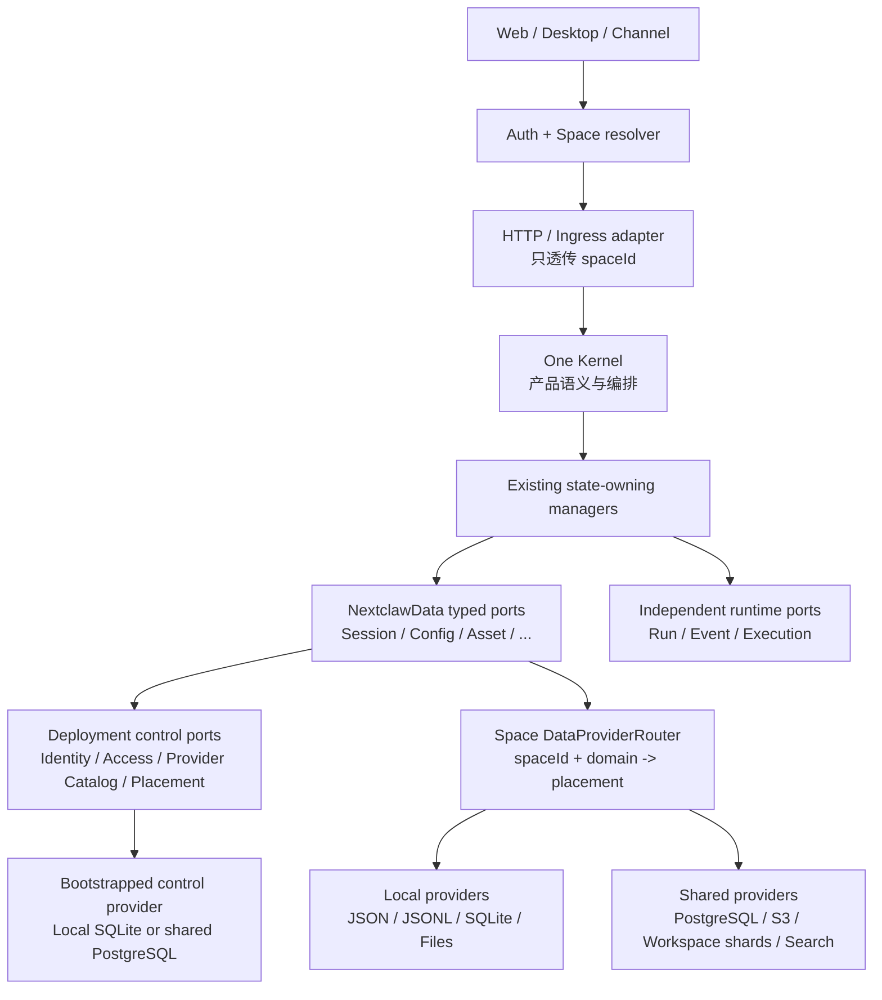
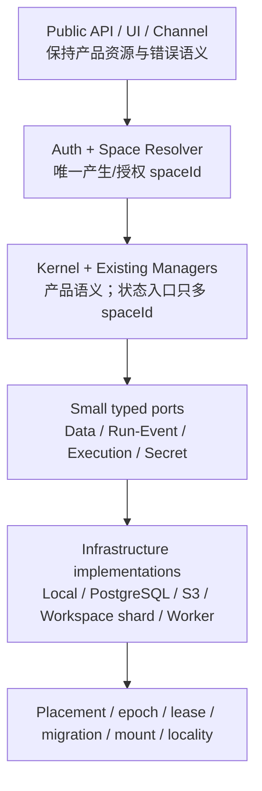
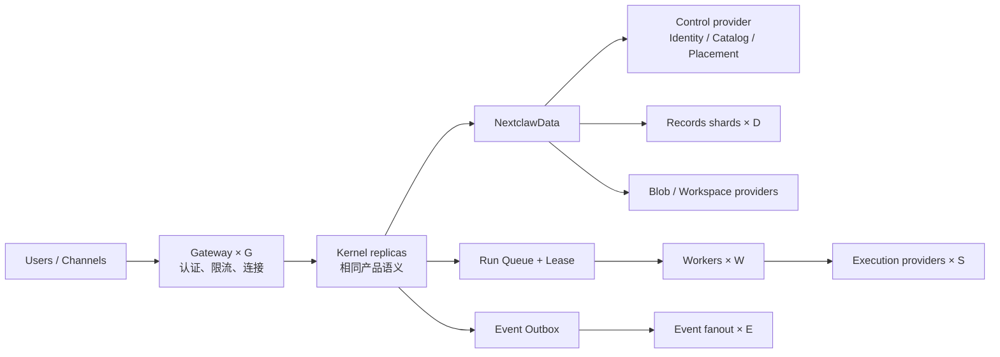

# NextClaw 多用户可扩展运行时初版设计

> 状态：Draft v0.24
> 日期：2026-08-18
> 角色：跨部署形态的产品与运行时架构设计
> 上游功能：[NextClaw 多用户功能设计](./2026-08-16-multi-user-functional.design.md)
> 当前阶段：架构初版已形成，已进入分批实施计划与持续 Review

## 1. 文档目的与维护方式

本文承接[多用户功能设计](./2026-08-16-multi-user-functional.design.md)，回答一个同时涉及隔离、安全、性能和成本的长期技术问题：

> NextClaw 能否使用同一套产品语义和核心代码，既运行在 1 核 1 GiB、2 核 2 GiB 一类低配 VPS 上，又能通过集群部署支撑百万级注册用户，并保证不同用户的数据和执行权限相互隔离？

本文不是一次性结论，也不是具体开发排期。后续每轮 Review 应直接修订相关章节，使正文始终表达当前统一判断；重要变化追加到文末决策记录，不通过在末尾堆叠相互冲突的“补充说明”维护。

本文负责冻结架构边界；默认 Space、身份、文本主链和 Workspace 的基础开发批次见[同构多用户运行时基础批次实施计划](../plans/2026-08-16-multi-user-minimal-runtime.plan.md)，其余 feature owner 与多节点演进见[多用户可扩展运行时路线图](../plans/2026-08-16-multi-user-scalable-runtime.plan.md)。基础批次不单独构成多用户产品发布。

## 2. 产品目标

NextClaw 的上位定位仍然是“长期个人智能搭档”和 AI 时代的个人操作层。多用户能力不是把 NextClaw 改造成一个共享聊天后台，而是让一套部署可以承载多个相互独立的个人 NextClaw。

目标不是维护 Embedded 与 Cluster 两套架构，而是形成一套可以从 1 个节点连续展开到 N 个节点的 NextClaw 架构：

- 普通用户在低配 VPS、NAS、家用服务器或本机上运行时，部署只有 1 个 NextClaw Node。
- 平台承载大量用户时，仍然运行相同 NextClaw Node，只是增加节点；现有状态、运行和事件 owner 在内部替换为可水平扩展的 provider，上层只传递必要的 `spaceId`。

单节点不是 Lite 版、特殊架构或兼容路径；多节点也不是第二套云端产品。两者只是同一架构在不同节点数量、角色放置和基础设施容量下的部署拓扑。

### 2.1 用户可观察目标

- 单用户安装不需要 PostgreSQL、Redis、Kafka 或 Kubernetes 才能启动。
- 单用户安装升级后不提高最低 CPU/内存配置要求；可扩展能力没有配置时不产生常驻资源税。
- 单节点与多节点使用相同的会话、记忆、Agent、App、Cron、权限、队列和恢复语义。
- 部署从一个节点扩展到多个节点时，不需要更换产品模型或搬入另一套业务系统。
- 空闲用户主要产生持久化存储成本，不常驻完整 Kernel、Worker 或执行沙箱。
- 活跃任务根据并发量获得计算资源，不能由注册用户总量决定常驻资源数量。
- 用户 A 无法通过猜测 ID、资产 URL、事件订阅、后台任务、工具执行或文件路径访问用户 B 的数据。
- 低配部署明确展示能力和资源边界，不通过随机 OOM、静默降级或无限排队表达限制。

### 2.2 成功边界

本设计所说的“百万用户”首先指百万级注册用户和可横向扩展的活跃用户容量，不等同于百万个 Agent Run 同时执行。并发运行目标必须在后续容量 Review 中根据 DAU、并发率、模型配额和成本预算单独冻结。

本设计把 1 核 1 GiB 视为需要验证的最低目标环境，不声称当前版本已经满足该承诺。已有证据只证明 ARM64 Linux、2 CPU / 2 GiB 限制、空配置场景下按需扩展改造后的三轮平均 working set 约为 164.94 MiB；真实 AMD64 1 GiB VPS 的完整功能峰值仍未验证，详见 [NextClaw 轻量常驻与 VPS 宣传体系设计](./2026-08-09-lightweight-vps-messaging.design.md)。

## 3. 核心概念

### 3.1 User

`User` 是登录和审计主体，拥有稳定的 `userId`。User 本身不是所有产品数据的直接隔离 owner。

### 3.2 Personal Space

`PersonalSpace` 是个人数据、配置、运行状态和权限的隔离 owner，拥有稳定的 `spaceId`。第一版可以保持一个 User 对应一个 Personal Space，但底层不能把两者永久合并为同一概念。

使用 Space 而不是直接给所有资源挂 `userId`，是为了保留以下真实演进空间：

- 一个用户将来可以拥有个人与工作等不同空间；
- 多人协作只发生在显式共享空间，不自动暴露个人记忆；
- 空间可以独立导出、迁移、删除和恢复；
- 平台身份、空间成员关系和产品数据生命周期可以分离。

现有 `workspace` 表示 Agent 的文件工作目录或项目上下文，不承担账号隔离语义，不能与 `PersonalSpace` 混用。

### 3.3 单一 Kernel

一个 NextClaw deployment 只运行一个逻辑 `NextclawKernel`。Kernel 是产品语义和编排 owner，不按用户创建、不绑定某个 Space，也不增加 `withScope()`、scoped Kernel 或 per-user Manager 树。

单一 Kernel 可以同时服务多个 Space；会话、配置、记忆和运行状态的隔离由其下方真正持有这些状态的 owner 完成。这里的“一个 Kernel”是逻辑架构约束：多进程或多节点部署可以有多个 Kernel 进程副本，但它们实现同一套无节点感知的 Kernel 语义，不能形成每用户一个 Kernel 的产品模型。

### 3.4 UserId 与 SpaceId

本设计只新增一个数据隔离标识：`spaceId`。现有身份继续使用 `userId`；二者是独立语义，不是 Kernel identifier，也不需要被包装成通用 identifiers 对象：

```ts
type UserId = string;

declare const spaceIdBrand: unique symbol;

type SpaceId = string & {
  readonly [spaceIdBrand]: "SpaceId";
};
```

`userId` 回答“谁在操作”，继续属于认证、成员关系和审计；`spaceId` 回答“操作哪一份个人数据”，属于状态、异步任务和执行资源的隔离边界。`SpaceId` 的 brand 只提供 TypeScript 编译期区分，运行时仍是普通字符串，不创建对象、Context 或额外内存；外部字符串必须经过格式解析和 Access 授权后才能进入状态主链。`requestId`、`runId`、`sessionId` 继续属于各自资源或协议。它们没有必要为了形式统一被装进一个跨层对象。

| 标识 | 权威 owner | 允许进入的主链 | 禁止用途 |
| --- | --- | --- | --- |
| `userId` | Identity / Access | 登录、Access Session、Membership、Authorization、Audit | 不能作为 Session、Config、Memory、Workspace、Cache 或 Queue 的数据分区键 |
| `spaceId` | Space / Membership resolution | 状态 Manager、Store、Cache、Run、Event、Cron、Workspace、Execution owner | 不能单独证明当前 User 已获授权，不能由客户端值直接决定归属 |
| `userId + spaceId` | Authorization / Audit | 校验 actor 对 target Space 的访问，并记录行为归因 | 不能下沉成 Store 的 `isAdmin`、通配 Space 或 owner bypass |

`spaceId` 的唯一职责是回答：这次状态访问、异步任务或执行资源属于哪个 Personal Space。客户端提交的 `spaceId` 不能直接作为授权依据；服务端必须从已认证主体和成员关系解析或校验它。

第一版可以保持一个 User 对应一个默认 Space，但持久 schema、缓存键、Manager 方法和迁移合同不得依赖 `userId === spaceId`，也不得使用 `userId` 替代 `spaceId`。未来增加多 Space、共享 Space、所有权转移或 Service Account 时，只改变 Membership 与授权，不改写个人产品数据的 owner identity。

### 3.5 复用现有载体

同步请求复用现有载体：HTTP middleware 把已解析的 `spaceId` 放入请求上下文；NCP、Channel、App 等进入 Kernel 的调用把它放入现有 `IngressContext`。空间级 handler 在第一个状态边界把它收窄为必填 `SpaceId`：

```ts
type IngressContext = {
  source: string;
  token?: string | null;
  spaceId?: SpaceId;
};

const spaceId = requireSpaceId(context);
await kernel.sessionManager.getSession(spaceId, sessionId);
```

`IngressContext.spaceId` 在总类型上允许缺失，是因为健康检查、宿主控制和部分 deployment 级消息不属于任何 Space；一旦访问个人数据，缺失 `spaceId` 必须失败，不能回退到默认目录。

脱离当前请求继续运行的 Run、Event、Cron、Queue item 和恢复记录必须把 `spaceId` 写进自身既有 envelope 或 record。不能依赖 `AsyncLocalStorage`、线程局部变量或“最近一次登录用户”维持归属。

跨时间 record 的归属合同是：`spaceId` 对 Space 级工作必填，触发者只用于审计且可以为空；审计记录则区分 actor 与 target。以下类型只表达字段要求，不要求新增一个跨模块通用 wrapper：

```ts
type SpaceAsyncAttribution = {
  spaceId: SpaceId;
  triggeredByUserId?: UserId;
};

type AuditAttribution = {
  actorUserId: UserId;
  targetSpaceId?: SpaceId; // Deployment 级操作可以没有目标 Space
};
```

Cron、系统恢复和 maintenance job 可能没有当前登录 User，但只要处理个人状态就不能缺少 `spaceId`。相反，登录失败、用户管理和 Deployment package 操作可以有 `userId` 或 system actor，却不应伪造一个 Space。异步执行授权必须持久化完成执行所需的能力快照或可重新校验引用，不能把可选 `triggeredByUserId` 当成继续访问数据的依据。

### 3.6 Execution Boundary

Shell、文件、MCP stdio、Service App、第三方 Extension、浏览器和其它宿主能力需要执行边界。执行 owner 可以使用 `spaceId` 选择当前 Space 的工作目录、数据卷和短期凭据，但具体工具实现接收已经解析好的目录、配置和权限，不需要普遍感知 `spaceId`。

### 3.7 Deployment Topology

NextClaw 只有一种逻辑部署模型：

```ts
type NextclawDeployment = {
  nodes: Node[];    // 1..N
  spaces: Space[];  // 1..M
};
```

每个 Node 运行同一 NextClaw runtime。标准请求始终沿同一条 `Gateway -> request/ingress context -> Kernel -> existing managers -> state/runtime providers` 主链运行。一个节点时现有 owner 使用本地 provider；多个节点时 owner 内部使用可水平扩展 provider，上层调用和业务语义不变。

本设计不引入决定产品行为的 `embedded` / `cluster` 模式开关。安装器可以提供单机或规模化的配置预设，基础设施可以选择本地或分布式 provider，但这些只改变角色放置和端口实现，不改变领域模型与业务分支。

单用户部署只是 `nodes = 1`、`spaces = 1` 的最小拓扑，不维护第二套 legacy 产品语义。

## 4. 当前架构事实与缺口

### 4.1 可复用基础

- `NextclawKernelOptions` 已支持 `homeDir` 和 `configPath`。
- Session、Cron、Preference、Project、Inbox 和 App Home 已有部分可注入存储路径。
- NCP Agent backend 已开始区分通用 backend、持久化 Store 和 live runtime，参见 [NCP Agent Backend Storage Decoupling](./ncp-agent-backend-storage-decoupling.md)。
- Extension 已支持按真实需求激活进程，证明“发现能力”与“常驻执行”可以分离，参见 [NextClaw 扩展运行时按需激活设计](./2026-08-09-on-demand-extension-runtime-lifecycle.design.md)。
- Session Run 已有排队和运行状态语义，可以作为后续公平调度的基础，参见 [Session Run Queue 设计](./2026-07-22-session-run-queue.design.md)。

### 4.2 当前不能直接宣称多用户隔离的原因

- Service Gateway 当前创建一个 `NextclawKernel`，请求共享同一组 Manager、EventBus、MessageBus 和运行状态。
- `AccessRole` 当前只有 `admin`，内置 UI Auth 是单管理员实例保护，不是多用户身份与成员系统。
- UI Event Stream principal 当前没有 `userId` 或 `spaceId` scope。
- Session Search database、Asset root、LLM Usage、默认 Workspace 和部分 Extension 发现仍读取全局数据目录或进程环境。
- `tools.restrictToWorkspace` 当前默认值为 `false`；即使数据库查询加上 `spaceId`，Shell 和文件能力仍可能跨空间访问宿主数据。
- 当前大量 Manager 在构造时绑定唯一 Config、Workspace、Provider、Channel 和 App 状态，不能仅通过给 Session 表增加 `space_id` 变成安全的共享 Kernel。

因此，现有 `homeDir` 是有价值的迁移缝，不是完整的多用户安全证明。

### 4.3 当前端到端链路

当前主链已经能说明 `spaceId` 应进入哪里：

1. [`ServiceGatewayManager`](../../packages/nextclaw-service/src/managers/service-gateway.manager.ts) 创建一个 `NextclawKernel`，并把同一 Kernel 的 Manager、Ingress 和 EventBus 交给 Server。
2. [`createUiRouter`](../../packages/nextclaw-server/src/app/router.ts) 在 HTTP middleware 中只判断是否认证；资源 Controller 随后直接调用 Kernel 下的现有 Manager，Agent Run 则进入 `kernel.ingress.handle(...)`。
3. [`IngressContext`](../../packages/nextclaw-shared/src/services/ingress.service.ts) 当前只有 `source` 和 `token`，这是同步 ingress 增加 `spaceId` 的自然载体，不需要再发明 Kernel envelope。
4. [`NextclawKernel`](../../packages/nextclaw-kernel/src/app/nextclaw-kernel.ts) 在构造时为 Session、Journal、Search、Asset、Cron、Project、Preference、Inbox、App 和 Workspace 绑定唯一实例或路径。
5. [`SessionRunManager`](../../packages/nextclaw-kernel/src/managers/session-run.manager.ts) 和 [`AgentRuntimeManager`](../../packages/nextclaw-kernel/src/managers/agent-runtime.manager.ts) 的 live Map 当前只按 Session/Runtime key 建索引；[`EventBus`](../../packages/nextclaw-shared/src/services/event-bus.service.ts) 的 envelope 也没有 Space 归属。
6. Cron 通过 AgentRunClient 重新进入 ingress，但 Job record 当前没有 `spaceId`；因此异步链路不能只依赖 HTTP request context。

这条链路证明：入口需要产生和透传 `spaceId`，Kernel 仍保持单一，真正的隔离工作落在现有状态 Manager、Store、live cache 和异步 envelope。

### 4.4 最小改造切入点

首轮实现不拆解整个 `NextclawKernel`，不重写全部 Manager，也不立即引入分布式 Worker、Queue 或数据库。最小主链是：

```text
Request
  -> authenticate
  -> resolve and attach spaceId
  -> one Kernel
  -> existing state-owning managers
  -> typed NextclawData port
  -> DataProviderRouter
  -> local or shared data provider
```

第一条必须建立的扩展缝不是新的 Kernel 对象，而是一层统一、轻量、有类型的数据抽象：

- 状态级 Manager 方法只在读写个人状态时接收 `spaceId`；
- Manager 只依赖自己需要的 `SessionRepository`、`SpaceConfigRepository` 等 typed port，不接触 provider 类型、物理位置或整个数据端口集合；
- `NextclawData` 只组合这些 typed port，统一数据边界和装配，不拥有 Session、Config、Skill、Asset 等业务语义，也不提供万能 CRUD；
- bootstrap control provider 负责 Identity、Access、Provider Catalog 和 Placement；`DataProviderRouter` 只为 Space data 根据 `spaceId + dataDomain` 解析 provider 和 placement，两者都留在统一数据层内部；
- Local provider 通过 adapter 复用当前 JSON、JSONL、SQLite 和文件 Store；PostgreSQL、S3-compatible object storage 等共享 provider 实现相同逻辑合同；
- Store、缓存和持久 record 使用 `(spaceId, resourceId)` 作为归属，不再只使用 `sessionId` 或 `runId`；
- 水平扩展和数据迁移通过替换或切换 provider 完成，不在 Kernel、Manager 或 API 中增加单机/集群分支；
- 真正全局且只读的程序、内置能力和静态 catalog 保持共享，不机械空间化。

“状态”不仅指数据库持久化，还包括会影响用户可观察结果的缓存、事件、运行状态、Cron、Search index、Asset 和授权。只隔离 Session 表而保留全局缓存或事件，不算完成数据面隔离。

### 4.5 最小改动与逐能力解锁

完整 owner inventory 是多用户发布边界，但不要求在一个 changeset 中同时重写所有 feature。实现可以按 Identity、Session、Config、Search、Asset、Cron、Channel、App 等 owner 逐项迁移和验证；尚未完成的阶段只是开发状态，不能对外形成“创建第二个用户后关闭一批功能”的产品模式。

所有部署从首次启动就创建默认管理员 User 和 Personal Space。旧 Config、Session、Workspace、Search、Asset、Project、Cron、Channel、App Data 等个人数据全部归管理员 Space；新增用户只增加一个空 Space。系统不引入 `multiUserActivatedAt`、激活流程、用户数量分支或为创建用户而重启。

最小改动来自“先统一边界、后逐 owner 接入”，而不是重写现有存储：基础批次先定义 `NextclawData` 的最小 typed ports，并用 `LocalDataProvider` 委托当前 Store 和 SkillsLoader；管理员 Space 绑定迁移后的原数据，新 Space 懒加载自己的空数据。后续每迁移一个 feature，只增加该 feature 的 typed port 和 Local adapter，不新增 per-Space Manager tree，也不为了统一外观改写成熟文件格式。

PostgreSQL、S3、Queue、Lease 和 Outbox 不直接进入 Manager。PostgreSQL 和 S3 是数据 provider；Queue、Lease 和 Event owner 仍是独立运行时端口。只有数据 provider 共享 `NextclawData`、`DataProviderRouter`、placement 与迁移合同，避免把“所有可扩展能力”重新装进一个 RuntimeFabric 大对象。

某个 feature 如果仍使用全局可变 Store、无 Space cache 或无 owner 异步 record，就不能进入多用户发布范围；它必须先完成 owner 改造，而不是通过 runtime activation gate 掩盖。这样会增加必要的 feature 改造量，但不会增加第二套架构。

Shell、浏览器、stdio MCP、Extension process、Service App action 和任意宿主目录属于执行授权，不按用户数量统一开关，也不形成单 owner/多用户或 trusted-host/sandboxed 模式。旧管理员 Space 可以迁移现有 `process.execute` 和显式 host mount 范围；新 Space 默认只有 `workspace.files`。elevation 不改变目标 Space 的 capability、mount 或 Execution Plan。

全局 Skill 第一版只需要把现有 `global` scope 明确绑定到 Deployment skills root，并让 workspace/project discovery 使用目标 Space 路径；管理员通过受管目录或 CLI 全局安装一次，用户安装到自己的 Space。required/available/blocked、锁定配置、共享 Credential Broker、版本 pin 和灰度升级属于后续能力，不作为安全多用户的前置重构。

管理员第一版通过 CLI/API 显式进入目标 Space，不要求同时建设完整管理 UI；认证 session 内的限时 elevation 只表达“管理员对该目标 Space 的短期完整管理权”，暂不新增独立 grant 体系或细粒度 capability matrix。

这形成明确取舍：保持同构和现有功能，就必须把对应 feature 的 owner 改造纳入多用户发布；“最小改动”只能通过复用现有 owner、Store 和数据格式实现，不能通过模式开关、功能降级或共享 fallback 实现。

## 5. 设计不变量

1. **只有一套架构**：所有规模共享相同组件图、领域模型、请求主链、API 语义、Journal 和恢复合同。
2. **节点数量连续变化**：最小拓扑只有一个全角色节点；规模增长时增加节点并重新放置角色，不引入第二套业务架构。
3. **空间是隔离 owner**：所有用户数据、事件、缓存、后台任务和资产访问都归属明确的 `spaceId`。
4. **只有一个 Kernel**：不为 User 或 Space 创建 Kernel、Kernel wrapper 或完整 Manager 树。
5. **SpaceId 在状态边界不可选**：访问空间级状态时没有 `spaceId` 必须失败，不能退回全局默认值。
6. **最小感知面**：只有身份解析、入口透传、状态 owner、异步归属和执行隔离边界感知 `spaceId`；纯逻辑和静态能力不感知。
7. **执行权限有系统边界**：不互信用户的危险工具不能只依赖应用层路径检查。
8. **按活跃并发扩容**：计算资源随活跃 Run、Token 和常驻 Channel 需求增长，不随注册用户数线性增长。
9. **同一会话顺序唯一**：一个 Session 同时最多有一个修改其标准时间线的 active run；不同 Session 可按空间配额并行。
10. **无隐式双写**：扩容或迁移期间明确最终 Store owner、数据 placement 和切流点，不长期保留 local/distributed 或 legacy/new 两套事实来源。
11. **低配限制可观察**：资源不足、配额用尽、功能不可用和排队必须显式反馈。
12. **管理员有全局授权但没有环境式绕过**：Deployment Admin 可以访问和操作任意 Space，但必须显式选择目标 Space、产生限时授权并完整审计；Kernel、Manager 和 Store 仍然只处理目标 `spaceId`，不接收 `isAdmin` 绕过条件。
13. **无环境隐式上下文**：不使用 `AsyncLocalStorage` 或进程全局变量隐藏 `spaceId`，后台任务和恢复记录显式持久化归属。
14. **节点信息不上浮**：节点、队列、租约、分片、Worker 和 Sandbox 信息留在 provider/执行 owner 内；业务层不出现 `isCluster`、`nodeId`、`shardId` 或远程/本地分支。
15. **空闲成本接近零计算**：空闲 Space 不占用专属 Kernel、Manager 树、Worker 或 Sandbox；活跃缓存和执行资源可回收。
16. **统一数据边界**：所有 Space 持久数据通过 `NextclawData` 的 typed ports 访问；Manager 不直接选择 Local、PostgreSQL、S3、shard 或 bucket，也不使用通用 JSON CRUD。
17. **最小改造**：统一层先委托现有 Store，再逐 owner 接入；不为了终态图一次性重写 Kernel、业务 schema 或本地数据格式。
18. **单用户资源不回退**：`nodes = 1、spaces = 1` 继续使用一个 Kernel、一组 Manager 和 Local provider；未配置的共享 provider/runtime 不加载模块、不创建 client/连接池/timer/process。改造后不能提高单用户最低 VPS 档位。
19. **Actor 与数据 owner 分离**：`userId` 只进入 Identity、Authorization 和 Audit；Space 级业务状态统一按 `spaceId` 隔离。Membership 变化、管理员访问和 User 生命周期不能让 Store 改用 `userId`、通配 Space 或角色 bypass。

## 6. 方案比较与推荐

| 方案 | 隔离 | 资源效率 | 改造成本 | 横向扩展 | 适用判断 |
| --- | --- | --- | --- | --- | --- |
| 每用户常驻完整实例或容器 | 强 | 低，成本随总用户增长 | 中 | 可扩但昂贵 | 可作早期安全过渡，不作百万用户终态 |
| 同进程内每用户一个完整 Kernel | 中 | 中 | 中 | 受单进程状态和内存限制 | 只适合可信小规模部署 |
| 依赖 `AsyncLocalStorage` 隐式传播 Space | 易在 Cron、重试和恢复中串上下文 | 高 | 表面低、长期高 | 弱 | 不推荐 |
| 创建 `KernelIdentifiers` / scoped Kernel | 可隔离 | 中 | 中到高，新增抽象并扩大改造面 | 中 | 已否决 |
| 单一 Kernel + 必要边界显式 `spaceId` + 统一 typed data layer | 强 | 高，成本随活跃并发增长 | 低到中 | 强 | 推荐 |

推荐方案只冻结四个稳定关系：deployment 使用同一套 Kernel 语义，Space 是个人状态的隔离 owner，Manager 通过 typed ports 访问统一数据层，数据层内部的 provider 和 placement 是存储水平扩展边界。`spaceId` 只是必要参数，不升级为新的领域对象、Kernel 包装层或全局运行时容器。

## 7. 推荐总体架构



`NextclawData` 是唯一统一数据入口，但不是拥有业务规则的 `DataPlane` 大类。它是 typed repository ports 的组合与装配边界；每个 feature 继续拥有自己的 schema、顺序、事务和错误语义。Manager 构造时只获得所需子端口，不能任意访问其它 feature 数据。Run、Event 和 Execution 有不同的一致性与生命周期，不塞进 `NextclawData`，继续由独立 runtime owner 承担。

单节点和多节点都经过同一条数据调用链。区别仅是 router 解析出的 provider placement：前者通常全部落到 Local provider，后者可以把 records、blobs、workspace、search 等 data domain 分配给不同共享 provider。Kernel、Manager、业务 API 和资源 ID 不感知节点数量。

### 7.1 当前分层与 SpaceId 感知矩阵

| 层 | 当前职责 | `userId` 感知 | `spaceId` 感知 | 约束 |
| --- | --- | --- | --- | --- |
| Service / Host | 进程、端口、升级、重启、节点宿主 | 否 | 否 | 只处理 deployment 生命周期 |
| Identity / Access / Space resolver | 登录、主体、成员关系、默认 Space | 是，身份 owner | 是，负责产生并校验 | 客户端值不能直接信任 |
| Authorization / Audit | 校验 actor 对目标的权限并记录归因 | 是 | 是 | 输出已授权 target Space，不拥有业务数据 |
| HTTP / WebSocket / Channel adapter | 把外部请求转换为现有调用 | 仅保留认证 principal | 是，但只透传 | 不把 `userId` 变成业务参数，不拼空间路径 |
| `NextclawKernel` | 产品语义与组件装配 | 否 | 不持有固定值 | 只有一个逻辑 Kernel；状态调用可以显式转交 `spaceId`，不创建 scoped Kernel |
| Stateful Manager | Session、Config、Cron、Asset、App Data 等状态 owner | 否 | 是，仅状态级入口 | 方法使用 `spaceId` 选择归属，不感知 actor 或节点数量 |
| Pure domain/helper | 校验、格式转换、模型输入构建、纯计算 | 否 | 否 | 接收已经解析的数据，不继续透传标识 |
| Store / Cache / Run / Event owner | 持久化、索引、内存状态、异步恢复 | 否，Audit Store 除外 | 是，最终隔离 owner | key、查询、路径和 record 必须包含 Space 归属 |
| Provider / Tool implementation | LLM HTTP、搜索、具体工具逻辑 | 否 | 通常否 | 接收已解析配置、凭据、目录和权限 |
| Execution host | Sandbox、进程、资源与网络限制 | 否 | 是，仅用于选择隔离资源 | 或接收已解析 Execution Plan；不把节点实现回传业务层 |

因此，`userId` 在认证后停留于 Access principal、Authorization 和 Audit；状态主链只继续传递已授权的 `spaceId`。“Space 直接感知”被压缩到五类位置：Space 解析、入口透传、状态 Manager、持久/异步 owner、执行隔离。并不是每个 controller、helper、provider 和 payload 都增加两个标识。

### 7.2 现有代码中的真实隔离 owner

当前 `NextclawKernel` 已经是单个组合根，但其下方多个 owner 在构造时绑定唯一 Config、路径、Workspace 或内存 Map。需要空间化的是这些 owner，而不是 Kernel 数量：

| 状态域 | 当前单用户绑定 | 最小改造方向 |
| --- | --- | --- |
| Identity / Access | `AccessRole` 只有 `admin`，UI session 只返回单一 principal | 增加 User、Space、Membership；认证后解析允许的 `spaceId` |
| Config / Secret | 一个 `ConfigManager` 绑定一个 config file | deployment 配置保持全局，个人配置由 `SpaceConfigStore` 按 `spaceId` 读取 |
| Agent / Provider / Channel / MCP / Skill | 从唯一 Config 和 Workspace 构建 | 注册表和静态定义共享；个人启用项、凭据、绑定和 workspace 按 Space 解析 |
| Session / Journal / Summary / Search | 固定 sessions/journal/search 路径，缓存只按 `sessionId` | `LocalDataProvider` 的 feature adapter 接收 `spaceId`；路径、查询和缓存使用复合归属 |
| Run / Context / Runtime cache | `SessionRunManager`、`AgentRuntimeManager` 等 Map 只按 session/runtime key | key 至少使用 `(spaceId, sessionId/runtimeId)`；排队和恢复 record 持久化 `spaceId` |
| Project / Preference / Inbox / Cron | 各 Manager 构造时绑定一个 JSON store path | 复用 Store 语义，改为按 Space 解析 path 或 provider partition |
| Asset / System Object | Asset root 和 resolved cache 全局 | Blob key、授权和 cache key 包含 `spaceId` |
| App / Panel / Service state | package code 与个人 data/grant 混在同一 app home/workspace | 已安装只读 package 可共享；App Data、grant、偏好和运行状态按 Space 隔离 |
| Event / Message stream | Event envelope 无 Space，UI principal 可接收全部 UI event | 空间事件写入 `spaceId`；订阅端按 principal 的允许 Space 过滤 |
| Usage / Quota / Audit | LLM usage 使用 deployment 级路径和汇总 | 每次 Run 归因到 `spaceId`，平台汇总是空间记录之上的投影 |
| Execution | 工具默认可能访问宿主 workspace，`restrictToWorkspace` 默认 `false` | 执行 owner 根据 `spaceId` 选择受管目录、凭据和 Sandbox |

这个 inventory 说明改造面不是“一个字段加到一张 Session 表”，但也不需要重建所有层。需要修改的是约十一个状态域的 owner 边界；其中纯 helper、静态 catalog、Host 和大多数外部 provider 可以保持不动。具体函数数量在实施前通过调用图审计冻结，设计阶段不伪造一个低估数字。

### 7.3 SpaceId 的最短传递路径

标准同步链路只出现一次解析和必要的状态调用：

```text
Request / Channel message
  -> authenticate userId
  -> authorize membership and resolve target spaceId
  -> existing request context or IngressContext
  -> state-owning Manager method(spaceId, payload)
  -> Store / cache / runtime owner(spaceId, resourceId)
```

约束如下：

- Controller 只从服务端 request context 取出一次 `spaceId` 并传给状态 Manager，不自行校验资源 owner 或拼接路径。
- Access owner 使用 `userId + targetSpaceId` 完成授权；Controller、Kernel 和状态 Manager 不把 `userId` 继续作为业务数据参数，也不传 `isAdmin`。
- Manager 内部的纯 helper 接收已经加载的 Config、Session、Workspace 或 Credential snapshot，不继续携带 `spaceId`。
- Manager 调用另一个状态 owner 时，只有跨越新的状态边界才再次传入 `spaceId`。
- `sessionId`、`assetId` 等资源 ID 不编码 `spaceId`；读取使用 `(spaceId, resourceId)`，避免猜 ID 越权和迁移时重写 ID。
- 后台任务、Event、Run 和 Queue item 因为会脱离请求，必须在自己的 record 中保留 `spaceId`。
- 审计旁路单独记录 `actorUserId + targetSpaceId`；它不改变状态主链只按 `spaceId` 访问数据的合同。
- 不使用隐式 async context；Cron、重试、恢复和跨节点消息不会可靠继承调用栈。

### 7.4 统一数据抽象与本地适配策略

统一层采用“三层、两类合同”：

```text
Manager
  -> feature-owned typed repository port
  -> NextclawData / DataProviderRouter
  -> DataProvider
```

- **在线业务合同**是 feature-owned typed port，例如 `SessionRepository`、`SpaceConfigRepository`、`AssetRepository`。它们保留各自 schema、事务、排序和错误语义。
- **迁移合同**是 provider-neutral 的 snapshot、batch、change cursor 和 verification manifest，只供迁移协调器使用，不能成为日常业务 CRUD。
- `NextclawData` 负责组合端口和形成统一装配边界；Manager 构造时只注入所需子端口，不拿整个对象做跨 feature 查询。
- Identity、Access、Provider Catalog、Placement 和 deployment audit 属于 control ports，在得到 `spaceId` 之前即可访问；它们由启动配置指定的 control provider 承载，不经过 Space placement router。
- Space Config、Session、Asset、Workspace、Search 等 space ports 由 `DataProviderRouter` 负责 `spaceId + dataDomain -> providerId + location + epoch`，仅数据层内部感知。
- Data provider 可以只实现自己声明的 domain；例如 Local provider 可覆盖全部本地 domain，PostgreSQL provider 覆盖结构化 records，S3 provider 覆盖 blobs。

“provider 可迁移”指同一 domain 可以在任意两个兼容 provider 实现之间迁移，不代表 S3 必须接收事务 records、PostgreSQL 必须充当可挂载 Workspace。每个 provider descriptor 声明 `supportedDomains`、transfer schema version、read/write capability、容量与健康状态；迁移 preflight 必须先验证目标能力和版本兼容性。

`DataDomain` 是 placement、容量和迁移单位，不是业务模型。初始 domain 按一致性类别划分：`records` 承载需要事务、约束和顺序的标准事实（包括 Session Journal），`blobs` 承载大对象，`workspace` 承载用户文件树，`search` 是可重建索引。不能因为物理表不同就把一个需要原子提交的 feature operation 随意拆到不同 domain；跨 domain 的 Asset 上传等流程使用临时对象、metadata 状态机和垃圾回收，不假设 PostgreSQL 与 S3 之间存在分布式事务。

现有 Store 不需要先重写。`LocalDataProvider` 使用 feature adapter 委托当前 JSON、JSONL、SQLite 和文件 Store；adapter 可以有有界 lazy cache，但 key 必须包含 `spaceId`，Space 禁用、迁移切流和测试 teardown 时释放。共享 provider 直接实现同一个 typed port。两条路径都必须通过相同 contract test。

不建立每 Space 完整 Manager 树，也不提供以下通用接口：

```ts
data.get(spaceId, kind, key);       // 禁止：业务语义退化成字符串
data.put(spaceId, kind, key, json); // 禁止：绕过 feature schema 与事务
```

空间级 typed port 的目标合同是：

```ts
sessionStore.list(spaceId);
sessionStore.read(spaceId, sessionId);
runStore.append(spaceId, runId, event);
assetStore.open(spaceId, assetId);
automationStore.claim(spaceId, jobId);
```

不能保留可由业务调用者绕过 Space 的平行入口：

```ts
sessionStore.read(sessionId); // 禁止
assetStore.open(assetId);     // 禁止
```

这使 `spaceId` 的感知面停在 Manager 的状态入口与数据层：Controller 不选择 provider，Manager 不解析路径，feature helper 不携带 placement，provider 不反向调用业务 Manager。

### 7.5 Config 是最大的真实分层问题

当前单个 `ConfigSchema` 同时包含两类生命周期不同的事实：

- deployment 级：`gateway`、UI host/port、远程接入、更新和宿主控制；
- Space 级：`agents`、`providers`、`channels`、`search`、`mcp`、`bindings`、`session`、`tools`、`secrets` 以及个人 workspace。

因此不能把现有 config file 整体复制 N 份，也不能把全部配置继续当全局单例。最小方向是保留现有子 schema 和 UI 能力，先在存储 owner 上分成 `DeploymentConfigStore` 与 `SpaceConfigStore`；上层通过 ConfigManager 的明确方法读取相应范围。是否进一步拆分类文件和 Manager，应由调用面证据决定，不作为首轮前置重构。

### 7.6 Run、事件与水平扩展

- 每个 Run 都携带 `spaceId`、`sessionId`、`runId` 和幂等键。
- 同一 `(spaceId, sessionId)` 的修改型 Run 串行；不同 Session 在空间配额内可并行。
- 一个节点时，Run queue、EventBus 和 live runtime 可以继续进程内实现。
- 多个节点时，Run、Event 和 Store owner 分别替换为共享 Queue、PubSub、数据库或对象存储 provider；Kernel 调用面不增加 `nodeId` 或集群分支。
- AbortController、生成器和子进程句柄是 live object；跨节点取消通过 Run owner lease 和控制消息路由，不能假装成普通持久数据。
- 活跃缓存必须有 TTL/LRU 和内存上限，不能形成随注册用户只增不减的 `Map<spaceId, ...>`。

### 7.7 执行面

数据隔离不能保护 Shell：一旦 Agent 可以直接读取宿主文件、进程环境、数据库文件或容器 socket，就可以绕过全部 `spaceId` Store 条件。所有部署、所有 Space 和所有命令统一经过一个 Execution owner：

```text
Run(spaceId)
  -> resolve Space capabilities and explicit grants
  -> ResolvedExecutionPlan
  -> ExecutionProvider.execute(plan)
  -> result / event / usage / audit
```

Execution capability 是可组合权限，不是互斥模式：

- `workspace.files`：访问当前 Space 的受管 workspace；
- `process.execute`：允许执行命令、浏览器、stdio MCP、Extension process 或 Service App action；
- `host.mount`：把明确授权的宿主路径或设备加入 mount 列表；
- `software.install.space`：写入当前 Space environment，不代表宿主 root。

Execution owner 解析出的计划至少包含：

```ts
type ResolvedExecutionPlan = {
  workspaceRoot: string;
  mounts: ResolvedMountGrant[];
  environmentRef: string;
  secretGrants: ResolvedSecretGrant[];
  networkPolicy: ResolvedNetworkPolicy;
  resourceBudget: ResolvedResourceBudget;
};
```

它是本次执行的数据快照，不是新的 Kernel scope 或 identifiers wrapper。普通工具只提交动作和参数，不读取 deployment 类型、用户数量或 provider kind。拥有 `process.execute` 但没有 host mount 时，执行环境只能看到 Space 受管资源；增加 host mount 只扩大显式资源范围。管理员授权宿主根目录等价于明确接受广泛宿主访问风险，但仍使用同一个 Execution owner、事件、审计和资源治理链路。

NextClaw User、Personal Space 与操作系统 User 不建立一一对应关系。Execution provider 可以使用本地进程、独立 UID、rootless namespace、容器、MicroVM 或远程 Worker；这些只是落实相同 Execution Plan 的基础设施实现，不进入 User、Space、Kernel 或业务 API。不能把“创建 NextClaw 用户”实现为“创建永久 OS 账号”，也不能为百万注册用户保留百万个 UID、容器或运行环境。provider 无法落实 mounts、进程、网络或资源约束时必须 fail closed，不能换成无约束宿主快捷路径。

任何 provider 落实 Execution Plan 时都必须满足：

- 只暴露当前 Space 的受管 workspace、Space environment 和本次显式 mounts；
- Deployment 工具层和全局 Skill/package code 只读暴露，用户数据不写入共享层；
- 未授权时不暴露其它 Space、宿主 home、Deployment config、数据库文件、管理凭据或容器管理 socket；
- 注入短期、最小权限 Credential，不继承平台完整环境变量；
- 落实 CPU、内存、磁盘、inode、进程数、运行时长和网络策略；
- Run 终止后清理临时卷、令牌、连接和子进程，Space 持久环境按生命周期单独保留；
- host root、进程调试和原始磁盘读取仍属于 Host Operator 信任边界，不伪装成应用层不可突破的隔离。

软件环境使用四层 owner，避免用户安装依赖时污染宿主或其它 Space：

| 软件层 | Owner | 写入规则 |
| --- | --- | --- |
| System Base | Host Operator | 使用宿主 root 安装系统依赖，或构建受管基础镜像；普通 Agent 不可写 |
| Deployment Runtime | Deployment Admin | 发布所有允许 Space 使用的版本化工具链、镜像和只读 package cache |
| Space Environment | Space | 非宿主 root 安装 venv、npm prefix、用户 binary 和 Space 私有依赖，只对本 Space 可见 |
| Run Temporary | Run | 当前执行的临时依赖和工作文件，结束后回收 |

需要系统包时，由 Host Operator 安装，或由 Deployment Admin 构建新的版本化 Sandbox 基础层；不能允许普通 Space 通过 `sudo` 修改宿主。Sandbox 内的 namespace root 只有在不会映射为宿主 root、且满足 provider 安全合同时才可使用。共享内容寻址 package/cache 可以降低成本，但 effective environment、写层、Credential 和安装记录仍归 Space。

低配节点和规模化节点都走相同 Execution 主链。低配节点可以用本地 provider 落实授权计划，不强制承担远程或容器编排税；需要更强边界的计划可以由 namespace、容器、MicroVM 或远程 provider 落实。差异只在 provider 能否执行同一个 plan，不在产品模式、用户数量或主链。执行实例按活跃 Run 创建或从预热池租用，不随注册 Space 常驻。

### 7.8 完整资源总账：数据库只是其中一种承载

不能把 NextClaw 的所有资源都称为“数据库数据”。判断一种资源放在哪里，至少要看它是否是标准事实、是否需要事务、体积、访问方式、能否重建、是否只在 Run 期间存在，以及是否需要被执行环境直接挂载。一个逻辑对象也可能由多种物理资源共同组成：例如一个 Asset 的 owner 和 lifecycle metadata 是结构化记录，文件内容是 Blob，缩略图和搜索文本是派生数据，当前打开的文件句柄只是进程内 live state。

完整资源分类如下：

| 资源类别 | 典型内容 | 单节点承载 | 多节点承载 | 数据库的准确角色 |
| --- | --- | --- | --- | --- |
| Deployment control records | User、Space、Membership、Access Session、Provider Catalog、Placement override、配额策略、deployment audit | Local control provider，复用 JSON/JSONL 或嵌入式 SQLite | PostgreSQL 或等价共享事务 provider | 保存小型标准事实、关系、约束和版本；不是用户文件仓库 |
| Space structured records | Config、Session metadata、Journal/event record、Project、Preference、Cron、Inbox、Binding、Usage、Asset metadata | Local data provider，复用现有 JSON、JSONL、SQLite 和目录 Store | 按 `space_id` 分区的 records provider，首期为 PostgreSQL | 保存需要查询、排序、幂等、唯一约束或原子提交的事实 |
| Blob / binary objects | 附件、图片、音视频、截图、导出包、大型 App Data | Space 目录下的文件 | S3-compatible object storage | 只保存 owner、object key、hash、size 和 lifecycle metadata；默认不保存大字节流 |
| Workspace file tree | 代码、文档、Skill 文件、用户生成文件、Space environment 写层 | 受管本地目录 | 可挂载持久卷、分布式文件系统或对象快照组合 | 保存 workspace reference、mount policy、snapshot/cursor metadata；文件树本身不是普通关系表 |
| Derived data | 全文索引、向量索引、summary、projection、thumbnail、cache | `session-search.db`、本地索引文件或有界内存 cache | Search/index provider、对象派生物或分区 cache | 可以使用 SQLite 或专用数据库，但它不是标准事实源，丢失后可从 source 重建 |
| Durable runtime coordination | Run Queue、Cron claim、Lease/fencing、idempotency、Event Outbox、恢复 cursor | 进程内 owner + 本地 SQLite/文件中的必要持久状态 | 首期可复用 PostgreSQL，瓶颈出现后替换为专用 queue/coordination provider | 数据库在这里是协调原语，不是业务 CRUD；live handle 不写入数据库 |
| Live process state | AbortController、stream/generator、WebSocket、打开的连接、加载中的 client、热 Session 上下文、TTL/LRU cache | 当前进程内存 | 按连接或 Run owner 分布在 Gateway/Worker 内存 | 不进入数据库；重启后从 durable record 恢复或自然失效 |
| Execution resources | CPU、内存、GPU、进程、容器/MicroVM、临时目录、network namespace、挂载后的 workspace | 本地 Execution provider 按 Run 创建 | Worker/Sandbox pool 按活跃任务弹性创建 | 数据库只记录 Run、计划引用、lease、usage 和 audit，不承载计算资源本身 |
| Secrets / credentials | API key、OAuth refresh token、签名密钥、短期 token | 权限受保护的本地文件或系统 keychain；按需读取 | KMS/Vault/Secret Manager 等 secret provider | records 中只保存 `secretRef`、owner、version 和 policy；不默认保存明文 Secret |
| Package / immutable definitions | 内置和管理员 Skill/App/Extension package、runtime layer、模型静态 metadata | 安装目录和内容寻址只读 cache | package registry、artifact/object store 和节点 cache | 数据库只保存 catalog、版本、安装状态和 Space Binding，不保存正在运行的 Instance |
| Observability | application log、metric、trace、profile；安全 audit 除外 | 轮转日志和轻量 metrics | 日志、指标和 tracing 后端 | 普通日志/指标不进入主业务库；需要不可抵赖和按 owner 查询的 audit 才进入 records/专用 audit store |
| Backup / archive | 数据快照、导出、灾备副本、冷归档 | 本地备份介质 | Object storage/backup system | 它是活动事实源的副本，不参与在线查询和 owner 选择 |
| External resources | 模型 API、Channel、浏览器远端会话、第三方 MCP/Service | 外部服务 + 本地 binding | 外部服务 + connection/worker owner | 只持久化 binding、credential ref、外部 resource ref 和 usage；外部资源本身不在 NextClaw 数据库 |

这里的统一不是引入一个能管理数据库、文件、进程、Secret、日志和 VM 的万能 `ResourceManager`。统一的是同一套 owner、`spaceId` 归属、provider 装配、生命周期、权限和观测原则；不同访问语义继续由 `NextclawData` typed ports、Run/Event owner、Execution owner、Secret owner 和观测 owner 分别承担。否则为了表面统一会把事务、文件挂载和进程控制压成字符串 CRUD，反而扩大改造面和事故面。

#### 7.8.1 数据库具体保存什么

规模化部署中，首期 PostgreSQL 主要保存三组内容：

1. **Control facts**：User、Space、Membership、Access Session、Provider Catalog、Placement、配额策略和管理审计。
2. **Product records**：Space Config、Session metadata 与 Journal、Project、Preference、Cron、Binding、Usage、Asset metadata 等小型结构化标准事实。
3. **Coordination records**：Run Queue、Lease/fencing、idempotency、Event Outbox、Cron claim 和恢复 cursor。

数据库默认不保存 Workspace 文件树、大附件、正在运行的进程/容器、内存 cache、打开的连接、明文 Secret、package 字节、普通日志指标或备份归档。它可以保存这些资源的 owner、引用、状态机和审计，但引用不等于资源本体。

#### 7.8.2 “没有数据库”需要区分两层含义

- **没有外部数据库服务：可以，而且是单节点硬要求。** 一个 1C1G 安装只装配 Local providers，不启动 PostgreSQL、Redis、消息队列或对象存储服务。现有 JSON、JSONL、目录 Store 和嵌入式 SQLite 都在同一进程/本地文件系统内工作。
- **完全不使用任何数据库引擎：不作为架构承诺。** 核心 source record 理论上可以继续由文件承载，但当前 Session Search 已使用本地 `session-search.db`；Identity、索引和小型 durable queue 也可能合理使用 SQLite。SQLite 是嵌入式 Local provider 实现，不产生独立服务、网络跳转或按 Space 连接池。为了追求“零数据库”而重写索引、事务和崩溃恢复，收益小、风险反而更高。
- **多节点没有任何共享持久协调事实源：不可行。** 多个 Gateway/Worker 必须对 Identity、Placement、record version、Queue claim、Lease 和 Outbox 达成一致。首期用 PostgreSQL 是最少组件的实现；以后可以换成满足相同 typed/runtime contract 的事务或共识 provider，但那是替换持久协调系统，不是让它消失。

因此单机目标是“无外部数据库依赖、无未配置基础设施资源税”，不是“禁止 SQLite”；集群目标是“数据库只承担适合它的事实与协调”，不是“所有资源都塞数据库”。

### 7.9 复杂度收敛与防泄漏合同

百万用户、共享存储、Queue、Lease、迁移和 Sandbox 的客观复杂度不能消失，但可以只实现一次并封装在真实变化边界内。目标不是让所有代码都调用一个万能 facade，而是让每一类复杂度只有一个 owner，依赖方向始终由产品语义指向基础设施端口，基础设施不能反向污染业务层。



各层允许知道的信息必须固定：

| 层 | 允许知道 | 禁止知道 |
| --- | --- | --- |
| Public API / UI / Channel | 用户可见资源 ID、能力和错误；登录/管理员操作可见 Space | provider、shard、bucket、volume、epoch、lease、node |
| Auth / Space Resolver | User、Membership、允许的 `spaceId` | 文件路径、数据库表、Worker placement |
| Kernel / Stateful Manager | `spaceId`、业务输入、typed port、已解析 snapshot | `isCluster`、provider kind、SQL、S3 key layout、storage shard、mount 实现 |
| Pure helper / Tool / Provider client | Session、Config、Credential、workspace root 等本次调用快照 | `spaceId` 的传播、placement 查询、管理员角色分支 |
| Data / Run-Event / Execution / Secret owner | 自己合同内的 owner、版本、一致性和失败语义 | 其它 owner 的业务模型，不提供跨域万能 CRUD |
| Infrastructure / Composition root | provider descriptor、location、epoch、lease、mount、连接池、节点能力 | 产品判断、用户功能模式、按用户数量选择业务分支 |

对外部保持简单具体意味着：

- 单用户升级后 HTTP/NCP/CLI 的普通产品资源和主调用方式不因为 Local/Cloud 改变；Server 自动解析管理员默认 Space，不要求客户端给每个调用增加 provider 或物理位置。
- 多用户新增的外部概念只有登录主体、Personal Space 和管理员显式选择目标 Space；不会暴露 PostgreSQL、S3、Workspace shard 或 Worker。
- 资源 ID 保持原语义；迁移 provider、增加节点或移动 shard 不改 Session、Asset、Workspace relative path。
- 错误仍以产品语义表达，例如“Workspace 暂不可用/配额不足/任务排队”，不能把连接串、bucket、SQL 或节点错误直接泄漏给用户。

对内部保持最小改动具体意味着：

```ts
// 现有单用户状态入口
sessionManager.read(sessionId);

// 空间化后的真实变化
sessionManager.read(spaceId, sessionId);
```

Manager 之后仍调用自己的 `SessionRepository`；Local provider 复用当前文件 Store，共享 provider 实现同一端口。纯校验、序列化、Prompt、模型适配和大多数 UI presenter 不增加 `spaceId`。Workspace 类调用在 owner 边界解析一次受管 root，现有接受路径的 helper 继续使用本次调用快照，不让 shard/location 进入 helper。

异步 record 是必要例外：Run、Event、Cron、Queue 和恢复任务脱离当前请求后仍要知道归属，因此自己的 envelope 必须持久化 `spaceId`。这不是复杂度泄漏，而是防止异步串用户所需的最小事实。

为避免“封装层”本身变成新的复杂度源，禁止：

- `KernelIdentifiers`、scoped Kernel、per-Space Kernel/完整 Manager tree；
- `get(kind, key)`、万能 `ResourceManager`、包含所有 data/runtime/execution 的 god object；
- 业务层 `isCluster`、`providerKind`、`nodeId`、`shardId`、bucket/volume 名称和 placement fallback；
- 每个 feature 各自实现一套 placement、迁移、lease、路径散列或 provider cache；
- 为了本地“优化”保留绕过 typed port 的平行业务入口。

复杂度防泄漏需要自动验证，而不只靠约定：

1. Local 与共享 provider 运行同一套 feature contract tests。
2. 模块边界检查禁止 Kernel Manager、Controller、UI 导入基础设施 provider descriptor 或具体 SDK。
3. 静态扫描禁止上层出现 `isCluster`、`shardId`、`providerLocation` 等物理词汇；确有同名产品语义时显式豁免。
4. 双 Space 攻击型测试保证所有 Store/cache/event/async owner 使用 Space 复合归属。
5. 单用户资源 ratchet 保证抽象层未配置时不加载远程 SDK、连接池、timer、进程和网络跳转。
6. Scale test 只替换或增加对应 provider/节点，若必须修改 Kernel/Manager/API 才能扩容，则判定封装边界失败。

最终应形成“上层简单、边界明确、底层可替换”的结构，而不是“上层假装简单、底层全塞进一个大类”。内部确实会新增 DataProviderRouter、placement/migration、Run coordination 和 Execution provider 等实现，但每一类只存在一个 owner；绝大多数产品逻辑只看到原有 Manager 与一个必要的 `spaceId`。

## 8. 统一架构如何从一个节点展开到多个节点

### 8.1 固定公共架构

任何规模对产品层只暴露三个概念：

- `Space`：隔离和数据归属；
- `Kernel`：产品语义；
- `Node`：承载相同 runtime 和 provider 能力的同构运行单元。

水平扩展边界是一层 provider 合同，不是第四个产品对象。Identity、Gateway 和宿主进程是入口与环境边界；Queue、Lease、Worker、Shard、PubSub、Space cache 和 Sandbox 是 data plane 或执行 owner 的内部词汇。

从一个节点扩展到多个节点时，Kernel 和 Stateful Manager 的业务语义不变；变化只发生在 Store、Run、Event、Execution provider 与 Node 数量中。

### 8.2 一个节点时的组合

一个节点时，所有 provider 组合到一个主要进程或同一主机，目标是避免分布式基础设施税：

| 逻辑能力 | 单节点 placement / provider |
| --- | --- |
| Identity / Space | 相同用户与成员模型由 Local control provider 承载；可复用 JSON/JSONL 或嵌入式 SQLite，不依赖外部数据库服务 |
| Structured Records | 现有 Config、Session、Project、Preference 等 Store 首轮保留 JSON/JSONL/SQLite 混合格式并按 Space 分区，不先重写成统一数据库 |
| Session / Journal | 当前文件格式的空间化版本，source journal 按 Space 分目录；是否进一步进入 SQLite 不作为首轮前置重构 |
| Blob Store | Space root 下的本地文件系统 |
| Workspace | Space root 下可直接挂载的受管目录；不放入关系数据库 |
| Secrets | 权限受保护的本地文件或系统 keychain；records 只保留 secret ref |
| Queue | 进程内调度 + SQLite 持久状态 |
| Lease | 本地 mutex / 单进程 owner |
| Event Stream | 进程内 EventBus |
| Worker | 单个内置 Worker，按需构造 runtime |
| Sandbox | 最多一个轻量执行单元，能力按资源预算启用 |
| Search | 现有嵌入式 SQLite/本地索引按需或空闲执行，不成为 source of truth |
| Package / Observability | 安装目录与只读 cache；本地轮转日志和轻量 metrics |

单节点默认不启动 PostgreSQL、Redis、消息队列和对象存储服务。调用仍然经过相同逻辑端口，只是端口绑定到本地 provider，并允许编译器或装配层消除不必要的网络序列化和进程跳转。

#### 8.2.1 低配资源预算提案

以下是需要后续基准验证的工程预算，不是当前发布承诺：

| 项目 | 1 核 1 GiB 初始目标 |
| --- | --- |
| active Agent Run | 1 |
| active execution sandbox | 1 |
| resident active-space cache | 1 |
| 本地大模型 | 不支持 |
| 后台索引 | 仅空闲执行，可暂停 |
| 重型浏览器/视频/大型编译 | 默认不启用或路由到远程执行节点 |
| Core 空闲稳定 working set | 建议预算不高于 256 MiB，待 AMD64 实测 |
| Core + 单次远程模型 Run 稳定 working set | 建议预算不高于 512 MiB，待实测 |
| 整机受控峰值 | 建议不高于 768 MiB，为 OS 和突发留余量，待实测 |

达到“1 GiB VPS 支持”至少需要在关闭 swap 的真实 AMD64 VPS 上验证：启动峰值、持续空闲、长会话、一次远程模型 Run、一个轻量 Extension、一次 Cron 唤醒、日志轮转、失败恢复和连续运行。任何子场景超过预算都必须先优化或明确排除，不能只依赖 OOM 后自动重启。

这里还有一条相对基线约束：实现前先测量当前单用户版本的稳定 idle、基础文本会话和一次远程模型 Run；改造后的相同场景必须继续落在相同机器档位和现有资源包络内。不能仅因仍低于 256 MiB 就接受明显回归，也不能用提高最低配置掩盖回归。具体允许波动只覆盖重复测量的噪声区间，并在基线报告中先冻结。

#### 8.2.2 单节点效率策略

- `NextclawData` 只是一组对象引用和 typed call；Local router 使用静态 default placement，不查询网络或为每个 Space 创建 routing record；
- Local provider 委托现有 Store，统一层不增加序列化/反序列化往返；
- `nodes = 1、spaces = 1` 仍只创建当前一组 Manager、一个 Local control provider 和一个 Local data provider；不复制 Config、Provider client、Session runtime 或文件 watcher；
- PostgreSQL、S3、远程 Worker、容器和迁移实现使用按配置动态加载；未配置时连模块初始化、连接池、health timer 和 SDK client 都不创建；
- Deployment/Space Config 使用按需解析与结构共享；不能为了 Space 分层在常驻内存中同时保存多份等价完整 Config；
- manifest、schema 和 UI metadata 可发现，但 Extension/MCP/App runtime 按需激活；
- 不在启动时加载全部 Session、Memory、Skill 内容和搜索文档；
- 上下文按窗口读取，长历史使用分页、摘要和索引；
- 重后台任务只能在前台 Run 空闲时竞争 CPU；
- 子进程空闲后回收，不能为已安装但未使用的能力永久付费；
- 资源限制和功能不可用状态在 UI/CLI 中可观察。

#### 8.2.3 本地数据布局

单节点不为每个 Space 创建独立 Kernel、数据库连接或完整 Manager 树。路径型 Store 使用一个集中纯函数解析受管位置，现有固定路径 Store 由 `LocalDataProvider` 的 feature adapter 懒加载并使用有上限的 handle/cache；冷 Space 只有磁盘数据。

推荐布局为：

```text
<data-root>/
  deployment/
    control/                 # Local control provider：文件或嵌入式 SQLite
    config.json
    skills/
  spaces/
    <h1>/<h2>/<spaceId>/
      config.json
      sessions/
      workspace/
      assets/
      projects/
      preferences/
      cron/
      apps/
  derived/
    session-search.db
```

`<h1>/<h2>` 来自 `spaceId` 的稳定散列前缀，用于避免百万级目录直接落在同一个父目录；它不是新的业务 ID。原本已经成熟的 Config、Project、Preference、Cron 和 Journal 格式首轮直接复用，避免为了终态数据库一次性重写。Search 这类可重建派生索引可以共享一个本地 SQLite，但表、唯一键和查询都必须包含 `space_id`；不采用“一 Space 一个 SQLite”，避免数据库文件、WAL、连接和文件句柄随注册用户线性增长。

### 8.3 增加节点时的展开

容量增长时，通过增加相同 NextClaw Node 并替换或重新放置 provider 能力展开：

| 逻辑能力 | 多节点 placement / provider |
| --- | --- |
| Gateway | 无状态多副本，负责认证、限流和连接接入 |
| Identity / Space | 共享数据库中的用户、成员、配额和审计 |
| Metadata Store | PostgreSQL 或等价事务数据库，按 `space_id` 分区 |
| Blob Store | S3 兼容对象存储，key 与授权均含空间归属 |
| Workspace | 可挂载持久卷/分布式文件系统，必要时以对象快照迁移和归档 |
| Secrets | KMS/Vault/Secret Manager；数据库只保存带 owner/version 的 secret ref |
| Queue | 持久化分布式队列，支持公平调度和延迟任务 |
| Lease | 数据库或专用协调存储中的带 fencing token 租约 |
| Event Stream | 按空间分区的 PubSub，Gateway 再做 principal 过滤 |
| Worker | 按并发 Run、模型和任务类型弹性扩缩 |
| Sandbox | 预热池 + 按需隔离实例 |
| Search | 异步索引，按空间权限过滤和水平分区 |
| Package / Artifact | registry/object store + 节点内容寻址 cache，Definition 只读共享 |
| Observability | 独立日志、指标和 tracing 后端；安全 audit 保持 owner 归属 |

多节点的 durable state 和事件不能以某个节点内存作为唯一事实来源。内部活跃状态可以在任意节点重建；活动 Run 通过 lease 明确唯一 owner，节点失联后由 Run owner 判断接管，而不是多个执行单元同时继续写入。

多节点首期共享数据面优先收敛为 PostgreSQL + S3-compatible object storage + 可挂载的 Workspace storage shard。Run Queue、Lease、Outbox 和基础全文检索可以先复用 PostgreSQL 的事务与分区能力；Workspace 先使用最简单的共享 POSIX volume/filesystem pool，不要求一开始建设独立文件服务。Redis、Kafka、独立 Search cluster 只有在负载证据证明对应 owner 已成为瓶颈时才加入，不能成为多用户或增加第二个节点的前置税。

#### 8.3.1 Space 数据虚拟化与 Placement Directory

百万用户需要虚拟化的是 Space 数据地址和执行 placement，不是为每个用户创建 VM、Kernel、数据库或容器。业务层始终使用 `(spaceId, resourceId)`；`DataProviderRouter` 在内部按 data domain 把 `spaceId` 解析到实际 provider 和位置：

```ts
type DataDomain =
  | "records"
  | "blobs"
  | "workspace"
  | "search";

type ProviderTarget = {
  providerId: string;
  location: string;
};

type ProviderPlacement =
  | {
      phase: "active" | "copying" | "verifying" | "draining";
      active: ProviderTarget;
      candidate?: ProviderTarget;
      epoch: number;
    }
  | {
      phase: "unavailable";
      reason: string;
      epoch: number;
    };

type SpaceDataPlacement = {
  spaceId: SpaceId;
  domains: Record<DataDomain, ProviderPlacement>;
};
```

`SpaceDataPlacement` 是统一数据层解析出的基础设施视图，不进入 Kernel envelope、Manager payload 或用户 API。单节点将所有 domain 映射到本地 provider；共享拓扑可以分别映射到 PostgreSQL shard、object bucket/prefix、Workspace volume/object prefix 和 Search partition。同一个 provider 也可以实现多个 domain。

Identity、Access、Provider Catalog、Placement Directory 和 deployment audit 是 deployment control metadata，不能再通过 `SpaceDataPlacement` 路由自己。单节点用启动配置指定的本地 SQLite/文件 control provider 和默认 placement；多节点首期切到共享事务 control provider，并通过 `ProviderCatalogRepository`、`PlacementStore` typed ports 保存 provider descriptor、虚拟分区映射和 Space override。这个区别只存在于 `NextclawData` 内部装配，不形成第二套 Kernel 或业务 API。

持久 `ProviderCatalogRepository` 与 runtime `DataProviderRegistry` 不混为一物：前者保存 provider ID、domain、schema version、location 和 secret ref；后者只持有当前进程已经装配的 provider client，并按 provider ID 查找。credentials 仍由 deployment secret owner 解析，不能明文写入 placement。

`SpaceDataPlacement` 是解析结果，不要求持久化每个 Space × domain 的完整行：普通 Space 使用 deployment default 或固定数量的 stable virtual partition，热点、迁移中和专属 Space 只写稀疏 override。增加 shard 移动 virtual partition 或明确 Space override，不改变 `spaceId`，也不使用随 shard 数变化的 `hash(spaceId) % shardCount`。

Router 使用有界 TTL cache；cache key 是 `(spaceId, domain)`，value 携带 epoch。冷 Space 不进入内存，placement 变更通过 epoch 失效旧缓存。control provider 迁移使用同一传输批次格式，但通过启动配置/leader lock 切流；它属于 deployment 运维流程，不通过普通 Space placement 切流，也不形成递归依赖。

provider client、数据库连接池和对象存储 client 按 runtime × provider/location 共享并设硬上限，不能按 Space 创建。命中 placement cache 的普通访问是 O(1) 本地路由；miss 才查询 `PlacementStore`。百万注册 Space 因此增加的是 Identity/placement override/业务数据的持久记录，不是百万个内存对象或连接。

迁移的 `copying/verifying` 阶段同时记录 active source 与 candidate target，但普通在线读写始终只路由到 `active`。只有 cutover 事务会把 candidate 提升为新的 active 并增加 epoch；旧 source 的保留与清理由 Migration record 管理。未配置 domain 使用显式 `unavailable`，不能猜测 Local provider 或跨 provider fallback。

执行 placement 不放进 `SpaceDataPlacement`。执行面由 `ResolvedExecutionPlan` 和 Execution provider 独立负责，避免数据迁移意外改变命令执行位置或权限。

Placement 必须满足：

- 资源 ID 不编码 shard、region 或节点信息；迁移不改写 `spaceId`、`sessionId`、Asset URI 的逻辑身份；
- 不直接使用 `hash(spaceId) % shardCount` 作为永久路由，因为增加 shard 会造成大面积重映射；
- 每个 domain 的 placement 变更单调增加 `epoch`，并通过 copy、verify、drain、cutover 明确唯一写 owner；
- 一个普通请求只解析一个目标 Space，管理员批量任务逐 Space 解析，不能把所有 shard 暴露为无 owner 的全局查询面；
- 超大或热点 Space 可以被迁移到独立 shard，不要求所有 Space 平均同质；
- Placement 不承担产品授权，Store 仍然必须以已授权的 `spaceId` 查询。

#### 8.3.2 共享表、对象存储与分片

首期不采用每用户 database、schema 或 table。PostgreSQL 共享表使用复合归属：

```sql
PRIMARY KEY (space_id, resource_id)
UNIQUE (space_id, resource_name)
INDEX (space_id, updated_at)
```

Session 顺序使用 `(space_id, session_id, seq)`；幂等键、外键、删除、导出和恢复都包含 `space_id`。RLS 可以作为纵深防御，但不能替代入口授权和 Store owner 条件。

Blob key 固定为 `spaces/<spaceId>/<kind>/<objectId>`，metadata 保存 owner、hash、size 和 lifecycle。数据库保存需要事务、约束、列表和恢复的 metadata；对象存储承载 Asset、附件、Workspace 大对象和 App Blob；Search index、summary 和 cache 是可以由 source record 重建的派生数据，不能反向成为唯一事实源。

扩容顺序是：先提升单 PostgreSQL 集群和对象存储容量，再按 `space_id` 做数据库原生 hash partition，最后在 Placement Directory 下增加多个物理 shard。注册用户数只增加冷 metadata 和存储，不产生常驻连接、Store handle、Worker、Sandbox 或 watcher；真正的容量与总数据量、在线连接和活跃 Run 相关。

provider 扩容遵守以下主链：

```text
增加 Node
  -> 注册节点能力与资源预算
  -> 调整 role placement / shard assignment
  -> 建立新 owner lease
  -> drain 旧 owner
  -> 切换流量
  -> 回收旧 placement
```

节点扩容不能要求 Kernel 参与 placement，不能要求产品资源重新创建、Session ID 改写或用户切换到另一套 API。

#### 8.3.3 PostgreSQL、S3 与 Local 的准确角色

这些名称都是 provider 实现或 provider 依赖，不是上层架构分支：

| Provider | 可承担的首期 domain / port | 不承担 |
| --- | --- | --- |
| Local | 单节点 control ports，以及 records、blobs、workspace、local search | 不提供多节点共享事实源 |
| PostgreSQL | 多节点 control ports、records；也可为独立 Run Queue/Lease/EventOutbox runtime port 提供事务基础设施 | 不直接保存大 Blob，不向 Manager 暴露 SQL |
| S3-compatible | blobs、冷 Workspace object/snapshot | 不承担 Identity、事务 records 或在线 Workspace 执行挂载 |
| Workspace provider | 本地目录、持久卷或分布式文件系统；提供受管文件树和执行挂载 | 不承担 Identity、Queue 或 Secret 明文存储 |
| Search provider | 可重建的 search domain | 不成为 Session/Document 的唯一事实源 |
| Secret provider | 受保护本地文件/keychain 或 KMS/Vault，按 owner/version 解析 Secret | 不向 records 写入明文 Credential |
| Package provider | 版本化 artifact、registry 和节点只读 cache | 不保存 Space 可变数据或常驻运行实例 |
| Observability provider | 日志、metric、trace 与 retention | 不成为产品状态恢复的事实源；安全 audit 例外 |

因此“引入 PostgreSQL”的含义不是把 NextClaw 改成 PostgreSQL 架构，而是注册一个能实现 control/records 合同的 provider instance。一个部署可以有 `pg-control`、`pg-records-01`、`pg-records-02` 等多个实例；placement 只引用稳定 provider ID 和 location。Local 到 PostgreSQL、一个 PostgreSQL shard 到另一个 shard，走相同 transfer contract。

#### 8.3.4 Workspace 文件如何存储和 Scale

Workspace 与普通 Blob 不同：Agent、Shell、Skill、Project 和 Service App 需要目录遍历、随机读写、rename、权限、文件锁和进程工作目录等文件系统语义。因此首期不能把 Workspace 文件逐个塞进 PostgreSQL，也不能直接把 S3 object prefix 当作在线 POSIX 文件系统。

Workspace 的逻辑身份始终是 `(spaceId, relativePath)`。业务资源 ID、Session 和用户 API 不包含磁盘、volume、region 或 shard；`SpaceDataPlacement.workspace` 只在数据/执行层内部解析物理位置。

单节点直接使用：

```text
<data-root>/spaces/<h1>/<h2>/<spaceId>/workspace/<relativePath>
```

一个本地文件系统和一个 `LocalWorkspaceProvider` 可以承载多个 Space。空 Workspace 延迟到第一次写入才创建目录；有文件的冷 Space 也只占磁盘，不创建独立数据库、连接、watcher、Manager、mount 或进程。当前大量接收绝对 workspace path 的 Skill、Project、App 和执行代码可以继续复用；改造点集中在调用进入这些 owner 前，由 Workspace provider 解析当前 Space 的受管根目录，不能继续从 deployment-global Config 取唯一 workspace。

多节点采用“固定虚拟分区 -> Workspace storage shard”的 placement，而不是一用户一个 volume：

```text
spaceId
  -> stable virtual workspace partition
  -> workspace provider + storage shard + placement epoch
  -> spaces/<h1>/<h2>/<spaceId>/workspace
```

虚拟分区总数预先固定，与当前物理 shard 数无关；增加 shard 时只移动选定虚拟分区，不使用 `hash(spaceId) % currentShardCount` 造成全量重映射。普通 shard 承载许多 Space 目录；超大或高 IOPS Space 才使用稀疏 override 迁到专属 target。不能为百万注册 Space 预创建百万个云盘、Kubernetes PV、永久 mount 或 OS User。

一次需要 Workspace 的 Run 走以下链路：

```text
Run(spaceId)
  -> resolve workspace placement
  -> Scheduler 选择能够访问该 storage shard 的 Worker
  -> 获取 workspace write lease + fencing token
  -> Execution provider 只把该 Space 根目录挂载为 /workspace
  -> Run 结束后释放 lease、mount、文件句柄和临时层
```

Workspace 实际有两种访问形态，但共享同一个 placement 和 owner：

- UI 文件管理、附件选择、Workspace Search 和小型受管读写通过 Workspace typed port 使用相对路径；Local provider 可以直接读目录，多节点 provider 可以把请求路由到持有该 shard 的 Workspace I/O 节点。
- Shell、Skill/App 加载、构建和其它需要真实 POSIX path 的操作，由 Execution/Workspace provider 在有 storage locality 的节点提供一个已经授权的 root 或 materialized checkout，再把这个路径快照传给现有 path-based helper。

因此随机 Gateway/Kernel replica 不需要永久挂载全部 storage shard，也不能把远端物理绝对路径传进业务记录。首期多节点如果所有相关节点共享一个稳定 filesystem namespace，可以直接实现 provider 而无需额外 Workspace service；只有 mount 数量、locality 或 IOPS 成为瓶颈时，才把受管 I/O 路由到 shard-aware service。两种实现不改变 Kernel/Manager 的 Space 语义。

首期同一 Workspace 的修改型 Run 使用一个写 lease，只读任务可以并行；这与默认每 Space 一个活跃修改 Run 的低配 admission 一致。以后确有并发需求时可以把 lease 收窄到受管 Project/root，但不在第一版建设逐文件分布式锁。Worker 丢失 lease 后不得继续提交结果，防止旧节点恢复后写坏新 owner。

数据库只保存 Workspace 的 `spaceId`、provider/location、virtual partition 或稀疏 override、placement epoch、quota/usage、lease、snapshot ref 和 migration state；实际文件留在 Workspace provider。执行节点看到的是已经解析和授权的 mount，不需要知道数据库、shard 规则或用户总数。

Workspace provider 的演进顺序是：

| 阶段 | Provider 形态 | 适用范围 |
| --- | --- | --- |
| 单节点 | 本地目录 | 1C1G、NAS、个人服务器、本机以及小型单节点多用户 |
| 首期多节点 | 多个共享 POSIX filesystem / volume pool shard | Kernel/Workspace I/O 节点和对应 Worker pool 可以访问目标 shard，语义简单、改造最小 |
| 更大规模 | 分布式文件系统或按 shard 独立扩容的 Workspace service | 分别扩容容量、inode、IOPS 和 Worker locality，不形成一个全局大盘 |
| 冷层与灾备 | object snapshot/archive + 按需 materialize | 降低长期冷 Workspace 成本；对象存储不直接承担活跃 Shell 写语义 |

扩容按真实压力分别处理：

- 容量或 inode 接近阈值：增加 storage shard，迁移一批 virtual partition；
- 某分区 IOPS/吞吐过热：拆走热点 partition，极端 Space 使用独立 override；
- Worker 等待存储 locality：为对应 shard pool 增加 Worker，或使用能安全挂载该 shard 的执行节点；
- 冷 Workspace 成本过高：生成一致性 snapshot 后归档对象存储，下一次激活时 materialize；不能让 Kernel 启动时扫描或恢复所有冷 Space；
- 单个 Space 过量占用：同时限制 bytes、inode、文件数、单文件大小、IOPS 和快照保留，不能只限制数据库行数。

在线迁移遵守 Workspace domain 的同一 placement epoch 合同：先复制 snapshot，必要时复制 delta；cutover 前停止该 Workspace 的新修改 Run、等待现有写 lease 到安全点、校验文件数/bytes/hash，再原子切换 placement epoch。首版 Local/普通 filesystem provider 可以使用短暂停写迁移，不能为了无停机承诺先建设复杂的双写文件系统。失败时旧 target 仍是唯一 owner，新副本不对业务可见。

这个设计的规模单位是 storage shard、virtual partition、总 bytes、inode、IOPS、活跃 mount 和 Worker locality，不是用户数。百万用户可以分散在多个 shard 上，而百万个冷 Space 在应用内存中的成本仍接近零。

### 8.4 同构协议，连续拓扑

所有节点数量共享：

- ID、Space、Session、Run、Event 和 Journal schema；
- API、NCP 消息和错误语义；
- 状态机、幂等和恢复合同；
- Kernel Manager 与 Store 责任边界；
- 数据导出和迁移格式。

本地与分布式 provider 的差异只能停留在基础设施端口之后。禁止为规模化部署新建一套独立业务 server，也禁止让单节点永久保留无 `spaceId`、无 lease、无幂等或无恢复合同的快捷主链。

### 8.5 端到端 Scale-out 机制

Scale 不是“把一个单机进程无限做大”，也不是“每个用户复制一套 NextClaw”。系统把不同压力交给不同 owner，每个 owner 可以独立增加实例或分片：

这里的“唯一 owner”指语义和一致性责任唯一，不表示只能有一台物理服务器；Control、Records、Queue 和 Event owner 都可以由数据库集群、分片或多副本 provider 实现。



图中的 `G/D/W/S/E` 可以分别增长，不能要求一起扩容：

| 压力来源 | 唯一 scale owner | 横向扩展方式 | 不随其增长的部分 |
| --- | --- | --- | --- |
| 注册用户与持久数据 | Control/Records/Blob provider | 共享表分区、stable virtual partition、增加 records shard、对象存储容量 | Kernel、Manager、Worker 不按注册用户创建 |
| HTTP/API 请求 | Gateway | 无状态副本 + 负载均衡 | 数据 schema 和业务 API 不变 |
| WebSocket/Channel 连接 | Connection owner | 按 Space/account 分片，优先 webhook/multiplex | 不把所有连接塞入一个 Kernel Map |
| Agent Run 并发 | Run Queue / Worker | durable queue、公平 admission、增加 Worker | 冷 Space 不拥有 Worker |
| 同一 Session 写入 | Run Lease | `(spaceId, sessionId)` 单写 owner + fencing；不同 Session 并行 | 不用全局串行锁 |
| 事件吞吐与推送 | Outbox / Event fanout | 分区消费、按 Space 授权过滤、增加 fanout consumer | Kernel 不保存唯一事件事实 |
| Search | Search provider | 异步索引、partition/shard、可重建 | Search 不成为标准数据源 |
| Shell/浏览器/构建执行 | Execution provider | 按活跃任务增加 Worker/Sandbox、预热池或远程节点 | 不为注册用户预留 Sandbox |

从一个节点扩展的标准路径是：

```text
1 Node
  Gateway + Kernel + Scheduler + Worker + Local providers 同机

容量增长
  -> 先把 control/records/blobs/workspace 迁到对应共享 provider
  -> Gateway 变为可复制的无状态接入节点
  -> Run 进入共享 Queue/Lease，按并发增加 Worker
  -> records 达到瓶颈时移动 virtual partition 或热点 Space 到新 shard
  -> Event/Search/Execution 只在各自成为瓶颈时独立扩容
```

因此百万注册用户不等于百万个运行实例。以路线图的参考工作负载为例，`U = 1,000,000`、在线连接 `O = 20,000`、活跃 Run `R = 1,000` 时，绝大多数冷 Space 只有 control/records/blob 中的持久数据；Gateway 容量按 `O + API QPS` 规划，Worker/Sandbox 按 `R` 和任务类型规划，存储按总数据量 `D` 规划。任何一个维度到达瓶颈，只扩对应 owner。

Scale-out 成立必须同时证明：增加 Gateway 能提高接入吞吐，增加 Worker 能提高 Run 吞吐，增加 records shard 能提高数据容量；三种扩容都不改变 `spaceId`、资源 ID、Kernel/Manager API 或用户功能语义。若某个瓶颈只能靠修改业务层的 `isCluster` 分支解决，说明 provider 边界设计失败。

## 9. 容量、性能与成本模型

容量规划使用以下变量，避免只讨论模糊的“用户数”：

- `U`：注册用户数；
- `O`：在线 UI / Event Stream 连接数；
- `R`：并发 Agent Run 数；
- `S`：并发 Sandbox 数；
- `T`：单位时间输入与输出 Token；
- `C`：需要常驻连接的 Channel account 数；
- `D`：持久数据和附件总量。

系统运行容量近似受以下最小值限制：

```text
throughput = min(
  available_worker_slots,
  provider_rate_limits,
  available_sandbox_slots,
  queue_throughput,
  journal_and_database_throughput
)
```

平台成本近似为：

```text
cost =
  model_tokens
  + active_worker_seconds
  + active_sandbox_seconds
  + persistent_channel_connections
  + storage
  + network_egress
```

注册用户本身不应对应常驻 Worker 或 Kernel 成本。百万注册用户是否经济可行，主要取决于 DAU、峰值并发率、平均 Run 时长、平均 Token、Channel 常驻率和 Sandbox 使用率。

### 9.1 示例容量模型

下面仅用于说明计算方法，不是产品容量承诺：

```text
U = 1,000,000 registered users
DAU = 50,000
peak active run ratio within DAU = 2%
R = 1,000 concurrent runs
```

此时需要为约 1,000 个并发 Run 及其模型限流、Sandbox 使用率和冗余准备容量，不需要为 100 万个用户创建 100 万个常驻 Kernel。

### 9.2 Noisy Neighbor 控制

调度必须同时实施：

- 每 Space 并发 Run 上限；
- 每 Space Token、费用和 Sandbox 时间预算；
- 平台总并发与模型 provider 配额；
- 交互请求与后台 Cron/索引的优先级；
- 大附件、长任务和重型工具的独立队列；
- 排队时间、拒绝原因和预计处理状态的可观察反馈。

### 9.3 性能指标

不能把模型生成耗时与平台开销混成一个数字。至少分别观测：

- Gateway p50/p95/p99 处理开销；
- Space state 冷加载和缓存命中率；
- Queue 等待时间；
- Worker 获取任务到模型请求发出的时间；
- 模型 first-token 与总耗时；
- Sandbox 冷启动、预热命中和排队时间；
- Journal 持久化与 Event 推送延迟；
- 单 Run 峰值内存、CPU、Token 和成本；
- 每活跃用户小时与每完成任务的基础设施成本。

### 9.4 Workspace 容量与并发模型

Workspace 不能只用“注册用户数”估算。容量至少需要以下变量：

```text
Uw = 有实际 Workspace 数据的 Space 数
b  = 每个 Space 平均实际持久字节数，不是 quota
f  = 每个 Space 平均持久文件数
H  = 热 Workspace 数据比例
ph = 热 POSIX 层的冗余、快照与余量系数
pc = 冷对象层的纠删码、版本与余量系数
Aw = 峰值同时访问 Workspace 的 Run 数
i  = 每个活跃 Run 的平均 filesystem ops/s
t  = 每个活跃 Run 的平均 MB/s
```

对应关系为：

```text
logical_workspace_bytes = Uw × b
persistent_file_count   = Uw × f
physical_bytes          = Uw × b × H × ph
                        + Uw × b × (1-H) × pc

workspace_concurrency = min(
  available_worker_slots,
  sum(shard_safe_iops) / i,
  sum(shard_safe_bandwidth) / t,
  workspace_write_lease_slots
)
```

`ph`、`pc` 不能固定写死。使用纠删码、有限快照和 20% 余量时，整体系数可能约为逻辑数据的 2.5 倍；热层双/三副本、长快照保留或跨地域灾备会把系数提高到 3～5 倍。容量报告必须公开组成，不能只报“对象存储有多少 TB”。

若 `Uw = 1,000,000`，先用 2.5 倍作为偏低的规划示例：

| 每 Space 平均实际 Workspace | 逻辑总量 | 约 2.5 倍物理预算 | 判断 |
| ---: | ---: | ---: | --- |
| 10 MB | 10 TB | 25 TB | 轻量文档/配置型用户 |
| 100 MB | 100 TB | 250 TB | 可作为第一轮平台容量假设 |
| 1 GB | 1 PB | 2.5 PB | 已进入大型存储平台成本 |
| 10 GB | 10 PB | 25 PB | 必须有付费 quota、冷层和严格生命周期 |

这张表按平均实际占用计算，不是给每个用户预分配空间。若产品给每 Space 1 GB quota，百万用户的最坏满配事实就是 1 PB 逻辑数据，即使当前实际平均只有 100 MB；因此必须同时冻结 quota、实际利用率分布、告警和扩容提前量，不能依赖“大家应该用不满”。

文件数可能比字节数更早成为瓶颈：每 Space 平均 100 个持久文件就是 1 亿 inode，平均 1,000 个就是 10 亿 inode。`node_modules`、venv、编译缓存、模型 cache 和 Run 临时文件默认应进入共享内容寻址 package cache、Space Environment 或 Run Temporary 层，不进入 Workspace snapshot；否则少量开发用户就会制造不可控 inode 和备份成本。

并发必须由真实 shard benchmark 得出。仅作计算示例，假设一个 Workspace shard 在保留 40% 余量后可安全提供 6,000 mixed IOPS 和 150 MB/s：

| Run 类型 | 平均 IOPS / Run | 平均 MB/s / Run | 单 shard 近似并发上限 | 1,000 个 Workspace-active Run 所需 data shard |
| --- | ---: | ---: | ---: | ---: |
| 轻型 Agent 文件操作 | 20 | 0.2 | `min(6000/20, 150/0.2) = 300` | 4，另加故障余量 |
| 重型构建/解压 | 200 | 5 | `min(6000/200, 150/5) = 30` | 34，另加故障余量 |

这说明架构可以水平扩展，但不能宣称一个 shard 有固定“支持多少用户”。轻型 Agent 与重型构建相差一个数量级；重型构建应尽量在 Worker 本地临时层完成，把真正需要长期保留的 source/output 回写 Workspace。最终 shard 数取以下最大值并加故障余量：

```text
required_shards = max(
  shards_required_by_bytes,
  shards_required_by_inodes,
  shards_required_by_iops,
  shards_required_by_bandwidth,
  shards_required_by_worker_locality
)
```

以“百万 Space、平均 100 MB、平均 100 个文件、峰值 1,000 Run 全部访问 Workspace”为例：逻辑数据约 100 TB、约 1 亿持久文件、低基线物理预算约 250 TB；按上面的轻型 I/O 假设至少需要 4 个 data shard 承担并发，再按单 shard 安全逻辑容量计算容量 shard 数，最终取更大值并保留 N+1/N+2 故障容量。如果只有 30% 的 Run 访问 Workspace，则峰值需求约 300 个 Workspace-active Run；注册的其余冷 Space 不占并发槽位。

这只是可复算的初始假设，不是已验证 SLA。正式声称“支撑百万用户”前必须把平均/分位 bytes、文件数、读写比例、热数据比例、Run I/O 分布和所选 Workspace provider 的真实基准写入容量报告。

## 10. 对象归属、共享能力与权限边界

### 10.1 四类 owner

“全局”不能作为一个含糊的 boolean。每类对象必须在 System、Deployment、Space、Run 四种生命周期中选择真实 owner：

| Owner | 语义 | 典型对象 | 共享与写入规则 |
| --- | --- | --- | --- |
| System | 随 NextClaw 发行的内置事实 | Kernel 代码、协议 schema、内置 Skill/App、静态 UI | 所有 Space 只读共享，只随产品版本变化 |
| Deployment | 当前部署管理员拥有的全局事实 | 宿主配置、管理员安装的 package、全局能力策略、模型公共目录 | Deployment Admin 可写，Space 只能按策略使用 |
| Space | 个人产品数据与能力绑定 | Session、Memory、配置、凭据、用户 Skill、App Data、Cron | 以 `spaceId` 严格隔离 |
| Run | 一次任务的临时状态和执行资源 | Queue record、Sandbox、临时目录、短期 token、live client | 必须继承 Space，结束后释放 |

不为所有对象新增通用 `scope` 或 `ResourceOwner` 包装。每个 feature 根据自身生命周期表达 owner；只有 Space-owned record 增加 `spaceId`。共享物理存储、内容寻址或 cache 不改变逻辑 owner。

User、Access Session 和 Membership 属于 Identity/Authorization：User 是 actor，Membership 把 actor 关联到 Space，Access Session 证明登录状态。它们不直接成为 Session、Memory 或文件的 owner。

### 10.2 必须按 Space 隔离

- Config、Provider Key、Secret 和 OAuth token；
- Agent、Workspace、Skill 覆盖和 Personal Memory；
- Session、Journal、Summary、Search Index 和 Asset；
- Project、Preference、Inbox、Cron 和后台任务；
- App Data、Panel/Service grant 和 runtime state；
- Channel account、外部身份绑定和消息路由；
- MCP config、credential、HTTP/stdio session；
- Skill binding、用户 Skill、Skill data 和 Skill execution；
- Run Queue、Event Stream、runtime cache、Usage、Quota、Sandbox 和 Audit attribution。

相同 `sessionId`、`skillId`、`appId` 或文件相对路径可以同时存在于多个 Space；任何 get/list/update/delete/export 都必须使用同一个 Space owner 条件。

### 10.3 可以共享

- NextClaw 程序和静态 UI；
- NCP 协议和 Kernel Core 代码；
- 内置 Skill、Extension、App 的只读版本；
- Marketplace 目录和模型静态元数据；
- 数据库连接池、HTTP listener 等基础设施；
- 平台明确提供的共享模型网关，但用量和权限仍归属 Space。

共享 package 或 client implementation 不等于共享配置、凭据、Memory、运行实例和用户内容。平台网关的调用必须仍然携带 Space attribution、配额和审计。

### 10.4 Definition、Binding、Instance

Agent、Skill、Provider、Channel、MCP、App 和 Extension 统一遵守三段模型：

```text
Definition：能力是什么，代码、manifest、schema、版本和请求权限
Binding：某个 Space 是否启用，使用哪些配置、Credential 和授权
Instance：一次 Run 或 lease 中实际创建的 client、process、connection、tool
```

| 能力 | 可共享 Definition | Space Binding / State | Run/Lease Instance |
| --- | --- | --- | --- |
| Skill | package、manifest、prompt/template | enablement、config、credential、data | resolved skill、tools |
| Provider / Model | adapter、model schema、Deployment Offering | BYOK/Private Provider、default Model Ref | authenticated client |
| MCP | protocol/server definition | config、credential、enablement | HTTP/stdio session |
| Channel | adapter | account、binding、credential | connection lease |
| App | package、manifest、static code | enablement、data、grant | panel/service runtime |
| Extension | package | config、credential、enablement | sandbox process |
| Agent | 内置/管理员模板 | Agent 定义、workspace、memory | Agent Run |

Definition 可以来自 System、Deployment 或 Space；Binding 必须属于 Space；Instance 必须继承 Space 和 Run/lease。Definition resolver 是少数感知 `spaceId` 的状态 owner，解析出 snapshot 后，Prompt builder、Tool 实现和纯 helper 不继续感知 `spaceId`。

### 10.5 全局与用户 Skill

Skill 采用四个事实 owner，而不是把“全局 Skill”复制到每个用户：

```ts
type SkillDefinition = {
  id: string;
  version: string;
  source: "builtin" | "deployment" | "space";
  manifest: SkillManifest;
  codeRoot: string;
  integrity: string;
  spaceId?: SpaceId;
};

type DeploymentSkillPolicy = {
  skillId: string;
  state: "required" | "available" | "blocked";
  defaultConfig?: Record<string, unknown>;
  lockedConfigKeys?: string[];
  allowedPermissions: string[];
  credentialGrantRefs?: string[];
};

type SpaceSkillBinding = {
  spaceId: SpaceId;
  skillId: string;
  enabled: boolean;
  configOverrides?: Record<string, unknown>;
  credentialRefs?: string[];
  pinnedVersion?: string;
};
```

- `builtin`：产品内置 Definition，只读；
- `deployment`：管理员安装一次，所有允许的 Space 共享 package code；
- `space`：用户在自己的 Space 安装或创建，只对该 Space 可见；
- `required`：管理员强制启用，用户不能关闭；
- `available`：管理员全局提供，用户自行启用；
- `blocked`：管理员禁止，Space 不能解除。

有效启用状态遵循 `blocked > required > user choice > admin default`。配置不是无条件 deep merge：管理员锁定字段不可覆盖，未锁定默认值可被 Space override。有效权限取交集：

```text
Skill 请求权限
∩ Deployment 允许权限
∩ Space 显式授权
∩ 当前 Execution Policy
```

用户 Skill 不允许静默 shadow 内置或管理员 Skill；同 ID 要么拒绝，要么使用明确 namespace。Package version 内容寻址且不可变，Space binding 可以 pin version；管理员更新通过新版本和分阶段切换完成。

即使 Skill Definition 是全局的，下列事实仍然按 Space 隔离：启用状态、用户配置、Credential、Memory、生成文件、Skill data、包含用户内容的 cache、使用量和执行实例。多用户部署中的用户 Skill 或带代码的全局 Skill 进入 Sandbox。

### 10.6 Model Offering、管理员配置与共享 Credential

Deployment Admin 可以提供全局 Skill、Provider、MCP、App 和 Agent 模板，也可以配置默认值与最大权限。Space 只保存自己的 binding 和被允许的 override。

模型配置采用显式来源，而不是把 Deployment Config 与 Space Config 做无条件 deep merge：

| 来源 | Deployment owner | Space owner | Credential owner |
| --- | --- | --- | --- |
| Deployment Shared Offering | endpoint、model catalog、默认参数、shared secret ref | 默认选择和使用归因 | Deployment |
| Deployment BYOK Template | provider adapter、endpoint、model catalog、参数边界 | secret ref、默认选择 | Space |
| Space Private Provider | adapter 使用权限与上限 | endpoint、model catalog、secret ref、默认选择 | Space |

Model Ref 必须包含 `deployment` 或 `space` 来源。Provider/Model ID 相同时允许并存，但短引用有歧义必须失败，不能让 Space Provider 静默覆盖 Deployment Offering。

旧单用户 Provider/Model/Credential 迁移为管理员 Space Private Provider，不自动提升为 Deployment Offering。只有管理员显式 publish 并选择 shared secret 或 BYOK template 后，才生成 Deployment owner 的 Offering；publish 过程不能复用原对象引用造成两个 owner 共同修改同一 Credential。

有效选择按“Run/Agent 显式 Model Ref -> Space 默认 -> Deployment 默认 -> 配置缺失”解析。Deployment 默认可以是 Space 可覆盖或管理员锁定；是否允许 Space Private Provider 也是一个明确 Deployment policy，默认允许。解析完成后，模型执行层只接收一个不可变 Provider/Model/Credential snapshot，不继续理解配置层级。

管理员提供的平台 API Key 不复制进 Space config，也不返回给用户。Deployment Offering 只保存 secret ref，由现有 Config/Provider owner 在解析 Run snapshot 时取用：

```text
Space Run
  -> 解析明确的 Deployment Model Ref
  -> 校验 Deployment policy、Space grant 和 Quota
  -> Provider owner 解析 shared secret ref
  -> 外部调用
  -> Usage/Cost 归因到 Space
```

Space 自己的 BYOK 与平台共享 Credential 是两个明确 binding；选择的 Model Ref 决定 Credential owner，不静默混用或跨来源 fallback。Global Offering 被删除、Credential 失效或 Quota 超限时返回明确错误，不能自动切换到 Space BYOK 或其它模型。Secret 不进入模型上下文、日志、导出包或普通管理员列表 API。

无论使用 Deployment Shared Credential 还是 Space BYOK，Usage、Cost、Quota、rate limit 和审计关联都归发起 Space。带认证的 Provider client/cache 必须至少以 offering/binding identity、Credential version 和必要的 `spaceId` 分区，不能只按 `providerId` 全局复用。

第一版不为模型共享单独新增通用 Credential Broker；只有 Skill、App、Provider 等多个真实 owner 都需要统一的短期 Credential Grant 时，才从已有 secret resolver 中提取公共合同。

### 10.7 Deployment Admin 的全局访问

Deployment Admin 在产品授权上可以管理 Deployment，并访问和操作任意 Space；但“全都可以”不实现为 Kernel、Manager 或 Store 中的永久 `admin bypass`。

标准链路是：

```text
Admin principal
  -> 明确选择 targetSpaceId 和操作目的
  -> Access owner 在认证 session 中签发短期 AdminElevation
  -> Server 解析为唯一 spaceId
  -> 相同 Kernel / Manager / Store / Sandbox 主链
  -> 写入独立 Audit record
```

`AdminElevation` 第一版作为认证 session 的限时字段记录目标 Space、原因、签发时间和过期时间；actor 来自该 session，结束提权或撤销 session 即可立即失效，不单独建设 grant Store。它授予该目标 Space 的完整管理权，暂不增加 read/write/files/execute 细粒度矩阵。Server request context 可以短暂保留 `member` / `admin-elevated` 授权证据用于审计，但进入 Kernel 后仍然只传目标 `spaceId`；数据 owner 不感知 admin role，也不能根据 admin 跳过 owner 条件。

管理员自己的普通个人请求只进入其默认 Space。查看其它用户内容、修改其配置或操作其文件时必须显式进入目标 Space；授权短时有效，可立即撤销，敏感操作要求重新认证。批量管理通过 Deployment maintenance job 逐 Space 执行，每一步都有目标 `spaceId`，不把所有 Space 同时挂载给一个 Agent。

管理员普通运维 API 默认只读取健康度、容量、版本、队列长度和脱敏 metadata。内容访问与普通运维权限分开，以降低误操作和管理员 session 泄漏的影响。

### 10.8 文件和执行权限

普通 Space 用户只能访问其 Space 明确授权的目录：

- 默认可读写当前 Space workspace 和本次显式选择的 Project root；
- Asset、附件和 App data 通过受控 API 或按次 mount 暴露；
- 不能访问其它 Space root、Deployment config、管理员 Credential、宿主 home、数据库文件或容器 socket；
- 路径 canonicalization 后再校验授权 root，symlink、`..`、bind mount 和文件描述符复用都不能逃逸；
- Shell、浏览器、stdio MCP、Extension 和 Service App action 必须经过统一 Execution owner，并严格按 resolved mounts、Credential、网络和资源预算执行。

任何 Space 都不能只用一个字符串把任意宿主目录登记成 Project root。Space root 之外的目录必须先由 Host Operator 或有权管理员建立可撤销 `host.mount` grant，再由相同 Execution owner 映射成受管路径。个人安装可以显式授权更大的本机范围，但不走另一套业务 API 或执行链。

Deployment Admin 显式进入目标 Space 后，可以访问和操作该 Space 的全部受管文件，但仍使用目标 Space 的文件服务或 Sandbox，不给普通 Agent 一次性挂载所有 Space。需要跨 Space 批量扫描、备份或修复时使用专用 maintenance job。

Host Operator 是应用信任边界之外的宿主管理员，拥有操作系统、磁盘、数据库和备份的物理控制权。这个角色关系不改变 Execution 架构：宿主全盘访问只能通过明确的 maintenance 操作或 host mount grant 开放，不能因为 Web 管理员身份自动获得任意宿主路径。

### 10.9 外部 Channel 身份

外部消息必须先解析到 Personal Space：

```text
(channelId, channelAccountId, externalSenderId, externalConversationId)
  -> spaceId
```

第一版优先支持“每个 Personal Space 绑定自己的 Channel account”。如果一个公共机器人服务多个用户，必须增加显式账号绑定和中央 Channel Gateway，不能只依赖 `chatId` 拼 Session key。

常驻 WebSocket、long polling 或本地 SDK Channel 会形成与 `C` 相关的固定成本；支持 webhook 或平台级 multiplex 的 Channel 应优先使用无状态接入。需要个人常驻连接的 Channel 由连接 owner 分片，不能把所有连接塞进 Gateway 或 Kernel。

## 11. 生命周期与恢复矩阵

| 场景 | 标准行为 | 持久 owner | 恢复与隔离要求 |
| --- | --- | --- | --- |
| 首次进入 | 创建或解析 Personal Space，加载最小 Context | Identity / Space Store | 客户端不能选择无成员关系的 Space |
| 普通浏览 | 分页读取 Session、Project、App 等 | Space-aware Store | 不启动 Agent Worker 或 Sandbox |
| 发起 Run | 生成带 `spaceId` 的 Run record，进入公平队列；存在登录触发者时另记 `triggeredByUserId` | Run Store / Scheduler | `spaceId` 决定状态归属，触发者只用于审计；幂等键防止重复提交 |
| 运行中刷新 | UI 重新订阅 Space-filtered Event Stream | Journal / Event projection | Run 继续，不能因页面断开取消 |
| 继续或重试 | 使用原 Space、Session 和明确的 retry lineage | Run Store | 不能退回系统全局身份 |
| 取消 | 校验 actor 对 Space/Run 的权限，通知当前 owner | Run lease / live controller | 跨节点取消可路由，重复取消幂等 |
| Worker 崩溃 | lease 到期后判断 interrupted 或可恢复 | Journal / Lease Store | fencing 阻止旧 Worker 继续写入 |
| Cron 唤醒 | Scheduler 从 Job owner 解析 Space 并创建 Run | Automation Store | 不依赖最近登录用户或默认 Space |
| 全局 Skill 运行 | 解析 Definition、Deployment policy 和 Space binding | Skill/Config owner | 只共享 package，data、Credential、Usage 和 Instance 按 Space |
| 管理员进入 Space | 重新认证、明确目标与原因，在 session 中签发短期 AdminElevation | Access / Deployment Audit | Kernel 只接收目标 `spaceId`，到期或结束提权立即失败 |
| 管理员批量维护 | maintenance job 逐 Space claim 和执行 | Deployment maintenance owner | 不把所有 Space 同时挂载给普通 Agent，每步单独审计 |
| Space 空闲 | 释放 Context、连接和临时资源 | Context Registry | 持久状态不受影响 |
| 服务重启 | 重建索引和必要投影，恢复未完成状态 | Store / Journal | 不加载全部用户数据到内存 |
| Membership 撤销 | 撤销 User 对目标 Space 的新访问与连接 | Identity / Access | 不改写、不迁移也不删除 Space 数据；后台工作按其持久授权合同处理 |
| 用户删除 | 撤销会话、连接、任务和密钥，停止执行后处理数据 | Space lifecycle owner | 遵守保留期、导出与审计策略 |
| 旧单用户数据 | 创建默认 Space 并一次性迁移 | Migration owner | 不长期双读、双写 legacy 路径 |

## 12. 兼容与迁移

### 12.1 现有单用户安装

- 升级后创建一个稳定的默认 Personal Space；
- 当前本地 owner 成为该 Space owner；
- 现有 Config、Workspace、Session、Memory、Cron、Project、App Data 和 Asset 通过一次性迁移归入 Space；
- 迁移前生成 inventory，迁移后逐类校验数量、路径、owner 和可读性；
- 根 Config 中的个人值在校验成功后清理为 schema 默认值，运行时不得回退读取迁移备份中的旧用户 config/secret；
- 成功切流后旧目录只保留明确期限的备份或迁移标记，不长期双写。

### 12.2 同一部署从一个节点扩展到多个节点

节点扩容不是产品数据迁移。部署先把 local provider 中的持久事实迁入可被多节点访问的 provider，再通过 lease、drain 和 placement 切换逐步增加节点；Space、Session、Run 和 API identity 保持不变。

扩容必须支持阶段性混合 placement，但每类事实同时只有一个写 owner。例如先迁移 Blob，再迁移 Metadata Store，不能要求一次停机替换全部基础设施；每一步都要明确旧 provider 的只读或退出条件。

provider 之间不能形成 `LocalToPostgresMigrator`、`PostgresToS3Migrator` 一类两两耦合。所有可迁移 provider 实现同一个传输端口，由数据层外的 Migration Coordinator 编排。传输 scope 同时覆盖 deployment control data 与 Space data：

```ts
type DataTransferScope =
  | {
      kind: "deployment";
      domain: "identity" | "provider-catalog" | "placement" | "audit";
    }
  | {
      kind: "space";
      spaceId: SpaceId;
      domain: DataDomain;
    };

interface DataTransferPort {
  capabilities(scope: DataTransferScope): Promise<{
    snapshot: "online" | "requires-write-freeze";
    changeFeed: boolean;
  }>;

  createSnapshot(input: {
    scope: DataTransferScope;
  }): Promise<SnapshotDescriptor>;

  readBatch(input: {
    snapshotId: string;
    cursor?: string;
  }): Promise<DataTransferBatch>;

  readChanges?(input: {
    scope: DataTransferScope;
    afterCursor: string;
  }): Promise<DataTransferBatch>;

  importBatch(batch: DataTransferBatch): Promise<ImportReceipt>;
  verify(manifest: VerificationManifest): Promise<VerificationResult>;
}
```

`DataTransferBatch` 是版本化的逻辑 record/blob manifest，包含 transfer scope、schema version、cursor、checksum 和引用摘要；它不是 provider 的 SQL dump、目录 tar 包，也不作为在线业务 API。provider 只依赖该合同，不直接依赖源或目标 provider 的实现。

Migration Coordinator 只能把一个 scope 迁往声明支持相同 domain 与 transfer schema 的目标 provider；不兼容时在 copy 前失败。schema 升级由显式 converter 以逻辑版本为单位完成，不能把源 provider 的私有结构泄漏给目标 provider。

现有 Local JSON/JSONL provider 不被强迫首轮实现通用 change feed。支持 consistent online snapshot + change cursor 的 provider 使用“后台 copy + 短 freeze + delta”；只声明 `requires-write-freeze` 的 provider 在 freeze 后生成最终 snapshot 并复制。后者必须在执行前估算数据量和停写窗口，超过 operator 预算就拒绝开始，不能静默制造长停机。两种路径都不长期双写。

支持 change feed 时的标准迁移主链为：

```text
inventory
  -> source snapshot
  -> canonical batches copy
  -> target verify
  -> short write freeze
  -> delta copy
  -> atomically advance placement epoch
  -> source read-only verification window
  -> source retire
```

不使用长期双写。切流原子点是 Placement Directory 的 domain placement epoch；旧 epoch 的写入必须失败，router cache 在观察到新 epoch 后只路由到目标 provider。

control provider 是例外的 bootstrap 切流点：从单节点扩展到多节点时，先在 maintenance/leader lock 下把 Identity、Provider Catalog、Placement 和 Audit 作为一个 control bundle 迁移并校验，再原子更新 deployment bootstrap 配置并重启或滚动替换 control client，最后才迁移各 Space domain。control bundle 不能拆成多个独立活动 owner；它仍复用相同 transfer batch，不通过 Space placement 路由自己。

### 12.3 Space 在不同部署之间转移

Personal Space 必须支持受版本控制的导出包，至少表达：

- Space metadata；
- Config 和 Secret 引用，不默认明文导出平台凭据；
- Agent、Workspace、Memory、Project；
- Session、Journal、Summary、Asset；
- Cron、App Data、Channel binding metadata；
- schema version 和导入校验摘要。

导入另一个 NextClaw deployment 时重新绑定平台凭据、外部 Channel 和不可迁移的宿主路径。转移不复制 live process、AbortController、临时 token 或运行中的 OS 资源。

跨 deployment 导出包和同 deployment provider 迁移共享同一版本化 manifest 与逻辑 ID 规则，但安全包装不同：导出可以增加加密、签名和 credential rebinding；内部迁移可以流式传输并使用 change cursor。两者都不能暴露 provider 私有表结构或把物理 shard 编进资源 ID。

## 13. 可停止的设计演进顺序

以下只描述依赖顺序，不是已经授权的实施计划。每个阶段都必须满足“停止安全”：即使不再实施任何后续阶段，当前版本仍然保持现有单用户行为完整、只有一个活动数据 owner、没有对外可达的半隔离能力，并能从适用的中断点确定性恢复。

阶段不是按接口层、数据库层、UI 层横向切开，而是按状态 owner 纵向闭环：

| 阶段 | 本阶段切换的完整边界 | 阶段结束后可长期停留的状态 |
| --- | --- | --- |
| 基线 | owner/path/cache/async/execution inventory、单用户回归和双 Space 失败 fixture | 生产行为不变，只增加可重复证据 |
| Space substrate | `SpaceId`、默认管理员 User/Space/Membership、入口解析 | 仍是完整单用户产品，内部所有个人调用拥有稳定 Space |
| Config owner | Deployment/Space Config、Credential/Model 来源、该 owner 的迁移和缓存 | 现有管理员配置可见且行为不变，Config 不再依赖旧全局个人值 |
| Session owner | Session/Run/Event/Journal/Cache/恢复的 Space 闭环 | 文本主链具备内部双 Space 隔离，未完成资源仍保持原单用户 owner |
| Workspace/Skill owner | 受管文件、Skill Definition/Binding、路径攻击与执行输入 | 管理员原 workspace/Skill 无损，双 Space 文件和私有 Skill 已隔离 |
| 其余 owner | Search、Asset、Project、Cron、Channel、App、MCP、Extension 等逐项闭环 | 每完成一个 owner 就永久退出它的旧活动路径，不影响未改 owner |
| 执行边界 | capability、mount、Credential、进程/网络与资源预算 | 不安全的宿主执行不会暴露给不受信任 Space |
| 多用户入口 | provisioning、用户管理、登录、管理员 elevation 与审计 | 第二用户只进入已经闭合的产品面，不存在半隔离运行态 |
| Scale provider | 每次只替换一个 domain provider，并以 placement epoch 原子切流 | 单机和集群仍使用相同 Kernel/Manager/API；未替换 domain 继续稳定使用原 provider |

每个阶段统一遵守以下交付门槛：

1. 当前管理员的行为回归、数据可见性和低配资源 ratchet 通过；
2. 本阶段 owner 的读、写、删、列举、缓存、异步、事件和恢复全部使用 `spaceId`，不遗留无 Space overload；
3. 迁移在 commit 前保持旧源为唯一 owner，commit 后新源为唯一 owner；旧源只读保留用于核验，不进入运行时 fallback；
4. 双 Space 正常、同 ID、越权、重启和崩溃注入测试通过；
5. 未完成能力不会被真实第二用户访问，公开用户创建入口保持未交付；
6. 任意阶段失败都停止在上一稳定版本，不通过双写、用户数量分支或额外运行模式掩盖问题。

“停止安全”不等于承诺任意时间点都能无损降级到旧二进制。迁移 commit 后一旦产生新写入，盲目切回旧源会丢数据；标准恢复路径是向前修复，或由 Operator 明确选择带时间点的数据恢复。这里保证的是升级中断可恢复、阶段完成后可长期运行、不会留下两个活动 owner。

推荐依赖顺序如下：

1. **隔离事实审计**：列出全部 Store、全局路径、缓存、事件、队列、进程环境和工具权限 owner。
2. **默认 Space 与身份映射**：让当前单用户部署也拥有稳定默认 `spaceId`，明确 User、Space、Membership owner。
3. **入口透传**：在现有 HTTP request context 和 `IngressContext` 中携带 `spaceId`；空间级 handler 统一 fail closed。
4. **第一个真实状态端口**：在 Config 等首个 owner 进入空间化时才建立它实际使用的窄 typed port，并由 composition root 直接委托现有 Store；只有出现真实 handle/cache/dispose 生命周期时才创建 `LocalDataProvider` class，只有出现第二个物理 provider 时才创建 `DataProviderRouter`。
5. **Config 分层**：先分离 deployment config 与 Space config 的存储 owner，保留现有子 schema 和 UI 能力。
6. **逐 owner 接入**：按 Session、Memory、Cron、Asset、App Data 等真实 owner 逐项加入 `spaceId` 并接入 typed port，优先委托现有 Store。
7. **双 Space 验证**：先在同一节点证明两个 Space 的持久状态、缓存、事件、任务、凭据和资产完全隔离。
8. **执行隔离**：在一个节点承载不互信用户前，建立工作目录、凭据、进程和网络边界。
9. **provider contract tests**：同一 typed port 测试套件验证 Local 与首个共享 provider；迁移合同验证 snapshot、delta、checksum 和 epoch fencing。
10. **按证据替换 provider**：只有并发与多节点需求真实触发时，才切换 data、Run 或 Event provider 并增加 Node，不改变 Kernel 语义。

不得先做一个与现有 Kernel 平行的“云端多用户 server”，再尝试同步两套产品语义。

## 14. 最小验收标准

### 14.1 隔离

- Session、Config、Workspace 等 Space Store 的在线读写合同只以 `spaceId` 作为数据 owner 条件，不接受 `userId`、`isAdmin` 或通配 Space 替代。
- 用户 A 猜测用户 B 的 Session、Run、Asset、Cron、Project 或 App ID 时无法读取或操作。
- 相同 `sessionId`、Asset ID 或 Skill ID 可以存在于两个 Space，Store、Cache、Event 和恢复链只命中目标 `spaceId`。
- 用户 A 的 WebSocket/Event Stream 不接收用户 B 的事件。
- 用户 A 的缓存 key、Search 结果和后台恢复不会命中用户 B。
- 用户 A 的 `ResolvedExecutionPlan` 无法挂载或读取用户 B 的数据卷、Secret 或进程环境；无论底层 provider 使用本地进程、OS principal、容器还是远程 Worker，合同相同。
- 管理员普通运维 API 不返回用户会话内容。
- Deployment Admin 未显式选择目标 Space 和取得有效 AdminElevation 时，不能读取或操作该 Space 内容。
- Deployment Admin 显式进入 Space 后使用与成员相同的 `spaceId` 数据主链，访问、文件操作、授权失败和退出都产生可关联审计记录。
- Authorization 和 Audit 能同时关联 `actorUserId + targetSpaceId`；撤销 Membership 后 User 不能继续访问，但目标 Space 的资源 ID 和持久数据不被改写。
- 全局 Skill 在两个 Space 运行时共享 Definition，但配置、Credential、Skill data、cache、Usage 和执行实例互不命中。

### 14.2 单节点低配拓扑

- 当前单用户版本先形成可重复的 RSS/heap/CPU/FD/子进程基线；同场景改造结果只有落在已冻结测量噪声内才视为“无资源回退”，超出即阻止合入或要求优化。
- 升级前能够运行的最低单用户 VPS 档位，升级后仍必须支持；不得把增加内存或 CPU 作为启用统一架构的前置条件。
- 真实 1 核 1 GiB AMD64 VPS、关闭 swap 的资源矩阵通过后，才允许声明最低支持。
- 启动、空闲、聊天、Cron、轻量 Channel、长会话、日志轮转和故障恢复均纳入峰值测试。
- 达到资源限制时排队或明确拒绝，不能 OOM、无限等待或静默丢任务。
- 未启用能力不常驻对应子进程。

### 14.3 多节点扩展

- 增加同构 Node 并替换相应 provider 后，可以提高接入、Run 和 Event 容量，Kernel 与 API 无需改变。
- Worker 崩溃、网络分区和 lease 过期不会造成同一 Session 双写。
- 空闲 Space 不保留 Worker、Sandbox 或无界 Context 内存。
- 负载测试分别报告 O、R、S、T、C 和 D，不只报告注册用户数。
- 单个高负载 Space 不能显著破坏其它 Space 的队列公平性和延迟。

### 14.4 迁移

- 现有单用户数据迁移前后逐类对账。
- Space 可以在不同规模的 NextClaw deployment 之间导出和导入。
- 同一 deployment 从一个节点扩展到多个节点时，Space identity 和产品 API 不变化。
- 迁移失败保持原数据可恢复，不留下两个活动 owner。

## 15. 非目标

- 本设计不承诺百万个 Agent Run 同时执行。
- 本设计不要求 1 核 1 GiB 运行本地大模型、重型浏览器或多个 coding agent。
- 第一版不实现多人共享个人 Memory，也不自动把个人数据暴露给组织成员。
- 第一版不要求把所有 JSON/JSONL Store 一次性迁移到 PostgreSQL。
- 不为低配环境制造一套功能语义不同的 Lite 产品。
- 不在本设计阶段选择具体云厂商、容器编排器、消息队列品牌或计费套餐。
- 不把实现步骤、工期和发布计划提前写进本设计。

## 16. 风险总账与控制措施

本节是多用户与规模化实现风险的唯一详细 owner。功能设计和实施计划只引用这里，不复制平行清单。风险按以下级别处理：

- **P0：安全或数据完整性红线。** 可能造成跨 Space 泄漏、数据丢失、宿主逃逸或两个活动事实源；任何适用 P0 未关闭时，不得开放真实第二用户或切换对应 provider。
- **P1：阶段发布阻塞。** 可能造成错误结果、不可恢复、稳定性或明显性能回退；当前 owner 阶段不得结束。
- **P2：容量、成本和维护风险。** 必须有预算、监控、触发阈值与后续 owner，不能无界积累。

每项风险同时要求预防、检测和恢复证据。只写测试但保留结构性错误，或只写设计但没有攻击型验证，都不算关闭。

### 16.1 架构边界与改造范围

| 级别 | 风险 | 影响 | 预防与降低 | 检测与恢复 |
| --- | --- | --- | --- | --- |
| P0 | 漏掉隐藏状态 owner | 某类 JSON、文件、缓存、队列、临时目录或备份仍然跨 Space 共享 | 建立唯一资源总账，覆盖持久状态、派生状态、live state、Execution、Secret、package、观测和备份；未归类资源阻塞放行 | 每个 owner 实施前做 producer/owner/consumer 双向调用图审计；新增全局可变状态必须更新总账 |
| P0 | 只改接口，没有闭合 Store、Cache、Async 或恢复 | 表面携带 `spaceId`，实际仍串数据 | 按 owner 纵向完成入口、Manager、Store/Cache、Event、Async record、恢复与权限测试，不按技术层横切 | 同 ID 双 Space 测试覆盖读、写、删、列举、缓存、重启和恢复；任一缺口使当前阶段失败 |
| P0 | `userId` 与 `spaceId` 混用 | 数据归属被一 User 一 Space 偶然关系固化，授权变化后写错 owner | 使用 branded `SpaceId`；Access owner 是唯一 actor-to-space 解析点；数据层禁止接收 `userId` | 类型检查、Store 签名审计和相同 User/Space 非同 ID fixture；发现错误后只修正 owner 主链，不增加兼容别名 |
| P0 | `spaceId` 可选或存在默认 fallback | 漏改调用静默落入管理员旧数据 | 入口可以没有 Space，状态 owner 必填；Store 不提供无 Space overload，默认 Space 只在认证入口解析 | `tsc` 暴露调用点；缺失 Space 攻击测试必须返回稳定失败，不读取任何数据 |
| P1 | `spaceId` 机械传遍纯 helper、Prompt 和 UI | 改动面、耦合与未来 bug 数量上升 | 只传到状态 owner、异步 record 和执行边界；纯逻辑接收已解析 snapshot | Diff Review 检查无关签名污染；发现扩散时回收至最近状态 owner |
| P1 | 统一数据层退化为万能 CRUD/God Object | Feature 事务、约束和权限被绕过 | Feature 定义窄 typed port；Manager 只注入所需端口；`NextclawData` 只在 composition root 组合 | Import/类型结构检查；新增通用方法必须证明至少两个真实 owner 共享相同语义，否则拒绝 |
| P1 | 提前建设 Router、Provider 或通用迁移框架 | 单机改造成本和缺陷面无收益增长 | 第一个 owner 直接装配 Local port；有真实 handle/cache/dispose 生命周期才建 Local provider class；第二个物理 provider 出现时才建 Router | 每阶段新增抽象必须列出当前调用方和删除的复杂度；没有调用方或只转发的 wrapper 不合入 |
| P1 | 单节点与多节点形成两套业务路径 | 语义漂移、测试和维护成本翻倍 | 固定同一 Kernel、Manager、API、资源 ID 和 owner 合同；拓扑差异只在 typed port 以下 | Local 与共享 provider 跑同一 contract suite；增加节点若要求业务层分支则停止设计 |
| P1 | 一次改造多个无关 Feature | Review 失焦、回归面不可控 | 一次只闭合一个 owner；跨 owner 公共合同单独先冻结 | 单批触达多个未建基线 Feature 时拆分；回退当前未完成批次，不用兼容层兜底 |

### 16.2 身份、授权与管理员访问

| 级别 | 风险 | 影响 | 预防与降低 | 检测与恢复 |
| --- | --- | --- | --- | --- |
| P0 | 信任客户端提交的 `spaceId` | 用户直接切换到他人 Space | Server 根据 Principal、Membership 或有效 elevation 解析；客户端字段只表达目标意图，不授予权限 | 修改 URL、header、body、token 和 cursor 的攻击测试；对外不泄漏目标是否存在 |
| P0 | 先全局查资源再校验 owner | IDOR 与资源存在性泄漏 | Repository 查询从 `(spaceId, resourceId)` 开始，禁止全局按业务 ID 查到后补判断 | 同业务 ID 双 Space 测试；无权与不存在返回一致对外错误 |
| P0 | 管理员在 Store 层 bypass | 形成第二条无隔离数据主链 | 管理员重新认证、明确目标、原因和短 TTL；授权层只输出目标 `spaceId`，Store 不接收 `isAdmin` | 普通 admin session、过期/撤销 elevation、伪造 target 全部失败；Audit 可关联 actor 和 target |
| P0 | Elevation 不过期、不可撤销或泄漏到后续请求 | 管理员长期保留用户数据权限 | elevation 绑定认证 session；登出、禁用、主动结束立即失效，不存进全局当前 Space | 时钟边界、并发请求、WebSocket 重连和 session 撤销测试；失效后断开相关连接 |
| P0 | User/Space provisioning 半完成 | 孤立 User、目录或可登录半成品 | `prepare -> materialize -> verify -> commit-access-state -> ready`；ready 前不进入登录和列表 | 每个状态转换 crash injection；只允许继续同一 operation 或清理其未提交资源 |
| P0 | 禁用或撤销后旧连接与任务继续运行 | 被撤销用户继续读写 | 撤销 access session/WebSocket，拒绝新 Run，取消排队任务并终止或中断 active Run | 禁用、重启、恢复与连接复用测试；撤销不删除或改写 Space 数据 |
| P0 | 外部 Channel/Bridge 身份映射错误 | 消息写入错误 Session/Space | Binding 持久保存 `spaceId`；禁止“最近登录用户”和进程全局默认 | Channel 重连、重复 delivery 和跨账号 fixture；无法解析 owner 时拒绝而不是 fallback |
| P1 | 错误响应泄漏资源存在性 | 用户可枚举他人 Session、文件或用户 | 无权限与不存在使用稳定统一的对外语义；详细原因只进入安全日志 | ID 枚举测试和错误码快照；日志自身执行敏感数据脱敏检查 |
| P1 | Membership/Policy cache 过期 | 已撤销权限继续生效 | Access cache 带 version/epoch；敏感动作重新校验，撤销时主动失效 | 撤销后立即请求与并发 race 测试；超时只允许 fail closed |

### 16.3 数据迁移、配置、凭据与生命周期

| 级别 | 风险 | 影响 | 预防与降低 | 检测与恢复 |
| --- | --- | --- | --- | --- |
| P0 | 一次性先搬完全部旧数据 | 尚未改造的消费者读取错误位置 | 每个 owner 在自己的阶段迁移自己的数据；未进入阶段的旧 Store 仍是该 owner 唯一事实 | 阶段退出清单写明每类数据当前唯一 owner；禁止“已搬迁但尚未接入”状态 |
| P0 | 迁移中断或目标部分损坏 | 数据缺失、重复或无法启动 | operation-scoped staging、versioned manifest、count/bytes/关键 ID/schema/checksum 校验和原子 commit | 在 copied、verified、rename-before-marker、committed 注入崩溃；幂等继续或隔离未提交 target |
| P0 | 两个活动 owner、长期双读或双写 | 数据逐步分叉且无法判断真相 | commit 前旧源唯一，commit 后新源唯一；旧源只读保留用于核验 | 启动 self-check 拒绝两个 active marker；发现分叉停止写入并由 Migration owner 对账 |
| P0 | 运行时扫描旧目录 fallback | 新 Space 缺数据时误读管理员旧数据 | 旧源只允许 Migration owner 读取；业务 Store 不接受 legacy path | 路径/import 扫描和故障注入；新路径缺失必须显式失败 |
| P0 | 配置字段归属错误 | 管理员私有模型、Channel 或 Key 被全局共享 | Legacy 个人配置进入管理员 Space；Deployment 字段使用白名单；只有显式 publish 创建全局 Offering | 两个 Space 相同字段/ID 测试；迁移前后配置逐字段对账 |
| P0 | Shared Credential 被复制进 Space | API Key 泄漏或多个 owner 共同修改 | Space 保存 Binding/secret ref；Secret 保持明确 Deployment 或 Space owner | 导出、API 响应和日志扫描；Credential 轮换后按 version 失效 client |
| P0 | 带认证 Provider client 跨 Space 复用 | 请求使用他人凭据或配额 | cache key 包含 offering/binding identity、Credential version，必要时包含 `spaceId` | 两 Space 同 provider ID、不同 Key 并发测试；异常时销毁相关 client/cache entry |
| P1 | 通用 deep merge 造成配置来源不明 | 字段被意外覆盖或无法解释最终值 | Deployment/Space 使用显式字段 Resolver，输出不可变 snapshot 和来源 | Config diff/来源测试；歧义或未知字段 fail closed |
| P1 | 相同 Provider/Model ID 静默 shadow | 选择错误模型或 Credential | Model Ref 显式包含 `deployment`/`space` 来源；短引用有歧义时失败 | 同 ID fixture 与 UI/API round-trip 测试；不通过 fallback 自动选另一个来源 |
| P0 | 备份/恢复绑定错误 Space | 大规模覆盖或跨用户泄漏 | Backup manifest 保存 deployment、space、schema、时间点、hash 和 owner；恢复先 dry-run | 隔离环境定期恢复演练；目标不匹配时拒绝，恢复结果逐类对账 |
| P1 | 新路径写入后直接降级旧二进制 | 新数据丢失 | commit 后标准路径是向前修复；旧版本恢复只使用明确时间点备份 | Runbook 明确数据时间边界；禁止自动把 pointer 切回旧源 |
| P1 | 禁用 User 等同删除 Space | 误删个人数据或破坏未来转移 | User、Membership、Space 和数据生命周期分别建模；禁用只撤销访问 | 删除/禁用测试；真正删除必须有 retention、export 和可审计 operation |

### 16.4 Session、缓存、事件与异步执行

| 级别 | 风险 | 影响 | 预防与降低 | 检测与恢复 |
| --- | --- | --- | --- | --- |
| P0 | Cache/Map key 不含 `spaceId` | 相同资源 ID 命中他人数据 | 个人缓存使用 `(spaceId, resourceId, version)`；禁止只按业务 ID | 两 Space 使用相同 Session/Asset/Skill ID 的命中与失效测试 |
| P0 | Run/Cron/Queue/Event/恢复记录缺少 `spaceId` | 重试或重启后写错用户 | 所有脱离当前调用栈的 Space 工作显式持久化 `spaceId` | Record schema/version 检查；重启恢复必须回到原 Space |
| P0 | 依赖全局“当前用户”或隐式 async context | 并发请求和后台任务串 Space | 禁止进程全局 owner；AsyncLocalStorage 不作为持久授权事实 | 并发交错、延迟回调和重启测试；缺失 owner 直接失败 |
| P0 | WebSocket/Event Stream 只在客户端过滤 | 事件内容已发送给错误用户 | 连接绑定 Principal/Space；发布、Registry 和订阅三处保持同一 owner 条件 | 两 Space 并发事件、cursor 猜测、重连和 elevation 到期测试 |
| P1 | Queue 至少一次投递导致重复执行 | 重复消息、扣费和状态变更 | 幂等键包含 Space 与资源 ID；写入使用 expected version/CAS | 重复 delivery 与 Worker 崩溃测试；重复操作返回原结果或明确 no-op |
| P1 | 两 Worker 同时恢复同一 Run | Session 双写、事件乱序 | 写 lease、fencing token、Session 单写 owner；失去 lease 后不得提交 | Lease 过期、网络分区和旧 Worker 恢复测试；Journal 用于确定性修复 |
| P1 | Session 顺序只按 `sessionId` | 两个 Space 序列冲突 | 顺序和唯一键使用 `(spaceId, sessionId, seq)` | 同 ID 双 Space 并发 append 测试 |
| P1 | User 生命周期错误驱动 Space cache | 其他成员或维护任务被误伤 | User 是访问 actor，Space 才是数据/cache 生命周期 owner | 禁用 User 后 Space 数据仍可由合法管理员访问；不执行 Space cache 全量销毁 |
| P1 | 启动扫描全部注册用户和目录 | 百万 Space 启动不可用 | 只从 pending record、活跃 partition 和索引恢复；冷 Space 不加载 | 启动复杂度与注册 Space 数量基准；检测全目录扫描和无界 list |
| P2 | Handle/client/cache 无界增长 | 长时间运行 OOM 或 FD 耗尽 | 有界 LRU、TTL、版本失效与显式 dispose；冷 Space 无常驻对象 | 监控 entry、FD、timer、连接和命中率；超过预算触发回收或 admission |

### 16.5 Workspace、Shell 与扩展执行

| 级别 | 风险 | 影响 | 预防与降低 | 检测与恢复 |
| --- | --- | --- | --- | --- |
| P0 | `..`、绝对路径、symlink 或 mount 跳转 | 读取其他 Space 或宿主文件 | Managed file primitive 只接受相对路径，逐段校验并不跟随 symlink；拒绝越界和未知 mount | 路径穿越、编码变体、symlink、hardlink 和 mount 攻击测试 |
| P0 | 路径校验与打开之间发生替换 | TOCTOU 绕过目录限制 | 使用目录描述符/安全 open 原语，或对解析与修改串行化 | 并发 rename/symlink race 测试；失败时不进行第二条普通 Node 文件 API fallback |
| P0 | 只用 Shell `cwd` 当安全边界 | 命令仍可 `cd ..`、读取 `/` 或其它 Space | 普通 Space 的命令必须进入能落实 mount/Secret/network/budget 的 Execution provider；否则不授予 `process.execute` | Shell 逃逸与宿主路径探测测试；provider 不可用返回 `runtime_unavailable` |
| P0 | AdminElevation 自动获得宿主 root | Web 管理员变成 Host Operator | elevation 只进入目标 Space；宿主资源需要独立 `host.mount` grant，Host Operator 位于应用信任边界之外 | 管理员路径与设备访问测试；Audit 记录 mount grant 和实际动作 |
| P0 | App/MCP/Extension/Service process 绕过执行主链 | 扩展直接读取宿主、Secret 或其它 Space | 所有进程和 action 由 Execution owner 创建，接收 resolved mounts、Credential、网络与预算 snapshot | 扩展恶意 fixture；无法进入统一主链的能力保持未授权 |
| P0 | Secret 注入整个环境或进入日志 | 子进程、Crash dump 或日志泄密 | 只注入本次 action 所需的短期 Credential；records 保存 secret ref；日志统一脱敏 | 日志/错误/导出扫描和假 Secret canary；泄漏后轮换并失效 client |
| P1 | 用户安装软件污染 Deployment 环境 | 依赖冲突、供应链植入和跨用户修改 | 区分 Deployment package、Space environment 和 Run 临时依赖；普通用户不可写全局目录 | 安装路径和权限测试；受污染 Space environment 可独立重建 |
| P1 | 安装或构建耗尽磁盘、CPU、进程数 | Noisy Neighbor 或宿主失稳 | Space 配额、下载/解压上限、并发、超时、内容寻址 cache 与垃圾回收 | Zip bomb、依赖树、进程 fork 和磁盘填满测试；超限明确中止 |
| P1 | Space Skill 静默覆盖全局 Skill | 行为劫持或供应链混淆 | Global Definition 只读；同 ID 使用明确 namespace 或拒绝，不静默 shadow | 同名 Skill discovery/执行测试和来源展示 |
| P1 | 共享 Skill Definition 时连数据也共享 | 私有配置、Credential、cache 和 Usage 泄漏 | 只共享不可变 Definition；Binding、Credential、Data、Cache、Usage 和 Instance 按 Space | 两 Space 运行同一全局 Skill 的数据与成本归因测试 |

### 16.6 数据库、文件存储与多节点

| 级别 | 风险 | 影响 | 预防与降低 | 检测与恢复 |
| --- | --- | --- | --- | --- |
| P0 | 数据库查询、唯一键或删除条件漏 `space_id` | 跨 Space 读写或互相覆盖 | Repository 强制 `SpaceId`；主键、唯一键、外键、索引和删除条件包含 owner | SQL/repository contract、同 ID 双 Space 和删除攻击测试 |
| P0 | 只依赖 PostgreSQL RLS | 应用 session/config 错误时仍可能泄漏 | RLS 只做纵深防御；入口授权和 Repository owner 条件始终存在 | 无 RLS 测试环境仍必须通过隔离合同；RLS policy 另做数据库测试 |
| P1 | 热分区、错误索引或每用户建表 | 数据库热点、元数据爆炸 | 共享 schema、组合索引和固定 virtual partition；不创建 per-Space table/database | 查询计划、热点 key、连接数和 vacuum/maintenance 基准 |
| P1 | 一 Space 一 Volume/mount | 百万用户挂载与元数据成本不可接受 | 多 Space 共享固定数量 Workspace shard，逻辑地址保持 `(spaceId, relativePath)` | mount/inode/目录规模压测；新增 Space 不创建常驻 mount |
| P1 | 大量小文件耗尽 inode | 容量尚有余量但无法写入 | 同时按 bytes、file count、inode、目录 fan-out 和快照预算容量 | shard 水位监控；达到阈值增加 shard 或迁移 partition |
| P1 | 把对象存储直接当在线 POSIX Workspace | Shell 语义、锁和一致性错误 | 在线工作集使用 POSIX shard；对象存储承担 Blob、snapshot、archive 和 cold tier | 文件语义 contract；不满足原子 rename/locking 的 provider 不承载在线 Workspace |
| P0 | Provider 迁移期间两个目标都可写 | Split-brain 和不可恢复分叉 | placement epoch、写 lease、短暂停写或 delta cutover；旧 epoch 使用 fencing 拒绝 | 网络分区、旧 Worker 恢复和 cutover crash 测试；只有一个 active placement |
| P1 | Provider 故障时自动切换到旧副本 | 读旧数据或产生新分叉 | 故障明确失败/排队；只有完成 verify 并原子更新 placement 才切换 | Provider outage 测试；禁止业务 fallback，Operator 依据 runbook 恢复 |
| P1 | 节点混合版本协议不兼容 | 无 Space record、事件或 lease 被旧节点写坏 | Record/schema version、最低兼容版本和节点加入检查；滚动升级限定兼容窗口 | 混合版本测试；不兼容节点拒绝接流量或写入 |
| P0 | 控制面出现双 Leader/双 owner | Identity、Placement 和 Lease 互相覆盖 | 共享事务事实、leader/lease 语义和 fencing；control bundle 作为一个切流单元 | Leader failover、时钟偏差和网络分区测试；旧 leader 写入被拒绝 |
| P1 | provider 两两迁移 adapter | 新 provider 数量导致平方级复杂度 | provider-neutral snapshot/batch/change/verify 合同，由单一 Migration Coordinator 编排 | Contract test 验证任意 provider 组合；禁止 `AtoB` 专用在线主链 |

### 16.7 性能、容量与成本

| 级别 | 风险 | 影响 | 预防与降低 | 检测与恢复 |
| --- | --- | --- | --- | --- |
| P1 | 每 Space 常驻 Kernel、Manager、Watcher、连接或 Worker | 百万用户不可承载，单机内存回退 | 一个 Kernel、一组 Manager；冷 Space 只占持久存储；handle 按需创建和回收 | RSS/heap/FD/timer/子进程随注册 Space 数量基准；应近似不增长 |
| P1 | 启动加载全部 Space Config/Index | 启动时间和内存随注册用户增长 | 延迟加载活跃 Space；有界缓存；后台工作从索引或 pending record 恢复 | 冷启动和百万 metadata synthetic benchmark；禁止目录全扫描 |
| P1 | 单一 Space 占满 Worker、队列或模型额度 | 其它用户延迟和可用性失控 | Admission control、每 Space 并发/速率上限、公平队列、超时和取消 | Noisy Neighbor 基准；超限明确排队或拒绝，不 OOM |
| P1 | Queue/Event backlog 无界增长 | 内存、磁盘和恢复时间失控 | 有界队列、背压、TTL、dead-letter、cursor retention 和消费者水位 | backlog/lag 告警；超过安全阈值停止接收低优先级工作 |
| P1 | 低配单机被迫加载云 SDK 或连接池 | 1C1G 安装无法继续运行 | 未配置 PostgreSQL/S3/Remote/Sandbox 时动态不加载、无 client/连接/timer/进程 | 改造前后同场景资源 ratchet；超过冻结噪声阻塞阶段完成 |
| P1 | 日志、metric 或 Event 吞吐拖垮业务 | 观测系统反向影响服务 | 异步批处理、采样、背压和 retention；安全 Audit 单独保证持久性 | 故障注入观测后端不可用；业务不无限阻塞且不静默丢安全 Audit |
| P2 | Workspace 容量只按 bytes 估算 | inode、快照或冗余成本超预算 | 同时计算 bytes、文件数、inode、冷热比例、冗余、快照和余量 | 按 shard 水位和真实用户分布持续校正容量模型 |
| P2 | 把注册用户数当作并发量 | 过度建设或严重低估 | 分开测量注册 Space、活跃 Space、在线连接、并发 Run、存储量和吞吐 | 容量报告分别给出 O/R/S/T/C/D，不用单一“百万用户”数字 |
| P2 | Token/模型费用超过基础设施成本 | 平台商业不可持续 | Usage 按 Space 归因；预算、Quota、限速、模型路由和上下文预算 | 成本告警与硬上限；超额明确拒绝或要求用户选择，不静默换 Credential |
| P2 | Channel 常驻连接随用户线性增长 | 内存、FD 和第三方连接成本过高 | webhook/multiplex 优先；连接 Worker 分片、按需 lease 与 idle 回收 | 连接数/FD/重连风暴压测；超过容量执行 admission |
| P2 | 过早引入 Kubernetes、Redis、Kafka 等 | 运维成本大于规模收益 | 只由真实容量或故障证据触发；Local 单节点不依赖外部服务 | 每项基础设施引入前给出消除的瓶颈、替代方案和退出条件 |

### 16.8 发布、验证、观测与运维

| 级别 | 风险 | 影响 | 预防与降低 | 检测与恢复 |
| --- | --- | --- | --- | --- |
| P0 | 真实第二用户入口过早开放 | 未隔离 Feature 被真实用户访问 | 入口最后放行；此前仅使用受控 fixture；不增加运行时 activation 模式 | 发布装配和 owner inventory gate；任一 P0 未关闭时入口不存在 |
| P1 | 阶段只做到“能编译” | 隐藏错误进入下一阶段 | 每阶段必须是可独立发布、可永久停留的状态，写明唯一 owner、未完成能力和恢复路径 | 单用户回归、双 Space、越权、重启、迁移、资源和 Review 全部门槛通过 |
| P1 | 测试只使用不同随机 ID | Cache/Store key 漏 Space 仍然通过 | 两 Space 强制使用相同业务 ID、名称、cursor 和路径形态 | 正常、越权、删除和恢复均跑同 ID fixture |
| P1 | 只测正常读写 | 删除、重试、禁用、崩溃和恢复时串数据 | 测试矩阵覆盖读、写、删、列举、缓存、事件、重启、重复投递和生命周期 | 每个 owner 的退出清单逐项签收，未覆盖项视为未完成 |
| P1 | 日志包含 Prompt、Credential、路径或个人内容 | 运维面形成新的泄漏渠道 | 日志最小化、结构化脱敏；普通 Observability 与安全 Audit 分 owner | 敏感 canary 扫描、导出检查和访问权限测试；泄漏后轮换 Secret |
| P1 | Audit 可被普通业务或管理员操作修改 | 无法追责或证明授权 | Append-only、独立权限、Retention 与导出校验；普通 Space API 不可读写 | 篡改与截断测试；Audit provider 故障时敏感管理动作 fail closed |
| P1 | Operator 清理或恢复选错 Space/operation | 删除迁移源或覆盖他人数据 | dry-run、显式 ID、状态检查、目标摘要、二次确认和保留期 | 恢复/清理演练；所有动作写 Deployment Audit，并保留 manifest |
| P1 | 设计声称可恢复但没有真实演练 | 故障时恢复流程不可用 | 对状态转换做 crash injection，定期在隔离环境从备份恢复 | 记录 RPO/RTO、未验证项和演练结果；失败阻塞对应发布 |
| P1 | 风险没有明确 owner 和阶段 | 问题长期无人关闭 | 每个实施批次从本总账选择适用风险，写明代码 owner、测试证据和放行结论 | Review 检查 risk-to-test-to-owner 追踪；新增风险回写本节唯一总账 |

### 16.9 放行红线

以下任一条件成立时，真实第二用户入口、对应危险 capability 或 provider cutover 必须保持未交付：

1. 资源总账仍有未分类的个人状态、路径、缓存、异步工作或执行能力；
2. 任意在线 Space Store、Cache key 或 Async record 可以缺少 `spaceId`；
3. 普通 Space 能进入尚未证明文件、Secret、进程和网络隔离的 Shell、App、MCP、Extension 或 Service action；
4. 迁移或 provider cutover 可能留下两个活动 owner，或业务运行时仍会 fallback 到旧路径；
5. 当前管理员回归、同 ID 双 Space 攻击测试、崩溃恢复或低配资源 ratchet 未通过；
6. P0 风险只有人工约定，没有结构约束、自动验证或明确 fail-closed 行为。

## 17. 待 Review 问题

以下问题尚未冻结，应按顺序进行多轮讨论：

### Review 1：产品与容量定义

1. “百万用户”需要冻结注册用户、DAU、在线连接、并发 Run 和 Channel account 的目标矩阵。
2. 多用户首要场景是公开 SaaS、企业私有部署、家庭共享部署，还是同时支持？
3. 第一版是否只允许一个 User 一个 Personal Space？
4. 个人 Space 与未来共享 Space 的产品入口何时出现？

### Review 2：Kernel 与状态 owner

1. 按调用图统计，哪些 Stateful Manager 公共方法确实需要 `spaceId`，哪些可以通过已解析数据快照保持无感？
2. 各现有固定路径 Store 如何由 `LocalDataProvider` adapter 复用，哪些端口值得直接改成分区 Store？
3. Definition/Binding/Instance 已冻结后，各现有 Skill、Provider、Channel、Extension 和 App owner 如何以最少改动映射到该模型？
4. 现有 EventBus、MessageBus、Run Queue 和缓存如何先加入 Space 归属，而不立即分布式重写？

### Review 3：存储与恢复

1. 单节点 Local provider 是否继续采用当前 JSON/JSONL/SQLite/文件组合，哪些 metadata 需要收敛到共享 SQLite？
2. 已冻结 PostgreSQL + 对象存储作为多节点首期 provider；还需用容量证据决定何时增加专用 Search provider。
3. 首批 `DataDomain` 的边界、typed port 的事务单位和 provider capability descriptor 如何冻结？
4. 标准传输 batch 的 schema version、change cursor、checksum、引用完整性和兼容窗口如何冻结？
5. Session 级 lease、Run lease 和幂等边界如何冻结？
6. Session Journal 的共享 source of truth 是全部进入 PostgreSQL，还是对象化 append journal 加 PostgreSQL metadata/index？

### Review 4：执行隔离与低配预算

1. capability-driven Execution Plan、软件四层 owner 和宿主 root 边界已经冻结；还需选择首个 Linux provider 及系统级攻击验证矩阵。
2. Space environment 使用持久 volume、内容寻址 layer 还是二者组合，如何控制依赖供应链和磁盘配额？
3. 1 核 1 GiB 的最终支持矩阵、内存预算和广泛 host mount 风险展示是什么？
4. 浏览器、代码构建、本地模型等重能力如何接入远程执行节点和预热池？

### Review 5：身份、渠道与运营

1. 内置账号、OAuth、组织 SSO 和 BYOK 的优先级是什么？
2. 公共 Channel account 与个人 Channel account 是否都进入首期？
3. AdminElevation 的默认时长、重新认证条件、审计保留期，以及哪些批量操作必须双人审批？
4. Quota、成本归因、计费与滥用防护的最小产品面是什么？

## 18. 当前初版结论

1. NextClaw 只采用一套可从一个节点连续展开到多个节点的架构；低配单机与百万用户平台不是两个 Profile。
2. 一个 deployment 只有一个逻辑 Kernel；不为 User 或 Space 创建 Kernel、Kernel wrapper 或完整 Manager 树。
3. 数据隔离 owner 是 Personal Space，不直接把 User 与所有数据生命周期绑定。
4. 只新增 `spaceId`；不新增 `KernelIdentifiers`、`KernelEnvelope`、ExecutionScope 对象或 scoped Kernel。
5. `spaceId` 只在身份解析、入口透传、状态 owner、异步 record 和执行隔离边界出现，纯逻辑和静态能力不感知。
6. 数据面只有一个统一抽象：`NextclawData` 组合 feature-owned typed ports；bootstrap control provider 承载 Identity/Provider Catalog/Placement，`DataProviderRouter` 为 Space data 选择 Local、PostgreSQL、S3 等 provider。它不是万能 CRUD 或业务 god object。
7. 数据面隔离不能替代执行面授权；所有危险工具使用同一个 capability-driven Execution Plan，宿主资源只通过显式 mount grant 扩大，不存在按部署形态选择的旁路。
8. 容量和成本随 O、R、S、T、C、D 规划，不能只用注册用户数描述。
9. 1 核 1 GiB 是待真实验证的支持目标，不是当前已成立承诺。
10. 第一轮最重要的结构问题是建立最小 typed data boundary、拆清 deployment config 与 Space config，并逐状态 owner 接入；Local provider 委托现有 Store，不授权一次性拆分整个 Kernel 或重写数据格式。
11. 可扩展能力统一拆成可共享 Definition、Space Binding 和按需 Instance；全局 Skill/App/Provider 只共享代码与管理员策略，配置、凭据、数据和执行实例仍按 Space 隔离。
12. Deployment Admin 在产品授权上可以访问全部 Space 和文件，但普通请求不自动获得该权限；管理员通过显式目标 Space 的限时提权进入相同数据主链，宿主级全盘访问属于独立的 Host Operator 边界。
13. 实现按 owner 分批推进并优先复用现有 Store/SkillsLoader；多用户产品发布前闭合已纳入产品的 owner inventory，不通过用户数量开关关闭功能。共享 provider、高级 Skill policy 和管理 UI 不作为基础 owner 改造的前置重构。
14. 百万用户的数据通过统一数据层内部的 Placement Directory 虚拟化：单节点各 domain 映射到本地 provider，规模化后分布到 PostgreSQL shard、对象存储和 Search provider；业务层和资源 ID 不感知物理位置。
15. NextClaw User 不绑定 OS User；本地进程、OS UID、rootless namespace、容器和 MicroVM 都只是同一 Execution Plan 的 provider。宿主 root 只属于 Host Operator，普通 Space 的个人依赖写入 Space environment。
16. 冷 Space 只占持久数据，不拥有常驻 Store handle、数据库连接、Worker、Sandbox、文件 watcher 或 Provider client。
17. provider 可迁移性来自统一的 snapshot/batch/change/verify 合同；Space data 通过短冻结、delta copy 和 placement epoch 切流，control data 通过 bootstrap/leader lock 切流，不建设 provider 两两 adapter 或长期双写。
18. 单用户拓扑不能为未来规模预付内存和进程成本：Local 路由是静态调用，未配置 provider/runtime 完全不初始化，升级不得提高最低 VPS 档位；是否成立由改造前后同场景资源 ratchet 证明。
19. 数据库只承载适合事务、约束、查询与协调的记录；Blob、Workspace、live state、Execution、Secret、package、观测和备份各有独立物理承载。单节点必须无外部数据库依赖，但不为追求“零数据库引擎”移除现有按需 SQLite。
20. Workspace 文件不进入 PostgreSQL，也不采用一 Space 一 volume；单节点使用受管本地目录，多节点通过固定 virtual partition 映射到多个 Workspace storage shard，Worker 按 placement 获取授权 mount。对象存储用于快照、归档和冷层，placement epoch 负责迁移切流。
21. 百万 Workspace 的容量必须按 `实际平均 bytes × Space 数` 和文件数估算，并叠加冗余、快照、余量与冷热层系数；并发按 Worker slots、shard IOPS/带宽和 write lease 的最小值估算。当前参考场景“平均 100 MB、100 个文件”约为 100 TB/1 亿文件，低基线物理预算约 250 TB，但必须以真实使用分布和 provider benchmark 修正。
22. 规模化复杂度只允许存在于 typed port 以下的唯一 owner：上层最多在状态入口增加 `spaceId`，不得感知 provider、shard、epoch、lease、mount 和节点。Local/Cloud 扩容若要求修改 Kernel、Manager、API 或资源 ID，视为分层失败。
23. `userId` 是认证与审计 actor，`spaceId` 是个人产品数据 owner；Authorization 使用二者校验访问，状态主链只把已授权 `spaceId` 传给 Manager/Store。异步 Space 工作必须持久化 `spaceId`，触发 User 仅作为可选审计归因。

## 19. 决策记录

| 日期 | 版本 | 结论 | 状态 |
| --- | --- | --- | --- |
| 2026-08-16 | v0.1 | 采用“共享 Kernel Core + SpaceContext + 弹性 Worker + 按需 Sandbox”的推荐方向 | 已被 v0.2 收敛 |
| 2026-08-16 | v0.2 | 删除 Embedded/Cluster 双 Profile；冻结一套组件图和请求主链，单节点与多节点只改变节点数量、角色 placement 和基础设施 provider | 已被 v0.3 收敛 |
| 2026-08-16 | v0.3 | 把水平扩展复杂度压缩到唯一 Runtime Fabric；上层只保留 Space、Kernel、RuntimeFabric、Node 四个概念，Fabric 公共面限制为 state/runs/events | 已被 v0.4 收敛 |
| 2026-08-16 | v0.4 | 尝试入口生成 ExecutionScope 并通过 `kernel.withScope` 绑定状态 | 已否决，不进入正文 |
| 2026-08-16 | v0.5 | 尝试新增 `KernelIdentifiers` / `KernelEnvelope` 统一封装标识 | 已否决，不进入正文；只有一个 Kernel |
| 2026-08-16 | v0.6 | 冻结“单一 Kernel + 必要边界显式 `spaceId` + owner 内 provider”；不创建 scoped Kernel、通用 identifiers 对象或 Fabric 大类 | 已被 v0.7 扩展，仍然有效 |
| 2026-08-16 | v0.7 | 冻结 System/Deployment/Space/Run 四类 owner、Definition/Binding/Instance 能力模型，以及“管理员全局授权、显式目标、限时提权、同一 Space 数据主链”的管理访问合同 | 已被 v0.8 收敛，仍然有效 |
| 2026-08-16 | v0.8 | 把完整演进地图与首版实现分开；首版只做最小安全多用户主链，复用现有 Store/SkillsLoader，未隔离 feature fail closed，高级 policy、分布式 provider、完整 Sandbox 和管理 UI 后置 | 已被 v0.9 收敛，仍然有效 |
| 2026-08-16 | v0.9 | Review 后进一步移出首版 Session Search、Asset 和 Project；首版 Config 复用现有 schema，管理员提权不新增独立 grant 体系，并拆出唯一可执行的最小实施计划 | 已被 v0.10 补强，仍然有效 |
| 2026-08-16 | v0.10 | 第二轮 Review 发现 route-only gate 无法阻止全局组件和后台 worker；增加单向安全激活、受控重启、composition-root 不注册与 startup self-check，并禁止根 Config 个人值 fallback | 已被 v0.11 否决激活部分；禁止 Config fallback 仍有效 |
| 2026-08-16 | v0.11 | 删除激活模式、永久 marker、用户数量分支和多用户功能降级；所有安装默认拥有管理员 Space，旧数据归管理员 Space，新增用户只增加空 Space；执行权限曾尝试三态 grant | 同构部分仍有效，三态 grant 已被 v0.14 否决 |
| 2026-08-16 | v0.12 | 增加 Deployment Shared Offering、Deployment BYOK Template 与 Space Private Provider；Model Ref 和 Credential owner 显式，支持管理员默认/锁定与个人选择，禁止跨来源静默 fallback | 已被 v0.13 扩展，仍然有效 |
| 2026-08-16 | v0.13 | 冻结 Space Placement Directory、共享表/对象存储分片、本地混合 Store 路径；执行面尝试以 managed/sandboxed/trusted-host 三态表达权限，并冻结 OS User、宿主 root 与软件环境边界 | 已被 v0.14 收敛 |
| 2026-08-16 | v0.14 | 删除单 owner/多用户和三态执行模型；所有 Space 统一经过 capability-driven Execution Plan，host access 仅是显式 mount grant，provider 实现和用户数量不上浮 | 已被 v0.15 扩展，仍然有效 |
| 2026-08-16 | v0.15 | 冻结统一 typed data layer：`NextclawData` 组合 feature ports；control provider 解决 Identity/Placement bootstrap，router 按 Space domain 选择 provider；Local/PostgreSQL/S3 通过标准传输合同迁移，Run/Event/Execution 保持独立 owner | 已被 v0.16 扩展，仍然有效 |
| 2026-08-17 | v0.16 | 冻结单用户资源不回退：Local 拓扑不为共享 provider/runtime 预付常驻成本，未配置实现动态不加载；以改造前后同场景资源 ratchet 阻止明显内存/CPU/FD 回归和最低 VPS 档位上调 | 已被 v0.17 扩展，仍然有效 |
| 2026-08-17 | v0.17 | 冻结完整资源总账：数据库只保存结构化标准事实和必要协调记录；Blob、Workspace、派生索引、live state、Execution、Secret、package、观测和备份分别由适配其语义的 provider/owner 承载。单节点无外部数据库服务，但不承诺移除现有嵌入式 SQLite；多节点必须有共享持久协调事实源 | 已被 v0.18 扩展，仍然有效 |
| 2026-08-17 | v0.18 | 冻结 Workspace Scale 主链：逻辑地址为 `(spaceId, relativePath)`；单节点落受管目录，多节点以固定 virtual partition 分配多个 storage shard，Worker 按 placement/lease 挂载当前 Space。禁止一 Space 一 volume 和把 S3 直接当活跃 POSIX 文件系统；对象存储承担 snapshot/archive/cold tier | 已被 v0.19 量化，仍然有效 |
| 2026-08-17 | v0.19 | 冻结 Workspace 容量与并发公式：容量同时按实际 bytes、文件/inode、冷热比例、冗余/快照/余量计算；并发取 Worker、shard IOPS、带宽、lease 的最小值。百万 Space 以平均 100 MB/100 文件为参考时约 100 TB/1 亿文件，2.5 倍低基线物理预算约 250 TB；所有数字均须由真实分布和 shard benchmark 修正 | 已被 v0.20 收敛，仍然有效 |
| 2026-08-17 | v0.20 | 冻结复杂度防泄漏合同：外部只新增 User/Space 管理语义，状态 Manager 最多显式接收 `spaceId`；provider/shard/location/epoch/lease/mount/node 只能存在于 typed port 以下的唯一基础设施 owner。通过模块 import、物理词汇扫描、provider contract、双 Space、资源 ratchet 和独立 scale test 自动证明 | 已被 v0.21 扩展，仍然有效 |
| 2026-08-17 | v0.21 | 冻结 User/Space 技术合同：`userId` 是 Identity/Authorization/Audit actor，`spaceId` 是状态、异步工作和执行资源的隔离 owner；状态 Manager/Store 不接收 `userId`、`isAdmin` 或通配 Space。Run/Cron/Event/Queue 必须持久化 `spaceId`，可选触发 User 只用于审计 | 已被 v0.22 扩展，仍然有效 |
| 2026-08-18 | v0.22 | 冻结低缺陷类型边界：`SpaceId` 使用零运行时成本 branded scalar，普通 `userId` 和任意客户端字符串不能直接进入 Space Store；格式解析不授予权限，只有 Access/Membership resolver 能产生本次调用已授权的 `SpaceId`。不新增 identifiers/context wrapper | 当前判断，待基础批次实现验证 |
| 2026-08-18 | v0.23 | 冻结可停止演进合同：按状态 owner 纵向切片，每阶段都必须独立可发布、现有管理员行为无损、数据 owner 唯一且迁移可恢复；真实第二用户入口最后放行，Scale provider 再按 domain 原子切流。明确停止安全不等于有新写入后的任意旧版本无损降级 | 当前判断，待实施验证 |
| 2026-08-18 | v0.24 | 建立唯一完整风险总账：按 P0/P1/P2 覆盖架构、授权、迁移、异步、Workspace/Execution、数据库/多节点、性能成本和发布运维；每项同时要求预防、检测和恢复证据，并冻结六条多用户入口与 provider cutover 放行红线 | 当前判断，待各 owner 实施逐项关闭 |

## 20. 相关文档

- [NextClaw 多用户功能设计](./2026-08-16-multi-user-functional.design.md)
- [NextClaw 同构多用户运行时基础批次实施计划](../plans/2026-08-16-multi-user-minimal-runtime.plan.md)
- [NextClaw 多用户可扩展运行时完整路线图](../plans/2026-08-16-multi-user-scalable-runtime.plan.md)
- [NextClaw 产品愿景](../VISION.md)
- [NextClaw 轻量常驻与 VPS 宣传体系设计](./2026-08-09-lightweight-vps-messaging.design.md)
- [NextClaw 扩展运行时按需激活设计](./2026-08-09-on-demand-extension-runtime-lifecycle.design.md)
- [Session Run Queue 设计](./2026-07-22-session-run-queue.design.md)
- [NCP Agent Backend Storage Decoupling](./ncp-agent-backend-storage-decoupling.md)
- [App Data 生命周期管理设计](./2026-08-14-app-data-lifecycle-management.design.md)
