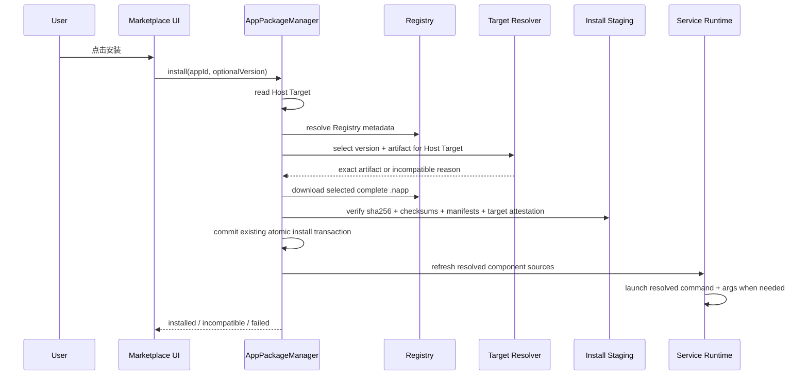

# 原生 Service App 多平台 Artifact 与 Marketplace 可安装性设计

## 文档状态

- 日期：2026-08-18
- 状态：设计冻结，待形成实现计划
- 上游设计：[Mini App 组合包与应用市场方案设计](./2026-08-12-mini-app-package-and-marketplace.design.md)
- 触发问题：schema v2 当前把一个 App Version 建模成一个通用 `.napp`，无法优雅分发 Rust、Go、C++ 等原生二进制
- 本文拥有：平台 target 合同、多 artifact 版本模型、发布与安装选择、Marketplace 平台信息和失败边界
- 本文不改变：App Package / Panel Component / Service Component 的既有边界、`native-process/full-user` 安全语义、包级数据与生命周期模型

## 一、决策摘要

NextClaw 应采用以下主链：

> 一个逻辑 App Version 可以声明 universal，或声明一个到多个精确 targets；Marketplace 用实际上传、校验并审核通过的 artifacts 证明当前可用范围；安装器根据宿主 target 选择一份完整、自包含、不可变的 `.napp`，校验后再进入既有安装事务。

具体冻结为：

1. Marketplace 必须标注当前版本支持的操作系统；详情页进一步展示架构与 Linux ABI。
2. 发布者可以为当前版本显式声明支持一个或多个 targets；这份声明属于版本化根 manifest 的 distribution 合同，不属于 `marketplace.json` 营销标签。
3. Marketplace 展示的“当前可用平台”来自已验证 active artifacts；声明表达发布意图，artifact 证明真实可用性，两者不能互相替代。
4. 平台支持属于 **App Version**，不是 App 永久属性；不同版本可以有不同 target 集合。
5. 在线 Marketplace 采用多 artifact 模型。用户只下载当前宿主匹配的一份 artifact。
6. 每个在线 target artifact 都是完整、自包含、可独立校验和回滚的 `.napp`；不在安装时临时拼接“公共包 + 二进制碎片”。
7. 本地目录和离线胖包允许一个 Service component 声明多个 target launch；解析后仍收敛为现有单一 `command + args`，Service runtime 不参与平台选择。
8. schema v2 的逻辑 App/组件模型不变，不为了分发变体引入 schema v3；只给根 manifest 增加 distribution 声明，并扩展 Service launch、Registry distribution union 和 Marketplace version/artifact 数据模型。
9. 旧的单 bundle 发布继续作为 `universal` artifact 兼容。targeted 版本不伪造通用 `dist.bundle`，旧客户端必须安全失败，而不是下载错误平台二进制。
10. `latestVersion` 表示逻辑 App 的全局最新版本；安装与更新使用“当前 target 最新兼容版本”。两者不再被假设为同一个值。
11. SHA-256、包内 checksums、不可变 URL 和人工审核属于本阶段必选；发布者公钥签名另立供应链设计，不用一个空字段伪装已经实现。

这不是给市场卡片补几个图标，而是把“这台设备能否安装、会下载什么、能否安全启动”收敛成一份端到端合同。

## 二、用户任务与成功条件

### 2.1 使用者

用户从 NextClaw 内置 Marketplace 或公开 Apps 网站进入，为了判断并安装一个 App，应当：

1. 在浏览和详情阶段知道当前版本支持哪些系统；
2. 在 NextClaw 本机内看到“适用于此设备”或明确的不兼容原因；
3. 点击安装后只下载本机需要的 artifact；
4. 下载完成后经过 hash、包内文件和 manifest 校验；
5. 安装成功后通过既有 Service runtime 启动，不需要理解 target、ABI 或 artifact；
6. 更新时只看到当前设备真实可用的新版本，不因其它平台发布新版本而进入错误更新循环。

成功不是“市场返回了 platforms 数组”，而是列表、详情、安装、更新、回滚和运行时对同一平台事实给出一致结果。

### 2.2 开发者

开发者维护一份源码与公共 App manifest，通过原生 CI runner 构建多个 target，最终创建一个 App Version，而不是五个 App ID 或五次互相割裂的版本发布。

普通聚合入口：

```bash
nextclaw app validate-publish ./app-package --artifacts ./dist
nextclaw app publish ./app-package --artifacts ./dist
```

矩阵 CI 入口：

```bash
nextclaw app release create ./app-package
nextclaw app artifact upload --release <release-id> --target <target-key> --file <artifact>
nextclaw app release finalize --release <release-id>
```

`finalize` 只创建一个逻辑 App Version，并统一进入 `native-process` 高权限审核。

### 2.3 审核者

审核者应看到：

- 逻辑 manifest、权限、组件和 actions；
- 完整 target 列表；
- 每个 artifact 的文件大小、SHA-256、二进制格式和验证结果；
- 相比上一版本新增或删除的平台；
- 可以阻止单一异常 artifact，而不必下架其它平台的正常 artifact。

## 三、当前证据与第一个违约边界

当前实现已经形成以下事实：

| 层 | 当前合同 | 多平台缺口 |
| --- | --- | --- |
| 根 manifest | schema v2 描述组件、runtime profile、权限与 NextClaw engine | 不描述当前版本计划支持的 distribution targets |
| Service manifest | `service-app.json` 只有一个 `command + args` | 本地胖包不能按 target 解析启动命令 |
| Publish CLI | 打一个 `.napp`，计算一个 `bundleSha256`，在 JSON 中上传一个 `bundleBase64` | 一次发布只能提交一个 artifact |
| Marketplace D1 | `marketplace_app_versions` 每个 `(item_id, version)` 只有一个 bundle hash/storage key | 版本与 artifact 被压成一对一 |
| Registry metadata | 每个 version 的 `dist` 只有一个 `bundle + sha256` | 安装器没有选择空间 |
| Installer | resolve 后下载唯一 bundle，校验并安装 | 不知道 target，也无法区分全局最新与本机最新 |
| Service runtime | 直接把 manifest 的 command/args 交给 stdio MCP runtime | 如果上游没有解析，runtime 只能错误启动 |
| Marketplace UI | 卡片只有版本、发布者、简介；详情有组件与安全 profile | 没有支持平台或本机可安装性 |

第一个违约边界位于 Marketplace version 模型：**逻辑版本与可下载 artifact 被错误地建成一对一。**

如果只在 UI 增加作者填写的 `platforms`，安装器仍会下载唯一错误包；如果只在 Service runtime 增加 `platformCommands`，在线用户仍需下载所有平台文件。必须从 version/artifact owner 开始修正，再向安装和 UI 投影。

## 四、术语与规范表示

### 4.1 逻辑对象

- **App**：由 `appId` 标识的市场应用。
- **App Version**：由 `(appId, version)` 标识的逻辑发布版本，拥有一份公共 manifest、权限、审核状态和一个 artifact 集合。
- **Declared Target Set**：发布者在当前版本根 manifest 中声明的支持承诺；可以只有一个 target，也可以有多个。
- **Artifact**：某个 App Version 面向一个 universal 或精确 target 的完整 `.napp`。
- **Host Target**：当前 NextClaw 宿主能够安全运行的规范平台快照。
- **Installability**：给定 App Version 与 Host Target 后的派生结果，不是持久化用户状态。

### 4.2 Target 结构

内部与 API 使用结构化 target，不让消费者解析任意字符串：

```ts
type AppArtifactTarget =
  | { kind: "universal" }
  | {
      kind: "native";
      os: "darwin" | "linux" | "win32";
      arch: "x64" | "arm64";
      abi?: "gnu" | "musl" | "msvc";
    };
```

规范 key 只用于 CLI、目录名、日志和数据库唯一键：

```text
universal
darwin-x64
darwin-arm64
linux-x64-gnu
linux-arm64-gnu
linux-x64-musl
linux-arm64-musl
win32-x64-msvc
win32-arm64-msvc
```

首个交付矩阵只要求：

```text
darwin-x64
darwin-arm64
linux-x64-gnu
linux-arm64-gnu
win32-x64-msvc
```

约束：

- 对外协议使用 Node/NextClaw 已有的 `darwin | linux | win32`，不混用 `macos/windows`。
- Linux 原生 artifact 必须声明 `gnu` 或 `musl`；只写 `linux-x64` 会掩盖真实运行条件，发布校验应拒绝。
- Windows 原生 artifact 当前必须为 `msvc`。
- Darwin 不声明 ABI；最低系统版本等更细要求后续进入独立 requirements 扩展，不塞进 target key。
- target 集合使用精确匹配，不默认跨 ABI、跨架构或 Rosetta fallback。

第一阶段 Host Target 使用运行 NextClaw 的实际 `process.platform + process.arch`，Linux 再探测 libc。Apple Silicon 上如果 NextClaw 本身运行在 x64/Rosetta 环境，第一阶段选择 `darwin-x64`；后续只有宿主探针能证明原生 arm64 可安全启动时，才升级为多候选优先级，不靠猜测 fallback。

### 4.3 Universal 的含义

`universal` 表示同一 artifact 在所有 NextClaw 当前支持的桌面宿主上满足合同，典型是：

- Panel-only 静态应用；
- 只使用宿主 Node.js 和跨平台 JavaScript 的 Service App；
- 不包含原生 npm addon、平台命令、系统动态库或平台限定资源。

`universal` 是发布者声明后由校验与审核接受的分发属性，不等于“没有填写平台”。同一 App Version 第一阶段必须二选一：

- `mode=universal`，对应一个 `universal` artifact；或
- `mode=targeted`，声明一个或多个精确 native targets，并各自对应一个 artifact。

不允许 universal 与精确 targets 同时存在，避免隐式 fallback 和选择优先级。

### 4.4 版本级 Distribution 声明

根 `manifest.json` 为当前版本声明分发范围。只支持一个平台时，targets 数组只有一个元素：

```json
{
  "schemaVersion": 2,
  "runtime": { "profile": "native-process" },
  "distribution": {
    "mode": "targeted",
    "targets": [
      { "kind": "native", "os": "linux", "arch": "x64", "abi": "gnu" }
    ]
  }
}
```

支持多个平台或同一平台多个架构时，继续增加元素：

```json
{
  "distribution": {
    "mode": "targeted",
    "targets": [
      { "kind": "native", "os": "darwin", "arch": "x64" },
      { "kind": "native", "os": "darwin", "arch": "arm64" },
      { "kind": "native", "os": "win32", "arch": "x64", "abi": "msvc" }
    ]
  }
}
```

真正跨平台且只有一份相同包时使用：

```json
{
  "distribution": { "mode": "universal" }
}
```

约束：

- `targeted.targets` 必须是去重后的非空数组，基数为 `1..n`，从不隐含“必须支持五个平台”。
- 一个 OS 可以对应多个 targets，例如 `darwin-x64` 与 `darwin-arm64`；Marketplace 卡片可合并显示为 macOS，详情必须展开架构。
- 根 distribution 表达整个 App Package 的可安装范围，不是某一个 Service 的局部范围。对每个声明 target，包内每个必需 Service component 都必须能解析到一个有效 launch；任一必需 Service 缺失时，整个 target 不成立。
- 同一个包可以混合 universal Service 与 targeted Service：现有 `command + args` 对全部声明 targets 有效，`launch.targets` 则只对精确匹配项有效。发布校验对每个 `(root target, service component)` 组合验证恰好一个有效 launch。
- publish/finalize 的严格相等指：`declared target set = uploaded target set = validated target set`，只比较开发者为本版本自己声明的集合。
- `marketplace.json` 可以在描述文案中提及平台，但不能产生或覆盖 distribution 声明。
- 旧 schema v2 manifest 缺少 `distribution` 时，为兼容现有包规范化为 `mode=universal`；新 targeted 发布必须显式声明。

## 五、候选方案比较

| 方案 | 用户下载 | Owner 清晰度 | 离线能力 | 安全与恢复 | 结论 |
| --- | --- | --- | --- | --- | --- |
| 每平台不同 App ID | 单平台 | 差，身份和版本割裂 | 有 | 审核与更新割裂 | 不采用 |
| 一个胖 `.napp` + 平台命令 | 全平台总和 | 中 | 最好 | 无法单独阻止异常平台 | 仅作为本地/离线能力 |
| 公共 bundle + target 二进制碎片，安装时拼接 | 较小 | 中 | 需多文件 | 安装事务、hash 与回滚复杂 | 不采用 |
| 每 target 一份完整 `.napp` | 单平台 | 最清晰 | 可单独导出 | 独立 hash、审核、阻止和回滚 | 在线主链 |

采用第四种在线主链，同时保留第二种作为本地目录和离线胖包兼容。

完整 target `.napp` 会重复少量公共 Panel 和 manifest 文件，但换来以下不变量：

- 每次安装只下载一个对象；
- artifact 自身足以离线安装、校验和回滚；
- 不增加安装期 overlay 合并算法；
- 现有 `.napp` 解包与 installed version 目录可以复用；
- 单个平台异常时可以精确阻止对应对象。

当公共资源真实增长到重复成本不可接受时，再设计内容寻址分层和增量下载；不能提前把安装事务变成多对象拼装。

## 六、唯一 Owner 与主链

### 6.1 Canonical owner

Marketplace 的 canonical 关系是：

```text
App Item
  └── App Version
        ├── common manifest / permissions / review
        └── Artifact[1..n]
              ├── target
              ├── sha256 / size / storage key
              └── availability status
```

职责冻结：

| Owner | 负责 | 不负责 |
| --- | --- | --- |
| 根 manifest `distribution` | 当前 App Version 计划支持 universal 或哪些精确 targets | 声称某个未上传/未通过校验的 artifact 当前可用 |
| Marketplace App Version / Artifact 表 | 某版本真实存在的 target artifacts、hash、对象地址、审核与阻止状态 | 当前用户设备是什么 |
| `@nextclaw/app-runtime` Host Target probe | 产生规范 host target 快照 | Marketplace 展示和业务状态 |
| `@nextclaw/app-runtime` target resolver | 纯函数匹配 artifact 与 host target；解析 Registry distribution union | 安装生命周期、UI 文案 |
| kernel `AppPackageManager` | 把 resolver 结果投影成 `compatible / incompatible / latest-compatible-version`，拥有安装、更新和回滚产品语义 | 自己复制 target 匹配规则 |
| Marketplace read model | 从 artifact 行投影支持 OS/target 列表 | 接受作者手填 platforms |
| Service manifest parser | 把本地胖包 launch targets 解析成有效 `command + args` | 远端版本选择 |
| `McpServiceAppRuntimeService` | 启停已解析的 stdio 进程 | 感知 Marketplace、选择 artifact 或再次选择 target |
| UI presenter | 展示兼容性和动作状态 | 根据 user agent 或图标自行猜平台 |

命中原则：`information-expert`、`single-complete-owner`、`equivalence-by-construction`。当前违反点是 Registry、installer 和 runtime 都只能围绕单 bundle 做隐式假设。目标结构让 Marketplace artifact 表拥有事实、resolver 统一判断、kernel 拥有产品状态，运行时只消费结果。

### 6.2 在线安装主链



Service runtime 看不到 artifact 列表。在线 artifact 内的 Service manifest 已由发布 CLI 物化为该 target 的单一 `command + args`。

### 6.3 本地目录与离线胖包主链

本地开发目录可声明 targeted launch：

```json
{
  "id": "peiiii-rust-todo-service",
  "title": "Rust Todo Service",
  "enabled": true,
  "protocol": "mcp",
  "launch": {
    "targets": [
      {
        "target": { "kind": "native", "os": "linux", "arch": "x64", "abi": "gnu" },
        "command": "./bin/linux-x64-gnu/rust-todo",
        "args": []
      },
      {
        "target": { "kind": "native", "os": "darwin", "arch": "arm64" },
        "command": "./bin/darwin-arm64/rust-todo",
        "args": []
      },
      {
        "target": { "kind": "native", "os": "win32", "arch": "x64", "abi": "msvc" },
        "command": ".\\bin\\win32-x64-msvc\\rust-todo.exe",
        "args": []
      }
    ]
  },
  "actions": {
    "list_todos": {
      "risk": "read",
      "title": "List todos"
    }
  }
}
```

兼容规则：

- 现有 `command + args` 继续表示 universal launch。
- 新的 `launch.targets` 表示本地/胖包 targeted launch。
- 两者互斥；同时声明或都不声明都拒绝。
- target 重复、路径越界、找不到文件或当前 host 无匹配项时，在检查/安装阶段失败。
- parser 输出的 resolved manifest 仍是单一 `command + args`；kernel record 和 MCP runtime 不扩展成 target map。
- targeted Marketplace publish 时，CLI 从相同公共源物化每个 artifact，只在生成的 target `.napp` 内保留匹配文件并写回单一 `command + args`。

因此方案 A 只存在于 source/offline 输入边界，不进入运行中状态模型。

## 七、Marketplace 数据模型

### 7.1 Version 与 Artifact 分表

新增 canonical artifact 表，概念结构如下：

```sql
CREATE TABLE marketplace_app_artifacts (
  item_id TEXT NOT NULL,
  version TEXT NOT NULL,
  target_kind TEXT NOT NULL,
  target_os TEXT NOT NULL,
  target_arch TEXT NOT NULL,
  target_abi TEXT NOT NULL,
  distribution_mode TEXT NOT NULL,
  bundle_sha256 TEXT NOT NULL,
  bundle_storage_key TEXT NOT NULL,
  size_bytes INTEGER NOT NULL,
  availability_status TEXT NOT NULL,
  block_reason TEXT,
  published_at TEXT NOT NULL,
  updated_at TEXT NOT NULL,
  PRIMARY KEY (
    item_id,
    version,
    target_kind,
    target_os,
    target_arch,
    target_abi
  )
);
```

数据库用非空规范值表达 universal：

```text
target_kind = universal
target_os = any
target_arch = any
target_abi = none
```

`availability_status` 第一阶段支持：

- `active`：允许新的 resolve 和下载；
- `blocked`：禁止新安装和更新，保留审计记录与已安装本地副本；
- `pending`：已上传但 release 尚未审核/finalize，不进入公开 Registry。

一个已发布版本至少需要一个 `active` artifact 才能进入 Registry resolve；最后一个 active artifact 被阻止后，该版本整体变为不可解析，`latest`/`latestByTarget` 投影必须回退到仍有可用 artifact 的已发布版本，而不是继续指向空版本。

索引至少覆盖：

```text
(item_id, version, availability_status)
(target_kind, target_os, target_arch, target_abi, availability_status)
```

### 7.2 不复制 supportedPlatforms 字段

`marketplace_app_items` 不新增作者可写的 `supported_platforms_json`。声明集合保存在版本化 manifest 中；目录列表需要的当前可用平台摘要通过最新版本 active artifact 行投影，必要时形成可重建的公开读模型；读模型不能反向写回 artifact canonical 表。

这样可以保证：

- 阻止一个 artifact 后，平台展示自动收敛；
- finalize 缺少某个平台时，市场不会继续显示虚假的支持；
- 审核和安装读取的是同一事实。

### 7.3 现有数据迁移

迁移规则：

1. 现有 `marketplace_app_versions.bundle_*` 记录按旧合同回填为一个 `universal` artifact。
2. 迁移期 Registry 对 universal 版本继续生成旧 `dist.bundle + sha256`。
3. 新代码全部写 artifact 表；version 表旧 bundle 列仅作为旧客户端兼容投影，不再是事实 owner。
4. 当所有受支持客户端和管理界面迁移后，再单独计划移除旧列；本设计不要求在同一迁移中破坏性删列。

已有包按 universal 回填是维持旧语义，而不是重新证明其跨平台质量。若审核发现某个旧包实际包含平台限定内容，应阻止该 artifact，并由发布者发布带精确 targets 的新版本。

## 八、Registry 与 API 合同

### 8.1 Universal 兼容响应

Universal 版本继续输出现有合同：

```json
{
  "dist": {
    "kind": "bundle",
    "bundle": "/api/v1/apps/items/rust-todo/bundles/1.0.0?sha256=...",
    "sha256": "..."
  }
}
```

### 8.2 Targeted distribution

Targeted 版本输出新的显式 union：

```json
{
  "dist": {
    "kind": "targeted-bundle",
    "artifacts": [
      {
        "target": { "kind": "native", "os": "linux", "arch": "x64", "abi": "gnu" },
        "bundle": "/api/v2/apps/items/rust-todo/bundles/1.0.0/linux-x64-gnu?sha256=...",
        "sha256": "...",
        "sizeBytes": 1843200
      },
      {
        "target": { "kind": "native", "os": "darwin", "arch": "arm64" },
        "bundle": "/api/v2/apps/items/rust-todo/bundles/1.0.0/darwin-arm64?sha256=...",
        "sha256": "...",
        "sizeBytes": 1679200
      }
    ]
  }
}
```

Targeted distribution 不返回虚假的 `dist.bundle`。旧客户端因不认识该 union 而在下载前安全失败；新客户端应把它翻译成“需要升级 NextClaw 才能安装此应用”，不能显示底层 JSON 字段错误。

### 8.3 最新版本语义

Registry 保留：

```json
{
  "dist-tags": {
    "latest": "2.0.0"
  }
}
```

但新 resolver 不再无条件下载 `latest`。规则如下：

- 显式指定版本：只在该版本中找 target；没有匹配项则返回 incompatible。
- 未指定版本的首次安装：从已发布版本中选择满足 `engines.nextclaw` 且有匹配 active artifact 的最高语义版本。
- 更新：只比较当前 target 的最高兼容版本；其它平台的新版本不能制造本机更新提示。
- `latestVersion` 与 `latestCompatibleVersion` 不同时，UI 必须同时说明，不得把旧兼容版本伪装成全局最新。

Marketplace 服务端可以在 Registry metadata 中提供可缓存的 `latestByTarget` 派生索引以减少客户端扫描，但它是 artifact/version 表的投影，不是第二份人工维护状态。客户端仍验证被选 version 的 artifact 与 target 一致。

### 8.4 Catalog 与详情投影

目录卡片最小新增：

```ts
type AppMarketplaceAvailability = {
  mode: "universal" | "targeted";
  supportedPlatforms: Array<"darwin" | "linux" | "win32">;
};
```

详情新增精确版本信息：

```ts
type AppMarketplaceVersionAvailability = {
  version: string;
  artifacts: Array<{
    target: AppArtifactTarget;
    sizeBytes: number;
    status: "active" | "blocked";
  }>;
};
```

公开列表只需 OS 级摘要，避免卡片负载膨胀；详情页才展示 arch/ABI 和各版本差异。

内置 NextClaw Marketplace 通过 kernel 的 host target snapshot 额外投影：

```ts
type AppMarketplaceInstallability =
  | { status: "compatible"; version: string; target: AppArtifactTarget }
  | { status: "incompatible"; reason: "unsupported-os" | "unsupported-arch" | "unsupported-abi" | "nextclaw-version" }
  | { status: "unknown" };
```

公开 Web 不使用浏览器 user agent 猜架构或 Linux ABI。它展示发布事实；只有能取得可靠宿主 target 时才显示“适用于此设备”。

### 8.5 安装型目录的兼容性展示与动作合同

内置“添加应用”弹窗的首要任务是让用户安装当前设备可运行的 App，不是平权陈列所有生态条目。平台不兼容项也不能彻底隐藏，否则用户通过搜索、分享链接或跨设备规划时会误以为 App 不存在。采用“**兼容项优先、非兼容项可发现、安装动作不可触发**”的统一策略：

1. 默认浏览先展示 `compatible` 与 universal App；不兼容 App 排在其后，并在列表较长时归入“其他平台应用”分组。
2. 搜索必须返回命中的不兼容 App，不制造假空态；分类、精选和作者页也可以展示，但不得与可安装项使用相同动作强度。
3. 公开 Apps 网站继续展示全部发布事实，只显示“支持 Linux / macOS / Windows”，不根据浏览器 user agent 猜测当前设备。
4. App 卡片与详情页都可继续打开，用户仍能查看说明、权限和支持范围；只有安装、更新等会改变本机状态的动作被阻止。
5. 暂不新增顶层“平台”Tab。现有分类已经承担内容筛选，平台兼容性是当前宿主派生状态，先通过排序、分组与动作状态表达；数据量证明有必要后再增加“仅看适用于本机”的次级筛选。

卡片不能只在灰色元数据中写一个“Linux”。当 App 与当前宿主不兼容时，同时提供三层信息：

- 标题附近显示醒目的范围标签，例如“仅支持 Linux”，使用中性或提醒色，不使用安装失败的红色；
- 操作区显示设备结论，例如“这台 Mac 无法安装”；
- 安装按钮保持真实 disabled 语义，文案改为“无法安装”，可聚焦 wrapper 的 tooltip 进一步说明精确原因，例如“此版本仅提供 Linux x64 构建；当前设备是 macOS arm64”。

不通过降低整张卡片透明度表达不兼容，以免说明文字和详情入口一起失去可读性。卡片仍是可访问的详情导航，disabled 安装控件不能吞掉卡片导航，也不能在 disabled 状态下发送安装请求。

动作矩阵冻结如下：

| `installability` / 生命周期 | 卡片主要反馈 | 动作 |
| --- | --- | --- |
| `compatible`、未安装 | 支持平台摘要；必要时显示“适用于此设备” | `安装` |
| `compatible`、已安装 | 当前安装版本 | disabled `已安装` |
| `incompatible: unsupported-os/arch/abi` | “仅支持 …”与当前设备不匹配原因 | disabled `无法安装` |
| `incompatible: nextclaw-version` | “需要更新 NextClaw” | 导航到版本更新；不发送 App 安装请求 |
| `unknown` | “暂时无法确认设备兼容性” | disabled `暂无法安装` |
| artifact `blocked` | “此平台版本暂不可用” | disabled `暂不可安装` |
| 安装请求的瞬时网络/服务错误 | 当前页面生命周期内用 toast 告知；卡片恢复兼容态 | `安装` |
| 安装请求返回确定性不兼容 | 刷新 canonical installability，转为对应不兼容态 | disabled；不显示 `重试` |

App operation journal 为安装中断恢复、并发去重和有限诊断保留 operation 结果，但它不是 Marketplace 卡片的持久化展示状态。活动 operation 可以持续投影进度；终态失败只在本次运行中触发一次 toast，并刷新本机应用投影。页面刷新或重新进入后，不得把 journal 中的历史失败重新显示成红色错误条或“重试”按钮。用户再次点击“安装”会创建新的 operation；平台不匹配则转为确定性 disabled 状态，不得先允许安装、再用 registry URL 或底层 target 错误教育用户。

Kernel 是 Host Target 的唯一 owner，通过应用列表合同返回 canonical target snapshot；UI presenter 只能用该 snapshot 与 Marketplace availability 的 canonical target key 做严格集合匹配，不能读取 `navigator.platform`，也不能从 `supportedPlatforms`、卡片标签或 target 字符串拆分猜测平台。Marketplace 读取链路后续移入 Kernel 时，`AppMarketplaceInstallability` 派生也随 read model 一并下沉，UI 合同保持不变。安装 API 仍必须在下载前重新解析 Host Target 与 active artifact，防止缓存过期、旧 UI 或直接调用绕过；返回结构化不兼容原因，由 UI 映射成设备级文案，不暴露 registry URL、artifact key 或底层字段错误。

候选方案中，彻底隐藏不兼容 App 会损害搜索、分享和跨设备发现；保持混排、只把按钮置灰仍会让用户先读到弱平台标记再猜原因。兼容优先分组加显式 disabled 原因多一层目录编排，但能同时保留生态发现与安装任务确定性，因此作为内置 Marketplace 的主链路。

## 九、发布合同

### 9.1 聚合发布

对外只提供 `nextclaw app ...` 命令；`.napp` 是 artifact 文件格式，不是需要用户理解或直接调用的独立 CLI。平台构建与发布入口为：

```bash
nextclaw app pack ./app-package --target linux-x64-gnu --out ./dist/linux-x64-gnu.napp
nextclaw app validate-publish ./app-package --artifacts ./dist
nextclaw app publish ./app-package --artifacts ./dist
```

聚合命令接受 canonical target 目录或已生成 `.napp`：

```text
dist/
├── darwin-x64/
├── darwin-arm64/
├── linux-x64-gnu/
├── linux-arm64-gnu/
└── win32-x64-msvc/
```

CLI 执行：

```text
读取公共 manifest 的 distribution 声明 / marketplace metadata
→ 解析 source service launch targets
→ 为每个 target 物化一份完整 .napp
→ 精确比较 declared / discovered / built target sets
→ 验证公共身份、权限、组件与 action 合同等价
→ 验证 target command 只引用包内匹配文件
→ 计算每个 artifact SHA-256、size 和包内 checksums
→ 创建 release draft
→ 上传 artifacts
→ finalize 一个 App Version
→ 进入 native-process 高权限审核
```

CLI 不在开发者机器安装交叉编译工具链，也不负责从 Rust 源码编译。它只消费 CI 或开发者已经构建好的 target 输出。

对于只支持一个 target 的 App，`dist/` 只有一个 target 目录即可。对于多个 targets，CLI 逐一校验；它不会要求未在 `distribution.targets` 中声明的平台。可提供 `--targets` 参数作为 CI 断言或脚手架便利，但该参数必须与 manifest 完全一致，不能成为覆盖 manifest 的第二个 owner。

### 9.2 矩阵上传与 finalize

矩阵 CI 使用 draft release：

```text
draft
  → uploading
  → finalized/pending-review
  → published | rejected
```

不变量：

1. `release create` 从根 manifest 读取并冻结 appId、version、公共 manifest hash、权限 hash 和声明 target 集合。
2. 每个矩阵 job 只能上传声明 target 对应的 artifact。
3. `(appId, version, target)` 已存在相同 hash 时幂等成功；不同 hash 时拒绝覆盖。
4. `finalize` 前要求 declared target set、uploaded target set 与 validated target set 完全相等；声明一个 target 时只要求该一个，声明多个时要求全部成立。
5. finalize 是唯一创建可审核 App Version 的动作；单个上传不会出现在公开目录或 Registry。
6. 未 finalize 的 draft 定期回收；R2 内容寻址对象可在无引用时由独立 GC 清理。
7. 相比上一版本删除 target 必须在 finalize 输出醒目 diff，并在 community native review 中要求明确说明。

大 artifact 不再通过 `bundleBase64` JSON 上传；v2 release API 使用受限 upload session / 预签名 R2，再由服务端按 hash 和长度确认。现有 `/api/v1/apps/publish` 保留给 universal 和旧客户端。

### 9.3 Artifact 等价性

同一逻辑版本的 target artifacts 必须共享：

- 根 `manifest.json` 的 id、name、version、components、runtime、storage、permissions 和 engines；
- `marketplace.json` 元数据；
- Panel component 内容；
- Service component id、protocol、actions 与风险声明。

允许差异：

- Service 的已解析 command/args；
- 被声明为 target payload 的二进制与其必要动态资源；
- 包内 `.napp` target attestation 和 checksums。

CLI 为每个 artifact 写入不可由作者任意伪造的 release metadata：公共合同 hash、target、artifact hash。Marketplace 解包后重新计算并比对，不能只相信上传参数。

## 十、安全、完整性与异常平台处置

每个 target artifact 必须依次通过：

1. 上传字节 SHA-256 与声明一致；
2. `.napp` bounded extract 与精确 checksums coverage；
3. 根 manifest 与 release 公共合同一致；
4. artifact target 与包内 attestation 一致；
5. Service command 是包内相对路径或允许的宿主命令，不能越界；
6. 原生入口文件存在；Unix target 保留可执行权限；Windows target 的入口路径与 `.exe` 合同一致；
7. 能识别时校验 ELF / Mach-O / PE 架构与 target，不匹配即拒绝；
8. `native-process/full-user` 权限和人工审核保持不变。

对于多 Service 包，第 5 项按 root distribution target 与 Service component 做笛卡尔校验；不能因为主 Service 可启动，就忽略同包另一个必需 Service 在该 target 上缺失。

单 artifact 处置：

- `active → blocked` 后，新的 resolve、安装和更新立即不再选择它；
- 已安装副本不会被远程删除，用户可继续离线使用或回滚；
- UI 显示安全/兼容性提示，不自动启动新的 blocked 版本；
- 恢复不能替换同版本同 target 的字节，必须发布新版本；
- 其它 active targets 继续服务，不把局部故障扩大为全 App 下架。

SHA-256 证明下载内容与 Registry 记录一致，不证明发布者身份或代码安全。发布者签名、Marketplace 签名和密钥轮换属于后续供应链设计；在它们完成前，产品文案只能承诺完整性校验、身份鉴权和审核，不能宣称“已签名”。

## 十一、Marketplace 信息架构与交互

### 11.1 列表卡片

卡片保持简洁：

- universal App：显示“跨平台”；
- targeted App：显示 OS 级图标或短文案，例如“macOS · Windows · Linux”；
- NextClaw 内置市场确认本机不兼容时：显示“当前设备不支持”，安装按钮禁用，但允许进入详情；
- 不在卡片上展开 x64/arm64/ABI，避免把开发者细节淹没核心用途。

不兼容 App 不默认从“全部”搜索结果中消失。市场可提供“适用于此设备”筛选；这样既不制造静默缺失，也让用户能快速收敛可安装结果。

### 11.2 详情页

详情页增加“支持的平台”：

```text
macOS    Apple Silicon、Intel
Windows  x64
Linux    x64、arm64（glibc）
```

在 NextClaw 本机内，还显示：

- `适用于此设备`；或
- `此版本不支持 Linux arm64 (musl)`；或
- `当前设备可安装 v1.4.2；全局最新 v1.5.0 尚未提供此平台版本`。

安装按钮必须消费 kernel 投影的 installability。UI 不能只因卡片含有 `linux` 图标就自行判定当前 `linux-arm64-musl` 可安装。

### 11.3 发布者与审核界面

发布者详情按 version 展示 artifact matrix：

| Target | 状态 | 大小 | SHA-256 | 审核结果 |
| --- | --- | ---: | --- | --- |
| darwin-arm64 | active | 1.6 MB | `…` | 通过 |
| linux-x64-gnu | blocked | 1.8 MB | `…` | 已阻止 |

缺失 target 不是技术错误，只要它与 finalize 声明一致；但从上一版本删减平台必须作为兼容性变化展示和审核。

### 11.4 功能地图

| 场景 | 用户看到什么 | 动作 | 状态 owner | 失败/返回 |
| --- | --- | --- | --- | --- |
| 首次浏览 | 用途、版本、OS 级支持摘要 | 查看、筛选 | Marketplace read model | 目录错误可重试，不影响已安装 App |
| 打开详情 | 精确 arch/ABI、本机可安装性、权限 | 安装或返回 | artifact facts + kernel projection | incompatible 时说明原因并禁用安装 |
| 安装中 | resolving/downloading/verifying/installing | 取消尚未提交的下载 | AppPackageManager | 失败不改变旧 active version |
| 更新 | 当前 target 的最新兼容版本 | 更新、稍后 | AppPackageManager | 其它平台新版本不产生假更新 |
| artifact 被阻止 | 已安装版本警告或不可新装 | 查看原因、回滚 | Marketplace artifact status | 不远程删除本地数据和旧版本 |
| 刷新/重进 | 重新投影 artifact 与 host target | 继续 | Query Cache 仅缓存 | 缓存不能覆盖 canonical 状态 |
| 公开网站 | 发布事实和安装命令 | 复制、分享 | Marketplace read model | target 未知时不猜“适用于本机” |

## 十二、生命周期与不变量

必须长期成立：

1. App Version 是逻辑版本，Artifact 是该版本的可下载变体；二者不能再压成同一行事实。
2. 发布者可声明一个或多个 targets；声明是版本支持承诺，当前可用平台只由 `active` artifacts 派生，作者文案、tags 和 UI 图标都不是事实源。
3. 一个 target artifact 是完整、自包含、不可变的 `.napp`。
4. 同一 `(appId, version, target)` 相同 hash 可幂等重试，不同 hash 永不覆盖。
5. 远端 artifact 选择在下载前完成；本地 launch 选择在启动前解析完成；MCP runtime 永不自行选择平台。
6. 未匹配 target 时明确 incompatible，不 fallback 到“最接近”的架构或 ABI。
7. 安装和更新只下载一份匹配 artifact。
8. target 变化不改变 App 数据 owner；代码仍按 version 安装，数据仍按 app instance 保存。
9. `latestVersion`、`latestCompatibleVersion` 和 active installed version 是三个不同概念。
10. 单 artifact blocked 不自动下架其它 target，也不远程删除已安装副本。
11. `native-process` 仍以用户权限运行；平台分发不降低其安全等级。
12. 目录、详情、Registry、安装和更新必须从同一 artifact canonical 关系派生。

## 十三、失败与恢复边界

| 失败点 | 可观察结果 | 恢复 |
| --- | --- | --- |
| Host target 无法探测 | `installability=unknown`，禁止 native 安装 | 修复/升级宿主探针；不猜默认 target |
| 没有匹配 artifact | incompatible，展示缺失的 os/arch/abi | 等待发布者补版本或换设备 |
| 某矩阵 job 上传失败 | release 保持 draft，不产生半个公开版本 | 重试同 target 幂等上传后 finalize |
| artifact hash 不符 | verifying 失败，旧版本保持 active | 重新下载；持续失败则阻止 artifact |
| 包内 target 与二进制不符 | 发布或安装校验拒绝 | 发布新版本，不能覆盖同版本 |
| 下载时 artifact 被 blocked | resolve/download 失败并刷新 metadata | 选择其它兼容版本或保留旧版本 |
| 新版本不支持当前 target | 不显示本机更新；说明全局版本差异 | 继续当前兼容版本 |
| 更新提交前失败 | 旧 active version 不变 | 重试 |
| 更新提交后 Service 启动失败 | 使用现有 rollback 事务回到旧版本 | 报告 target、command 和 runtime 错误 |
| 离线胖包含多 target | 可安装但体积较大 | 当前宿主解析单一 launch；不联网补文件 |

## 十四、兼容与迁移

### 14.1 保留

- 现有 root `manifest.json` schema v2；
- 现有 universal `command + args`；
- 现有 `.napp` 安装目录、数据目录、原子激活与回滚；
- 现有 `/api/v1/apps/publish` 和 Registry `dist.bundle`，仅用于 universal/legacy；
- 现有 Panel/Service component 运行时。

### 14.2 新增

- 根 manifest 的 `distribution.mode = universal | targeted` 与 targeted `targets[1..n]`；
- Service source/offline 的 `launch.targets`；
- Host Target probe 与唯一 target resolver；
- Marketplace version → artifacts 一对多关系；
- release draft / artifact upload / finalize；
- Registry `targeted-bundle` union；
- catalog/detail 平台投影与 kernel installability。

### 14.3 删除或禁止的平行路径

- 禁止 `marketplace.json.platforms` 取代根 manifest distribution 声明或 active artifact 事实；
- 禁止 UI 根据浏览器 user agent、文件名或 tags 猜可安装性；
- 禁止 installer、kernel 与 Service runtime 各自实现一份 target key 解析；
- 禁止 targeted artifact 同时提供误导旧客户端的通用 `dist.bundle`；
- 禁止同版本同 target 覆盖二进制；
- 禁止安装时执行编译、`npm install`、shell installer 或动态下载未声明二进制；
- 禁止为了发布五个平台创建五个 App ID。

兼容退出条件：所有受支持客户端都理解 artifact 表和 Registry distribution union 后，才可另行设计移除 version 表旧 bundle 列和 v1 publish 单 bundle 分支。

## 十五、验证标准

### 15.1 Contract matrix

至少覆盖：

- universal Panel-only；
- universal Node Service；
- 五个首发 native targets；
- Linux `gnu/musl` 精确区分；
- 缺 arch、重复 target、unknown os/arch/abi；
- universal 与 targeted 同时存在；
- manifest/action/permissions 在 target artifacts 间漂移；
- artifact attestation、文件格式或 command 路径与 target 不一致。

### 15.2 Resolver matrix

证明：

- 显式版本只在该版本选择；
- 默认安装选择当前 target 最高兼容语义版本；
- 更新忽略其它平台的新版本；
- blocked/pending artifact 不可选择；
- 无精确 ABI 时不 fallback；
- universal 只在 universal release 模式成立；
- `engines.nextclaw` 在下载前生效。

### 15.3 发布与事务

在 create、upload、server validation、R2 write、D1 artifact write、finalize、review 的每个节点注入失败，证明：

- draft 可恢复；
- 未 finalize 版本不公开；
- 相同 hash 上传幂等；
- 不同 hash 不可覆盖；
- 阻止一个 target 后目录、详情、Registry 和安装选择一致收敛；
- 旧 active installed version 不受远端半成品影响。

### 15.4 原生 Runner 端到端

Rust Todo 作为样板，在原生 GitHub Actions runners 构建并执行：

```text
源码
→ native runner build
→ target artifact upload
→ finalize one App Version
→ review fixture publish
→ 对应宿主只解析并下载自己的 artifact
→ SHA/checksums/target 校验
→ 安装
→ Service action 调用
→ 更新/阻止/回滚
```

每个目标只在对应原生 runner 上证明启动。当前低资源 Linux 机器不安装多套交叉编译工具链；本机需要编译时使用 `-j 1`。

### 15.5 UI 验收

1. 卡片能区分跨平台与 targeted App。
2. 详情能展开 OS、arch、ABI。
3. 本机不兼容时安装按钮不可执行且原因明确。
4. 当前 target 最新兼容版本落后于全局最新时，两者都显示正确。
5. 单 target blocked 后，对应宿主不能新装，其它宿主仍可安装。
6. 公开 Web target 未知时不误报兼容。

实现触达 TypeScript、Registry、installer 或运行链路时，按项目验证规则运行匹配范围 `tsc`；自动测试不能替代五个平台中实际支持目标的原生启动证据。

## 十六、分阶段交付建议

### Phase 0：合同与 resolver

- Target 类型、规范 key、Linux ABI 探测。
- Service `launch.targets` 解析与 resolved `command + args`。
- Registry distribution union 与纯 target resolver。
- 明确旧客户端的安全失败信息。

### Phase 1：Marketplace artifact owner

- D1 artifact migration 与旧 bundle backfill。
- R2 target artifact key、下载、Range 和 immutable cache。
- release draft / upload / finalize。
- per-artifact validation、review 和 blocked 状态。

### Phase 2：安装、更新与本地胖包

- AppPackageManager host target projection。
- 安装前 target 选择、latest compatible version、更新与回滚。
- 本地目录和离线胖包检查/安装。
- installed registry 记录实际 resolved target 与 artifact hash，便于诊断和迁移。

### Phase 3：市场展示

- Worker catalog/detail availability projection。
- 内置 Marketplace 卡片、详情、筛选与安装禁用态。
- `apps.nextclaw.io` 平台事实展示。
- 发布者和管理员 artifact matrix。

### Phase 4：Rust Todo 样板

- GitHub Actions 五 target 原生构建矩阵。
- 聚合发布与 CI 分阶段发布两条开发者链路。
- Marketplace 审核、安装、action 调用、单 target blocked、更新和回滚端到端。
- 证据成立后再允许正式公开发布 Rust Todo。

## 十七、非目标

本设计不包含：

- 在低资源开发机自动安装多套交叉编译工具链；
- Android、iOS、RISC-V、GPU/CUDA 等 target；
- 任意动态依赖求解、系统包管理器调用或安装脚本；
- glibc 最低版本、macOS 最低版本等 requirements 的完整求解器；
- 多对象增量安装、公共层去重或 delta update；
- 发布者公钥签名、证书轮换和透明日志；
- 将 `native-process` 误称为 sandbox；
- 自动把 Service App actions 暴露给 Agent。

这些能力未来可以在 artifact owner 之上扩展，但不能改变本设计的核心不变量：平台事实来自 artifact、选择只有一个 owner、安装只消费一个已验证的完整 artifact。

## 十八、实现入口判断

最小实现顺序不应从 Marketplace 图标开始，而应是：

1. 先建立 Target/Artifact canonical 类型与 resolver；
2. 再把 Marketplace version 的单 bundle 拆成 artifact 集合并完成迁移；
3. 让 Registry 和 installer 跑通一个双 target fixture；
4. 再接发布 session、UI 平台投影和五 target CI；
5. 最后用 Rust Todo 证明真实原生进程链路。

这样 UI 中的每一个“支持 macOS / Windows / Linux”都能追溯到可下载、可校验、可启动的真实 artifact，而不是产品承诺先于系统能力。

## 十九、设计自审结论

在进入实现前，本设计按用户任务、owner、兼容、失败恢复和扩展边界完成一次自审，并修正了以下初稿缺口：

1. **单平台被误读为必须全矩阵**：已改为 `universal | targeted(1..n)`；一个版本可以只支持一个 target，也可以支持多个。
2. **只有 artifact 事实、缺少发布意图**：已增加根 manifest version-level distribution 声明，并明确 declared / uploaded / validated 三集合在 finalize 时相等。
3. **平台与 target 混用**：OS 只用于用户摘要；安装合同使用 OS + arch + 必要 ABI 的精确 target。
4. **多 Service 包可能虚报支持**：已要求每个 root target 下所有必需 Service 都能唯一解析 launch，App 支持集合是整个包的成立范围。
5. **全局最新可能误导本机更新**：已拆分 `latestVersion` 与 `latestCompatibleVersion`，其它平台的新版本不触发本机更新。
6. **单 artifact 故障可能扩大下架**：已加入 per-artifact blocked 与版本投影回退；其它 target 保持可用。
7. **旧客户端可能下载错误包**：targeted Registry union 不提供伪通用 bundle，旧客户端在下载前安全失败。
8. **在线拆包会扩大安装事务**：已冻结每 target 完整 `.napp`，本地胖包只在输入边界解析，运行时始终消费单命令。

自审后没有保留需要用户选择的产品分叉。实现若发现现有包格式无法在不复制 owner 的前提下满足上述不变量，应返回本设计返工，而不是在 installer 或 UI 增加局部例外。
