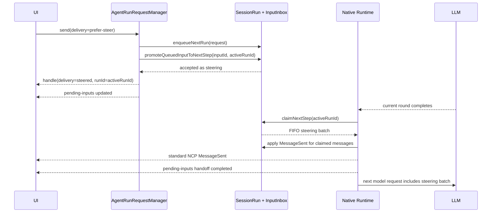

# Session Run 插话与双目标 Pending Input 设计

## 文档状态

- 日期：2026-08-20
- 状态：设计冻结，待进入实现计划
- 风险等级：L3
- 触达边界：NCP 消息提交合同、Kernel Session Run 生命周期、Native runtime 步骤边界、Server/SDK pending input 资源、Chat 输入与消息流交互
- 参考基线：DeepSeek Harness `deepseek-ai/deepseek-harness`，本地常驻副本 `/Users/peiwang/Projects/github/deepseek-harness`，调查提交 `141eb6fef83422698aef7a981029e843e8161534`
- 前置设计：[Session 级消息排队后端化设计](./2026-07-22-session-run-queue.design.md)

## 结论摘要

NextClaw 已经有 DeepSeek Harness `next-turn` 的产品等价物：`SessionRun.queuedRequests`。它按 session 保存完整 `AgentRunRequest`，由 `AgentRunRequestManager` 在当前 run 结束后 FIFO 启动下一次物理 NCP run。

但 NextClaw 还没有一个可被用户输入安全调用的 `next-step`：Native runtime 虽然已经会在模型轮次后再次 drain `SessionRun.inbox`，当前却缺少运行窗口准入、消息寻址、严格队列提升、能力声明、停止恢复和 pending-to-transcript 交接。因此，不能只给前端加一个“插话”按钮并直接向现有 `MessageInbox` 塞消息。

本设计选择：

1. **不整体照搬 DeepSeek 的 Inbox，也不把 next-run 队列降级成纯 `UserMessage[]`。** NextClaw 的排队项携带下一次 run 的完整配置快照，这是多 Agent、多模型、多 runtime 和 NCP run 语义所需要的。
2. **吸收 DeepSeek 的双目标、原子 claim、严格提升和单一 pending projection。** 在 `SessionRun` 内把现有 `queuedRequests` 与裸 `MessageInbox` 收敛为一个双目标 `SessionRunInputInbox`：`next-run` 与 `next-step`。
3. **插话不取消当前模型请求或工具调用。** 它在最近的安全步骤边界进入下一次模型请求；“插话”表示改变当前 run 的下一步，而不是中断 token 流或杀掉工具进程。
4. **新草稿使用 best-effort `prefer-steer`，已有排队项使用 strict steer。** 新草稿错过窗口时明确解析为排队；已有排队项提升失败时保留原项，绝不先删后发。
5. **第一期只为声明支持 next-step input 的 runtime 开放。** Native runtime 支持；当前 NARP/HTTP/ACP wrapper 默认只支持 queue。不得用 runtime 名称猜能力，也不得静默伪装支持。
6. **用户消息在 pending steering 与标准 transcript 之间按同一个 message ID 原子交接。** 刷新、重连和多客户端不依赖某个 React 页面保存事实，不出现消失、闪烁或双消息。
7. **同一 run 内按 step 切分 assistant message。** 当前 step 的 A1 正常完成，插话 U2 成为独立 user message，下一 step 生成新 message ID 的 A2；不能把 A2 追加回 U2 之前的 A1。

## 用户任务与成功标准

用户任务：当 Agent 正在执行长任务时，用户可以从当前会话输入一条新要求，选择“稍后作为新任务执行”或“在当前任务的下一步立即纳入”，并能明确看到系统最终采用了哪种投递方式。

用户可观察成功标准：

- 默认 Enter/发送按钮保持现有“排队发送”，不改变老用户肌肉记忆。
- 运行中可用 Cmd+Enter（macOS）或 Ctrl+Enter（Windows/Linux）插话发送；Shift+Enter 仍换行。
- 排队项提供可发现的“插话发送”动作；成功后该项离开排队区并在消息流尾部成为待处理用户气泡。
- 插话不会截断当前流式文字，不会取消正在执行的工具；它在当前模型/工具轮次结束后的下一次模型请求生效。
- 多条插话按提交顺序进入同一个下一步骤批次。
- 插话被 Agent 领取后，待处理气泡无缝变成标准用户消息，只出现一次。
- 用户停止当前 run 时，尚未领取的插话不会丢失，而是按原顺序回到排队队首。
- 不支持插话的 runtime 不展示伪入口；仍保持可靠排队。

## 现状证据

### NextClaw 当前链路

| 事实 | 当前 owner | 证据 | 结论 |
| --- | --- | --- | --- |
| session 级待执行队列 | `SessionRun.queuedRequests` | `packages/nextclaw-kernel/src/managers/session-run.manager.ts` | 已是 `next-turn` 的产品等价物 |
| 队列调度 | `AgentRunRequestManager` | `send()`、`startQueuedRun()`、`startNextQueuedRun()` | 每个排队项启动独立 NCP run |
| 排队项内容 | `SessionRunQueuedRequest` | 完整 `request + session + runId + enqueuedAt` | 不能无损替换成纯消息队列 |
| 当前 run 输入 | `SessionRun.inbox: MessageInbox<NcpMessage>` | `startQueuedRun()` 入 inbox，runtime drain | 只有裸数组，没有 target、寻址与准入窗口 |
| Native 中途检查输入 | `DefaultNcpAgentRuntime` | 每次 model/tool round 后再次 `drainInbox()` | 已具备 next-step 消费时机 |
| Native assistant identity | `DefaultNcpAgentRuntime` | `run()` 开头生成一个 `messageId` 并复用于全部 model round | 与 A1 -> U2 -> A2 顺序冲突，必须改为每 step 独立 message ID |
| 外部 runtime 输入 | `NcpAgentRuntimeWrapper` | 只在 `run()` 开头 drain 一次 | 当前不支持同一 run 内追加输入 |
| UI 排队管理 | Kernel API + React Query | queued-inputs GET/DELETE 与 `sessionRunQueueUpdated` | 权威事实已在后端，但只有 queued placement |
| transcript 准入 | 标准 `MessageSent` | 排队项成为 active run 时才发布 | 保证待处理项不提前进入正式历史 |

现有 `MessageInbox` 并不是完整 next-step owner。它只有 `enqueue/drain`，无法回答：

- 当前物理 run 是否仍接受下一步骤输入；
- 某条消息是下一次 run 还是当前 run 的下一步；
- 插话是否已经被 runtime 领取；
- 停止、失败或窗口关闭时未领取输入应去哪；
- 前端如何在刷新和多客户端下投影待处理插话；
- 排队项提升为插话时如何保证不丢不重。

### DeepSeek Harness 参考链路

DeepSeek Harness 的核心合同位于：

- `packages/core/agent/src/inbox.ts`
- `packages/core/agent-loop/src/agent.ts`
- `packages/core/agent/README.zh.md`
- `packages/client/runtime/src/client/sessions/queue-mirror.ts`
- `packages/client/ui-conversation/src/client/queue/QueueDock.tsx`
- `.agents/notes/implemented/architecture/2026-07-31-claimed-pre-step-inbox-lifecycle.zh.md`
- `.agents/notes/implemented/feature/2026-07-30-web-queue-steer-action.zh.md`

它的关键设计是：

1. 一个 Inbox 拥有 `next-turn` 与 `next-step` 两份 `UserMessage[]`。
2. `followup()` 写 `next-turn` 并唤醒 driver；`steer()` 写 `next-step` 并唤醒；`inject()` 写 `next-step` 但不唤醒。
3. turn 首步原子 claim 全部 `next-step` 加一条 `next-turn`；后续 step 只 claim `next-step`。
4. 每次插入、替换、移除和 claim 都通过同一 `agent/inbox/spliced` 事实投影；消息 ID 跨两份列表唯一。
5. 新草稿 direct steer 是 best-effort；已排队行转换为 steering 是 strict 原子操作，窗口关闭时保留原队列项。
6. pending steering 与正式 `user/message` 使用同一 message ID 交接，UI 不建立第二份队列 store。
7. 每个 step 产生独立 `assistant/message`；steering 被 claim 后位于前一 step assistant message 与下一 step assistant message 之间。
8. stop 可以保留 pending inbox；消息的入队回执不冒充某条 assistant 输出的因果完成句柄。

## 对比判断：哪些更好，哪些不能照搬

| 维度 | DeepSeek Harness | NextClaw 当前实现 | 本设计判断 |
| --- | --- | --- | --- |
| next-turn 数据 | `UserMessage` | 完整 `AgentRunRequest` | NextClaw 更适合多 runtime/run 配置，保留 |
| next-turn 执行 | 同一 Agent driver 内开新 turn | 新物理 NCP run，重新解析 spec/context/tools | 保留 NextClaw 语义，不改成同一 run |
| next-step | 一等 Inbox target | 裸 message inbox，只有 Native 隐式可消费 | 吸收 DeepSeek 模型并补完整 owner |
| 队列/插话转换 | 单次原子 Inbox mutation | 尚不存在 | 必须吸收，禁止前端 DELETE + SEND 两 RPC |
| pending projection | 同一 authoritative queue snapshot 带 placement | 只暴露 queued inputs | 升级为统一 pending-input projection |
| 持久性 | `agent/inbox/spliced` 进入 session event log | 进程内 `SessionRun`，重启丢失 | 本期不顺带事件溯源；另立 durable queue 设计 |
| runtime 范围 | 一个具体 ReactLoopAgent | Native、NARP、HTTP、Codex/Claude/OpenCode 等异构 runtime | NextClaw 必须显式能力声明，不能假设全支持 |
| 输入结果归属 | enqueue receipt，不声称一条 prompt 对应一个完成结果 | `NcpRunHandle` 以物理 run 为单位 | steering 复用 active run，但只表示归属区间，不建立错误因果 |
| 交互 | 默认 Queue、加速键 Steer、设置可交换、队列行 strict steer | 默认 Queue、编辑/删除 | 借鉴并分批落地 |

### 是否需要按 DeepSeek 方案重构

结论是：**需要定向重构，但不需要整体重写。**

需要重构的部分：

- 删除无语义的通用 `MessageInbox<T>`；
- 把 next-run 与 next-step 的待处理输入统一交给 `SessionRunInputInbox`；
- 给 next-step 建立运行窗口、message ID 寻址、claim、恢复和 projection；
- 让 Native runtime 使用标准 claim 边界，而不是随意 drain 一个裸数组；
- 让 Server/SDK/UI 消费同一个带 placement 的 pending input 视图。

不应照搬的部分：

- 不把 NextClaw next-run 降成 `UserMessage[]`；
- 不把每条排队请求并入同一个物理 NCP run；
- 不在本功能内把整个 SessionRun 队列改造成持久事件日志；
- 不要求不具备同 run 追加协议的 NARP/HTTP runtime 假装支持；
- 不引入 Cordis/plugin 风格的第二套 Agent 抽象。

## 候选方案

### 方案 A：停止当前 run 后立即发送

优点：复用现有 abort 与 queue，改动较小。

缺点：这不是插话，而是破坏性取消；可能中止有副作用的工具，丢掉当前推理与输出，也无法让新要求影响当前任务的下一步。

结论：不采用。

### 方案 B：直接向现有 `MessageInbox` enqueue

优点：Native runtime 已会 mid-run drain，最少代码即可出现“似乎能用”的效果。

缺点：存在 terminal race、停止后 stranded input、无 pending projection、无 runtime capability、无严格队列提升、无 message lifecycle；外部 runtime 永远不会消费。

结论：不采用。它只解决 happy path，会制造难以恢复的丢消息窗口。

### 方案 C：完整照搬 DeepSeek event-sourced Inbox

优点：模型完整，持久投影与恢复能力强。

缺点：DeepSeek 的 next-turn 是消息，NextClaw 的 next-run 是完整请求；强行统一会丢掉独立 run 配置，或迫使本次同时重做 NCP run、journal 和全部 runtime adapter，范围过大。

结论：不采用整体照搬。

### 方案 D：NextClaw 双目标 Pending Input（推荐）

在 `SessionRun` 内引入一个直辖子 owner，统一 `next-run` 与 `next-step`，值仍保存完整请求；Native runtime 只在步骤边界 claim next-step，外部 runtime 按声明能力接入。

优点：吸收 DeepSeek 已验证的不变量，同时保留 NextClaw 的 NCP 和异构 runtime 优势；能完整关闭竞态、取消和 UI 交接。

代价：需要调整 Kernel runtime 输入合同和 pending input API，不是纯 UI 小功能。

结论：采用。

## 推荐架构

### 唯一 owner

`SessionRun` 继续是单 session 运行状态的完整 owner。它直接持有 `SessionRunInputInbox`，不新增 queue service、registry、factory 或第二个 manager。

```ts
type SessionPendingInputTarget = "next-run" | "next-step";

type SessionPendingInput = {
  id: string;
  reservedRunId: string;
  enqueuedAt: string;
  target: SessionPendingInputTarget;
  intendedRunId: string | null;
  request: AgentRunRequest;
  session: AgentRunSession;
};

type SessionPendingInputPlacement = "queued" | "steering";
```

命名刻意使用 `next-run` 而不是照抄 `next-turn`：NextClaw 每个 queued request 会成为独立物理 NCP run，名称必须反映真实 owner 和生命周期。

`SessionRunInputInbox` 负责：

- `appendNextRun(request)`；
- `tryAppendNextStep(activeRunId, request)`；
- `claimNextRun()`；
- `claimNextStep(activeRunId)`；
- `promoteNextRunToNextStep(inputId, activeRunId)`；
- `removeNextRun(inputId)`；
- `closeNextStepWindowIfEmpty(activeRunId)`；
- `restoreUnclaimedNextStep(activeRunId)`；
- 生成不可变 pending snapshot。

`AgentRunRequestManager` 继续负责：

- 接受外部 send 意图；
- 解析 `queue | prefer-steer`；
- 创建/启动物理 run；
- 发布标准 NCP 事件和 pending-input invalidation；
- 把 runtime terminal 结算交回 `SessionRun`。

runtime 只负责在它拥有的安全步骤边界 claim，不决定 UI fallback 或 next-run 排序。

### Pending Input 不变量

1. 同一个 pending input ID 在 `next-run`、`next-step` 和 claimed handoff 中最多出现一次。
2. `next-run` FIFO；同一 run 的 `next-step` FIFO，并在一次边界上批量 claim。
3. queued -> steering 是一次同步 owner mutation；失败时原 queued 项完全不变。
4. next-step 只有与 `intendedRunId` 相同的 active runtime 可以 claim。
5. runtime 只有在 next-step 为空时才能原子关闭 steering window。
6. 窗口关闭之后到达的新 direct `prefer-steer` 解析为 next-run；strict promotion 返回 unavailable。
7. 未 claim 的 next-step 在 abort/error/dispose 结算时回到 next-run 队首，并保持相对 FIFO。
8. 已 claim 的消息不隐式回队；它已经成为标准 transcript 输入，失败由该 run 的标准终态表达。
9. pending projection 与 transcript 通过稳定 message ID 交接，不能同时渲染两份。
10. pending input 仍是进程内 SessionRun 状态；本设计不声称服务重启后可恢复。
11. direct `prefer-steer` 与 queued-row strict steer 必须复用同一个 `next-run -> next-step` owner mutation；direct 入口只负责表达 best-effort 投递意图，不得拥有独立的 next-step 创建路径。
12. queued -> steering mutation 必须同时把本次输入的 `run_trigger` 和当前活动 run 的 `run_spec` 固化到同一 message；pending-to-transcript 只迁移状态，不能依赖 runtime 或 UI 在 handoff 后补造运行原数据。

### 为什么需要 admission window

`isRunning` 只是 UI 提示，不是可写权限。模型流可能已经自然结束，但 `RunFinished` 尚未被上层消费；如果此时仅凭 `isRunning` enqueue，消息会落入一个永远不会再次 drain 的旧 run。

每个支持 next-step 的 runtime 必须对当前 run 暴露一个同步 admission window：

- manager 在 runtime 已确定支持 next-step 且物理 run 已准备接管输入后打开；
- runtime 在每个自然完成点用 `closeNextStepWindowIfEmpty(runId)` 原子关闭；
- 若关闭时发现新输入，关闭失败，runtime claim 后继续下一轮；
- abort/error/finally 强制关闭并恢复未 claim 输入。

该 gate 是 SessionRun 的状态，不是 UI flag，也不是根据 runtime 名称推断出的分支。

## Runtime 合同

### 能力声明

`AgentRuntime`/runtime registration 增加明确能力：

```ts
type AgentRuntimeInputCapabilities = {
  nextStep: boolean;
};
```

- Native runtime：`nextStep: true`。
- 当前 `NcpAgentRuntimeWrapper`、NARP stdio、HTTP agent runtime：默认 `nextStep: false`。
- 后续 adapter 只有在上游协议具有同一 active run 的追加输入能力，并能关闭竞态窗口时，才可声明 true。

session type describe API 把能力投影到 UI。读取能力是纯读；不得在页面加载时探测或启动 runtime。

### Native runtime 步骤流



Native runtime 的边界顺序冻结为：

1. 当前 model/tool round 结算；
2. claim 当前 run 的全部 next-step；
3. 为每条 claim 提交标准 `MessageSent`；
4. 完成 pending-to-transcript handoff；
5. 运行 mid-run preflight/context compaction；
6. 构建并发送下一次模型请求；
7. 若无工具续跑且无 next-step，原子关闭窗口并结束。

这样插话也会进入现有 mid-run 压缩预算，不绕过上下文保护。

### 当前 run surface 的语义

插话进入的是当前 run，因此：

- 当前 run 的 runtime、Agent、模型、thinking、system/context/tool surface 保持不变；
- 消息正文、附件、对象引用和显式 skill token 作为用户输入进入下一步；
- queued input 原本保存的“下一次 run 配置”只有在它作为 next-run 执行时才生效；用户选择“插话发送”即明确选择沿用当前 run surface；
- UI 的动作 tooltip 应说明“插入当前回复，沿用当前运行设置”，不静默暗示会切换模型或 Agent。

## 提交与失败语义

### 新草稿：best-effort `prefer-steer`

NCP send envelope 新增明确投递意图：

```ts
type NcpInputDelivery = "queue" | "prefer-steer";
```

`prefer-steer` 的合同不是“必须成功，否则报错”，而是：

1. 已有 active run、runtime 支持 next-step、窗口开放：解析为 `steered`；
2. idle：作为普通 next-run 立即启动，解析为 `started`；
3. active run 不支持、尚未开放或刚关闭：进入 next-run，解析为 `queued`；
4. 任何解析结果都通过响应显式返回，UI 不靠 `runId === null` 猜测。

`NcpRunHandle` 增加：

```ts
delivery: "started" | "queued" | "steered";
```

steered handle 的 `runId` 是当前物理 run ID，只表示输入被该活动区间接纳，不表示后续某条 assistant message 是它的专属结果。

Kernel 对 direct `prefer-steer` 的内部处理不是第二套 next-step admission：先按普通提交创建标准 pending input，再在同一个同步事务内调用 queued-row strict steer 所使用的 canonical promotion。promotion 不可用时保留该项为 next-run 并返回 `queued`。这样 direct 与“先排队再插话”在进入 pending owner 后具有相同的 ID、状态迁移、projection 和恢复语义。

Consumer 必须使用 `delivery` 判定 handle 语义：只有 `started` 可以本地接纳为新 run 并提交 optimistic transcript；`queued` 进入 queued projection；`steered` 进入 steering pending projection。禁止用 `runId !== null` 推断 `started`，因为 `steered` 合法复用当前物理 run ID。

这个 fallback 是协议明示、响应可观察、同一 owner 决定的业务语义，不是 consumer 端静默救援。

### 已排队项：strict steer

队列行的“插话发送”必须是一个 Kernel 原子 action：

```text
POST /api/ncp/sessions/:sessionId/pending-inputs/:inputId/steer
```

- 成功：同一 pending value 从 next-run 移到 next-step，message ID 与内容不变；reserved next-run ID 退役。
- 窗口关闭/不支持：返回类型化 `STEER_UNAVAILABLE`，原项仍在 next-run。
- 项已被调度：返回 `PENDING_INPUT_NOT_FOUND`；原 next-run 已开始，UI 刷新即可收敛。
- 传输或内部错误：显示错误，原项不得被前端乐观删除。

禁止使用“先 DELETE queued input，再 SEND prefer-steer”的两请求组合，因为两次调用之间 runtime 可能 claim、关闭或失败，会造成丢失和重复。

### 停止、失败与恢复

| 场景 | next-step 未 claim | 已 claim |
| --- | --- | --- |
| 用户停止 | 移回 next-run 队首，随后按普通队列执行 | 已进入 transcript；当前 run 以 abort 结算 |
| runtime error | 移回 next-run 队首 | 保留用户消息与标准 run error，可继续运行 |
| 自然完成竞态 | close-if-empty 决定完成或继续，不会 stranded | 正常进入下一步 |
| runtime dispose | 移回 next-run；若整个 SessionRun dispose，则按现有进程内队列边界一起释放 | transcript 事实保留 |
| 页面刷新/重连 | 从 host pending snapshot 恢复 | 从标准 session events 恢复 |
| 服务进程重启 | 与现有 queuedRequests 一样不保证恢复 | 已写 transcript 的消息按 session journal 恢复 |

## Pending projection 与 API

新增统一读取模型：

```ts
type UiNcpSessionPendingInputView = {
  id: string;
  sessionId: string;
  enqueuedAt: string;
  placement: "queued" | "steering";
  intendedRunId: string | null;
  message: NcpMessage;
  metadata: Record<string, unknown>;
};
```

新资源：

- `GET /api/ncp/sessions/:sessionId/pending-inputs`
- `DELETE /api/ncp/sessions/:sessionId/pending-inputs/:inputId`：第一期只允许 queued placement
- `POST /api/ncp/sessions/:sessionId/pending-inputs/:inputId/steer`

现有 `queued-inputs` 路由与 Client SDK 已是公开 NPM 表面，不能在 patch 中直接消失。迁移规则：

- 内部 UI 全量切到 `pending-inputs`；
- 旧 GET/DELETE 继续由同一个 `SessionRunInputInbox` 实现，只投影 queued placement，不保留第二份状态；
- 标记 deprecated，并在下一次 NCP major 删除；cleanup owner 为 `@nextclaw/client-sdk` / Server session API；
- 未到 major 删除点前不得新增只支持旧 queued route 的功能。

### Pending-to-transcript 交接

claim 不能先让 pending steering 从 UI 消失，再等待 `MessageSent` 到达。采用两阶段 handoff：

1. `claimNextStep()` 把条目从 claimable next-step 移到内部 claimed shadow；snapshot 仍投影为 steering，但不能再编辑或 claim。
2. runtime 按 FIFO 提交标准 `MessageSent`。
3. 客户端以 message ID 优先显示标准 transcript 节点，并抑制同 ID pending 节点。
4. `acknowledgeClaim()` 退役 claimed shadow，发布 pending-input update。
5. 若 `MessageSent` 提交失败，claimed shadow 由 terminal settlement 恢复到 next-run，不产生无归属消失。

promotion 固化的 `run_trigger` 描述这条插话自身由谁、从哪里、何时发起，并把 `targetRunId` 指向当前活动 run；`run_spec` 复制该活动 run 已解析的真实执行表面。消息被 claim 并写入 transcript 后继续保留这两项元数据，因此刷新、历史恢复和“更多操作”都能读取与普通发送相同的权威来源。若 promotion 最终不可用并保留为 next-run，后续真正启动时仍由标准 `startQueuedRun` 用新 run 的事实覆盖这两项元数据。

claimed shadow 是一次交接状态，不是第二个业务队列；它只由 Inbox owner 管理，生命周期以 transcript commit 或 terminal restore 结束。

## 前端交互

交互评审原型：[排队与插话统一交互原型](./2026-08-20-session-run-steering.prototype.html)。原型沿用现有 `ChatInputBar + topSlot` 架构，覆盖支持插话、仅排队和空闲三种 runtime 状态，以及草稿投递、队列提升、编辑、删除和 Stop 恢复。

### 交互架构判断

不整体重做聊天页，在现有结构上扩展：

- 保留 `ChatInputBar` 和其 `topSlot`；现有 queued rows 演进为读取统一 pending snapshot 的 dock，只在输入区投影 `queued` placement；
- 保留现有单一发送按钮，不因 queue/steering 增加 split button 或第二个发送按钮；是否进入队列由当前 session 是否存在 active run 决定；
- `steering` placement 不和 queued row 混在输入区，而是在当前消息流末尾投影为 pending 用户气泡；两者来自同一个 pending owner，但视觉位置表达不同的执行语义；
- 不新增全局抽屉、右侧面板或第二张独立队列卡片，避免待处理输入脱离其影响的会话和输入上下文。

### 第一阶段默认交互

- idle：Enter、Cmd/Ctrl+Enter 与发送按钮都正常开始 run。
- running 且支持 steering：
  - Enter / 点击现有发送按钮：自动进入 next-run 队列；按钮外观和主动作不改变；
  - Cmd+Enter（macOS）或 Ctrl+Enter（Windows/Linux）：插话发送；
  - Shift+Enter：换行；
  - 发送按钮 tooltip 说明“运行中会自动排队”，并提示插话快捷键。
- running 但不支持 steering：同一个发送按钮自动排队，不展示无效快捷键提示。
- held Enter 不连续机枪式提交；IME composing 期间不触发。

默认 Queue 与现有行为一致，避免功能上线后把用户本想稍后执行的消息意外塞入当前 run。

### Queue 行

每条 queued 行保留编辑、删除，并新增 icon-only “插话发送”按钮：

- 编辑不是行内文本编辑：owner 删除成功后，把正文、rich-text nodes、附件、引用和 skill token 组成的完整 composer snapshot 恢复到原输入框并聚焦；
- composer 已有未提交内容时不允许静默覆盖，原 queued 项保持不变，并通过 tooltip/提示要求用户先处理当前草稿；
- 编辑、删除和插话都使用真实 `<button>`；
- 所有 icon-only 操作必须同时有 `aria-label`、可见 tooltip 和 `focus-visible`，不能只依赖图标猜测语义；
- 仅 running + runtime 支持时启用；disabled tooltip 说明原因；
- 点击后等待 strict action，busy 期间禁用该行重复操作；
- 成功后由权威 snapshot 移除，不做前端 DELETE 乐观补丁。

#### Queue 行内容呈现

排队项的事实模型始终是完整 `NcpMessage + metadata`，不能为了紧凑展示把它降级为一条纯文本 preview。输入区上方的 queued row 只是一层结构化摘要投影：

- 文本、rich-text 与 reasoning 归一为单行文本摘要，隐藏用于 composer 语义的 inline-token 原始标记；
- 图片附件展示紧凑缩略图，依次复用 message part 中的 `url`、`contentBase64` 或 `assetUri` 内容地址；缩略图提供附件名称作为可访问名称；
- 非图片附件展示文件标签与文件名；同一行最多直接展示三项附件，更多内容用数量提示收敛，避免挤掉正文和操作区；
- 仅有附件时直接展示附件摘要，不使用“空消息”或纯文本占位替代真实内容；
- 临时 submitting row 与服务端 queued row 使用同一个 presentation builder，后端确认前后不能出现内容形态跳变；
- queued row 不复用完整 transcript 气泡，也不在该区域执行图片放大、文件打开等次级交互；它的主任务仍是识别待处理输入并进行编辑、插话或删除；
- 编辑动作继续消费完整 composer snapshot，缩略图和文件标签只是 presentation，不成为第二份附件状态或恢复数据源。

### Pending steering 气泡

- 位于当前消息流末尾、运行中状态附近，使用普通用户气泡视觉；
- pending 阶段可复制，不提供编辑、删除、重跑或 fork；
- 不常驻显示“插话”标签，位置本身表达它发生在当前 run 中途；
- handoff 到标准用户消息后恢复时间、消息操作和持久序号；
- pending 状态需要无障碍可读名称，但不把内部 `next-step` 暴露给用户。

### Transcript 与 assistant message 分段

DeepSeek Harness 的实际合同是 step-level steering，而不是 token-level interruption：当前 step 的 `assistant/message` 正常完成，agent 在下一次 `preStep` claim `next-step`，把它追加为独立 `user/message`，随后下一次 step 再生成新的 `assistant/message`。客户端用 Inbox claim 前驱把该 user message 分类为 steering，但不会把前后两段 assistant 内容拼成同一消息。

NextClaw 采用同一语义。典型 transcript 必须是：

```text
run R1 / step 1
User U1       原始请求
Assistant A1 当前模型轮输出，streaming -> final

run R1 / step 2
User U2       被 claim 的插话，独立标准消息
Assistant A2 新模型轮输出，streaming -> final

RunFinished R1
```

明确约束：

1. `A1` 与 `A2` 是两个不同 `messageId` 的 assistant message，但共享同一个物理 `runId`；不能继续把一个 run 等同于一个 assistant message。
2. 插话到达时不终止 A1 的 token stream、不杀正在执行的工具，也不把 A1 标记为 aborted；A1 在安全 step boundary 正常 final。
3. U2 在 claim 前只是 pending projection；claim 后用同一个 user message ID 原位交接为标准 transcript message，不闪烁、不重复。
4. A2 必须出现在 U2 之后；禁止继续使用 A1 的 message ID 把第二轮输出追加回 U2 之前的旧气泡。
5. 同一 boundary claim 多条插话时，每条仍是独立 user message，按 FIFO 连续展示，随后只发起一次新的 model step 回应这一批输入，不把附件、引用或 skill token 强行合并。
6. 用户可以复制 A1、U2、A2 各自内容；retry、fork、继续等 run 级动作只挂在该 run 的最后一个 assistant message/turn tail，不在 A1 上制造“这个 run 已结束”的错觉。
7. 刷新和 journal replay 必须重建同样的 `A1 -> U2 -> A2` 顺序，不能依赖前端临时插入位置。
8. 实时 conversation manager 必须以 NCP endpoint event 的接纳顺序作为 transcript 权威顺序；`message.timestamp` 只表达消息自身的时间事实，不能覆盖 `MessageCompleted(A1) -> MessageSent(U2)` 的因果边界。流式 assistant 从 finalized messages 中抽离展示时，manager 必须保存它首次进入事件流时的插入边界，并在 streaming、settlement 与刷新投影之间保持同一个位置。

这要求补齐当前 NCP message lifecycle：

- 当前 Native runtime 为整个 run 只生成一个 assistant `messageId`，需要改为每个 model step 分配独立 assistant message ID；
- `runId` 继续作为物理运行 identity，`messageId` 只标识一条 transcript message；
- 每个 assistant step 在 claim steering 前发布自己的完成事实，finalize 当前 streaming message，但不清除 active run；
- `RunFinished` 只结算 run 和最后一个 active step，不再负责把整个 run 唯一的一条 assistant message 才变成 final；
- conversation state 需要允许同一个 active run 内顺序完成 A1、追加 U2、再建立 A2；run 级 usage metadata 不再依赖单一 assistant message ID。
- conversation state 的实时增量消息按 endpoint event 顺序追加；历史 prepend 与尚未进入事件流的临时 optimistic message 才允许使用时间戳寻找位置。React 只消费 manager 给出的 streaming 插入边界，不自行按墙钟时间重新推断 run 内顺序。

### 后续增强边界

运行中发送按钮始终自动排队，第一期不提供改变 Enter 默认行为的偏好。“空草稿 Cmd/Ctrl+Enter 把全部 queued 项按 FIFO strict steer”也不进入第一期；若后续有真实需求，必须复用逐条 strict action，不新增第二套 steer-all 状态。

## 状态矩阵

| 状态 | Queue send | prefer-steer | queued row strict steer | Stop 后结果 |
| --- | --- | --- | --- | --- |
| idle | 启动新 run | 启动新 run | 不可用 | 不适用 |
| active，窗口未开放 | next-run | 明确解析为 queued | 保留原项并 unavailable | queued 正常执行 |
| model streaming | next-run | next-step pending | 原子移到 next-step | 未 claim steering 回队首 |
| tool executing | next-run | next-step pending | 原子移到 next-step | 不杀工具以外的额外语义；停止仍按 abort 合同 |
| step 边界 claim 中 | next-run | 在同步 claim 后进入下一批或因 close 解析 queued | 找不到则原 next-run 已开始，刷新收敛 | claimed 归当前 run |
| natural stop closing | next-run | close gate 胜出则 queued；input 胜出则继续当前 run | gate 关闭时原项不动 | 无 stranded input |
| abort/error settling | next-run | queued | 原项不动 | 未 claim next-step 回到 next-run 队首 |
| unsupported runtime | next-run | queued，响应明确 resolved=queued | UI 不提供；Host strict unavailable | queue 语义不变 |

## 目录与公共边界

预计触达 owner，不在设计阶段冻结具体新增文件名：

- `packages/nextclaw-kernel/src/managers/session-run.manager.ts`：SessionRun 与直辖 Inbox owner。
- `packages/nextclaw-kernel/src/managers/agent-run-request.manager.ts`：投递解析、调度和事件发布。
- `packages/nextclaw-kernel/src/managers/agent-runtime.manager.ts` 与 runtime registry：能力声明。
- `packages/ncp-packages/nextclaw-ncp-agent-runtime-next`：Native claim/close 边界。
- `packages/ncp-packages/nextclaw-ncp`、`nextclaw-shared`：delivery intent/result 公共合同。
- `packages/nextclaw-server`、`packages/nextclaw-client-sdk`：pending input 资源与 strict action。
- `packages/nextclaw-ui`、`packages/nextclaw-agent-chat-ui`：提交策略、pending projection、队列动作、键盘与无障碍。

实现前若新增或移动源码文件，必须再次按实际 planned paths 运行 file-organization preflight；本设计不授权预先创建 service/factory/adapter。

## 要删除、合并和禁止新增的路径

删除或合并：

- 删除通用 `MessageInbox<T>`，其运行内输入语义进入 `SessionRunInputInbox`。
- `queuedRequests` 不再作为与 next-step 无关的平行数组，由同一 Inbox 的 next-run target 承接。
- UI 从 `useSessionRunQueue` 升级为 pending-input 读取，不另建 steering local store。
- 输入提交不再只用 `runId === null` 猜 queued，改读显式 `delivery`。

禁止新增：

- 前端本地 steering 队列；
- DELETE + SEND 组合式队列提升；
- 通过 abort 模拟 steer；
- runtime 类型名白名单；
- unsupported runtime 的静默“假插话”；
- 为 next-run 和 next-step 各建一个 manager/service；
- 用 transcript 消息冒充尚未 claim 的 pending input。

## 兼容、迁移与退出条件

- 内存队列数据没有跨进程持久迁移；升级时运行中的 SessionRun 仍按现有进程生命周期结束。
- `NcpAgentSendEnvelope.delivery` 缺省为 `queue`，保证旧客户端行为不变。
- `NcpRunHandle.delivery` 为新增必填字段时，需要同步迁移仓库内所有 producer；对外 transport 在一个兼容窗口内可把缺失值按旧合同解释为 `runId ? started : queued`，仅用于读取旧端响应。
- 旧 queued-input API 因公开 SDK 合同临时保留，且只转读同一个 Inbox owner；下一 NCP major 删除是明确退出事件。
- 不为外部 runtime 做自动 fallback adapter。声明 `nextStep: false` 就是稳定能力事实；上游真正支持后由对应 runtime owner实现并开启。

## 实现批次建议

这不是执行计划，只冻结依赖顺序：

1. **Kernel/Native 主链路**：双目标 Inbox、admission gate、claim/restore、delivery result、Native step boundary、每 step 独立 assistant message lifecycle。
2. **Server/SDK/UI 闭环**：pending-input API、strict promotion、pending bubble、快捷键、能力门控。
3. **交互增强**：空草稿 steer-all、真实页面体验打磨。
4. **runtime 扩展**：逐个为有真实同 run 输入协议的 NARP/HTTP adapter 接入；没有协议的不做。
5. **独立后续设计**：pending input/journal 持久化与进程重启恢复，不混入本功能。

## 最小验证标准

### Kernel 与 Runtime

- next-run FIFO、next-step FIFO、跨 target message ID 唯一。
- 新草稿 prefer-steer 的 started/queued/steered 三种解析。
- strict promotion 成功、窗口关闭原项不变、项已 claim 的收敛。
- model streaming 期间插话，在当前 stream 完成后进入下一次 model request。
- tool execution 期间插话，在工具结果之后进入下一次 model request。
- 多条 next-step 在同一边界按 FIFO 批量 claim。
- close-if-empty 与并发提交竞态不产生 stranded input。
- abort/error 把未 claim next-step 恢复到 next-run 队首。
- claim 后 `MessageSent`、pending handoff、下一次 preflight/model request 的固定顺序。
- 同一 run 内 A1、U2、A2 使用三个稳定 message ID，A1 在 U2 claim 前 final，A2 不回写到 A1。
- 每个 assistant step 的完成只结算该 message，不提前清除 active run；`RunFinished` 只在最后结算 run。
- Native mid-run compaction 仍覆盖插话后的真实模型输入。

### Protocol、Server 与 SDK

- delivery 字段 schema、旧缺省 queue、明确 resolved delivery。
- pending-input 按 session 隔离，placement 完整。
- strict steer 单 action 原子性及类型化错误。
- 旧 queued API 只读写同一 owner 的 queued placement。
- TypeScript 检查覆盖所有触达 package；测试/lint 不能替代 tsc。

### UI

- macOS Cmd+Enter、Windows/Linux Ctrl+Enter、Shift+Enter、IME、key repeat。
- supported/unsupported runtime 的入口与 disabled tooltip。
- queued row 对文本、图片和普通文件做结构化摘要；图片 URL、base64 与 asset URI 三种来源都可形成缩略图，纯附件输入不退化为空占位。
- submitting row 与服务端 queued row 使用同一内容投影，附件展示在确认前后保持稳定；附件内容仍可通过编辑完整恢复到 composer。
- queue 行编辑、删除、strict steer 不互相破坏。
- pending steering -> transcript 单气泡交接，无闪烁、无重复。
- 消费插话后固定展示 A1 -> U2 -> A2；A1 与 A2 是两个 assistant 气泡且只在 A2 显示 active streaming 状态。
- 覆盖 U2 的客户端时间早于 A1 首次 assistant delta / completed 时间的真实反转场景；直播、A1 settlement 后和刷新重载三种状态都必须保持 A1 -> U2，不能先错序再靠刷新自愈。
- 刷新、切会话、SSE 重连、多客户端读取同一 pending snapshot。
- stop 后未 claim 插话重新出现在队首。
- 窄屏与键盘焦点可达性。

### 真实链路冒烟

在隔离 Native runtime 会话中：

1. 让 Agent 执行至少两个模型步骤或一个可控长工具。
2. 当前步骤进行中直接 Cmd/Ctrl+Enter 插话，证明当前输出不中断、下一模型请求包含新要求。
3. 先排队两条，再把第二条 strict steer，证明当前 run 消费第二条，第一条仍留在 next-run。
4. 在 pending steering 尚未 claim 时 Stop，证明消息回到队首并最终执行。
5. 刷新页面并重连，证明 pending/transcript 只出现一份。
6. 选择一个不支持 next-step 的外部 runtime，证明 UI 不承诺插话且 Queue 不受影响。

## 非目标

- 不实现 token 级强制中断或正在执行工具的抢占。
- 不保证所有 runtime 首期支持插话。
- 不在本批实现 pending input 的服务重启持久恢复。
- 不改变 channel 默认投递；非 Web/desktop 入口仍默认 queue，除非调用方显式请求。
- 不把插话输出因果绑定到某一条 assistant message。
- 不借此重写完整 chat presenter、session journal、NCP transport 或 runtime plugin 系统。

## 愿景对齐

插话不是孤立的输入按钮。它让 NextClaw 在长任务中持续接收用户意图，并把“稍后做”与“现在改变下一步”收敛为统一、可观察、可恢复的 session 输入模型。这增强了统一入口、意图到执行、自感知连续性和用户对自治过程的实时掌控，同时通过显式 runtime capability 保持多模型、多运行环境下的一致可信体验。

## 外部参考

- [DeepSeek Harness 官方仓库](https://github.com/deepseek-ai/deepseek-harness)
- [DeepSeek Harness Agent Loop README](https://github.com/deepseek-ai/deepseek-harness/tree/master/packages/core/agent-loop)
- [DeepSeek Harness Developer Preview](https://deepseek.com/harness/)
