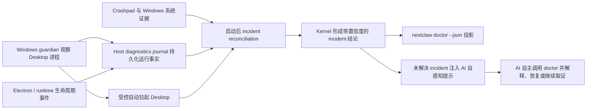

# Windows Desktop 自诊断与自治恢复设计

## 结论

这项能力应作为 NextClaw Desktop 默认内置的产品能力交付，不交付为用户排障手册，也不要求用户预装 Sysmon、修改注册表、打开事件查看器或手工搬运日志。

完整主链路是：



用户只需要正常安装和使用 NextClaw。发生异常后，guardian 自动观察并按策略拉起 Desktop；NextClaw AI 在恢复后能够知道“上一次非正常结束”，并自行读取机器可读诊断结果。只有当现有系统证据仍不能回答“哪个外部进程调用了终止”，且用户明确要求精确归因时，才进入一次性的增强取证授权；此时也应由 AI 发起产品内置命令和系统 UAC 授权，不让用户手工配置工具。

## 用户任务与成功条件

用户任务：Windows Desktop 在后台异常消失或不可用后，NextClaw 能在不要求用户执行排障步骤的前提下自动恢复，并由 AI 解释发生了什么、证据是什么、结论置信度如何、下一步是否仍需增强取证。

这里的用户入口是自然语言，而不是诊断命令。用户只需要表达类似意图：

- “刚才怎么突然没了？”
- “为什么后台又挂了？”
- “它刚才是不是崩了？你自己查一下。”
- “帮我看看上一次退出是什么原因。”

用户不需要知道 `doctor`、日志路径、进程名、事件 ID、异常时间或 crash 类型。AI 负责把这些自然语言归一为“查询最近一次 Desktop 异常 incident”，自行完成只读取证和解释。

成功条件：

1. 默认安装后即具备证据记录、异常恢复和 AI 查询能力，不需要额外配置。
2. AI 能区分 Desktop 主进程退出、renderer/GPU 退出、内嵌 runtime 退出、受控更新/重启、系统关机、native crash、资源耗尽、安全软件处置和证据不足的非正常退出。
3. `nextclaw doctor --json` 返回稳定、机器可读、带证据和置信度的最近 host incident；AI 不需要猜测原始文本日志。
4. 对无法证明的外部强杀只报告 `external-termination-suspected` 或 `unknown-unclean-exit`，不伪造“被某进程杀死”的确定结论。
5. 单次异常可受控自动拉起；重复崩溃进入退避并保留证据，不形成无限重启循环。
6. 小白用户只用自然语言即可触发排查；AI 不先反问日志在哪里、何时发生、是否配置过诊断工具，也不让用户执行命令。

## 现状证据与设计缺口

当前 Desktop 已有：

- 主进程同步文件日志和 PID/startup 信息；
- `before-quit` 日志；
- runtime 子进程的 started/ready/stop-requested/exited、exit code、signal 和自动恢复；
- Desktop 注入给 AI 的本地 `nextclaw` command surface；
- runtime 的 `status --json`、`doctor --json` 和结构化日志查询。

当前缺失：

- Electron main/renderer/GPU native crash dump；
- renderer、GPU、utility child gone 的结构化事件；
- 所有主动退出入口的统一 intent/reason；
- main 进程被强杀后仍存活的外部观察者；
- 上一次 run 没有 terminal record 时的启动恢复与系统证据关联；
- 面向 AI 的 host incident 稳定模型与自感知提示。

这不是一个日志点遗漏，而是跨 Desktop host、持久化恢复、Windows 宿主证据和 AI consumer 的系统模型缺失。只给现有 `main.log` 增加几行无法覆盖被杀进程不能写尾日志、AI 随主进程一同死亡和下一次启动无法关联证据三个反例。

## 候选方案

| 方案 | 用户负担 | 能否在 main 被杀后观察 | AI 可直接消费 | 精确度与恢复 | 结论 |
| --- | --- | --- | --- | --- | --- |
| 用户手工导出日志、事件和 dump | 高 | 取决于用户 | 否 | 零散、不可持续 | 拒绝 |
| 仅在 Electron main 内增加日志和 crash handler | 低 | 否 | 部分 | hard kill 无尾日志，main 死后无人恢复 | 不完整 |
| 内置 incident journal + Crashpad + 启动后系统证据关联 | 无 | 只能在下次启动恢复 | 是 | 可覆盖大部分原因，但不能无人介入立即拉起 | 作为证据平面 |
| 上述证据平面 + 独立 Windows guardian | 无 | 是 | 是 | 可观察退出并受控拉起，最符合自治目标 | 推荐完整方案 |
| 默认安装特权服务、Sysmon 或常驻 ETW | 安装和权限成本高 | 是 | 可投影 | 取证更强但过度侵入、仍不保证所有 caller 归因 | 仅增强模式 |

## 权威 owner 与边界

### Kernel：Host incident 语义 owner

Kernel 拥有 `HostRun`、`HostIncident`、证据类型、reason code、confidence 和分类规则。它负责：

- 定义并验证 journal schema；
- 将多来源事实归并为唯一 incident；
- 根据证据输出 `confirmed`、`probable`、`suspected`、`unknown`；
- 提供纯读取查询，供 doctor、AI 上下文和后续恢复策略复用。

同一个 incident 不允许 Desktop、CLI 和 AI 各自重新分类。

### Desktop host：事实 producer

Desktop 只产生它直接知道的事实：run start、heartbeat、退出 intent、clean terminal、Electron process-gone、runtime child exit、Crashpad dump metadata。所有 `app.quit()`、`app.exit()`、`app.relaunch()` 必须收敛到一个显式退出意图入口，先同步持久化 reason，再执行 Electron 生命周期动作。

当前仅写日志但继续运行的 `uncaughtException` handler 应退出正常链路；改用不改变默认崩溃语义的 monitor 记录事实，不在未定义状态中继续运行。

### Windows guardian：外部观察者和最小恢复 owner

guardian 是独立于 Desktop 主进程的薄进程，复用已安装的 Desktop executable 以 Node 模式启动，无需管理员权限。它只负责：

- 启动并观察 Desktop main PID；
- 记录 observer 看到的开始时间、结束时间和 exit status；
- 在没有 planned exit 时触发一次受控拉起；
- 对短时间重复退出执行有上限的退避；
- 不解释业务原因、不读取会话内容、不承载 AI 或产品状态。

若 guardian 自身和 Desktop 一起被终止，下一次正常启动仍由 journal 的未完成 run 恢复 incident；因此 guardian 增强即时自治，但不是证据唯一 owner。

### Windows evidence adapter：宿主证据 producer

只在发现未完成 run 或 crash dump 时查询与该 PID、可执行文件和时间窗口相关的宿主事实：

- Windows Error Reporting / Application Error / Application Hang；
- 系统关机、非正常重启；
- Resource Exhaustion Detector；
- Windows Defender 可读取的检测与处置事件；
- Crashpad dump metadata。

默认使用 Windows 自带、当前用户可读取的接口；访问拒绝记录为 evidence gap，不要求用户手工补配置。它不得把“没有 WER”反推为“必然被外部杀死”。

### Service / CLI：既有 self-management 投影

不新增一套平行的 AI diagnostics tool。扩展现有 `nextclaw status --json` / `nextclaw doctor --json`：

- status 只返回是否存在未解决 host incident 和最近摘要；
- doctor 返回完整结构化 incident、evidence、confidence、evidence gaps、recovery actions；
- Desktop command surface 继续保证 AI 无需全局安装 CLI 即可调用。

runtime 启动时只向 AI 自感知上下文注入一个紧凑信号，例如 `unresolvedHostIncidentId` 和 `reasonCode`，详细内容由 AI 按现有自管理合同调用 doctor 获取，避免把原始日志塞入每轮上下文。

## 自然语言到 AI 诊断闭环

### Skill owner

不新增平行的 Desktop 诊断 Skill，也不默认新增 reference。现有内置 `nextclaw-self-manage` 已拥有 `references/runtime-diagnostics.md`，直接扩展这个既有运行故障排查 owner：

- `SKILL.md` 只补充必要的触发路由：用户提到 Desktop 突然退出、后台挂掉、崩溃、被杀、重启后追查原因时，仍加载现有 `runtime-diagnostics.md`；
- `runtime-diagnostics.md` 增加 Desktop host incident 分支，编排产品提供的机器可读诊断命令、证据等级、外因分类和增强取证授权；
- Windows 事件 ID、证据 schema 和命令参数由产品文档/CLI 合同拥有，Skill 不复制一套易漂移的协议；
- Skill 不让 AI 用任意 PowerShell 临时拼装主路径，不要求用户执行命令，也不把缺少底层证据的问题伪装成提示词问题。

只有未来 `runtime-diagnostics.md` 因多个已实现、可独立触发的诊断域明显过长，且渐进加载收益已经被真实使用证明时，才允许把 Desktop 分支拆成条件 reference；不得为了本次方案预先新增文件或 Skill 入口。

Skill 是 AI 的调查程序 owner，不是证据 owner。guardian、journal、Crashpad、Windows evidence adapter 和 Kernel classifier 仍是确定性事实源。

### 意图识别

当用户表达“刚才、上次、后台、桌面端、突然没了、挂了、崩了、自己退出、被杀”等含义时，AI 应优先解释为 host incident 查询，而不是普通知识问答。用户没有提供时间时，默认查询最近一次未解决的异常 incident；没有未解决项时查询最近一次异常 incident。只有多个设备或多个时间相近 incident 会实质改变结论时，AI 才在完成已有证据调查后追问一个最小澄清问题。

### AI 必须自行完成的动作

1. 读取当前自感知上下文中的 `unresolvedHostIncidentId`；
2. 自行调用 `nextclaw doctor --json`，必要时继续读取 bounded incident history；
3. 核对 incident 的 run、PID、时间窗口、reason、confidence、evidence 和 recovery；
4. 若结论仍不完整，继续执行产品内已有的安全只读诊断，不要求用户代跑命令或寻找文件；
5. 用小白可理解的语言回答结论、影响、是否已自动恢复，以及下一步；
6. 只有确实需要提升权限的未来复现取证时，才解释原因并请求一次系统授权。

### 外因调查分支

当 incident 没有内部 crash、runtime child exit 或受控退出证据时，Skill 自动进入外因调查，不需要用户先判断“是不是外因”。调查顺序固定为从低权限、确定性证据到高权限、未来复现证据：

1. 核对 guardian observer、run terminal 缺失和进程时间线，确认确实是 Desktop main 非正常消失；
2. 关联系统关机、重启、登录会话结束、Windows Update 和电源事件；
3. 关联资源耗尽、OOM、磁盘/文件系统和代码完整性事件；
4. 关联 Defender、EDR、应用控制、隔离和拦截事件；
5. 关联 NextClaw updater、installer、uninstaller、其它 service manager 或 job owner 的已知退出意图；
6. 若只有 abrupt exit 而没有 crash/system/security 证据，输出 `external-termination-suspected` 或 `unknown-unclean-exit`；
7. 用户要求继续精确归因时，由 AI 调用产品内置的限时增强取证入口并请求必要的 UAC 授权；复现后自动读取结果、停止捕获并回答。

外因输出仍遵守证据等级：系统事件直接命中可为 confirmed；时间和目标相关但缺少直接动作证据为 probable/suspected；只看到进程消失不得声称具体 killer。

AI 不得把 `main.log`、WER、Crashpad、Sysmon、PID、exit code 等术语直接当作用户必须理解的答案。技术证据可以放在简短的“依据”中，但第一句必须先回答“发生了什么”。

### 面向用户的回答合同

默认回答分四层，按证据裁剪而不是机械输出：

1. **结论**：例如“刚才是 NextClaw 桌面主进程崩溃，不是你关闭的”。
2. **影响与恢复**：例如“后台服务中断约 12 秒，guardian 已自动拉起，现在运行正常”。
3. **依据与置信度**：例如“系统留下了 native crash dump，并与该次运行 PID 和时间吻合，结论为 confirmed”。
4. **下一步**：已足够定位则由 AI 继续分析/修复；证据不足时明确说“目前只能确认异常终止，还不能证明是谁终止”，并说明 AI 可以在用户授权后为下一次复现开启增强取证。

不得回复“请打开事件查看器”“请执行 PowerShell”“请把日志发给我”“请先配置 Sysmon”或要求用户判断属于哪类崩溃。

### 跨重启与延迟询问

incident 不能只存在于当前会话。未解决 incident 在 Desktop 重启、AI session 重建和用户稍后再问时仍可查询；bounded history 允许用户说“昨天那次”“最近几次为什么总挂”。AI 根据 incident 时间和设备身份自行筛选，不要求用户提供精确时间戳。

`acknowledgedAt` 只表示 AI 已向用户解释过，不等于问题已经修复。incident 还需要独立的 resolution 状态，避免用户问过一次后证据从默认查询中消失。

## 持久化模型

诊断数据位于当前 NextClaw home 的专用 diagnostics 目录，portable profile 跟随 portable runtime home。默认本地保存，不自动上传。

建议规范表示：

```ts
type HostIncident = {
  schemaVersion: 1;
  incidentId: string;
  hostKind: "windows-desktop";
  runId: string;
  launcherVersion: string;
  startedAt: string;
  lastHeartbeatAt: string | null;
  observedEndedAt: string | null;
  reasonCode:
    | "controlled-exit"
    | "main-js-uncaught"
    | "electron-native-crash"
    | "renderer-crash"
    | "gpu-process-crash"
    | "runtime-child-exit"
    | "system-shutdown"
    | "resource-exhaustion"
    | "security-remediation"
    | "external-termination-suspected"
    | "unknown-unclean-exit";
  confidence: "confirmed" | "probable" | "suspected" | "unknown";
  expected: boolean;
  evidence: HostDiagnosticEvidence[];
  evidenceGaps: string[];
  recovery: {
    attempted: boolean;
    outcome: "not-needed" | "restarted" | "backing-off" | "failed";
    attemptCount: number;
  };
  acknowledgedAt: string | null;
  resolution: {
    status: "unresolved" | "mitigated" | "resolved";
    reason: string | null;
    updatedAt: string | null;
  };
};
```

每个 run 使用稳定 `runId`。run state 通过临时文件加原子 rename 更新；重要 intent 和 terminal 写入必须同步完成后才能调用 quit/relaunch。heartbeat 只用于缩小异常时间窗口，使用低频、原子、覆盖式写入，不把高频心跳混入 service log。incident 使用独立、受 schema 和 retention 管理的结构化文件，不把 `main.log` 当数据库。

dump 只保存本地并设置数量/空间上限。doctor 默认只返回 metadata 和符号化摘要，不把可能含敏感内存的 dump 内容直接注入模型上下文。

## 分类不变量

1. 有明确退出 intent 和 terminal 的 run 必须分类为 expected，不得被 guardian 重启。
2. runtime child exit 不得提升为 Desktop main exit；二者 PID 和 owner 分离。
3. Crashpad dump 或 WER crash 证据可以确认 native crash；日志断尾不能。
4. renderer/GPU gone 由仍存活的 Electron main 直接确认，不依赖下次启动猜测。
5. 无 planned exit、guardian 观察到 main 消失但无 crash/system/security 证据时，只能是 suspected/unknown。
6. Sysmon ProcessTerminate 一类“看到退出”的事件不能单独证明 caller 身份。
7. classification 为纯投影；查询 doctor 不得修改 incident。acknowledge、清理和恢复是显式 mutation。
8. 自动恢复有固定窗口和次数上限；连续 crash 不得无限拉起。

## 生命周期矩阵

| 场景 | producer 证据 | 分类 | guardian 行为 | AI 行为 |
| --- | --- | --- | --- | --- |
| 正常启动和运行 | start + heartbeat | 无 incident | 持续观察 | 无额外上下文 |
| 托盘退出、更新、Restart App | exit intent + terminal | controlled-exit | 不重启或按 relaunch contract | 不报告故障 |
| runtime 子进程异常退出 | child exit code/signal | runtime-child-exit | main 仍活，不介入 | doctor 展示 runtime 自动恢复结果 |
| renderer/GPU crash | Electron gone details | renderer/gpu crash | main 仍活，不介入 | AI 可解释并建议/执行窗口恢复 |
| main JS 未捕获异常 | monitor record + observer exit | main-js-uncaught | 受控拉起一次 | AI 读取 stack 摘要和恢复结果 |
| Electron native crash | Crashpad/WER + observer exit | electron-native-crash | 受控拉起一次 | AI 读取 dump metadata/符号化摘要 |
| taskkill/外部 API 强杀 | observer exit + 无 terminal | external suspected 或 unknown | 受控拉起一次 | 明确证据边界，不声称 caller |
| Defender/EDR 处置 | security event + target correlation | security-remediation | 避免盲目重启循环 | AI 报告产品、规则和事件标识 |
| 整机断电/重启 | run 未完成 + system event | system-shutdown | 开机后正常启动 | AI 区分系统事件与应用崩溃 |
| guardian 和 main 同时被杀 | run 未完成 | unknown unclean exit | 当下无法恢复；下次启动重建 incident | AI 披露 observer gap |
| 短时间连续退出 | 多 incident + restart attempts | 原因保持，recovery backing-off | 停止自动拉起 | AI 说明 crash loop 并继续诊断 |
| 升级/旧数据 | schema version + migration | 保留可读或明确忽略 | 不因旧 journal 阻塞启动 | doctor 披露 unsupported evidence |

## 默认交付与增强取证边界

### 默认交付：零手工配置

- Desktop 内置 Crashpad 本地 minidump；
- Desktop 记录完整 run/exit/process-gone 事实；
- installer 安装 per-user guardian；
- 启动后自动关联 Windows 可读系统事件；
- kernel 生成 incident；
- doctor/status 向 AI 暴露；
- AI 自感知提示未解决 incident，并自主查询。

用户不需要打开 UI、命令行、注册表、事件查看器或安装第三方工具。

### 增强取证：仅证据不足且要求精确 caller 时

Windows 默认事实不能保证记录任意 `TerminateProcess` 调用者。若用户明确需要“到底哪个进程调用了终止”而默认 incident 仍为 unknown，AI 可提出一次产品内的 `enhanced host diagnostics` 授权：

- 由 NextClaw 自己启用定时、限期、仅针对自身进程的系统跟踪；
- 需要提升权限时只请求 UAC 确认；
- 到期或成功复现后自动停止并清理配置；
- 不把 Sysmon/ETW 作为永久默认依赖；
- 仍按证据强度区分 caller access、command-line correlation 和 confirmed termination。

这是唯一预计需要用户参与的路径，参与形式是批准系统权限，而不是执行排障步骤。

## 分批实现边界

### 批次一：证据平面与 AI 投影

- kernel host incident schema/store/classifier；
- Desktop 统一退出 intent、run journal、Crashpad 和 Electron gone events；
- Windows 启动后 evidence adapter；
- status/doctor JSON 与 AI unresolved incident 提示；
- 删除当前平行的退出原因推断，不再把 main.log 文本作为权威状态。

批次一完成后，用户无需配置；但若 main 已死且没有其它启动机制，AI 要等 Desktop 下一次启动后才能诊断。

### 批次二：Windows guardian 与受控恢复

- installer/portable launcher 集成独立 guardian；
- observer exit record；
- 单次自动拉起、退避和 crash-loop 上限；
- guardian/main 同死时的下次启动恢复。

批次二完成后，才闭合“用户不做任何事，AI 恢复后自己知道刚才为什么挂”的完整产品目标。

### 批次三：按需增强 caller 取证

只在真实 unknown incident 证明默认证据不足、且精确 caller 对解决问题有价值时展开，不作为前两批的阻塞项。

## 最小验证标准

1. 受控 quit/update/relaunch 不生成异常 incident，guardian 不误拉起。
2. 外部终止 Desktop main 后，guardian 留下 observer evidence、自动拉起一次，doctor 返回 unclean incident。
3. `process.crash()` 或等价 native crash 产生本地 minidump，incident 分类为 confirmed native crash。
4. 模拟 renderer、GPU、runtime child 退出时分别落入各自 reason code，不相互混淆。
5. 模拟系统重启事件、资源耗尽和 Defender 事件时，分类使用系统证据且保留 event identity。
6. 无 OS 证据的强杀只得到 suspected/unknown，不输出虚假 killer。
7. 三次短窗口连续异常后 guardian 停止重启并保留全部 incident。
8. 新 Desktop 会话启动后，AI 上下文能看到未解决 incident 信号，并能自行通过 `nextclaw doctor --json` 获取完整证据。
9. dump、journal 达到 retention 上限后安全轮转；doctor 不泄露会话内容、环境变量、完整命令参数或 dump 内存。
10. 用户只输入“刚才为什么挂了，你自己查一下”，AI 在不追问日志位置、异常时间和命令操作的情况下，定位最近 incident 并按回答合同返回结论。
11. 用户隔天询问“昨天那次为什么挂”，AI 能从 bounded history 找到对应 incident；被解释但未修复的 incident 不会因 acknowledged 而丢失。

## 非目标

- 不新增面向用户的诊断 UI 或要求用户浏览日志。
- 不默认上传日志、系统事件或 dump 到云端。
- 不承诺在 Windows 默认审计能力之外 100% 识别任意外部 killer。
- 不让 guardian 承载业务语义、AI runtime 或配置 owner。
- 不在本设计中扩展 macOS/Linux guardian；公共 incident 模型允许后续宿主接入，但 Windows 先闭环。
- 不把自动修复所有故障作为本期目标；先保证证据、分类、受控拉起和 AI 可理解。

## 命中的架构原则

- `information-expert`：Desktop、guardian、Windows adapter 只提交各自直接观察的事实，Kernel 统一解释产品语义。
- `single-complete-owner`：Host incident 的身份、状态、分类和查询只有 Kernel 一个权威 owner。
- `equivalence-by-construction`：status、doctor 和 AI context 均投影同一个 incident，不复制三套判断规则。
- `minimal-responsibility-surface`：guardian 只观察与恢复，不演化成第二个 Desktop manager。
- `cqs-pure-read`：doctor/status 纯读；acknowledge、capture、repair 明确分开。
- `deletion-first`：统一退出入口后删除散落的 `app.quit/relaunch` 原因推断；AI 继续复用既有 command surface，不新增平行工具。
