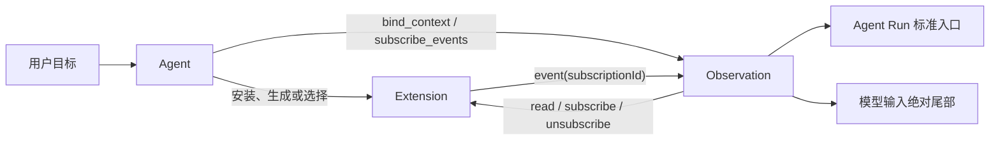
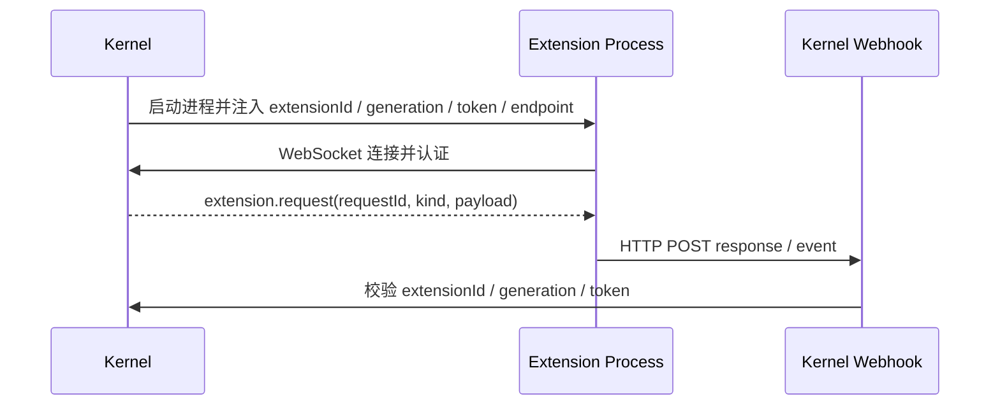
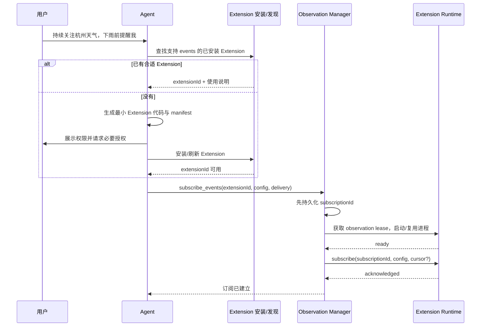
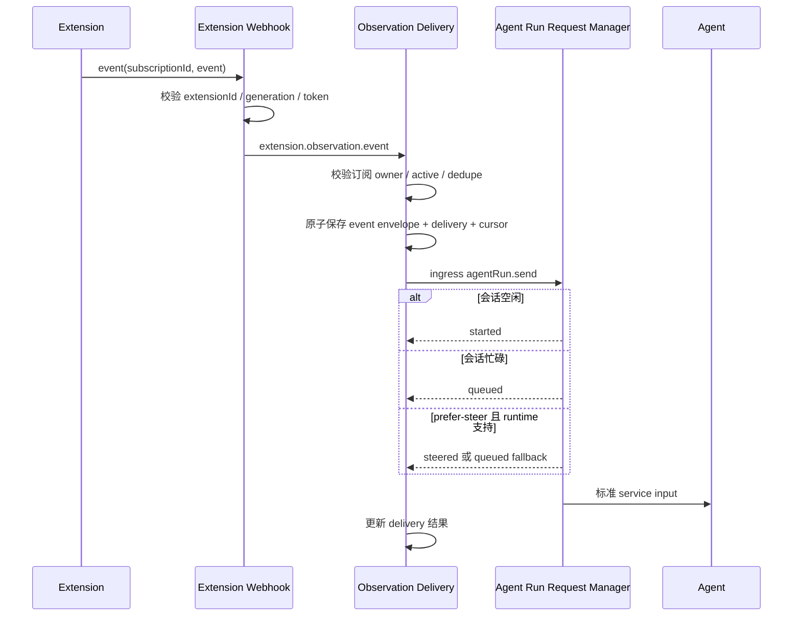
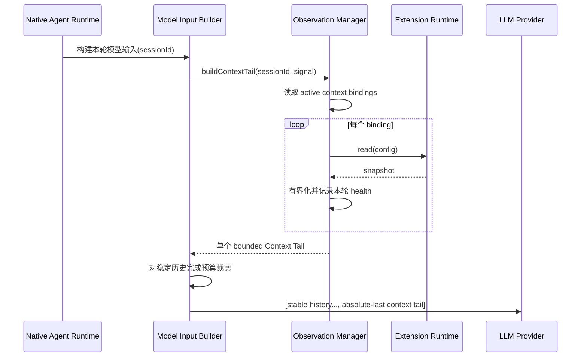

# Extension Observation：通用 Agent 观察能力设计

> 状态：Design Ready
>
> 日期：2026-08-22
>
> 角色：目标架构与实现合同
>
> 替代：早期的 Source Registry 方案和内置 workspace source 方案；这两条路径均已被本 Extension Observation 设计取代

## 1. 结论

NextClaw 的通用观察能力不应由 Kernel 写死一组 `ContextSource` / `EventSource`，也不应再建设一套与 Extension 平行的 Connector 平台。

目标方案只保留两个核心概念：

- **Extension**：连接并理解外部世界，负责真正的读取、监听和协议适配。
- **Observation**：记录某个 Agent 会话如何持续使用某个 Extension，包括配置、生命周期、持久状态和投递状态。

Observation 有两种行为：

- `bind_context`：每次模型运行时读取最新状态，并把结果放在模型输入的绝对尾部。
- `subscribe_events`：建立持续订阅；发生事件时，经 Kernel 的可靠投递链路唤醒、排队或在安全步骤插入当前 Agent 运行。

两种行为共用 Extension 的发现、启动、通信、认证和 SDK；它们的生命周期语义不同，因此保留为两种 Observation，而不是强行合并成一个模糊的 `observe`。

这套结构同时支持：

- 官方或社区安装的 Extension；
- 用户自己开发的 Extension；
- Agent 根据用户需求即时生成并安装的 Extension；
- 本地文件、天气、日历、进程、数据库、Webhook、远程服务等任意可编程对象；
- 将来由另一个 Agent 或程序完成过滤、聚合、语义判断后再输出事件。

它不要求 NextClaw 预先知道“天气源”“文件源”或“支付源”是什么。Kernel 只理解通用 Observation 协议，不理解具体世界。

## 2. 用户问题与真实用例

### 2.1 用户表达的是目标，不是基础设施配置

例如用户说：

> 持续关注杭州天气；如果要下雨，提醒我带伞。

Agent 应能够完成如下闭环：

1. 检查已安装 Extension 是否已有合适能力。
2. 如果没有，生成一个最小 Extension，使用天气 API 或网页数据判断杭州是否将下雨。
3. 向用户展示该 Extension 需要的网络访问、密钥等权限，并获得必要授权。
4. 安装 Extension；Extension manifest 声明它支持事件观察。
5. Agent 调用 `subscribe_events`，把城市、检查周期和“将下雨”条件作为 Extension 自己理解的配置传入。
6. Kernel 持久保存这条订阅并启动 Extension。
7. Extension 在后台检查天气；条件成立时，携带 `subscriptionId` 发出事件。
8. Kernel 根据 `subscriptionId` 找到绑定的会话，完成去重和可靠落盘，再通过标准 Agent Run 入口唤醒 Agent。
9. Agent 收到事件，结合当前会话和工具做最终处理，例如提醒用户带伞。
10. NextClaw 或 Extension 重启后，订阅仍然存在并自动恢复。

用户不需要先学习 Connector、写配置文件或等待 NextClaw 官方增加“杭州天气源”。

### 2.2 文件监听使用同一条链路

用户说：

> 监听这个项目里的 `payments.ts`；发生变化后检查是否影响支付流程。

Agent 可以使用已有的通用文件观察 Extension，也可以生成一个最小 Extension。差别只在 Extension 内部如何监听文件；Kernel 侧仍然只是：

```text
安装/发现 Extension
  -> subscribe_events(extensionId, config)
  -> 持久化 subscriptionId
  -> Extension 监听文件
  -> event(subscriptionId, event)
  -> Kernel 可靠投递
  -> Agent 被唤醒并检查文件
```

如果用户还要求“每轮思考时都知道该文件当前摘要”，Agent 可同时建立 `bind_context`。同一个 Extension 可以同时支持读取和事件订阅。

## 3. 设计目标

### 3.1 必须成立

1. **通用**：任何能由程序读取或监听的对象，都能通过同一套协议接入。
2. **可动态扩展**：新对象不要求修改 Kernel；Agent 能生成 Extension，用户也能安装外部 Extension。
3. **持久**：绑定和订阅属于会话长期状态，不能因进程退出或机器重启消失。
4. **可靠**：事件先落盘，再进入标准 Agent Run 链路；重复事件不能造成重复执行。
5. **解耦**：Extension 不知道会话 ID，不直接决定唤醒哪个 Agent。
6. **简单**：复用现有 Extension、Ingress、Agent Run、上下文尾部和持久化设施。
7. **可治理**：权限、暂停、删除、失效、恢复和错误对用户可见。
8. **缓存友好**：动态上下文永远追加在会话历史之后，不破坏前面稳定内容的前缀缓存。
9. **跨语言**：官方 SDK 提供便利，但协议不依赖 TypeScript SDK。
10. **真实可用**：验收必须跑真实 Extension 子进程、真实通信、真实文件或外部状态变化和真实重启恢复。

### 3.2 本设计不做

- 不建设第二套 Connector Manager、Source Registry 或 Event Bus。
- 不在 Kernel 内枚举文件、天气、日历等业务类型。
- 不设计 RxJS 等价的任意管道 DSL。
- 不允许在 Kernel 内直接执行来自模型的任意 JavaScript 过滤代码。
- 不为尚不存在的需求设计 Extension Instance、Provider Namespace 或多级 Factory。
- 不在首版设计 Marketplace UI、复杂权限 UI 或远程 Extension 编排平台。
- 不复制 Agent Run 的排队、steer、取消和会话调度逻辑。

## 4. 当前事实与需要纠正的方向

### 4.1 已有能力可以复用

当前 Extension 运行链路已经具备：

- 从内置目录、用户 Extension 目录和 workspace Extension 目录发现 manifest；
- 按 Extension 启动和复用本地子进程；
- 为进程注入 Extension ID、generation、token 和 endpoint；
- Kernel 通过 WebSocket 定向发送 `extension.request`；
- Extension 通过 HTTP `/webhook` 向 Kernel 返回响应或事件；
- 以 Extension ID、generation 和 token 完成连接隔离与认证；
- 通过 lease 管理进程需求和生命周期。

当前 Agent Run 链路已经具备：

- 空闲会话直接启动；
- 忙碌会话排队；
- `prefer-steer` 在 Native runtime 的安全 next step 插入，不能插入时回退排队。

当前 Observation 的局部实现已经具备可复用的下游能力：

- 会话级绑定和订阅持久化；
- 事件 delivery、幂等键和重启 reconciliation；
- 通过标准 `agentRun.send` 入口投递；
- 每轮构建动态 Context Tail，并在 provider 输入中追加到历史之后。

### 4.2 当前错误方向

当前草稿实现把 `ContextSource` / `EventSource` 对象注册进 Kernel 的内存 Map，并在 Kernel 启动时写死注册 workspace source。这样会产生三个根本问题：

1. 新的观察对象必须由 NextClaw 开发者修改 Kernel 或在主进程中注册代码。
2. Source 的发现、启动、通信和生命周期与已经存在的 Extension 重复。
3. Agent 无法通过生成一个普通 Extension 动态创造新的观察能力。

因此目标实现必须：

- 删除硬编码的 `SessionWorkspaceObservationService` 注册路径；
- 删除 `ContextSource` / `EventSource` 作为面向生态的主合同；
- 不把 Source Registry 换一个名字继续保留；
- 将 Observation 的上游执行统一路由到 Extension runtime。

已有可靠投递、持久状态和 Context Tail 不应因为上游方案纠正而重写。

## 5. 最小领域模型



### 5.1 Extension

Extension 是代码和运行单元，拥有：

- manifest 与静态能力声明；
- 读取或监听外部世界的实现；
- 自己理解的配置格式；
- 网络、文件、命令或凭据等权限需求。

Extension 可以提供 `read`、`events` 或两者。Kernel 不解释 Extension 的业务配置。

### 5.2 Observation

Observation 是“某个会话如何使用某个 Extension”的持久关系，不是另一份可执行代码。

它只有两种类型：

- Context Binding：会话在每轮模型输入时通过 Extension 读取状态。
- Event Subscription：Extension 持续运行，在事件发生时通知该会话。

同一个 Extension 可以被多个会话以不同配置使用；同一个会话也可以绑定多个 Extension。

### 5.3 为什么仍需要 Observation owner

目标内核保留一个 `ObservationManager`（即 Kernel 的 Observation 门面和关系 owner）。

不能把所有逻辑都塞入 Extension Manager。Extension Manager 管“进程和通信”；Observation owner 管：

- 会话关系；
- bind / subscribe 语义；
- Context Tail；
- 持久 cursor；
- event delivery、去重与恢复；
- pause / resume / remove。

两者面对的变化原因不同。保留这条边界不是增加平台，而是避免 Extension runtime 被会话和 Agent 调度语义污染。

## 6. Owner 与职责

| Owner | 唯一职责 | 明确不负责 |
| --- | --- | --- |
| Extension Manifest Discovery | 发现 Extension 及其静态能力 | 不启动进程，不创建订阅 |
| Extension Lifecycle / Runtime | 启停进程、lease、认证、请求响应和事件传输 | 不保存 session 关系，不投递 Agent Run |
| Extension SDK | 隐藏 transport 细节，帮助实现 read / subscribe / cleanup | 不替 Extension 决定业务配置和过滤逻辑 |
| Observation Manager | bind / subscribe / pause / resume / remove；路由 Extension 请求 | 不监听具体世界，不实现业务 Source |
| Observation Store / Delivery | 持久关系、cursor、event envelope、幂等和恢复 | 不复制 Extension manifest 或业务状态 |
| Agent Run Request Manager | started / queued / steered 的标准调度 | 不理解 Extension 或 Observation |
| Model Input Builder | 将动态 Context Tail 作为绝对最后一段输入 | 不负责读取外部世界 |

同一个事实只有一个 owner：

- Extension 是否安装、支持什么能力：manifest discovery。
- 某会话订阅了什么：Observation Store。
- Extension 进程是否正在运行：Extension Lifecycle。
- 某事件应该进入哪个会话：Observation Manager 根据持久订阅解析。
- 会话忙时怎么办：Agent Run Request Manager。

## 7. 能力声明与发现

### 7.1 Manifest 只声明通用能力

Extension manifest 增加一个最小的 Observation capability：

```json
{
  "id": "weather-watch",
  "server": { "type": "stdio" },
  "contributes": {
    "observations": {
      "events": {
        "description": "持续检查指定城市的天气，在匹配条件时产生事件",
        "configSchema": {
          "type": "object",
          "required": ["city", "condition"]
        }
      }
    }
  }
}
```

`read` 和 `events` 都是可选 descriptor。该声明只回答：

- 是否可以按请求读取当前状态；
- 是否可以建立持续事件订阅；
- Agent 应如何理解和构造这项能力的配置。

descriptor 最少包含面向 Agent 的说明，可选提供 JSON Schema，以做确定性校验和 UI 表单生成。它不列出 `weather`、`file`、`calendar` 等 Kernel 业务类型，也不要求为每个可观察对象声明一个 Source ID。复杂使用方法仍可由 Extension 自带 skill 或文档说明。

### 7.2 为什么必须静态声明

Kernel 需要在不启动所有 Extension 的前提下：

- 向 Agent 展示可用观察能力；
- 校验 `bind_context` / `subscribe_events` 是否可能成立；
- 在重启后判断缺失或能力不匹配；
- 只启动真正有活动关系的 Extension。

Extension 启动后还必须注册相应 runtime handler。Manifest 声明和 runtime handler 不一致时，返回明确的 capability mismatch，不静默降级。

### 7.3 主进程如何知道发给谁

Agent 创建 Observation 时选择 `extensionId`。之后 Kernel 持久保存该关系：

```text
Observation -> extensionId + opaque config + target(sessionId, agentId)
```

请求时，Extension Runtime 已经使用 `extensionId` 定位进程，并用当前 generation 和 token 建立安全通道。业务层不需要发明 Connector ID 或手工管理进程地址。

### 7.4 安装、刷新与作用域

当前代码能够从用户目录、当前 workspace 和内置包发现 manifest，也有 `ExtensionManager.load` / reload 链路；但尚没有完整的 Agent-facing Extension 安装与热刷新合同。Observation 实现不能把“Agent 写完代码以后手工重启 NextClaw”当作用户路径。

目标链路在现有 Extension owner 内补齐一个受控安装/刷新操作：

1. Agent 在临时工作区生成完整 Extension 包；
2. 安装操作校验 manifest、入口文件、依赖和用户授权；
3. 包被原子放入现有用户或 workspace Extension 目录；
4. `ExtensionManager` 重新发现 manifests 并刷新通用 Extension catalog；
5. 新 Extension 立即可被 `discover_observations` 使用；
6. 更新正在被观察关系使用的 Extension 时，runtime 以新 generation 重启，并由 `ObservationManager` 恢复订阅。

这不是新的 Connector installer。它是现有 Extension 安装/刷新能力的补全，并且官方包、社区包和 Agent-generated 包走同一入口。

Extension 解析必须带当前 Observation target：用户级 Extension 全局可见，workspace Extension 只对该会话的 canonical working directory 可见。Observation 仍只保存现有 `extensionId`；`ExtensionManager` 在该 target 的有效 roots 中确定性解析它。若同一个 ID 在有效 roots 中冲突，必须报冲突或按一个公开且稳定的既有优先级解析，不能在重启后静默换成另一份代码。

## 8. 通信合同

### 8.1 复用现有 Extension transport

现有本地 Extension 的 manifest 使用 `server.type = stdio` 来描述启动方式，但业务通信不是在 stdin/stdout 上自建 RPC：



Observation 复用这条通道。首版不额外实现一套 HTTP、WebSocket、stdio Connector 协议；未来 Extension runtime 支持新的宿主 transport 时，Observation 无需改变。

`read / subscribe / unsubscribe / event` 是 transport-neutral 语义。当前本地 Extension 可以在自己的进程里连接任意 HTTP、WebSocket、数据库或系统 API，因此今天已经能观察远程对象；将来若 Extension manifest 原生增加 remote HTTP / WebSocket server type，只扩展 Extension Lifecycle / Runtime，不修改 ObservationManager、持久关系或 Agent 工具。

### 8.2 Kernel 到 Extension

协议只需要三个操作：

```text
read(config) -> snapshot
subscribe(subscriptionId, config, cursor?) -> acknowledged
unsubscribe(subscriptionId) -> acknowledged
```

- `config` 是有界、可持久化的 JSON，由 Extension 定义和校验。
- `cursor` 用于 Extension 支持重放时恢复；不支持时必须明确报告。
- subscribe 对相同 `subscriptionId` 必须幂等；重复调用表示确认或恢复同一订阅，不得创建重复 watcher。
- unsubscribe 对已不存在的订阅也必须幂等成功。

Context read 是一次请求响应，现有 `requestId` 足以关联响应。无需另造 wire binding ID。只有将来 Extension 确实需要为某个 binding 保存独立资源时，才把现有 Observation reference 作为业务数据传入。

### 8.3 Extension 到 Kernel

异步事件只有一个入口：

```text
event(subscriptionId, event)
```

事件至少具有：

- Extension 内稳定的 event ID 或可去重键；
- 事件类型；
- 发生时间；
- 有界 JSON payload；
- 可选 cursor。

这里真正新增且不可省略的关联标识只有 `subscriptionId`。原始 subscribe 请求早已结束，异步事件必须依靠它找到长期关系。

Extension 不接收也不持有 session ID。Kernel 使用以下链路解析目标：

```text
authenticated extensionId
  + subscriptionId
  -> persisted Event Subscription
  -> target(sessionId, agentId)
```

Kernel 必须校验该 `subscriptionId` 确实属于当前认证的 Extension，且订阅处于 active 状态。

### 8.4 不允许 Extension 直接选择 Agent Run 目标

现有 `/webhook` 能承载通用 ingress envelope，并不意味着 Observation Extension 应直接发送 `agentRun.send(sessionId)`。

正式合同必须使用窄入口，例如 `extension.observation.event`，只接收当前 Extension 身份下的 `subscriptionId + event`。这样可以避免：

- Extension 越权唤醒任意会话；
- 每个 Extension 重复实现排队与重试；
- session ID 泄漏给不需要知道它的进程；
- 重启期间事件与订阅关系失去一致性。

## 9. Extension SDK

### 9.1 推荐开发接口

TypeScript SDK 提供一层薄封装：

```ts
extension.observations.provide({
  read: async ({ config, signal }) => {
    return readCurrentWeather(config.city, signal);
  },

  subscribe: async ({ subscriptionId, config, cursor, emit, signal }) => {
    const watcher = startWeatherWatcher({
      city: config.city,
      cursor,
      signal,
      onRain: (forecast) => emit({
        id: forecast.id,
        type: "weather.rain.expected",
        occurredAt: forecast.updatedAt,
        payload: forecast,
        cursor: forecast.cursor,
      }),
    });

    return () => watcher.close();
  },
});
```

这只是形态示例，不冻结所有字段命名。SDK 的实际职责应限制为：

- 注册现有 `extension.request` handler；
- 校验并分发 read / subscribe / unsubscribe；
- 在内存中维护 `subscriptionId -> cleanup / AbortController`；
- 对重复 subscribe 做幂等替换或确认；
- 在 unsubscribe、连接关闭和进程退出时调用 cleanup；
- 为 emit 补齐认证、extension identity 和标准 envelope；
- 规范化错误和超时。

### 9.2 SDK 不是协议本身

Python、Rust 或独立实现只要遵循相同 transport 和操作语义，也能提供 Observation。Kernel 不以是否使用官方 SDK 判断兼容性。

SDK 不替业务实现：

- 不替文件 watcher 选择 debounce；
- 不替天气 Extension 决定“下雨”的业务含义；
- 不提供任意代码字符串执行器；
- 不把所有过滤器做成一个中央 DSL。

## 10. 配置与过滤

### 10.1 配置由 Extension 拥有

Observation Store 把 `config` 当作有界 JSON 保存和透传。具体含义由 Extension 定义：

```ts
// 文件观察 Extension 的 config
{ path: "src/payments.ts", events: ["change"] }

// 天气 Extension 的 config
{ city: "杭州", condition: "rain_expected", intervalMinutes: 15 }
```

这样已经具备计算完备性：Extension 本身是程序，可以执行任意合法的自定义读取、转换、聚合和过滤逻辑。Kernel 无需先设计一个“能表达所有逻辑”的 DSL。

### 10.2 首版过滤分层

1. **Extension 内过滤**：高频、业务相关、靠近数据源；首选方式。
2. **Kernel 基础准入**：有界数据、event type、去重、节流和状态校验；用于保护系统，不表达业务。
3. **Agent 语义过滤**：当规则无法写成确定性代码时，可由一个专门 Agent/Extension 处理后再产生低噪事件。

由另一个 Agent 过滤事件，本质上仍然是一个 Extension 的实现或上游服务。输出端继续遵循相同 `event(subscriptionId, event)` 合同，因此不需要在 Kernel 建设 RxJS pipe graph。

### 10.3 暂不支持任意内联 JavaScript

允许 `subscribe_events` 参数直接携带 JavaScript 会引入代码执行、依赖、版本、资源限制、恢复和审计问题。首版不做。

用户确实需要任意逻辑时，由 Agent 生成一个正常 Extension：它有明确代码、manifest、权限、生命周期和可审查产物。这比把程序隐藏在订阅参数中更简单，也更可治理。

## 11. 持久状态

### 11.1 状态归属

| 状态 | 存储 owner | 是否跨重启 |
| --- | --- | --- |
| Extension manifest 与代码 | 现有 Extension 安装目录 | 是 |
| Context Binding / Event Subscription | Observation Store | 是 |
| Extension ID、opaque config、target session / agent | Observation Store | 是 |
| cursor、delivery、event envelope、幂等状态 | Observation Store | 是 |
| 最近一次 read 结果和 runtime health | 内存 / diagnostics | 否，重启后重新读取 |
| PID、token、generation、lease、cleanup function | 内存 / runtime | 否，由持久关系重建 |
| 凭据值 | 现有 Secret/Credential owner | 是，但不写入 Observation Store |

Observation Store 继续使用 NextClaw home 下的版本化、原子写入状态文件；目标实现演进其 schema，不另建 Observation 数据库或 Extension Instance Store。

持久状态不需要复杂状态机：关系只保存用户期望的 `active` / `paused` 状态、最近错误和必要恢复数据；missing、capability mismatch、process failed 等是 reconciliation 得出的 health。创建订阅时先保存 active 关系，再执行启动和 subscribe；只有 Extension ack 后才向调用方报告“当前已运行”。失败时保留可重试关系并返回明确错误，不能既丢配置，也不能假装已经监听。

### 11.2 持久关系是启动依据

下次启动时，不是“启动所有安装过的 Extension”，而是：

1. 发现 manifest；
2. 读取 Observation Store；
3. 标记缺失或能力不匹配的关系；
4. 为 active event subscriptions 获取 observation lease 并启动对应 Extension；
5. Extension ready 后按持久 `subscriptionId + config + cursor` 重新 subscribe；
6. context-only binding 不常驻启动，第一次需要 read 时通过 request lease 懒启动；
7. paused 或 removed 关系不维持进程；missing / capability mismatch 不启动；仍期望 active 的暂时故障关系继续由既有 runtime 恢复策略处理。

多个 active subscriptions 指向同一个 Extension 时，共用该 Extension 的一个现有生命周期进程；lease 做引用计数，而不是每条订阅启动一个进程。

### 11.3 不新增 Observation checkpoint store

首版恢复只依赖 Kernel 已经拥有的 relation、config 和 cursor。Extension 收到 cursor 后自行恢复；不支持 replay 时明确产生 gap。

如果将来 Extension 普遍需要保存 cursor 以外的私有状态，应建设通用 Extension data 能力，而不是为 Observation 单独增加一个 Store。Extension 不能直接修改 Observation Store，也不能依赖其物理结构。

## 12. 端到端代码链路

### 12.1 从用户需求到可用能力



这里没有 `createProgram()`。Agent 创建的是一个普通 Extension 包；安装、发现和运行都走已有 Extension 机制。

### 12.2 事件触发 Agent



Extension 不实现队列。用户插话、事件触发和其他 ingress 最终复用同一个 Agent Run 调度 owner。

事件在会话中 materialize 为带来源、发生时间和 observation reference 的 `service` input，而不是伪装成用户消息。用于 materialize 的 message ID 在首次 delivery 落盘时确定并在重试中保持稳定。

### 12.3 Context Binding



Context Binding 默认每个模型 round 读取，而不是只在用户发消息时读取。工具调用后进入下一 round 时，Agent 能立即看到刚绑定的上下文。

动态尾部必须满足：

- 在系统提示、历史消息、当前消息和其他模型可见信息之后；
- 作为固定预算计入 context pruning，但不被普通历史裁剪掉；
- 读取失败时显示明确的 unavailable 状态，不把旧值伪装成最新值；
- 多个 binding 使用稳定顺序组成一个 tail；每个 read 和总读取过程都有 deadline、取消信号、字符上限，单个失败不阻断其他 binding；
- 不写入会话历史，避免每轮重复膨胀。

稳定历史保持原顺序，只有最后一段随世界状态变化，因此前面的 token 仍可命中最长公共前缀缓存。

### 12.4 暂停、恢复与删除

- `pause`：先把关系持久化为非 active，再尽力 unsubscribe，并释放 lease；晚到事件因状态校验被拒绝。
- `resume`：恢复 active，启动 Extension，并用相同 subscriptionId 与 cursor 重新 subscribe。
- `remove`：删除持久关系后再清理运行资源；晚到事件因关系不存在被拒绝，重复 remove 幂等。
- session 删除：统一清理该 target 的绑定、订阅、pending delivery 和 lease。
- Extension 卸载：关系保留为 broken/missing，向用户显示可修复状态；不能把用户长期配置静默删除。

## 13. 重启与故障恢复

### 13.1 恢复原则

事件 delivery 必须在调用 ingress 前，连同有界 event envelope 一起落盘。否则若进程在 delivery 记录后、Agent input materialize 前崩溃，重启后无法重建事件内容。

同一原子状态变更至少应提交：

- delivery identity 和状态；
- 完整的有界 event envelope；
- subscription cursor；
- 去重所需信息。

重启时 reconciliation 只重放尚未获得确定结果的 delivery；幂等 message ID 保持不变。

持续事件还必须有有界保护：单个 event envelope、单个订阅的准入速率、待投递数量和已终结 delivery 的保留期都必须受限。超限需要留下可诊断的 dropped / throttled 状态，不能无限增长状态文件，也不能静默吞掉所有后续事件。具体默认数值属于实现配置，不进入协议字段。

### 13.2 故障行为

| 故障 | 目标行为 |
| --- | --- |
| Extension 未安装 | Observation 标记 missing，不启动、不丢配置 |
| Manifest 声明与 runtime handler 不一致 | 标记 capability mismatch，向 Agent/用户返回明确错误 |
| Extension 启动失败 | 按现有生命周期策略报告/重试；不得假装订阅成功 |
| read 超时或失败 | 本轮显示 unavailable；下一轮重新读取，不持久化旧 snapshot 冒充最新值 |
| Extension 进程崩溃 | lease 保留需求；重启 ready 后重新 subscribe |
| subscribe ack 前崩溃 | 使用同一 subscriptionId 重试，依赖幂等语义 |
| 停机期间 Extension 支持 replay | 带 cursor 恢复并重放 |
| 停机期间不支持 replay | 记录并暴露 gap，不宣称零丢失 |
| 重复事件 | 以 extension + subscription + event identity 去重 |
| pause 后晚到事件 | 状态检查拒绝，不唤醒 Agent |
| Kernel 在 ingress 前崩溃 | 从持久 event envelope 重试 delivery |
| Kernel 在 ingress 成功后、确认落盘前崩溃 | 复用稳定 message ID，由幂等边界阻止重复用户消息 |

## 14. 安全与权限

### 14.1 身份边界

- Extension 身份来自现有 extensionId、generation 和 token，不接受 payload 自报身份。
- `subscriptionId` 只能在认证 Extension 自己的关系内解析。
- Extension 不获得 sessionId，不能指定 target。
- Observation config 和 event payload 必须有大小、深度和序列化限制。
- 凭据以引用方式授权给 Extension，不能明文写入 Observation Store、事件或模型 Context Tail。

### 14.2 Agent 生成代码的执行边界

“Agent 能自己写一个观察器”是本功能的核心用户价值。首版不为此发明完整容器平台，但也不能把普通子进程包装成安全 sandbox。

最低实现合同：

1. 安装前展示代码来源、行为说明，以及它将作为持续后台代码运行这一事实。
2. Extension runtime 默认只传递 allowlist 环境变量，不能沿用无约束的宿主环境继承；凭据必须显式授权。
3. 没有真正 OS sandbox 的首版，Agent-generated 和第三方 Extension 按“完全信任的本机代码”处理，激活前必须取得一次明确确认。
4. 文件、网络和命令如果尚不能被技术隔离，UI 与文档必须如实说明其拥有当前宿主用户的权限，不能展示虚假的细粒度 grant。
5. 将来引入可执行 sandbox 后，再把文件、网络、命令权限收敛为可强制执行的 grants；这不改变 Observation 协议。

因此首版仍能真实支持 Agent 生成观察器，但不能无提示自动激活持久代码。最低阻断条件是：隔离敏感环境变量、显式凭据授权、真实信任说明和用户确认；完整 sandbox 是后续独立能力。

## 15. 用户与 Agent 工具面

Agent 工具保持最小：

```text
discover_observations
bind_context
subscribe_events
manage_observations
```

其中：

- `discover_observations` 从 Extension manifests 投影出支持 read/events 的已安装能力及使用说明；它不读取 Kernel Source Registry。
- `bind_context` 接收 extension reference 和 Extension-owned config。
- `subscribe_events` 接收 extension reference、config 以及 delivery preference。
- `manage_observations` 统一 list / get / pause / resume / remove，避免每个动作增加一个工具。

如果已安装 Extension 不足，Agent 使用现有文件、命令和 Extension 管理能力创建或安装 Extension，然后再调用上述工具。Observation 不额外提供 `createProgram` 或 `registerSource` 工具。

所有 manage 操作必须按当前会话/Agent target 做 owner 校验，不能只凭猜中的 observation reference 跨会话操作。

## 16. 启动决策表

| 持久状态 | 启动行为 |
| --- | --- |
| 只有安装记录，没有 Observation | 不启动 |
| 只有 active Context Binding | 不常驻；read 时懒启动 |
| 至少一个 active Event Subscription | 启动并持有 observation lease |
| 多条订阅指向同一 Extension | 共用一个进程，逐条恢复订阅 |
| 全部 paused | 不持有 observation lease |
| Extension missing / broken | 不启动，保留关系和诊断 |
| 订阅 removed | 不恢复，清理 runtime demand |

## 17. 目标代码改动边界

### 17.1 保留并演进

- Extension manifest discovery、lifecycle、credential、event stream 和 webhook transport。
- Observation Store、delivery、event envelope、幂等与 reconciliation。
- `AgentRunRequestManager` 的 started / queued / steered 语义。
- `AgentRunModelInputBuilder` 与 provider 的 absolute-tail 机制。
- Observation Agent 工具的用户语义。

### 17.2 删除或替换

- Kernel startup 中写死的 workspace observation source 注册。
- ObservationManager 内面向产品的 `ContextSource` / `EventSource` registry。
- `sourceId` 作为绑定目标的主合同，替换为 Extension reference + opaque config。
- 任何 ConnectorManager、SourceNamespace、discover/resolve 双层工厂和 `createProgram` 设计。

### 17.3 必要的最小新增

- Extension manifest 的通用 observation capability。
- Extension Runtime 的通用 request 能力；移除当前请求链路对 channelId 的业务耦合，但继续复用其 requestId 和认证。
- 一个窄的 authenticated observation event ingress。
- Extension SDK 的 `observations.provide` 薄封装。
- Extension lifecycle 的 observation lease reason。
- Observation state schema 从 source relation 演进为 extension relation，并包含恢复所需 envelope/cursor。
- Agent-generated Extension 的可信安装确认和环境变量隔离边界。

不得为了这些新增再建设 registry、adapter、factory、provider 和 manager 的平行层。优先在现有 owner 中加入稳定语义。

### 17.4 当前代码锚点

实现应沿以下现有文件增量演进，而不是另起一套目录：

| 链路 | 当前 owner |
| --- | --- |
| Extension 总入口和 reload | `packages/nextclaw-kernel/src/managers/extension.manager.ts` |
| 通用 request、webhook handler、manifest snapshot | `packages/nextclaw-kernel/src/services/extension-runtime.service.ts` |
| manifest roots 与解析 | `packages/nextclaw-kernel/src/features/extension-runtime/services/extension-manifest-discovery.service.ts` |
| process、generation、token、lease | `packages/nextclaw-kernel/src/features/extension-runtime/services/extension-lifecycle.service.ts` |
| Extension SDK transport 与 client | `packages/nextclaw-extension-sdk/src/services/extension-transport.service.ts`、`extension-client.service.ts` |
| Observation 关系 owner | `packages/nextclaw-kernel/src/features/observation/managers/observation.manager.ts` |
| Context Tail | `packages/nextclaw-kernel/src/features/observation/services/observation-context.service.ts`、`packages/nextclaw-kernel/src/services/agent-run-model-input-builder.service.ts` |
| Event delivery | `packages/nextclaw-kernel/src/features/observation/services/observation-delivery.service.ts` |
| Observation persistence | `packages/nextclaw-kernel/src/features/observation/stores/observation.store.ts` |
| Agent Run 调度 | `packages/nextclaw-kernel/src/managers/agent-run-request.manager.ts` |
| 需要删除的硬编码 source 装配 | `packages/nextclaw-kernel/src/app/kernel-manager.factory.ts`、`packages/nextclaw-kernel/src/features/observation/services/session-workspace-observation.service.ts` |

`ObservationManager` 是对 Kernel 暴露的唯一 Observation 门面。现有 context、event、delivery service 只有在各自确实拥有独立的读取、准入或可靠投递复杂度时保留；不再为 Extension bridge 增加同义 manager/factory/provider。

## 18. 真实验收标准

单元测试和手工调用 callback 不能证明用户可用。完成实现必须至少通过以下真实链路：

### 18.1 动态 Extension 安装

1. 在临时 NextClaw home 创建一个真实 Extension 包和 manifest。
2. 不修改 Kernel 注册表，依靠现有 manifest discovery 发现它。
3. Extension 作为真实子进程启动，使用官方 SDK 建立 WebSocket/HTTP 通信。
4. Agent 工具能够 discover 并创建 Observation。

### 18.2 Context Binding

1. 真实 Extension `read` 返回一个会变化的快照。
2. 完整 Native Agent run 通过真实 Model Input Builder 构建输入。
3. 断言动态 Context Tail 是 provider 收到的最后一条模型消息。
4. 修改外部状态后，下一 model round 读取新值；稳定历史顺序和内容未改变。
5. 重启 Kernel 后 binding 仍存在，并能再次 lazy read。

### 18.3 Event Subscription

1. 使用真实文件 watcher Extension 监听临时目录，而不是测试直接 emit 假事件。
2. 修改真实文件，Extension 经 webhook 发出事件。
3. Kernel 验证身份、解析 subscriptionId、先落盘 delivery，再走标准 ingress。
4. 分别证明 idle `started`、busy `queued`、`prefer-steer` 在安全 next step 生效或按合同回退。
5. Agent 收到的 service input 来自持久 event envelope。

### 18.4 重启和崩溃恢复

1. 有 active subscription 时停止并重新构造 Kernel。
2. manifest 重新发现，Extension 自动启动并使用同一 subscriptionId 恢复。
3. 再次修改真实文件，事件仍能触发同一会话。
4. 模拟 delivery 落盘后、ingress 前崩溃，重启后能从 envelope 完成投递。
5. 重复 event 和重复 subscribe 不产生重复 watcher 或重复 Agent 消息。

### 18.5 权限与隔离

1. Extension A 不能向 Extension B 的 subscriptionId 发事件。
2. 一个会话不能管理另一个会话的 Observation。
3. Extension payload 中伪造 sessionId 无效。
4. Agent-generated Extension 未确认时不能启动，确认后也不能继承未显式传入的敏感环境变量或凭据。

### 18.6 面向用户的交付

实现作为用户可见功能交付时，必须同步文档站，至少说明：

- 用户如何让 Agent 创建、绑定、订阅、暂停和删除观察；
- Extension 开发者如何声明和实现 read/events；
- 权限、持续运行、重启恢复和可能的事件 gap；
- 一个可复制运行的文件监听示例和一个外部 API 示例。

设计文档、内部测试、迭代记录和 changeset 不能替代用户文档。

## 19. 延后项

以下能力有价值，但没有首版证据，不进入当前核心：

- Extension 内声明多个具名 Observation provider；当前一个 Extension 可以通过 config 表达不同用途。
- 远程常驻 Extension 的直接 HTTP / WebSocket 启动模型；先复用现有本地 Extension runtime。
- 可视化 pipeline、RxJS operator DSL 和任意内联脚本。
- 由 Kernel 托管的多 Agent 语义过滤图。
- Marketplace 搜索、签名、审核和一键安装 UI。
- 同一 Extension 的多账户 Instance 抽象；出现真实账户隔离需求后再引入。
- exactly-once 的跨系统承诺；当前提供持久化、幂等和明确 gap，而不作无法证明的保证。

延后不代表协议封死：opaque config、Extension 程序能力和 cursor 已为真实扩展留下空间，无需提前增加抽象。

## 20. 最终设计判定

本方案可以直接指导 Observation 协议和运行链路实现，原因是：

- 只有 Extension 和 Observation 两个必要领域概念；
- Extension 的发现、启动、通信和认证均有现成 owner；
- Context 与 Event 两条链路的状态、故障和重启语义完整；
- 新增标识被限制到异步事件真正需要的 `subscriptionId`；
- 不复制 Agent Run 调度，不建立第二套生态系统；
- Agent 生成、用户安装和官方提供的能力走同一种 Extension 格式；
- 真实验收能够证明“用户可用”，而不是只证明内部接口可调用。

实现不存在未决的 Observation 架构问题。Agent-generated Extension 首版按明确确认的可信本机代码运行，并隔离环境变量和凭据；未来 sandbox 可独立增强而不改变本协议。除此之外，不再需要为 Source、Connector、Program 或 Pipeline 增加新的架构层。
