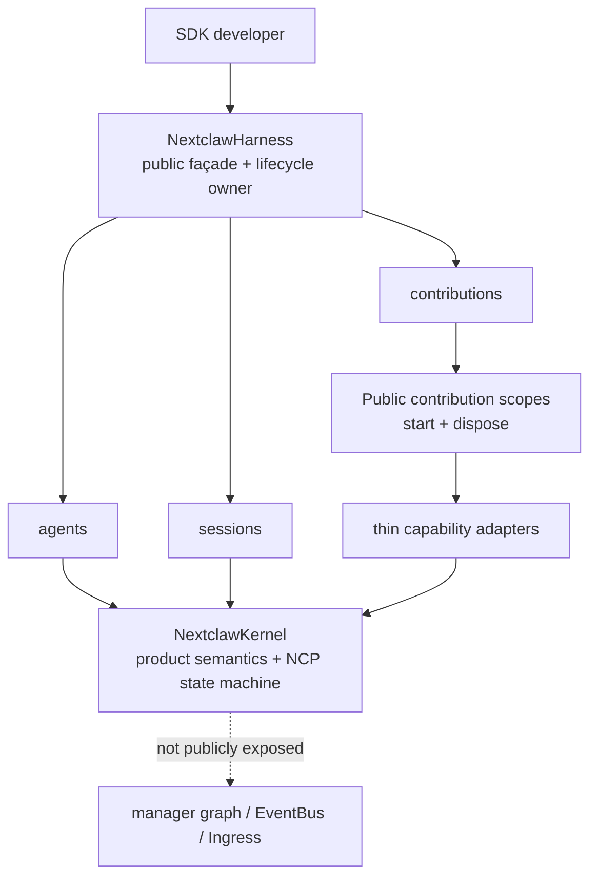
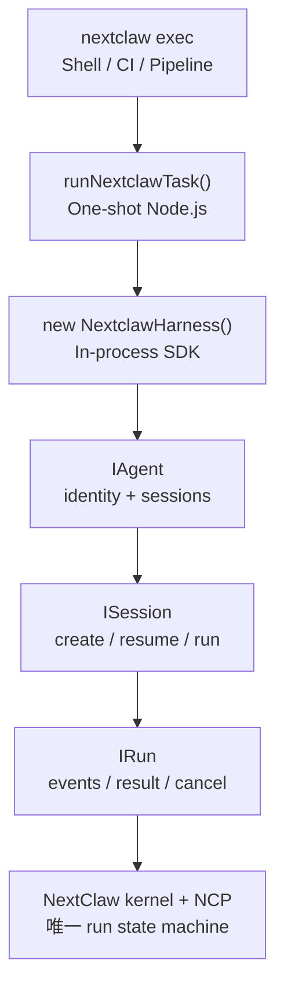
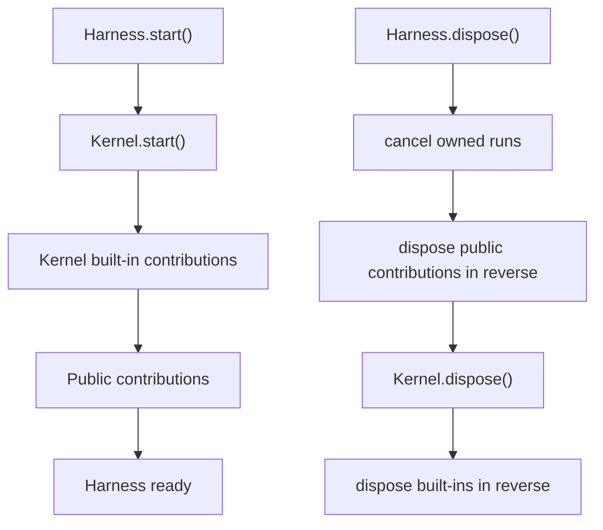
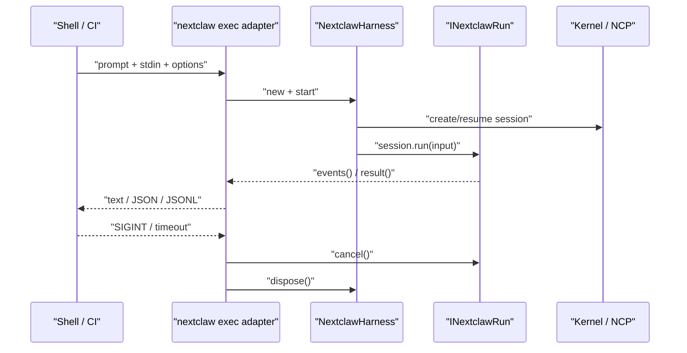

# NextClaw Harness SDK 接口方案

日期：2026-08-22
状态：已实现，待随本迭代交付
上位设计：[NextClaw Platform SDK 公共能力面设计](./2026-08-22-platform-sdk-public-surface.design.md)

## 1. 目的

本文只冻结首个可实现、可验证的 Harness SDK 合同，避免目标态设计在实施时被静默缩成一个 one-shot wrapper。

它回答八个问题：

1. 外部开发者安装和 `new` 的对象是什么。
2. Harness、Agent、Session、Run 的关系如何进入 TypeScript interface。
3. contribution 如何成为真实入口，而不是只存在于架构图里。
4. `runNextclawTask()` 与 `nextclaw exec` 如何复用同一条主链。
5. kernel、service、CLI 和公开 SDK 各自拥有什么职责。
6. Harness 是否内置 `NextclawKernel`，以及两者哪些能力相同、哪些边界不同。
7. public contribution 与现有 kernel contribution 是否是同一套机制，以及 effect 应承担什么职责。
8. 用什么低成本硬门防止设计、计划、代码和文档再次偏移。

本文已经完成 Review，并作为当前实现、external-consumer contract 与文档的验收依据。

## 2. 核心决定

### 2.1 包与构造入口

- 外部开发者只安装和导入 `@nextclaw/harness`。
- 用户直接 `new NextclawHarness(options)`，不提供 `createNextclawHarness()` 工厂。
- 实现类名是 `NextclawHarness`，公共 interface 名是 `INextclawHarness`。
- `NextclawHarness` 实现 `INextclawHarness`。
- `runNextclawTask()` 保留为 one-shot helper，但它内部只能 `new NextclawHarness()`，不得形成第二套执行逻辑。
- Harness feature 目录是 Kernel 内部实现边界，不形成 `@nextclaw/kernel` 的 package 子路径；`@nextclaw/harness` 是文档推荐的用户安装入口。

```ts
import {
  NextclawHarness,
  runNextclawTask,
  type INextclawHarness,
} from "@nextclaw/harness";

const harness: INextclawHarness = new NextclawHarness();
```

### 2.2 类与文件角色

- `NextclawHarness` 是进程内组合根和生命周期 owner，不叫 `Service`。
- kernel 内实现文件建议为 `features/harness/managers/nextclaw-harness.manager.ts`。文件使用 `manager` 角色是因为它拥有状态和资源；类名仍为 `NextclawHarness`。
- Agent、Session、Run live handle 分文件实现，避免把所有状态编排继续堆进一个大类。
- `services/` 只保留小而单一的宿主或传输能力，例如现有 `AgentRunClient`；不得用 `Service` 命名 Harness 组合根。

不保留 `NextclawHarnessService` 或 `createNextclawHarness` 兼容别名。它们尚未发布，现在保留只会制造新的历史债务。

### 2.3 通用生命周期原语的包边界

`EffectScope` 与 `Contribution` 不包含 NextClaw 产品语义，名称中不使用 `Nextclaw`。第一批不为它们单独创建 workspace package，而是在现有轻量共享包建立独立公共子入口：

```text
@nextclaw/shared
  ├── Disposer
  ├── EffectSetup
  ├── EffectScope
  ├── IContribution
  └── Contribution
```

约束：

- lifecycle 模块不得导入 NCP、Kernel、Harness、Agent、Session、Tool 或其它产品类型。
- `@nextclaw` 只是 npm 组织 scope；导出的类、interface 和类型保持通用命名。
- Kernel contribution 直接复用该基类；`@nextclaw/harness` 在其上增加 Harness 专属的 protected capability。
- 消费者只从 `@nextclaw/shared` 根公共入口导入，禁止 package 子路径和 deep import 源文件。
- 不把这些 API 再复制进 `@nextclaw/core`；现有 core disposable 转发保持原样，后续按真实迁移需求收敛。

暂不新增 `@nextclaw/lifecycle` 包的原因是：现有 `@nextclaw/shared` 已明确拥有跨包轻量原语职责，也已有 disposable primitives；为这一小组类型立即增加 package、版本、构建和发布单元不会减少当前复杂度。

满足以下任一条件后再提取独立包：

1. 需要脱离 `@nextclaw/shared` 的其它依赖单独发布或在 NextClaw 仓库外复用。
2. 出现三个以上相互独立的领域消费者，而不只是 Harness 与其内部 Kernel。
3. lifecycle 形成需要独立版本合同的模块族。

生命周期抽象由 `@nextclaw/shared` 根公共入口导出，不建立平行子路径入口。

## 3. Harness 与 Kernel 的关系

### 3.1 一个 Harness 默认拥有一个 Kernel

`NextclawHarness` 默认在内部创建并拥有一个 `NextclawKernel` 实例。它负责启动、关闭以及把公开 handle 连接到 Kernel 的现有产品语义，但不复制 Kernel 的状态机。

这不是“把 Kernel 换一个名字导出”，而是组合根与公共开发者表面的关系：

- Kernel 是产品语义和内部能力 owner，拥有 NCP、session journal、run state machine、Agent 配置与内部 manager graph。
- Harness 是进程内开发者入口和生命周期 owner，提供稳定、收敛、可演进的公共 façade。
- Harness 不公开 `.kernel`，也不导出 `AgentManager`、`EventBus`、`Ingress`、`SessionManager`、`ToolProviderManager` 等内部对象。
- 高级宿主如需替换环境依赖，应通过明确的 `NextclawHarnessOptions` 或后续 capability adapter 注入，不通过访问 Kernel 内部图完成。
- 将来可以支持传入受约束的 kernel host adapter 进行测试或特殊宿主集成，但不把具体 `NextclawKernel` 类型写入第一版公共合同。



### 3.2 一条内核，三种入口



约束：

- CLI 只拥有 argv/stdin、stdout/stderr、signal、format 和 exit code。
- Harness 拥有组合、agent/session/run handle 和 public contribution 生命周期；Kernel 继续拥有内建 contribution 生命周期。
- kernel 拥有产品语义、session journal、run 状态机、事件、取消和终态。
- service 只注入宿主路径、版本、活动记录等环境能力。

### 3.3 完整公共命名空间

Harness 顶层命名空间按开发者任务划分，不按 Kernel 的内部 manager 划分：

| 公共入口 | 定位 | Kernel 内部 owner | 第一批 |
| --- | --- | --- | --- |
| `agents` | Agent definition 与 agent-scoped handle | Agent/config owner | 实现 |
| `sessions` | 按 session identity 恢复与查询 | 唯一 session owner | 实现 resume；创建走 agent-scoped view |
| `contributions` | start 前登记并由 Harness 托管公共扩展 | Harness contribution registry | 实现核心组装能力 |
| `runTask()` | one-shot convenience | Session/Run 主链 | 实现 |
| `events` | 顶层便利事件 API，不替代 run events | Event bridge | 延后；本批先原样开放 `kernel.eventBus` |
| `diagnostics` | 健康状态、effect tree 与运行诊断 | Diagnostics owner | 延后 |
| `approvals` | 宿主参与审批与恢复 | Approval policy owner | 延后 |

`event bus / ingress / tool / context / model provider / runtime / MCP` 是 Agent 能否被外部平台真正组装的基础能力，本批必须进入公共 `IKernel`。其中 `eventBus` 与 `ingress` 原样引用 Harness 所属 Kernel 的唯一实例；其余 namespace 是薄 façade，不直接暴露 Kernel manager。`skill / storage / sandbox / channel / app` 继续按真实边界逐步开放。Contribution 在自己的 `setup()` 中通过 protected `this.kernel` 使用这些能力，并用 `this.effect()` 登记资源。

`NextclawSessionRegistry` 是唯一 session handle adapter。`harness.sessions` 提供按 identity 恢复，`agent.sessions` 是同一实现绑定 `agentId` 后的 create/resume view；不维护第二套 registry 或状态。

## 4. 第一批公共接口

下面的代码是本批实现合同，不是说明性伪代码。实现后的 external-consumer fixture 必须原样通过 TypeScript 检查。

### 4.1 Harness

```ts
export interface INextclawHarness {
  readonly agents: INextclawAgentRegistry;
  readonly sessions: INextclawSessionRegistry;
  readonly contributions: INextclawContributionRegistry;

  start(): Promise<void>;
  runTask(input: NextclawTaskInput): Promise<NextclawTaskResult>;
  dispose(): Promise<void>;
}

export class NextclawHarness implements INextclawHarness {
  constructor(options?: NextclawHarnessOptions);
}
```

生命周期：

- construction 只装配对象，不启动 kernel。
- contributions 在 `start()` 前注册。
- `start()` 幂等；失败时回滚已经取得的资源、丢弃失败的 Kernel 实例并回到 idle，下一次 start 使用同一 options 创建全新的 Kernel 后重试。
- `dispose()` 幂等；先取消并关闭 owned runs，再按逆序释放 contributions 和 kernel。
- dispose 后禁止再次 start、注册 contribution、获取 agent 或启动 run。

### 4.2 Capability 边界

第一批不提供维护成本高于真实价值的静态 capability catalog。`IKernel` 的结构类型就是当前可用能力合同；将来只有出现运行时可选宿主能力和真实协商需求时，才增加由实际 owner 驱动的 capability discovery，禁止维护一张与实现并行的硬编码清单。

### 4.3 Agent

```ts
export interface INextclawAgentRegistry {
  list(): readonly NextclawAgentDefinition[];
  get(agentId?: string): INextclawAgent;
  create(definition: NextclawAgentDefinition): Promise<INextclawAgent>;
}

export interface INextclawAgent {
  readonly id: string;
  readonly definition: NextclawAgentDefinition;
  readonly sessions: INextclawAgentSessions;
}
```

第一批语义：

- `get()` 不传 id 时返回配置中的默认 Agent。
- 指定不存在的 id 必须失败，不允许悄悄回退到默认 Agent。
- `create()` 写入该 Harness 所使用的配置空间；SDK 示例应显式使用隔离的 `homeDir`，避免误改用户主产品配置。
- Agent handle 不暴露 kernel `AgentManager`、config store 或 manager graph。

### 4.4 Session

```ts
export interface INextclawAgentSessions {
  create(input: NextclawSessionCreateInput): Promise<INextclawSession>;
  resume(sessionId: string): Promise<INextclawSession>;
}

export interface INextclawSessionRegistry {
  create(
    input: NextclawSessionCreateInput & { agentId: string },
  ): Promise<INextclawSession>;
  resume(sessionId: string): Promise<INextclawSession>;
}

export interface INextclawSession {
  readonly agentId: string;
  readonly sessionId: string;
  run(input: NextclawSessionRunInput): Promise<INextclawRun>;
}
```

第一批语义：

- `create()` 创建 durable session，并返回稳定 identity。
- `resume()` 只恢复已存在 session；不存在或归属其它 Agent 时明确失败。
- `harness.sessions.resume(sessionId)` 从持久化 identity 恢复；`agent.sessions.resume(sessionId)` 额外校验 session 属于该 Agent。
- `agent.sessions` 只是 `harness.sessions` 的 agent-scoped view，不保存第二份状态。
- 不允许用 `create()` 覆盖同 id 的既有 session。
- `run()` 在底层 run 被接受后返回 live handle，而不是等待整次任务完成后才返回。

### 4.5 Run

```ts
export interface INextclawRun {
  readonly agentId: string;
  readonly sessionId: string;
  readonly runId: string | null;
  readonly status: "running" | "completed" | "failed" | "cancelled";

  events(): AsyncIterable<NcpEndpointEvent>;
  result(): Promise<NextclawTaskResult>;
  cancel(): Promise<void>;
}
```

第一批语义：

- `runId` 来自 NCP 接受结果；slash command 没有真实 run，因此为 `null`。
- `events()` 是单消费者顺序流，必须包含底层公共 NCP event，不再包装 CLI 私有事件名。
- `result()` 与事件流观察同一个终态；completed 时返回 `nextclaw.task/v1`。
- failed/cancelled 时 `result()` 抛出带稳定 `code` 的 `NextclawHarnessError`。
- `cancel()` 进入现有 NCP abort ingress；不得直接修改内部 run 状态。
- Harness dispose 会释放仍在运行或仍被观察的 run，不把订阅和资源留给进程退出兜底。

## 5. Contribution 与 Effect 合同

### 5.1 为什么必须在第一批出现

Harness 的目标是让开发者构建自己的 Agent 后端。如果公共 interface 没有 contribution 入口，那么 provider/runtime/tool/skill 等扩展只能继续 deep import kernel manager，SDK 边界就不成立。

但第一批也不能一次性伪造所有扩展点。正确方式是冻结统一 ownership 形状，并只开放底层已有稳定注册能力的最小能力面。

### 5.2 同一抽象，两层生命周期 owner

现有 `KernelContribution` 的核心形状保持不变：

```ts
export type KernelContribution = {
  start: () => Promise<void> | void;
  dispose: () => Promise<void> | void;
};
```

Kernel 仍按现有方式顺序调用内建 contribution 的 `start()`、逆序调用 `dispose()`。`start()/dispose()` 的外部生命周期合同不变，不传递 contribution context，不用新的 Contribution Runtime 替换现有数组，也不重写 constructor 依赖图。

Public contribution 与 Kernel contribution 使用同一个 `Contribution + EffectScope` 生命周期抽象，但 owner 不同：

- Kernel 拥有固定的内建 contributions。
- Harness 拥有 SDK 开发者注册的 public contributions。
- Harness 先启动 Kernel，再顺序启动 public contributions；因此 public Tool contribution 能使用已经装配好的 Kernel capability adapter。
- Harness dispose 时先取消 live runs，再逆序释放 public contributions，最后 dispose Kernel 及其内建 contributions。
- public contribution 启动失败时，Harness 逆序回滚已经启动的 public contributions，并 dispose 本次启动的 Kernel。



这是父子生命周期，不是两套 contribution 机制；也不需要为 Harness 暴露 Kernel 私有 contribution registry。

### 5.3 Effect 是现有方式上的薄增强

Effect 不取代 `start()/dispose()`。每个 Contribution 内部拥有一个私有 `EffectScope`；轻量基类用 Template Method 区分框架生命周期和子类声明：`start()` 由基类统一实现，子类只实现 protected `setup()` 并在其中调用 `this.effect()`。

```ts
export type Disposer = () => Promise<void> | void;

export type EffectSetup = () =>
  | void
  | Disposer
  | Promise<void | Disposer>;

class EffectScope {
  register(setup: EffectSetup): Disposer;
  start(): Promise<void>;
  dispose(): Promise<void>;
}

export interface IContribution {
  start(): Promise<void> | void;
  dispose(): Promise<void> | void;
}

export abstract class Contribution implements IContribution {
  private readonly effectScope: EffectScope;

  protected abstract setup(): Promise<void> | void;

  protected effect(
    setup: EffectSetup,
  ): Disposer;

  start(): Promise<void>;
  dispose(): Promise<void>;
}
```

基类内部逻辑等价于：

```ts
async start(): Promise<void> {
  await this.setup();
  await this.effectScope.start();
}

async dispose(): Promise<void> {
  await this.effectScope.dispose();
}
```

语义保持简单：

1. Kernel 或 Harness 只调用基类 `start()`，Contribution 作者不重写它。
2. 基类 `start()` 保证幂等并调用一次子类 `setup()`。
3. 子类 `setup()` 通过 `this.effect()` 把 effect definition 登记到私有 `EffectScope`，此时不创建活资源。
4. setup 完成后，`EffectScope.start()` 按登记顺序启动 effects；每个 effect setup 必须把相应 cleanup 作为 disposer 返回给 scope。没有活资源时可以返回 `void`。
5. 任一 effect 启动失败时，`EffectScope` 逆序回滚已经启动的 effects。
6. `this.effect()` 返回一个稳定、幂等的 disposer：effect 启动前调用会撤销登记，启动后调用会提前释放该 effect。
7. Contribution 的 `dispose()` 委托 `EffectScope` 按逆序调用尚未释放的 disposers；已经提前释放的 effect 不会重复执行 cleanup。
8. `setup()` 必须只声明 effects，不直接创建未被 effect 接管的活资源；失败回滚后 scope 清空 definitions，Contribution 回到 idle，允许重新执行 setup/start。

`setup()` 不是第二个公共生命周期入口，而是 protected hook。它不接收 context，也不允许外部调用。第一批只有每个 Contribution 自己的一层 `EffectScope`，不引入嵌套 child scope、动态 service graph、hot reload、公开状态 handle、effect tree 或 quiescence 协议。

第一批 effect 不要求 label。当前没有 effect tree 或单 effect diagnostics 消费这个名字，强制命名只会增加样板；以后出现真实诊断需求时再评估可选 metadata。

现有内建 contribution 可以渐进改为 `extends Contribution`。构造方式和 Kernel 调用点保持原样，只把子类原有 `start()` 主体改名为 protected `setup()`，并用 `this.effect()` 代替手写 cleanup 数组：

```ts
export class ToolProviderContribution extends Contribution {
  constructor(private readonly kernel: NextclawKernel) {
    super();
  }

  protected setup = (): void => {
    for (const provider of this.createToolProviders()) {
      this.effect(() =>
        // manager.register() 返回的函数就是该 effect 的 cleanup
        this.kernel.toolProviderManager.register(provider),
      );
    }
  };
}
```

### 5.4 Public contribution 形状

公共 SDK 维持 class + interface 规范，但不暴露 context。下面的 `Contribution` 位于 `@nextclaw/harness`，内部继承 `@nextclaw/shared` 根入口导出的同名通用基类：

```ts
import { Contribution as BaseContribution } from "@nextclaw/shared";

export interface IKernel {
  readonly eventBus: EventBus;
  readonly ingress: Ingress;
  readonly tools: IToolRegistry;
  readonly context: IContextRegistry;
  readonly models: IModelRegistry;
  readonly runtimes: IRuntimeRegistry;
  readonly mcp: IMcpRegistry;
}

export interface IToolRegistry {
  register(tool: NcpTool): Disposer;
}

export interface IContextRegistry {
  register(provider: ContextProvider): Disposer;
}

export interface IModelRegistry {
  registerProvider(plugin: ProviderCatalogPlugin): Disposer;
  listProviders(): readonly ProviderSpec[];
  chat(input: ModelChatInput): Promise<LLMResponse>;
  chatStream(input: ModelChatInput): AsyncIterable<LLMStreamEvent>;
}

export interface IRuntimeRegistry {
  registerProvider(provider: AgentRuntimeProviderRegistration): Disposer;
  registerEntry(entry: AgentRuntimeEntry): Disposer;
  listSessionTypes(
    params?: AgentRuntimeSessionTypeDescribeParams,
  ): Promise<AgentRuntimeSessionTypeCatalog>;
}

export interface IMcpRegistry {
  registerServer(
    name: string,
    definition: McpServerDefinition,
  ): Promise<Disposer>;
  listServers(): readonly McpServerRecord[];
  listTools(filter?: McpCatalogFilter): readonly McpToolCatalogEntry[];
  callTool(input: McpToolCallInput): Promise<unknown>;
}

export abstract class Contribution extends BaseContribution {
  readonly id: string;
  readonly version?: string;

  protected readonly kernel: IKernel;

  protected constructor(options: {
    id: string;
    version?: string;
  });
}

export interface INextclawContributionRegistry {
  register(contribution: Contribution): Disposer;
  list(): readonly NextclawContributionDescriptor[];
}
```

Harness 在 contribution 注册后、start 前通过 package-local binding 一次性绑定受限 `IKernel`。绑定不可被开发者调用、重复覆盖或跨 Harness 复用。`IKernel` 是稳定 façade，不是具体 `NextclawKernel`；开发者不能访问 manager graph，也不接收临时 context 参数。

首批能力的边界是：

- `eventBus` 是 Kernel 持有的同一个 `EventBus` 实例，直接使用 shared 的 `eventKeys`、typed key 和订阅 disposer；Harness 不复制事件、监听器或 event vocabulary。
- `ingress` 是 Kernel 持有的同一个 `Ingress` 实例，既可调用已有 `ingressKeys`，也可用 shared 的 typed key 注册扩展 handler；Harness 不增加第二套路由表。

- `tools` 注册单个 `NcpTool`；façade 内部适配成现有 `ToolProvider`，不暴露 `ToolProviderManager`。
- `context` 注册现有 request-scoped `ContextProvider`，让外部平台能注入 workspace、检索或业务上下文。
- `models` 同时提供 provider catalog 注册与模型调用；注册项进入 Harness 所属 Kernel 的独立 provider registry，并在卸载时恢复，不修改进程全局 registry。
- `runtimes` 分开注册 runtime provider 与 runtime entry。provider 决定怎样创建执行器，entry 决定 Agent 可选择的 runtime identity；二者都必须可卸载。
- `mcp` 注册的是 Harness 生命周期内的临时 server definition。它与持久化配置合并后仍走现有 `McpRegistryService / McpServerLifecycleManager`，卸载时关闭连接并恢复配置，不写入用户配置文件。

所有注册 API 返回统一 `Disposer`。底层异步卸载会被包装成异步 disposer；`EffectScope` 因此可以统一处理同步与异步资源。相同 id/name 的覆盖必须明确失败，不允许悄悄替换内建或配置项。

```ts
import { Contribution } from "@nextclaw/harness";

class WorkspaceContribution extends Contribution {
  constructor() {
    super({ id: "acme.workspace-tools", version: "1.0.0" });
  }

  protected setup = (): void => {
    this.effect(() =>
      this.kernel.tools.register({
        name: "read_business_context",
        parameters: { type: "object", properties: {} },
        execute: async () => ({ projectId: "p-123" }),
      }),
    );

    this.effect(() =>
      this.kernel.context.register({
        provide: async (request) => [
          `Business context for ${request.agentId ?? "default"}`,
        ],
      }),
    );
  };
}

const harness = new NextclawHarness({ homeDir: "/isolated/nextclaw" });
harness.contributions.register(new WorkspaceContribution());
await harness.start();
```

生命周期约束：

- contribution id 在一个 Harness 内唯一。
- 第一批只允许 start 前注册，不支持运行中 hot-install。
- `register()` 返回的 disposer 只用于 start 前撤销登记；运行后由 Harness 生命周期统一释放。
- Harness dispose 时先逆序释放 public contributions，再进入 Kernel 内建 contribution 的逆序释放。
- Contribution 作者不重写 `start()/dispose()`；常规和特殊资源都通过 `this.effect()` 登记，由基类统一处理。

### 5.5 Durable facts 与 live effects

| 对象 | 类型 | Harness dispose 时 |
| --- | --- | --- |
| Agent definition / 配置 | Durable fact | 保留，除非开发者显式删除 |
| Session journal / message | Durable fact | 保留，可由新 Harness resume |
| Contribution registration | Live effect | 逆序卸载 |
| Tool/runtime/provider instance | Live effect | 随所属 contribution scope 卸载 |
| Event subscription / observer | Live effect | 取消并等待关闭 |
| In-flight run / abort binding | Live effect | 先取消，再等待终止和释放 |

### 5.6 能力矩阵

| 能力 | 本批状态 | 公共入口 | 说明 |
| --- | --- | --- | --- |
| Event bus | 必须实现 | `this.kernel.eventBus` + `eventKeys` | 原样透出 Kernel 唯一实例；`on/once/subscribeAll` 返回 disposer |
| Ingress | 必须实现 | `this.kernel.ingress` + `ingressKeys/createTypedKey` | 原样透出 Kernel 唯一实例和路由表，不建立 Harness ingress |
| Tool | 必须实现 | `this.kernel.tools.register(NcpTool)` | 单工具适配到现有 request-scoped provider |
| Context | 必须实现 | `this.kernel.context.register(ContextProvider)` | 直接复用现有 request-scoped contract |
| Model / Provider | 必须实现 | `this.kernel.models.registerProvider/listProviders/chat/chatStream` | Kernel-local provider catalog，不污染进程全局 registry |
| Runtime | 必须实现 | `this.kernel.runtimes.registerProvider/registerEntry/listSessionTypes` | 公共 NCP runtime provider 与 entry 分层，内部完成 Kernel adapter |
| MCP | 必须实现 | `this.kernel.mcp.registerServer/listServers/listTools/callTool` | lifecycle-scoped overlay，不写持久配置 |
| Skill | 延后 | 保留 `this.kernel.skills` 命名空间 | 当前主要是文件系统发现，不伪装成动态 registry |
| Storage | 延后 | 保留 `this.kernel.storage` 命名空间 | 需先冻结 durable session/journal owner |
| Sandbox | 延后 | 保留 `this.kernel.sandboxes` 命名空间 | 需与 tool execution policy 对齐 |
| Channel / App | 延后 | 由 extension/app SDK 承担 | 不反向塞进第一版 Harness |

“保留命名空间”只指设计方向；未实现的字段不得提前出现在 TypeScript interface 中。

### 5.7 外部设计借鉴

- DeepSeek Harness / Cordis 的 [Fiber](https://github.com/deepseek-ai/deepseek-harness/blob/master/docs/cordis-api/fiber.md)：只借鉴 effect 返回 disposer、失败回滚和逆序 teardown；不照搬 effect label。
- OpenCode V2 [In-process SDK](https://opencode.ai/v2/docs/build/sdk)：只借鉴宿主 close 时统一释放 scoped plugin registrations 的 ownership。

NextClaw 保留已有 `start()/dispose()` 外部生命周期模型，只增加无参数的 protected `setup()` hook；不采用 Cordis context、字符串 service locator 或动态依赖重载。

## 6. 完整开发者路径

```ts
import { NextclawHarness } from "@nextclaw/harness";

const harness = new NextclawHarness({
  homeDir: "/isolated/nextclaw",
});

await harness.start();

try {
  const agent = harness.agents.get("researcher");
  const session = await agent.sessions.create({
    task: "研究并总结这个项目",
    workspace: "/workspace",
  });
  const run = await session.run({ input: "先给出风险清单" });

  for await (const event of run.events()) {
    renderProgress(event);
  }

  const result = await run.result();
  console.log(result.text);
} finally {
  await harness.dispose();
}
```

当调用方只持有持久化 session identity 时，不需要先猜 Agent：

```ts
const session = await harness.sessions.resume(savedSessionId);
const run = await session.run({ input: "继续上一轮工作" });
```

一次性 helper：

```ts
const result = await runNextclawTask({
  agentId: "researcher",
  input: "给出风险清单",
});
```

`runNextclawTask()` 必须等价于创建 Harness、start、选择/创建 session、run、result、finally dispose。

## 7. `nextclaw exec` 映射



CLI 不直接调用 kernel manager，不自己关联 event/result，也不实现第二套取消状态机。

## 8. 错误与版本合同

第一批错误码：

- `invalid_input`
- `cancelled`
- `lifecycle`
- `runtime_failure`

后续增加 `capability_unavailable`、`policy_denied`、`conflict` 前，需要有对应真实能力和恢复动作；不提前堆枚举。

结果 envelope 保持：

```ts
type NextclawTaskResult = {
  schemaVersion: "nextclaw.task/v1";
  status: "completed";
  kind: "agent" | "command";
  agentId: string;
  sessionId: string;
  runId: string | null;
  text: string;
  completedMessage: NcpMessage | null;
};
```

## 9. 兼容边界

必须保持：

- 现有 `nextclaw agent` 参数、session、输出和交互行为不变。
- server、UI、Desktop、channel、cron 和持久化格式不变。
- `@nextclaw/kernel` 根导出不删除、不重命名。
- Harness 使用现有 kernel/NCP 主链，不复制 agent loop、journal 或 event vocabulary。
- 现有 Kernel contribution 的启动与释放顺序保持不变；引入基类 effect 后必须有定向回归。

不承诺：

- 尚未发布的 WIP API，包括 `NextclawHarnessService` 和 `createNextclawHarness`。
- skill/storage/sandbox contribution 已在第一批可用。
- App Server、远程 Client SDK、structured output 和 approval handler 已完成。
- 同一 session 并发 run 的新语义。

## 10. 防偏移的最小制度化硬门

不增加新的长流程，只增加一个可执行合同和一张短矩阵。

### 10.1 External-consumer fixture

仓库内维护一个只从 `@nextclaw/harness` 导入的 TypeScript fixture，至少编译以下路径：

```text
new NextclawHarness
  -> contributions.register(new PlatformContribution())
  -> kernel.eventBus/ingress/tools/context/models/runtimes/mcp
  -> start
  -> agents.get/create
  -> harness.sessions.resume
  -> agent.sessions.create/resume
  -> session.run
  -> run.events/result/cancel
  -> dispose
```

fixture 不是示例装饰，而是 public API 验收测试。接口实现不匹配时，`tsc` 必须失败。

### 10.2 Capability matrix

每个 public SDK 批次只维护本文第 5.6 节这类矩阵：`必须实现 / 延后 / 不做`。实施计划不得静默把“必须实现”降成“延后”；需要降级时必须先更新设计并由用户 Review。

### 10.3 委派边界

- 主代理负责冻结 public interface、fixture 和验收矩阵。
- 子代理只实现已冻结的内部部分。
- 当实现规模小于沟通与复核成本时，不委派。
- Review 顺序固定为：先编译 external fixture，再检查行为合同，最后检查内部可维护性。

这三条应沉淀到开发流程 skill 的正确阶段 owner，不写入常驻 `AGENTS.md`，不新增一次性治理脚本。

## 11. 实施切片

Review 通过后按以下顺序实现：

1. 清理当前 WIP 中与本文冲突的 factory、Service 命名和窄 interface。
2. 冻结 `@nextclaw/harness` exports 与 external-consumer fixture。
3. 保持 Kernel 现有 contribution 主链，增加 Template Method `Contribution` 基类、无参数 `setup()` 与 `this.effect()`，原样开放 Kernel 的 `eventBus / ingress`，再接入 public `tools / context / models / runtimes / mcp` capability façade。
4. 实现 Agent、Session、Run handles，以及 live event/result/cancel。
5. 让 `runNextclawTask()` 和 `nextclaw exec` 走 handle 主链。
6. 运行 public-surface、TypeScript、contract tests、package build、CLI smoke 和旧能力回归。
7. 更新文档站一级“开发者”模块，只描述已经通过验证的能力。

## 12. 已确认决定

1. Harness 默认内部拥有一个 Kernel，但不公开 `.kernel` 或 manager graph。
2. 第一批顶层命名空间为 `agents / sessions / contributions`；`harness.sessions` 与 `agent.sessions` 委托同一个 SessionRegistry，静态 capability catalog 不进入公共 API。
3. 保持现有 `start()/dispose()` 主链，由基类实现它们；子类只实现无参数 protected `setup()` 并调用 `this.effect()`，不引入 context 或独立 Contribution Runtime。
4. public contribution 使用 protected `this.kernel: IKernel`；`IKernel` 只暴露稳定 capability namespace，不是具体 `NextclawKernel` 或 manager graph。
5. contribution 第一批开放 Kernel 原实例 `eventBus / ingress`，以及薄适配的 `tools / context / models / runtimes / mcp`；`skill / storage / sandbox` 延后。
6. `agents.create()` 可以写入 Harness 所指向的配置空间；示例默认使用隔离的 `homeDir`。
7. `events()` 第一批使用单消费者 AsyncIterable。
8. slash command 作为 `runId: null` 的 `kind: "command"` run result 暴露。
9. 删除尚未发布的 `createNextclawHarness()` 与 `NextclawHarnessService`。
