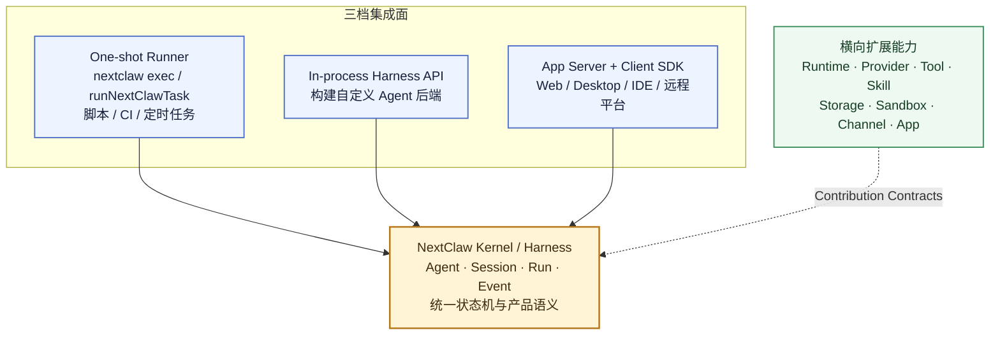
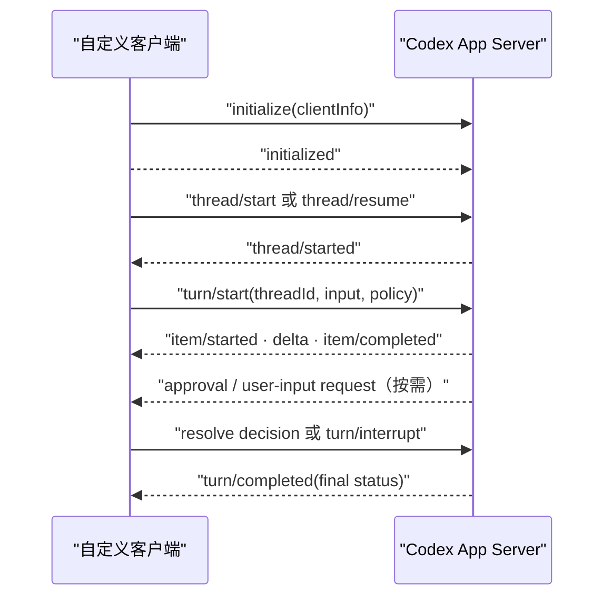

# NextClaw Platform SDK 公共能力面设计

日期：2026-08-22

## 1. 文档目的

本文回答两个问题：

1. 外部开发者预期怎样基于 NextClaw 构建自己的 Agent 产品或平台？
2. 为支持这些用户路径，NextClaw 应稳定导出什么，不应导出什么？

本文冻结能力边界、对象模型、稳定性分级和第一版 package 入口。首个 headless 纵向切片验证后，公共安装入口确定为轻量的 `@nextclaw/harness`；核心实现由 `@nextclaw/kernel` 根公共入口承载。方法与参数仍为 experimental，后续依据真实消费者逐步稳定。

## 2. 目标用户与任务

Platform SDK 的目标用户不是“想 import 任意 NextClaw 内部代码的人”，而是以下四类开发者。

### 2.1 自动化开发者

希望在脚本、CI、定时任务或后端 job 中：

- 提交一次 Agent 任务。
- 获取结构化进度和最终结果。
- 设置超时、取消、权限与工作目录。
- 不管理完整 UI 或长期进程。

### 2.2 Agent 产品开发者

希望把 NextClaw agent loop 嵌入自己的应用进程：

- 选择 provider / runtime。
- 注册 tool、skill、context、sandbox 和 approval policy。
- 创建或恢复 agent/session。
- 启动 run、消费事件、取消、恢复并释放资源。
- 使用自己的数据库、业务对象、界面和用户体系。

### 2.3 Agent 平台开发者

希望把 NextClaw 作为独立的本地或远程 Agent 服务：

- 管理多个 agent、session 和并发 run。
- 通过稳定协议接收事件、处理 approval、执行 interrupt / resume。
- 让 Web、Desktop、IDE、移动端或内部控制台成为自定义 client。
- 不与 kernel 内部对象图同进程耦合。

### 2.4 能力扩展开发者

希望新增 provider、runtime、tool、skill、channel、storage、sandbox 或 app，而不 fork NextClaw 主干。

这四类任务相关但不相同，不能用一个无限膨胀的 SDK class 同时承载。

## 3. 外部参考调研

### 3.1 Codex：最值得参考的集成层分级

OpenAI 在 2026-08-19 发布 [Codex as a platform: build on the open agent harness](https://learn.chatgpt.com/blog/codex-as-a-platform)，把 Codex 的开放 agent harness 明确为可嵌入平台能力。

其关键结论：

- 可复用中心是 agent loop，而不是 CLI 或聊天界面。
- harness 负责 conversation state、stream execution、tool use、sandbox、approval 和跨 turn 连续性。
- 应用拥有自己的界面、业务上下文、业务记录、工具和高风险动作的产品控制。
- 一次性任务使用 `codex exec`。
- 常规程序化任务使用 Codex SDK。
- 深度产品嵌入使用 app-server protocol。

[Codex SDK](https://learn.chatgpt.com/docs/codex-sdk) 的高层对象只有 `Codex -> Thread -> run/resume`；[Codex app-server](https://learn.chatgpt.com/docs/app-server) 则提供更完整的 thread / turn / item 生命周期、事件、interrupt、approval 和 JSON-RPC 协议。

对 NextClaw 的启示：

- 必须区分“高层易用 SDK”和“低层完整控制协议”。
- SDK 应围绕少量领域 handle，而不是导出内部 manager。
- NextClaw 自身的 UI / CLI / Desktop 应 dogfood 同一 harness 或 server contract。
- 应用业务语义与 agent execution semantics 必须分开。

不直接照搬：

- Codex 主要面向 coding thread；NextClaw 面向多 runtime、渠道、automation 和个人操作层，领域词汇应继续使用 NCP 的 agent / session / run，而不是机械改成 thread / turn。

### 3.2 OpenCode：最值得参考的 server-first dogfooding

[OpenCode Server](https://dev.opencode.ai/docs/server/) 是 headless HTTP server；TUI 本身是 server client，OpenAPI 3.1 spec 同时用于生成 SDK。[OpenCode SDK](https://github.com/anomalyco/opencode/blob/dev/packages/web/src/content/docs/sdk.mdx) 可以启动 server + client，也可以只连接现有 server，并公开类型化 session、event、provider、file 等 API。

对 NextClaw 的启示：

- 产品入口与 headless server 使用同一协议，是防止行为分叉的强机制。
- server contract 应是 schema-first 或至少可以稳定生成 schema / client types。
- SDK 应同时支持“托管本地 runtime”和“连接已有 runtime”。

不直接照搬：

- OpenCode SDK 基本镜像全部 server API，甚至包含 TUI 控制面。它适合作为同产品 client SDK，但不等于最小稳定 harness API。
- NextClaw 不应把 UI/TUI 私有操作、文件浏览等所有 server endpoint 都提升为 Platform SDK 核心合同。

### 3.3 DeepSeek Harness：最值得参考的可组合能力与所有权

[DeepSeek Harness](https://www.deepseek.com/harness/en/) 当前处于 developer preview，官方明确说明 API 会继续演进。它基于 Cordis，把 model、tool、skill、session、sandbox、storage、loop、scheduling 和 UI 都建模为 plugin。

其架构中值得参考的部分：

- append-only session event log 是模型可见事实的单一来源，resume / fork / replay 共用同一事件流。
- `Agent` 是公共 handle，具体 `agent-loop` 实现对消费者隐藏。
- 创建 agent 返回 owned handle + disposer；只有 owner 能完整释放 agent、session、订阅和 scoped resources。
- extension 依赖公共 `Agent` contract，不依赖 concrete loop。
- 同进程 plugin、headless profile 和 out-of-process JSON-RPC SDK 是不同集成层。

对 NextClaw 的启示：

- 公共 API 应导出 capability interface / handle，不导出具体 manager / loop implementation。
- `create/resume` 必须同时定义 ownership、失败回滚和 `dispose`。
- session journal、事件流和 live handle 要有清晰一致的身份与生命周期。
- 可替换 loop / runtime 应通过 contract 接入。

不直接照搬：

- “Everything is a plugin”会削弱 NextClaw kernel 作为产品语义唯一 owner；NextClaw 应保持稳定 kernel 主干，只把真实可替换能力建模为 contribution。
- DeepSeek Harness 仍是 preview；其 SDK server 当前也明确存在 session close、prompt cancel 和 per-prompt result 等缺口，不能把它当作成熟兼容基线。

## 4. 总体结论：一个内核，三档集成面，一条扩展轴

NextClaw Platform SDK 不应是一个大包，而应是同一产品语义上的多档集成面：



三档集成面：

1. **One-shot runner**：最少生命周期管理，适合脚本、CI 和 automation。
2. **In-process Harness API**：同进程装配、运行和扩展 agent，适合构建自己的后端产品。
3. **App Server Protocol + Client SDK**：跨进程完整控制，适合 Web、Desktop、IDE、远程平台和多语言 client。

Extension contract 是横向能力轴，不是第四个调用层。它让上述三种入口使用同一套 provider/runtime/tool/skill 等能力。

## 5. 应用与 Harness 的责任边界

### 5.1 Host application 拥有

- 用户、租户、账号、组织和业务权限。
- 业务对象、数据库记录和系统 of record。
- 页面、工作台、审批界面和产品交互。
- 业务动作何时触发 Agent、给 Agent 哪些上下文。
- 哪些业务结果被接受、发布或写回外部系统。
- 业务级限额、计费和运营策略。

### 5.2 NextClaw Harness 拥有

- agent/session/run 的创建、恢复、取消和释放。
- agent loop、context assembly、tool dispatch 和 runtime routing。
- 模型可见 session journal、stream event 和状态转换。
- sandbox / approval / permission 的执行原语与可观察协议。
- compaction、retry、interrupt、resume 和失败语义。
- contribution 的注册、作用域、依赖和生命周期。

### 5.3 具体 contribution 拥有

- provider/runtime/channel 等第三方协议细节。
- tool 的真实执行逻辑。
- storage / sandbox 的具体实现。
- 自己创建的连接、进程、订阅和资源释放。

Harness 提供通用执行政策和 contract；host application 决定业务政策；具体 contribution 执行实现私有行为。

## 6. 公共对象模型

以下是需要稳定的概念，不代表最终 TypeScript 命名已经冻结。

### 6.1 Harness

进程内组合根，负责：

- 注册或装配 contributions。
- `start` / readiness。
- 提供 agent/session 入口。
- 暴露全局诊断和能力目录。
- `dispose` 并等待所有 owned resources quiescent。

Harness 不能向用户暴露内部 manager graph。

### 6.2 Agent Definition 与 Agent Handle

- `AgentDefinition` 是可持久/可声明的 agent 配置快照，例如 identity、runtime route、默认 model、tools/skills 和 policy references。
- `AgentHandle` 是一个 live agent 的受控能力句柄，包含稳定 identity、status、session creation/resume 和事件订阅。
- handle 不允许调用方直接修改内部 store 或替换 manager。

### 6.3 Session Handle

表示持久会话事实与 live conversation 的统一身份：

- create / get / resume / fork / archive。
- append input / start run。
- list/read durable events or messages。
- 不直接暴露 journal store 实现。

### 6.4 Run Handle

一次正在执行或已完成的 Agent 工作：

- 稳定 `runId`、`sessionId`、status。
- async event stream。
- `cancel` / `steer` / result。
- 明确终态：completed / failed / cancelled / interrupted。
- result 与事件流对同一终态保持一致。

### 6.5 Contribution Definition

面向 provider、runtime、tool、skill、context、storage、sandbox、channel 等真实扩展点：

- 明确 capability id 和 version。
- 声明依赖、配置 schema、生命周期和作用域。
- 返回 disposer 或由注册 owner 持有 teardown capability。
- 依赖稳定 contract，不依赖 concrete kernel manager。

### 6.6 Event 与 Error

- 公共事件必须是 discriminated union，具有 version、agent/session/run identity、timestamp 和稳定 payload owner。
- durable fact、live progress、approval request 和 diagnostic 不混成一个无类型事件袋。
- 公共错误区分 invalid input、capability unavailable、policy denied、runtime failure、cancelled、conflict 和 internal failure。
- 错误不能要求消费者解析 CLI 文案或内部 stack 才能判断恢复动作。

## 7. 预期开发者体验草图

先展示外部产品截至 2026-08-22 的真实使用方式，再给出 NextClaw 的目标草图。外部示例用于理解心智模型，不代表 NextClaw 应复制其命名或实现。

### 7.1 Codex：从一条命令逐步下钻

Codex 的第一层是 [`codex exec`](https://learn.chatgpt.com/docs/non-interactive-mode)。开发者不需要理解 thread / turn / item，直接把它当作可管道调用的程序：

```bash
# 默认：进度写 stderr，最终回复写 stdout
codex exec "检查这个仓库并给出风险摘要" > summary.md

# JSONL：stdout 输出 thread / turn / item 等结构化事件
codex exec --json "运行测试并解释失败原因" | jq

# 延续既有会话
codex exec resume <SESSION_ID> "继续修复刚才发现的问题"
```

当开发者需要在 Node.js 程序中控制同一能力时，使用 [`@openai/codex-sdk`](https://github.com/openai/codex/tree/main/sdk/typescript)。它把心智压缩为 `Codex -> Thread -> run`；同一 `Thread` 重复 `run()` 即继续会话，丢失进程内对象后可按 thread id 恢复：

```ts
import { Codex } from "@openai/codex-sdk";

const codex = new Codex();
const thread = codex.startThread({ workingDirectory: "/workspace" });
const { events } = await thread.runStreamed("定位失败测试并提出修复方案");

for await (const event of events) {
  if (event.type === "item.completed") render(event.item);
}

await thread.run("实施刚才的方案");
```

这个 SDK 并不是另一套 agent runtime：TypeScript SDK 在本地启动 Codex CLI，通过 stdin/stdout 交换 JSONL；Python SDK 则控制本地 app-server JSON-RPC。值得借鉴的是“高层对象很少、底层能力同路”，不是 subprocess 这一具体实现。

### 7.2 Codex App Server：富客户端拥有协议循环

当开发者要构建 Web、Desktop 或 IDE，而不只是等待一次 `run()` 返回时，Codex 提供 [App Server](https://learn.chatgpt.com/docs/app-server)。客户端需要自己持有连接、状态映射、审批界面和通知消费：



这里公开的是 thread / turn / item 状态机和双向协议，而不是内部 Rust manager。它适合“我要做自己的 Codex 产品界面”，但相较高层 SDK，调用方也必须承担更多连接与产品状态责任。

下面是一段接近真实产品接入方式的最小 Node.js 客户端。它直接启动 `codex app-server`，完成握手、创建 thread、开始 turn、渲染流式文本并响应命令审批：

```ts
import { spawn } from "node:child_process";
import readline from "node:readline";

const server = spawn("codex", ["app-server"], {
  stdio: ["pipe", "pipe", "inherit"],
});
const lines = readline.createInterface({ input: server.stdout });

let nextId = 1;
const pending = new Map<number, (result: unknown) => void>();
let finishTurn!: (turn: unknown) => void;
const turnFinished = new Promise<unknown>((resolve) => { finishTurn = resolve; });

function send(message: unknown) {
  server.stdin.write(`${JSON.stringify(message)}\n`);
}

function request(method: string, params: unknown): Promise<any> {
  const id = nextId++;
  send({ id, method, params });
  return new Promise((resolve) => pending.set(id, resolve));
}

lines.on("line", async (line) => {
  const message = JSON.parse(line);

  // 普通 request / response
  if (message.id && !message.method && pending.has(message.id)) {
    pending.get(message.id)!(message.result);
    pending.delete(message.id);
    return;
  }

  // 像“弹幕”一样持续到来的 server notifications
  if (message.method === "item/agentMessage/delta") {
    process.stdout.write(message.params.delta);
  }
  if (message.method === "item/started") {
    renderPendingItem(message.params.item);
  }
  if (message.method === "item/completed") {
    commitAuthoritativeItem(message.params.item);
  }

  // 这是 server -> client request，必须用同一个 id 回应
  if (message.method === "item/commandExecution/requestApproval") {
    const decision = await showApprovalDialog(message.params);
    send({ id: message.id, result: { decision } });
  }

  if (message.method === "turn/completed") {
    finishTurn(message.params.turn);
  }
});

await request("initialize", {
  clientInfo: { name: "my_product", title: "My Product", version: "0.1.0" },
});
send({ method: "initialized", params: {} });

const { thread } = await request("thread/start", {
  cwd: "/workspace",
  model: "gpt-5.6-terra",
});

await request("turn/start", {
  threadId: thread.id,
  input: [{ type: "text", text: "运行测试并修复失败原因" }],
  approvalPolicy: "unlessTrusted",
  sandboxPolicy: {
    type: "workspaceWrite",
    writableRoots: ["/workspace"],
    networkAccess: false,
  },
});

const finalTurn = await turnFinished;
renderTerminalState(finalTurn);
server.kill();
```

为突出协议结构，上面省略了 error response、进程异常、请求超时和 graceful shutdown；正式 client 必须补齐。审批示例也不应无条件 accept，而应把 `command`、`cwd`、`reason` 和 `availableDecisions` 映射到当前 thread/turn 的产品界面。

正式接入也不需要手写全部消息类型；Codex 可以从当前安装版本生成匹配的 TypeScript 或 JSON Schema：

```bash
codex app-server generate-ts --out ./schemas
codex app-server generate-json-schema --out ./schemas
```

一次 turn 的实际 JSONL 流，概念上会像下面这样逐行到达。字段只保留理解 UI 所需的部分：

```jsonl
{"id":2,"result":{"thread":{"id":"thr_123"}}}
{"method":"thread/started","params":{"thread":{"id":"thr_123"}}}
{"method":"turn/started","params":{"turn":{"id":"turn_456","status":"inProgress"}}}
{"method":"item/started","params":{"item":{"id":"item_1","type":"commandExecution","command":"pnpm test","status":"inProgress"}}}
{"id":91,"method":"item/commandExecution/requestApproval","params":{"threadId":"thr_123","turnId":"turn_456","itemId":"item_1","command":"pnpm test","cwd":"/workspace"}}
{"id":91,"result":{"decision":"accept"}}
{"method":"item/completed","params":{"item":{"id":"item_1","type":"commandExecution","status":"completed","exitCode":0}}}
{"method":"item/agentMessage/delta","params":{"delta":"测试已经通过。"}}
{"method":"item/completed","params":{"item":{"id":"item_2","type":"agentMessage","text":"测试已经通过。"}}}
{"method":"turn/completed","params":{"turn":{"id":"turn_456","status":"completed"}}}
```

这里有两个重要细节：delta 只负责即时渲染，`item/completed` 才是 item 的权威最终状态；审批不是普通 notification，而是带 `id` 的反向 request，客户端不回应，turn 就无法继续。

### 7.3 DeepSeek Harness：先选择 composition，再运行 session

DeepSeek Harness 的用户首先选择或修改一个 Cordis profile。官方 [headless 示例](https://github.com/deepseek-ai/DeepSeek-Harness/blob/master/examples/headless-agent/README.md) 使用 `headless` profile 完成一次任务：

```bash
dsh --profile headless "修复这个工作区里失败的测试"
```

这个入口会创建并持久化一个新 session、打印最终 assistant 文本后退出。其示例中的 canonical event JSONL 目前是测试设施，并非稳定 CLI 输出合同，因此不能假设它已经等价于 `codex exec --json`。

程序化调用使用 [`deepseek-harness-sdk`](https://github.com/deepseek-ai/DeepSeek-Harness/blob/master/docs/user/guide/python-sdk.md)。SDK 会懒启动随包分发的 JSON-RPC runtime；context manager 退出时释放进程。复用同一个 harness 与 session id，会继续 durable conversation，并保留 session-owned shell 状态：

```py
from deepseek_harness import DeepSeekHarness

with DeepSeekHarness(
    provider="deepseek-official",
    model="deepseek-v4-flash",
    cwd="/workspace",
    session_root="/sessions",
    cordis="agent.cordis.yml",
) as harness:
    result = harness.run(
        "检查并修复失败测试",
        session_id="project-123",
    )

print(result.final_response)
```

DeepSeek Harness 与 Codex 最大的体验差异发生在扩展层。开发者通过 Cordis plugin 向共享 context 注册服务、工具和事件，再用 YAML profile / patch 组合产品，而不是向一个固定 `HarnessOptions` 填完所有实现：

```ts
import type { Context } from "@deepseek-ai/cordis";
import { defineTool } from "@deepseek-ai/dsh-tools";

export const inject = ["tools"];

export function apply(ctx: Context) {
  ctx.tools.register(defineTool({
    name: "lookup_order",
    description: "查询订单状态",
    parameters: { orderId: { type: "string", required: true } },
    output: {
      schema: { type: "string" },
      render: (_args, value) => [{ type: "text", text: value }],
    },
    execute: async (args) => lookupOrder(args.orderId),
  }));
}
```

插件的 registration、event listener 和 resource effect 会随插件卸载而撤销；profile 决定 model adapter、tools、persistence、sandbox、approval、agent loop 和 UI 的最终组合。它的优势是高度可替换，代价是开发者必须理解 context、service dependency、plugin lifecycle 和 composition 配置。

### 7.4 开发者体验对照与 NextClaw 取舍

| 维度 | Codex | DeepSeek Harness | NextClaw 决定 |
| --- | --- | --- | --- |
| 最简入口 | `codex exec`，成熟的管道、JSONL、schema 和 resume 体验 | `dsh --profile headless`，以一次任务和最终文本为主 | 提供 `nextclaw exec`，补齐文本、JSON、NDJSON、resume/cancel 和稳定退出分类 |
| 高层 SDK | `Codex -> Thread -> run/runStreamed` | `DeepSeekHarness -> run(session_id)` | `Harness -> Agent -> Session -> Run`；另提供 one-shot helper |
| 本地 runtime | TS SDK 包装 CLI；Python SDK包装 app-server | Python SDK 管理随包分发的 JSON-RPC runtime | 托管方式可以变化，但公共 handle 与结果语义不能随进程模型变化 |
| 富客户端 | App Server 暴露 thread / turn / item 和双向 request | ACP / JSON-RPC 示例面向自动化 client | App Server + Client SDK 共享 agent / session / run / event contract |
| 状态延续 | thread id + 持久化 session | session id + append-only JSONL log；可保留 session-owned shell | session identity 与 durable journal 是唯一恢复依据，不依赖 CLI 当前状态 |
| 扩展方式 | SDK options、MCP、skills、dynamic tools 与 server capability | model、tool、storage、sandbox、loop、UI 都是 Cordis plugin | 只把真实变化点做成 contribution；kernel 产品语义不是可随意替换的 plugin |
| 生命周期 | 高层 SDK 弱化进程细节，协议层显式管理连接 | context manager、plugin effect 和 disposer 很明确 | Harness / Agent / Run 都明确 ownership、cancel 与 dispose |
| 稳定性现状 | CLI、SDK、App Server 已形成清晰层级 | developer preview，官方声明会有 breaking changes | 借鉴原则和真实用例，不把外部 preview API 当兼容基线 |

最终取舍是：NextClaw 的第一眼体验应接近 Codex——简单任务只需一条命令或一个 `runNextClawTask()`；当开发者需要构建完整 Agent 后端时，再逐层显露 Agent、Session、Run、Event 和 Contribution。扩展的 ownership、disposer 和能力组合学习 DeepSeek Harness，但保持稳定 kernel 主干，避免让普通 SDK 用户先理解整个插件树。

以下 NextClaw 代码只验证心智和能力闭环，不冻结最终包名与方法名。

### 7.5 NextClaw 同进程嵌入

```ts
const harness = await createNextClawHarness({
  storage,
  policy,
});

harness.contributions.register(runtimeContribution);
harness.contributions.register(toolContribution);

await harness.start();

try {
  const agent = await harness.agents.create({
    name: "researcher",
    runtime: "my-runtime",
  });

  const session = await agent.sessions.create({
    workspace: "/workspace",
  });

  const run = await session.run({
    input: [{ type: "text", text: "完成这项研究" }],
  });

  for await (const event of run.events()) {
    renderProgress(event);
  }

  const result = await run.result();
  persistBusinessResult(result);
} finally {
  await harness.dispose();
}
```

### 7.6 NextClaw 跨进程产品接入

```ts
const client = new NextClawClient({ transport });

const session = await client.sessions.create({ agentId, workspace });
const run = await client.runs.start({
  sessionId: session.id,
  input,
});

for await (const event of client.runs.events(run.id)) {
  if (event.type === "approval.requested") {
    await client.approvals.resolve(event.approvalId, decision);
  }
}
```

### 7.7 NextClaw 一次性自动化

```ts
const result = await runNextClawTask({
  agent: "researcher",
  input,
  outputSchema,
  signal,
});
```

或等价 CLI：

```bash
nextclaw exec --agent researcher --output json "完成这项研究"
```

这些体验必须共享同一个 kernel intent 和 run state machine，而不是三套实现。

### 7.8 `nextclaw exec` 一等能力

`nextclaw exec` 不是普通交互式 CLI 的便捷别名，而是 Platform SDK 面向 shell、CI、定时任务和其它 Agent 编排器的一等 one-shot runner。它与 `runNextClawTask` 共享同一个应用级 intent，并最终落到 Harness 的 session/run 状态机；禁止在 CLI 内再实现一套 agent loop、tool dispatch、重试或结果聚合。

职责边界：

- CLI 拥有参数与 stdin 解析、stdout/stderr 分流、信号转换、输出渲染和进程退出码。
- Harness / kernel 拥有 agent 解析、session 创建或恢复、run 生命周期、事件、审批、取消和终态。
- runtime、provider、tool、skill 与 sandbox 继续通过同一 contribution contract 装配；`exec` 不建立专用扩展体系。

第一版合同至少应覆盖：

1. **非交互输入**：支持位置参数或 stdin，不依赖 TTY，不在后台等待不可见的选择题或确认框。
2. **明确执行目标**：可选择 agent；session 创建与恢复使用显式参数，不根据历史终端状态隐式猜测。
3. **三种输出面**：面向人的默认文本、只输出最终结构的 JSON，以及逐事件输出的 NDJSON；机器模式的 stdout 必须保持纯净，诊断信息只写 stderr。
4. **稳定结果 envelope**：至少包含 schema version、agent/session/run identity、terminal status、result 或公共错误分类，使调用方不必解析自然语言。
5. **流式与背压**：NDJSON 直接映射公共 event vocabulary，不能发明 CLI 私有事件名；慢消费者和管道关闭必须产生可判定结果。
6. **取消与超时**：OS signal、调用方 `AbortSignal` 和超时最终进入同一 run cancellation 语义，并返回可区分于 runtime failure 的终态。
7. **Headless 审批政策**：无审批处理器时不得无限挂起；默认行为及显式 policy 参数必须可预测、可审计。
8. **稳定退出分类**：成功、输入/配置错误、策略拒绝、运行失败、取消和内部错误需要可机读区分；具体数值映射在实现前单独冻结。

建议的能力对应关系是：

```text
nextclaw exec
  -> CLI adapter
  -> runNextClawTask(options)
  -> Harness session.run(...)
  -> RunHandle events / result / cancel
```

首版优先完成本地执行和管道合同；远程 `exec` 后续复用 App Server + Client SDK，不在 CLI 中新增第二套远程协议。参数名称仍可随实现验证调整，但以上语义和 owner 不应漂移。

## 8. 应稳定导出的内容

### 8.1 Stable 候选

- identity：`AgentId`、`SessionId`、`RunId`、`CapabilityId`。
- input/output DTO：agent definition、session create/resume、run input/result。
- public handles：Harness、Agent、Session、Run 的最小能力接口。
- lifecycle：start/readiness/dispose、cancel/interrupt/resume。
- public event union、status、approval request/decision。
- public error codes 和恢复分类。
- runtime-neutral NCP contract。
- client transport contract 与版本握手。

### 8.2 Experimental 候选

- 自定义 agent loop。
- context compaction strategy。
- storage、sandbox、scheduler 和 policy provider。
- pre-step / request interception。
- 高级 multi-agent orchestration hooks。
- 运行时诊断和内部 trajectory inspection。

Experimental 必须走明确子入口或标记，不能与 stable 根入口混在一起。

### 8.3 Internal，禁止作为 Platform SDK 导出

- concrete manager / store / repository / controller / service。
- kernel composition graph 和构造参数搬运类型。
- 内部 event bus keys、RxJS subject、callback wiring。
- server route handler、CLI command controller、UI/TUI state。
- journal 文件路径、数据库 schema 和缓存实现。
- 具体 provider/channel/runtime 的私有 SDK 类型。
- 仅为测试 fixture 或 workspace deep import 服务的类型。
- 没有 semver、文档、contract test owner 的 `export *`。

内部消费者需要这些内容时，应修正 owner 或增加窄的正式 contract，不应把 internal 直接升级为 public。

## 9. 发布边界候选

### 方案 A：直接清理 `@nextclaw/kernel` 根入口

优点：包少，概念直接。

问题：当前根入口已包含大量不同稳定性的导出；直接清理会制造大规模 breaking change，并让实现包继续承担外部 semver 压力。

### 方案 B：`@nextclaw/kernel` 根入口

优点：不新增 package，可先验证公共面。

问题：kernel 根入口仍然容易被误当成公共 SDK；稳定性和品牌心智不够清晰。

### 方案 C：独立 `@nextclaw/harness` 公共 facade

优点：

- 明确区分公共 contract 与 kernel implementation。
- 可以独立控制 semver、文档和 exports。
- facade 对外只暴露 handles / DTO / contributions，内部仍可直接组合 kernel owner。
- 与 `@nextclaw/client-sdk`、`@nextclaw/extension-sdk` 形成清晰层级。

约束：facade 应保持轻量，允许只做白名单转发；它的价值是拥有安装入口、公共类型、semver、文档与导出合同，而不是复制 kernel 逻辑。必须用导出快照和外部消费者验证防止它演变为任意转发层。

### 当前决定

采用双层入口：

1. `@nextclaw/harness` 是外部开发者安装和导入的唯一 Harness package 入口。
2. `@nextclaw/kernel` 根入口承载实现；Harness feature 内部目录仅是实现边界，不形成 package 子路径。
3. facade 只做显式白名单导出，不复制状态、生命周期、错误或 run 语义。
4. 外部示例、文档和 contract test 只依赖 `@nextclaw/harness`，防止用户对 kernel 实现包形成不必要耦合。

这个 package 即使当前主要是转发，也拥有独立价值：它隔离 kernel 的内部演进，并为未来稳定化提供独立 semver 和文档 owner。

## 10. 协议与 SDK 的一致性要求

In-process Harness API 与 App Server Protocol 不要求类和方法完全相同，但必须共享：

- agent/session/run identity。
- run state machine 与终态。
- event vocabulary 和顺序不变量。
- approval / cancel / interrupt / resume 语义。
- error classification。
- capability discovery 与版本协商。

App Server Protocol 应支持 schema generation；Client SDK 的 DTO 应从 server/kernel contract 生成或直接复用，不能手工复制第二份。

协议必须显式处理：

- initialize / version / capabilities handshake。
- start / resume / fork session。
- start / steer / cancel run。
- progress、durable event、approval 和 terminal result。
- backpressure、disconnect、reconnect 和 event resume cursor。
- graceful shutdown 和 owned resource disposal。

## 11. 渐进执行阶段

### Phase 0：Public surface inventory

- 盘点 kernel、NCP、client SDK、server contract 当前导出。
- 标记 stable candidate / experimental / internal / duplicate。
- 找出 agent-session-run 纵向链的 deep imports 和平行 DTO。

退出条件：得到第一版最小 contract 清单，不修改外部 API。

### Phase 1：Experimental Harness 闭环

- 提供 provisional public entry。
- 建立 headless external-consumer 示例。
- 跑通 create/resume session、run、stream、cancel、result、dispose。
- 示例不依赖 CLI、server、UI 或内部 alias。

退出条件：示例能稳定运行，并暴露真实 API 缺口。

### Phase 2：内部 dogfooding

- 落地 `nextclaw exec` 与 `runNextClawTask`，验证文本、JSON、NDJSON、取消、超时、headless 审批和退出分类。
- 让 CLI one-shot runner、server 和至少一个内部产品入口调用同一 kernel intent / run state machine。
- 删除旧 facade、平行 manager、重复 event/DTO。

退出条件：脚本与 CI 可以稳定调用 `nextclaw exec`，且同一能力只有一条产品语义主链路。

### Phase 3：App Server Protocol 收敛

- 对齐 handshake、session/run/event/approval/cancel/resume。
- 生成 schema 与 client types。
- 验证断线恢复、event cursor、backpressure 和版本不匹配。

退出条件：独立 client 不依赖内部实现即可完成富客户端闭环。

### Phase 4：Stable 发布

- 冻结 package / subpath。
- 建立 semver、API report、contract tests、迁移指南和 starter。
- stable 根入口不再混入 experimental/internal。

退出条件：独立仓库使用公开发布 packages 完成北极星示例，并通过版本升级验证。

## 12. 第一版最小闭环与非目标

第一版只保证：

- 一个 runtime / provider route。
- agent definition。
- session create/resume。
- run start/stream/cancel/result。
- tool/skill 基础 contribution。
- approval request/decision。
- lifecycle dispose。

第一版不保证：

- 任意替换所有 kernel 子系统。
- 多租户平台、计费和 RBAC。
- 所有 NextClaw server endpoint 都进入 Platform SDK。
- UI components、query/store 或 marketplace 管理 API。
- 跨语言 SDK 全覆盖。
- 当前所有 kernel 根导出继续兼容。

## 13. 设计验证标准

1. 新开发者只看 starter 和 public types 即可完成最小 Agent 应用。
2. 示例代码不出现 manager/store/controller、内部 alias 或 deep import。
3. 同一 session/run 可从 in-process API 与 client protocol 观察到一致状态和事件。
4. cancel、approval、failure 和 dispose 都有明确终态，不依赖超时猜测。
5. 自定义 runtime/tool 只依赖公共 contribution contract。
6. NextClaw 自身至少两个入口使用同一主链路。
7. public API report 能检测未经设计的导出增长。
8. `nextclaw exec` 的机器输出可直接管道消费，取消、错误和退出状态不依赖解析人类文案。

## 14. 仍需由真实示例回答的问题

- `@nextclaw/harness` 中哪些 experimental API 已具备升级为 stable 的证据。
- `AgentHandle` 与 `SessionHandle` 是否都需要 live object，还是 session 可以保持纯 service API。
- storage、sandbox、approval policy 哪些进入第一版 stable，哪些先 experimental。
- durable event 与 live progress 是否共用 envelope，还是保持两个订阅通道。
- App Server Protocol 采用现有 HTTP/WebSocket contract，还是增加更完整的 JSON-RPC/stdin 本地协议。
- 多语言 SDK 的 schema owner 和生成工具。

这些问题必须用 Phase 1 示例、现有 NextClaw dogfooding 和外部消费者反馈回答，不靠继续扩写抽象设计猜测。

## 15. 关联文档

- [NextClaw 后台职责边界设计](./2026-08-22-backend-responsibility-boundaries.design.md)
- [项目路线图](../ROADMAP.md)
- [NextClaw Client SDK 方案设计](../plans/2026-05-06-nextclaw-client-sdk-design.md)
- [NextClaw Extension SDK 方案设计](../plans/2026-05-08-nextclaw-extension-sdk-design.md)
- [NCP Session-Centric Agent Backend](../plans/2026-03-17-ncp-session-centric-agent-backend-design.md)
