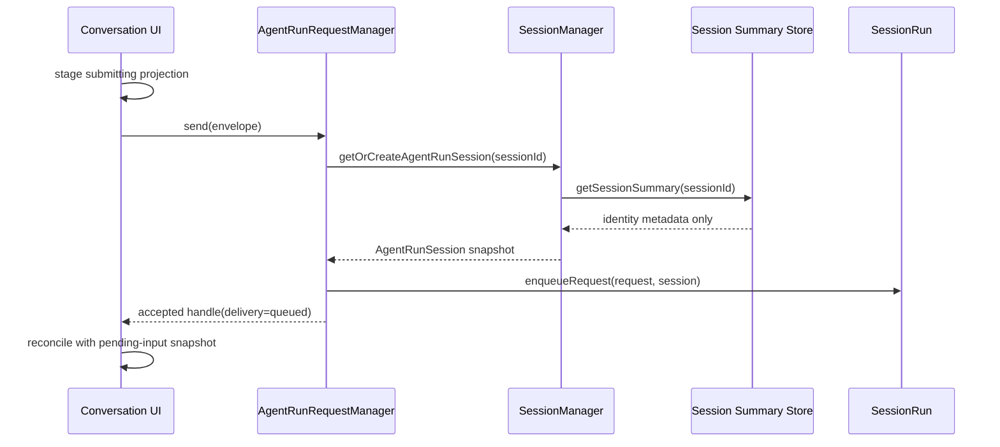

# Session Run 排队准入延迟修复设计

## 背景与可观察问题

本设计补充 [Session 级消息排队后端化设计](./2026-07-22-session-run-queue.design.md) 与 [聊天历史大工具载荷分级加载设计](./2026-08-19-chat-heavy-tool-payload-loading.design.md)。前者已经确定 `SessionRun` 是排队事实 owner，后者已经确定 `getSessionRecord` 是读取 canonical messages 的重操作入口，摘要、存在性和旁路读取不得回放完整 journal。

当前用户在 AI 运行中继续发送消息时，输入框会立即出现“正在加入队列…”，但该状态可能持续数秒。Codex、DeepSeek harness 与 OpenCode 等产品能够先在本地受理后续输入，再异步完成传输确认，因此这不是模型或工具执行边界的固有限制。

2026-08-24 的真实开发实例证据：

- 目标会话约 101 条消息，但 canonical journal 已约 104 MB；
- 空闲且缓存稳定时，`pending-inputs` 请求约 8ms；
- 前端临时排队投影必须等待 `agent.send()` 返回，再等待一次 pending-input refresh，之后才清除 submitting 状态；
- `AgentRunRequestManager.sendOnce()` 在真正调用 `SessionRun.enqueueRequest()` 前先调用 `getOrCreateAgentRunSession()`；
- 已有 session 的 `getOrCreateAgentRunSession()` 先 `getSessionRecord()`，再调用内部仍会 `getSessionRecord()` 的 `getAgentRunSession()`；
- journal cache 命中时 `getSession()` 仍会 `structuredClone` 完整 record；运行事件落盘后还会删除该 session cache，下一次读取会读取、解析并 replay 整份 journal。
- 将该 journal、metadata 和 message projection 复制到隔离目录后，每次使用独立冷进程执行修前等价的两次 full-record read，三次分别耗时 3903ms、3783ms、3674ms；修后真实 `SessionManager.getOrCreateAgentRunSession()` 组装链路五次分别耗时 8ms、4ms、5ms、4ms、5ms。

因此，本次问题不是队列调度阻塞，而是“排队准入所需的轻量身份事实”错误依赖了“完整消息历史恢复”。长会话和运行中持续写事件共同放大了这条错误依赖。

## 用户任务与成功标准

用户在一个 Agent 正在回复、推理或执行命令时发送下一条消息，应立即看到内容被受理进入该会话的排队区；后台确认成功后无缝切换为可编辑、可删除、可插话的权威排队项，失败时恢复原草稿并显示错误。

成功标准：

- 已有长会话的普通排队准入不读取、复制、解析或 replay canonical messages；
- `SessionRun.enqueueRequest()` 仍是唯一权威入队点，FIFO、运行快照和失败语义不变；
- 前端继续在请求返回前展示临时 submitting 投影，不能等待服务端后才首次反馈；
- 服务端确认后仍以 kernel pending-input snapshot 为准，不让前端临时投影成为第二份队列事实；
- 新会话 materialization、已有会话、运行中排队、prefer-steer、刷新恢复和失败回滚语义不变；
- 真实 100MB 级会话的已有 session identity 读取与排队准入不再随 journal 体积线性增长。

## 当前 owner 与违反点

| 事实                         | 正确 owner                                     | 当前违反点                                             |
| ---------------------------- | ---------------------------------------------- | ------------------------------------------------------ |
| active run 与 pending inputs | `SessionRun`                                   | 无，继续保留                                           |
| 排队调度与 accepted handle   | `AgentRunRequestManager`                       | 入队前要求 canonical session record                    |
| session runtime 身份快照     | `SessionManager` + summary/metadata projection | `getAgentRunSession()` 读取包含全部 messages 的 record |
| canonical transcript 恢复    | journal store                                  | 被准入旁路误用                                         |
| submitting 展示              | conversation pending-input hook                | 无，继续作为未确认临时投影                             |
| 已确认队列展示               | kernel pending-input snapshot                  | 无，继续作为权威 consumer                              |

命中的架构原则：

- `information-expert`：Agent runtime 身份只需要 session ID、agent ID、runtime、model、project root、working directory、thinking effort 与 metadata；summary/metadata projection 已拥有这些事实。
- `single-complete-owner`：队列仍只归 `SessionRun`，不新增前端 durable queue 或独立 admission manager。
- `minimal-responsibility-surface`：准入不能为取得身份而携带或复制 messages。
- `cqs-pure-read`：轻量身份读取只读 summary/metadata，不触发 journal replay 或投影修复。
- `simple-structure-first`：在 `SessionManager` 内复用一个纯映射函数即可，不新增 service、registry、adapter 或缓存层。

## 候选方案

### A. 只调整前端文案或延迟显示 spinner

可以隐藏等待感，但后端仍在入队前复制或回放 104MB journal；长会话的发送、观察投递、context/tool provider 等调用仍受同一错误依赖影响。淘汰。

### B. AgentRunSession 从 summary/metadata 轻量物化

`SessionManager.getAgentRunSession()` 与 `getOrCreateAgentRunSession()` 读取 `journalStore.getSessionSummary()`，用同一个纯映射把 summary 转成 `AgentRunSession`。已有 session 只读一次 summary；不存在才进入原有 create path。canonical `getSessionRecord()` 继续只服务确实需要 messages 的调用者。

采用该方案。它修复共同根因，不改变队列协议、状态 owner、持久化格式和 UI 失败语义。

### C. 在 SessionRun 或 AgentRunRequestManager 复制一份 session identity cache

热路径可达 O(1)，但会新增 metadata/model/project root/working directory 的第二 owner，并引入设置更新、刷新和多入口一致性问题。当前 summary/metadata projection 已足够轻量，没有证据支持新缓存。淘汰。

## 推荐主链路

实现约束：

1. `getAgentRunSession()` 不得调用 `getSessionRecord()` 或读取 message projection payload。
2. `getOrCreateAgentRunSession()` 对已有 session 只执行一次 summary read，并与 `getAgentRunSession()` 复用同一映射。
3. 映射继续使用现有 `SessionWorkingDirResolver`、`readProjectRoot()` 和 `readThinkingEffort()`，不在调用方重新解释 metadata。
4. summary 不存在时仍走原有 create path；summary 读取自身失败必须显式失败，不能用 catch-all 自动创建同 ID session。
5. 前端 submitting 状态继续表示“服务器尚未确认”，确认后仍等待权威 pending snapshot 完成交接；本次不通过假定成功隐藏真实网络失败。

## 状态与生命周期矩阵

| 场景                      | 行为                                                    | 事实 owner                      | 失败/恢复                                    |
| ------------------------- | ------------------------------------------------------- | ------------------------------- | -------------------------------------------- |
| 新会话首次发送            | 原有 create/materialize 后启动 run                      | `SessionManager` / `SessionRun` | 创建失败恢复草稿                             |
| 已有空闲会话              | summary 物化 identity，立即开始                         | `SessionRun`                    | 发送失败保留错误语义                         |
| 已有运行中会话            | summary 物化 identity，内存 FIFO 入队                   | `SessionRun`                    | submitting 失败恢复草稿                      |
| prefer-steer              | identity 读取后沿现有 capability 判定                   | active runtime / `SessionRun`   | 不可插话时按现有合同回退排队                 |
| stop / run error          | pending input 按现有调度继续或回队                      | `SessionRun`                    | 不改变                                       |
| 刷新 / 重进               | 前端重新读取 kernel pending snapshot                    | `SessionRun` API                | 临时 submitting 不跨页面伪持久化             |
| 旧 journal / summary 缺项 | summary store 现有 projection recovery 返回最小 summary | summary store                   | 真不存在才创建；不在准入路径 replay messages |

## 抽象审计

保留：

- `SessionRun`、`AgentRunRequestManager`、`SessionManager`、summary store 和现有 pending-input projection；
- 一个 `SessionManager` 内部的纯 summary-to-runtime-session 映射，用于消除两条入口的重复与双读。

删除：

- AgentRunSession identity 路径对 `getSessionRecord()` 的依赖；
- 已有 session 的第二次身份读取。

延后：

- durable pending queue、独立 admission service、额外 identity cache、HTTP accepted-event 协议；当前问题不需要这些能力。

不新增兼容或 fallback。summary store 已是当前 canonical session catalog 读取入口，内部切换不涉及外部消费者迁移。

## 验证标准

1. SessionManager 定向测试证明：已有 session 的 `getAgentRunSession()` 和 `getOrCreateAgentRunSession()` 返回完整 runtime identity，且不会调用 journal store 的 full-record `getSession()`。
2. Kernel queue 回归证明：运行中第二条消息仍返回 `delivery: queued`，队列 FIFO 与 active run 不变。
3. 前端现有测试证明：后端未确认前立即出现 submitting row；确认后刷新并切换为权威队列；失败恢复草稿。
4. 使用隔离或只读 benchmark 对 100MB 级 journal 测量 identity read，证明耗时不再与 canonical journal 大小线性相关。
5. 触达 package 的定向 Vitest 与 TypeScript `tsc` 通过；最终 diff-only maintainability 检查无未关闭 finding。

## 非目标与文档边界

- 不改变队列是否跨服务重启持久化；
- 不改变 Enter、Command/Ctrl+Enter、编辑、删除、插话与 Stop 交互；
- 不清理或压缩用户现有 104MB journal；
- 不通过重启当前 NextClaw 宿主验证；优先热更新或隔离实例；
- 用户文档已承诺“运行中消息立即排队”，本次是恢复既有承诺的性能修复，不新增用户功能入口，因此无需改写功能说明。

本设计属于 `docs/designs`：owner、主链路与跨层验证已经冻结；不另建 `docs/plans`，实现批次单一且可在本次任务内直接完成。
