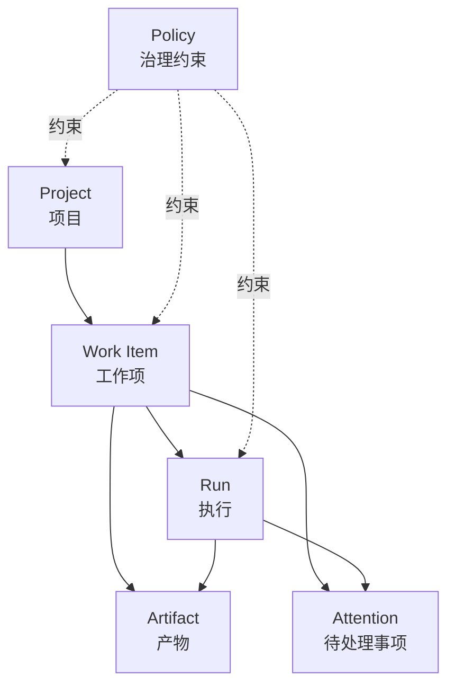
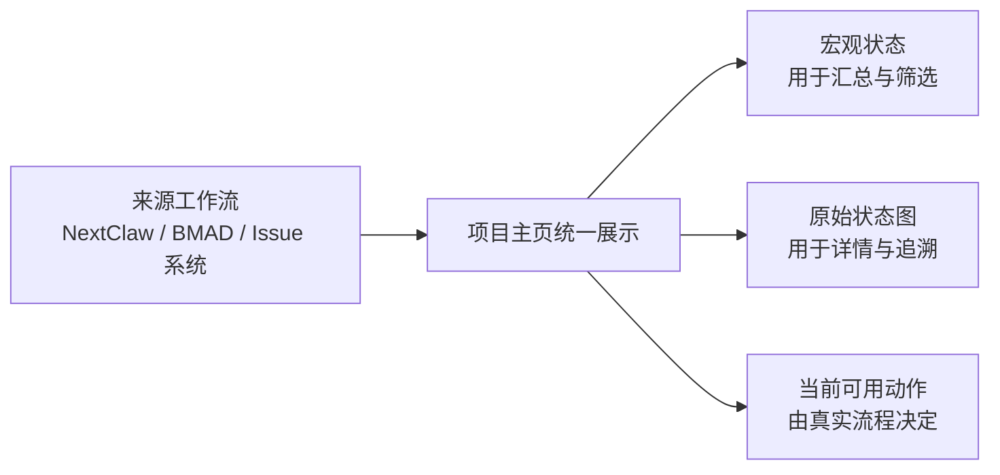

# 项目治理主页设计

> 代表场景与排序依据见：[项目治理代表场景梳理与评估](../thoughts/2026-08-26-project-governance-representative-scenarios.thought.md)。该场景集合用于检验通用模型，不构成产品场景边界。
>
> 本文保留探索过程；第一版的最终功能取舍见：[项目治理主页 V1 功能范围决策](2026-08-26-project-governance-hub-v1-scope.design.md)。
>
> **当前实现依据已升级为：[只读项目观测 V1 设计](2026-08-30-read-only-project-observer-v1.design.md)。** 本文下方的六对象、`Policy` 和可写治理设想仍按历史探索原貌保留，不再代表当前裁决；当前版本只从配置、文件、AI 显式 Marker 和现有只读接口生成项目投影。

## 设计状态

- design-document: required
- plan: required（仅在用户确认原型并进入实现后创建）
- 当前阶段：交互与信息架构原型，尚未进入产品实现
- HTML 原型：[`2026-08-25-project-governance-hub.prototype.html`](2026-08-25-project-governance-hub.prototype.html)

## 用户任务

用户从项目优先的任务列表进入某个项目，为了从项目层面理解和治理 AI 工作，能够查看项目概况、任务、文件、项目 Skills 与自动化，并能继续最近工作或发起一个绑定该项目的新任务。

## 当前证据

- 侧边栏已有项目优先模式，项目行负责展开和收起会话，hover 后提供新建任务与置顶。
- 项目 hover 卡片只提供路径、会话数量和定时任务数量，不可交互。
- 手机端不能把 hover 作为唯一发现路径。
- 会话工作台已有概览、子会话、定时任务、项目文件等页签，但它们属于当前会话，不是独立项目主页。
- 服务端已有注册项目列表与会话上下文下的 Skills 投影；当前没有独立项目主页或项目详情投影。
- 全局 Skills 页面解决技能发现与安装；本设计只负责当前项目自己的 `.agents/skills`。

## 推荐的信息架构

项目由侧边栏中的“任务分组”升级为可导航对象，但仍保留原有展开任务能力。

项目主页第一版包含：

1. 概览：显示可直接证明的项目事实和最近工作。
2. 工作：把要完成的结果与最近执行放在同一视图，避免让用户在任务和运行记录之间来回拼接状态。
3. 产物：查看进入工作链路的设计、计划、实现结果与验证证据，并能追溯来源。
4. 文件：只读浏览项目文件；任务中的文件处理仍归会话工作台。
5. Skills：只读查看项目 Skills、状态、说明、路径与资源结构。
6. 自动化：查看绑定项目的定时任务及运行状态。

Skills 是首个重点治理视角，但不是项目主页本身。项目主页为后续规则、知识、质量、成本、风险与交付状态预留统一位置；首版不为这些未来维度增加空标签或通用扩展槽。

## 通用项目治理模型

### 核心判断

项目主页不绑定 NextClaw 当前开发 lifecycle，也不绑定 BMAD 的 Epic、Story 或具名 Agent。底层先收敛为六个通用对象，再由 NextClaw lifecycle、BMAD 或其它工作方法把自己的事实投影进来。

这六个对象服务同一个用户问题：**这个项目正在做什么、由谁或什么推进、产生了什么、哪里需要我处理、项目遵循什么约束。**

### 首要范围原则：通用 AI 项目模型

**NextClaw 应该建立通用的 AI 项目模型，既能承载 NextClaw 自己的开发体系，也能投影 BMAD、其它 Agent 流程，甚至非开发项目。**

开发项目是首个高要求验证样本，不是产品边界。研究、内容创作、市场发布、个人知识整理、运营和其它长期项目都应该复用同一组 Project、Work Item、Run、Artifact、Attention 与 Policy，只替换来源工作流和领域产物。

因此：

- 通用对象和用户文案不使用 `CodeTask`、`PullRequestStage` 等开发专属命名。
- Work Item 的目标和描述不假设最终结果是代码；Artifact 可以是研究结论、文章、图片、数据表、审批记录或外部结果。
- Run 的执行者可以是编码 Agent、研究 Agent、内容 Agent、自动化或人机协作流程。
- 工作流节点、必需交付和状态转移由项目采用的方法提供，开发 lifecycle 只是一种可插拔来源。
- 项目主页不能出现只有开发项目才能满足的必填字段；开发专属信息作为来源属性或 Artifact 关系下钻。
- 首版也不为追求通用性提供任意字段或页面搭建器；先冻结用户真正需要的共性能力，再用至少一个非开发工作样本审计命名和界面。

### 产品边界：项目治理能力独立成立

这里讨论的“通用”首先是**产品能力通用**：用户面对不同类型的项目，都可以使用相同的项目主页、工作组织、流程查看、产物追溯和人工介入体验，而不是每个场景重新做一套产品。

- 没有 Agent 时，这些产品能力仍然有意义；Agent 是可能的参与者，不是产品成立的前提。
- 软件开发、研究、内容、设计和运营可以有不同术语与流程，但应由同一组产品能力组合表达。
- 通用不等于把所有能力全部平铺，也不等于做一个无限配置的平台；默认体验保持精简，复杂能力按项目需要出现。
- 首版继续以只读概览和治理为主，后续是否开放创建、编辑和执行，按用户链路逐项决定。

技术上如何解耦、存储和接入 Agent 暂不在本轮展开，只保留一条边界：项目治理产品不应以 Agent 内核为使用前提。

### 1. Project：持久项目上下文

Project 表示一个可以被长期识别和治理的项目，而不是侧边栏里的临时分组。

- 拥有稳定身份、显示名称和状态。
- 项目可以关联目录、Agent 工作、仓库或外部平台，但没有这些关联时仍然是完整项目。
- 聚合工作项、执行引用、产物、待处理事项和治理约束。
- 不复制其它对象的业务状态，只提供项目范围和导航上下文。
- 可以独立存在，也可以从 NextClaw 当前项目、目录或外部平台进入；来源不同不改变用户对项目主页的基本使用方式。

### 2. Work Item：要完成的结果

Work Item 表示项目里一个有明确结果边界的工作单元，可以来自目标、任务、Issue、Story 或 Spec。

- 至少能够回答标题、目标、当前状态、更新时间和所属项目。
- 一个 Work Item 可以经历多次 Run，也可以跨多个会话继续推进。
- 会话不是天然的 Work Item；只有能够识别出稳定目标和生命周期时，才把会话关联到工作项。
- 外部方法保留自己的原始类型和状态；通用投影只回答规划中、进行中、等待处理、完成或终止等用户问题，具体状态枚举在数据源调查后再冻结。
- Work Item 可以引用一个有版本的工作流定义；没有可靠定义时只展示当前原始状态和历史事实，不由 UI 猜测完整流程。

### 3. Run：一次执行记录或引用

Run 表示某个人、Agent、自动化或外部系统为一个 Work Item 发起的一次推进或执行。

- 记录执行者类型、来源、开始与结束时间、可观察状态、结果和可选的继续入口。
- 一个 Run 可以包含子 Agent、子会话或多次工具调用，但这些不自动升级为新的 Work Item。
- 执行状态必须来自可靠事实，不根据最后一条聊天文案猜测。
- 会话只是可选的来源引用。没有 Agent 会话时，人工作业、外部流程或导入记录仍可形成 Run。

### 4. Artifact：可追溯的项目产物

Artifact 表示能够承载意图、决策、执行结果或验证证据的持久对象，例如 PRD、设计、计划、研究结论、文章、图片、数据表、代码变更、测试报告、Review 记录和发布结果。

- 必须具有明确角色、来源、更新时间和与 Work Item / Run 的关系。
- 项目里的普通文件不是天然的 Artifact；只有进入工作链路并承担上下文或证据角色时才成为产物。
- Artifact 保留真实路径或来源引用，项目主页不复制正文成为第二份事实源。
- 第一版只读浏览和跳转，不在项目主页中建立另一套文档编辑系统。

### 5. Attention：需要人处理的事项

Attention 表示系统无法安全自行闭合、需要用户判断或操作的事项，例如意图缺口、授权请求、阻塞、验证失败、待批准计划、Review 风险或需要确认的交付。

- 必须包含原因、证据、影响对象、建议动作和当前处理状态。
- 普通通知、活动记录和低价值提醒不进入 Attention。
- Attention 必须能回到产生它的 Work Item、Run 或 Artifact，处理后留下结果。
- 首版只展示已有明确 producer 的阻塞和风险，不由 UI 生成泛化建议。

### 6. Policy：项目治理约束

Policy 表示项目参与者和执行来源需要遵守的行为合同，包括项目规则、Skills、授权边界、工作流配置和验证要求；参与者既可以是 Agent，也可以是人或外部流程。

- `AGENTS.md`、项目级 Skills 和明确项目配置继续由各自 owner 管理。
- 项目主页只投影来源、适用范围、状态和说明，不复制规则正文成为新 owner。
- Skill 同时具有能力说明和治理作用，但首版仍以项目资源展示，不提前设计通用 capability registry。
- 团队规则与个人偏好必须保持边界；项目主页默认只展示能够安全归属于项目的内容。

### 关系与不变量

- 每个 Work Item、Run、Artifact 和 Attention 必须归属一个治理 Project。
- Run 必须服务一个 Work Item；无法识别工作项时保留为项目活动，不伪造目标。
- Work Item 可以没有 Run，例如尚未开始的计划；Run 不能没有真实执行证据。
- Artifact 可以由 Work Item 规划产生，也可以由 Run 执行产生；同一真实文件只保留一个来源引用。
- Attention 不是独立待办系统，而是其它对象暴露给人的治理接口。
- Policy 约束其它对象，但不拥有它们的运行状态，也不能根据违反结果反向改写源规则。
- 项目治理子系统可以写入自己拥有的 Project、Work Item、Workflow、Artifact Reference、Attention 和关系事实；对于外部来源记录只保存稳定引用和必要投影，不接管其正文与执行事实。
- 项目主页只通过治理查询合同读取和操作这些对象，不能在前端临时拼装另一套领域事实。

### 可配置的工作项状态流转

#### 结论：统一投影，不统一状态机

状态流转值得成为项目治理的核心可视化，因为它能直接回答“现在在哪一步、怎样到这里、接下来可能去哪、为什么卡住”。但 NextClaw 不能写死一套全局状态机，也不能把 BMAD、NextClaw lifecycle 或外部 Issue 系统的状态强行改名后当作同一种流程。

采用两层模型：

1. **宏观状态投影**用于跨项目汇总、筛选和 Attention，例如规划中、进行中、等待处理、完成、终止、未知。它只是展示分类，不参与真实转移。
2. **来源工作流**保留方法自己的状态节点、转移边、分支、回退、终态和版本，是工作项状态流转的权威来源。

产品不写死任何具体来源的流程。具体流程保留原来的节点与名称，项目主页提供统一的宏观状态、流程查看和跨来源关系。

#### 最小投影语义

下面描述产品需要的事实，不提前冻结 TypeScript interface 或数据库表：

- `workflowRef`：工作流来源、稳定标识与版本。工作项引用确定版本，避免流程更新后改写历史语义。
- `sourceState`：来源状态的稳定 ID 与原始显示名，例如 `design`、`in-review`、`ready-for-dev`。
- `semanticCategory`：可选的宏观分类，只用于跨流程展示；无法可靠映射时为未知。
- `stateDefinitions`：状态节点的 ID、显示名、是否终态和展示元数据。
- `transitionDefinitions`：来源明确声明的有向边及用户可见名称；首版不设计通用 guard DSL。
- `transitionHistory`：不可变的状态变化事实，至少包含起点、终点、时间、执行者、触发来源和关联证据。
- `availableTransitions`：如果未来支持操作，由来源 owner 在当前时刻返回可执行动作；项目主页不自行计算权限、条件或副作用。

`WorkflowDefinition` 不是第七个项目治理顶级对象。它属于 Policy 所约束的工作方法合同，由 Work Item 引用；状态变化记录仍归 Work Item，执行证据可以关联 Run 与 Artifact。

#### 可视化策略

- 简单线性流程使用紧凑步骤图，突出已完成、当前和后续状态。
- 存在分支、回退或循环时使用有向状态图，不为了排版把它伪装成线性进度条。
- 手机端将同一流程改为纵向状态图；不能依赖 hover，也不把宽图缩小到不可读。
- 状态图旁显示工作流名称与版本，让用户知道这不是 NextClaw 写死的通用流程。
- 宏观状态和来源状态同时可见，例如“进行中 · 方案设计”，防止通用分类掩盖真实语义。
- 历史事件使用时间线表达“实际走过的路径”；状态图表达“允许的路径”，两者不能混为一谈。
- 没有工作流定义时降级为当前状态加历史时间线；没有 producer 证据时不补画节点或转移。

#### 写操作边界

第一版状态图只读。未来若允许用户推进状态，UI 只能提交来源返回的 transition ID 与必要输入，由来源 owner 重新校验权限、guard 和副作用后执行；成功后以新的 Transition Event 更新投影。NextClaw 不在前端复制状态机，也不通过修改 `semanticCategory` 间接驱动来源状态。

#### 人工介入不是一种通用状态

“需要人处理”必须在状态图中体现，但不能一律伪造成 `blocked` 或 `waiting-for-human` 状态。它继续由 Attention 表达，并关联到产生它的 Work Item、Run、Artifact、当前状态或某条转移边：

- **阻塞式介入**：在用户完成确认、授权、Review 或风险决策前，来源 owner 不允许执行下一条转移。状态图在对应转移边上显示“需你确认”，工作项明确显示“阻塞下一步”。
- **非阻塞式介入**：Agent 仍可在安全范围内继续，但需要用户补充偏好、接受结果或在截止时间前决策。它显示在工作项和项目概览中，但不把当前状态改成阻塞。
- **来源原生人工状态**：若外部工作流本身存在 `Awaiting Approval` 等真实状态，继续按来源状态展示；Attention 负责解释原因和提供动作，两者可以同时存在但不能互相替代。

每个开放 Attention 至少回答：为什么需要人、是否阻塞、影响哪一步、用户要做什么、证据在哪里、由谁处理。处理完成后保留解决结果，并由来源 owner 决定是否产生新的 Transition Event；关闭提醒本身不能直接推动状态。

项目概览负责聚合所有开放 Attention；工作项状态图负责显示它具体卡在哪个节点或哪条边。普通通知、Agent 进度更新和低价值建议不进入人工介入视图。

#### 阶段交付物与跳过记录

每个阶段都必须可检查，但不要求每个阶段都生成一份文档。阶段可能产生零到多个不同角色的结果：文档、代码变更、决策、测试证据、Review 结论、授权记录或外部链接。工作流定义可以为阶段声明预期交付：

- **必需**：缺失时来源 owner 不允许阶段完成，并产生可解释的 Attention。
- **可选**：存在时关联展示，不存在不报警。
- **条件必需**：是否需要由来源工作流根据任务风险或上下文判定，项目主页不复制条件表达式。
- **无固定产物**：阶段只需留下结果摘要、决策或 Transition Event。

阶段详情是 Work Item 的派生追踪视图，不新增第七个顶级治理对象。它将同一阶段关联的 Run、Artifact、Attention 和 Transition Event 组合为一份可检查记录，至少回答：

- 阶段当前是未进入、进行中、已完成、已跳过还是不适用；
- 预期产生什么，哪些是必需或条件必需；
- 实际产生了哪些 Artifact 或证据；
- 谁在什么时候完成、跳过或判定不适用；
- 跳过依据、适用规则和相关决策是什么。

“未进入”“已跳过”和“不适用”必须分开：未进入只是未来路径；已跳过表示本来可执行但经明确决策绕过；不适用表示工作流条件在当前工作项上不成立。缺少产物不能被 UI 自动解释为跳过。

跳过也必须是一条可追溯事实，至少包含阶段 ID、决定者、时间、原因和规则来源；必要时关联一份 Decision Artifact。若阶段存在必需交付，来源 owner 只有在工作流明确允许 bypass 时才能跳过，项目主页不提供绕过校验的快捷入口。

在界面上：

- 状态节点下方显示简短产物摘要，例如“2 个产物”“1 项结论”“已跳过”。
- 点击阶段节点打开右侧抽屉，展示预期交付、已产生内容、决策证据或跳过原因；主流程不因详情展开而继续向下增长。
- 跳过节点使用虚线和删除线表达，但仍可点击查看，不能从图中直接消失。
- 手机端沿用纵向阶段图；点击后将抽屉提升为全屏详情页，不依赖 hover，也不把窄屏压成双栏。
- 状态图负责流程位置，产物页负责跨阶段浏览全部 Artifact；阶段详情只提供关联投影，不复制产物正文。

### 信息层级与渐进披露

项目治理信息很多，但完整不等于同时可见。界面默认只展示当前任务所需的最小信息，通过稳定层级逐步下钻：

1. **项目概览**：只展示当前重点、宏观状态、开放 Attention 和最近产物。
2. **领域列表**：工作、产物和 Skills 页面先帮助用户浏览、筛选和选择，不常驻展开详情。
3. **实体抽屉**：点击工作阶段、产物或 Skill 后打开右侧抽屉，承载元数据、关联关系和简短内容预览。
4. **来源内容**：长文档、完整代码、复杂报告和原始记录通过“打开来源”进入真正 owner，不复制到项目主页。
5. **聚焦决策**：需要用户明确选择且会改变流程的动作使用模态对话框，避免与浏览型详情混在一起。

默认界面遵循“摘要优先、异常前置、详情按需、动作聚焦”：

- 列表项只显示身份、当前状态、关键数量和最高优先级异常，不平铺执行历史、完整流程与交付物正文。
- 工作详情只保留当前执行、开放 Attention 和状态图；阶段产物等到用户选择节点后再进入抽屉。
- 抽屉先展示阶段结论和交付物列表；文档型交付物只提供可滚动预览及“打开来源”，不撑高主页面。
- 同一时刻只打开一个详情抽屉；切换页签或点击遮罩即关闭，避免多层面板堆叠。
- 人工确认使用模态层，但只用于真正需要决定的事项；普通查看不弹窗。
- 文件浏览器保留列表—预览分栏，因为连续选择文件并快速预览是它的主任务，不机械套用抽屉。
- 手机一次只显示一层：列表 → 全屏详情 → 来源内容，并为每层提供明确返回。

工作详情遵循“一个内容合同、多个承载容器”。聚焦视图右侧与表格视图抽屉必须渲染同一个 `WorkItemDetail`，共享同一份数据、页内状态和动作；两者的差别只在承载位置，不能各自维护一套近似字段、请求或交互。切换视图只改变展示状态，不改变项目领域状态。

`WorkItemDetail` 固定为四个稳定层级，避免把全部信息平铺在一个长页面：

1. **概览**：身份、描述、当前/最近 Run，以及最需要处理的开放 Attention。
2. **流程**：来源工作流及其当前阶段、已跳过/不适用节点与真实流转证据。
3. **产物**：关联 Artifact 的摘要列表；长内容继续进入产物抽屉或来源 owner。
4. **活动**：状态变化、执行和人工决定组成的时间序列，首版只读。

详情头部始终展示标题、稳定 ID、归一化状态；来源定义了类型时同时展示来源 `type`。`type` 是可选来源属性，不建立项目级强制分类体系；来源缺失时统一回退为“工作”。上一个/下一个沿当前筛选与排序结果切换，并在跨页时由同一 cursor 查询加载相邻项，不能按全局数组位置跳转。

首版不提供可配置详情页签、通用类型注册表或详情布局搭建器。必要字段由统一详情合同保证，来源专有字段进入按需展开的“更多属性”，避免为了通用性把界面做成元数据仓库。

### 不同工作方法的映射示例

| 通用对象 | NextClaw 开发体系 | BMAD 类体系 | 非开发项目示例 |
| --- | --- | --- | --- |
| Project | 治理项目绑定 NextClaw 项目或 `projectRoot` | 治理项目绑定 repository 与 BMAD config | 品牌发布、研究课题、内容栏目 |
| Work Item | 有稳定目标的任务、开发 task | Epic、Story、Spec work item | 完成竞品研究、撰写文章、制作发布配图 |
| Run | 会话运行、子 Agent 执行、自动化运行 | build / build-auto / loop iteration | Research Agent 调研、Creative Agent 出图、定时内容巡检 |
| Artifact | thought、design、plan、代码变更、验证和交付记录 | Brief、PRD、UX、Architecture、Spec、Review trail | 研究报告、稿件、图片、数据表、审批结果 |
| Attention | blocked、open risk、待授权动作、未关闭 finding | intent gap、checkpoint、blocked、deferred finding | 选题确认、事实核验、品牌审批、发布授权 |
| Policy | `AGENTS.md`、项目 Skills、验证与 Git 规则 | project context、customization、workflow config | 品牌指南、研究规范、内容审核要求 |

映射只用于解释，不把任何一方的专用名词提升为通用协议字段。

### 首版只读投影

首版不要求一次建立完整通用协议。先建立能够脱离 Agent 独立工作的最小治理数据，再按需接入可证明的来源事实：

1. Project：治理系统自己的稳定项目记录，以及可选的目录、NextClaw 项目或外部项目绑定。
2. Work Item：可手工创建或由来源导入的工作项，拥有标题、描述、类型、状态和项目关系。
3. Run：人工、Agent、自动化或外部系统的中性执行记录；来源执行只保存稳定引用和投影。
4. Artifact：用户明确加入或由可证明来源导入的产物引用，不靠文件名自动猜测。
5. Attention：治理原生或来源导入的人工介入事项，包含原因、解除条件和处理结果。
6. Policy：项目级 Skills、规则和外部约束的只读索引；正文仍由来源管理。

任何数据源无法证明的字段都显示未知或不展示，不通过 LLM 临时总结制造看似完整的项目状态。

### 抽象审计

保留：

- 六个对象分别回答不同且已出现的用户问题，并隔离项目身份、目标、执行、证据、人工介入和治理约束六类真实变化点。
- 通用对象作为产品语义，不绑定某个 Agent framework，符合 NextClaw 统一入口和生态扩展方向。
- 独立治理领域让项目主页拥有稳定事实和查询，同时不夺取外部来源的正文与执行 owner。

删除或禁止：

- 不把 Agent Kernel 的 `ProjectManager`、Session 或 `projectRoot` 当作治理项目身份的必需 owner。
- 不把 Work Item、Workflow、Artifact Reference 或 Attention 放入 Agent Kernel。
- 不把 session、file、notification 直接改名包装成 Work Item、Artifact、Attention。
- 不为每种工作方法复制一套项目主页。
- 不让前端扫描文件名或聊天文本推断生命周期状态。

延后：

- 通用状态枚举、跨框架来源注册机制和公共 SDK 合同，等待 producer 调查后冻结。
- 项目健康评分、自动优先级、依赖图和写操作。
- 通用 capability registry；首版 Skills 继续沿用现有 owner。

当前抽象力度只冻结产品语义和不变量，不提前冻结 API、数据库表或动态扩展框架。

### 从领域对象到页面投影

六个对象是项目治理的通用语义，不是六个需要逐一暴露的导航标签。页面按用户任务重新组合：

| 通用对象 | 用户界面投影 | 设计理由 |
| --- | --- | --- |
| Project | 整个项目主页、项目标题和范围 | Project 是当前上下文，不需要重复成为一个页签。 |
| Work Item + Run | “工作”页签 | 用户首先关心目标是否推进，再下钻最近一次或历史执行。 |
| Artifact | “产物”页签与概览中的最近产物 | 产物是治理证据，不等于文件树中的普通文件。 |
| Attention | 概览首屏的“待你处理” | 人工介入必须主动浮出，不能藏进低频二级页。 |
| Policy | Skills 页签，后续可扩展项目规则视角 | 首版复用已有规则和 Skills owner，不提前造空的治理中心。 |

“文件”和“自动化”继续保留为显式入口：文件是项目真实资源视角，自动化是用户已建立心智的运行入口。它们不属于六个领域对象的同级枚举，但都是项目治理中稳定且高频的操作投影。

## 视觉基线

项目主页直接使用 NextClaw 现有 `warm` / 纸暖主题，不建立页面私有配色：

- 页面底色：`#FAF8F4`
- 侧栏和二级承载面：`#F4F1EB`
- 卡片、输入与浮层：`#FCFBF7`
- 默认边界：`#DFD7CD`
- hover 边界：`#C8BBAC`
- 主动作与焦点：`#7B6A5B`
- 浅选中与 hover：`#EFEAE1`
- 主文字：`#362C26`

主色只用于行动、焦点和选中，不铺成大面积棕色。成功、警告和错误继续使用语义色。卡片保持低阴影，信息层级主要依靠暖纸表面、边界与留白表达。产品实现必须消费全局语义 token，不能把这些十六进制值复制为页面私有常量。

## 入口与交互主链路

### 桌面

- 项目行使用两个相邻但独立的交互目标：披露箭头负责展开/收起；项目名称和文件夹图标负责进入项目主页。
- hover 或键盘聚焦时显示“新建任务”和“更多”快捷操作。
- “更多”菜单和右键菜单复用同一动作模型，并保留“打开项目主页”，但它只是辅助入口。
- 进入项目主页后，侧边栏继续保留项目层级与任务列表，当前项目显示选中态。
- 项目主页顶栏提供“新建任务”；项目页签在同一项目上下文中切换。

### 手机

- 项目列表与项目主页是两个单列页面，项目主页左上角提供返回项目列表。
- 披露箭头、项目名称、更多按钮都具有独立且不小于 44px 的触控区域。
- 更多按钮常驻，不能依赖 hover。
- Skills 首先显示列表；点击 Skill 后在桌面打开详情抽屉，在手机进入全屏详情，并提供明确返回。
- 页签允许横向滚动，主内容只保留一个纵向滚动面。

## 候选比较

### A. 项目名称导航，披露箭头展开（推荐）

- 用户能直接理解项目既是容器也是可进入的对象。
- 桌面和手机使用同一语义，只调整布局与动作显隐。
- 牺牲是项目行存在两个点击目标，需要清晰焦点、hover 和触控反馈。

### B. 整行仍只展开，主页入口放在更多菜单

- 对原交互改动最小。
- 主页发现性差，尤其不符合项目治理作为重点能力的长期地位。

### C. 整行进入主页，展开只在项目主页内完成

- 导航最直接。
- 会破坏侧边栏快速浏览项目任务的现有价值，增加任务切换成本。

因此选择 A。若未来产品取消侧边栏项目内任务展开，才应改选 C。

## 任务管理参考与范围收敛

Linear 的可借鉴点是信息组织和数据视图合同，而不是复制完整任务管理产品：

- Issue 视图可以在 list 与 board 间切换，筛选、分组、排序和显示属性独立于布局，并可保存个人或默认显示偏好。[Linear Display options](https://linear.app/docs/display-options)
- 创建 Issue 时只强制标题和状态，描述及其它属性可选；模板用于在需要时提高输入完整性。[Linear Create issues](https://linear.app/docs/creating-issues)、[Linear Issue templates](https://linear.app/docs/issue-templates)
- 已完成的旧 Issue 自动归档并按需加载，避免历史数据持续占据活动工作区和客户端内存。[Linear archives](https://linear.app/docs/delete-archive-issues)
- 复杂任务可以用独立 Document 承载长内容，而不是把所有长文塞进列表或卡片。[Linear Documents](https://linear.app/docs/documents)

NextClaw 首版只保留与 AI 项目治理直接相关的最小子集：

- **聚焦视图（默认）**：左侧工作列表、右侧选中工作详情，适合判断当前执行、Attention、状态和产物。
- **表格视图**：同一查询结果的高密度投影，只显示工作项、状态、当前阶段/执行、人工介入和更新时间，适合浏览大量历史工作。
- 两种视图共享同一 Work Item 查询、筛选、排序、选中项和详情抽屉；它们只是 renderer，不形成两套状态或业务逻辑。
- 首版筛选只保留关键词、状态和是否需要人处理，默认按最近更新排序。高级 AND/OR 筛选、分组、自定义保存视图、看板、泳道、拖拽、批量编辑、周期、估点和复杂标签体系全部延后。
- 手机首版只提供聚焦视图；表格属于高密度桌面工具，不把宽表强塞进窄屏。

### 大数据量合同

- Work Item 查询由服务端 owner 提供 cursor pagination，首版建议每页 50 项；UI 不获取全部工作后在前端分页。
- 表格使用显式上一页/下一页，保证历史浏览位置稳定；聚焦列表消费同一 cursor，可使用“加载更多”或窗口化列表。
- 渲染层只挂载当前可见窗口附近的行；选中项使用稳定 Work Item ID，不依赖数组位置。
- 已完成工作默认折叠到历史筛选；未来归档按需加载，不与活跃工作一起常驻客户端。
- 总数、状态计数和 Attention 计数来自聚合投影，不通过已加载页数推算。

### 工作项描述合同

- 标题是创建时唯一必填的内容；描述承载背景、期望结果、边界和验收条件，不能由聊天历史或临时 AI 摘要替代。
- 允许只填标题并“保存待整理”，用于快速收件；在“创建并交给 AI”前，来源流程必须确认描述足以执行，或者生成一个需要用户确认的 Attention。
- AI 可以基于标题起草描述，但必须显示草稿并由用户确认，不能静默补全后直接执行。
- 描述支持 Markdown、项目对象引用和来源链接；长 Spec 可以关联独立 Artifact，描述保留摘要与引用。
- 描述更新保留来源和时间；首版不必实现评论、多人协同编辑和复杂版本恢复。
- 首版工作项不新增通用 priority、assignee、estimate、cycle、label 等必填字段。只有真实用户任务证明需要时，才作为可选来源属性进入投影。

## 页面内容合同

### 概览

- 首屏先展示“当前重点”，将当前工作项、阶段、活跃执行与继续入口收敛为一条主线。
- 核心指标只展示可解释的事实：工作项数量、活跃执行数量、项目产物数量和待用户处理数量。
- 不展示没有稳定 producer 的“项目健康分”“AI 评分”或泛化建议。
- “进行中的工作”同时展示目标、阶段与最近一次真实执行，不把会话数量冒充工作进度。
- “需要留意”只展示存在明确证据并且有可执行落点的异常，例如待确认范围、Skill 引用文件缺失和未闭合验证。
- “最近产物”只展示进入工作链路的决策、结果与证据，并能进入产物详情追溯来源。

### 工作

- 列表主对象是 Work Item，展示标题、归一化状态、当前阶段、人工介入和更新时间；描述只显示短摘要并按需打开抽屉。
- 桌面支持聚焦与表格两种视图，默认聚焦；手机只保留聚焦视图。
- 聚焦视图右侧与表格视图抽屉复用同一个 `WorkItemDetail`：包含来源类型、标题与 ID、描述、当前执行、开放 Attention、流程、产物和活动；不存在“抽屉简版详情”与“右侧完整版详情”的分叉。
- 详情中的上一个/下一个按当前查询结果切换；从表格打开、关闭或切换视图后仍保持同一选中 Work Item 和详情页内状态。
- 大量历史工作通过服务端 cursor pagination 和窗口化渲染处理，不一次加载或渲染全部数据。
- 每个工作项就地展示最近 Run 的执行者、Runtime、状态与更新时间；历史执行在详情中下钻，首版不单设 Runs 页签。
- 选中工作项后展示来源工作流的状态图、工作流名称与版本，并同时标注宏观状态；状态图只呈现来源能够证明的节点和边。
- 状态图表示允许的路径，状态历史表示实际发生的流转；首版只读，不在项目主页直接推进状态。
- 新建入口使用用户文案“新工作”或沿用产品统一的“新任务”，底层不要求新建时暴露 Work Item 术语。

### 产物

- 内容区不重复显示“项目产物”标题和说明，进入后直接呈现角色筛选与产物列表。
- 点击产物后使用详情抽屉展示角色、状态、项目相对位置、关联工作项和产生它的执行。
- 只建立来源索引与跳转，不复制正文，也不把普通文件自动计入产物。

### Skills

- 项目名称和选中的 `Skills` 页签已经提供页面定位，内容区不重复显示“项目 Skills”标题和说明；进入页面后直接呈现搜索、筛选与列表。
- 默认只显示项目级 Skills，不混入全局、内置或 host workspace Skills。
- 支持名称搜索与状态筛选；数据规模超过单页可读范围时再加入分页或虚拟化。
- 列表项展示名称、说明和可用状态。
- 点击 Skill 后在抽屉中展示来源、状态、项目相对路径、触发说明和资源结构。
- 第一版只读，不提供编辑、启停、删除、安装或市场发布。
- 全局 Skills 页面继续负责发现与安装，项目页不复制市场能力。

### 文件

- 项目名称和选中的“文件”页签已经提供页面定位，内容区不重复显示“项目文件”标题和说明；进入页面后直接呈现文件浏览器。
- 项目主页提供只读浏览与预览，用来理解项目结构。
- 文件变更、加入对话、复杂预览与多标签工作仍由会话工作台拥有，避免维护两套完整文件工作区。

## 产品事实边界

- 工作项不是会话的改名：它表达要完成的结果，可以由人、Agent、自动化或外部系统推进。
- 产物不是普通文件的改名：只有承担意图、决定、结果或证据角色的内容才进入产物视角。
- Attention 不是通知的改名：只有确实需要人判断、反馈、审批或处理的事项才主动浮出。
- 长文档、代码、外部 Issue 和自动化详情继续在最适合的来源中查看；项目主页提供摘要、关系与返回来源的路径。
- 没有 Agent 或某个外部来源时，项目主页仍能展示项目自身的工作、流程、产物和人工介入信息。
- 页签、筛选、选中项、抽屉和手机返回路径属于界面状态，不改变工作项的真实状态。

## 状态与返回

| 场景 | 可见行为 | 返回或恢复 |
| --- | --- | --- |
| 首次进入 | 概览骨架与分区加载态 | 各分区独立失败，不阻塞项目标题和主导航 |
| 空项目 | 显示 0 个任务/Skills/自动化和项目文件入口 | 可直接新建任务 |
| 项目不可访问 | 显示路径不可访问与重新选择/移除项目动作 | 返回项目列表仍可用 |
| Skills 加载失败 | Skills 页显示项目路径和重试 | 其它页签保持可用 |
| Skill 不可用 | 列表与详情明确标记原因 | 不隐藏异常项 |
| 刷新 | 保留项目与当前页签 | 不保留未提交搜索词也可接受 |
| 手机返回 | Skill 详情返回 Skills 列表；项目主页返回项目列表 | 不跳回无关会话 |

## 文案边界

- 用户界面使用“项目”“任务”“文件”“Skills”“自动化”等可观察对象。
- 不在界面暴露 producer、projection、owner、治理模型等内部概念。
- “需要留意”只表达事实与下一步，不使用不可解释的风险或健康度术语。
- Skills 页面明确“当前为只读”，避免入口外观暗示可以修改。

## 非目标

- 不在首版编辑、创建、删除、启停或安装项目 Skill。
- 不在首版提供项目规则、知识、质量、成本与发布的空壳页面。
- 不把项目主页做成新的完整 IDE。
- 不改变会话工作台的文件处理 owner。
- 不要求项目先创建 Agent 会话才能使用项目主页。
- 不在本轮讨论 Agent 如何读取或回写项目治理信息；它是后续独立设计题。
- 不引入抽象的项目健康评分。
- 不在本设计阶段修改产品源码、服务端合同或路由。

## 最小验收标准

1. 桌面上用户不打开更多菜单即可进入项目主页、展开任务和新建项目任务。
2. 手机上不依赖 hover 即可完成相同入口任务，每个关键触控目标可达。
3. 项目主页刷新后仍能回到同一项目与页签。
4. 概览数字能追溯到治理原生记录或明确的外部来源引用。
5. Skills 页只显示指定项目的 Skills，并正确展示可用与异常状态。
6. 项目不可访问、Skills 加载失败和空项目都有独立可恢复界面。
7. 项目主页与会话工作台保持解耦：治理工作项不是 Session 的别名，文件正文也不形成平行实现。
8. 六类通用对象中的每个可见事实都能追溯到治理原生记录或真实 producer；无法证明时不展示或明确为未知。
9. 会话、普通文件和通知不会仅凭名称被误判为 Work Item、Artifact 或 Attention。
10. 禁用 Agent Bridge 后，项目主页的治理原生数据与主要浏览链路仍然成立。

## 原型验证重点

- 侧边栏项目行的双目标是否自然：箭头展开，名称进入。
- “概览 / 任务 / 文件 / Skills / 自动化”的层级是否过多或恰当。
- Skills 使用列表 + 按需抽屉是否比卡片网格或常驻详情更适合治理阅读。
- 手机从项目列表进入主页、再进入 Skill 详情的返回路径是否清楚。
