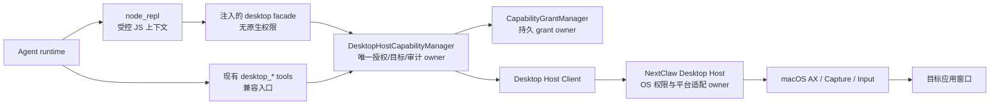

# Codex 启发的受控 Node REPL 与桌面能力收敛设计

> 状态：Reference（首期已按 [Codex 风格 Node REPL 设计](2026-08-26-desktop-tool-first.design.md) 落地；本文件保留调研与分层依据）
>
> 日期：2026-08-26
>
> 角色：产品与架构设计合同
>
> 上位设计：[Desktop Automation Host Capability](2026-08-24-desktop-automation-host-capability.design.md)
>
> 相关设计：[窗口截图与视觉读取](2026-08-26-desktop-screen-capture-vision.design.md)
>
> 实施计划：[受控 Node REPL 桌面能力实施计划](../plans/2026-08-26-controlled-repl-desktop-capability.plan.md)

> 说明：当前产品入口同样是 `node_repl`；具体首期 SDK 合同以 [Codex 风格 Node REPL 设计](2026-08-26-desktop-tool-first.design.md) 为准。

## 1. 评审结论（先看这里）

NextClaw 应当借鉴 Codex 的**分层方法**，而不是复制其闭源二进制或把一串桌面方法注册成更多模型工具：

```text
模型看见：一个受控 node_repl 工具
                ↓
代码里得到：按本次调用注入的 desktop 能力对象
                ↓
对象内部调用：Kernel 已授权的 Desktop Host RPC
                ↓
宿主执行：AX / 截图 / 输入等原生能力
```

这里的 `node_repl` 是“在受控 JavaScript 上下文中执行一小段代码”的工具；它不是桌面控制本身，也不是 shell，更不能等同于给模型本机 Node.js、文件系统、网络和 `child_process` 的全部权限。

首期只做一个真实可验收的子集：

1. 在受控 REPL 中注入只读/受限的 `desktop` 对象；
2. 支持统一状态读取、点击/填入/按键/滚动等明确原子动作的最小集；
3. 所有调用继续经过现有 `DesktopHostCapabilityManager`、能力授权和审计；
4. 每次动作后必须重新读取状态，元素引用不能跨快照复用；
5. 现有 `desktop_status`、`desktop_snapshot`、`desktop_action` 保留为兼容入口和非代码型 runtime 的兜底，不继续新增第四、第五个同类模型工具。

首期**不做** Appshot、录制回放、Computer History、锁屏控制、Messages/Contacts 特权连接器、任意脚本模块导入或任意 Node API。这些不是证明主链路可用的前置条件，先做会把权限、持久化和验收面扩大数倍。

## 2. 用户问题与完成定义

用户需要的是：授权完成后，自己的 NextClaw AI 能够像 Codex 一样，可靠地读取桌面应用的当前状态、做受限操作，并且用户能清楚知道它读了什么、做了什么、为什么失败。不能把“有三个工具定义”误当作“已经有可用的桌面 AI”。

首期完成时，用户可以在开发态对一个安全的已注册应用完成如下闭环：

```text
用户授权 NextClaw Desktop
  -> AI 调用 node_repl
  -> desktop.getAppState() 返回 AX + 截图（若另获截图授权）
  -> AI 按最新元素引用执行一个原子动作
  -> 系统记录动作、目标和结果
  -> AI 再读取状态并据此报告结果
```

以下不是“完成”的替代品：只跑单测、只返回空 AX 树、只让模型猜坐标、只在代码里绕过授权、或只把能力展示在设置页。

## 3. 外部参考的可借鉴边界

### 3.1 Codex 的公开可观察结构

本机 Codex Computer Use skill 显示的使用形态是：Agent 通过 `node_repl` 执行 JavaScript，导入 `@oai/sky` 后取得 `sky` 对象。常用方法是：

- `get_app_state`：同次提供可访问性文本和截图；后续读取可返回 AX diff；
- `list_apps`；
- `click`、`set_value`、`type_text`、`press_key`、`scroll`、`drag`；
- `select_text`、`perform_secondary_action`。

它的关键不是“恰好十个方法”，而是：统一读状态、行为保持原子、调用代码有持久 REPL 状态、执行端与模型进程隔离。官方用户文档还表明，屏幕录制、辅助功能和应用授权是独立边界，且高风险能力不会因一般桌面授权自动获得。

### 3.2 不能复制的部分

`@oai/sky`、Codex Computer Use.app、其 IPC、签名身份校验和产品策略不是 NextClaw 的可复用依赖。公开的 `openai/codex` 仓库没有发布这套 macOS 原生实现。因此本设计是**行为与安全模型的 clean-room 重建**：不导入、反编译、复制或调用 Codex 私有二进制。

### 3.3 NextClaw 当前事实

当前仓库没有 `node_repl` 或等价的 JavaScript sandbox。已存在的 Agent 桌面入口只有 `desktop_status`、`desktop_snapshot`、`desktop_action`；后者当前只允许安全的 `draft` 填入，明确不允许发送。它们已经通过 `DesktopHostCapabilityManager` 走到 capability grant 和 Desktop Host。这是首期应复用的事实基础，不应为了引入 REPL 而重写或绕开。

## 4. 范围裁决

| 能力 | 首期 | 原因 |
| --- | --- | --- |
| 统一 `getAppState`（AX + 可选截图） | 是 | 直接解决“模型行动前是否真的看见当前界面” |
| 原子动作：click、setValue、typeText、pressKey、scroll | 是，按目标应用逐步开放 | 比一个万能 action 可授权、可审计、可验收 |
| `node_repl` 受控代码上下文 | 是，仅作为桌面能力试点 | 用一个模型工具承载结构化 SDK，不牺牲权限边界 |
| 现有三个桌面工具 | 保留 | 兼容现有 Agent、非代码 runtime 与手工诊断 |
| 截图/OCR | 沿用已设计 `desktop_snapshot(source: "screen")` | 不新建截图主链路；仍单独授权 |
| Appshot（用户主动附加窗口） | 延后 | 便利功能，不是桌面操作闭环的必要条件 |
| 手动录制 → 生成技能 | 延后 | 涉及长期记录、敏感输入过滤、生成与审核合同 |
| Computer History/后台持续观察 | 明确不做 | 高隐私成本，且不能用来验证基本操作 |
| 消息、联系人、锁屏/远控 | 明确不做 | 独立特权产品和安全边界，不能搭桌面权限便车 |
| 通用 macro/RPA DSL、任意脚本包安装 | 明确不做 | 会形成第二套不可审计的自动化系统 |

“按目标应用逐步开放”是产品白名单，不是让模型传任意 bundle id 后就有全盘控制权。现有 `wechat` 是当前唯一已注册目标；实施计划必须补充一个无副作用的明确测试目标，不能把尚未登记的 Calculator/Notes 临时当作受支持应用。正式支持列表由后续计划冻结。

## 5. 候选方案与选择

| 候选 | 优点 | 致命问题 | 结论 |
| --- | --- | --- | --- |
| 继续把每个动作做成一个模型 tool | 很直观 | tool 数量、描述和授权语义持续膨胀；跨 runtime 复用差 | 不扩张 |
| 一个自由 JSON 的 `desktop_action` | 表面工具少 | 动作、风险、参数与审计混在一起；难以 deny-by-default | 拒绝 |
| 只保留当前三个工具 | 兼容成本最低 | 复杂流程会反复占用工具 schema，不能借助代码的局部状态、循环与数据处理 | 保留为兜底，不足以成为终态 |
| `node_repl` + 注入 Desktop SDK | 模型工具少，SDK 保持类型和原子语义；可保存本轮局部变量 | 若 REPL 可访问任意 Node API，会等价于本机 RCE | **采用，但必须能力注入与隔离** |

因此，“一个工具还是三个工具”的答案是：它们不在同一层级。`node_repl` 是模型的代码执行入口；`desktop` 是其中一个受控 SDK；SDK 内部仍需要多个清楚的原子方法。现有三个 desktop tool 是产品兼容入口。不要为了表面工具数量把动作合同压扁。

## 6. 目标架构与唯一 owner



### 6.1 `DesktopHostCapabilityManager`：不新建平行 owner

现有 Kernel `DesktopHostCapabilityManager` 继续是唯一产品 owner，负责：

- 将 SDK 方法映射为 `ui.read`、`screen.capture-window`、`ui.write`、后续 `input.keyboard` 等明确 access；
- 解析并锁定已注册的目标应用；
- 带入 `agentId`、`sessionId`、`agentRunId`，校验 grant 并产生日志；
- 将统一错误规范化为离线、系统权限缺失、授权缺失、目标失效和不支持；
- 将请求送至 Desktop Host。

它不调用 macOS API；Desktop Host 也不判断用户/Agent 授权。任意 `desktop` facade、旧工具或 Extension 都必须走这一条链路。

### 6.2 REPL runtime：能力容器，不是本机 Node

REPL 创建一次“会话内上下文”，但每次执行都带当前 `agentRunId` 和不可伪造的 capability handle。它只能获得：

- 标准 JavaScript 语言能力、有限 Promise/timer 和结构化日志；
- 显式注入的 `desktop` facade；
- 显式注入的 `repl.write`、`repl.emitImage` 等输出能力。

默认禁止：`node:fs`、`node:child_process`、`node:net`、`node:http(s)`、环境变量、动态 `import()`、包解析、原生 addon、shell、Electron IPC、任意本地 socket 和宿主全局对象。超时、内存、输出大小和单次动作数均由 runtime 限制；取消、会话结束、授权撤销或 Host 断线立即废弃 handle。

这也是为什么不能简单“把 Node REPL 用起来”：真正有价值的是被产品控制的**能力安全模型**，不是 JavaScript 语法本身。

### 6.3 Desktop Host：只做原生事实与执行

Desktop Host 仍是系统权限、AX 树/截图采集、输入注入、窗口定位和平台错误的 owner。它只接受经过 Kernel 身份认证的 Host RPC，不接受 REPL、Extension 或 renderer 的直接连接。

## 7. 首期公共合同

### 7.1 SDK：统一状态、原子动作

`desktop` 只由 REPL 注入；以下是设计合同，不是允许用户进程 `import` 的 npm 包：

```ts
type Desktop = {
  listApps(): Promise<DesktopApp[]>;
  getAppState(input: {
    target: { applicationId: string };
    source?: "accessibility" | "screen" | "both";
    detail?: "low" | "high";
    fresh?: boolean;
  }): Promise<DesktopAppState>;
  click(input: ElementAction): Promise<DesktopOperation>;
  setValue(input: ElementAction & { value: string }): Promise<DesktopOperation>;
  typeText(input: TargetAction & { text: string }): Promise<DesktopOperation>;
  pressKey(input: TargetAction & { key: string }): Promise<DesktopOperation>;
  scroll(input: ElementAction & { direction: "up" | "down"; pages?: number }): Promise<DesktopOperation>;
};

type DesktopAppState = {
  stateId: string;
  capturedAt: string;
  target: { applicationId: string; windowId?: string; windowTitle?: string };
  accessibility?: { revision: number; text: string; isDiff: boolean; coverage: "partial" | "bounded" };
  screenshot?: { image: unknown; ocrText?: string };
};

type ElementAction = {
  target: { applicationId: string };
  stateId: string;
  element: { index: number };
};
```

具体首期实现可以先支持 `getAppState`、`setValue`（映射已有 draft）和一个无副作用点击场景；其余动作只在目标应用、OS adapter 和风险策略都有真实验证时开放。合同存在不代表授权或实现已经存在。

### 7.2 不变量

1. `getAppState` 是唯一可供行动判断的标准读模型：AX 与截图可同次返回；截图仍需独立 `screen.capture-window` grant。
2. `element.index` 只在产生它的 `stateId` 内有效。动作必须携带该 `stateId`；Host 发现窗口/树版本变化就返回 `stale_state`，绝不点击“最相近”的新元素。
3. 任一动作成功或失败后，调用方都必须再读取状态，不能把输入注入成功误报为业务结果成功。
4. 坐标操作不是首期能力；AX 不完整时先走已授权截图理解，再决定是否新增有明确安全语义的视觉操作合同。
5. `typeText` 不把换行当作安全文本：包含 `\\n`/`\\r` 的输入默认拒绝，避免聊天应用把它解释为发送。发送、支付、删改和提交均不属于首期。
6. `listApps` 只返回注册/允许的应用元数据；不暴露全机软件清单。

### 7.3 旧工具的收敛方式

`desktop_status`、`desktop_snapshot`、`desktop_action` 不删除、不双写，也不另开 Host 路径：

| 旧入口 | 对应 SDK 概念 | 首期变化 |
| --- | --- | --- |
| `desktop_status` | Host 状态，不进入 SDK 主操作流 | 保留 |
| `desktop_snapshot` | `desktop.getAppState()` | 复用同一 snapshot/result 合同；保留视觉来源分支 |
| `desktop_action(action: "draft")` | `desktop.setValue()` | 保留安全 draft 语义；SDK 也必须走同一 `ui.write` 校验 |

这样模型工具数量不会因为每个鼠标键盘动作膨胀，而现在已能工作的授权、NCP 图像结果和审计链路也不会被重写。

## 8. 事件、状态与失败恢复

每个调用生成 `operationId`；以下是内部可观测事件，不是新增暴露给模型的工具：

```text
desktop.operation.requested
  -> desktop.authorization.required | desktop.operation.executing
  -> desktop.operation.succeeded | desktop.operation.failed | desktop.operation.cancelled
```

审计最少记录：时间、调用主体、会话/运行、目标 applicationId、access、动作种类、`operationId`、结果码；不记录截图 bytes、AX 全文或用户输入正文。查看具体内容仍走会话和已有权限边界。

| 情况 | 行为 | 恢复 |
| --- | --- | --- |
| macOS 辅助功能/屏幕录制未开 | 返回精确系统权限错误，不降级伪成功 | 打开系统设置，用户手动授权后重试 |
| NextClaw grant 缺失/被撤销 | 不触达 Host 动作 | UI 显示应用、access、调用方；允许后只重试原调用 |
| 窗口切换、关闭或 AX 变化 | `stale_state` / `window_not_found` | 重新 `getAppState`，重新推理 |
| REPL 超时/取消 | 终止代码并废弃本次 capability handle | 不重放操作；用户/Agent 从新状态继续 |
| Host 重启/离线 | 返回 `host_unavailable` | Host 恢复后重新取状态；不能使用旧 stateId |
| 动作结果不明确 | 返回 `outcome_unknown` | 重新读状态；不自动重复可能有副作用的动作 |

## 9. 交互、权限与验收

### 9.1 用户看得见什么

- 第一次读取、截图、写入分别有现有粒度的授权说明；不能把 `ui.read` 当成截图/输入权限。
- 对话内展示“正在读取哪个应用/窗口”和最终操作状态；失败要给出可理解原因。
- 设置页能按 Agent/应用/access 查看和撤销 grant；撤销即时让后续 SDK 调用失败。
- REPL 日志只展示用户可审阅的代码输出、操作摘要和错误，不暴露 capability handle 或系统 token。

### 9.2 开发态验收脚本（人可亲自操作）

第一批必须给出一个开发态入口和可重复案例，而不是让用户猜怎么验：

1. 运行 NextClaw Desktop 开发态，授权辅助功能；选择明确登记的测试应用。
2. 在 Agent 会话请求“读取当前窗口，找出某个按钮，但不要点击”。验证 REPL 只收到 AX 状态；若需截图，必须单独出现截图授权。
3. 请求“点击这个非提交型按钮后，重新读取并告诉我变化”。验证 action 带当前 `stateId`，并在时间线中有一条终态审计记录。
4. 手动改变窗口后复用旧元素引用。验证系统明确返回 `stale_state`，没有误操作。
5. 撤销 `ui.write` grant 后再请求填入文本。验证不触达目标应用；`ui.read` 仍按授权工作。
6. 在聊天/表单应用尝试带换行的 `typeText`。验证首期拒绝，不能隐式发送。

自动验证要覆盖 SDK→manager→grant→Host RPC 的合同、stateId 失效、权限分离、取消/重启和不支持动作。最终合格还必须由维护者亲自完成上述开发态真实桌面案例，并保存可审阅的运行证据。

## 10. 延后能力的进入条件

| 延后项 | 何时再设计 | 进入前必须补齐 |
| --- | --- | --- |
| Appshot | 用户明确需要“主动把当前窗口带进会话” | 会话附件持久化、预览、前台窗口选择与截图隐私合同 |
| 录制回放 | 有重复手工流程且用户愿意录制 | 敏感字段/密码/剪贴板过滤、临时数据留存、停止/删除、技能草稿人工审核 |
| Computer History | 有明确个人记忆用户故事 | 默认关闭、包含/排除、暂停、保留期、可见数据、模型外传披露 |
| 坐标/拖拽/视觉点击 | AX 路径被真实证明不足 | stateId 对应图像坐标、窗口缩放/遮挡保护、动作确认策略 |
| Messages/Contacts、锁屏 | 独立产品需求 | 单独权限、授权前台、锁屏保护和高风险通信策略 |
| 更广泛 `node_repl` SDK | 已有具体可审计使用者 | 每个新 facade 独立声明能力、预算、确认与测试，不能恢复任意 Node import |

## 11. 删除与禁止

- 不以 `desktop_action` 接收不受约束的任意 JSON action；
- 不让 Extension、模型脚本或 renderer 直连 Desktop Host；
- 不为了 REPL 在 Desktop 上开放 shell、AppleScript、任意 IPC 或文件系统；
- 不存储连续桌面截图、键盘记录或后台应用历史；
- 不在首期自动按 Enter、发送消息、提交表单、支付、删除或改权限；
- 不复制、依赖或分发 Codex 私有 `@oai/sky`/Computer Use 二进制。

## 12. 计划门与评审问题

该工作跨 Agent runtime、Kernel 授权、Desktop Host、原生 macOS adapter 和用户可见验证，不能以单批实现安全收尾，因此实施计划为 **required**。本设计获批后，计划需要按以下顺序拆分：

1. 受控 REPL runtime 及最小输出/资源限制；
2. `desktop` facade 与现有 manager 的单路径接入；
3. stateId、原子动作和审计收敛；
4. 开发态真实验收与文档。

请重点 review 四个决策：

1. 首期是否只把 `node_repl + desktop` 做成桌面试点，而不把它直接宣布为“任意代码执行平台”；
2. 是否接受“状态必须带 `stateId`、动作后必须重新读取”的可靠性约束；
3. 是否继续把现有三工具保留为兼容入口，而不强行压成一个自由 JSON 工具；
4. 是否同意把 Appshot、录制、历史和锁屏全部延后，先以一个安全桌面案例验收核心链路。
