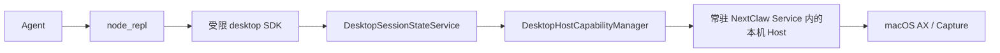
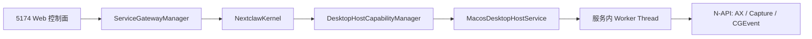

# Codex 风格 Node REPL：桌面能力首期收敛设计

> 状态：首期实现与定向自动验证完成；真实微信发送及跨应用验收尚未完成（旧 Socket / Electron Host 路径已删除）
>
> 日期：2026-08-27
>
> 参考：[Codex 启发的桌面分层调研](2026-08-26-codex-inspired-desktop-context.design.md)

## 结论

模型只看见一个 `node_repl` 工具。它执行一段受限 JavaScript，并注入唯一的 `desktop` SDK 对象：

```ts
const state = await desktop.getAppState({ target: { applicationId: "wechat" } })
await desktop.setValue({ target, stateId: state.stateId, element: { index: 3 }, value: "草稿" })
await desktop.click({ target, stateId: state.stateId, element: { index: 8 } })
// 自绘 UI 没有可用 AX 元素时，先用 source: "both" 取得同一窗口截图，
// 再在该 stateId 的窗口范围内点击。
await desktop.click({ target, stateId: state.stateId, coordinate: { x: 680, y: 600 } })
```

不再向模型提供 `desktop` function tool，也不保留 `desktop_status`、`desktop_snapshot`、`desktop_action`。这与 Codex 的“一个代码执行入口 + 一个私有桌面 SDK”形态对齐。

## 固定主链路



- REPL 是 session 级隔离子进程，有代码长度、执行时间和空闲回收限制；没有 `process`、`require`、`import`、文件、终端、网络、环境变量或任意包。
- `DesktopSessionStateService` 是 `stateId`、元素索引、TTL 和窗口新鲜度的唯一 owner。
- `DesktopHostCapabilityManager` 仍是身份、已登记目标、grant 与审计的唯一 owner。

## 宿主归属（本次修正）

桌面能力是 NextClaw 既有常驻后台服务中的一个本机适配模块，不是 Electron 窗口能力，也不是第二个 daemon。5174 的网页只承担控制面；它请求的 Kernel 由同一个服务进程中的 Host 执行 macOS 适配器。



- `packages/nextclaw-service` 创建并停止 `MacosDesktopHostService`；它只处理 macOS API、权限跳转和 native watch 生命周期。同步的 AX 调用会在同一 Service 进程的 Worker Thread 中运行；这不是 IPC daemon、Socket 或 UI 进程。单次调用八秒超时时销毁该线程并返回可恢复错误，因此异常应用不能阻塞 5174 或其它会话。
- `packages/nextclaw-kernel` 只依赖 `DesktopHost` 合同（`status`、`invoke`、`onEvent`、`dispose`），继续拥有目标白名单、grant、Agent/Extension 身份和审计语义。CLI 的短生命周期 Kernel 使用明确的 unavailable 实现，不会尝试启动窗口或额外进程。
- Electron 只保留桌面壳、窗口和其已有 runtime 启动职责；它不再创建 Host、Socket、token 或 `desktop-host.json`。嵌入式服务与普通服务通过同一个 Service host 获得桌面能力。
- 删除 Unix Socket、descriptor 和 `DesktopHostClientService` 作为产品主链路；不存在“服务 → Electron → Socket → macOS”这条平行路径。扩展进程仍通过既有 ingress 进入 Kernel，绝不直接获得本机能力或 token。

原生模块由 Service 运行时加载；当前 Desktop 产品包继续负责构建并携带该平台资源，只通过受限环境变量把资源位置交给其已存在的服务运行时，不再持有或代理任何桌面操作。macOS 外的平台返回明确的 `not_supported`，不伪造可用状态。

### 当前真实验收证据（2026-08-27）

- 5174 的真实 Agent 已通过 `node_repl → desktop SDK → grant → Kernel → Service Host → macOS app` 跑通 TextEdit 的“截图 → 窗口内坐标点击 → 新鲜状态 → 键盘输入 → AX 回读”链路；随机标记由读后 AX 明确确认。
- Host 已在真实运行中确认：ScreenCaptureKit 能解析可捕获窗口；状态读取把该窗口的 `pid + windowId` 仅保存在服务端 `stateId` 内，并在后续截图/点击/输入中复用，目标变化返回 stale 错误而不静默换窗。
- 微信当前可获取状态和截图，但其当前界面未暴露文件传输助手或发送控件；因此“读取消息—输入—发送—回读”尚未通过，不能以 TextEdit 或单元测试替代。
- `desktop.pressKey` 已作为常用原子操作接入；它在 macOS 上由 Service 独立辅助可执行程序承载，避免 Quartz 事件异常终止 Host Worker。该辅助程序的构建、类型检查和 Host 单测已通过，但尚未完成微信快捷键的真实端到端验收。

## 完整任务验收扩展（2026-08-27）

只读多应用状态只能证明读取链路可用，不能证明 Agent 能完成任务。本轮验收采用同一个真实 Agent、同一个 5174 会话，并要求每条均经过 `node_repl → desktop SDK → grant → Kernel → Service Host → macOS app`，且在操作后重新读取可观察结果：

| 用例 | 应用 | 任务 | 当前状态 | 成功证据 | 清理/安全边界 |
| --- | --- | --- | --- | --- | --- |
| T1 | TextEdit | 定位 AX 文本区，写入带随机标记的草稿，再回读确认 | 待验收 | 写入操作成功且 AX 值与标记完全一致 | 不保存、不关闭用户文件 |
| T2 | TextEdit | 截图内坐标点击后，用键盘输入带随机标记，再回读确认 | 已通过 | 点击、输入成功，读后 AX 包含唯一标记 | 不保存、不关闭用户文件 |
| T3 | Chrome | 在临时、本地、无网络的整页视觉夹具中，由截图 OCR 确认唯一标记后点击窗口中心并回读 | 待验收 | 新鲜截图、指针点击和 OCR 状态从 READY 变为 COMPLETE | 不导航、不填表、不访问网络；测试后关闭唯一夹具标签并删除夹具 |
| T4 | Finder | 读取 Finder 的 AX 状态，并点击当前选中的普通控件后回读 | 待验收 | 点击由新鲜 `stateId` 的 AX 元素索引触发，回读证实界面变化 | 不进入账号、更新、删除或确认页面 |
| T5 | WeChat | 在文件传输助手读取界面、写入唯一测试标记、发送并回读 | 未通过：当前无目标会话/发送控件 | 最新 AX / 截图 / OCR 可观察到本次测试标记 | 只向文件传输助手发送，无联系人选择、无第三方消息 |
| T6 | Activity Monitor | 复现不响应 AX 的异常应用 | 待复验 | 在时限内得到恢复错误，之后 Service 状态仍在线 | 不重启 Service、不启动应用 |
| T7 | Chrome → WeChat | 在受控 Chrome 夹具完成视觉点击及 OCR 回读后，读取微信的 AX、截图与 OCR 可用性 | 待验收 | `{ chromeCompleted: true, wechatHasAccessibility: true, wechatHasScreenshot: true, wechatHasOcr: true }` | 微信不点击、不输入、不选联系人、不发送；不输出聊天内容 |

`desktop.setValue` 的 value 允许空字符串，用于将同一已授权 AX 文本字段恢复为清空；文本（包括换行）按原样传递。它不新增 SDK 方法、授权类别或 Host 操作。T1 以该语义实现可逆清理，而不是留下测试草稿。

截至 2026-08-27，只有 T2 已由 5174 真实 Agent 完成并具备读后证据。其它用例均保留为待验收；尤其 T5 在当前微信界面缺少目标会话和发送控件，不能标记为通过。每条未来通过的用例都必须从 5174 的真实 Agent 发起并经过 `node_repl → SDK → grant → Kernel → Service Host → macOS app`。

状态新鲜度复读必须复用初始 `getAppState` 的 `maxDepth` 和 `maxNodes`。这些参数定义 AX 有界状态的语义边界；初次读 200 个节点、复读默认 500 个节点会产生必然不同的哈希，造成“状态变化”的假阳性。它们由 `DesktopSessionStateService` 随 `stateId` 保存并在元素点击/写入前传给 Host；不扩大 SDK 或 Host 合同。

## 原子 SDK 合同

1. `desktop.getAppState`：返回有界 AX 文本、`stateId`，可选目标窗口截图（含截图像素尺寸和窗口坐标范围）；`source: "both"` 将视觉状态与同一个 `stateId` 绑定。
2. `desktop.setValue`：必须引用同一 target 的新鲜 `stateId`；文本内容（含换行）不由 Desktop SDK 作语义判断。
3. `desktop.click`：必须引用新鲜 `stateId`；任何当前 AX 元素均可按索引触发。Desktop SDK 不根据“发送、确认、删除、支付”等按钮文案判断风险。当 AX 缺失时，允许在刚捕获的目标窗口内部使用截图像素坐标点击；坐标原点固定为截图左上角，Host 再按截图与真实窗口尺寸换算为 macOS 全局坐标。执行前重新捕获并哈希比对该窗口，坐标越界或状态变化一律拒绝。

多进程应用（例如同时运行多个 Chrome 实例）不能把 bundle 匹配的第一个进程当成目标。Host 优先使用前台同 bundle 进程；后台读取时在有实际普通窗口的候选中选择最大窗口，并忽略 Chrome 的 1×1/标签栏 AX 辅助窗口。`detail: "low"` 同时下传到 ScreenCaptureKit 与 Vision：截图最长边上限 960、OCR 使用快速模式；默认高细节仍保留完整分辨率与精确 OCR。单次 Host 调用上限为 20 秒，受控 REPL 为 30 秒，以支持“读→动作→读”的正常截图链路而保留可恢复超时边界。

4. `desktop.typeText`：必须引用新鲜截图状态；文本内容（包括换行）如实生成键盘输入。是否构成对外发送、确认或其他后果操作，属于 Agent 对用户指令的解释与授权流程，不属于底层桌面 SDK 的按钮文本白名单。
5. `desktop.pressKey`：必须引用新鲜截图状态；当前支持常用字母、数字、确认、导航键及 Command/Control/Option/Shift 组合。它是 Host 的独立 macOS helper，不改变网页或 Electron UI 的进程归属；helper 失败仅返回操作错误，不会让常驻 Service 崩溃。

每个动作前都重新读取 AX tree 或重新捕获目标窗口；窗口变化、过期或一次动作完成后，旧状态失效。这些是目标一致性与误操作边界，不是产品对动作语义的二次审查。滚动、拖拽、录制、历史和锁屏仍不进入当前子集；它们在出现真实任务需求时，按同样的原子 API 原则扩展。

### 不变量与删除项（2026-08-27 修订）

- 删除 `DesktopSessionStateService` 对 AX 标题的“低风险”白名单，以及 `setValue` / `typeText` 的换行内容过滤；它们既不是系统权限，也不与 Codex `@oai/sky` 合同对齐，并使正常微信发送不可达。
- 保留 `stateId`、目标应用 grant、受登记 Agent 身份、窗口范围与 macOS 辅助功能/屏幕录制权限。它们分别保证操作对象没有漂移、能力授予可撤销、调用方可审计、坐标不越界和系统授权真实存在。
- 不新增“发送服务”“风险标签 registry”或另一套审批 DSL。用户意图与模型运行时的高影响沟通确认属于上层；Desktop SDK 只执行已被调用的原子动作。

## CLI

直接 CLI 桌面调用仍不进入首期。它必须有独立身份、用户授权和受信任本机 handoff；不存在可被 CLI 或扩展窃取的 Desktop Host socket 或 token。

## 原生 SQLite 运行时隔离

`better-sqlite3` 是 SQLite 的 Node 原生扩展，并非 SQLite 数据文件本身。普通开发服务使用 Node ABI，Desktop 的嵌入运行时使用 Electron ABI；两者绝不能重编同一份工作区 `node_modules` 二进制。

- 发布 bundle：运行时入口位于 `bundle/runtime`，Electron 版依赖位于其父目录 `bundle/node_modules`，由 Node 的正常模块解析自动隔离。
- Desktop 开发态：启动前在 `build/native-app-resources/node_modules` 生成 Electron 版副本；仅桌面子进程通过受限 ESM register hook 将 `better-sqlite3` 定向到该副本。
- 普通 `pnpm dev`：没有 loader、没有专用环境变量，继续使用工作区 Node 版依赖。

目标窗口截图由同一 macOS 原生适配器通过异步 ScreenCaptureKit 按已解析的 `CGWindowID` 直接捕获。它不依赖 Electron 窗口缩略图枚举；截图结果回到 Node 时才完成请求，避免阻塞主线程。新鲜度指纹覆盖目标进程、窗口边界和图片尺寸；OCR 与逐帧像素会因光标、时钟和流式消息变化，作为当前可观察状态返回但不参与哈希，避免把正常动态 UI 误判成过期。失败时明确拒绝，绝不换窗口、复用旧图或绕过窗口绑定校验。

不变量：任何 Desktop 构建或验证不得写入工作区 `better-sqlite3/build/Release/better_sqlite3.node`。若桌面资源缺失，Desktop 启动应失败并报告资源路径，不能回退到共享二进制。
