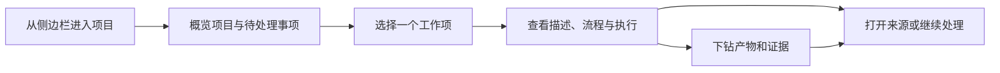

# 项目治理主页 V1 功能范围决策

> 状态：历史范围裁决；当前实现依据已升级为[只读项目观测 V1 设计](2026-08-30-read-only-project-observer-v1.design.md)
>
> 日期：2026-08-26
>
> 上游探索：[项目治理主页设计](2026-08-25-project-governance-hub.design.md)
>
> 场景依据：[项目治理代表场景梳理](../thoughts/2026-08-26-project-governance-representative-scenarios.thought.md)
>
> 现有探索原型：[HTML 原型](2026-08-25-project-governance-hub.prototype.html)
>
> AI 核心候选原型：[通用项目主页 · AI 核心版](2026-08-27-project-home-ai-core.prototype.html)
>
> 后续场景探索：[AI 小说创作产品探索](../thoughts/2026-08-26-ai-novel-creation-product-exploration.thought.md)

> **2026-08-30 最终边界纠偏：** 本文曾从“历史只读主页”继续推演到可写项目治理闭环，因而同时保留了相互冲突的历史口径。当前版本不创建或修改 Work Item、Workflow、Artifact、Skill、工作约定和待处理事项，不建设治理数据库，也不侵入 Agent 主链路；配置、文件和 AI 显式 Marker 只生成来源可追溯的只读投影。后续实施不得从本文下方的历史写入设想反推当前范围。

## 0. 2026-08-30 模型修订（历史阶段性裁决，已被替代）

2026-08-27 的修订先把项目主页收敛为工作项中心模型；后续讨论一度继续推演可写项目治理闭环。本节保留该阶段性设计，用于解释原型中的模块与动作从何而来；它已经被本文顶部链接的“只读项目观测 V1”替代，不再是当前实现依据。

该阶段曾把项目主页定位为：**面向一切需要 AI 持续推进、积累材料和形成产物的长期工作的项目操作面。** 软件开发是高要求样本，但不是产品边界；小说创作、研究、投资调研、内容运营和持续监测都应复用同一产品主链路。

### 0.1 阶段性领域模型

Project 是持久项目上下文。Project 之下当前确认五类核心概念，但它们不等于五个页面或五个一级模块：

- **Work Item**：项目中一次具体工作的中心对象，包含标题、描述、类型、当前流程节点和流转状态。
- **Workflow Definition**：Work Item 的可复用处理流程，定义节点以及允许的推进、跳过、回退和人工确认；它不是项目级总生命周期。
- **Artifact**：项目级独立产物，可以被多个 Work Item 产生、使用或更新；Artifact 与 Work Item 是关联关系，不是包含关系。
- **Skill**：项目中人或 AI 可调用的能力，可以作用于 Work Item 或 Artifact；节点动作可以引用 Skill，但 Skill 不拥有工作项状态。
- **Working Agreement（工作约定，暂定名）**：项目范围内人和 AI 共同遵守的规则、偏好与确认边界，例如来源要求、既定设定保护、交付要求和高风险动作确认。它不拥有流程状态、Skill 内容或产物正文。

第一版不额外引入 `Workflow Run` 对象。Work Item 通过 `workflowId`、当前节点和必要的流转记录承载一次流程运行。

“需要你处理”与“动态”是重要的用户界面投影，但不是用户必须理解的顶级领域名词：

- **需要你处理**聚合缺少信息、方向选择、审核、授权和异常处理；它必须关联真实工作与解除条件，而不是泛化通知。
- **动态**按时间展示状态变化、执行、产物和人工决定；它用于解释“为什么变成现在这样”，默认在项目或工作详情中按需展开。

### 0.2 阶段性关系

```text
Project
├── Working Agreement
│   └── references → project-owned instructions / approval boundaries
├── Work Item
│   └── binds → Workflow Definition
├── Artifact
│   └── relates many-to-many ↔ Work Item
└── Skill
    └── can act on → Work Item / Artifact
```

流程节点可以声明期望关联的 Artifact 类型和可用 Skill，但不直接拥有 Artifact，也不嵌入 Skill 内容。Artifact 首版关系先收敛为 `input`、`output` 和 `related`，不提前扩展复杂关系词表。

Working Agreement 只承载跨工作项稳定成立的项目约定，并引用 `PROJECT.md`、项目规则、品牌指南或其它项目自有来源。Workflow 决定“这类工作怎样分步推进”，Skill 决定“AI 怎样完成某类动作”，Working Agreement 决定“无论采用哪种流程和能力，都要遵守什么”。系统级权限和安全策略继续由系统 owner 管理，不能被项目约定覆盖。

### 0.3 阶段性项目主页信息架构

用户可见入口不与领域对象一一对应。该阶段原型保留五个有独立用户任务支撑的主导航：

1. **概览**：承担项目级判断，组合展示需要人介入的工作项、正在推进的工作项、AI 建议、最近项目产物和项目有效 Skill 摘要。
2. **工作项**：承担大量工作项的搜索、筛选、分页和连续进入；点击后统一打开工作项详情。
3. **产物**：承担跨 Work Item 的项目资产浏览、搜索、筛选、复用和关系下钻；不能只从某一个工作项进入。
4. **Skills**：承担项目有效 Skill 集的只读发现和治理，展示项目专属与共享来源、适用环节及可用状态。
5. **工作约定**：承担项目上下文来源、跨工作项稳定规则、偏好和人工确认边界的查看与调整；自然语言修改先生成差异提案，再由用户确认。

工作项详情按上下文展示：

- 工作项标题、描述和类型；
- 该 Work Item 自己的 Workflow 与当前节点；
- 需要人的判断；
- 与项目级 Artifact 的输入、输出或相关关系；
- 当前节点可用或推荐的 Skill。

Artifact 页面采用笔记式列表—正文结构：桌面左侧连续选择产物，右侧稳定展示 Markdown / HTML 内容预览、项目相对位置和跨 Work Item 关联；手机使用列表进入全屏正文再返回。进入产物模块后不再使用抽屉。Skill 既在工作项动作和流程节点中按需出现，也通过独立 Skills 页面提供项目级能力概览。

项目概览、工作项或其它上下文中的单个 Artifact 入口，默认复用全局右侧工作台预览，不先跳转到“产物”模块，也不在项目页内新增一套局部抽屉。右侧工作台以项目作为上下文 owner，可由已绑定会话、空白新会话或项目主页触发；触发入口只传入目标 Artifact，工作台负责展示、关闭、继续与 AI 协作，以及用户明确选择后的“在产物中定位”。“产物”模块继续负责全集浏览、搜索、筛选、关系下钻和管理，不作为查看单个产物的必经路径。手机端使用同一工作台语义，以全屏覆盖和返回动作呈现。

Working Agreement 具有独立用户任务，因此该阶段原型增加了“工作约定”一级入口；概览只在约定影响当前工作或需要用户确认时展示摘要，不平铺完整规则。用户可以用自然语言要求 AI 调整约定，系统必须展示将要发生的变化并获得确认，不能在后台静默改写。

左侧产物列表必须按项目定义的类别分组，而不是把所有文档平铺。NextClaw 项目可配置为 `designs`、`plans`、`thoughts`、`logs`；其它项目可以定义自己的类别名称、路径匹配和允许格式。类别属于 Artifact 契约，不是产品内写死的固定枚举。

五个入口与部分核心概念重合，是因为概览、工作项治理、跨工作项资产浏览、项目能力治理和项目约定维护分别存在独立用户任务，不是按领域对象机械生成页面。Workflow 暂不设独立页面，继续作为 Work Item 详情的一部分。

概览首屏的内容权重按“需要人处理 → AI 建议 → 正在推进 / 最近产物”排列。AI 建议提前出现但保持低高度、低表面强度，不以大卡片占据主要空间；它的采纳率不构成稳定主任务，只承担及时提示和继续入口。正在推进与最近产物是同级核心列表：容器宽度足够时左右并列，较窄时上下排列；两侧使用相近的行高和列表节奏，便于同时扫描工作进展与已经形成的结果。

### 0.4 该阶段明确不做

- 不把 Workflow、Work Item、Artifact、Skill 机械做成四个模块。
- 不展示一条虚构的项目级总流程。
- 暂不增加 Files 和 Activity 页面；必要文件通过 Artifact 来源进入，必要流程信息保留在 Work Item 内。
- 暂不增加独立 Human Attention 页面；它先作为 Work Item 状态、筛选和概览提醒存在。
- 不在用户界面使用 `Policy`、`Attention`、`Activity` 等必须额外学习的内部术语；分别使用“工作约定”“需要你处理”和“动态 / 历史记录”。
- 暂不建设图形化 Workflow 编辑器、完整任务管理平台或复杂 Artifact 关系模型。
- 暂不建设通用流程 DSL、任意字段系统、页面搭建器或模板市场。
- 不把工作项、当前节点、产物列表和动态历史写进项目静态配置文件。

该阶段对应原型为：[项目主页 · 工作项中心版](2026-08-27-project-home-ai-core.prototype.html)。该原型覆盖工作项中心、项目上下文、工作约定、需要你处理与最近动态；AI 初始化和真实管理写入属于当时的后续设想，不再属于当前只读 V1。

### 0.5 项目上下文、初始化与配置

项目目标不能被压缩成一个必填字符串。简单项目可以只写一句摘要；复杂项目的愿景、边界、成功标准和路线通常分别存在于多份权威材料中。Project 应同时提供：

- **简短摘要**：服务项目列表和概览识别，可以为空，也不能替代完整愿景。
- **项目上下文引用**：按角色引用愿景、范围、路线图、成功标准、背景资料等权威来源；一个角色可以有多份材料。
- **加载说明**：AI 进入项目或处理特定工作时，知道哪些材料是基础上下文，哪些只在相关场景按需读取。

项目配置因此是“项目上下文与工作方法索引”，不是把所有项目知识复制进一个文件。引用来源继续拥有正文；摘要若与权威来源冲突，以来源为准并提示更新摘要。

如果复杂项目尚未有独立愿景或范围材料，AI 可以提议创建一份项目愿景 Artifact，再由配置引用它；用户确认前不能把临时聊天总结直接升级为长期项目事实。长篇愿景默认留在适合阅读和持续修改的文档中，不嵌入配置文件。

项目必须支持两种同样成立的开始方式：

1. **直接开始**：没有显式 Workflow 或 Working Agreement 时仍可创建工作、关联产物和持续聊天；项目主页只展示能够证明的事实，不猜测完整流程。
2. **AI 辅助初始化**：用户描述长期目标后，AI 提议摘要、上下文来源、首批 Work Item、推荐 Workflow、Artifact 分类、Working Agreement 和适用 Skill；用户确认后生效。

研究、小说创作、软件开发、投资调研和持续监测等模板只提供可编辑的初始建议，不形成封闭的项目类型。初始化不是长表单，也不要求用户理解配置格式；自然语言是主要入口，结构化配置用于持久化、检查和迁移。

本地文件型项目的首选表示暂定为 `.nextclaw/project.yaml`。这是实现调查前的设计落点，不提前冻结为公共协议；逻辑上的项目合同不能依赖某个文件路径，未来无本地目录的项目可以由其它项目 owner 提供同等事实。

概念示例，不代表最终 schema：

```yaml
project:
  summary: NextClaw 是面向长期使用的个人智能搭档
  context:
    - role: vision
      source: docs/VISION.md
    - role: roadmap
      source: docs/ROADMAP.md
    - role: usage-contract
      source: docs/USAGE.md

working_agreement:
  rules:
    - 用户可见变化需要同步用户文档
    - 对外发布前需要用户确认
  sources:
    - AGENTS.md

workflows:
  default: development-lifecycle

artifacts:
  categories:
    - name: 设计
      paths: ["docs/designs/**"]
    - name: 迭代记录
      paths: ["docs/logs/**"]
```

配置中的 `role` 用于让用户和 AI 理解材料在项目中的作用，不把所有文件都塞进启动上下文。首版只需要少量内置角色和自由显示名；不提前建设通用知识图谱、依赖图或复杂加载 DSL。

静态合同与动态事实必须分开：

| 内容 | 权威 owner | 是否进入项目配置 |
| --- | --- | --- |
| 项目摘要、上下文来源与加载角色 | Project / 原始上下文文件 | 是或引用 |
| 工作约定及其来源引用 | Working Agreement / 原始说明文件 | 是或引用 |
| 可复用 Workflow 定义与 Artifact 分类 | Project 配置或明确外部来源 | 是或引用 |
| Work Item、当前节点和流转历史 | 项目治理或外部工作来源 | 否 |
| Artifact 实例、版本和关联关系 | Artifact 来源与项目治理索引 | 否 |
| 执行、异常、人工决定和动态 | 真实 producer / 项目治理记录 | 否 |

配置文件不是第二套项目数据库，也不是要求用户手写的主界面。项目设置与 AI 都通过同一项目合同读写；来源文档继续拥有正文，项目配置只保留必要值和稳定引用。

### 0.6 从展示到管理的最小闭环

历史 V1 的只读主页可以验证信息架构，但该阶段认为它不能成为最终产品闭环，因此曾提出以下少量写操作：

1. 用户从项目主页用自然语言创建或继续一个 Work Item。
2. AI 根据项目上下文与工作约定，为它选择可选 Workflow 和适用 Skill；没有可靠流程时保持无流程状态。
3. AI 推进工作时，通过权威 owner 更新当前节点、流转事实和 Artifact 关联，不能靠聊天摘要伪造进度。
4. 需要补充、选择、审核、授权或处理异常时，在概览和相关 Work Item 中显示“需要你处理”。
5. 用户可以确认结果、调整方向、关联产物或修改工作约定；修改工作约定必须预览差异并确认。
6. 重新进入项目后，AI 能恢复适用的项目上下文，用户也能从当前重点继续，而不是依赖找回某一段历史聊天。

第一阶段不追求完整 CRUD。优先提供“新工作”“继续推进”“查看 / 关联产物”“处理当前事项”和“调整工作约定”五类意图入口，UI 负责展示、确认和纠正，AI 负责把自然语言意图提交给同一权威 owner。

### 0.7 阶段性设计验收标准

1. 一个没有配置文件、没有显式流程的简单项目仍能开始工作并沉淀产物。
2. 一个目标无法用一句话说明的复杂项目可以引用多份愿景、范围、路线和成功标准材料，不复制正文，也不把短摘要当作完整目标。
3. AI 初始化只生成可检查的提案；用户确认后才建立长期项目上下文和工作约定。
4. Workflow、Skill、Working Agreement 与 Artifact 的职责能分别回答“分几步”“怎么做”“要遵守什么”“留下什么”，不存在同一事实的平行 owner。
5. AI 只加载当前工作需要的项目上下文，不因项目材料很多而把全部文件无条件塞入每轮上下文。
6. 用户重新进入项目后能看到当前重点、需要自己处理的事项和最近产物，并从同一 Work Item 继续推进。
7. 项目配置不承载 Work Item 当前状态、Artifact 实例列表或动态历史；动态事实仍能追溯到真实 producer。
8. 用户界面无需理解 `Policy`、`Attention`、`Activity` 等内部术语，也能完成查看、处理和追溯。

> 以下第 1～9 节保留 2026-08-26 的历史只读 V1 裁决，用于解释当时为什么先收缩范围；当前合同统一以本文顶部链接的“只读项目观测 V1”为准。

## 1. 最终判断

V1 不推翻现有设计，而是从现有探索中收敛出一个更小的产品：

**一个只读、项目级、以异常和证据为中心的治理主页。**

它首先帮助用户完成一个闭环：

> 进入项目 → 看懂现在发生了什么 → 找到需要自己处理的事项 → 下钻工作流程和产物 → 回到真实工作入口继续处理。

V1 不是完整项目管理平台，也不是 Agent 控制台。它是用户理解和治理项目的公共表面；项目可以由人、Agent、自动化或外部系统推进。

### 对现有方案的裁决

- **整体方向保留**：项目拥有独立主页；侧边栏项目名称进入主页，披露箭头继续展开任务。
- **信息架构保留**：概览、工作、产物、文件、Skills、自动化六个入口继续成立，不再新增页签。
- **交互方案优化**：减少平铺，强化抽屉、折叠、统一详情和移动端逐层进入。
- **产品范围明显收缩**：V1 只读，不做工作流搭建、复杂任务管理和本地审批系统。
- **通用能力保留**：流程、产物、Attention 和活动都使用中性产品语言，不绑定软件开发。

## 2. 我采用的取舍方法

每组功能按六个维度综合判断：

| 维度 | 权重 | 判断标准 |
| --- | ---: | --- |
| 即时用户价值 | 30% | 用户进入项目后是否立刻更清楚、更省注意力？ |
| 产品差异化 | 20% | 是否体现 AI 时代的宏观治理，而不是普通文件夹或任务列表？ |
| 跨场景通用性 | 15% | 开发、研究、内容、设计和持续项目是否都自然成立？ |
| 信息可靠性 | 15% | 是否能展示有来源的事实，而不是依赖猜测和虚假完整度？ |
| 首版复杂度 | 10% | 是否会引入大量配置、编辑、权限和异常分支？ |
| 可逆与可扩展性 | 10% | 首版简化后，未来能否自然增强而不推翻用户心智？ |

### 功能组裁决

| 功能组 | 综合判断 | V1 决定 |
| --- | --- | --- |
| 项目入口与主页外壳 | 极高价值、低认知成本 | 必做 |
| 概览与 Attention | 治理主页的核心差异 | 必做 |
| 工作列表与统一详情 | 所有场景的主干 | 必做 |
| 只读流程与人工检查点 | 高治理价值，需控制复杂度 | 必做、只读 |
| 产物与证据下钻 | AI 工作可控性的关键 | 必做 |
| 文件与 Skills | 原始需求，且已有用户心智 | 必做、只读 |
| 自动化概览 | 持续项目需要，但不是首屏核心 | 保留入口、轻量实现 |
| 聚焦 / 表格双视图 | 同时支持理解单项和大量历史 | 桌面必做 |
| 搜索、筛选、排序、分页 | 历史数据增长后的必要合同 | 必做 |
| 本地创建与编辑工作项 | 会迅速走向完整任务管理器 | 延后 |
| 可配置工作流与模板 | 通用性重要，但首版判断成本过高 | 延后 |
| 本地审批、授权和状态推进 | 涉及权限与来源一致性 | 延后 |
| 任意字段、任意页面搭建器 | 复杂且破坏默认体验 | 不做 |
| AI 项目健康分 | 容易制造不可解释结论 | 不做 |
| 甘特图、工时、容量和绩效 | 偏离产品关注点 | 不做 |

## 3. V1 页面结构

### 3.1 项目入口

桌面项目行保留三个清晰目标：

- 披露箭头：展开或收起项目下的任务。
- 项目名称：进入项目主页。
- 新建按钮：继续沿用已有的新建项目任务能力。

项目 hover 卡片只做辅助信息，不承担唯一入口。手机上项目名称直接进入主页，披露箭头单独展开，不依赖 hover 或长按。

项目主页头部只显示项目名称、必要的项目标识和主动作。默认不暴露包含个人目录信息的绝对路径；需要查看位置时再主动展开，并优先显示项目相对信息。

### 3.2 主导航

V1 保留六个稳定入口：

1. 概览
2. 工作
3. 产物
4. 文件
5. Skills
6. 自动化

六个入口已经覆盖当前最重要的用户任务，不再添加“规则”“知识”“质量”“风险”“成本”等未来空壳页。

桌面使用常驻页签。手机使用可横向滚动的页签行，并提供边缘提示；页面内容一次只展示一层。

## 4. 各页面的 V1 功能

### 4.1 概览

概览首屏只回答四件事：

1. **哪里需要我**：存在开放 Attention 时置顶展示；没有时不保留空区块。
2. **现在推进什么**：显示少量最近或正在推进的工作项。
3. **最近产生什么**：显示关键产物和状态，不展示普通文件流水。
4. **项目资源是否可用**：用紧凑摘要连接文件、Skills 和自动化。

概览不提供综合健康分，不平铺全部统计，不用 AI 临时生成看似权威的风险结论。

Attention 卡片必须说明：发生了什么、为什么需要人、影响什么、建议去哪里处理。V1 的动作是“查看详情”“继续处理”或“打开来源”，不在项目主页中直接完成复杂审批。

### 4.2 工作

工作页承担 V1 最主要的治理阅读任务。

#### 列表能力

- 搜索标题和描述。
- 按状态、类型、是否需要人处理筛选。
- 按最近更新等稳定条件排序。
- 数据分页，不一次加载全部历史。
- 行或列表项只显示标题、简短描述、类型、状态、最近更新和 Attention 标记。

优先级、负责人、截止日期等字段只有在项目真实使用时进入“更多属性”，不成为所有项目的强制列。

#### 三种工作视图

- **列表视图**：适合搜索、筛选、稳定排序和扫描大量工作项；点击一行后从右侧打开统一详情。
- **看板视图**：默认视图。选择一个 Workflow Definition 后，严格按照该流程定义的节点顺序分列，适合先观察工作在各流程环节中的流动和堆积。流程节点由项目自定义；软件项目可以从“需求 → 方案设计 → 开发 → 验证 → 完成”等常见模板开始，但模板不是产品硬编码的全局状态。使用其它流程的工作项不混入当前看板，通过流程选择器切换查看。
- **甘特图视图**：按时间展示已有开始和结束日期的工作项，适合检查排期、并行关系、里程碑与依赖冲突。没有日期的工作项保留在“未排期”提示中，不虚构时间条。

三种视图是同一批 Work Item 的不同投影，共享搜索、筛选、选中项和统一详情，不允许各自维护一套状态或逐渐产生字段分叉。视图切换只改变组织方式，不重置当前筛选。桌面保留三种视图；手机保留列表为默认，并允许横向浏览看板和甘特图，不把多列强行压缩成不可读卡片。

看板列的唯一 owner 是当前选中的 Workflow Definition，Work Item 只通过 `workflowId + currentNodeId` 落入对应列。Attention、人工确认、阻塞、超期和依赖冲突都是工作项在当前节点上的运行信号，不得伪装成流程节点或额外看板列。需要人工确认时，卡片继续停留在当前节点，显示“人工确认 · 阻塞下一步”；确认通过后才由流程转移进入下一节点。

看板首版只读表达阶段，不通过拖拽直接推进工作状态；甘特图首版只读表达日期和依赖，不提供拖拽改期、依赖级联重排、资源负载或关键路径计算。这些动作需要稳定的写入、冲突和恢复合同后再进入实现。

#### 市场实践取舍

- Linear 的列表与看板共享筛选、分组和展示属性，并用轻量卡片避免信息过载；当前方案沿用“同一数据、多种投影”，但将列语义收敛到选中的 Workflow Definition，不把 Attention 等运行信号当成分组字段。[Linear Board layout](https://linear.app/docs/board-layout) / [Display options](https://linear.app/docs/display-options)
- Linear 把 Timeline 保持在较高层级的项目规划中，避免把粒度过细的任务全部塞进路线图。NextClaw 当前工作项规模较小，因此允许在项目内查看工作项排期，但仍以周为默认尺度，不把它包装成长期路线图。[Linear Timeline](https://linear.app/docs/timeline)
- Asana 用灰色依赖线表达正常关系、红色依赖线表达日期冲突；当前原型采用相同的风险可见原则，优先让冲突可见，而不是自动修正日期。[Asana Timeline dependencies](https://help.asana.com/s/article/managing-tasks-and-dependencies-with-timeline?language=en_US)
- ClickUp 明确指出甘特图更适合有顺序、截止时间和依赖的工作，对探索性或高度流动的任务应优先使用列表或看板。当前方案因此保留“未排期”语义，并不要求每个工作项都具备日期。[ClickUp Gantt planning](https://help.clickup.com/hc/en-us/articles/40982447293207-How-to-use-Gantt-charts-for-project-planning)

#### 统一详情

详情头部固定显示标题、描述、类型、状态和当前环节。正文以流程画布和已选环节详情为主，不再固定平铺“产物、活动、可用能力”等通用分区。文档、交付、验收和活动归属到实际发生它们的流程环节；用户点击节点时才看到该环节存在的记录，避免同一事实脱离流程后重复出现。

工作项详情继续从列表或看板右侧打开，但桌面宽度扩展为可以同时理解流程全貌和节点细节的工作区，不为流程另建独立页面，也不复用只属于 Artifact 的项目工作台。手机端仍使用同一详情语义，以全屏覆盖呈现。

流程区域采用可探索的节点画布：

- 使用可聚焦的 DOM 节点卡片与 SVG / CSS 连线表达流程，不使用把交互和语义压进像素的原生 Canvas。
- 节点卡片只显示环节名称、完成 / 当前 / 未开始状态、执行角色和一句概览；存在真实文档记录或当前人工检查点时再补充对应提示。卡片本身是查看动作，不用固定指标把信息塞满。
- 点击节点后，在同一详情中更新该环节自己的记录。详情不使用固定的“输入 / 输出 / 当前可用能力”模板；根据真实存在的信息，按需展示文档变更、交付结果、验收要求、推进记录和 AI 说明，没有内容的区块不出现。
- 文档记录需要说明动作与对象，例如新增、更新、删除或参考了哪份文档；交付型环节可以说明交付结果及其状态，验证型环节可以列出验收要求。AI 说明只在确有必要补充执行判断、限制或后续建议时出现，不是每个环节的必填字段。
- 初次打开默认选中当前节点；重新打开工作项时也回到当前节点。节点选择只是详情实例的临时 UI 状态，不修改 Work Item 的 `currentNodeId`。
- 节点画布可横向滚动，当前节点在打开时优先进入可见范围。移动端保留横向画布，并把节点检查器排在画布下方，不缩小成不可点击的微型图。
- 当前节点的定位只能改变流程画布自身的横向滚动位置；不得调用会滚动项目页、抽屉正文或浏览器视口的全局定位 API。打开详情时，页面主内容必须保持原位，抽屉只执行自身的入场动画。
- 没有明确 Workflow Definition 的工作项不绘制虚构节点，只显示当前状态与活动。

Dify 的 Workflow 使用画布呈现节点和连接关系，点击节点进入配置面板，并允许查看单节点测试、缓存变量和最近运行日志。当前方案借鉴“全局画布 + 局部检查器”的信息分工，但只用于理解已经发生的工作，不在 V1 引入节点编辑器、单节点执行或变量调试。[Dify Workflow quick start](https://docs.dify.ai/en/guides/application-orchestrate/creating-an-application)

### 4.3 流程

流程是工作详情的一部分，不单独增加页签。

V1 只读显示：

- 当前所在阶段。
- 已完成、当前、尚未开始、跳过和不适用节点。
- 分支或回退已经真实发生时的记录。
- 阶段交付物的数量和状态。
- 需要人工确认的检查点，以及它是否阻塞下一步。

V1 不提供拖拽节点、编辑流程、配置条件或直接推进状态。没有明确流程的工作项只显示当前状态，不绘制虚构流程图。

流程画布首版只读。分支、回退和跳过只在真实存在时绘制对应连线或状态；不为展示效果虚构分支。节点详情中的文档变更、交付、验收、活动、AI 说明和检查点继续来自同一个 Work Item 流程运行事实，不建立第二份节点状态，也不为了版式完整虚构空内容。

### 4.4 产物

产物页用于查看进入工作链路的结果和证据，而不是重复文件管理器。

- 支持按角色和状态筛选。
- 列表显示名称、角色、状态、关联工作项和最近更新。
- 点击后使用抽屉展示摘要、来源、版本关系、关联工作和产生它的推进记录。
- 长文档、完整图片、代码和外部结果继续通过“打开来源”查看。
- 工作详情中的产物抽屉与产物页使用同一份详情内容。

V1 不编辑产物正文，也不把项目里的所有文件自动当成产物。

### 4.5 文件

- 进入后直接显示文件浏览与预览，不重复显示“项目文件”标题和描述。
- 使用列表 / 文件树与预览分栏，支持连续选择文件。
- 首版只读；复杂编辑、加入对话和多标签工作继续回到会话工作台。
- 默认展示项目相对路径，避免原型和截图泄露个人绝对路径。

### 4.6 Skills

- 进入后直接显示搜索、状态筛选与 Skill 列表，不重复显示“项目 Skills”标题和描述。
- 只展示当前项目级 Skills。
- 列表显示名称、说明和可用状态。
- 点击后通过抽屉查看触发说明、资源结构、状态原因和项目相对位置。
- 首版不编辑、启停、删除、安装或发布 Skill。

### 4.7 自动化

自动化保留为项目级治理入口，但 V1 深度受控：

- 显示名称、状态、最近结果、下次运行和异常标记。
- 点击后查看最近活动和关联工作。
- 异常可以进入概览 Attention。
- 首版不创建、编辑或调试自动化。

## 5. 跨页面体验合同

### 信息层级

- 页面首屏优先状态、下一步和需要人处理的事项。
- 列表提供识别和比较所需的最少信息。
- 详情提供完整上下文，但使用分组和折叠。
- 长内容使用抽屉、全屏详情或打开来源，不在主页平铺。

### 来源与可信度

- 每项状态、流程、产物和 Attention 都应能说明来源与更新时间。
- 无法确认的信息显示未知或不展示，不由界面猜测。
- 来源暂时不可用时保留已有摘要，并明确标记无法刷新。

### 手机

- 关键入口不依赖 hover。
- 一次只显示列表、详情或来源内容中的一层。
- 抽屉在手机上转为全屏详情。
- 每层都有明确返回，不跳回无关会话。

### 空态与异常

- 空项目、没有 Attention、没有流程、没有产物和没有自动化分别处理，不共用模糊空态。
- 某一分区失败不阻塞项目标题、导航和其它分区。
- 项目不可访问时说明原因并保留返回项目列表的路径。

## 6. V1 明确延后

以下能力有价值，但不进入第一版：

- 创建、编辑、删除和批量操作工作项。
- 自定义工作项字段与类型体系。
- 创建、编辑和拖拽工作流。
- 在项目主页直接审批、授权或推进外部状态。
- 评论、@成员、团队角色与复杂权限。
- 项目模板市场和行业专用主页。
- 跨项目 Portfolio、路线图、甘特图与资源规划。
- 自动优先级、健康评分和黑箱式 AI 项目总结。
- 自动沉淀知识、静默修改工作约定或 Skill。
- Agent 如何读取、执行和回写治理信息。

延后不是否定。这些能力只有在 V1 证明用户确实需要从“看懂”继续走向“直接治理操作”后再进入下一阶段。

## 7. V1 核心使用链路



如果 V1 不能让用户顺畅完成这条链路，其它统计、配置和自动化能力都不应优先加入。

## 8. 与探索版的版本关系

本文件是**范围裁决版**，不替代或删除之前的探索材料：

- `2026-08-25-project-governance-hub.design.md`：保留完整思考、交互推演和未来能力。
- `2026-08-25-project-governance-hub.prototype.html`：保留为探索版原型，不直接覆盖。
- 本文件：只记录 V1 的取舍、功能合同和明确不做。
- 下一版 HTML：如进入原型更新，创建独立的 V1 文件并引用本范围文档，不覆盖探索版。

这种方式避免复制场景分析和背景说明，也能在未来回看“当时探索过什么、V1 为什么舍弃”。

### 8.1 当前原型的维护边界

`2026-08-27-project-home-ai-core.prototype.html` 保持为可直接打开的稳定入口，只承载语义结构和资产加载顺序；同名 `.prototype/` 目录分别承载视觉样式、演示数据和 DOM 交互。入口必须继续支持浏览器直接以 `file://` 打开，因此资产只使用相对路径、普通样式表和经典脚本，禁止依赖 `fetch`、ES Module、开发服务器或构建产物。后续迭代按实际职责读取和修改单个文件；只有 CSS 或交互内部出现稳定且可独立演进的页面 owner 时才继续拆分，不按文件大小机械增加层级。

## 9. V1 产品验收问题

进入下一阶段前，只检查以下问题：

1. 用户是否能从项目行自然进入主页，同时仍能展开任务？
2. 用户能否在一分钟内知道项目正在做什么、哪里需要自己处理？
3. 用户能否从工作项追溯到流程、推进记录和关键产物？
4. 大量历史工作是否仍可通过视图、搜索、筛选和分页理解？
5. 手机是否无需 hover，并能完成进入、查看详情、下钻和返回？
6. 没有 Agent 的项目是否仍然能自然使用这些产品能力？
7. 页面是否保持简洁，没有把未来能力和全部元数据平铺出来？

只要这七项成立，V1 就已经完成它的产品任务；不需要因为未来可能性继续扩张第一版。
