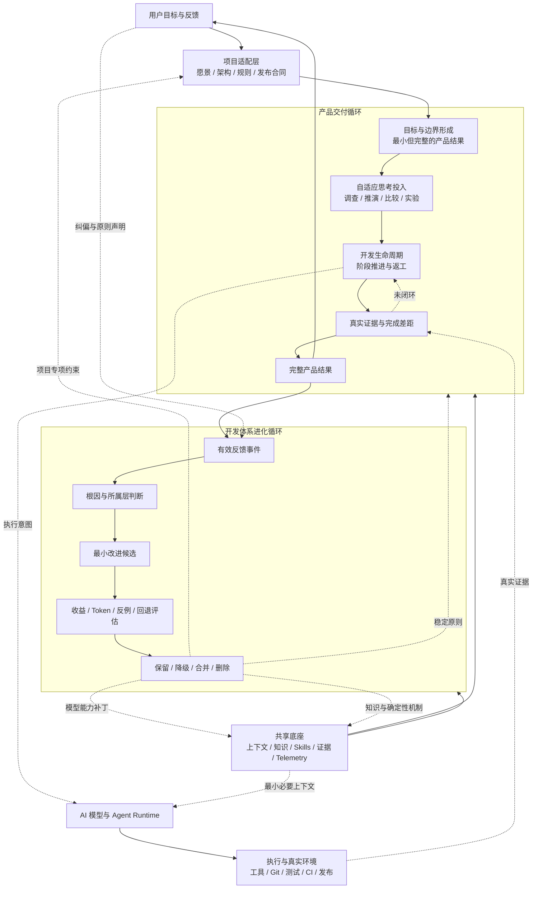

# AI 驱动开发体系架构

日期：2026-08-29

## 文档身份

- 规范名称：`AI-Driven Development System`
- 中文名称：AI 驱动开发体系
- 对话简称：开发体系
- 设计状态：北极星愿景与一级架构已确认；首批最小机制已落地；细节设计按真实反馈持续演进
- 愿景校准：2026-08-30，从“更好的 Harness”上升为“自动驾驶式开发系统”
- 来源思考：[AI 自适应迭代与受控自我改进](../thoughts/2026-08-29-adaptive-ai-iteration-governance.thought.md)

## 检索锚点

以后出现以下意图时，应优先召回本文，而不是只依据当前会话临时重新设计：

- “完善 AI 驱动开发体系”
- “完善开发体系”
- “优化开发体系”
- “落地开发体系”
- “实现开发体系架构”
- “把之前讨论的开发体系做出来”
- “同时优化产品和开发体系”
- “双循环开发体系”
- “产品交付循环 / 开发体系进化循环”
- “自适应思考投入 / 完成差距 / 上下文正则化”
- “Harness / 马具 / 骑马”
- “汽车 / 自动驾驶 / 马力十足 / 耐造 / 上天入地”

检索到本文后，先读取本文的当前结论、未决问题和落地入口；需要理解讨论依据时再读取来源 thought。不要把来源 thought、Hermes 调研和所有关联资料无条件全部加载。

## 北极星愿景：从 Harness 到自动驾驶式开发系统

行业常用 `Harness` 描述围绕 AI Agent 建设的约束、上下文、工具和执行环境。这个词准确表达了当前阶段的一部分现实：AI 像一匹能力很强但仍需人持续驾驭的马，Harness 帮助人把它控制得更稳、更高效。

但这不是 AI 驱动开发体系的终局。我们追求的不是一副越来越复杂的马具，也不是让人永远靠更密集的 Prompt、规则和检查来勒住 Agent，而是把模型、Agent、工程知识、工具和反馈机制共同建设成一套**自动驾驶式开发系统**：它有强劲动力、稳定底盘、完整感知、清晰导航、安全控制、故障恢复和持续升级能力，能在越来越少的人工微操下，把目标可靠地变成完整产品结果。

一句话愿景是：

> 把 AI 驱动开发从“人持续驾驭 Agent 完成局部动作”，升级为“人设定目的地、边界和授权，系统自主理解、设计、实现、验证、交付并受控进化”的高性能工程载具。

这套载具的关键组成不是新的同名软件模块，而是对现有体系能力的上位要求：

| 载具隐喻 | 开发体系能力 |
|---|---|
| 目的地与导航 | 产品愿景、用户目标、范围边界、完成标准和动态路线修正 |
| 发动机与动力系统 | 模型、Agent Runtime、工具、算力和必要的多 Agent 协作 |
| 底盘与传动系统 | 架构边界、owner、开发生命周期、公共合同和单一主链路 |
| 传感器与仪表 | 上下文、自感知、项目知识、真实环境、证据和 Telemetry |
| 自动驾驶系统 | 任务理解、方案决策、执行编排、验证、返工、交付和异常处置 |
| 制动与安全系统 | 授权边界、风险分级、测试、Review、确认、回退和可观察性 |
| 维护与升级系统 | 复盘、反馈归因、规则治理、能力补丁退场和受控自我改进 |
| 通用接口与扩展能力 | 可组合工具、Skill、插件、SDK、运行环境和项目适配层 |

“强大、马力十足”意味着它能利用更强模型、更多工具和更大算力完成高复杂度任务，但性能不以无边界消耗 Token 或堆叠 Agent 为代价；“非常耐造”意味着它能承受长任务、上下文变化、工具失败、环境差异和局部错误，并通过观测、恢复和返工继续闭环；“上天入地”意味着它能通过稳定内核与可插拔能力适配不同产品、技术栈、仓库和运行环境，而不是宣称脱离能力、权限和证据边界的全能。

自主程度应沿着真实能力逐步提升：

1. **Harness 阶段**：人持续分解、指挥和检查，AI 主要完成局部动作。
2. **辅助驾驶阶段**：系统能自主闭合明确阶段，人主要审批关键选择并处理异常。
3. **自动驾驶交付阶段**：在给定目标、边界和授权内，系统端到端完成调查、设计、实现、验证、Review 与交付，只在真实决策点或外部阻塞时请求用户介入。
4. **受控自进化阶段**：系统能依据长期任务结果和失败证据改进自身，同时保持可观察、可验证、可回退和由人治理。

这不是“去掉人”，而是重新分配人机职责：人拥有愿景、目的地、价值判断、权限和高风险决策；系统承担路线规划、工程执行、状态感知、质量闭环和经验积累。核心进步指标不是 Harness 规则数量，而是完整结果质量提高、端到端成功率提高、单位结果成本下降、重复失败减少，以及完成同等级任务所需的人类介入持续下降。

本文中的 `Harness` 是行业隐喻，不自动改变仓库内 `@nextclaw/harness`、`NextclawHarness` 等既有公共 API 命名；是否调整具体产品或 SDK 命名，应由独立的用户价值、兼容性和迁移证据决定。

## 一、设计对象

AI 驱动开发体系不是 NextClaw 产品的一项用户功能，也不等同于某个单独的软件、Agent、Prompt 或 Skill。

它是一套由以下内容共同组成的社会技术体系：

- 目标理解与范围判断；
- 方案思考与决策；
- 开发生命周期；
- 实现、验证、Review、交付与复盘；
- Prompt、AGENTS、Skill、Reference 和项目知识；
- 工具、脚本、测试、CI 和真实运行环境；
- Token、上下文、时间和执行效率治理；
- 从用户反馈、失败和任务结果中受控学习的机制。

它当前在 NextClaw 的真实产品开发中孵化，但概念上独立于 NextClaw，长期目标是让其中具有普适价值的部分可以服务其它产品和项目。

## 二、目标

在真实交付质量、安全和授权边界成立的前提下：

- 提高方案质量、任务速度、一次性交付完整度、AI 自主完成比例和真实场景成功率；
- 降低用户介入、返工、无效等待、重复工作、过度设计、Token 与上下文成本；
- 让开发体系能从有效反馈中改进，但不发生规则失控、过拟合和常驻上下文膨胀；
- 让通用能力与项目适配保持清晰边界，但不为未来复用牺牲当前项目效果。

## 三、核心架构结论

一级架构采用：

> 产品交付循环 + 开发体系进化循环 + 共享底座 + 项目适配层



这是一套逻辑架构，不要求立即新增同名 class、service、runtime、数据库或独立仓库。

## 四、产品交付循环

产品交付循环负责把用户意图转化为真实、完整、可交付的产品结果。

### 4.1 目标与边界形成

面对模糊输入时，AI 不默认选择最容易完成的字面任务，也不自动扩张成最大愿景，而是寻找：

> 能让用户独立使用和验收当前意图的最小完整结果。

形成的任务目标至少应包含：

- 最终用户结果；
- 必要链路和边界下限；
- 不影响当前闭环的边界上限；
- 不可交换的硬约束；
- 可观察的完成证据；
- 真正需要用户决定的选择。

大型任务允许目标合同逐步具体化：目标锚点和硬约束保持稳定，实现路径和阶段验收随调查更新。AI 可以修正地图，不能偷偷更换目的地。

### 4.2 自适应思考投入

AI 不机械执行固定方案等级，而是根据实际需要选择认知动作：

- 依据成熟模式直接决策；
- 调查当前系统事实；
- 审慎推演一个方案；
- 用一个最强挑战者检验默认方案；
- 比较多个实质方案；
- 做失败预演或反例检查；
- 先复现、实验或 Spike，再选择方案；
- 先补目标边界或验收标准。

资源投入主要依据：

- 当前不确定性；
- 做错的概率和代价；
- 决策的影响范围与可逆性；
- 是否存在实质方案分叉；
- 是否涉及公共合同、跨平台、跨 owner 或长期状态；
- 新增抽象、兼容、fallback 和平行链路的风险；
- 新一轮思考是否可能改变当前决定。

停止原则：继续投入的预期决策收益低于 Token、延迟、工具调用、验证和协调成本时停止，不为展示思考过程制造方案。

### 4.3 开发生命周期

现有 `development-lifecycle` 继续作为任务阶段状态、阶段切换、返工和完成门的唯一 owner，不新增平行总流程。

标准阶段保持：

1. Task Understanding
2. Design
3. Implementation
4. Validation
5. Review
6. Delivery
7. Retrospective

阶段存在不代表每次执行重型仪式。目标边界、自适应思考、验收契约和质量收敛是生命周期中的条件能力，不成为新的固定 phase。

### 4.4 真实证据与完成差距

执行过程中维护同一目标下的最小差距视图：

- 已经被证明的必要事实；
- 尚未证明的必要事实；
- 明确不适用的事实及理由；
- 被新证据推翻、需要返工的判断。

写完代码、测试通过、CI 成功、上传产物、更新文档和输出汇报都只证明局部事实，不能自动代表产品结果完成。

声称完成前必须反向检查：

> 如果用户现在直接使用，最可能在哪一步发现其实只完成了 80%？

只要仍存在可安全关闭的必要差距，就继续推进。

## 五、开发体系进化循环

开发体系进化循环负责让后续任务做得更好，但不抢占当前产品交付的主目标。

### 5.1 有效反馈事件

不进行持续、无条件的自我修改。主要触发信号包括：

- 用户明确纠偏或表达不满意；
- AI 声称完成后发现关键链路缺失；
- 真实验证、安装、发布或使用失败；
- 同类问题重复发生；
- 出现明显无效等待、重复读取或 Token 浪费；
- 用户明确声明长期原则；
- 某种成功做法被明确证明具有复用价值。

必须区分纠偏、信息补充、新需求、个人偏好和长期原则，不能把用户每次追加输入都误判为体系缺陷。

### 5.2 根因与落点

反馈首先经过结构归因：

```text
产品实现缺陷       -> 产品代码
稳定行为回归       -> 测试
高信号确定性约束   -> schema / script / CI
通用任务流程问题   -> 通用 Skill
条件性长合同       -> Skill Reference
项目专项判断       -> 项目适配 Skill / Reference
一次性事实         -> 任务记录或项目知识
每轮必需的高频边界 -> 极少数 AGENTS 常驻规则
```

不允许把所有反馈直接转换成 Prompt 句子。

### 5.3 候选改进与治理

候选改进至少应说明：

- 观察到的事件；
- 直接触发和结构根因；
- 当前 owner 为什么没有阻止；
- 最小改进落点；
- 一个应触发场景和一个不应触发反例；
- Token、误报、维护和行为僵化成本；
- 验证与回退方式。

修改后的结果可以被保留、合并、降级、自动化替代或删除。自我改进不等于规则只增不减。

### 5.4 与当前产品任务的关系

- 当前产品任务尚未完成时，先返回正确生命周期阶段，不用体系优化掩盖产品缺口；
- 只有开发体系缺陷正在阻止当前任务正确完成时，才中途修复体系；
- 其它高价值经验在产品交付后进入 Retrospective 和规则治理；
- 产品验收与开发体系改进分别验收，不能相互代替。

## 六、共享底座

共享底座承载两个循环共同依赖的事实和能力。

### 6.1 上下文与知识分层

```text
L0 AGENTS 常驻内核
   每轮必须知道的目标、硬边界和路由原则。

L1 路由
   判断当前意图、阶段和条件应加载哪个 owner。

L2 Skill
   当前任务或阶段每次命中都需要的决策和流程。

L3 Reference
   仅在明确子场景成立时读取的长合同和专项细节。

L4 项目知识与历史
   设计、计划、思考、日志和事实，按调查与检索需要读取。

确定性层
   schema、测试、脚本和 CI，直接阻止高信号错误。
```

### 6.2 上下文与 Token 治理

Token 治理不是只在任务结束后统计，而要参与运行决策：

- 加载前判断内容是否可能改变当前决策；
- 当前阶段只加载当前 owner，不预读未来能力；
- 一个判断分支最多要求一个直接下游；
- Reference 只在条件真实成立时读取；
- 同一任务已经完整读取且未变化的内容不重复读取；
- 工具输出只保留能支持决策的事实，不反复输出成功日志；
- 继续思考前判断新增投入可能消除什么不确定性；
- 持久化前判断最低成本且触发准确的落点；
- 已由测试或脚本确定保证的内容退出自然语言常驻提醒；
- 规则系统支持删除、合并、降级和压缩。

规则净价值可定性理解为：

```text
避免重复失败的预期收益
- 常驻上下文成本
- 误触发与冲突成本
- 维护成本
- 行为僵化成本
```

### 6.3 工具与证据

工具、脚本、测试、CI、Git、发布系统和真实环境提供可观察证据。体系不应只依赖同一个模型用自然语言自证：

- 代码正确由定向测试、类型、静态检查和真实行为支持；
- 构建正确由真实产物支持；
- 安装正确由干净或代表性环境支持；
- 用户链路正确由真实入口支持；
- 体系优化有效由后续纠偏、返工、Token 和完成率变化支持。

### 6.4 观测

`development-task-telemetry` 等 observer 只记录和投影事实，不拥有阶段路由、完成判断或模型策略。

观测应优先复用已有 rollout、工具和 CI 事实，不为了测量新增高成本模型轮次。没有可靠事实时报告 unknown，不由 AI 猜测精确 Token 或效果。

### 6.5 规则资产中的模型能力补丁

AI 模型能力会持续变化。当前一部分执行问题并不一定来自开发方法或项目规则本身，而可能来自某一代模型在主动工具调用、目标保持、方案比较、完成判断、长上下文利用或持续推进方面的暂时能力缺口。

这类补偿不得直接固化为开发体系的永久核心原则，应明确标识为：

> 模型能力补丁（Model Capability Patch）

“模型能力补丁”不是新的架构层、软件模块、runtime 或统一适配器，而是现有规则资产的一种属性。一个完整 Skill、Skill 中的一段提示词、AGENTS/Markdown 中的一条规则或其它 Prompt 内容，都可能因为“当前模型能力不足，需要额外提醒或约束”而被标记为模型能力补丁。它仍然留在原本最合适的 owner 和渐进加载位置。

模型能力补丁不是产品规则、项目规则或开发方法的长期真理。它至少需要说明：

- 正在补偿的可观察模型能力缺口；
- 适用的模型、runtime 或能力条件；
- 实际采取的最小补偿方式；
- 增加的 Prompt Token、延迟、工具调用或行为僵化成本；
- 什么证据出现后应该重新评估或卸载。

典型例子包括：

- 某类模型容易口头承诺但不立即调用工具，条件追加 tool-use enforcement；
- 某类模型在存在默认解释时仍频繁反问，条件追加先调查和可逆推进纪律；
- 某类模型容易在局部动作完成后提前结束，条件追加完成差距提醒；
- 某类模型直接给出的方案质量明显低于经过一次挑战后的结果，条件追加默认方案挑战。

但以下内容不属于模型能力补丁：

- 无论模型强弱都成立的用户结果、授权和证据边界；
- 产品代码、构建、安装、发布或运行时本身的缺陷；
- 可以由测试、schema、脚本或 CI 确定阻止的问题；
- 某个项目独有的架构、目录和发布合同；
- 工具或 provider adapter 自身的协议兼容问题。

模型能力补丁的生命周期为：

```text
观察能力缺口
  -> 排除产品、工具、上下文和流程根因
  -> 形成最小条件补丁
  -> 比较补丁开启与关闭的真实结果
  -> 在适用模型上启用
  -> 模型或 runtime 变化时重新评估
  -> 保留、收窄、替换或卸载
```

重新评估应由模型/runtime 版本变化、同类问题长期不再出现、补丁副作用上升或代表性任务结果触发。日期可以作为复查提醒，但不能只因到期自动删除；卸载同样需要最小证据，防止模型仍需补偿时发生行为回归。

若补丁在多代模型、多个 runtime 和不同项目中持续成立，应重新判断它究竟是稳定开发原则、工具合同还是确定性检查；只有完成重新归因后才允许晋升，不能因为存在时间长就自动进入常驻内核。

首期只建立“这是模型能力补丁”的轻量标识、成本意识和卸载纪律，不新增架构层、独立 patch registry、数据库、评分平台或自动 A/B 基础设施。现有 AGENTS、Skill、条件 Reference 和其它 Markdown/Prompt owner 继续承载内容；模型升级后可以检索被标识的补丁，按证据收窄或删除。

## 七、项目适配层与未来复用

开发体系当前在 NextClaw 中孵化，但采用三类边界：

### 7.1 通用内核

- 目标和边界形成；
- 自适应思考；
- 生命周期；
- 验证、Review、交付和复盘方法；
- 完成差距；
- 上下文治理；
- 反馈驱动自我改进。

### 7.2 通用机制的项目适配

- 产品愿景；
- 项目架构和 owner；
- 目录、命名和公共入口；
- 文档、质量和发布合同；
- 项目采用的专项能力与工具。

### 7.3 NextClaw 专项能力

- NCP、Kernel 和 NextClaw 产品语义；
- NextClaw NPM/runtime/Desktop 发布；
- 本仓库特有命令、脚本和运行链路。

复用遵循：在当前项目真实孵化，先保持语义边界清晰；出现第二个真实消费者、重复场景或稳定变化点后再做物理抽取。

## 八、当前 owner 映射与缺口

| 逻辑职责 | 当前主要 owner / 机制 | 当前判断 |
|---|---|---|
| 阶段状态、切换、返工、完成门 | `development-lifecycle` | 已存在，继续作为唯一流程 owner |
| 目标、现状和成功条件 | `development-task-understanding` | 已接入“最小完整结果”、必要链路与上下边界判断 |
| 大型任务验收契约 | `acceptance-contract-governance` | 已存在；保持条件能力，不普遍重载小任务 |
| 方案设计与过度设计门 | `development-design` | 已通过条件 Reference 接入自适应思考投入 |
| 质量持续收敛 | `iterative-quality-convergence` | 已存在；当前为显式探索模式，不应无条件加载 |
| 行为与运行链路证明 | Validation / Review / Delivery | 已存在；需要共享同一目标和差距事实 |
| 经验识别 | `development-retrospective` | 已接入有效反馈到体系演进候选的条件路由 |
| 开发体系演进 | `nextclaw-agent-instructions-governance` 的条件 Reference | 已可由明确意图直接触发；不新增 Skill 或 lifecycle phase |
| 规则分层与渐进加载 | `nextclaw-agent-instructions-governance` | 已接入规则生命周期、Token 净价值与模型能力补丁治理 |
| Token 与阶段事实 | `development-task-telemetry` | 已存在；只观察，不负责动态资源决策 |
| 项目知识分流 | `project-knowledge-governance` | 已存在；作为长期知识底座 |

首批落地选择复用既有 owner，只补以下机制：

1. 用 Task Understanding 和 lifecycle 阶段结果承载最小完整目标与必要缺口，不新建任务状态平台；
2. 用 Design 条件 Reference 根据不确定性选择认知动作，不固定多方案仪式；
3. 用规则治理 owner 下的条件 Reference 承接有效反馈到最小改进候选，不新增 Skill 或第二套生命周期；
4. 用规则资产生命周期和上下文治理 Reference 约束规则增删、Token 成本与模型能力补丁退场；
5. 继续保持通用机制与 NextClaw 项目适配的语义边界，等第二个真实消费者出现后再物理抽取。

### 8.1 首批实现落点

```text
.agents/skills/
├── development-lifecycle/SKILL.md
│   └── 最小完整结果与完成缺口总门
├── development-task-understanding/
│   ├── SKILL.md
│   └── references/minimum-complete-outcome.md
│       └── 目标下界、上界、必要链路与完成判定
├── development-design/
│   ├── SKILL.md
│   └── references/adaptive-deliberation.md
│       └── 按不确定性和决策收益选择思考投入
├── development-retrospective/
│   ├── SKILL.md
│   └── references/experience-abstraction-calibration.md
│       └── 有效反馈路由与最高可执行抽象层级
└── nextclaw-agent-instructions-governance/
    ├── SKILL.md
    └── references/
        ├── development-system-evolution.md
        │   └── 反馈、根因、最小候选、验证与退场闭环
        ├── rule-asset-lifecycle.md
        │   └── 规则增删、分层与模型能力补丁
        ├── context-token-governance.md
        │   └── 渐进加载、运行节流与 Token 正则化
        └── skill-topology.md
            └── Skill 分类、依赖拓扑与创建门
```

`AGENTS.md` 本批不增加常驻规则：这些机制都只在对应阶段或明确意图下需要，放入常驻内核会增加每轮上下文成本。

## 九、架构不变量

1. `development-lifecycle` 是任务阶段和返工的唯一 owner，不新增第二套总流程。
2. 产品交付优先，开发体系优化不掩盖或阻塞当前未完成产品结果。
3. 目标可以逐步细化，但不能由 AI 为方便完成而自行降级。
4. 结论强度不得超过证据强度。
5. 额外思考、调查和验证必须消除真实不确定性或高价值差距。
6. 常驻上下文是昂贵资源，新规则必须证明净收益和正确落点。
7. 自我改进必须可观察、可验证、可回退，并允许删除。
8. 通用化服务真实复用，不为未来想象新增抽象。
9. 项目专项事实不得污染通用内核，通用内核不得强迫项目接受无价值形式。
10. 观测只报告事实，不接管决策 owner。
11. 现有 Prompt、Markdown 规则或 Skill 中只为补偿当前模型能力缺口而存在的内容，应标识为模型能力补丁，并具备重新评估和卸载路径。

## 十、抽象审计

### 保留

- 现有 lifecycle 与七阶段 owner；
- 条件式验收契约、质量收敛、专项 Skill 和 observer；
- AGENTS / Skill / Reference / Script / Docs 分层；
- NextClaw 项目专项能力在项目内内聚。

### 删除或合并方向

- 后续若发现重复表达目标、完成门、Token 或规则落点的平行规则，应合并到单一 owner；
- 已由确定性检查保证的自然语言提醒应逐步删除；
- 无真实触发边界、只表达口号的规则不进入长期体系。

### 明确延后

- 独立的“开发体系 runtime”或软件产品；
- 新数据库、规则 registry、综合评分引擎；
- 自动多 Agent 辩论；
- 为所有任务固定多方案比较；
- 在没有第二个项目验证前拆独立仓库或通用插件平台；
- 无证据的全自动 AGENTS/Skill 自修改。
- 首期独立建设模型补丁 registry、数据库或自动 A/B 平台。

## 十一、后续落地入口

当用户明确要求“落地、实现或完善 AI 驱动开发体系”时：

1. 先读取本文，确认用户要求的是产品任务、开发体系任务，还是两者同时优化；
2. 对照“当前 owner 映射与缺口”，调查仓库当时的真实状态，不能假设本文记录的文件仍未变化；
3. 保留一级架构和不变量，围绕当次最有价值的缺口选择最小实现批次；
4. 若新的事实改变一级架构，先更新设计，不在实现中静默漂移；
5. 进入实现前判断是否需要执行计划；单批可以可信闭环时不为形式额外建 plan；
6. 先在 NextClaw 真实任务中验证效果，不以规则数量、文档完成或测试通过单独宣称体系有效；
7. 验证至少覆盖质量、完整性、用户介入、速度和 Token 成本，避免向单一指标优化；
8. 复用本文已经证明的判断，不重复加载全部历史讨论和成功日志。

本文是架构召回入口，不是自动实施授权。提交、发布、部署和高风险外部动作仍遵守当时的用户授权与项目规则。

## 十二、未决问题

1. 哪些规则候选允许自动试用，哪些只能生成建议，哪些必须经过用户确认？
2. 如何用已有 telemetry 低成本估计不同上下文、Skill 加载和思考动作的边际收益？
3. 除模型/runtime 变化和有效反馈外，是否存在有净收益的低频规则复核触发？
4. 第二个真实项目出现时，最小项目适配合同应该包含什么？

## 十三、设计与计划决定

- `design-document: required`：本文承担跨会话、跨批次的稳定架构召回。
- 当前 `Design Ready: yes`：首批 owner、主链路、规则落点、模型能力补丁标识和非目标已经冻结并落地；未决问题不阻塞当前机制使用。
- 当前 `plan: not-required`：首批改动可以在一个治理批次内可信闭环；后续每次演进仍按当时范围判断单批实现还是正式 plan。
