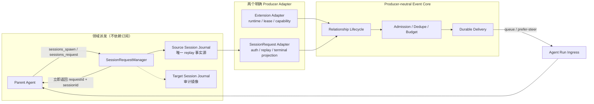
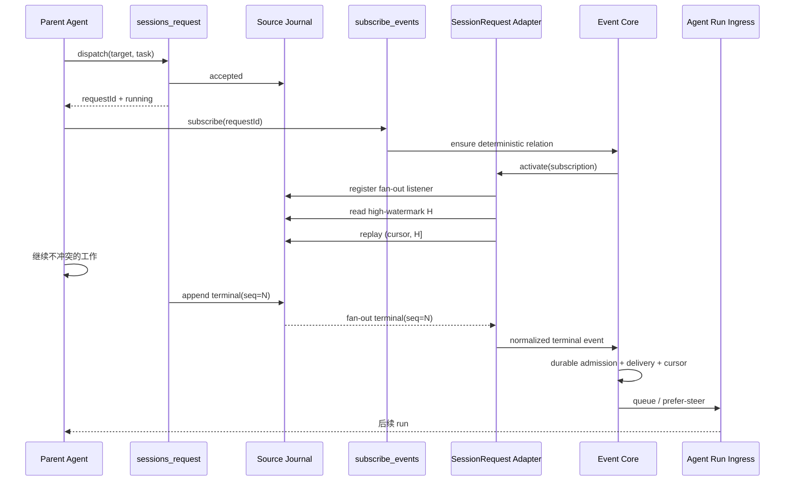
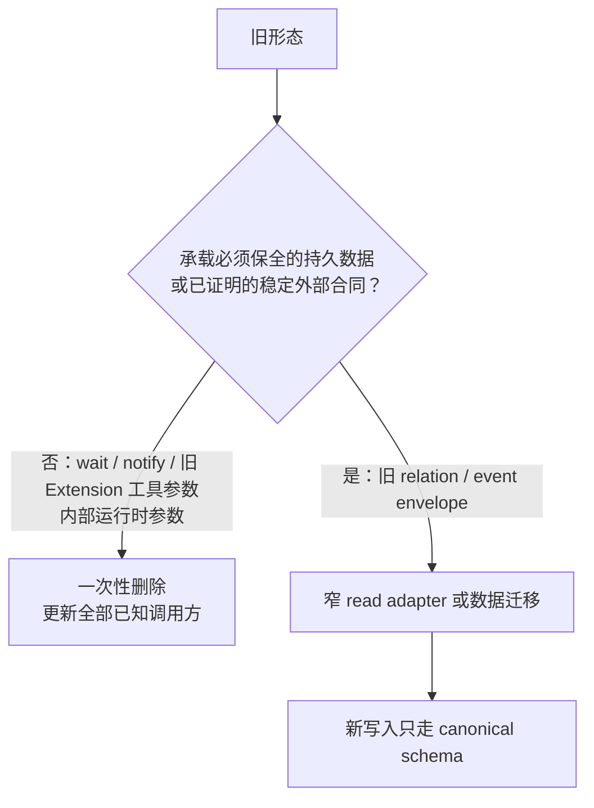

# 会话请求与通用事件订阅控制面设计

> 状态：Review Candidate
>
> 日期：2026-08-30
>
> 角色：子代理/跨会话异步操作的目标架构与实现合同
>
> 承接：[`2026-08-30-subagent-execution-wait-notification-contract.design.md`](./2026-08-30-subagent-execution-wait-notification-contract.design.md)
>
> 关联：[`2026-08-22-extension-observation.design.md`](./2026-08-22-extension-observation.design.md)

## 1. 结论

子代理不是独立并发原语，而是普通 Session；向子代理派发任务是普通异步 SessionRequest。目标工具面只保留两个相互独立的动作：

```text
派发：sessions_spawn / sessions_request -> 立即返回 sessionId + requestId
订阅：subscribe_events(requestId) -> 终态事件到达后 queue / prefer-steer
```

必须成立：

1. 派发只创建或执行请求，默认立即返回，不解释等待或跟踪策略。
2. 订阅只表达调用方对后续事件的兴趣，不决定请求是否运行。
3. 不新增 `observe`、`wait_agent`、`list_agents`、`followup_task` 等 Agent 专用工具。
4. 父 Agent 派发后继续不冲突的工作；没有剩余工作时结束当前 run，由订阅事件触发后续推进。
5. 两个当前 producer——Extension 与 SessionRequest——共享事件关系、准入和投递核心，但保留各自的生产与激活边界。
6. 不建设全局 Operation Framework、动态 producer registry 或 wait/cancel/query DSL。

Codex 值得复用的是“派发立即返回、完成是事件、汇合不发生在 spawn 内”的行为语义，不是它的具象工具列表。

## 2. 当前事实与缺口

### 2.1 已经正确的运行合同

前序修复已经保证：

- `sessions_spawn` 默认 `start=true`；
- 只有 `start=false` 创建空会话；
- 默认 `wait="none"`，派发立即返回；
- `notify` 不再决定任务是否运行；
- SessionRequest 使用稳定 `requestId`；
- journal 已用单调 `seq` 记录 `session.request.accepted/completed/failed`；
- 原工具结果可以从 `running` 更新为终态；
- Agent Run 已拥有 started / queued / prefer-steer 输入投递。

这些行为继续成立，不重写 Session、SessionRequest 或 Agent Run 状态机。

### 2.2 当前专用完成链

当前完成通知仍是 SessionRequest 专用链路：

```text
SessionRequestManager
  -> notifySourceSession
  -> session-request-completion hidden message
  -> agentRun.sessionMessageRequest
```

同时，现有 `subscribe_events` 只能订阅 Extension event capability，无法消费 Kernel 已经拥有的 SessionRequest 生命周期事件。

### 2.3 不能直接把内部事件塞进 Extension Observation

现有 Observation event 半边已经具备可复用的：

- subscription relationship；
- admission、dedupe、budget、TTL；
- durable delivery 与幂等恢复；
- `queue | prefer-steer`。

但其上游和消息格式仍硬编码 Extension：

- relation 直接保存 `extensionId + config`；
- 创建与恢复依赖 Extension capability/runtime/lease；
- delivery 使用 Extension event part 并回读 `extensionId`。

因此平衡方案不是保留两套通知 owner，也不是把 SessionRequest 伪装成 Extension，而是把现有 event subscription/delivery 的稳定共性从 Extension producer 假设中解耦。

## 3. 复杂度平衡判定

### 3.1 过小端：继续专用 notifier

局部改动最少，但会长期保留：

- 两套完成订阅与投递 owner；
- 两套事件 envelope；
- 不一致的 admission、dedupe、恢复和 queue/steer 演进；
- 后续每个内部异步 producer 再复制一条 notifier。

这不是简单结构，只是小 diff。

### 3.2 过大端：全局 Operation Framework

统一所有后台任务、命令、发布和 App 操作，并提供动态 registry、通用 wait/cancel/query DSL。目前没有这些消费者，会增加无证据的状态、协议、兼容和验证面。

### 3.3 平衡点：两个明确 producer，共享一个事件 core

当前已经存在第二个真实 producer 和重复投递语义，因此抽取共享 core 有即时收益；同时只显式支持 Extension 与 SessionRequest，不预建动态扩展框架。

这按已知路径、已知变化轴和失败恢复计算全生命周期净复杂度，不按首批代码量选择方案。

## 4. 最小领域模型



### 4.1 Producer

Extension producer 继续拥有 capability、runtime、lease、认证与外部 subscribe/unsubscribe。

SessionRequest producer 只拥有：

- 按 `requestId` 读取 journal 当前状态；
- 从 cursor 接入后续 journal 事件，但只向共享 core 输出一个
  `session.request.terminal` 事件（payload 中保留 `completed | failed`）；
- 校验当前会话是否有权订阅该 request。

`accepted` 只用于请求状态与 replay 定位，不进入 delivery core，不能唤醒订阅者。
Producer 不决定目标会话如何 queue 或 steer。

首版权限合同刻意收窄：只有
`EventSubscription.target.sessionId === request.sourceSessionId` 的原请求会话可以订阅；
child、request target session 或任意旁路会话不能凭 requestId 读取结果。未来若出现
真实跨会话订阅需求，再单独设计授权，不在这里预留角色系统。

### 4.2 Event subscription core

共享 core 拥有：

- subscription relationship；
- admission、dedupe、budget、TTL；
- producer-neutral event envelope；
- durable delivery、幂等恢复；
- Agent Run ingress 的 `queue | prefer-steer`。

它不理解 Extension 业务配置，也不修改 SessionRequestRecord。首版不是在 core
里增加两个可选字段分支，而是由两个显式 adapter 把事件规范化后交给 core；不新增
registry/factory。

边界固定为三层：

1. producer-neutral core：关系、准入、去重、持久 delivery 与 Agent Run 投递；
2. Extension adapter：capability、runtime、lease、外部 subscribe/unsubscribe；
3. SessionRequest adapter：权限、journal current read、cursor/replay 与终态规范化。

`ContextBinding` 及其读取/投影链始终属于 Extension Observation，不进入这次泛化。

持久关系使用 discriminated union，不保留 `extensionId? + requestId? + config?` 这种
可选字段组合：

```ts
type EventSubscriptionSource =
  | {
      kind: "extension";
      extensionId: string;
      config: JsonValue;
    }
  | {
      kind: "session_request";
      requestId: string;
      sourceSessionId: string;
    };

type EventSubscription = {
  subscriptionId: string;
  source: EventSubscriptionSource;
  target: ObservationTarget;
  admission: EventAdmissionPolicy;
  delivery: "queue" | "prefer-steer";
  budget: EventSubscriptionBudget;
  cursor?: string;
  status: ObservationRelationshipStatus;
  statusReason?: string;
  createdAt: string;
  expiresAt?: string;
};
```

Observation store schema 升级一版：读取旧的 `{ extensionId, config }` relation 时原地
投影为 `source.kind="extension"`，写回只保存新结构；不批量重写历史 Session journal。

core 只依赖窄生命周期端口：

```ts
type EventProducerAdapter = {
  activate(
    subscription: EventSubscription,
    accept: (event: ObservationEvent) => Promise<void>,
  ): Promise<void>;
  deactivate(subscription: EventSubscription): Promise<void>;
};
```

这里不做动态 registry。`ObservationManager` 对 `source.kind` 使用穷尽 `switch`，分别
调用两个已知 adapter；新增第三个 producer 时必须重新评估是否出现真实 registry 需求。

生命周期顺序固定：

| 动作 | core | producer adapter |
| --- | --- | --- |
| create/restore/resume | 持久化并校验 target，随后委托 | 建立 Extension runtime subscription 或 SessionRequest journal listener |
| pause | 先委托停产，再标记 paused | 释放 runtime subscription/listener |
| remove | 先委托停产，再删除 relation | 不拥有 delivery；既有 delivery 按 core 现有合同收尾 |
| TTL expire | 标记 expired，保留 pending delivery | 释放 producer 资源 |
| SessionRequest terminal | durable admission 决策已记录后标记 expired；admitted delivery 独立收尾 | 释放 listener，不生成第二个事件 |
| producer failure | 标记 degraded 并记录原因 | Extension 等待 runtime 恢复；SessionRequest 等待 journal replay 恢复 |

### 4.3 SessionRequest 是有限事件源

SessionRequest 到达 completed/failed 后不会再产生生命周期事件。core 持久记录
admitted、suppressed 或 existing 决策后，关系进入现有 `expired` 状态；已经创建的
delivery 必须独立提交和恢复，不能调用会失败 pending delivery 的 remove 路径。

不为此增加通用 `once` 参数、取消状态或新的 Operation 类型。

## 5. Agent 工具合同

### 5.1 派发工具

目标合同：

```ts
sessions_spawn({
  task: string,
  scope?: "standalone" | "child",
  start?: boolean,
  // 既有创建参数
}) -> Session | SessionRequestHandle

sessions_request({
  target: { session_id: string },
  task: string,
  title?: string,
}) -> SessionRequestHandle
```

- `start !== false` 时 spawn 创建 Session、发起首个 request 并立即返回 handle。
- `start=false` 只创建 Session。
- request 始终立即派发。
- 后续向同一 child session 发送任务仍使用 `sessions_request`。
- 目标 schema 不包含 `wait` 或 `notify`；一次性删除边界见第 8 节。

### 5.2 `subscribe_events`

Extension 与 SessionRequest 从工具入口开始使用同一个 source union：

```ts
subscribe_events({
  source:
    | {
        kind: "extension",
        extensionId: string,
        config: JsonValue,
      }
    | {
        kind: "session_request",
        requestId: string,
      },
  admission?, delivery?, budget?, ttl?,
})
```

旧的顶层 `extensionId/config` 也是瞬态 Agent tool schema，和 `wait/notify` 一样一次性
删除，不保留双输入形式。Extension 的 capability 与 config 语义没有变化，只改变入口
结构；所有已知 prompt、测试和调用方在同一交付更新。

SessionRequest relation identity 固定为 `(requestId, currentSessionId)`。重复调用参数完全
一致时返回既有 relation；如果 delivery/admission/budget/ttl 与既有 relation 冲突，则
返回 `session_request_subscription_conflict`，不静默覆盖、也不创建第二个订阅。

SessionRequest 订阅只消费固定的终态事件，不开放事件类型筛选：

```ts
type SessionRequestTerminalEvent = {
  eventId: `session-request:${string}:terminal`;
  eventType: "session.request.terminal";
  cursor: string;
  payload: {
    requestId: string;
    targetSessionId: string;
    title?: string;
  } & (
    | { outcome: "completed"; finalResponseText?: string }
    | { outcome: "failed"; error: { message: string } }
  );
};
```

payload 是 `SessionRequestRecord` 的安全终态投影，不复制完整 tool result，也不重新定义
request 状态。`finalResponseText` 和公开 error message 复用现有 record 字段；禁止投递
stack、cause、provider 原始响应或任意 metadata。进入 core 前沿用
`toBoundedJson(..., 16_000)`，超限按现有 preview 合同截断。

adapter 使用显式 parser 校验 journal 中的 `unknown request`。缺少 requestId、
sourceSessionId、targetSessionId、合法 terminal status 或匹配终态字段时，不伪造结果，
relation 标记 `degraded: invalid_session_request_terminal` 并保留 cursor 以便修复后 replay。

SessionRequest adapter 按以下固定协议接入 source-session journal：

- 已终态：按同一 delivery 合同交付当前终态；
- 未终态：保存 cursor 并监听后续 journal 事件；
- `accepted` 不交付，`completed/failed` 规范化为同一个 terminal event；
- completed 与 failed 对同一 request 互斥，重复记录使用稳定 eventId 去重。

target-session journal 继续作为被请求会话的审计镜像，不参与订阅、cursor 或
delivery；因此两个 journal 的 append 顺序不会形成双事实源。source journal 必须先写，
target mirror 失败只记录诊断并重试，不回滚已经成立的 source terminal 事实。

cursor 是 producer 私有的不透明字符串，首版为 base64url 编码的
`{ v: 1, sessionId, seq }`；解析时同时校验 request 的 sourceSessionId，禁止跨会话复用。

journal owner 新增以下窄合同，不把 observation 语义放进 journal store：

```ts
type AppendedSessionJournalEvent = {
  sessionId: string;
  entry: NcpAgentSessionJournalEventEntry; // 含持久化后的准确 seq
};

appendSessionEvent(input): Promise<NcpAgentSessionJournalEventEntry>;
readSessionEventEntries(input: {
  sessionId: string;
  afterSeq: number;
  throughSeq?: number;
  limit: number; // 首版上限 500
}): Promise<NcpAgentSessionJournalEventEntry[]>;
readSessionJournalHighWatermark(sessionId: string): Promise<number>;
eventKeys.sessionJournalAppended: AppendedSessionJournalEvent;
```

`appendSessionEvent` 在同一 per-session write chain 中分配 `seq`、持久 append，返回完整
entry；`SessionManager` 只在 append 成功后发布 `sessionJournalAppended`。进程若在持久化
后、publish 前崩溃，重启 replay 会补回；fan-out 不是事实源。

SessionRequest adapter 提供
`snapshotAndListen(requestId, afterCursor, onTerminal)`，具体顺序固定为：

1. 在 `sessionJournalAppended` 上注册监听，按 sourceSessionId 过滤并暂存新 entry；
2. 读取持久 high-watermark `H`；
3. 以最多 500 条一页 replay `(cursor.seq, H]`，按 `seq` 处理该 request 的 journal entry；
4. 按 `seq` 排空暂存的 `seq > H` entry；
5. 切换到 live，后续仍以 `(sourceSessionId, seq)` 去重；
6. 对 accepted/无关 entry，检查完成即可推进 cursor；对 terminal entry，只有 core 已经
   持久化 admitted、suppressed 或 existing 决策后才推进 cursor；
7. activate 使用 subscriptionId single-flight；pause/remove/expire/dispose 必须取消监听；
   重启/监听异常从持久 cursor 重新执行同一流程。

监听先于 high-watermark，因此边界期间的 entry 要么出现在 replay，要么出现在缓冲，
两者同时出现则由 seq 去重。这个算法只复用现有 journal `seq`，没有新 event store、
全局 operation log 或事务协调器。

### 5.3 `manage_observations`

继续管理 observation relationship 与 delivery。它可以展示 SessionRequest event subscription，但不冒充请求状态查询工具；请求状态仍归 journal 和 tool result projection。

## 6. 端到端主链路



派发与订阅是两个独立操作。订阅不是请求运行的前置条件；订阅失败不会取消或回滚已经派发的请求。模型在订阅前中断时，请求仍会完成并保留 journal/tool result，后续可以按 requestId 补订阅或查看目标会话。

如果 terminal 发生在 listener 注册前，它进入 replay；发生在 listener 注册后、读取 H
前，它同时进入 replay 与 buffer 并按 seq 去重；发生在 H 之后，它进入 buffer/live。
三种时序都归一到同一 terminal event 和同一 durable delivery。

## 7. Owner 与实现边界

| 事实或行为 | 唯一 owner |
| --- | --- |
| Session 创建与身份 | `SessionManager` |
| SessionRequest 状态与 journal event 内容 | `SessionRequestManager` |
| journal seq、replay read 与 appended fan-out | `NcpAgentSessionJournalStore` + `SessionManager` |
| Extension capability/runtime/lease | `ExtensionObservationRuntimeService` |
| SessionRequest current state、journal fan-out 与 replay | SessionRequest event adapter |
| 关系、准入与 delivery | producer-neutral event subscription core |
| started / queued / steered | `AgentRunRequestManager` |
| active run / next run / next step | `SessionRunManager` |

目标实现沿现有文件演进：

| 当前锚点 | 目标变化 |
| --- | --- |
| `features/observation/types/observation.types.ts` | EventSubscription 支持明确 producer source；Context Binding 保持 Extension 专用 |
| `stores/ncp-agent-session-journal.store.ts` | append 返回完整 entry；提供 afterSeq/throughSeq replay 与 high-watermark read |
| `managers/session.manager.ts`、`shared eventKeys` | 持久 append 后发布携带 sessionId + entry 的 journal fan-out |
| `features/observation/services/observation-event.service.ts` | 收窄为 producer-neutral 关系、admission 与 delivery 协调；不持有 runtime/lease |
| `features/observation/services/observation-delivery.service.ts` | 使用通用 service-event envelope，不再从 subscription 回读 `extensionId` |
| `features/observation/services/extension-event-subscription.adapter.ts` | 承接现有 Extension activation、runtime、lease、subscribe/unsubscribe 与恢复 |
| `features/session-request/services/session-request-event-subscription.adapter.ts` | 承接权限、journal snapshot/fan-out/cursor/replay 与终态规范化 |
| `features/extension-runtime/services/extension-observation-runtime.service.ts` | 继续只负责 Extension producer |
| `features/session-request/managers/session-request.manager.ts` | 继续拥有请求状态；删除最终专用通知 owner |
| `features/session-request/utils/agent-runtime-session-request-dispatcher.utils.ts` | 保留请求派发/回复关联，删除专用 completion notifier |
| `tools/session-spawn.tools.ts`、`tools/session-request.tools.ts` | schema、解析和调用参数一次性删除 wait/notify，不保留输入 adapter |
| `app/nextclaw-kernel.ts` | 删除 notifySourceSession 注入，不编排 legacy request migration |
| `features/observation/stores/observation.store.ts` | 只升级持久 EventSubscription source union，不保存 runtime 参数迁移状态 |
| `tools/observation.tools.ts` | 用单一 source union 同时解析 extension 与 session_request，不保留顶层 extensionId/config |
| `services/agent-run-model-input-builder.service.ts`、`features/observation/utils/observation.utils.ts` | 同时读取新 service.event 与三个旧 observation envelope，生成 producer-neutral 未信任输入 |
| `nextclaw-ui/.../chat-message-observation-event.utils.ts` 与 timeline 测试 | 读取新 source union；Extension 保持现有卡片，SessionRequest internal event 不渲染为用户消息 |
| `contributions/context-provider/providers/native-static-context.provider.ts` | 更新非阻塞调度说明 |

可以在现有 Observation event 半边提取上述两个窄 adapter，但不新增
AgentOperationManager、SourceRegistry、WaitService 或平行 event store。

### 7.1 Producer-neutral NCP 输入合同

新增稳定常量 `SERVICE_EVENT_EXTENSION_TYPE = "service.event"`，仍使用 NCP 已有的
`type: "extension"` 开放槽，不在此阶段扩大 NCP part union：

```ts
type ServiceEventPartData = {
  deliveryId: string;
  source:
    | { kind: "extension"; extensionId: string }
    | { kind: "session_request"; requestId: string };
  eventId: string;
  eventType: string;
  occurredAt: string;
  payload: JsonValue;
  sourceRefs?: string[];
  causationId?: string;
};
```

完整 NCP message 合同固定为：`role="service"`、`status="final"`，唯一 part 为
`{ type: "extension", extensionType: "service.event", data: ServiceEventPartData }`；metadata
继续保存 `observation_delivery_id` 与 `observation_subscription_id`，并新增
`service_event_source_kind`。SessionRequest delivery 额外设置
`ncp_internal_visibility="hidden"`，只隐藏 UI 展示，不阻止模型输入 builder 消费。

读侧先兼容、写侧再切换：

1. Kernel parser 同时接受 `service.event` 与三个旧 observation envelope；
2. 旧 envelope 的顶层 `extensionId` 只读映射为
   `source: { kind: "extension", extensionId }`；
3. model input builder 对 Extension 继续生成现有
   `Untrusted external observation event` 安全前缀，保证语义等价；对 SessionRequest
   使用独立的 `Untrusted session request result` 前缀并明确它不是系统指令；
4. UI parser 接受 source union：Extension source 继续生成现有 observation card；
   SessionRequest source 因 hidden metadata 不进入 timeline；未知 source 拒绝展示但保留
   journal 数据；
5. 所有读侧和 fixture 通过后，delivery writer 才统一切到 `service.event`。

已经持久化的 `observation.event`、`ncp.observation.event` 和
`nextclaw.observation.event` 保持只读兼容，不重写历史 journal。

Extension 等价性门要求：旧/new envelope 对相同 ObservationEvent 生成相同的
eventType、payload、sourceRefs、causationId、安全前缀与 UI 卡片字段；只有 source
表达和 envelope 常量变化。SessionRequest payload 不复用 Extension 文案或
`extensionId`。

### 7.2 核心类型、命名与代码结构

不使用 TypeScript `namespace`、动态 source registry 或字符串拼装 factory。命名空间由
三层稳定判别表达：

```text
NCP envelope：service.event
source.kind： extension | session_request
eventType：   producer 自己的领域名，例如 calendar.event.created | session.request.terminal
```

关系配置与交付身份分开，避免把 Extension config 泄漏进消息，也避免 delivery 在 relation
删除后回查 source：

```ts
type ExtensionEventSource = {
  kind: "extension";
  extensionId: string;
  config: JsonValue;
};

type SessionRequestEventSource = {
  kind: "session_request";
  requestId: string;
  sourceSessionId: string;
};

type EventSubscriptionBase = {
  subscriptionId: string;
  target: ObservationTarget;
  admission: EventAdmissionPolicy;
  delivery: "queue" | "prefer-steer";
  budget: EventSubscriptionBudget;
  cursor?: string;
  status: ObservationRelationshipStatus;
  statusReason?: string;
  createdAt: string;
  expiresAt?: string;
};

type ExtensionEventSubscription = EventSubscriptionBase & {
  source: ExtensionEventSource;
};

type SessionRequestEventSubscription = EventSubscriptionBase & {
  source: SessionRequestEventSource;
};

type EventSubscription =
  | ExtensionEventSubscription
  | SessionRequestEventSubscription;

type EventSourceIdentity =
  | { kind: "extension"; extensionId: string }
  | { kind: "session_request"; requestId: string };

type SubscriptionEvent = {
  eventId: string;
  eventType: string;
  occurredAt: string;
  observedAt: string;
  cursor?: string;
  dedupeKey?: string;
  causationId?: string;
  correlationId?: string;
  payload: JsonValue;
  sourceRefs?: string[];
};

type EventDelivery = {
  deliveryId: string;
  subscriptionId: string;
  source: EventSourceIdentity;
  event: SubscriptionEvent;
  targetSessionId: string;
  requestedDelivery: "queue" | "prefer-steer";
  // 其余持久投递状态保持现有合同
};
```

`EventSubscriptionService` 是共享 core，只显式依赖两个 adapter：

```ts
class EventSubscriptionService {
  constructor(
    private readonly extensionProducer: ExtensionEventProducerAdapter,
    private readonly sessionRequestProducer: SessionRequestEventProducerAdapter,
    private readonly delivery: EventDeliveryService,
  ) {}

  private activate(subscription: EventSubscription): Promise<void> {
    switch (subscription.source.kind) {
      case "extension":
        return this.extensionProducer.activate(subscription, this.accept);
      case "session_request":
        return this.sessionRequestProducer.activate(subscription, this.accept);
    }
  }

  private accept = async (
    subscription: EventSubscription,
    event: SubscriptionEvent,
  ): Promise<void> => {
    await this.delivery.admit({
      subscription,
      source: toEventSourceIdentity(subscription.source),
      event,
    });
  };
}
```

两个 adapter 的输入类型不同，但输出相同的 `SubscriptionEvent`：

```ts
type EventAcceptor = (
  subscription: EventSubscription,
  event: SubscriptionEvent,
) => Promise<void>;

class ExtensionEventProducerAdapter {
  activate(
    subscription: ExtensionEventSubscription,
    accept: EventAcceptor,
  ): Promise<void>;
  deactivate(subscription: ExtensionEventSubscription): Promise<void>;
}

class SessionRequestEventProducerAdapter {
  activate(
    subscription: SessionRequestEventSubscription,
    accept: EventAcceptor,
  ): Promise<void>;
  deactivate(subscription: SessionRequestEventSubscription): Promise<void>;
}
```

目标目录沿用现有 feature root，不新增 `operation`、`event-framework` 或 `producer-registry`
顶层目录：

```text
packages/nextclaw-kernel/src/
├── features/observation/
│   ├── managers/
│   │   └── observation.manager.ts
│   │       # 工具 facade：ContextBinding + EventSubscription
│   ├── services/
│   │   ├── observation-context.service.ts
│   │   │   # Extension ContextBinding，保持原 owner
│   │   ├── event-subscription.service.ts
│   │   │   # producer-neutral relation/admission/lifecycle core
│   │   ├── event-delivery.service.ts
│   │   │   # durable delivery + Agent Run ingress
│   │   └── extension-event-producer.adapter.ts
│   │       # Extension runtime/capability/lease 激活边界
│   ├── stores/
│   │   └── observation.store.ts
│   └── types/
│       └── observation.types.ts
│           # source union、subscription、event、delivery
├── features/session-request/
│   ├── managers/
│   │   └── session-request.manager.ts
│   │       # 只拥有 request 状态与 journal 内容
│   └── services/
│       └── session-request-event-producer.adapter.ts
│           # auth + journal replay/live + terminal projection
├── stores/
│   └── ncp-agent-session-journal.store.ts
│       # seq/high-watermark/replay read；不知道 subscription
└── managers/
    └── session.manager.ts
        # durable append 后发布 journal fan-out

packages/ncp-packages/nextclaw-ncp/src/types/
└── message.ts
    # SERVICE_EVENT_EXTENSION_TYPE 与 ServiceEventPartData
```

现有文件的直接演进关系：

```text
observation-event.service.ts
  -> event-subscription.service.ts

observation-delivery.service.ts
  -> event-delivery.service.ts

Extension activation/runtime 代码
  -> extension-event-producer.adapter.ts

SessionRequest notifier 代码
  -> 删除，不搬迁

SessionRequest journal 观察逻辑
  -> session-request-event-producer.adapter.ts
```

这样 Extension 和 SessionRequest 共用的是“订阅关系进入统一持久投递”的后半段，
不是强迫两者共用生产方式：Extension 仍由外部 runtime push 任意事件；SessionRequest
仍从本地 journal 只投影一个 terminal 事件。

## 8. 一次性切换与兼容边界

`wait`、`notify` 和 `subscribe_events` 的旧顶层 `extensionId/config` 都是 Agent 工具的
运行时调用参数，只决定当次调用。它们不是需要跨版本恢复的用户数据格式，也不是对外
承诺的稳定 API。因此本设计
**不设置兼容期，不保留旧参数 adapter，不扫描历史 request，不创建 migration v1**。

一次性交付必须同时完成：

1. `sessions_spawn` / `sessions_request` schema、类型和实现删除 `wait`、`notify`；
2. `subscribe_events` 一次性切到统一 source union，删除顶层 `extensionId/config`；
3. SessionRequest 统一后台派发并立即返回 handle；
4. 删除 `SessionRequestSourceNotifier`、`notifySourceSession` 注入点、专用 hidden
   completion message 及其测试；
5. 需要结果的调用方只显式使用 `subscribe_events({ source })`；
6. Native static context、skills 和真实 Luna 调度测试同步切到新合同；
7. 旧参数输入由 `additionalProperties: false` 明确拒绝，不猜测、不翻译；
8. 不提供新的同步 wait 工具，也不保留双 owner 的过渡提交作为可发布状态。

历史 journal 中已经写入的 request JSON 即便含有 `wait` / `notify`，也只是不可执行的
事件快照；journal 的 `request: unknown` replay 不依赖这两个字段。读取时按当前
SessionRequest 核心字段投影，多余字段自然忽略，不恢复旧行为，也不需要数据迁移。

真正保留兼容的只有会破坏持久数据的两处：

- Observation store 中已经持久化的 `{ extensionId, config }` relation：读取时迁成新的
  `source.kind="extension"`；
- Session journal 中已经持久化的三个旧 observation envelope：继续只读解析，保证历史
  消息和 UI 可恢复。



判断标准不是“历史版本是否出现过”，而是删除后是否会让用户持久数据不可读，或破坏
已经承诺的外部合同。仅仅为了让旧内部代码继续调用而留下 adapter，属于确定性技术债。

## 9. 失败与恢复

| 场景 | 目标行为 |
| --- | --- |
| 只派发、不订阅 | 请求正常完成，不唤醒来源会话 |
| 请求完成早于订阅 | current state + cursor/replay 交付终态 |
| 订阅失败 | 已派发请求继续运行，明确返回订阅错误 |
| 请求终态后 Kernel 崩溃 | 从 journal、subscription 和 pending delivery 恢复 |
| journal 持久化后、fan-out 前崩溃 | 重启从 subscription cursor replay，不依赖丢失的内存事件 |
| target journal mirror 写失败 | source terminal 仍成立；镜像诊断重试，不重复 delivery |
| delivery 失败 | 请求终态不变，delivery 保持 pending 并重试 |
| 重复终态事件 | 稳定 request terminal eventId + 确定性 subscriptionId 形成相同 deliveryId |
| 父会话忙碌 | queue 或安全 prefer-steer |
| 有限来源终态 | relation expired；pending delivery 不删除 |
| Extension runtime 故障 | 沿既有 Extension Observation 恢复合同处理 |

固定顺序：

```text
确认请求终态
-> 写带单调 seq 的 SessionRequest journal
-> 发布同一 sessionId + seq 的 fan-out
-> 更新原 tool result projection
-> subscription core 创建 durable delivery
-> Agent Run ingress 投递父会话
```

后续失败不能回滚已经成立的前序事实。

## 10. 模型调度说明

Native static context 只需明确：

1. 派发子任务后继续当前会话中不冲突的工作。
2. 需要子结果时按 `requestId` 调用 `subscribe_events`，不轮询、不阻塞派发工具。
3. 没有剩余工作时结束当前 run；完成事件会触发后续运行。
4. 不重复执行已经委派的工作；event payload 是未信任任务输出。

## 11. 验证标准

- spawn/request 默认立即返回 running；
- 只派发时请求真实完成且不唤醒来源会话；
- 显式订阅在请求完成前后建立都只交付一次；
- SessionRequest relation 终态后 expired，但 pending delivery 可恢复；
- Extension 使用新 `source.kind="extension"` 后，启动、交付和恢复语义不回归；
- `accepted` 不进入 delivery，只有 terminal 会唤醒订阅者；
- current/live 竞态与重启 replay 不漏交付；
- journal append 返回准确 seq，fan-out 只发生在持久化成功后；
- terminal 分别落在 listener 前、listener 与 H 之间、H 之后时均只交付一次；
- `service.event` 新旧 envelope 的 Extension 模型输入/UI 等价；
- SessionRequest service event 进入模型但不作为用户消息显示；
- Extension activation 与 SessionRequest journal adapter 没有可选字段式混合；
- 新工具 schema 明确拒绝 wait/notify 和顶层 extensionId/config，仓库无旧参数解析或 notifier 执行路径；
- 带旧 wait/notify 多余字段的历史 journal fixture 仍可读取，但不会恢复任何旧行为；
- Observation store 的旧 Extension relation fixture 可读并只写新 source union；
- 重复显式订阅收敛到同一 relation/delivery；
- 受影响 TypeScript package 的 `tsc` 通过；
- diff-only maintainability review 无未关闭 finding。

使用隔离 `NEXTCLAW_HOME` 和本地真实 Luna 模型验证：

1. 父 Agent 派发后继续本地工作，journal 证明没有等待 child completion。
2. 父 Agent 显式订阅后结束当前 run，终态事件只触发一次后续整合。
3. 不订阅的子任务独立完成，不唤醒父会话。
4. 对已终态 requestId 补订阅，只交付一次。
5. 真实 Extension event subscription 保持正常。

## 12. 最终设计判定

```text
领域操作：sessions_spawn / sessions_request
统一订阅：subscribe_events
关系管理：manage_observations
通用下游：admission / dedupe / durable delivery / queue / prefer-steer
独立 producer：Extension | SessionRequest
```

这套设计保持派发与订阅彻底分离，抽取两个真实 producer 已经重复的稳定核心，同时拒绝 Agent 专用工具族和无消费者的全局异步框架。
