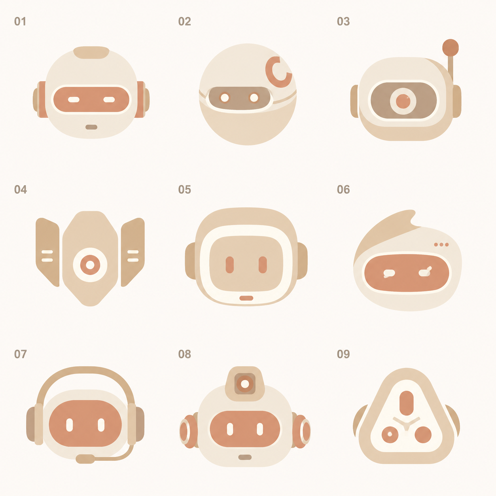
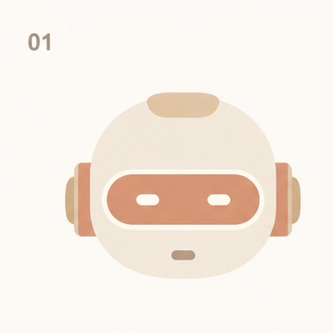
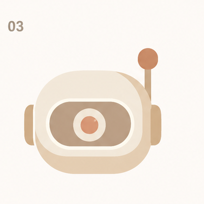
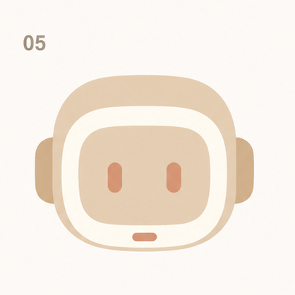
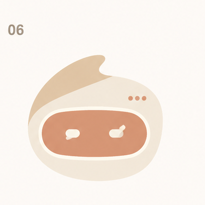
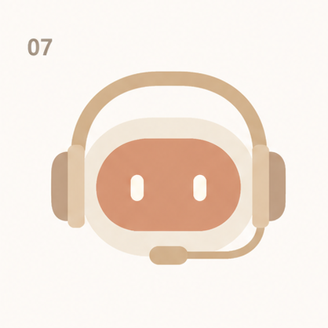
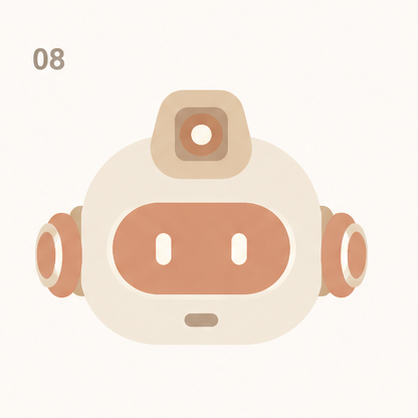

# Main Agent 头像候选

## 背景

默认 Main Agent 需要一个能直接传递“AI Agent 主体感”的头像。当前阶段先保留宽方向，不把生成式草图直接当作正式产品资产。

完整探索母版：

## 核心判断

- 头像首先应像一个有感知、在场、可协作的 AI Agent，而不是 NextClaw 品牌标志或宏大产品概念。
- 用户当前保留 `01`、`03`、`05`、`06`、`07`、`08` 六个方向，后续筛选不应丢失这些锚点。
- 生成图只用于形状探索；正式交付前必须确定性重绘为 SVG，并在真实 `16px / 20px / 24px` 尺寸及单色状态下验收。

## 方案空间

| 候选 | 方向 | 预览 |
| --- | --- | --- |
| 01 | 安静的感知带机器人 |  |
| 03 | 单核心天线 Agent |  |
| 05 | 柔和方头 Agent |  |
| 06 | 非对称有机 AI 实体 |  |
| 07 | 轻量操作员 Agent |  |
| 08 | 模块化感知 Agent |  |

## 推荐倾向

暂不收敛。下一轮应保留六个候选作为锚点，根据用户选择再进入单个方向的结构精修；不能把“继续优化”理解成擅自缩窄到少数方向。

## 未决问题

- 哪个候选最符合 Main Agent 的长期气质。
- 最终头像应更偏角色、工具感还是有机 AI 实体。
- 真实 20px 场景需要保留哪些结构特征、删除哪些生成式细节。

## 升级条件

用户选定一个或少数方向，并明确要求收敛后，升级为确定性 SVG 设计与真实 UI 尺寸验收；形成稳定视觉合同后再进入 `docs/designs`。
