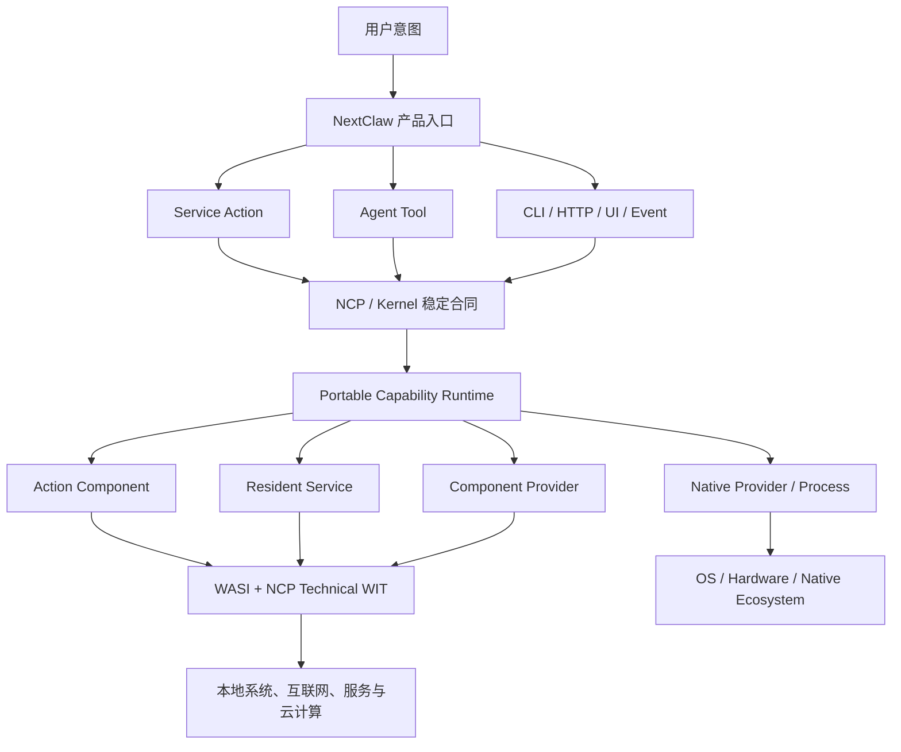

# NextClaw 可移植能力运行时全景说明与场景设想

## 文档状态与角色

- 日期：2026-08-28
- 状态：讨论沉淀，持续补充，尚未形成实施承诺
- 角色：帮助从产品、开发者、运行时、安全、生态和长期演进多个视角吃透 Portable Capability Runtime
- 架构决策 owner：[WASI Service App 运行时与现有 Mini App 体系融合设计探索](../designs/2026-08-28-wasi-service-app-runtime.design.md)
- 本文不是另一份平行设计：涉及 owner、协议、选型、迁移和验证的最终取舍一律回到主设计冻结

## 一、一句话抓住它

> 这不是“把 JavaScript 换成 Rust/WASM”的单项优化，而是在 NextClaw 和所有扩展之间建立一层跨语言、跨平台、可授权、可组合的能力插座标准。

WASM Component 是可移植能力单元；WIT 是它和外部世界之间的强类型合同；WASI 与 NCP Technical WIT 提供有限根能力；NextClaw 把这些能力投影成 Service Action、Agent Tool、CLI、HTTP、事件和 UI；Spin、`wash-runtime`、Wasmtime 只是可替换的执行实现。

## 二、最容易理解的比喻：发电机、电器和插座

当前每个 JavaScript Service App 近似于一家小店为了运行一件电器，自己携带一台 Node/V8 发电机：即使业务很小，也需要单独承担 V8 heap、GC、模块加载器、事件循环、进程和 MCP/stdio 外壳。

Portable Capability Runtime 更像大楼统一供电：

| 真实概念 | 比喻 | 含义 |
| --- | --- | --- |
| WASM Component | 电器 | App 的业务逻辑与状态机 |
| WIT | 插头规格 | 输入、输出、依赖、类型和版本 |
| WASI | 标准电网 | 网络、文件、时间、随机数、I/O |
| NCP Technical WIT | 楼宇扩展插座 | KV、Secret、事件、调度、日志等技术能力 |
| Capability Provider | 适配器 | 把抽象能力连接到本地、云端或平台实现 |
| NextClaw | 物业与配电 owner | 身份、安装、授权、资源、生命周期、产品入口 |
| Spin / `wash-runtime` / Wasmtime | 发动机与配电设备 | 装载、链接、实例化和执行 Component |

Docker 更像给应用搬来一整套房间、操作系统和生活设施。本方案只提供经过授权的能力，不提供完整操作系统，所以它不是“小 Docker”。

## 三、它不是什么

为了避免兴奋后产生错误预期，需要同时记住五个否定：

1. 它不是“把所有 Python/JavaScript 自动编译成低内存机器码”。
2. 它不是“任何 Linux、npm、pip 应用都能原封不动运行”。
3. 它不是新的平行 App 产品；用户看到的仍是 NextClaw Service App。
4. 它不是把所有能力硬编码进 NextClaw 内核。
5. 它不是框架绑定；NextClaw 不应变成 Spin 或 wasmCloud 的外壳。

## 四、真正的抽象：任意逻辑与有限外部效果分离

任何应用都可以拆成：

```text
应用 = 任意计算逻辑 + 与外部世界交互
```

任意计算逻辑包括文本处理、规则判断、协议解析、数据转换、状态机、工作流、搜索、排序、AI 前后处理和领域业务，其组合数量没有现实上限。

真正要求宿主配合的，是有限类别的外部效果：

- 网络；
- 文件与数据；
- Secret 与身份凭证；
- 时间、随机数与调度；
- 事件和消息；
- 日志与资源；
- 摄像头、GPU、系统自动化等设备或平台能力。

这解释了为什么“有限基础能力”仍能支持广泛应用。浏览器没有为 Gmail、Figma、Notion 和每个游戏分别提供专用 API，它只提供网络、存储、DOM、图形和音视频等有限根能力，上层仍然形成巨大生态。

必须区分两种“通用性”：

| 目标 | 能否做到 | 说明 |
| --- | --- | --- |
| 实现几乎任意新的产品逻辑 | 可以达到很高上限 | 任意计算加可组合的外部能力 |
| 原封不动运行任意既有软件 | 不能默认承诺 | 会要求 POSIX、子进程、动态链接、平台 API，逐渐走向容器 |

新生态优先追求前者；旧软件与系统专属程序继续使用 `native-process`。

## 五、分层全景



从上到下的 owner 是：

- NextClaw 拥有产品身份、安装、授权、UI、Marketplace、状态和用户体验；
- NCP/kernel 拥有稳定的 Service、Runtime、Tool 与 Capability 公共合同；
- Runtime 执行并隔离组件；
- Component 提供业务逻辑；
- Provider 把抽象能力连接到现实世界。

## 六、WIT 到底意味着什么

WIT 不是通用编程语言，也不描述内部算法。它只描述组件边界：组件向外 export 什么，运行时必须为它 import 什么。

概念示例：

```wit
world mail-watcher {
  export actions;
  export event-handler;

  import outbound-http;
  import secrets;
  import key-value;
  import scheduler;
  import logging;
}
```

这份合同意味着：

- NextClaw 可以调用它的 actions；
- Scheduler 可以把事件交给它；
- 它只可以经授权访问 HTTP、Secret、KV、调度和日志；
- 没有文件系统 import 就不能读用户文件；
- 没有系统自动化 import 就不能控制鼠标键盘；
- 测试可以把这些 imports 换成模拟实现；
- 另一个组件可以 export 相同接口来满足它的依赖。

WIT 同时充当：

- 跨语言 ABI；
- SDK 生成源；
- 权限需求描述；
- 组件组合连接点；
- 版本化公共合同；
- 测试替身接口。

官方 Component Model 把 `world` 定义为 imports 与 exports 的严格边界，并允许由宿主或其它组件完成 composition：

- [Worlds](https://component-model.bytecodealliance.org/design/worlds.html)
- [WIT Reference](https://component-model.bytecodealliance.org/design/wit.html)
- [Composing Components](https://component-model.bytecodealliance.org/composing-and-distributing/composing.html)

## 七、为什么不能只在 WASM 里继续模拟 MCP stdio

如果 Component 仍然只做：

```text
invoke(actionId, JSON bytes)
```

它仍然可以获得便携性、沙箱和一定内存收益，但会浪费 Component Model 的主要优势：

- 宿主只能看到一团动态 JSON，难以静态分析依赖；
- 组件之间无法自然按强类型接口组合；
- 语言 SDK 只能围绕通用 envelope 生成；
- 能力接口的独立版本化会变弱；
- 产品 Action 与组件真正能力被强制压成同一种形状。

更合理的关系是：

```text
组件真实 WIT exports
        ↓ 唯一投影层
Service Action / Agent Tool / CLI / HTTP / UI
```

首版可以为了范围和现有兼容，只正式识别一个 `ncp:service/actions` world；但设计上应允许未来识别更多标准 WIT exports，而不是把任意能力永久塞进 JSON-RPC。

## 八、三层能力供给：为什么 NextClaw 底层不会无限膨胀

### 8.1 宿主根能力

由 NCP/NextClaw Runtime 长期提供，必须跨应用、可授权、可限额、可审计：

- HTTP、socket、文件、stream；
- clocks、random；
- KV、Blob、必要的数据能力；
- config、Secret；
- event、scheduler；
- logging、metrics、结构化错误；
- memory、CPU、并发、超时、取消。

### 8.2 可移植 Component Provider

由 App 或第三方生态提供，不进入 NextClaw 内核：

- Markdown/PDF 解析；
- OAuth 与签名；
- GitHub、Notion 等协议 adapter；
- 数据格式转换；
- 脱敏、过滤、限流、重试中间件；
- 纯计算算法；
- 可移植数据库客户端。

一个组件的 export 可以满足另一个组件的 import，所以大量“底层缺失能力”其实可以由应用自己携带和组合。

### 8.3 Native Provider

只有真正触碰操作系统、硬件或原生依赖的最后一段需要平台实现：

- macOS Accessibility；
- Windows UI Automation；
- 摄像头、麦克风、蓝牙；
- GPU 和本地模型加速；
- 浏览器自动化；
- 特殊设备；
- 无法移植的 native library。

一个 App 可以保留跨平台 WASM 核心，只附带少量不同平台的 provider。这样重新引入的多平台构建被限制在不可避免的边缘，而不是扩散到整个 Service。

## 九、一次调用的完整旅程

以“监控 GitHub 仓库并提醒重要 Issue”为例。

### 9.1 安装

`.napp` 包含产品元数据、Component、WIT imports/exports、权限声明、生命周期和可选 UI。NextClaw 可以在安装前展示：

```text
需要：
- 访问 api.github.com
- 读取 github-token Secret
- 使用本 App 私有 KV
- 每 10 分钟运行一次
- 发送本地通知
```

### 9.2 授权

授权可以缩小到：

- 只访问指定域名；
- 只引用指定 Secret；
- 只访问自己的 KV namespace；
- 定时频率不低于某个阈值；
- 单次 CPU、内存、输出、并发和执行时间有限额。

### 9.3 运行

```text
NextClaw Scheduler
  -> 调用 Component event-handler
  -> Component 请求 outbound-http
  -> Runtime 校验域名授权
  -> Component 读取 Secret 与同步游标
  -> 业务逻辑计算新增 Issue
  -> 导出结构化结果
  -> NextClaw 投影成通知、Service Action 或 Agent 事件
```

组件不直接获得 socket、真实 Secret 文件或用户全部数据。它得到的是本次 App、实例和授权上下文中允许使用的能力。

### 9.4 迁移

任务从桌面迁移到家庭服务器时：

- Component 不变；
- WIT 合同不变；
- `.napp` 产品身份不变；
- 重新绑定服务器上的 HTTP、Secret、KV 和通知 provider。

这叫能力可移植，而不只是同一个二进制可以启动。

## 十、两种主要工作负载

### 10.1 Action Component

适合查询、转换、Agent Tool、一次性事件和短任务。Runtime 可以按需实例化、缓存编译结果、复用实例、限制并发并在空闲后回收。

它是解决大量小 Service App 固定 Node/V8 成本的主力。

### 10.2 Resident Service

适合 WebSocket、目录监听、消息订阅、同步循环和长期状态机。它长期存在，但仍受 capability、内存、CPU、超时、取消和隔离约束。

不能让组件依赖“运行时碰巧复用了这个实例”保存关键状态。需要长期状态的组件必须显式选择 Resident 生命周期或把持久状态外置。

Spin 4 已经支持 WASI 0.3 async export、stream/future、同一实例并发处理和实例复用；wasmCloud 也明确区分 invocation-based Component 与长期、带状态的 Service：

- [Spin 4.0](https://spinframework.dev/blog/announcing-spin-4-0)
- [Spin instance reuse](https://spinframework.dev/v4/http-trigger)
- [wasmCloud Services](https://wasmcloud.com/docs/wash/developer-guide/create-services/)

## 十一、共享 runner 的真实含义

推荐一个 NextClaw 产品级 runner，是为了共享：

- Wasmtime Engine；
- 编译缓存；
- host capability 实现；
- 调度线程；
- 日志与资源治理固定成本。

它不意味着所有 App 共享同一块可读写内存。每个实例仍应有独立 Store、线性内存、授权上下文、资源预算和错误边界。

可能的内部演进是：

```text
第一版：一个共享 runner

以后：有限 runner pool
  ├─ 普通信任域
  ├─ 高权限系统能力域
  └─ 高资源工作负载域
```

进程拓扑不应进入公开 App 合同。这样既能先获得密度，也能以后缩小 runner 崩溃的影响范围。

Wasmtime pooling allocator 可以提升实例化速度，但会预留较大虚拟地址空间，也可能保留已经触达的热内存，因此不能只看“WASM 很轻”的理论值，必须在桌面端测量真实 RSS、空闲回收和跨平台行为。[Wasmtime pooling allocator](https://docs.wasmtime.dev/api/wasmtime/struct.PoolingAllocationConfig.html)

## 十二、从不同角色看价值

### 12.1 用户视角

- 安装一个 App，不需要理解它的语言和执行框架；
- 权限可以精确解释，而不是只弹出“运行任意程序”；
- 多个小 Service 同时活跃时固定内存更低；
- 同一 App 更容易覆盖多个平台；
- App 失败、超时或越权有结构化结果；
- 本地与远端执行位置可以逐步统一。

### 12.2 App 开发者视角

- 用 WIT 生成语言绑定；
- 一次构建主要 Component；
- 不必自己维护 Service 进程、RPC、重启、日志和权限外壳；
- 可以复用第三方 Component Provider；
- 同一 export 可以投影到 Tool、Action、CLI 和 HTTP；
- 测试时可替换网络、时间、存储和 Secret。

### 12.3 NextClaw 平台视角

- 不为每种语言重复实现生命周期；
- 不为每个业务 App 增加专用底层 API；
- 将稳定能力沉淀为 NCP/kernel SDK；
- 用同一授权模型管理本地、远端和生态组件；
- 运行时实现可替换，不锁死产品合同；
- 为 Marketplace 形成机器可读的接口和权限基础。

## 十三、代表性产品场景

| 场景 | 形态 | 能力组合 | 为什么适合 |
| --- | --- | --- | --- |
| 文本、文件、数据转换 | Action Component | 文件、Blob、日志 | 无需常驻运行时 |
| 邮箱、RSS、GitHub 监控 | Resident Service | HTTP、Secret、KV、调度 | 长期低成本自动化 |
| Agent Tool Pack | Action Component | 强类型参数、网络、数据 | 同一能力复用多个产品入口 |
| 本地知识索引 | Resident Service | 文件事件、存储、模型 provider | 隐私留在本地 |
| API/协议 adapter | Component Provider | HTTP、配置、缓存 | 生态扩展而非宿主硬编码 |
| 自动同步和备份 | Resident Service | 文件、网络、Secret、调度 | 跨设备统一逻辑 |
| 系统操作工具 | WASM 核心 + Native Provider | Accessibility、系统 API | 只让末端平台化 |
| Marketplace 中间件 | Component Provider | 过滤、转换、脱敏、重试 | 形成能力组合图 |
| 本地/云端迁移 | 同一 Component + 不同 Provider | 同一 WIT，不同绑定 | 根据隐私、在线状态和算力选择位置 |
| 持久个人 Agent | 未来 Durable Worker | 事件、状态、恢复、调度 | 自治与跨设备连续性 |

## 十四、组件组合可能带来的新生态

以后 Marketplace 中不一定只有完整 App，还可以存在：

- OAuth provider；
- GitHub/Notion adapter；
- 文档解析器；
- 数据脱敏器；
- 重试与限流中间件；
- 通知 provider；
- 存储 provider；
- Agent Tool 能力包。

一个工作流可以由多个不同语言组件组成：

```text
邮箱事件
  -> 附件解析 Component
  -> 隐私脱敏 Component
  -> AI 分类 Component
  -> Notion Adapter Component
```

大部分链路不要求 NextClaw 增加业务 API。宿主只负责根能力、授权、调度和产品体验。

Component Model 已经存在基于包名、语义版本和 OCI registry 分发 WIT/Component 的工具路径，未来可以与 `.napp` Marketplace 对接，但首版不应由此创建第二套 App registry。[官方分发说明](https://component-model.bytecodealliance.org/composing-and-distributing/distributing.html)

## 十五、同一能力投影到多个入口

假设组件 export：

```text
search-repository(query, filters) -> search-result
create-issue(repository, title, body) -> issue
summarize-diff(diff) -> summary
```

NextClaw 可以将其投影为：

- Agent Tool；
- Service Action；
- `nextclaw` CLI 命令；
- HTTP endpoint；
- Panel 操作。

组件提供一份稳定语义，入口只做适配，不复制业务实现。稳定 WIT 应归 NCP/kernel，NextClaw 自身和第三方通过同一合同消费。

## 十六、Python、FastAPI 与多语言的真实边界

### 16.1 Python 可以成为 Component，但不等于轻量编译

`componentize-py` 可以把 Python 应用封装成 WASM Component，但会把 CPython 解释器、Python 代码和依赖一起打包。它解决的是可移植、统一权限和统一接口，不天然消除解释器内存。[componentize-py 打包模型](https://github.com/bytecodealliance/componentize-py/issues/98)

### 16.2 FastAPI 通常不能原封不动编译

FastAPI 依赖 ASGI Server，例如 Uvicorn；Component Runtime 更倾向由宿主调用 handler，而不是组件自己监听端口。[FastAPI 部署模型](https://fastapi.tiangolo.com/deployment/manually/)

迁移通常意味着：

```text
FastAPI/ASGI 路由外壳       适配或替换
纯业务函数与数据模型         尽量复用
Python 原生扩展             逐一验证
HTTP Server                由宿主 Trigger 代替
```

### 16.3 建议的语言支持层级

| 层级 | 候选 | 承诺倾向 |
| --- | --- | --- |
| 低内存推荐层 | Rust，验证后的 Go 等 | 正式 SDK、低增量内存、跨平台 |
| 可移植兼容层 | Python、JavaScript/TypeScript 等 | 统一合同与分发，不承诺低内存 |
| 原生兼容层 | Node、FastAPI/Uvicorn、OS 程序 | 最大既有生态兼容，承担原生运行成本 |

“支持一种语言”和“推荐它解决内存问题”必须是两个不同结论。

## 十七、框架生态应该怎样理解

### Wasmtime：发动机

控制力最高、边界最小，但 Component 装载、WASI linking、capability、trigger、实例管理和产品集成都要自己搭建。

### Spin：装好常用系统的轻型商用车

HTTP、KV、数据库、配置、trigger、嵌入和 WASI 0.3 async/instance reuse 较成熟，适合快速验证 Action Component 与事件触发。

### `wash-runtime`：能力和 Service 导向的模块化底盘

内含 Wasmtime、host plugin、host component plugin、WASI 0.2/0.3，并有长期 Service 模型；概念上更贴近完整 Portable Capability Runtime，但必须验证能否不带 NATS/分布式控制面嵌入 NextClaw。[wasmCloud Runtime](https://wasmcloud.com/docs/runtime/)

### Extism：简单插件插槽

适合调用插件函数和注入 Host Functions，嵌入体验简单，但对强类型 Component Model、长期 Service、storage、scheduling 和产品生命周期覆盖不足。[Extism Host Functions](https://extism.org/docs/concepts/host-functions/)

### WASIX/WasmEdge：提高既有程序兼容性

通过额外 syscall、host functions 和 plugins 扩大 POSIX、AI、媒体、进程与设备兼容，但非标准面和平台差异会扩大。可以未来作为显式 compatibility profile 或 provider 参考，不应污染核心 WASI Component 合同。

### Golem 类 durable runtime：更远的长期 Worker

它启发了有身份、持久状态、执行恢复和日志重放的 Agent/Worker，但也会改变状态、调度和恢复 owner，不能随低内存 runtime 一起引入。

### 框架与 NextClaw 的正确关系

```text
NextClaw / NCP 公共 WIT 与 .napp 合同
                  ↓
          NextClaw Runtime Adapter
                  ↓
       Spin / wash-runtime / Wasmtime
```

框架可以替换，公共合同和产品身份不能随框架变化。

## 十八、它带来的安全与可观察性潜力

WIT imports 和 manifest 可以共同支持：

- 安装前权限说明；
- 每个 App、实例和调用的 grant；
- 网络 host allowlist；
- 私有文件和 KV namespace；
- Secret 引用而非明文暴露；
- CPU、内存、并发、输出和执行时间限制；
- 结构化 trap、OOM、timeout、cancel、denied；
- 组件和 provider 调用审计；
- 测试环境下的 mock provider。

但同进程 WASM sandbox 仍不等于绝对故障隔离：runner 自身漏洞或崩溃可能影响同一 runner 中的组件。可以通过 Rust host 边界、独立 Store、有限 runner pool、高权限隔离域和恢复机制逐步缩小风险。

## 十九、必须诚实承认的代价

- Component/WIT 工具链仍在快速演进，WASI 0.2 与 0.3 需要兼容策略；
- Canonical ABI、跨组件调用和序列化不是零开销；
- Resident Service 的并发和共享状态需要明确编程规则；
- Python/JavaScript Component 可能仍携带解释器；
- native library 和平台 API 仍需 Provider 或原生进程；
- runtime pooling 可能降低启动成本，但必须针对 RSS 和虚拟内存调优；
- capability 合同一旦公开就要承担版本与兼容责任；
- Marketplace 组合会带来依赖、供应链、权限聚合和升级问题；
- 不能同时最大化旧代码兼容、最低内存、最强隔离、零适配和完整系统自由。

## 二十、五组长期架构张力

| 张力 | 当前推荐方向 |
| --- | --- |
| 通用产品行为 vs 旧代码原样兼容 | 新组件表达力优先；旧框架走 native |
| 隔离性 vs 长期状态与性能 | Action 与显式 Resident 两种生命周期 |
| 有限宿主能力 vs 无限扩展 | 根能力 + Component Provider + Native Provider |
| 强类型 WIT vs 动态 Service Action | WIT 是底层合同；Action/MCP/Tool 是产品投影 |
| 复用框架 vs 框架锁定 | NCP 拥有公共合同；框架保持可替换 |

## 二十一、分阶段潜力地图

### 第一阶段：证明它真的解决当前问题

- Rust Component；
- Service Action 投影；
- HTTP、KV、Secret；
- 启停、取消、超时和结构化错误；
- 多组件共享 runtime；
- macOS、Windows、Linux；
- 与当前 Node Service 对比真实 RSS、启动和热调用；
- Spin、`wash-runtime`、直接 Wasmtime 同题实验。

### 第二阶段：形成完整 Service Runtime

- Resident Service；
- 事件和调度；
- 实例复用、回收和有限 runner pool；
- 权限 UI；
- 资源配额；
- Native Provider 逃生口；
- 更新、迁移与失败恢复。

### 第三阶段：形成组件生态

- Component Provider；
- WIT 包和依赖版本；
- 可组合中间件；
- Provider Marketplace；
- 多语言 SDK 支持分级；
- 本地与远端执行迁移。

### 更远阶段：持续运行的个人 Agent

- durable worker；
- 执行恢复；
- 状态迁移；
- 事件重放；
- 跨设备连续运行；
- 根据隐私、在线状态和算力动态选择执行位置。

## 二十二、当前最重要的总结

最初问题是：

> 如何避免每个 JS Service 的高运行内存，同时避免每个 Rust App 分平台构建？

重新审视生态后，发现潜在答案更大：

> 把应用逻辑从具体语言、操作系统和宿主实现中分离出来，通过强类型、可授权、可组合的能力合同安全接触现实世界。

降低 JS 内存仍然是第一项必须量化证明的价值，但长期价值可能包括：

- 统一 Service App、Agent Tool、后台 Worker 和 Capability Provider；
- 让 NCP 成为稳定平台 SDK；
- 让同一能力进入 Chat、CLI、UI、HTTP 和事件链路；
- 让组件在桌面、服务器与云端之间迁移；
- 让 Marketplace 从“脚本集合”生长为可解释、可组合、可审计的能力生态。

因此当前最稳妥的判断不是立即押注 Spin 或开始大规模实现，而是先冻结正确的抽象层，再用 Spin、`wash-runtime` 与 Wasmtime 的小型原型证明内存、生命周期、能力注入、跨平台和故障边界。

## 二十三、术语速查

| 术语 | 本文含义 |
| --- | --- |
| Service App | NextClaw 面向用户的产品形态 |
| WASM Component | 可移植的执行与能力单元 |
| WIT | 描述 imports/exports 的强类型接口语言 |
| WASI | 跨平台标准系统能力接口 |
| Capability | 组件经授权使用的外部能力 |
| Provider | Capability 的具体实现 |
| Action Component | 按调用激活、适合短任务的组件 |
| Resident Service | 长期存在、处理连接与事件的组件 |
| Native Provider | 平台或硬件专属能力的适配器 |
| Runner | 承载 Engine、Store、实例和 capability linking 的宿主进程 |
| Product projection | 将 WIT export 映射为 Action、Tool、CLI、HTTP、UI 或事件入口 |
| Portable Capability Runtime | 本讨论形成的长期架构北极星 |
